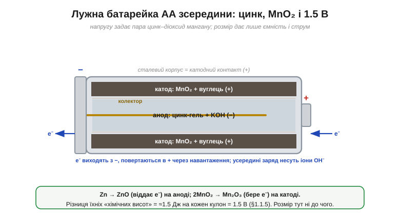

# 🔌 Лужна батарейка AA зсередини: цинк, MnO₂ і чому саме 1.5 В

> Чому хімічний елемент дає рівно близько **1.5 В**? Коротка відповідь: це число задає хімія. Розкриймо, що саме за ним стоїть — на прикладі найпоширенішого джерела на світі, **лужного елемента AA**. Це найнаочніший доказ того, що [вольт](topic:physics/volt) — це енергія на заряд: напругу визначає **реакція**, а не розмір.

### Що всередині


*Розріз лужного елемента. Сталевий корпус — катодний контакт (+); під ним шар MnO₂ з вуглецем (катод), далі сепаратор, а в осерді — цинковий гель у лугу KOH (анод, −) із центральним колектором, що виходить на нижній ковпачок (−). Цинк віддає електрони, MnO₂ їх приймає.*

Сучасний лужний елемент влаштовано «навиворіт» від старих сольових. **Сталевий корпус** є додатним контактом і вкритий зсередини шаром **діоксиду мангану** MnO₂ з вуглецем (це **катод**). Глибше — пористий **сепаратор**, а в самому осерді — гель із **цинкового** порошку, просоченого лугом — **гідроксидом калію** KOH (це **анод**). Центральний латунний **колектор** збирає струм з анода й виходить на нижній ковпачок — від'ємний контакт. «Лужною» батарейку звуть саме через лужний електроліт KOH.

### Що відбувається

Поки кола нема, елемент просто стоїть. Замкни коло — і починаються дві хімічні реакції на двох електродах:

```
анод  (−):  Zn + 2OH⁻  →  ZnO + H₂O + 2e⁻     (цинк ВІДДАЄ електрони)
катод (+):  2MnO₂ + H₂O + 2e⁻  →  Mn₂O₃ + 2OH⁻ (MnO₂ ПРИЙМАЄ електрони)
```

Електрони, що їх вивільнив цинк, не можуть пройти крізь електроліт — вони мусять оббігти **зовнішнім колом** (через ваше навантаження) від − до +. А всередині елемента коло замикають **іони** OH⁻, які снують між електродами — це той самий [іонний струм](topic:physics/ionic-conduction). Цинк поступово «згоряє» на ZnO, MnO₂ перетворюється на Mn₂O₃ — і коли реагенти вичерпуються, батарейка «сідає».

### Чому саме 1.5 В

Ось головне. Кожен електрон, перестрибуючи від цинку до MnO₂, **падає** на фіксовану хімічну «сходинку» енергії — різницю електрохімічних потенціалів цих двох пар. Ця енергія-на-електрон, переведена в джоулі на кулон, і є **≈1.5 В**. Вона **вшита в саму реакцію** Zn–MnO₂ й не залежить ні від розміру, ні від форми. Тому **AA, AAA, C і D — усі дають 1.5 В**: більший елемент просто містить **більше** цинку та MnO₂, тож тримає більше заряду (ємність, мА·год) і віддає більший струм — але «висота» на кожен кулон та сама. Розмір — це про кількість енергії, а вольти — про її якість.

### Числа й межі

- Свіжий елемент дає ~1.6 В, під час роботи тримає близько 1.5 В, а «сівши», просідає до ~0.9 В. Ємність AA — десь 2000–3000 мА·год.
- У міру розряду росте [**внутрішній опір**](topic:electronics/internal-resistance), тож під навантаженням напруга на клемах помітно просідає.
- Лужний елемент **одноразовий**: реакція майже незворотна, тож «заряджати» його не можна (потече або розпухне).

### Типові граблі

- **Витік.** Стара чи переразряджена батарейка пускає назовні їдкий KOH — білі кристали на контактах, що роз'їдають прилад. Не лишай «мертві» елементи в пристрої.
- **Не мішай старі з новими** (і різні марки) у послідовному стовпчику: слабший елемент тягне решту вниз і може потекти.
- Послідовно напруги додаються (3×1.5 = 4.5 В), паралельно — додається ємність.

### Варіації

Дешевший **сольовий** (цинк-вугільний) елемент дає теж ~1.5 В, але менше струму й ємності. Акумуляторний **NiMH** того ж розміру AA видає лише **1.2 В** — інша хімія, інша «висота» на електрон (це варто пам'ятати: 1.2 проти 1.5 В на елемент). А літієвий первинний AA дає 1.5 В, але легший і краще тримає на морозі й у запасі.
