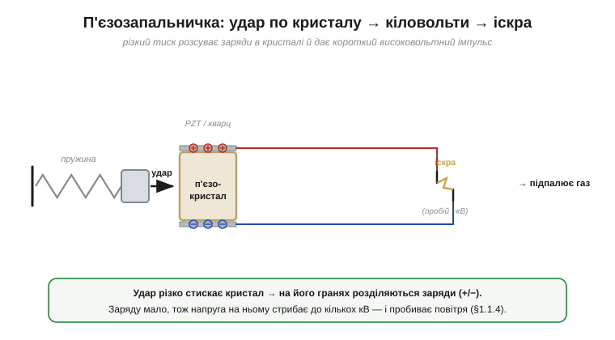

# 🔌 П'єзозапальничка: кіловольти з удару по кристалу

Висока напруга може нести зовсім мало енергії: [вольт — це джоуль на кулон](book:physics/volt), тож статика б'є кіловольтами, та лише лоскоче. Найдешевший спосіб дістати ті кіловольти — **без жодної батареї**, просто стукнувши по кристалу. Це п'єзозапальничка, що клацає в кожній газовій плиті, кухонній запальничці й мангалі.

### Що це й навіщо

Це **п'єзоелектричне джерело високовольтного імпульсу**: перетворює різкий механічний удар на короткий спалах у кілька кіловольтів, який пробиває повітряний проміжок іскрою й підпалює газ. Жодного живлення не треба — енергію дає сама ваша рука, що натискає на кнопку.

### П'єзоефект — серце пристрою

В основі — [**п'єзоелектричний ефект**](book:physics/piezoelectric-effect) (*piezoelectric effect*), відкритий 1880 року братами **П'єром і Жаком Кюрі** (*Pierre & Jacques Curie*): деякі кристали (кварц, а в техніці — кераміка **PZT**, цирконат-титанат свинцю) при механічному стиску **розділяють заряд** на своїх гранях. Стиснули кристал — на одному боці виступив **+**, на протилежному **−**, тобто з'явилася напруга. Що різкіший і сильніший тиск, то більший імпульс. По суті, це перетворювач: **механічна енергія → електрична**.

### Як побудована й працює

*Рис. Підпружинений молоточок різко б'є по кристалу. Раптовий стиск розсуває заряди на гранях (+/−); напруга стрибає до кількох кіловольтів і [пробиває](book:physics/air-breakdown) іскровий проміжок, підпалюючи газ.*

Натиснута кнопка зводить пружину, а тоді **зривається** — підпружинений молоточок різко б'є по кристалу. Раптовий стиск виштовхує заряди на електроди його граней. Заряду при цьому **дуже мало**, тому напруга на кристалі підскакує аж до кількох **кіловольтів** (багато [вольтів = багато джоулів на кожен крихітний кулон](book:physics/volt) — хоча сама енергія мізерна). Дротики ведуть цю напругу до маленького **іскрового проміжку**; поле в ньому переходить [межу пробою повітря](book:physics/air-breakdown) (~3 кВ/мм), і між вістрями проскакує **іскра**, що й запалює газ.

### Числа й межі

- Імпульс — кілька кіловольтів, але **дуже короткий**, із мізерною енергією (порядку міліджоуля) і крихітним зарядом. Саме тому клац-іскра вам не шкодить — як і статика: [кіловольти, та мізер джоулів на кулон](book:physics/volt), лише лоскоче.
- Це **одноразовий імпульс**, а не стале чи точне джерело напруги: одне натискання — одна іскра.

### Типові граблі

- **Механічне спрацювання.** Пружина й молоточок зношуються за десятки тисяч клацань — звідси «запальничка перестала іскрити».
- **Проміжок вирішує все.** Завеликий зазор — іскри не буде; жир, нагар чи волога на вістрях — осічка. Чистий, правильно виставлений проміжок обов'язковий.
- **Не джерело напруги.** Не чекайте від неї рівних повторюваних вольтів — це імпульс, а не стабілізоване живлення.

### Варіації й зворотний бік

Той самий ефект, пущений **навпаки** (подати напругу — кристал деформується), дає п'єзовипромінювачі: пищалки, ультразвукові випромінювачі, точні п'єзоактуатори. А якщо читати з кристала **напругу від вібрації** — він стає давачем (мікрофони, давачі детонації в двигуні). Один матеріал — три ролі: запальничка, актуатор, давач.
