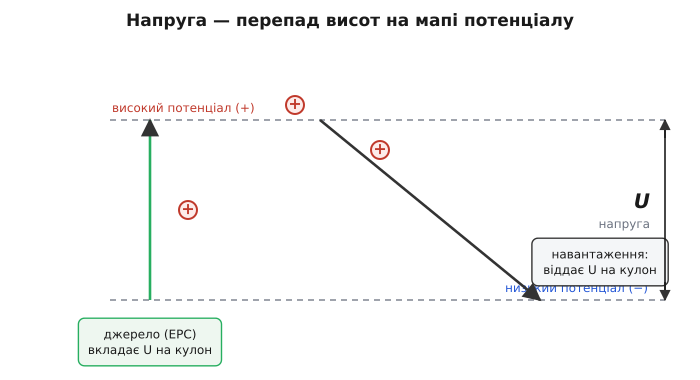
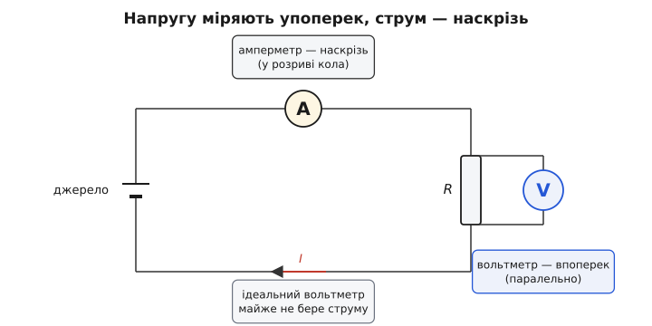

# Напруга — енергія, яку несе кожен заряд

<preknowlist>
- [Заряд](topic:physics/electric-charge) — що таке електричний заряд, додатний і від'ємний, і що саме він є носієм у колі.
- [Електричне поле](topic:physics/electric-field) — поле діє на заряд силою; всередині кола воно напрямлене від «плюса» до «мінуса».
- [Потенціал](topic:physics/electric-potential) — енергетичний «стан» заряду залежно від того, де він у полі.
- [Механічна робота](topic:physics/work) — робота сили дорівнює енергії, переданій тілу при переміщенні.
- [Потенціальна енергія](topic:physics/potential-energy) — запас енергії, що залежить від положення (потрібен для аналогії з висотою).
</preknowlist>

Ми звикли міряти електрику у вольтах, майже не питаючи, що саме міряємо. Батарейка «на 9 вольтів», розетка «на 230», USB «на 5». Та спитаймо прямо: що таке цей «вольт», якого в батарейці рівно дев'ять? Це не запас електрики (запас — то заряд, кулони) і не її потік (потік — то струм, ампери). Візьмімо два однакові дроти: один — під напругою 5 В, другий — 0 В. Придивіться до кожного окремо — вони не різняться нічим: ті самі атоми, ті самі електрони, жодної видимої познаки. Напруга — не речовина в дроті. Вона взагалі не належить одній точці. Це **співвідношення між двома точками**, і поки ми не назвемо обидві, слово «напруга» лишається неповним.

### Робота, щоб перенести заряд

Звідки ж береться це співвідношення? З роботи. Щоб перенести пробний заряд q з однієї точки в іншу проти [електричного поля](topic:physics/electric-field), треба виконати роботу — так само, як підняти камінь угору проти тяжіння. Поле тягне заряд у свій бік; ідучи проти, ми вкладаємо енергію, і вона не зникає, а запасається в заряді як [потенціальна енергія](topic:physics/potential-energy), готова повернутися, щойно заряд відпустять назад.

Тут криється ключ. Візьмімо вдвічі більший заряд — і поле тягне його вдвічі сильніше, тож і роботи треба вдвічі більше. Робота W росте рівно пропорційно зарядові q, а їхнє відношення W/q лишається тим самим — хоч би який заряд ми несли. Це відношення вже не залежить від заряду: воно каже щось про самі **дві точки**, про поле між ними. Його й називають **напругою** (лат. *tensio* — натяг; англ. *voltage*, позначають U або V):

```
U = W / q
```

Напруга між двома точками — це робота на одиницю заряду, потрібна, щоб перенести заряд з однієї в іншу.

Звідси одразу й одиниця. Якщо роботу міряти в джоулях, а заряд — у кулонах, то напругу — в **джоулях на кулон**; цю комбінацію назвали [вольтом](topic:physics/volt) (на честь Алессандро Вольти): 1 В = 1 Дж/Кл. Отже «9 вольтів» — не метафора й не марка: це буквально дев'ять джоулів, які джерело віддає **кожному кулону**, що проходить крізь коло. П'ять вольтів на USB — п'ять джоулів на кулон. Напруга — це цінник енергії, наклеєний на одиницю заряду.

**Приклад (енергія, віддана зарядові).** Крізь пристрій, живлений від 5 В, пройшов заряд 2 Кл. Скільки енергії він забрав?

```
W = U · q = 5 В · 2 Кл = 10 Дж
```

Ці 10 джоулів перетворилися на тепло, світло чи рух — залежно від пристрою. Напруга сказала, скільки енергії припадає на кулон; заряд сказав, скільки кулонів пройшло; добуток — уся віддана енергія.

### Завжди — між двома точками

Чому напругу неодмінно беруть між двома точками, а не «в одній»? Бо фізичний зміст має лише **різниця**. Уявіть висоту: сказати «ця точка на висоті 300» — беззмістовно, поки не домовились, звідки лічити: від підлоги, від рівня моря, від центру Землі. Сама висота довільна; що реальне — це **перепад** висот, бо саме він вирішує, скільки енергії вивільнить падіння. Так само й [потенціал](topic:physics/electric-potential): його нуль обирають довільно, і фізична лише **різниця потенціалів** між двома точками. Цю різницю й звуть напругою.

Тому в техніці домовляються про спільну точку відліку — «землю», нуль вольтів, — і всі напруги міряють від неї. Коли кажуть «на цьому виводі 5 В», мовчазно домислюють «відносно землі». А варто змінити точку відліку — і всі числа зсунуться на ту саму величину, та жодна **різниця** не зміниться: фізика лишиться та сама.

Звідси знаменитий парадокс птаха на дроті. Птах сидить на голому проводі під 10 000 В і цілий, бо обидві його лапки на **одному** проводі — між ними різниці потенціалів майже нема. Немає напруги впоперек птаха — немає причини струмові текти крізь нього. Небезпечним провід стане тієї миті, коли птах дотягнеться до другого проводу чи до землі: ось тоді між двома точками його тіла з'явиться напруга — і піде струм.

### Напруга жене струм

Дотепер напруга стояла в спокої — між двома точками, до яких нічого не під'єднано. З'єднаймо ці точки провідником — і енергія, запасена в перепаді, дістане вихід. Різниця потенціалів налагоджує вздовж дроту [електричне поле](topic:physics/electric-field), поле діє на кожен вільний електрон силою, і електрони рушають — це [дрейф](topic:physics/electron-drift), а напрямлений дрейф і є [струм](topic:physics/electric-current). Кожен кулон, проходячи від «плюса» до «мінуса», ніби скочується з висоти напруги вниз і віддає по дорозі свої U джоулів: у резисторі — теплом, у лампі — світлом, у моторі — рухом.


*Напруга — як перепад висот на мапі потенціалу. Джерело (ЕРС) підіймає кожен кулон на «висоту» U, вкладаючи в нього енергію; проходячи колом униз, той самий кулон віддає ці U джоулів навантаженню. Різниця «висот» між двома точками і є напруга між ними: U = W/q.*

Аналогія з висотою тут майже точна, з однією поправкою: додатний заряд справді «падає» з високого потенціалу на низький, а от електрон, бувши від'ємним, котиться навпаки — «вгору» за потенціалом, бо сила на нього обернена. Напрямок енергії від цього не міняється: заряд однаково віддає її колу.

Скільки ж потече? Це вирішує не сама напруга, а вона разом з опором шляху — [закон Ома](topic:electronics/ohms-law): I = U/R. Звідси однонапрямленість, яку варто закарбувати: ми **прикладаємо напругу**, а струм — то вже **відповідь** кола. Тому й кажуть «подати 5 В», а не «подати струм». І звідси корисна асиметрія: напруга може існувати без струму, а звичайний струм без напруги — ні. Батарейка на полиці тримає повну напругу на клемах, та поки коло розімкнене, струму нема — сама лише готовність. (Виняток єдиний — [надпровідник](topic:physics/superconductivity), де опору нема зовсім: раз запущений струм тече в ньому без жодної напруги.)

### Звідки береться напруга: розділити заряди

Лишається найглибше питання: звідки напруга береться взагалі? Щоб між двома точками з'явився перепад потенціалу, треба **розвести** додатний і від'ємний заряди — відтягти їх один від одного проти взаємного притягання. А це, знову-таки, робота, енергія. Отже, напруга не виникає сама: щось мусить її **накачати**, розділяючи заряди й тримаючи їх нарізно.

Пристрій, що виконує цю роботу розділення, звуть джерелом, а його здатність — **електрорушійною силою** (ЕРС). Назва історична й трохи оманлива: ЕРС — не сила в ньютонах, а та сама енергія на кулон, ті самі вольти, які джерело **додає** кожному зарядові, підіймаючи його на висоту потенціалу. Звідки джерело бере на це енергію — залежить від типу: батарея — з хімічної реакції на електродах, генератор — з механічного обертання в магнітному полі, сонячна панель — зі світла, термопара — з різниці температур. Усі роблять одне: перетворюють якусь енергію на розділення зарядів, тобто на напругу.

Саме тут електрика вперше здобула стале джерело — і сталося це у спорі. Наприкінці 1780-х болонський лікар Луїджі Ґальвані помітив, що лапка мертвої жаби сіпається, коли її торкаються двома різними металами, і виснував, що електрика «тваринна», живе в самій тканині. Алессандро Вольта, фізик із Павії, не погодився: він показав, що причина — **контакт двох різних металів** через вологу, а жаба лише слугує надчутливим покажчиком. Щоб довести це без жодної тканини, Вольта 1800 року склав стовп із чергованих кружалець цинку й міді, перекладених намоченим у розсолі сукном, — і дістав перше джерело **сталої** напруги, вольтів стовп, прабатька батареї. Так народилася хімічна ЕРС. Обидва мали рацію почасти: Вольта — щодо цього досліду й батареї, а Ґальванієва здогадка про електрику в живій тканині згодом теж підтвердилася — нерви й м'язи справді працюють на електричних імпульсах. На честь Вольти 1881 року міжнародний з'їзд електриків у Парижі назвав одиницю напруги **вольтом**.

> 🔧 **Навіщо це.** Напруга на клемах реального джерела під навантаженням трохи **менша** за його ЕРС: частину «з'їдає» [внутрішній опір](topic:electronics/internal-resistance) самого джерела, на якому теж падає напруга, щойно піде струм. Тому ЕРС — це напруга «на холостому ходу», без навантаження; під навантаженням маємо менше, і що більший струм — то помітніше «просідання» (через це акумулятор під важким навантаженням показує нижчу напругу).

### Як напругу міряють: упоперек, не наскрізь

Якщо напруга — це різниця між двома точками, то й вимірювати її треба, торкнувшись **обох** водночас. Вольтметр під'єднують **паралельно** ділянці — «впоперек» неї, від однієї точки до другої; він читає перепад між своїми двома щупами. Цим напруга принципово різниться від струму: струм міряють **наскрізь**, увімкнувши амперметр у розрив кола, щоб той самий потік пройшов крізь нього, — а напругу міряють **збоку**, нічого не розриваючи.


*Напругу міряють упоперек ділянки: вольтметр торкається двох точок паралельно й читає різницю між ними, майже не пропускаючи струму (великий власний опір). Струм натомість міряють наскрізь — амперметром у розриві кола. Тому вимір напруги не потребує нічого розмикати.*

Але тут пастка. Якби вольтметр сам пропускав крізь себе помітний струм, він відгалузив би частину заряду й тим **змінив** би саму напругу, яку взявся міряти. Тому добрий вольтметр мусить бути майже «глухим» для струму — з якомога більшим власним опором (ідеальний — нескінченним, реальні — мегаоми). Тоді він лише «підглядає» різницю потенціалів, майже не чіпаючи кола. Ось чому вимір напруги, на відміну від виміру струму, звичайно не потребує нічого розмикати: приклав два щупи — і прочитав.

### Напруги додаються вздовж шляху

Оскільки напруга — це енергія на кулон, а енергія додається, то й напруги вздовж шляху **складаються**. Дві батарейки по 1.5 В, з'єднані одна за одною (плюс до мінуса), підіймають кулон двічі поспіль — виходить 3 В: так набирають вищу напругу з кількох джерел. І навпаки, обходячи будь-яке замкнене коло по колу й повернувшись у ту саму точку, ми маємо повернутися до того самого потенціалу — тож усі підйоми (на джерелах) точно врівноважують усі спади (на навантаженнях). Це просто [збереження енергії](topic:physics/energy-conservation) для заряду, записане мовою напруг.

Той самий закон додавання працює і в зворотний бік — ділить напругу. Пустіть струм крізь два послідовні резистори: повна напруга розподілиться між ними пропорційно опорам, і з середньої точки можна зняти будь-яку меншу частку — це [дільник напруги](topic:electronics/voltage-divider), найпростіший спосіб дістати потрібні, скажімо, 3.3 В там, де є 5 В. А джерела однакової напруги, з'єднані **паралельно** (плюс до плюса), напруги не додають — вона лишається тією самою, зате вони разом можуть віддати більший струм.

### Змінна напруга

Досі напруга в нас стояла стала — один знак, один напрямок. Але вона не мусить такою бути. У побутовій мережі напруга **гойдається**: то додатна, то від'ємна, міняючи знак разів п'ятдесят на секунду. Поле в дроті через це раз у раз обертається, і електрони не дрейфують невпинно в один бік, а лише сіпаються туди-сюди на місці — це [змінний струм на противагу постійному](topic:physics/dc-vs-ac).

Коли напруга весь час міняється, постає питання: а яке ж її «одне число»? Миттєве значення щомиті інше, від нуля до піка. Тому змінну напругу характеризують [діючим значенням](topic:physics/rms-value) — тією сталою напругою, яка нагрівала б опір так само, як ця змінна. Для звичної синусоїди пік у √2 ≈ 1.41 раза вищий за діюче: коли кажуть «230 вольтів у розетці», це діюче значення, а миттєва напруга сягає піків близько ±325 В.

### Стеля напруги: пробій

У напруги є й верхня межа — не в самому джерелі, а в тому, що її оточує. Наростіть напругу між двома провідниками, розділеними ізолятором (повітрям, пластиком), — і поле в проміжку робиться дедалі сильнішим. Досягнувши певного порога, воно почне **виривати** електрони з атомів ізолятора, той раптово стане провідним, і крізь нього проскочить іскра чи дуга — це [пробій діелектрика](topic:physics/dielectric-breakdown). Повітря пробивається приблизно на 3 мільйонах вольтів на метр (3 кВ на міліметр): та сама іскра з пальця на дверну ручку взимку — це локальний пробій міліметрового проміжку, а блискавка — той самий пробій, тільки на кілометри.

> 🔧 **Навіщо це.** Через цю межу кожен ізолятор має свою робочу напругу, а в конструюванні лишають проміжки між доріжками й контактами тим ширші, чим вища напруга: замало відстані — і вона колись «проб'ється» іскрою там, де на те не чекали.

> 🔧 **Навіщо це.** Небезпечною людину робить струм крізь тіло, а жене цей струм саме напруга. Суха шкіра має опір близько сотні кілоомів, тож кілька вольтів проженуть крізь неї мізерний, нечутний струм — тому батарейку 1.5 В можна взяти голіруч. Але сотні вольтів (чи волога шкіра, що падає до кількох кілоомів) уже проштовхнуть небезпечний струм — тому висока напруга смертельна, хоч «вольт» у ній тієї самої природи, що й у батарейці. Докладніше — [електробезпека](topic:physics/current-safety).

---

Отже, за всіма обличчями напруги стоїть одне число — енергія на кожен кулон. Воно каже, скільки джоулів понесе заряд між двома точками, — і з цього однісінького сенсу випливає все інше: що напруга жене струм (заряд скочується з висоти й віддає енергію), що міряють її впоперек (це різниця між точками), що дає її джерело (накачує енергію, розділяючи заряди), що додається вона вздовж кола (енергії складаються) і що має стелю (задуже поле рве ізолятор). Напруга — мовби мапа висот, накреслена електричним полем: кожне коло — це заряд, що скочується її схилами, а різниця висот між входом і виходом і є те, що ми звемо напругою. Щоб цей спуск тривав, а не згас за мить, зарядові потрібен ще й [замкнений шлях назад до джерела](topic:physics/closed-circuit) — та це вже про коло, а не про саму напругу.
