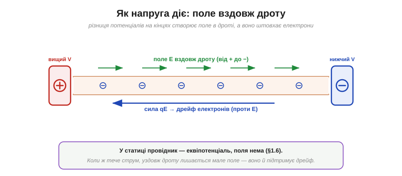

# Напруга — причина струму

Струм можна довго описувати з боку його поведінки: він тече, не витрачається, дрейфує повільно, реагує майже миттєво. Та лишається головне питання: **що його спричиняє**? Чому заряд узагалі рушає? Відповідь коротка й фундаментальна: струм породжує **напруга** (лат. *tensio* — натяг; англ. *voltage*, U). Без різниці потенціалів сталого струму не буває — а є вона, і заряд тече. Цей причинний зв'язок — серце всієї електротехніки, тож розберімо його до кінця.

### Ланцюг причин: від напруги до струму

Напруга й струм пов'язані не «на рівних» — між ними є чіткий напрямок **причинності**: напруга є **причиною**, струм — **наслідком**.


*Ланцюг причин: ЕРС джерела підтримує **напругу** (різницю потенціалів), та створює **поле** в дроті, поле діє **силою** qE на вільні електрони, ті набувають **дрейфу** — і це є **струм**. Прибери напругу — і все праворуч від неї зникне: струму не стане.*

Цю послідовність варто закарбувати: **ЕРС → напруга → поле → сила → дрейф → струм**. Вона зшиває [електричне поле](book:physics/electric-field) й [потенціал](book:physics/electric-potential) із [дрейфом](book:physics/electron-drift) носіїв в один причинний ланцюжок. І вона однонапрямлена: ми **прикладаємо напругу**, а коло **відповідає струмом** — не навпаки.

Звідси корисна асиметрія: **напруга може існувати без струму, а струм у звичайному провіднику без напруги — ні**. Батарея на полиці має повну напругу на клемах (свою ЕРС), та поки до неї нічого не під'єднано, струму нема — є лише готовність, «висота» без потоку (як піднята вода в баку із закритим краном). А струм без причини-напруги не потече: забери різницю потенціалів — і дрейф згасне за мить. (Єдиний виняток — **надпровідник**, де опору взагалі нема: раз запущений струм тече в ньому роками без жодної напруги.) Тому в діагностиці першим ділом перевіряють саме напругу: є вона — шукають, чому не йде струм; нема — шукають, куди поділася напруга.

### Як саме напруга діє: поле в дроті

Найцікавіша ланка — друга: яким чином «напруга на кінцях» дотягується до електронів усередині дроту? Через **поле**. Різниця потенціалів між кінцями провідника створює вздовж нього [електричне поле](book:physics/electric-field) E, а воно штовхає кожен вільний електрон силою qE — і жене дрейф.


*Напруга на кінцях провідника породжує поле E вздовж нього (напрямлене від «+» до «−»). Це поле діє силою qE на вільні електрони, спричиняючи їхній дрейф (проти E, бо вони від'ємні). Так «напруга на клемах» перетворюється на рух електронів усередині.*

Тут уважний читач помітить уявну суперечність із відомим фактом, що [всередині провідника-еквіпотенціалі поля немає](root:embedded/field-and-potential). Розв'язання просте, але важливе. Те твердження стосувалося **статичної рівноваги** — коли струму немає. А коли струм **тече**, провідник уже не в рівновазі: уздовж нього лишається невелике поле, яке й підтримує [дрейф проти зіткнень](book:physics/electron-drift). Для гарного провідника це поле (а отже, й напруга вздовж нього) мізерне — тому дроти й вважають «безвтратними»; а от на навантаженні (резисторі, лампі) поле й падіння напруги вже значні. Інакше кажучи: де тече струм і є опір — там уздовж шляху неодмінно є поле, бо саме воно й жене заряд.

А звідки взагалі береться це поле **рівно вздовж** дроту, хоч би як його зігнули? Його «ліплять» **поверхневі заряди** — тонкий шар заряду, що сам собою розподіляється по поверхні провідника так, аби всередині поле скрізь ішло вздовж русла дроту й мало потрібну величину (це та сама перебудова, що несе [фронт сигналу](book:physics/signal-speed) вздовж проводів). Дріт неначе сам прокладає поле своїм руслом: куди завернув провідник, туди завертає й поле, що жене електрони.

**Приклад (поле, що жене струм).** На резисторі довжиною 1 см падає напруга 3 В. Яке поле всередині нього жене електрони?

```
E = U / d = 3 В / 0.01 м = 300 В/м
```

Це поле тисне на кожен вільний електрон силою qE і підтримує його дрейф крізь резистор — попри безперервні зіткнення з решіткою.

### Чому струму потрібна *підтримувана* напруга

Чому ж недостатньо просто **один раз** розділити заряди? Бо тоді струм буде лише коротким спалахом. Уявімо заряджений конденсатор (дві пластини з + і −): з'єднай їх дротом — заряд ринеться вирівнювати різницю, та щойно потенціали зрівняються, **усе спиниться**. Різниця зникла — зник і струм.


*Зліва: заряджений конденсатор дає лише **короткий** струм, що швидко спадає до нуля, тільки-но заряди зрівняються. Справа: батарея своєю ЕРС **тримає** різницю потенціалів попри відтік заряду — тому струм **сталий**, поки джерело живе.*

Щоб струм був **тривалим**, різницю потенціалів треба **безперервно поновлювати** — хтось має невпинно «піднімати» заряд назад на висоту, поки коло його «спускає». Цю роботу й виконує джерело.

### ЕРС: джерело як невтомний насос

Здатність джерела підтримувати напругу, женучи заряд проти його природного спаду, називають **електрорушійною силою** (*EMF*, ЕРС). Назва історична й трохи оманлива: ЕРС — це **не сила** в ньютонах, а **енергія на одиницю заряду** (ті самі [вольти](book:physics/volt)), яку джерело **додає** кожному кулону.


*Джерело працює як насос: знов і знов піднімає кожен кулон на потенціал (вкладає в нього енергію — ЕРС ℰ), поки зовнішнє коло цей кулон «спускає», відбираючи енергію. Так підтримується стала напруга, а отже, і сталий струм.*

Звідки джерело бере силу на це «піднімання»? Залежно від типу: батарея — з **хімічної** реакції, генератор — з **механічного** обертання, сонячна панель — зі **світла**. Усі вони роблять одне: перетворюють якусь енергію на електричну, підтримуючи різницю потенціалів. ЕРС — це міра того, **скільки джоулів на кулон** джерело здатне додати.

Водяна аналогія тут особливо влучна: джерело — це насос, що безперервно піднімає воду нагору, звідки вона знову може стікати вниз через коло. Без насоса вода один раз стекла б, рівні зрівнялися б — і потік спинився (точно як той конденсатор). Насос же не дає рівням зрівнятися, тож вода (заряд) кружляє знову й знову. ЕРС — це і є «висота підйому» цього насоса, виміряна у вольтах.

> 🔧 **Навіщо це.** Звідси правильна робоча картина: батарея чи блок живлення — це **джерело напруги**. Ви **задаєте напругу**, а струм — це вже **відповідь** кола на неї (скільки потече, вирішують напруга й опір разом — [закон Ома](book:electronics/ohms-law)). Тому й кажуть «подати 5 В», а не «подати струм»: напругу прикладають, струм виникає. А розімкнений вмикач рве шлях для заряду — ЕРС лишається, та кола нема, тож і струму нема.

> 🔧 **Навіщо це.** Важлива тонкість: напруга на клемах реального джерела під навантаженням трохи **менша** за його ЕРС — частина «з'їдається» на [внутрішньому опорі](book:electronics/internal-resistance) самого джерела (через це акумулятор «просідає» під великим струмом). Тому ЕРС — це напруга джерела «на холостому ходу», а під навантаженням маємо трохи менше.

Варто наголосити й на зворотному боці причинності: якщо напрузі **не чинити опору**, струм може стати небезпечно великим. З'єднай клеми джерела товстим дротом майже без опору — і та сама напруга пожене крізь нього велетенський струм (за [законом Ома](book:electronics/ohms-law) I = V/R при R → 0 струм прямував би в нескінченність — це ідеалізація: насправді його обмежують [внутрішній опір джерела](book:electronics/internal-resistance), опір дротів і захист). Це **коротке замикання**: джерело й дроти перегріваються, бо вся енергія виділяється на мізерному опорі. Саме тому ланцюжок «напруга → струм» завжди мусить мати в собі опір, що його обмежує, — а від необмежених струмів коротких замикань рятують запобіжники.

---

Отже, струм спричиняє **напруга** — і причинність тут однонапрямлена: ЕРС → напруга → поле в дроті → сила qE → дрейф → струм. Напруга діє на електрони через **поле** вздовж провідника, а уявна суперечність із «провідник-еквіпотенціаль» знімається тим, що еквіпотенціаль — це про статику, а тут тече струм. Щоб струм був тривалим, напругу треба **підтримувати** — це й робить **ЕРС** джерела, додаючи кожному кулону енергію, наче невтомний насос. Але самої причини мало: струму потрібен ще й шлях — [замкнена петля](book:physics/closed-circuit), бо в розірваному колі заряд не пройде, хоч би яка напруга стояла на клемах.

---
