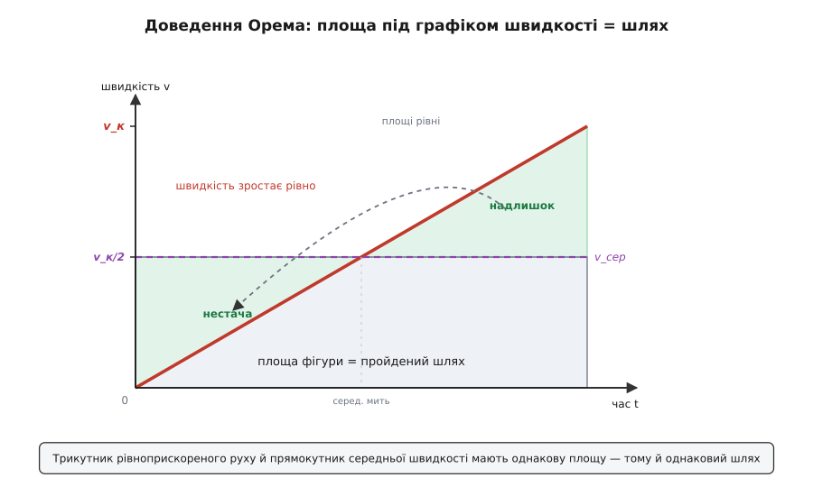
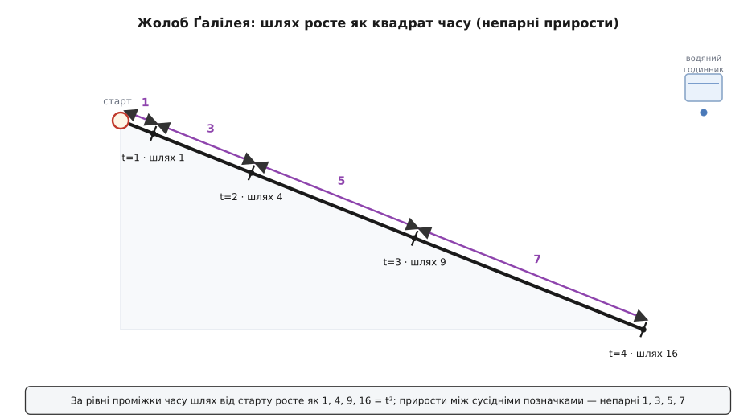

# 📜 Як прискорення стало числом: калькулятори з Мертона, трикутник Орема й жолоби Ґалілея

> Це історія не про те, «хто вивів a = Δv/Δt» — такої формули тоді не було й близько. Це історія про те, як людство, що тисячоліттями вправно оперувало **швидкістю**, аж до XIV століття не мало способу вхопити числом її **зміну**. І як цей спосіб нарешті народився: спершу як хитромудрий словесний доказ у стінах оксфордського коледжу, потім як **малюнок** у Франції — графік, накреслений майже за три століття до того, як для графіків узагалі винайшли координати, — і лише ще через двісті років ліг на справжні падаючі тіла під руками Ґалілея. Чотири країни, три століття, і — що важливо — жоден єдиний герой.

Швидкість людина приручила давно. Погонич знав, що подвоєний час у дорозі при тій самій прудкості дає подвоєний шлях; купець рахував, за скільки днів валка подолає стільки-то стадій. Рівномірний рух — прудкість, помножена на час, — був зрозумілий і арабським астрономам, і грецьким геометрам. А от **прискорення** — рух, у якому сама прудкість щомиті інша, — упиралося. І впиралося не через брак спостережливості: кожен бачив, що камінь падає дедалі швидше, що віз розганяється з гори. Річ була глибша.

## Чому «зміну швидкості» так важко було вхопити

Уяви, що ти живеш до всякої алгебри й до всяких графіків. Тобі кажуть: тіло рухається так, що його швидкість весь час різна. Питання: **який шлях воно пройде?** Помножити швидкість на час не вийде — котру швидкість брати, якщо їх безліч, по одній на кожну мить? Спробуєш узяти «якусь середню» — а що це взагалі означає, коли швидкість тече без упину? Немає ні поняття миттєвої швидкості (швидкість «саме зараз», коли за «зараз» не встигаєш пройти жодного шляху), ні способу скласти незліченну хмару різних швидкостей в один-єдиний шлях. Задача просто не мала мови, якою її можна поставити.

Середньовічні мислителі підступали до неї збоку — через те, що звали **інтенсифікацією й послабленням форм** (лат. *intensio et remissio formarum*). «Форма» тут — будь-яка якість, що буває сильнішою чи слабшою: тепло тіла, яскравість світла, милосердя душі… і швидкість руху. Питали абстрактно: якщо якась якість весь час наростає — як виміряти її «сукупну дію» за проміжок? Швидкість була для них лише окремим випадком цього загального питання про «широту форм» (*latitudo formarum*) — наскільки якість розтягнута між слабким і сильним краєм. Звучить як схоластична гра словами — та саме з цієї гри й проросло поняття прискорення. Бо той, хто навчиться складати змінну якість у сукупну дію, тим самим навчиться складати змінну швидкість у пройдений шлях.

## Калькулятори з Мертона: рух, розібраний самими словами

Перший прорив стався в Оксфорді, у Мертон-коледжі, у другій чверті XIV століття. Гурток тамтешніх учених згодом прозвали **калькуляторами** (лат. *calculatores* — обчислювачі) — не за те, що вони багато рахували числами (радше навпаки), а за саму зухвалу віру, що рух і зміну можна розібрати **точно**, мовою мір і відношень, а не туманних Арістотелевих категорій.

Заклав цей підхід **Томас Бредвардін** (*Thomas Bradwardine*, бл. 1290–1349), якого звали Doctor Profundus — «глибокий учитель». У «Трактаті про відношення швидкостей у рухах» (*Tractatus de proportionibus velocitatum in motibus*, 1328) він узявся за геть іншу задачу — як швидкість залежить від співвідношення рушійної сили й опору, — і відкинув просту Арістотелеву відповідь, запропонувавши власний, математично витончений закон. Сам той закон нині цікавий хіба історикам; важить інше — Бредвардін **задав тон**: про рух відтепер говорили формулами відношень, а не словами «більше-менше». (Доля його склалася трагічно й символічно: 1349 року він став архієпископом Кентерберійським — і за кілька тижнів помер від чуми, що якраз викошувала Європу.)

А от саме **правило середньої швидкості** — те, з якого й почнеться поняття рівноприскореного руху, — уперше чітко сформулював інший мертонець, **Вільям Гейтсбері** (*William Heytesbury*, бл. 1313–1372/73). У «Правилах розв'язування софізмів» (*Regulae solvendi sophismata*, 1335) він висловив думку, яку варто прочитати повільно:

> тіло, що рухається рівномірно прискорено, проходить за даний час **рівно стільки ж**, скільки пройшло б тіло, що весь той час рухається сталою швидкістю, яка дорівнює його швидкості **в середню мить** проміжку.

Ось воно — **Мертонове правило** (*Merton rule*). Розберімо, чому воно таке глибоке. Швидкість наростає рівно, від початкової до кінцевої. Гейтсбері каже: щоб знайти шлях, не треба морочитися з усією хмарою проміжних швидкостей — досить узяти **одну**, ту, що якраз посередині наростання (а вона ж і є середнє арифметичне початкової та кінцевої), і вдати, ніби тіло весь час ішло тільки нею. Надлишок швидкості у другій половині руху **точно** компенсує її нестачу в першій. Якщо рух починається зі спокою, середня швидкість — це просто половина кінцевої:

```
шлях (рівноприскорений) = шлях (рівномірний зі швидкістю v_сер)
       v_сер = (v₀ + v_к) / 2          ← швидкість у середню мить
з нуля: v₀ = 0  →  v_сер = v_к / 2  →  шлях = ½ · v_к · t
```

Вдумайся, чого тут немає. Немає жодного графіка. Немає алгебри в нашому розумінні — усе це доводили **словами** й арифметичними прикладами, розбираючи гіпотетичні рухи «в уяві» (*secundum imaginationem*). Немає жодного досліду — калькуляторам і на думку не спадало щось кидати чи котити; вони розбирали не природу, а **саму логіку** рівномірної зміни. І немає ще однієї речі: у Гейтсбері вже прозирає поняття **миттєвої швидкості** — швидкості в окрему мить, — без якого про прискорення взагалі не поговориш. Разом зі Свайнсхедом (*Richard Swineshead*, діяв 1340–1354, автор велетенської «Книги обчислень», *Liber calculationum*, — його так і звали «Калькулятор») і Дамблтоном (*John Dumbleton*, бл. 1310–бл. 1349) Гейтсбері зробив те, чого не змогли тисячоліття до них: **розчепив** рух на швидкість і зміну швидкості й показав, що зі зміною можна поводитися так само точно, як зі сталою величиною.

Правило вони мали. Але доведення в них було словесне, важке, майже нечитне сьогодні. Побачити, **чому** воно правдиве, — цього ще бракувало.

## Трикутник Орема: доведення, яке видно оком

Побачити дав француз. **Нікола Орем** (*Nicole Oresme*, бл. 1320–1382) — нормандець, родом із-під Кана, вихованець і згодом великий магістр Наваррського колегіуму в Парижі, радник короля Карла V, під кінець життя єпископ Лізьє — був одним із найгостріших умів свого віку. І він зробив крок, від якого й досі перехоплює подих своєю простотою.

Орем сказав: намалюймо зміну. Проведімо горизонтальну лінію — це **час**. У кожній точці цієї лінії підіймімо вертикальний відрізок такої висоти, яка дорівнює **швидкості** саме в цю мить. З'єднаймо верхівки — і вся зміна швидкості обернеться на **геометричну фігуру**. Він звав такі малюнки *конфігураціями* (лат. *configuratio* — обрис), а виклав це в «Трактаті про конфігурації якостей і рухів» (*Tractatus de configurationibus qualitatum et motuum*, близько 1350-х).

Тепер найголовніше. Якщо рух рівномірний, усі відрізки однакові — фігура виходить **прямокутником**, і його площа (основа-час × висота-швидкість) — це рівно пройдений шлях. А якщо швидкість наростає рівно від нуля, верхівки шикуються **по прямій похилій лінії**, і фігура стає **прямокутним трикутником**. І Орем побачив те, що для нас тепер очевидне, а тоді було одкровенням: **площа цього трикутника — і є пройдений шлях**.

А раз так, Мертонове правило доводиться однією картинкою. Трикутник рівноприскореного руху й прямокутник, збудований на тій самій основі заввишки в **половину** кінцевої швидкості (тобто на середній швидкості), мають **однакову площу**. Чому? Бо трикутничок, що стирчить над серединною лінією у другій половині руху, точнісінько дорівнює порожньому куточку під нею в першій половині — перенеси один у інший, і трикутник складеться в прямокутник. Надлишок і нестача швидкості гасяться не на словах, а **на очах**.


*Доведення Орема одним малюнком. Час — уздовж, швидкість — угору; площа фігури дорівнює пройденому шляху. Рівномірне наростання швидкості дає трикутник, а рівномірний рух зі середньою швидкістю (v_к/2) — прямокутник на тій самій основі. Виступ трикутника вгорі праворуч точно дорівнює порожнечі внизу ліворуч — тому їхні площі, а отже й шляхи, однакові. Це вже, по суті, [інтеграл](topic:math/integral): площа під графіком швидкості — накопичений шлях.*

Зупинися на хвилю, щоб оцінити зухвалість зробленого. Орем накреслив **графік** — величину, що залежить від іншої, зобразив висотою над горизонтальною віссю. Це те, що ми тепер звемо декартовими координатами й малюємо змалку не задумуючись. Але **аналітичної геометрії ще не існувало**: Рене Декарт (*René Descartes*) видасть свою «Геометрію» (*La Géométrie*) аж 1637 року, а П'єр де Ферма (*Pierre de Fermat*) розроблятиме свій варіант тоді ж, — майже **за три століття** після Орема. Він малював графіки до того, як для них винайшли осі. Ба більше — прирівнявши шлях до площі під кривою швидкості, Орем намацав саме зерно того, що згодом стане **інтегральним численням**: площа під графіком величини — це накопичення того, що ця величина дає за одиницю часу.

І — важлива засторога проти міфу єдиного генія. Орем був не сам. Італієць **Джованні ді Казалі** (*Giovanni di Casali*, діяв у середині XIV ст.) у трактаті «Про швидкість руху зміни» (*De velocitate motus alterationis*, близько 1346 року) дав **геометричне зображення** тих самих ідей незалежно — а можливо, й трохи раніше за Орема. Ідея «намалювати зміну як фігуру» витала в повітрі й проросла в кількох головах майже одночасно. Це не применшує Орема, чиє виконання було найповніше й найвпливовіше, — а лише нагадує, що навіть найкрасивіші відкриття рідко належать комусь одному.

## Двісті років тиші — і сміливий здогад де Сото

А тепер — тверезий погляд на те, чого мертонці й Орем **не** зробили. Їхнє правило було теоремою чистої кінематики: **якщо** рух рівномірно прискорений, **то** шлях такий-то. Жодного слова про те, чи існує в природі бодай один такий рух. Падає камінь рівноприскорено? А віз із гори? Мертонці цим не переймалися — вони розбирали абстрактні можливості «в уяві», а не землю під ногами. Прекрасний інструмент лежав готовий — і майже двісті років ніхто не приклав його до реального падіння.

Першим наважився іспанець — домініканець **Домінго де Сото** (*Domingo de Soto*, 1494–1560). У коментарі до Арістотелевої «Фізики» (*Quaestiones super octo libros Physicorum Aristotelis*, надрукований 1551 року) він, розібравши, що таке рух «рівномірно різновидний» (лат. *uniformiter difformis* — той, де швидкість неоднакова, *difformis*, але наростає рівно, *uniformiter*), прямо заявив: саме так — рівномірно різновидно — і рухається **тіло у вільному падінні**. Уперше абстрактна мертонська теорема була припасована до конкретного шматка природи: камінь, що падає, розганяється рівно.

Та відзначмо чесно межу зробленого. У де Сото це був **здогад**, натхнений досвідом, а не виміряний. Він не котив куль, не важив води, не рахував секунд — він **угадав**, що падіння рівноприскорене. Здогад виявився правильним, і це робить йому честь. Але між «правильно вгадати закон» і «показати дослідом, що природа йому кориться», лежить ще ціла прірва — і подолати її випало іншому.

## Ґалілей: від теореми до жолоба

**Ґалілео Ґалілей** (*Galileo Galilei*, 1564–1642) увійшов у цю історію там, де всі попередники спинялися: він **спитав саму природу** — і змусив її відповісти числом.

Задача була пекельна: вільне падіння надто **швидке**, щоб виміряти його тодішніми годинниками. Ґалілеїв хід був геніально простий — **розбавити** тяжіння. Пусти кульку не прямовисно, а по пологому **жолобу** (по-нашому — рівчаку в дошці): рух той самий рівноприскорений, тільки в багато разів повільніший, і його вже можна зловити. Ґалілей узяв гладенько виструганий жолоб завдовжки з добрих п'ять метрів, підняв один кінець, пустив по ньому бронзову кульку — а час міряв **водяним годинником**: зважував воду, що витекла тонким струмком, поки кулька котилася. Скільки води — стільки й часу.

І природа відповіла напрочуд чисто. Ділячи скочування на рівні проміжки часу, Ґалілей побачив, що **шляхи** за ці проміжки відносяться як **непарні числа**: за перший проміжок — 1, за другий — 3, за третій — 5, за четвертий — 7. А це те саме, що сказати: сумарний шлях від старту росте як **квадрат часу** (бо 1, 1+3=4, 1+3+5=9, 1+3+5+7=16 — це 1², 2², 3², 4²).

```
рівні проміжки часу:      1   2   3   4   …
шлях за КОЖЕН окремо:     1   3   5   7   …   ← непарні числа
сумарний шлях від старту: 1   4   9   16  …   ← квадрати часу (t²)
```


*Дослід із жолобом. За рівні проміжки часу кулька докочується до позначок на відстанях 1, 4, 9, 16 — тобто шлях росте як квадрат часу. Відрізки між сусідніми позначками — 1, 3, 5, 7 — це непарні числа, наочний підпис рівноприскореного руху. Похилий жолоб «розбавляє» тяжіння, щоб рух можна було зміряти водяним годинником.*

> 🔧 **Навіщо це.** Закон непарних чисел — не музейна дивина, а робочий інструмент і досі. Хочеш на око перевірити, чи рух **справді** рівноприскорений (падіння, розгін, скочування)? Заміряй шлях за рівні відрізки часу й поглянь, чи стоять вони як 1 : 3 : 5 : 7. Стоять — прискорення стале; збиваються — воно міняється (тертя, опір повітря, змінна сила). Той самий прийом «дивимося на послідовні прирости, а не на саму величину» лежить в основі того, як [похідну](topic:math/derivative) наближають скінченними різницями в будь-якому цифровому давачі руху.

Варто розповісти й про **помилку** Ґалілея — бо вона людяна й повчальна. У листі до венеційця Паоло Сарпі (*Paolo Sarpi*) від 16 жовтня 1604 року Ґалілей уже має правильний закон t² — але **обґрунтовує** його хибним припущенням: буцімто швидкість падіння росте пропорційно до пройденого **шляху** (v ∝ s), а не до **часу** (v ∝ t). Правильний висновок із неправильної засновки! Лише згодом, укладаючи свою велику книгу, він добачив ваду в міркуванні 1604 року й виправив: швидкість наростає рівно **з часом**. Наука не сходить з неба готовою — навіть Ґалілей навпомацки йшов до неї, помиляючись у самій основі й сам себе поправляючи.

Оприлюднив усе це Ґалілей аж наприкінці життя — у «Бесідах і математичних доведеннях про дві нові науки» (*Discorsi e dimostrazioni matematiche intorno a due nuove scienze*, 1638). І тут своя гірка іронія: книжку надрукували не в Італії, а в протестантському Лейдені, у друкаря Ельзевіра, — бо після осуду 1633 року старий, засліплений, посаджений під домашній арешт Ґалілей не мав права видаватися в католицьких землях. Рукопис вивезли за кордон.

А тепер — те, від чого коло змикається. Розділ про рівноприскорений рух у «Бесідах» Ґалілей відкриває **найпершою** теоремою; і ця теорема — слово в слово **Мертонове правило середньої швидкості**, а доводить її Ґалілей **тим самим трикутником площі**, що й Орем за три століття до нього. Чи читав він мертонців і Орема напряму — історики (від Дюема, що обстоював тяглість, до Койре, що наголошував на Ґалілеєвому розриві з минулим) сперечаються досі, і це питання **не розв'язане остаточно**. Та сам факт незаперечний: те, що середньовічні калькулятори сформулювали словами, Орем довів малюнком, а де Сото приписав падінню як здогад, — Ґалілей **зміряв** і поставив наріжним каменем нової науки про рух.

## Хто що зробив — і чому не один герой

Зведімо все докупи — і побачмо, чому цю історію не можна розповісти як «Ґалілей відкрив прискорення». Різні люди зробили **різні за самою природою** речі, і плутати їх — значить не розуміти, як узагалі народжується знання.


*Народження поняття — не подія, а естафета через три століття й чотири країни. Ідея (Мертон), доведення (Орем і Казалі), здогад про природу (де Сото) та дослід (Ґалілей) — окремі роди роботи. Поряд видно, що графік Орема випередив аналітичну геометрію Декарта майже на три сотні років.*

- **Сформулювали ідею** — калькулятори з Мертона (Гейтсбері, 1335; на ґрунті, закладеному Бредвардіном): правило середньої швидкості як теорема чистої кінематики, доведена словами.
- **Довели геометрично** — Нікола Орем і незалежно Джованні ді Казалі (бл. 1346–1350-ті): площа під графіком швидкості = шлях; трикутник = прямокутник середньої швидкості.
- **Здогадалися про природу** — Домінго де Сото (1551): вільне падіння — це і є рівноприскорений рух (інтуїція, без виміру).
- **Поставили дослід** — Ґалілео Ґалілей (жолоби, бл. 1604; книга 1638): реальні тіла й **справді** падають за законом t², і теорема кориться природі.

Мати ідею, довести її, вгадати, що вона справджується в природі, і **показати** це дослідом — чотири зовсім різні звершення. Жодне не важливіше за інше, і жодне саме собою не було б наукою: сама лише теорема Мертона лишилася б логічною вправою, сам лише Ґалілеїв дослід без теорії був би купою цифр. Знання про прискорення склалося аж тоді, коли всі чотири склалися в один ланцюг. Статус усього цього ланцюга в історії науки — **усталений** (докладно задокументований, зокрема в класичній праці Маршалла Клеґета про механіку Середньовіччя); дискусійним лишається хіба одне — наскільки прямо Ґалілей успадкував середньовічну спадщину, а не винайшов її наново.

## Що насправді народилося

За скупим сучасним рядком «прискорення — це темп зміни швидкості» стоїть один із найтяжчих інтелектуальних порогів в історії людства. Аби його переступити, довелося винайти три речі, кожну з яких ми тепер уважаємо самоочевидною: **миттєву швидкість** (величину саме «зараз», хоч за мить не пройдено жодного шляху), **графік** (зміну, накреслену як фігуру) і **площу під кривою як накопичення** (шлях, зібраний із незліченних крихітних порцій «швидкість × мить»).

Ці три винаходи — не просто передісторія прискорення. Це передісторія всього математичного аналізу: за півстоліття по Ґалілеї Ньютон і Ляйбніц зведуть «темп зміни» й «накопичення під кривою» у похідну та [інтеграл](topic:math/integral) — і замкнуть те, що почали калькулятори з Мертона своїм словесним правилом і Орем своїм трикутником. І та скромна діаграма швидкості за часом, яку сьогодні малює кожен школяр, розбираючи розгін чи [вільне падіння](topic:physics/free-fall), — це, лінія в лінію, конфігурація Орема, накреслена за триста років до координат Декарта. Поняття прискорення далося людству так тяжко саме тому, що, приручаючи його, воно принагідно винаходило спосіб мислити про будь-яку зміну взагалі.
