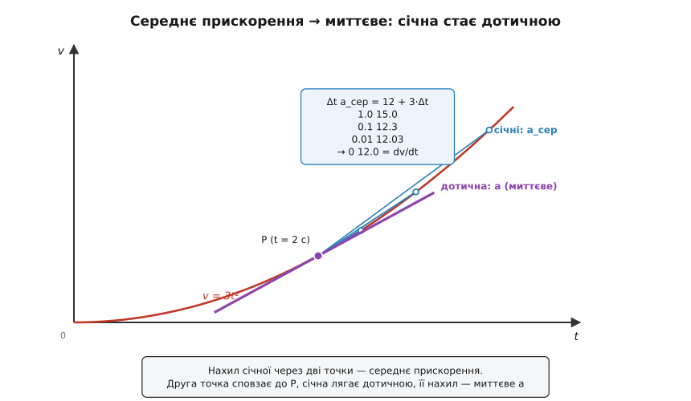
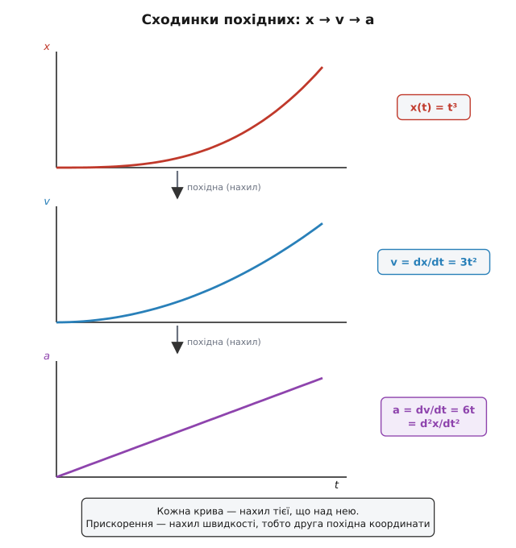
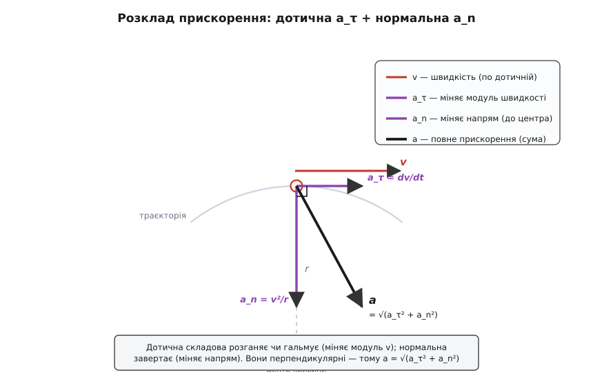

# 🧮 Математика прискорення: границя, друга похідна й розклад на дві осі

Словами прискорення описують одним рядком — «темп зміни швидкості». Але в цьому невинному рядку заховано три різні точні дії, і поки їх не проговорити мовою чисел, залишається туман. По-перше, «темп у цю мить» вимагає **границі** — інакше «мить» не має чіткого сенсу. По-друге, оскільки сама швидкість — уже темп зміни положення, прискорення виходить **похідною похідної**, другою похідною координати. По-третє, щоб із прискорення відновити весь рух, треба вміти ходити ланцюгом причин назад — **інтегрувати**. І, нарешті, оскільки швидкість — вектор, прискорення завжди розпадається на дві перпендикулярні частини, кожна зі своєю роботою. Розберімо всі чотири речі по черзі, кожну — від першопричини, а не як готову формулу.

## Від середнього до миттєвого: чому потрібна границя

Візьмімо буквальне означення. За якийсь проміжок часу Δt швидкість змінилася на Δv; відношення цих двох чисел і є прискорення:

```
a_сер = Δv / Δt
```

Це — **середнє** прискорення за проміжок. Слово «середнє» тут не окраса: усередині проміжку швидкість могла мінятися нерівно — то швидше, то повільніше набирати, — а відношення Δv/Δt усе це змазує в одне усереднене число. Якщо ми хочемо прискорення **саме зараз**, у конкретну мить, а не в середньому за секунду, довкола якої багато що встигло статися, — доведеться проміжок стягувати.

Дивімося, що буде, коли Δt меншає. Нехай телеметрія дає закон швидкості v(t) = 3·t² (м/с) — швидкість, що росте не рівно, а дедалі крутіше. Спитаймо прискорення в мить t = 2 с. Середнє за проміжок від 2 до 2+Δt рахується прямо:

```
a_сер = [3·(2+Δt)² − 3·2²] / Δt = 3·(4·Δt + Δt²) / Δt = 12 + 3·Δt
```

Тепер стягуймо проміжок і дивімося на число:

```
Δt        a_сер = 12 + 3·Δt
1.0       15.000
0.1       12.300
0.01      12.030
0.001     12.003
→ 0       12.000
```

Число не стрибає й не розбігається — воно **прямує до цілком певної межі**, 12. Ось ця межа, до якої тиснеться відношення Δv/Δt, коли проміжок стягується в точку, і є **миттєве прискорення**. Мовою математики це [похідна](book:math/derivative) швидкості за часом — те число, до якого прямує середній темп зміни, коли інтервал усихає до нуля:

```
a = lim(Δt→0) Δv/Δt = dv/dt
```

Запис `dv/dt` читають не як дріб, а як цілісний знак цієї границі: миттєва швидкість зміни v. Наочно це нахил дотичної до графіка v(t) у даній точці: середнє прискорення — нахил **січної**, проведеної через дві точки графіка, а коли друга точка сповзає до першої, січна повертається й лягає **дотичною**, і її нахил — миттєве a.


*Середнє прискорення — це нахил січної через дві точки графіка швидкості. Що ближча друга точка, то положистіша січна, і в границі вона стає дотичною. Нахил цієї дотичної й є миттєве прискорення — те, до чого збігається стовпчик чисел a_сер = 12 + 3·Δt, коли Δt тане до нуля.*

Варто затримати погляд на тому, **чому** ця границя взагалі існує й дає скінченне число. Якби швидкість стрибала розривами, відношення Δv/Δt при малому Δt розліталося б у нескінченність — прискорення в точці розриву не визначене (уявний «миттєвий» удар). Границя існує саме тому, що реальна швидкість міняється гладко: за дуже малий час встигає набігти лише дуже мала зміна, і їхнє відношення тримається біля певного числа. Гладкість руху — не самоочевидність, а фізичне припущення, і воно ж дозволяє говорити про прискорення «в мить».

## Прискорення — друга похідна координати

Тепер згадаймо, що й сама швидкість — не первинна річ. Швидкість є темп зміни **положення**: v = dx/dt, така сама границя, тільки для координати. Підставмо це в означення прискорення:

```
v = dx/dt
a = dv/dt = d(dx/dt)/dt = d²x/dt²
```

Прискорення — похідна від похідної координати, тобто **друга похідна** положення. Запис `d²x/dt²` — просто скорочення для «продиференціюй x за часом двічі». Сенс цієї двоповерховості точний: перша похідна каже, як прудко міняється **місце** (це швидкість), а друга — як прудко міняється те, **як прудко міняється місце**. Прискорення відповідає на питання про зміну зміни.

Це видно на графіках. На графіку координати x(t) швидкість — нахил кривої, а прискорення — її **вигин** (увігнутість): де крива гнеться вгору, там a > 0; де вниз — a < 0; де рівна пряма (стала швидкість) — вигину немає, a = 0. На графіку швидкості v(t) прискорення повертається до простішої ролі — знову нахил.

Простежмо ланцюг на одному законі руху. Нехай координата росте як x(t) = t³ (м, час у секундах). Диференціюймо раз, потім ще раз:

```
x(t) = t³
v = dx/dt  = 3·t²
a = dv/dt  = 6·t  = d²x/dt²
```

У мить t = 2 с це дає x = 8 м, v = 12 м/с, a = 12 м/с² — і, до речі, те саме 12, що виповзло зі стовпчика границь вище, бо там ми брали рівно цей самий закон швидкості v = 3·t². Три величини — місце, темп його зміни й темп зміни того темпу — сплетені в один диференціальний ланцюжок `x → v → a`, де кожна ланка є похідною попередньої.


*Сходинки диференціювання. Координата x(t) угорі; її нахил у кожній точці креслить швидкість v(t) посередині; нахил швидкості дає прискорення a(t) внизу. Прискорення — це нахил нахилу, тобто друга похідна координати. Там, де x(t) гнеться крутіше, a більше.*

І дрібна, але гарна нота: свій темп зміни має й саме прискорення. Похідна прискорення — третя похідна координати — теж має ім'я: **ривок** (як швидко міняється прискорення). Саме ним, а не величиною прискорення, міряють плавність ходу ліфта чи потяга. Ланцюг похідних положення тягнеться далі, ніж звично думати.

## Зворотний хід: інтегрування відновлює рух

Диференціювання йде вниз ланцюгом `x → v → a`. Але фізику часто цікавить протилежне: прискорення нам **дане** (його диктує сила), а швидкість і положення треба **відновити**. Відновлення похідної називають знаходженням [первісної](book:math/integral), або інтегруванням; по суті це накопичення — підсумувати всі дрібні прирости, що набігли за час t. Пройдімо цей хід для найважливішого випадку — **сталого** прискорення.

Якщо a стале, то за означенням щомиті швидкість додає одну й ту саму порцію a. За час t від початкової v₀ набіжить рівно a·t:

```
v = v₀ + ∫₀ᵗ a dt′ = v₀ + a·t
```

Це первісна від сталої: інтеграл сталого a за час t дає a·t. Швидкість росте рівно, прямою лінією.

Другий поверх — від швидкості до положення. Положення є початкове плюс накопичена швидкість; але швидкість тепер уже не стала, вона сама лінійно росте, тож під суму йде `v₀ + a·t′`:

```
x = x₀ + ∫₀ᵗ (v₀ + a·t′) dt′ = x₀ + v₀·t + ½·a·t²
```

Ось звідки береться та **½**: інтеграл від t′ дорівнює t²/2, бо ми накопичуємо величину, що наростала з нуля рівномірно, — у середньому за проміжок діяла лише половина її кінцевого значення. Це той самий факт, що площа трикутника — половина прямокутника з тими самими сторонами; його наочну геометрію (площа під графіком швидкості: прямокутник плюс трикутник) докладно розібрано в [кінематиці вільного падіння](book:physics/free-fall/math-fall-kinematics.md), де стале прискорення — це тяжіння g.

**Приклад (розгін із заданою стартовою швидкістю).** Тіло має v₀ = 5 м/с і стале a = 2 м/с². Що буде за t = 4 с?

```
v = v₀ + a·t     = 5 + 2·4        = 13 м/с
Δx = v₀·t + ½·a·t² = 5·4 + ½·2·4²  = 20 + 16 = 36 м
```

### Швидкість без годинника: чому в третій формулі немає часу

Часто час нас не цікавить: питання стоїть «яка буде швидкість, коли тіло пройде відстань Δx?». Секундоміра нема, є лише пройдений шлях. Час можна викинути — і найелегантніший спосіб це зробити відкриває, **чому** така позачасова формула взагалі існує. Хитрість — переписати похідну за часом як похідну за координатою через ланцюгове правило:

```
a = dv/dt = (dv/dx)·(dx/dt) = v·(dv/dx)
```

Ми скористалися тим, що dx/dt — це якраз швидкість v. Тепер розділимо змінні — злічене з часом ліворуч, злічене з простором праворуч — і проінтегруймо (a стале):

```
a·dx = v·dv
∫ a dx = ∫ v dv   →   a·Δx = ½·(v² − v₀²)   →   v² = v₀² + 2·a·Δx
```

Час зник не випадково: ми **перейшли до інтегрування за простором**, і t у розрахунок просто не входив. Ось глибша причина позачасовості — цю саму формулу можна дістати й зі збереження енергії, де та сама байдужість до часу випливає з того, що енергія залежить лише від кінців шляху, а не від того, скільки й якою дорогою тіло рухалося (енергетичний погляд розгорнуто в тій самій [вставці про падіння](book:physics/free-fall/math-fall-kinematics.md)).

**Приклад (той самий розгін, іншим шляхом).** v₀ = 5 м/с, a = 2 м/с², Δx = 36 м:

```
v² = v₀² + 2·a·Δx = 5² + 2·2·36 = 25 + 144 = 169   →   v = 13 м/с
```

Те саме 13 м/с, що й через час, — але без згадки про t. Дві дороги, один результат: певна ознака, що формули узгоджені між собою.

Три робочі формули рівноприскореного руху варто тримати разом — усі три виросли з одного «a стале» плюс інтегрування:

```
v  = v₀ + a·t              швидкість — пряма за часом
x  = x₀ + v₀·t + ½·a·t²    координата — квадрат за часом
v² = v₀² + 2·a·Δx          швидкість через шлях, без часу
```

Обмовка, яку легко проґавити: **усі три вірні лише при сталому a**. Якщо прискорення міняється, ½·a·t² вже не працює — доводиться інтегрувати справжнє a(t): `v = v₀ + ∫a dt`, `x = x₀ + ∫v dt`. Стале прискорення — не загальний закон, а зручний окремий випадок, у якому інтеграли беруться в голові.

## Вектор прискорення: дотична складова й нормальна

Досі ми говорили так, ніби рух — уздовж однієї прямої й прискорення має лише знак. Але швидкість — [вектор](book:math/vector-components): у неї є і модуль (як прудко), і напрям (куди). Розкладімо вектор швидкості на модуль і напрям явно:

```
v = v·τ
```

тут v — модуль швидкості (скаляр, може мінятися), а **τ** — одиничний вектор уздовж руху (|τ| = 1), що показує напрям. Прискорення — похідна цього добутку за часом. Оскільки міняються **обидва** множники — і довжина v, і напрям τ, — за правилом похідної добутку виходить два доданки:

```
a = dv/dt = d(v·τ)/dt = (dv/dt)·τ + v·(dτ/dt)
```

Розберімо кожен. Перший, (dv/dt)·τ, дивиться вздовж руху (напрям τ) і має величину dv/dt — темп зміни **модуля** швидкості. Це **дотична складова**: вона розганяє чи гальмує, рухаючи стрілку спідометра, і напрямлена по дотичній до траєкторії.

Другий доданок, v·(dτ/dt), вимагає обчислити похідну одиничного вектора напряму. І тут ключ — тонкий, але залізний факт: **похідна вектора сталої довжини перпендикулярна до нього самого**. Доводиться це одним рядком. Раз τ одиничний, його скалярний квадрат сталий і дорівнює одиниці; продиференціюймо цю тотожність:

```
τ·τ = 1   ⇒   d/dt(τ·τ) = 2·τ·(dτ/dt) = 0   ⇒   dτ/dt ⊥ τ
```

Отже, dτ/dt не має складової вздовж руху — вона цілком **упоперек**, у бік нормалі **n** (одиничного вектора, спрямованого до центра викривлення траєкторії). Лишилося знайти її величину. Коли тіло біжить по дузі, напрям τ повертається; хай за час dt він повернувся на кут dθ. Для одиничного вектора мала зміна за модулем дорівнює куту повороту, тож |dτ/dt| = dθ/dt. А кут в'яжеться зі швидкістю через геометрію дуги: за час dt тіло проходить шлях ds = v·dt, і цей самий шлях на дузі радіуса r відповідає куту ds = r·dθ. Звідси:

```
ds = v·dt = r·dθ   ⇒   dθ/dt = v/r   ⇒   dτ/dt = (v/r)·n
```

Підставмо обидві частини назад — і прискорення розпадається на дві перпендикулярні складові:

```
a = (dv/dt)·τ + (v²/r)·n
      └─ дотична ─┘   └─ нормальна ─┘
      a_τ = dv/dt      a_n = v²/r
```

**Дотична складова** a_τ = dv/dt міняє лише **модуль** швидкості — розганяє чи гальмує вздовж руху. **Нормальна складова** a_n = v²/r завжди спрямована до центра дуги (тому її й звуть [центрострімкою](book:physics/centripetal-acceleration)) і міняє лише **напрям** руху, загинаючи траєкторію. Величина r — радіус кривини траєкторії в даній точці (обернена до нього κ = 1/r зветься кривиною, і a_n = κ·v²).

Що ці дві ролі справді розділені начисто — не збіг, а можна показати. Темп зміни модуля швидкості дається так: продиференціюймо ½·v² = ½·(v·v):

```
d/dt(½·v·v) = v·a = (v·τ)·(a_τ·τ + a_n·n) = v·a_τ
```

бо τ·τ = 1, а τ·n = 0 (вони перпендикулярні). Звідси v·(dv/dt) = v·a_τ, тобто dv/dt = a_τ: **модуль швидкості міняє рівно дотична складова, а нормальна не міняє його ні на крихту**. Одна складова відповідає за «як прудко», друга — за «куди», і вони не заважають одна одній.

Оскільки a_τ і a_n перпендикулярні, повне прискорення складається за теоремою Піфагора:

```
a = √(a_τ² + a_n²)
```


*Будь-яке прискорення розкладається на дві перпендикулярні частини. Дотична a_τ лежить уздовж руху й міняє модуль швидкості (розгін чи гальмування). Нормальна a_n дивиться до центра кривини й міняє лише напрям (поворот). Повний вектор a — їхня сума по діагоналі; його довжина √(a_τ² + a_n²).*

> 🔧 **Навіщо це.** Цей розклад — робочий інструмент, а не прикраса. Літак, що входить у віраж, набираючи швидкість, зазнає обох складових заразом: дотична тисне вперед-назад по кріслу, нормальна вантажить крило вбік, і на конструкцію діє їхня сума √(a_τ² + a_n²), а не якась одна. Плавність гальмування машини — це дотична складова; занос у повороті — нормальна перевалила за зчеплення шин. Розділивши прискорення на «міняє швидкість» і «міняє напрям», інженер рахує кожну загрозу окремо й у правильному напрямі.

**Приклад (розгін у повороті).** Машина проходить дугу радіусом r = 30 м; у цю мить її швидкість v = 15 м/с, і водій ще й додає газу з dv/dt = 2 м/с². Яке повне прискорення?

```
a_τ = dv/dt = 2 м/с²                        (уздовж руху)
a_n = v²/r  = 15² / 30 = 225/30 = 7.5 м/с²   (до центра)
a   = √(a_τ² + a_n²) = √(2² + 7.5²) = √(4 + 56.25) = √60.25 ≈ 7.76 м/с²
```

Повний вектор дивиться майже до центра, ледь відхилений уперед, у бік руху: кут відхилу від чистої нормалі φ = arctg(a_τ/a_n) = arctg(2/7.5) ≈ 15°. Два крайні випадки цієї формули — знайомі. Прямий шлях (r → ∞) вбиває нормальну складову: лишається саме a_τ, чистий розгін уздовж прямої. Стала швидкість (dv/dt = 0) вбиває дотичну: лишається саме a_n = v²/r, чисте центрострімке прискорення рівномірного повороту. Загальний розклад містить обидва звичні випадки як окремі крайнощі.

## Що з цього тримати в голові

За словом «темп зміни швидкості» стоять чотири точні математичні дії, і кожна щось прояснює. **Границя** дрібних приростів `lim Δv/Δt` перетворює розмите «в середньому за секунду» на чітке «в цю мить» — це похідна dv/dt, і вона існує лише тому, що рух гладкий. **Друга похідна** d²x/dt² каже, що прискорення — це зміна зміни положення, вигин графіка координати. **Інтегрування** ходить ланцюгом назад, відновлюючи з прискорення швидкість і шлях; при сталому a воно дає три формули `v = v₀ + a·t`, `x = x₀ + v₀·t + ½·a·t²` і позачасову `v² = v₀² + 2·a·Δx`, де час зникає, бо ми інтегруємо за простором. А **векторний розклад** a = a_τ·τ + a_n·n ділить будь-яке прискорення на дотичну частину dv/dt, що міняє модуль швидкості, і нормальну v²/r, що міняє напрям, — дві перпендикулярні, незалежні ролі, які разом і є повний вектор прискорення `√(a_τ² + a_n²)`.
