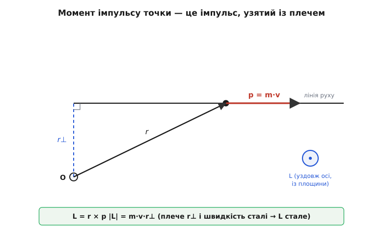
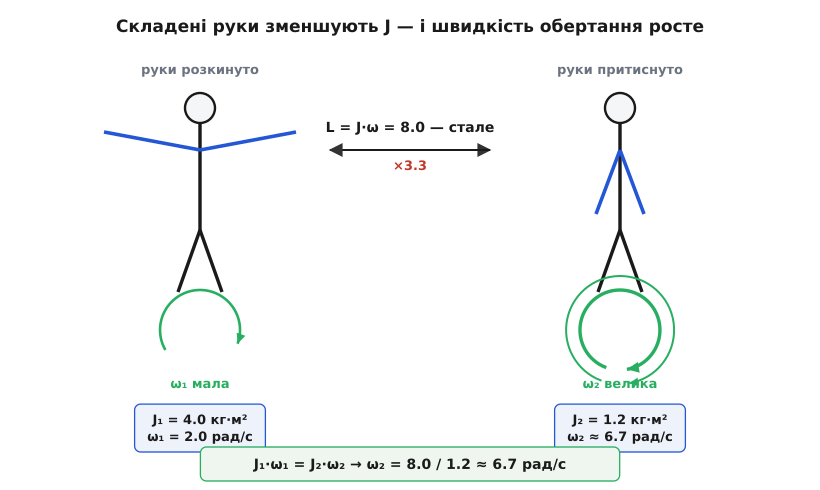
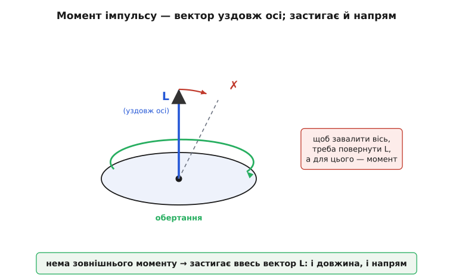

# Момент імпульсу: чому фігуристка розкручується, притиснувши руки

<preknowlist>
- [Імпульс](book:physics/momentum) — «кількість руху» p = m·v; зберігається, поки нема зовнішньої сили. Момент імпульсу — його обертальний двійник.
- [Момент інерції](book:physics/moment-of-inertia) — міра того, наскільки важко тіло розкрутити; для обертання те саме, що маса для прямого руху.
- [Кутова швидкість](book:physics/angular-velocity) — наскільки швидко наростає кут повороту, ω (рад/с).
- [Векторний добуток](book:math/cross-product) — r × p дає вектор, перпендикулярний до обох, а завдовжки — r·p·sin θ.
- [Момент сили](book:physics/torque) — «здатність повертати», r × F; саме він міняє момент імпульсу.
</preknowlist>

Фігуристка розкручується на льоду з розкинутими руками — повільно, велично. Тоді притискає руки до тіла, і без жодного поштовху ззовні обертання раптом пришвидшується так, що постать зливається в розмиту пляму. Ніхто її не підкрутив, лід гладенький, ковзан майже не тре. Звідки взялося зайве обертання?

Відповідь та сама, що й для м'яча, який летить і летить, поки його не спинять: **щось зберігається**. Для прямого руху це імпульс — «кількість руху», яка не зникає сама собою. Для обертання є свій незнищенний запас — **момент імпульсу** (момент, лат. *momentum* — «рушійна вага»; імпульс, лат. *impulsus* — «поштовх, удар»). Фігуристка не додала собі обертання, вона лише перерозподілила той самий запас — і той відповів пришвидшенням. Розберімо, що це за запас, чому він тримається і як одна ця думка пояснює і дзиґу, і супутник, і цілу галактику.

### Обертальний двійник імпульсу

Прямий рух міряють імпульсом: чим важче тіло й чим швидше воно летить, тим важче його спинити. Записують це коротко:

```
p = m · v
```

Обертання просить такої самої міри — «скільки в тілі обертання», яку так само важко відібрати. І будують її з тих самих цеглин, лише обертальних. Замість маси — [момент інерції](book:physics/moment-of-inertia) J: наскільки тіло опирається розкручуванню (він залежить не лише від маси, а й від того, як далеко ту масу рознесено від осі). Замість лінійної швидкості — [кутова швидкість](book:physics/angular-velocity) ω: наскільки швидко наростає кут. Їхній добуток і є момент імпульсу:

```
L = J · ω
```

Дві формули — та сама думка у двох подобах:

```
прямий рух:   p = m · v      (маса × швидкість)
обертання:    L = J · ω      (момент інерції × кутова швидкість)
```

Ця відповідність не випадкова й не поверхова — вона тримається до самого низу. Маса ↔ момент інерції, швидкість ↔ кутова швидкість, [сила](book:physics/force) ↔ момент сили, а імпульс ↔ момент імпульсу. Щойно ви вивчили одну колонку, друга дається майже даром: перекладіть кожне слово на обертальне — і закон лишиться правдивим. Одиниця моменту імпульсу так само виводиться з формули: кг·м²/с (момент інерції в кг·м² на кутову швидкість у 1/с).

### Момент імпульсу — це імпульс із плечем

Формула L = J·ω описує ціле тверде тіло. Але звідки вона береться? Розкладімо тіло на дрібні частинки й спитаймо, що таке момент імпульсу однієї-єдиної точки.

Тут повторюється історія моменту сили. Момент сили — це не нова сила, а сила, узята «з плечем»: r × F, сила помножена на відстань упоперек. Момент імпульсу — точно так само імпульс, узятий із плечем:

```
L = r × p = r × (m·v)
```

де r — вектор від обраної точки (осі) до частинки. Оце і є прямий сенс слова «момент»: узяти якийсь вектор і помножити його векторно на плече r від точки. Момент **сили** — це r × F; момент **імпульсу** — r × p. Обидві величини — про те саме: наскільки та чи інша дія «обертальна» відносно обраної точки. Тому давня назва моменту імпульсу — саме «момент кількості руху».

Величина цього вектора — імпульс на плече:

```
L = m · v · r⊥
```

де r⊥ — найкоротша відстань від точки до лінії, вздовж якої летить частинка. І тут ховається несподіванка, яка ламає надто просту картинку «момент імпульсу = щось крутиться». Візьмімо частинку, що летить **по прямій**, ніде не обертаючись. Відносно точки збоку від її шляху вона все одно має момент імпульсу — r⊥·m·v — і той стоїть **сталим**, бо і швидкість, і відстань до лінії не міняються. Момент імпульсу — не про те, чи щось «крутиться», а про циркуляцію руху навколо обраної точки. Обертання — лише найпомітніший його випадок.


*Момент імпульсу частинки відносно точки O — це її імпульс p = m·v, узятий із плечем r⊥ (відстань до лінії руху): L = m·v·r⊥. Вектор L дивиться вздовж осі, перпендикулярно до площини. Навіть частинка, що летить по прямій, має відносно O сталий момент імпульсу.*

Тепер зберімо тіло назад. Складемо моменти імпульсу всіх його частинок. У твердому тілі кожна точка на відстані ρ від осі має лінійну швидкість v = ω·ρ, тож її внесок m·v·ρ = m·ρ²·ω. Додаймо всі внески — спільне ω виноситься за дужку, а те, що лишилося, Σ m·ρ², і є [момент інерції](book:physics/moment-of-inertia) J. Сума перетворюється на знайоме L = J·ω. Дві картини — «імпульс із плечем» для точки й «J·ω» для цілого тіла — це одне й те саме, зняте з різних боків. [Виведення того, як внески складаються і чому лишається саме J·ω](book:physics/angular-momentum/math-angular-momentum.md), варте окремого розбору — там же ховається тонкість про те, що напрям L не завжди збігається з напрямом ω.

### Момент сили міняє момент імпульсу — а без нього запас тримається

Ми весь час кажемо «зберігається». Чому? Бо є точний закон про те, що момент імпульсу міняє. У прямому русі імпульс міняє сила: F = dp/dt (сила — це швидкість зміни імпульсу). Перекладімо на обертальне — і дістанемо найглибше формулювання обертальної динаміки:

```
M = dL/dt
```

Момент сили — це швидкість зміни моменту імпульсу. Прикладено зовнішній момент — запас обертання росте або спадає; **нема зовнішнього моменту — запас стоїть незмінний**. Це і є закон збереження моменту імпульсу, і саме він працює за спиною фігуристки.

Але тіло складається з безлічі частинок, які ще й тягнуть одна одну — м'язи, кістки, зчеплення атомів. Хіба ці внутрішні сили не збивають запас? Ні, і причина гарна. Внутрішні сили ходять парами: дія і протидія, рівні й протилежні, вздовж прямої, що сполучає дві частинки. Момент такої пари відносно будь-якої осі дорівнює нулю — плечі двох сил однакові, а напрями протилежні, тож моменти гасяться. Хоч скільки частинок і хоч як складно вони взаємодіють, **уся внутрішня механіка в сумі не дає моменту**. Лишається тільки зовнішній момент. [Чому внутрішні моменти точно гасяться попарно](book:physics/angular-momentum/math-angular-momentum.md) — це той самий розбір, що виводить L = J·ω.

Ось звідки незнищенність. Маховик, розкрутившись, крутиться довго — його гальмує лише слабке тертя в підшипнику, тобто крихітний зовнішній момент. Земля обертається мільярди років майже без змін: у порожнечі її ніщо помітно не підкручує й не гальмує. Приберіть зовнішній момент — і обертання стає таким самим невмирущим, як рух тіла, що летить у порожнечі.

> 🔧 **Навіщо це.** На цьому законі стоїть орієнтація супутників. У космосі нема об що впертися, щоб повернутися, — а розвернути апарат треба точно, скеровуючи антену чи камеру. Усередині ставлять важкі **маховики орієнтації** (англ. *reaction wheels*): розкрутіть маховик електромотором в один бік — і, щоб сумарний момент імпульсу лишився нулем, увесь апарат повільно повернеться в протилежний. Ні краплі пального, самий лиш перерозподіл того самого запасу. Так наводять телескоп «Габбл» і тисячі супутників.

### Розгадка фігуристки

Тепер фігуристка стає прозорою. На гладенькому льоду зовнішнього моменту майже нема, тож її момент імпульсу L = J·ω тримається сталим упродовж усього обертання. Коли вона притискає руки, маса з'їжджається до осі, і момент інерції J різко меншає. Але добуток J·ω мусить стояти — отже, тільки-но J впав, ω зобов'язана рівно настільки ж вирости. Менший момент інерції в обмін на більшу швидкість, при незмінному запасі.

**Задача.** Фігуристка обертається з розкинутими руками: J₁ = 4.0 кг·м², ω₁ = 2.0 рад/с. Вона притискає руки, і момент інерції падає до J₂ = 1.2 кг·м². Яка нова швидкість обертання?

```
Момент імпульсу зберігається:  J₁·ω₁ = J₂·ω₂

ω₂ = J₁·ω₁ / J₂ = (4.0 · 2.0) / 1.2
ω₂ = 8.0 / 1.2 ≈ 6.7 рад/с
```

Швидкість обертання зросла більш ніж утричі — рівно настільки, наскільки впав момент інерції. Жодного поштовху, самий перерозподіл маси.

Лишається одна незручна дрібниця, яку варто не проґавити. Порахуймо [кінетичну енергію](book:physics/kinetic-energy) обертання, ½·J·ω². Спочатку ½·4.0·2.0² = 8 Дж, а після — ½·1.2·6.7² ≈ 27 Дж. Енергія зросла втричі — хоча момент імпульсу не змінився ні на крихту! Звідки взялися ці джоулі? Їх додала сама фігуристка. Притискаючи руки, вона працює проти сили, що норовить розкидати їх назовні, і ця робота вливається в обертання. Отут дві величини й розходяться: момент імпульсу зберігається завжди, коли нема зовнішнього моменту, а енергія — лише коли ніхто не виконує роботи. Плутати їх — класична пастка.


*Той самий момент імпульсу L у двох станах. Розкинуті руки — великий J, мала ω. Притиснуті — J падає, тож ω росте настільки, щоб добуток J·ω лишився тим самим. Кінетична енергія при цьому зростає: різницю додає робота, яку виконує тіло, стягуючи масу до осі.*

### Напрям теж зберігається: момент імпульсу — вектор

Досі ми говорили про величину запасу. Але момент імпульсу — вектор, і в нього є напрям: він дивиться **вздовж осі обертання**, куди саме — каже [правило правої руки](book:physics/right-hand-rule) для векторного добутку r × p. І збереження стосується всього вектора — не лише довжини, а й напряму. Немає зовнішнього моменту — вісь обертання **застигає в просторі**, наче її прибили.

Оце застигання напряму — річ, яку варто відчути, бо на ній тримається несподівано багато. Розкручене колесо велосипеда тримається сторч і не падає: щоб завалити його набік, треба **повернути** вектор L, а для повороту вектора потрібен момент, якого просто так нема. Дзиґа (гр. — вовчок) не падає з тієї самої причини — її вісь опирається зміні напряму. Класичний **гіроскоп** (гр. *gyros* — «оберт» + *skopein* — «дивитися») — це лиш важкий розкручений ротор у підвісі: він так уперто тримає напрям своєї осі, що на ньому колись будували авіагоризонти й гірокомпаси, які показують сторони світу без жодного магніту.

> 🔧 **Навіщо це.** Стійкість напряму осі — це вбудований компас і рівень. Розкручений маховик «пам'ятає» напрям, у якому його запустили, хай навіть основа під ним крутиться й хитається. Так стабілізують камери й платформи, так літаки десятиліттями трималися курсу до появи супутникової навігації. Не треба живлення на «утримання» — напрям береже сам закон збереження.

А що, як момент таки прикласти — штовхнути вісь убік? Тут чекає найдивніше. Вісь не валиться в бік поштовху, як зробило б звичайне тіло, — вона повільно повертається **вбік, перпендикулярно** до штовхання. Дзиґа не падає, а її вісь ліниво обходить коло. Цей ухильний рух звуть [прецесією](book:physics/gyroscopic-precession) (лат. *praecessio* — «передування»), і він прямо випливає з M = dL/dt: момент додає до L крихітний доважок **упоперек**, тож вектор не подовжується, а повертається. Дивовижа гіроскопа — уся звідси.

Ще разючіше збереження показує тіло, кинуте вільно в порожнечі, зовсім без моменту. Здавалося б, воно має незмінно крутитися навколо однієї осі. Та якщо розкрутити його навколо «середньої» осі — тієї, чий момент інерції проміжний між найбільшим і найменшим, — тіло раз у раз саме собою перекидається, хоча момент імпульсу стоїть незмінний як вектор. Радянський космонавт Володимир Джанібеков помітив це 1985 року на станції «Салют-7»: відкручена баранцева гайка, злетівши з болта, летіла й періодично сама переверталася в невагомості. Ефект відомий як теорема тенісної ракетки. [Як змоделювати це обертання й побачити перекиди на власні очі](book:physics/angular-momentum/proj-tennis-racket.md) — окремий невеликий проєкт.


*Вектор L стоїть уздовж осі обертання (напрям — за правилом правої руки). Поки зовнішнього моменту нема, застигає весь вектор: тому розкручене колесо не завалюється набік — щоб нахилити вісь, довелося б повернути L, а для цього потрібен момент.*

### Від краплі до галактики

Найкраще незнищенність моменту імпульсу видно там, де більше нема нічого, — у русі планет і зір. Ще [Кеплер](book:physics/keplers-laws) підмітив дивне правило: відрізок від Сонця до планети замітає **рівні площі за рівний час**. Біля Сонця планета мчить, на дальньому кінці орбіти повзе — але площі заметених секторів однакові. Кеплер не знав, звідки це. Ньютон показав: рівні площі — це просто збереження моменту імпульсу, і випливає воно з єдиної риси тяжіння — воно завжди спрямоване точно **до центра**, а сила «в центр» не має плеча, отже не дає моменту.

У формулах це та сама рівність J·ω = const, лише для точки: величина m·r²·θ̇ (маса на квадрат відстані на кутову швидкість навколо Сонця) тримається сталою. Тому, підлітаючи ближче (r меншає), планета мусить кружляти швидше (θ̇ більшає) — інакше добуток не встоїть. Це той самий обмін, що й у фігуристки, лише замість притиснутих рук — витягнута орбіта. Глибше цей зв'язок — між симетрією простору й збереженням — розкриває [теорема Нетер](book:physics/noether-theorem): байдужість законів природи до повороту в просторі й дарує світові збережений момент імпульсу.

Той самий закон ліпить самі форми Всесвіту. Хмара газу, що стягується власним тяжінням, майже завжди має крихітний початковий оберт. Стискаючись, вона, мов та фігуристка, розганяє його дедалі швидше — і не може стягнутися в кульку: уздовж осі речовина падає вільно, а впоперек її не пускає обертання. Хмара сплющується в **диск**. Тому і Сонячна система, і галактики, і кільця навколо молодих зір — плоскі й закручені: усе це відбиток збереженого моменту імпульсу.

А коли зоря наприкінці життя стискає своє ядро до нейтронної зорі, той самий механізм доводить обертання до нестями. Прикиньмо. Ядро завбільшки як Сонце (радіус ≈ 7·10⁸ м) стискається до кулі радіусом близько 10 км (10⁴ м). Момент інерції кулі йде як квадрат радіуса, тож при сталому L кутова швидкість росте як квадрат стиснення:

```
ω_після / ω_до = (r_до / r_після)² = (7·10⁸ / 10⁴)² ≈ 5·10⁹
```

Обертання, що тривало місяць, пришвидшується у мільярди разів — до частки секунди на оберт. Саме тому пульсари, ці нейтронні зорі-маяки, крутяться по кілька разів, а декотрі й сотні разів **на секунду** (справжні зорі частину моменту скидають разом із оболонкою, тож виходить трохи повільніше, але механізм рівно цей). Про те, як поняття народилося — від Кеплерових рівних площ до слова «момент кількості руху» й до векторного погляду, — [коротка історія](book:physics/angular-momentum/hist-angular-momentum.md).

Одна проста думка проходить крізь усе: у тіла є запас обертання, і сам собою він не з'являється й не зникає — його міняє лише зовнішній момент. Приберіть той момент — і застигає геть усе: і скільки в тілі обертання, і куди дивиться його вісь. З цієї єдиної незнищенності виростають і розмита пляма фігуристки, і незворушний гіроскоп, і плаский вихор галактики. Помножте імпульс на плече — дістанете запас обертання; стежте, чи діє на тіло зовнішній момент, — і знатимете наперед, чи той запас устоїть.
