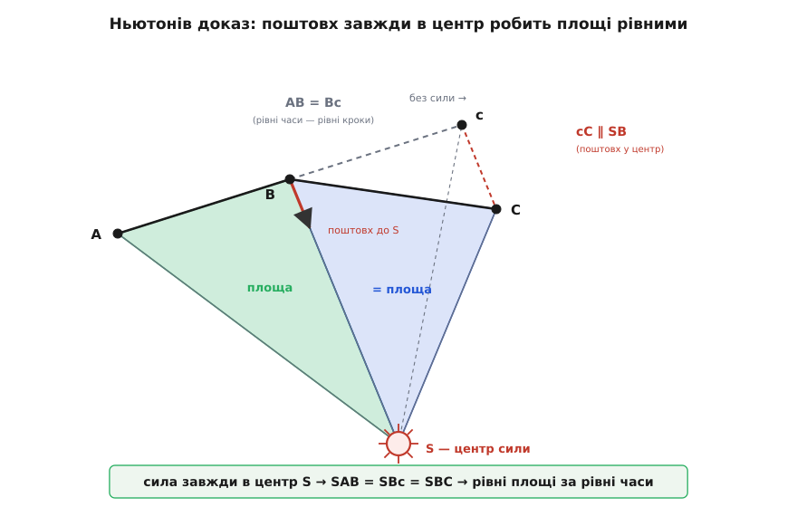
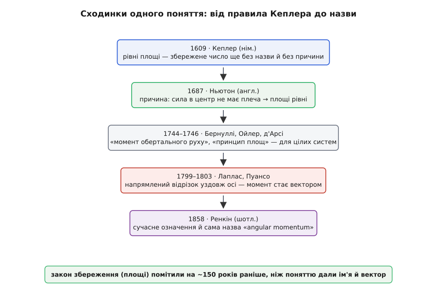

# 📜 Як народився момент імпульсу: від рівних площ Кеплера до слова «angular momentum»

У фізики буває дивна доля: величину зустрічають задовго до того, як здогадуються, що це взагалі величина. Спершу трапляється на очі тінь — якесь число вперто не міняється, — а вже потім, десятиліттями пізніше, хтось розуміє, чия це тінь. З моментом імпульсу сталося саме так. Його закон збереження людство записало 1609 року, а назву й векторний зміст дало аж наприкінці XIX століття. Між цими датами — два з половиною століття, за які поняття збирали по цеглині кілька рук у різних країнах. Це не історія одного генія з осяянням, а історія повільного впізнавання: як тінь на стіні поступово набирала тіла.

## Кеплер: правило без причини

Усе почалося з упертого рахунку. Йоганн Кеплер (нім. *Johannes Kepler*), німець на службі в імператора Рудольфа ІІ у Празі, роками бився над орбітою Марса, маючи безцінні спостереження Тихо Браге. Він шукав, за яким законом планета біжить по своєму шляху — і намацав правило, яке пізніше назвуть його **другим законом**: відрізок від Сонця до планети замітає рівні площі за рівний час. Біля Сонця планета мчить, на дальньому кінці орбіти повзе, але заметені сектори однакові.

Тут ховається маловідома тонкість, варта того, щоб її не проґавити. **Правило рівних площ Кеплер знайшов раніше, ніж еліпс** — раніше за свій же «перший» закон (це встановлений історичний факт). Спершу він мав закон швидкості (рівні площі), а форму орбіти — овал, який лише згодом упізнав як еліпс, — домальовував уже під цей закон, зокрема щоб було чим рахувати ту саму заметену площу. Порядок відкриття виявився зворотним до порядку, у якому ці закони потім друкують у підручниках.

І ще одне, що чесно сказати про Кеплера: **свою причину рівних площ він розумів хибно**. Ніякого моменту імпульсу він, звісно, не знав. У його картині Сонце оберталося й гнало планети по колу магнітними «волокнами» (лат. *species*, *fibrae*) — чимось на кшталт спиць невидимого колеса, які штовхають планету тим сильніше, чим вона ближча. Рівні площі в нього випливали з цього штовхання. Механізм — суцільна вигадка (жодних волокон немає), а от емпіричне правило виявилося чистою правдою. Кеплер тримав у руках закон збереження моменту імпульсу, записаний як геометричне спостереження, — і не мав ані назви для тієї величини, ані вірного пояснення, чому вона стала. Тінь була, тіла ще не було.

> 🔧 **Навіщо це.** Історія Кеплера показує, як фізика насправді просувається: спершу знаходять **збережене число** (щось, що не міняється), а вже потім розуміють, *що* саме зберігається. Часто закон збереження — це найперше, що вдається помітити в явищі, бо саме сталість кидається в очі серед хаосу руху.

*Кеплерів закон рівних площ — детальніше про всі три закони й порядок їхнього відкриття у [Кеплерових законах](topic:physics/keplers-laws): там сама орбіта, ексцентриситет і зв'язок періоду з розміром.*

## Ньютон: звідки беруться рівні площі

Пояснення прийшло за вісімдесят років. Ісаак Ньютон (англ. *Isaac Newton*) у «Математичних началах натуральної філософії» (лат. *Philosophiæ Naturalis Principia Mathematica*, 1687) поставив рівні площі найпершою теоремою всієї небесної механіки — **Книга I, Твердження 1, Теорема 1**. І довів дивовижну річ: рівні площі виникають **не** через якісь особливі властивості тяжіння, а через єдину його рису — сила спрямована точно **до центра**. Хоч би за яким законом та сила спадала з відстанню, аби лиш дивилася в центр, — площі виходитимуть рівні.

Чому центральність сили дає саме сталу площу, видно з одного рядка. Швидкість зміни моменту імпульсу — це момент сили, r × F. А коли сила спрямована вздовж самого r, векторний добуток обертається в нуль:

```
момент сили:      M = r × F
сила в центр:     F ∥ r   →   r × F = 0
нема моменту  →  момент імпульсу стоїть  →  площі рівні
```

Ньютонів доказ геометричний і напрочуд наочний — його варто побачити, бо в ньому вся суть. Розбий час на однакові проміжки. За перший проміжок тіло без жодної сили пройшло б відрізок AB. За другий, знову ж без сили, воно за інерцією пролетіло б далі рівно такий самий відрізок Bc (бо рівні часи — рівні шляхи). Але в точці B у нього «вдаряє» сила, спрямована до центра S, — короткий поштовх уздовж прямої BS. Цей поштовх зсуває тіло з c у справжню наступну точку C, причому зсув cC паралельний до BS. І ось геометричне диво: трикутник SAB дорівнює за площею трикутнику SBc (спільна висота з S, однакові основи AB = Bc), а SBc дорівнює SBC (спільна основа SB, а вершини c і C однаково від неї віддалені, бо cC ∥ SB). Отже SAB = SBC. Крок за кроком — усі трикутники рівні, площі однакові. Спрямуй проміжки часу до нуля — ламана згладжується в криву, поштовхи зливаються в неперервну силу, і рівні трикутники стають рівними «змахами» площі.


*Ньютонова побудова з «Начал» (Книга I, Твердження 1). Без сили тіло йшло б A→B→c рівними кроками. Поштовх до центра S у точці B зсуває його в C так, що зсув cC ∥ SB. Тоді SAB = SBc = SBC: сусідні трикутники рівновеликі, тож радіус замітає рівні площі за рівні проміжки часу — саме те, що помітив Кеплер.*

Варто чесно додати дрібну застереж­ність, яку помітили вже сучасні історики: перехід від ламаної з поштовхами до гладкої кривої з неперервною силою Ньютон робить не зовсім строго — він мовчки припускає, що будь-який плавний рух можна отримати як границю таких поштовхів. Для практики це нічого не псує, доказ правильний, але формально там є тонке місце. Головне інше: **Ньютон дав рівним площам причину**, якої бракувало Кеплерові. І все ж він не назвав жодної нової величини й не сказав «ось збережений момент». У нього це — теорема про площі, а не поняття про запас обертання. Тіло тіні досі не мало імені.

## Народження величини: «момент обертального руху»

Перетворити теорему на **величину** випало вже наступному поколінню — математикам континенту, які в 1740-х роках майже одночасно намацали думку, що збереження площ — це окремий випадок чогось загальнішого, що діє не лише для однієї планети, а для цілих систем тіл.

Швейцарець із Базеля Даніель Бернуллі (нім. *Daniel Bernoulli*) у листі 1744 року написав про те, що історики механіки передають як **«момент обертального руху»**, — і це, ймовірно, найперша поява поняття моменту імпульсу в тому сенсі, у якому ми його розуміємо тепер (статус: правдоподібна першість, як її оцінюють дослідники; точне формулювання в листі переказують, а не цитують дослівно). Не теорема про площі, а величина, у якої є свій момент — обертальна вага руху.

Поряд працював Леонард Ойлер (нім. *Leonhard Euler*), теж швейцарець із Базеля. Ще у своїй «Механіці» (лат. *Mechanica*, 1736, видана в Петербурзькій академії, де Ойлер тоді служив) він торкнувся потрібних рівнянь, не розгорнувши їх; а 1744 року першим поставив закони і імпульсу, і моменту імпульсу як рівняння руху цілої системи. Близько 1746-го і Бернуллі, і Ойлер уже мали збереження моменту імпульсу як доведене твердження. (Тут доречно бути точним у приписуванні: Ойлер і Бернуллі — швейцарці, а не «російські вчені»; те, що частину життя вони працювали в імператорській Петербурзькій академії й друкували там праці, робить академію місцем роботи, а не національністю відкриття.)

І третій, кого несправедливо забувають, — Патрік д'Арсі (ірл./фр. *Patrick d'Arcy*), ірландець із графства Голвей, ще хлопцем вивезений до Парижа й відомий там як «шевальє д'Арсі». Незалежно він сформулював те саме як **«принцип площ»** (фр. *principe des aires*) у праці «Загальний принцип динаміки» (*Principe général de dynamique*, подана до Паризької академії 1747-го, надрукована близько 1752-го). Кого з трьох рахувати першим — досі предмет суперечки; чесна відповідь така, що **поняття народилося не в одній голові, а в кількох майже водночас**, і ірландець у Парижі має тут не менше прав, ніж швейцарці. Це типова доля великих ідей: вони «висять у повітрі» й падають у кілька рук одразу.

На цьому кроці тінь нарешті набула тіла: з'явилася величина, яку можна складати для багатьох частинок, яка зберігається для замкнених систем і яку вже не звести до однієї планети. Бракувало ще двох речей — щоб вона стала **вектором** і щоб дістала **назву**.

## Пуансо: момент стає вектором уздовж осі

Спершу — вектор. Тут варто озирнутися на П'єра-Симона Лапласа (фр. *Pierre-Simon Laplace*), який 1799 року в «Небесній механіці» помітив, що з обертанням системи пов'язана незмінна **площина** — його «незмінна площина» (фр. *plan invariable*). А в незмінної площини є незмінний **напрям** перпендикуляра. Це вже майже вектор: у просторі є виділена, застигла вісь, прив'язана до збереженого обертання.

Довів думку до кінця Луї Пуансо (фр. *Louis Poinsot*). У «Началах статики» (фр. *Éléments de statique*, Париж, 1803) він увів поняття **пари сил** (фр. *couple*) — двох рівних протилежних сил із плечем — і почав зображати обертання та їхні моменти **напрямленим відрізком**: стрілкою вздовж осі, чия довжина — величина, а напрям — куди дивиться вісь. У доданих до книжки міркуваннях «про моменти й площі» (фр. *théorie des moments et des aires*) він розгорнув **збереження моментів** уже цією геометричною, майже векторною мовою. (Повну свою геометрію обертання — інерційний еліпсоїд, що котиться по незмінній площині, — Пуансо викладе пізніше, у праці 1834 року; векторний погляд визрівав десятиліттями, а не з'явився готовим.)

Ось де ховається головна несподіванка всієї цієї історії. У підручниках момент імпульсу вводять зразу як вектор r × p, що дивиться вздовж осі, — і здається, ніби так його й «побачили» першими. Насправді **векторний погляд прийшов останнім**, майже наприкінці, через двісті років після Кеплера. Спершу була скалярна площа, потім скалярний «момент обертального руху», і тільки під кінець — стрілка вздовж осі. Природний для нас образ виявився найпізнішим плодом, а не зерном.

## Ренкін дає назву — і сам її неправильно приписує

Лишалося слово. Дав його шотландець Вільям Джон Маккворн Ренкін (англ. *William John Macquorn Rankine*) у «Підручнику прикладної механіки» (*A Manual of Applied Mechanics*, 1858). Саме там уперше в підручнику з'явилося **сучасне означення** моменту імпульсу — з докладним геометричним описом — і закріпився англійський термін *angular momentum*, «кутовий (обертальний) момент руху».

А далі — коротка повчальна історія про те, як легко навіть першовідкривач помиляється в приписуванні. У пізнішому виданні (1872) Ренкін чесно зазначив, що термін *angular momentum* увів не він, а **«містер Гейворд»** — Роберт Болдвін Гейворд (англ. *Robert Baldwin Hayward*), англійський математик, у праці «Про прямий метод оцінювання швидкостей, прискорень і подібних величин щодо осей, рухомих у просторі як завгодно» (читана 1856-го, надрукована 1864-го). Ренкін віддавав колезі належне — але **сам у цьому приписуванні помилився**: пізніші історики знайшли термін у друку й раніше за Гейворда, ще на межі XVIII–XIX століть. Гейвордова праця була не першою появою слова взагалі, а лише першою, яку широко побачив англомовний світ. Тобто навіть **саме ім'я величини не має одного винахідника** — і людина, яка це ім'я закріпила, помилилася, кому його приписати. Годі знайти чистіший приклад того, що в науці колективне геть усе — і закон, і поняття, і навіть назва.


*Поняття збиралося шарами. Кеплер дав збережене число без причини; Ньютон — причину (сила в центр не має плеча); Бернуллі, Ойлер і д'Арсі — саму величину для цілих систем; Пуансо — векторний погляд уздовж осі; Ренкін — сучасне означення й назву. Закон збереження помітили на півтора століття раніше, ніж поняттю дали ім'я.*

## Чому цю історію варто пам'ятати

За сухими датами тут захований урок про те, як узагалі росте фізика. Момент імпульсу зустріли **як тінь** — як незмінне число (рівні площі), — за півтора століття до того, як зрозуміли, чия це тінь. Причину знайшов один (Ньютон), величину зліпили кілька рук одночасно (Бернуллі, Ойлер, д'Арсі), векторний образ визрів пізніше (Лаплас, Пуансо), а назву закріпив і при тому наплутав із приписуванням ще один (Ренкін і Гейворд). Жоден крок не належить одній людині чи одній країні: німець у Празі, англієць, двоє швейцарців при Петербурзькій академії, ірландець у Парижі, французи, шотландець.

І найтонше — про порядок. Найзвичніший для нас образ, стрілка вздовж осі, у справжній історії прийшов **останнім**, а не першим; першим було найнепомітніше — просто те, що якесь число вперто не міняється. Коли наступного разу побачите охайне r × p у підручнику, згадайте: щоб дійти до цієї короткої формули, людству знадобилося помітити тінь, знайти їй причину, дати їй тіло, поставити її сторч уздовж осі — і аж тоді назвати.
