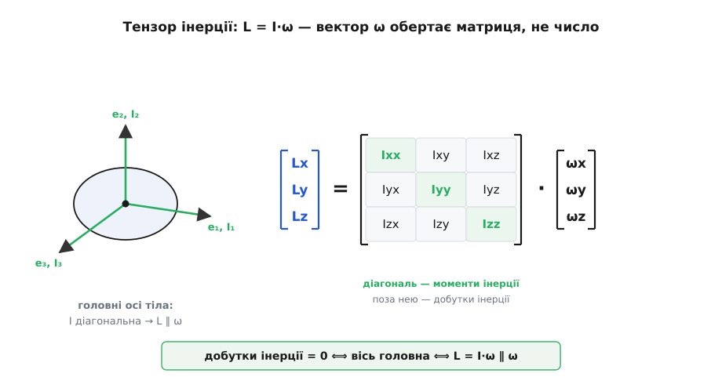
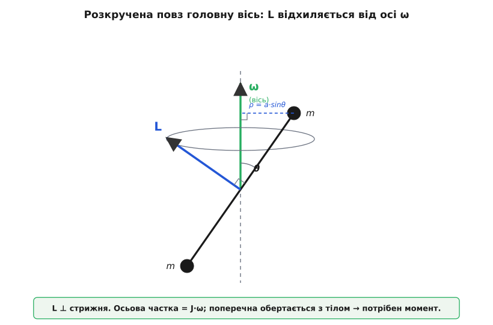

# 🧮 Момент імпульсу системи й тензор інерції: чому L не завжди дивиться вздовж осі

Основна тема подала момент імпульсу твердого тіла однією охайною рівністю: `L = J·ω`. Виглядає як обертальний близнюк `p = m·v` — величина проти величини, і по всьому. Але `L` — вектор, і в цій чепурній формулі поховано три речі, кожна з яких вартує окремого погляду.

Перша: тіло — це громада з незліченних частинок, а всередині них вирують трильйони сил зчеплення. Чому ж запас обертання цілого тіла слухається лише того, що штовхає його ззовні? Друга: звідки взагалі береться `J·ω`, коли складаєш моменти всіх частинок, — і чи це вся правда? Третя, найгостріша: ні, не вся. У загальному випадку `L` дивиться зовсім не туди, куди вказує вісь обертання `ω`. Розкрутіть тіло химерної форми — і його момент імпульсу відхилиться від осі вбік, а щоб утримати вісь на місці, доведеться раз у раз підпихати тіло моментом.

Розберімо всі три, по черзі, від першопринципів. У кінці `L = J·ω` виявиться не законом, а тінню, яку глибша, векторна рівність кидає на єдину виділену вісь.

## Система частинок: запас міняє лише зовнішній момент

Почнімо з означення, чеснішого за `J·ω`. Момент імпульсу будь-якої системи — хоч жмені піску, хоч планети — це проста сума по всіх її частинках:

```
L = Σ rᵢ × pᵢ = Σ rᵢ × (mᵢ·vᵢ)
```

де `rᵢ` — стрілка від обраної точки відліку `O` до частинки `i`. І тут одразу треба спинитися на слові «обраної». Момент імпульсу — величина **відносна**: пересунете `O` — і всі `rᵢ` зміняться, а з ними й `L`. Це не вада, а природа поняття (те саме плече, що й у моменту сили). Але через цю відносність закон «`dL/dt` = момент» тримається бездоганно лише для двох особливих виборів `O`: коли точка відліку **нерухома в інерційній системі** або коли вона — **[центр мас](topic:physics/center-of-mass)** тіла, навіть якщо той центр сам летить із прискоренням. Ці два вибори «безпечні»; будь-яка інша рухома точка домішує в баланс паразитні члени. Домовмося далі про безпечний `O` і рушаймо.

Продиференціюймо `L` за часом. Кожен доданок — добуток, тож беремо похідну за правилом:

```
dL/dt = Σ [ (drᵢ/dt) × pᵢ + rᵢ × (dpᵢ/dt) ]
```

Перша половина кожного доданка тихо гине. Адже `drᵢ/dt = vᵢ`, а `pᵢ = mᵢ·vᵢ` — вектори паралельні, тож `vᵢ × (mᵢ·vᵢ) = 0` ([векторний добуток](topic:math/cross-product) вектора самого на себе — нуль). Лишається саме те, що ми впізнаємо як момент сили на частинку, бо `dpᵢ/dt` — це повна сила на неї (другий закон Ньютона):

```
dL/dt = Σ rᵢ × Fᵢ
```

Тепер головний крок. Розділімо силу на кожну частинку на дві породи: **зовнішню** `Fᵢᵉ` (тяжіння, ваша рука, тиск повітря — усе, що приходить з-поза системи) і **внутрішні** `fᵢⱼ` — тяги з боку кожної іншої частинки `j` тієї самої системи:

```
dL/dt = Σᵢ rᵢ × Fᵢᵉ  +  Σᵢ Σⱼ rᵢ × fᵢⱼ
```

Перша сума — сумарний момент зовнішніх сил, назвімо його `M`. Друга, подвійна, лякає: у тілі з `N` частинок таких внутрішніх доданків — порядку `N²`, а `N` тут астрономічне. Якби вони не гасли, годі було б і мріяти про рівняння руху тіла. Але вони гаснуть — і варто побачити, на чому саме тримається це диво, бо тримається воно тонко.

Зберімо внутрішні доданки в **пари**. Дві частинки, `i` та `j`, тягнуть одна одну: `fᵢⱼ` — сила на `i` з боку `j`, `fⱼᵢ` — на `j` з боку `i`. У повній сумі присутні обидва доданки; поставмо їх поряд:

```
rᵢ × fᵢⱼ  +  rⱼ × fⱼᵢ
```

Тут входить **третій закон Ньютона**, і то двічі. Спершу його звична, «слабка» форма: дія дорівнює протидії за величиною й протилежна за напрямом, `fⱼᵢ = −fᵢⱼ`. Підставмо й винесімо спільний множник:

```
rᵢ × fᵢⱼ − rⱼ × fᵢⱼ = (rᵢ − rⱼ) × fᵢⱼ
```

Різниця `(rᵢ − rⱼ)` — це стрілка від `j` до `i`, вектор уздовж прямої, що з'єднує дві частинки. Останній крок вимагає вже не слабкої, а **сильної форми третього закону**: внутрішні сили діють не абияк, а **точно вздовж лінії, що з'єднує частинки** (такі сили звуть центральними, лат. *centralis* — «серединний»). Отже `fᵢⱼ` паралельна до `(rᵢ − rⱼ)`, а векторний добуток паралельних векторів — нуль:

```
(rᵢ − rⱼ) × fᵢⱼ = 0        (сила ∥ лінії центрів)
```

Кожна пара дає нуль. Просумуйте по всіх парах — і вся подвійна сума, усі `N²` доданків, обертається на порох. Лишається чисте:

```
dL/dt = M        (M — момент лише ЗОВНІШНІХ сил)
```

Спинімося на тому, наскільки це нетривіально, бо тут ховається різниця між двома законами збереження. Слабкої форми (сили рівні й протилежні) досить, щоб погасити внутрішні **сили**, — звідси береже себе імпульс. Але щоб погасли внутрішні **моменти**, самої протилежності мало: якби дві частинки штовхали одна одну навскіс, не вздовж прямої між ними, їхні моменти не зійшлися б у нуль, і тіло розкручувало б саме себе з нічого, без жодного зовнішнього поштовху. Природа так не робить — саме тому, що сили, які тримають матерію купи (тяжіння, електростатика, атомні зв'язки), центральні. Тож збереження моменту імпульсу спирається на **сильну** форму третього закону — так само як збереження імпульсу на слабку. А ще глибший його корінь — [симетрія простору щодо поворотів](topic:physics/noether-theorem): у Всесвіті немає виділеного напряму, і саме через цю байдужість момент імпульсу незнищенний.

> 🔧 **Навіщо це.** Тільки завдяки цьому ми взагалі маємо право казати «момент, прикладений до тіла», і мовчати про трильйони внутрішніх сил у гайковому ключі, планеті чи маховику. Усі вони, до останньої, складаються в нуль. Тіло відгукується лише на те, що штовхає його ззовні, — і рівняння його обертання коротке, хоч частинок у ньому не злічити.

## L = J·ω — і тріщина в ньому

Тепер від будь-якої системи — до **твердого** тіла, де відстані між частинками закам'янілі, тож усе крутиться як одне ціле зі спільною [кутовою швидкістю](topic:physics/angular-velocity) `ω`. Швидкість кожної частинки задається обертанням: `vᵢ = ω × rᵢ`. Підставмо це в означення й погляньмо, у що згорнеться сума:

```
L = Σ mᵢ · rᵢ × vᵢ = Σ mᵢ · rᵢ × (ω × rᵢ)
```

Подвійний векторний добуток розкривається тотожністю «bac-cab» — `a × (b × c) = b(a·c) − c(a·b)`:

```
rᵢ × (ω × rᵢ) = ω(rᵢ·rᵢ) − rᵢ(rᵢ·ω) = rᵢ²·ω − rᵢ·(rᵢ·ω)
```

Отже кожна частинка вкладає в момент імпульсу два вектори — один уздовж `ω`, другий уздовж власного `rᵢ`:

```
L = Σ mᵢ · [ rᵢ²·ω − rᵢ·(rᵢ·ω) ]
```

Перевірмо спершу, що знайома формула тут справді є. Спроектуймо `L` на саму вісь обертання — візьмімо складову вздовж одиничного `ω̂`. Друга частина кожного доданка дає `(rᵢ·ω̂)²`, і різниця `rᵢ² − (rᵢ·ω̂)²` — це рівно **квадрат перпендикулярної відстані** частинки до осі, `ρᵢ²` (теорема Піфагора: повна відстань у квадраті мінус осьова складова в квадраті). Тому осьова проєкція згортається точнісінько в:

```
L∥ = (Σ mᵢ·ρᵢ²) · ω = J · ω
```

Ось воно. Складова моменту імпульсу **вздовж осі** справді дорівнює `J·ω`, з тим самим моментом інерції [J = Σ mᵢ·ρᵢ²](topic:physics/moment-of-inertia). Основна тема не збрехала — вона лише сказала півправди. Бо в `L` лишається ще один шматок, `−Σ mᵢ·rᵢ·(rᵢ·ω)`, і той у загальному випадку **не паралельний** до `ω`. Кожна частинка тягне момент імпульсу трохи вбік, у бік свого власного `rᵢ`, і якщо тіло розкидане несиметрично щодо осі, ці бічні тяги не гасяться. Повний вектор `L` відхиляється від `ω`.

Тобто рівність `L = J·ω` як рівність **векторів** справджується лише тоді, коли бічні внески самознищуються симетрією і `L` лягає вздовж осі. У загальному разі правдива тільки її проєкція. Щоб описати повний вектор, самого числа `J` замало: потрібен об'єкт, що вміє не просто розтягувати `ω`, а й **повертати** його. Такий об'єкт — тензор інерції.

## Тензор інерції: машина, що обертає ω в L

Розпишімо `L = Σ mᵢ[rᵢ²·ω − rᵢ(rᵢ·ω)]` по трьох координатах. Візьмімо, скажімо, `x`-складову. Член `rᵢ²·ω` дає `rᵢ²·ωₓ`, а член `rᵢ(rᵢ·ω)` — `xᵢ·(xᵢωₓ + yᵢω_y + zᵢω_z)`. Зібравши коефіцієнти при `ωₓ`, `ω_y`, `ω_z`, дістаємо:

```
Lₓ = (Σ mᵢ(yᵢ²+zᵢ²))·ωₓ  −  (Σ mᵢxᵢyᵢ)·ω_y  −  (Σ mᵢxᵢzᵢ)·ω_z
```

Кожна складова `L` виявляється **сумішшю всіх трьох** складових `ω`. Це вже не множення на число — це множення на матрицю. Запишімо коротко, `Lₐ = Σ_b Iₐb·ω_b`, де дев'ять чисел `Iₐb` і є **тензор інерції**:

```
Iₐb = Σ mᵢ · ( rᵢ²·δₐb − xₐ⁽ⁱ⁾·x_b⁽ⁱ⁾ )
```

(тут `δₐb` — одиниця, коли `a = b`, і нуль інакше; індекси `a, b` пробігають `x, y, z`). Розгорнутий, це симетрична табличка 3×3:

```
      ⎡ Iₓₓ  Iₓy  Iₓz ⎤       діагональ:  Iₓₓ = Σ m(y²+z²)
  I = ⎢ Iyₓ  Iyy  Iyz ⎥                   Iyy = Σ m(x²+z²)
      ⎣ Izₓ  Izy  Izz ⎦                   Izz = Σ m(x²+y²)

                              поза нею:   Iₓy = −Σ m·x·y   і т. д.
```

На діагоналі — знайомі **моменти інерції** навколо трьох осей (кожен — сума `m·ρ²` з відповідним перпендикулярним `ρ`). Поза діагоналлю — **добутки інерції**: вони міряють, наскільки маса розкидана «навскіс» щодо осей, і саме вони винні в тому, що `L` відхиляється від `ω`. Уся обертальна кінематика тіла тепер уміщається в один рядок:

```
L = I · ω        (матриця на вектор, а не число на вектор)
```

Тепер питання «коли `L ∥ ω`?» стає питанням лінійної алгебри. `L` паралельний до `ω` рівно тоді, коли множення на матрицю `I` лишає напрям `ω` незмінним, тобто коли `ω` — [власний вектор](topic:math/eigenvalues) тензора інерції:

```
I · ω = λ · ω        (тоді L = λ·ω ∥ ω)
```

І тут рятує глибока властивість симетричних матриць (спектральна теорема): будь-яка дійсна симетрична матриця має **три взаємно перпендикулярні власні вектори** з дійсними власними значеннями. Ці три виділені напрями звуть **головними осями інерції** тіла, а відповідні власні значення `I₁, I₂, I₃` — **головними моментами інерції**. У системі координат, збудованій на головних осях, усі добутки інерції зникають, матриця `I` стає діагональною, і кожна головна вісь дає чисте `L = Iₖ·ω`, паралельне до `ω`. Розкрутіть тіло навколо головної осі — і момент імпульсу слухняно ляже вздовж неї; навколо будь-якої іншої — відхилиться.

Будову цю відкривали поступово й не в одні руки. Що в кожного тіла є принаймні три взаємно перпендикулярні осі, навколо яких воно крутиться «чисто», першим довів 1755 року Йоганн Андреас фон Сеґнер — угорський природознавець німецького роду, народжений у Пресбурзі (тодішня столиця Угорщини, нині Братислава). Саме його студії гіроскопічного руху підштовхнули далі Леонарда Ейлера, швейцарця: у праці «Theoria motus corporum solidorum» (1765) Ейлер систематизував і момент інерції, і головні осі, і складові того, що сьогодні звемо тензором інерції, і рівняння обертання тіла. Наочний геометричний образ — **еліпсоїд інерції**, що котиться без ковзання й показує рух вільного тіла без розв'язування рівнянь, — додав 1834 року француз Луї Пуенсо. Сам термін «тензор» у нинішньому сенсі усталився ще пізніше; а механіка головних осей стоїть непорушно від Ейлера. (Це усталений, добре задокументований факт.)


*Момент імпульсу твердого тіла — це тензор інерції `I`, помножений на кутову швидкість: `L = I·ω`. Діагональ матриці — звичні моменти інерції, поза діагоналлю — добутки інерції. Обертання навколо головної осі занулює добутки, `I` стає діагональною, і `L` лягає вздовж `ω`; за будь-якою іншою віссю добутки домішують у `L` бічні складові й відхиляють його від осі.*

> 🔧 **Навіщо це.** Головні осі — не абстракція для підручника, а те, за чим женеться кожен, хто крутить залізо. Колесо авто, ротор турбіни, шпиндель жорсткого диска, колінчастий вал — усе це **балансують**, щоб вісь обертання збіглася з головною віссю тіла й добутки інерції занулилися. Тільки тоді `L` стоїть уздовж осі й не тіпає опори. Незбалансований ротор — це тіло, розкручене повз свою головну вісь, і як воно поводиться, найпростіше побачити на одному тільки прикладі.

## Коли вісь не головна: перекошена гантеля

Найкраще тріщину видно на найпростішому тілі, яке взагалі має добутки інерції, — на **гантелі**: дві однакові маси `m` на кінцях невагомого стрижня завдовжки `2a`, скріплені в центрі `O`. Розкрутімо її навколо вертикальної осі `ω = ω·ẑ`, але стрижень навмисне нахилимо — хай він стоїть під кутом `θ` до осі, ні впоперек, ні вздовж.

Порахуймо `L` тієї миті, коли стрижень лежить у площині `x–z`. Маси сидять у `r₊ = a(sinθ, 0, cosθ)` і `r₋ = −a(sinθ, 0, cosθ)`. Підставмо кожну в `mᵢ[rᵢ²ω − rᵢ(rᵢ·ω)]`. Для верхньої маси `rᵢ² = a²`, а `rᵢ·ω = a·ω·cosθ` (лише `z`-складова дає внесок):

```
term₊ = m·[ a²ω·ẑ − a(sinθ,0,cosθ)·(a·ω·cosθ) ]
      = m·a²·ω·[ (0,0,1) − cosθ·(sinθ,0,cosθ) ]
      = m·a²·ω·( −sinθ·cosθ, 0, sin²θ )
```

Нижня маса, якщо підставити її від'ємні координати, дає рівно те саме (два мінуси перемножуються) — тож сумарно просто подвоюємо:

```
L = 2·m·a²·ω·( −sinθ·cosθ, 0, sin²θ )
  = 2·m·a²·ω·sinθ·( −cosθ, 0, sinθ )
```

Придивімося, що це за вектор. Осьова складова `L_z = 2·m·a²·ω·sin²θ`. А `2·m·a²·sin²θ` — це рівно `Σ m·ρ²`, бо перпендикулярна відстань кожної маси до осі є `ρ = a·sinθ`. Отже `L_z = J·ω` — проєкція на вісь точно та, що обіцяла тема. Але є ще `L_x = −2·m·a²·ω·sinθ·cosθ`, і він **не нульовий** (крім вироджених `θ = 0°` чи `θ = 90°`). Момент імпульсу відхилений від осі. Куди саме? Перевірмо його добуток зі стрижнем `û = (sinθ, 0, cosθ)`: `(−cosθ)·sinθ + sinθ·cosθ = 0`. Момент імпульсу **перпендикулярний до стрижня** — а не вздовж осі й не поперек неї.

Ось чому це важить на практиці, а не лише на папері. Тіло крутиться навколо `ẑ`, тож стрижень замітає конус, і `L`, прибитий перпендикуляром до стрижня, замітає конус разом із ним. `L` **не сталий** — його вертить обертання, — а `dL/dt ≠ 0` означає, що на тіло **мусить** діяти зовнішній момент. Звідки він? Від осі, від підшипників, що тримають вал. За третім законом тіло відповідає підшипникам рівним моментом навпаки, і той обертається разом із валом, лупцюючи опори то в один бік, то в інший. Оце і є **дисбаланс колеса**: доки вісь обертання не збігається з головною віссю тіла (доки добутки інерції не занулено), розкручене колесо тіпає підшипники з кожним обертом.


*Стрижень нахилено на кут `θ` до осі обертання `ω`. Момент імпульсу `L` виходить перпендикулярним до стрижня, а не до осі: його осьова частка дорівнює `J·ω`, але є ще поперечна. Коли тіло крутиться, `L` замітає конус — він не сталий, тож потрібен зовнішній момент. Саме цей обертовий момент і тіпає підшипники незбалансованого колеса.*

Прикиньмо в числах, наскільки це відчутно. Візьмімо `m = 0.5 кг`, `a = 0.3 м`, нахил `θ = 30°`, оберти `ω = 20 рад/с`:

```
J (навколо ẑ) = 2·m·a²·sin²θ = 2·0.5·0.09·0.25 = 0.0225 кг·м²
L_z = J·ω     = 0.0225·20 = 0.45 кг·м²/с              (осьова частка)
L_x = −2·m·a²·ω·sinθ·cosθ = −0.09·20·0.433 ≈ −0.78 кг·м²/с   (поперечна!)

кут між L і ω:  cos φ = L_z / |L| = 0.45 / 0.90 = 0.50  →  φ = 60°
```

Момент імпульсу відхилений від осі аж на **60°** — дарма що це та сама гантеля з тим самим `J·ω` в осьовій проєкції. А обертовий момент, який мусять давати підшипники, щоб утримати вісь, — `M = ω·L_x`, тобто близько `20·0.78 ≈ 16 Н·м`, і він крутиться разом із валом. Скромна гантеля, розкручена всього лиш повз свою головну вісь, гамселить опори шістнадцятьма ньютон-метрами — ось чому незбалансоване колесо не проґавиш.

Найпереконливіше цю механіку видно, якщо порахувати тензор інерції гантелі чисельно й попросити комп'ютер знайти її головні осі — власні вектори матриці `I`. Для короткої лінійно-алгебраїчної викладки природна мова — Python із numpy, де матриці й власні розклади лягають в один рядок:

```python
import numpy as np

m, a, theta, w = 0.5, 0.3, np.radians(30), 20.0
u = np.array([np.sin(theta), 0.0, np.cos(theta)])    # напрям стрижня
positions = [a * u, -a * u]                           # дві маси на кінцях

# тензор інерції:  I_ab = Σ m (r²·δ_ab − x_a·x_b)
I = np.zeros((3, 3))
for r in positions:
    I += m * (np.dot(r, r) * np.eye(3) - np.outer(r, r))

omega = np.array([0.0, 0.0, w])                       # крутимо навколо ẑ
L = I @ omega
angle = np.degrees(np.arccos(L @ omega / (np.linalg.norm(L) * w)))
print("L =", L.round(3))                              # [-0.779  0.     0.45 ]
print("кут(L, ω) =", round(angle, 1), "°")            # 60.0 °

vals, vecs = np.linalg.eigh(I)                         # головні моменти й осі
print("головні моменти:", vals.round(4))              # [0.  0.09  0.09]
print("вісь при I=0:", vecs[:, 0].round(3))           # напрям стрижня (sin30,0,cos30)
```

Числа сходяться з ручним рахунком: `L` лежить не вздовж `ω`, а на 60° убік; головні моменти виходять `0`, `2·m·a² = 0.09`, `2·m·a² = 0.09`, а головна вісь із нульовим моментом дивиться точно вздовж стрижня — бо дві точкові маси на прямій анітрохи не опираються обертанню навколо самої цієї прямої. Крутіть гантелю навколо будь-якого з цих трьох напрямів — і `L` ляже вздовж осі; крутіть повз них — і дістанете перекіс, який щойно порахували.

## Що це дає темі

Замкнімо коло — поверньмося до збереження, з якого все почалося. Коли зовнішнього моменту нема, `dL/dt = 0`, і `L` застигає в просторі **як вектор** — незрушно і завдовжки, і напрямом. Але з `L = I·ω` випливає дещо, що спершу приголомшує: застиглий `L` **не змушує застигнути** `ω`. Якщо вісь обертання не головна, тіло крутиться так, що незмінним стоїть `L`, а `ω` **гуляє** — обходить конус навколо нерухомого `L`. Тіло, кинуте вільно, не конче обертається круг сталої осі: воно може хитатися, перевертатися, вихати — і все це при бездоганно збереженому моменті імпульсу. Саме звідси й перекиди вільного тіла навколо проміжної осі (та сама «баранцева гайка», що сама собою переверталася в невагомості): `L` тримається, а `ω` танцює, бо три головні моменти різні й тензор веде `ω` складною стежкою.

І ось остаточний вид усієї будови. Момент імпульсу твердого тіла — це не число на вектор, а **тензор** на вектор:

```
L = I·ω        завжди
L = J·ω        лише коли ω — головна вісь (тоді I зводиться до числа J)
```

Охайна формула основної теми, `L = J·ω`, — це той окремий, найдобріший випадок, коли вісь обертання виявилася головною й тензор згорнувся в одне-єдине число. Загалом же `L` живе повним життям вектора: система частинок віддає свій запас лише зовнішньому моментові (сильна форма третього закону вимела все внутрішнє), тверде тіло згортає цей запас у `I·ω`, а тензор `I` вирішує, збіжиться `L` з віссю чи відхилиться. `L = J·ω` — це тінь, яку повна векторна рівність кидає на одну виділену вісь; варто зійти з неї, і проступає весь тензор.

Будову цю відкривали поступово й не в одні руки. Що в кожного тіла є принаймні три взаємно перпендикулярні осі, навколо яких воно крутиться «чисто», першим довів 1755 року Йоганн Андреас фон Сеґнер — угорський природознавець німецького роду, народжений у Пресбурзі (тодішня столиця Угорщини, нині Братислава). Саме його студії гіроскопічного руху підштовхнули далі Леонарда Ейлера, швейцарця: у праці «Theoria motus corporum solidorum» (1765) Ейлер систематизував і момент інерції, і головні осі, і складові того, що сьогодні звемо тензором інерції, і рівняння обертання тіла. Наочний геометричний образ — **еліпсоїд інерції**, що котиться без ковзання й показує рух вільного тіла без розв'язування рівнянь, — додав 1834 року француз Луї Пуенсо. Сам термін «тензор» у нинішньому сенсі усталився ще пізніше; а механіка головних осей стоїть непорушно від Ейлера. (Це усталений, добре задокументований факт.)
