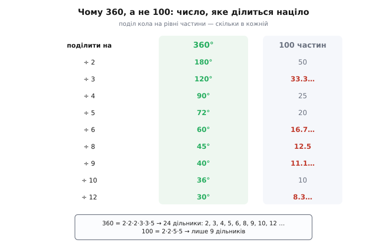
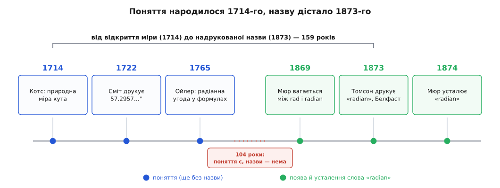

# 📜 Чому в колі 360°, а фізика лічить кут у радіанах

Коло ідеально гладке. У ньому немає ні кутів, ні зарубок, ні бодай однієї позначки, яка підказала б, звідки починати лічбу й на скільки частин його ділити. Скільки не вдивляйся в коло, воно не зізнається, що в ньому «має бути» саме 360 чогось. Число 360 не живе в геометрії — його туди поклала людина, і то так давно, що ім'я її стерлося. А тоді, за тисячі років, фізика тихцем відмовилася від зручних 360 і почала міряти кут числом, якого й не записати до кінця: у повному оберті радіанів рівно 2π ≈ 6.28, а один радіан — це незграбні 57.29578°. Навіщо ж міряти оберт мірою, у якій повний оберт — не кругле число?

Ця сторінка — про два рішення, ухвалені за три тисячі років одне від одного. Перше дало нам градус, друге — радіан. І хоч радіан на позір дивакуватий, саме він, а не охайні 360°, робить формули обертання чесними.

## Число, яке було зручно ділити

Почнімо з градуса, бо він старший. Звичка різати оберт на 360 частин прийшла з Вавилону — від астрономів Межиріччя, що лічили не десятками, як ми, а шістдесятками: їхня система числення була **шістдесяткова** (база 60). Чому саме 60 — питання окреме, але наслідок для нас важливіший: у світі, де основа лічби 60, коло природно ділити на кратне їй, а 360 = 6 · 60.

Чому ж саме 360, а не, скажімо, 600? Тут сходяться дві причини, і жодну не варто подавати як єдину доведену. Перша — небесна: сонце обходить своє коло на тлі зір (**екліптику**) приблизно за 360 діб, зсуваючись щодня десь на один «крок». Поділи річний шлях сонця на добові кроки — і кола саме собою виходить близько 360 частин. Вавилонські астрономи так і робили: різали екліптику на 12 знаків, кожен на 30 дрібніших поділок, разом 12 · 30 = 360. Друга причина — суто арифметична, і вона, схоже, вирішальна: **360 напрочуд добре ділиться**.


*360 = 2·2·2·3·3·5, тож у нього аж 24 дільники — його ріжеш націло навпіл, на три, чотири, п'ять, шість, вісім, дев'ять, десять, дванадцять рівних частин, і щоразу виходить ціле число градусів. У 100 таких дільників лише 9: третина дає 33.3…, шоста — 16.7…, восьма — 12.5.*

Для геометра й землеміра, який ділить кути без калькулятора, така подільність — подарунок: третина оберту, чверть, шоста, дюжина — усе цілі градуси. Ось чому навіть пізніша, «розумна» спроба часів метричної реформи у Франції перейти на 400 градів (де прямий кут дорівнює рівно 100) так і лишилася на маргінесі: 400 ділиться помітно гірше за 360, і зручності це не додало.

Греки успадкували вавилонський поділ уже готовим. Найдавніший уцілілий грецький текст, де коло — точніше, екліптику — розрізано на 360 частин, це «Сходження світил» (*Anaphorikos*) александрійця **Гіпсикла** (Hypsicles, ~II ст. до н. е.); історики майже певні, що сам поділ запозичено з Вавилону, і трактат той — свідчення живих зв'язків між грецькою та вавилонською астрономією. Далі його підхопив **Гіппарх Нікейський** (Hipparchus, ~190–120 до н. е.), якого звуть батьком тригонометрії: складаючи перші таблиці хорд, він лічив кути по-вавилонськи, шістдесятками. А остаточно закріпив звичай **Клавдій Птолемей** (Claudius Ptolemy, ~II ст.) у своєму «Альмагесті».

Птолемей лишив нам ще один слід — той, що ми носимо на зап'ясті. Градус він ділив на шістдесяті: перша дрібна частка (грец. «перші шістдесяті») і друга дрібна частка. Коли «Альмагест» переклали арабською (827 р.), а згодом латиною (1175 р.), ці назви стали *pars minuta prima* — «перша дрібна частина» — і *pars minuta secunda* — «друга дрібна частина». Від *minuta* лишилася наша **хвилина**, від *secunda* — **секунда**. Тобто хвилини й секунди — що на транспортирі, що на циферблаті — це буквально «перша» й «друга» вавилонські шістдесяті, які пережили три тисячі років і дві зміни мови.

## Міра, яку відкрили, але не назвали

Градус зручний оку, та він має ваду, невидиму доти, доки не візьмешся рахувати. Кут у 360-й частці оберту — величина **умовна**: у ній сидить довільний вибір предків. А чи є в кола міра кута, яку задає саме коло, без жодної домовленості?

Є. Відклади на колі дугу завдовжки рівно в радіус — кут, який вона стягує, і буде тією природною мірою. Її згодом назвуть **радіаном**. Природна вона тому, що зв'язок дуги з кутом виходить гранично чистим: довжина дуги — це просто радіус, помножений на кут,

```
s = r · θ        (θ — у радіанах)
```

без жодного перевідного множника. У градусах та сама дуга вимагає тягнути коефіцієнт: s = r · θ° · π/180. Радіан — єдина міра, у якій цей множник дорівнює одиниці й зникає з очей.

Першим це вгледів англієць **Роджер Котс** (Roger Cotes, 1682–1716). У праці «Logometria» — єдиній, яку він устиг надрукувати за життя (Philosophical Transactions, 1714, із присвятою Едмондові Галлею) — Котс користується радіанною мірою як природною, хоча слова для неї ще не має. Помер він двома роками пізніше, у 33, і Ньютон, украй скупий на похвали, зронив про нього: «Якби він жив, ми б дещо знали». Роботу Котса посмертно видав його двоюрідний брат **Роберт Сміт** (Robert Smith) — у збірці «Harmonia mensurarum» (1722); саме там, на 95-й сторінці, уперше надруковано числове значення одного радіана в градусах: 180/π ≈ 57.2957°.

А далі стається дивовижне: понад пів століття природну міру спокійно вживають, так і не давши їй імені. Швейцарець **Леонард Ойлер** (Leonhard Euler) 1765 року, означуючи кутову швидкість, фактично приймає «радіанну угоду» — рахує кут так, ніби радіан і є одиниця. Поняття вже цілком доросле й працює у формулах. Назви досі нема.

## Як кут дістав ім'я «radian»

Ім'я прийшло аж наприкінці ХІХ століття — і, як часто буває, майже одночасно з двох боків. Шотландець **Томас Мюр** (Thomas Muir) з університету Сент-Ендрюс ще 1869 року вагався, як цю одиницю назвати, і перебирав варіанти — *rad*, *radial*, *radian*. Незалежно від нього **Джеймс Томсон** (James Thomson, 1822–1892) — старший брат Вільяма Томсона, майбутнього лорда Кельвіна, і професор інженерії в Королівському коледжі Белфаста — уже приблизно з 1871-го вживав слово *radian* усно. А **5 червня 1873 року** воно вперше потрапило в друк — в екзаменаційних питаннях, які Томсон уклав для студентів у Белфасті. Цю дату як першу друковану появу терміна фіксує історик математики **Флоріан Каджорі** (Florian Cajori, 1919).

Мюр же, порадившись із Томсоном, остаточно пристав на *radian* 1874 року; вони з Александером Еллісом (Alexander J. Ellis) тлумачили слово як стягнене *radial angle* — «промінний кут». Так замкнулося коло: **між тим, як Котс відкрив міру (1714), і тим, як її нарешті назвали (1873), минуло 159 років** — поняття півтора століття жило й працювало безіменним. Прищеплювалася назва теж не миттю: ще й у підручниках 1890-х радіан подекуди звали старомодно — «круговою мірою».


*Понад століття природна міра кута існувала, працювала у формулах — і не мала імені. Слово «radian» з'явилося друком аж 1873-го, за 159 років після того, як Котс цю міру відкрив.*

## Чому фізика зрештою обрала радіан

Тепер видно, чому фізика й математика, попри всю зручність градуса для ока, зрештою стали на бік дивного 57.29578°. Причина не в естетиці, а в тому, що радіан **прибирає сміття з формул**. Щойно кут виміряно в радіанах, найважливіші співвідношення обертання стають чистими:

```
Довжина дуги під кут θ:
  радіани:  s = r · θ
  градуси:  s = r · θ° · π/180        ← зайвий множник

Швидкість точки на колі (ω — кутова швидкість):
  радіани:  v = ω · r
  градуси:  v = ω° · r · π/180         ← той самий тягар
```

Той множник π/180 — не дрібниця, яку можна перетерпіти. Він лізе **у кожну похідну**. Похідна синуса дорівнює косинусу — рівно, без коефіцієнтів — **лише** коли кут у радіанах; у градусах вигулькує той самий π/180 і вже ніколи не зникає:

```
радіани:  d(sin θ)/dθ   = cos θ
градуси:  d(sin θ°)/dθ° = (π/180) · cos θ°
```

> 🔧 **Навіщо це.** Уся диференціальна фізика коливань і хвиль — маятники, змінний струм, світло — стоїть на тому, що похідна синуса є косинус без баласту. Обери градуси — і кожне диференціювання, кожен виток інтегрування тягнутиме π/180, а в другій похідній уже (π/180)², і формули загрузнуть у степенях цього множника. Радіан — це одиниця, у якій числення взагалі не помічає, що ти працюєш саме з кутом.

Чому похідна синуса — саме косинус і звідки в градусах береться той π/180 — розібрано [у похідній синуса](topic:math/sine-derivative).

Те саме бачить кожен, хто програмував: стандартні бібліотеки говорять радіанами, не градусами.

```python
import math
math.sin(math.pi / 6)         # 0.5 — кут у радіанах, усе гаразд
math.sin(30)                  # -0.988 — «30» тут теж радіани, не 30°!
math.sin(math.radians(30))    # 0.5 — градуси довелося явно перевести
```

Функція `sin` не знає жодних градусів; хочеш подати кут у градусах — сам домнож на π/180 (це й робить `radians`). Радіан переміг не декретом, а тим, що він — єдина міра, у якій математика кута не потребує поправок. Через це й **кутову швидкість у фізиці задають у радіанах за секунду**: тоді лінійна швидкість точки — просто ωr, а не ωr·π/180. Даташит вентилятора напише оберти за хвилину для людини; формула ж хоче радіани — бо лише в них множення на радіус дає швидкість без пені.

## Дві міри, що не воюють

Отож обидві міри живі, і кожна на своєму місці. Градус — міра для людини: 90° прямого кута, 180° розвороту, 360° повного оберту читаються з півслова, діляться націло й не потребують π. На ньому тримаються навігація, картографія, геодезія, шкільний транспортир — усе, де кут треба назвати й поділити, а не диференціювати. Радіан — міра для формули: у ній дуга є rθ, швидкість є ωr, похідна синуса є косинус, і числення не спотикається на переведеннях.

А коло, з якого ми почали, так і лишилося гладким та безмовним. Немає в нього «правильного» числа частин — ні 360, ні 2π. Ми просто підносимо до нього то одну лінійку, то іншу, залежно від того, що робимо: назвати кут — беремо вавилонські 360; порахувати рух — беремо радіан, у якому сам радіус міряє поворот.
