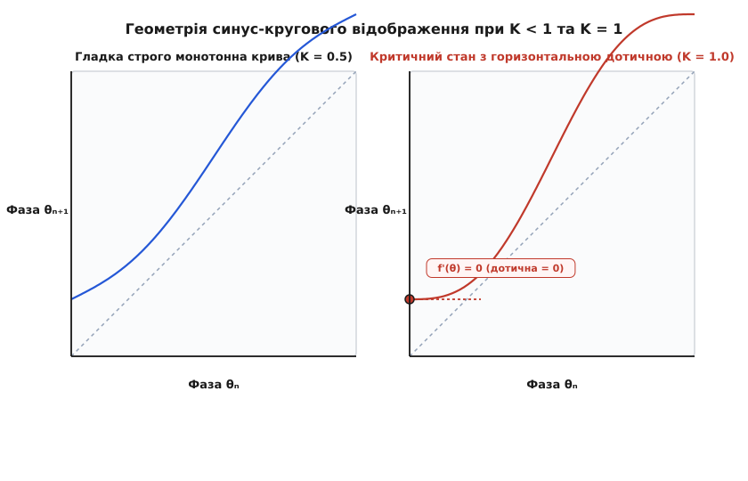
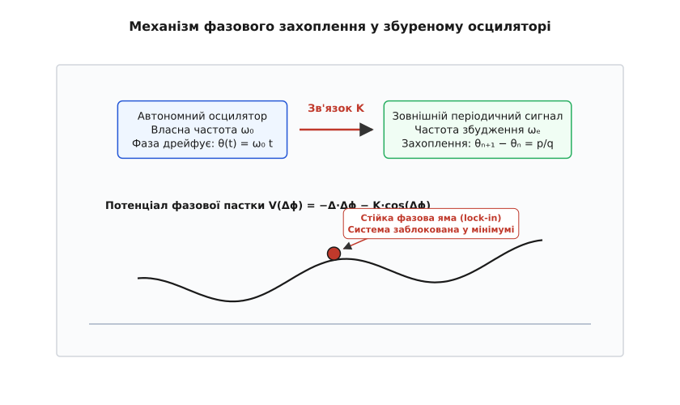
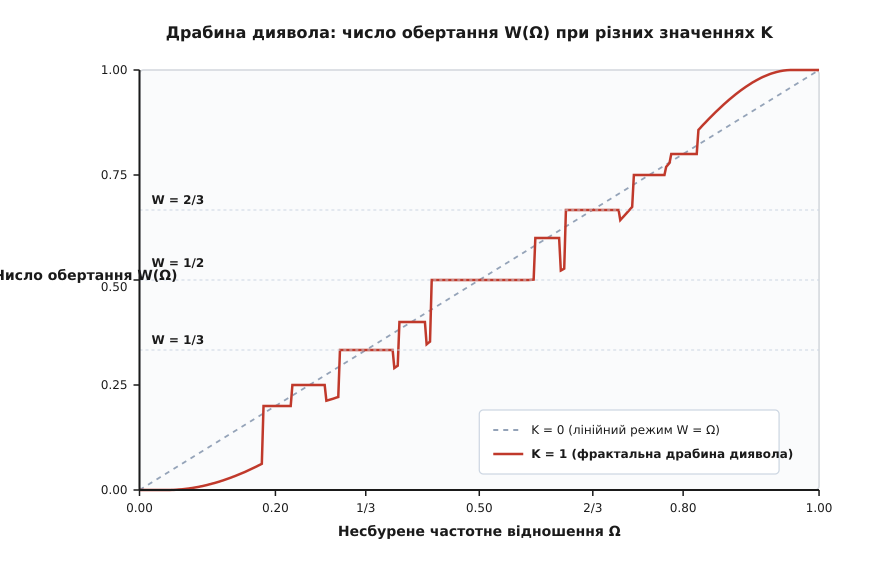

# Язики Арнольда

<preknowlist>
* [Механічний резонанс та вимушені коливання](topic:physics/mechanics/mechanical-resonance.md)
* [Детермінований хаос та атрактори](topic:physics/mechanics/deterministic-chaos.md)
* [Фазовий портрет та лінеаризація систем](topic:physics/mechanics/phase-portrait.md)
* [Осцилятор Даффінга та нелінійні коливання](topic:physics/mechanics/duffing-oscillator.md)
* [Фігури Ліссажу](topic:physics/oscillations-waves/lissajous.md)
</preknowlist>

Коли два маятники підвішують на спільну дерев'яну балку, через деякий час їхній рух синхронізується: вони починають коливатися або строго в ідеальній фазі, або у протифазі. Зовнішньо цей ефект виглядає як просте співпадіння частот, але фізична природа явища є значно глибшою: нелінійний зв'язок між автоколивальними системами підлаштовує власні частоти руху, створюючи стійкі інтервали частотного захоплення. У просторі параметрів, що описують власну частоту системи та амплітуду зовнішнього впливу, ці області фазової синхронізації утворюють клиноподібні структури, відомі у математичній фізиці як **язики Арнольда** (англ. *Arnold tongues*).

Язики Арнольда є фундаментальним поняттям теорії нелінійних коливань та канонічною моделлю для опису переходів між періодичним рухом, квазіперіодичністю та детермінованим хаосом. Детальний аналіз хронології відкриття цього явища — від перших спостережень Християна Гюйгенса у сімнадцятому столітті до робіт Володимира Арнольда у 1961 році — наведено у [історії відкриття нелінійного фазового захоплення](topic:physics/arnold-tongues/hist-arnold-tongues.md).

## Фізична природа та механізм нелінійного фазового захоплення

У класичній лінійній механіці вимушені коливання характеризуються тим, що система під дією зовнішнього гармонічного сигналу завжди відповідає строго на частоті зовнішньої збурювальної сили. Амплітуда коливань визначається резонансною кривою, але частота відгуку не залежить від амплітуди зв'язку. Проте в автоколивальних системах — таких як годинникові механізми, електронні генератори, серцевий м'яз чи лазери з внутрішнім підкачуванням — існує власна внутрішня частота руху `f_0`, яка підтримується за рахунок постійного неконсервативного джерела енергії та обмежена стійким фазовим граничним циклом у фазовому просторі.

Коли на таку автоколивальну систему діє зовнішній періодичний сигнал з частотою `f_ext`, виникає конкуренція між власною частотою `f_0` та частотою збудження. За малого нелінійного зв'язку система зберігає квазіперіодичний режим: у її спектрі присутні дві невимірні частоти, а фазова траєкторія нескінченно щільно вкриває двовимірний торус у фазовому просторі. Проте зі збільшенням інтенсивності нелінійного зв'язку власна частота автоколивань підтягується до частоти зовнішнього збудження (або до її раціонального кратного дробу `p/q`).


*Схема нелінійної синхронізації та геометрична інтерпретація стабільних нерухомих точок.*

Фізичний механізм синхронізації полягає у виникненні нелінійного відновлювального моменту, який зсуває фазу системи вбік стійкого фазового рівноважного стану. Розглянемо різницю фаз `ψ(t) = θ_sys(t) - (p/q)·θ_ext(t)`. За відсутності нелінійного зв'язку фазова різниця монотонно зростає або спадає з часом: `dψ/dt = 2·π·(f_0 - (p/q)·f_ext) ≠ 0`.

Коли вмикається нелінійний зв'язок з амплітудою `K`, у рівнянні для різниці фаз з'являється нелінійний потенціальний член:

```
dψ/dt = Δf - (K / (2·π)) · sin(ψ)
```

де `Δf = f_0 - (p/q)·f_ext` — початкова розстрочка частот. Якщо амплітуда зв'язку задовольняє умову `K / (2·π) ≥ |Δf|`, рівняння отримує дві нерухомі точки:
1. Стійку вузлову точку `ψ_stable`, де `sin(ψ_stable) = (2·π·Δf) / K` та `cos(ψ_stable) > 0`.
2. Нестійку сідлову точку `ψ_unstable`, де `cos(ψ_unstable) < 0`.

У результаті відносна різниця фаз припиняє дрейфувати й затискається в околі стабільної нерухомої точки `ψ_stable`. Система входить у режим **фазового захоплення** (англ. *phase locking*). Якщо ж розстрочка перевищує критичне значення `|Δf| > K / (2·π)`, стійкі нерухомі точки зникають внаслідок сідло-вузлової біфуркації (англ. *saddle-node bifurcation*), і система повертається до квазіперіодичного дрейфу фази. З фізичної точки зору це означає, що при близьких частотах власна частота автоколивань підлаштовується та «прилипає» до зовнішньої частоти, формуючи плато стійкої енергетичної взаємодії між двома дисипативними підсистемами у фазовому просторі.

## Перехід від неперервної динаміки до дискретного кругового відображення

Для з'ясування того, звідки в фундаментальній фізиці береться дискретне кругове відображення, розглянемо класичний вимушений осцилятор Ван дер Поля (англ. *forced van der Pol oscillator*):

```
d²x/dt² - ε·(1 - x²)·(dx/dt) + ω_0²·x = E·cos(ω·t)
```

де `ε > 0` — параметр малого нелінійного тертя, `ω_0` — власна частота автоколивань, а `E` та `ω` — амплітуда та частота зовнішньої збурювальної сили.

За допомогою методу усереднення Боголюбова — Митропольського фазу осцилятора `θ(t)` можна відокремити від повільно змінюваної амплітуди `R(t)`. Переходячи до дискретного часу через стробоскопічний перетин Пуанкаре з періодом зовнішньої сили `T = 2·π / ω`, ми фіксуємо фазу `x_n = θ(n·T) / (2·π) (mod 1)` на початку кожного періоду.

У першому наближенні теорії збурень за малим параметром `ε` перша гармоніка Фур'є нелінійного зв'язку дає синусоїдальну поправку:

```
x_{n+1} = x_n + Ω - (K / (2·π)) · sin(2·π·x_n)  (mod 1)
```

це і є синус-кругове відображення Арнольда. Таким чином, синусоїдальний член `sin(2·π·x_n)` виникає не як довільний математичний вибір, а як перша домінуюча гармоніка спектрального розкладу зв'язку між неперервними осциляторами.

## Математична модель: синус-кругове відображення Арнольда

У рівнянні відображення змінна `x_n ∈ [0, 1)` представляє фазу осцилятора, зведену до одиничного кола `S¹` (де `0` відповідає фазі `0`, а `1` відповідає `2·π` радіан). Безрозмірні параметри системи мають наступний фізичний та геометричний зміст:

1. `Ω` (безрозмірна частота) — відношення власної частоти осцилятора до частоти зовнішнього збудження за відсутності нелінійного зв'язку (`K = 0`). Значення `Ω` приводиться до інтервалу `[0, 1)` відкиданням цілої частини.
2. `K` (параметр нелінійності) — безрозмірна амплітуда зовнішнього збудження або сила зв'язку між підсистемами.

Для математичного аналізу відображення зручно зняти операцію модулю `mod 1` та перейти від одиничного кола `S¹` до всієї дійсної прямої `ℝ`. Таке розгортання називається **ліфтингом** (англ. *lifting*).


*Динаміка синус-кругового відображення та ліфтинг фазового колу на дійсну пряму.*

Ліфтована функція `F: ℝ -> ℝ` визначається виразом:

```
F(x) = x + Ω - (K / (2·π)) · sin(2·π·x)
```

Вона задовольняє важливі умові періодичності: `F(x + 1) = F(x) + 1` для будь-якого `x ∈ ℝ`.

Похідна ліфтованої функції дорівнює:

```
F'(x) = 1 - K · cos(2·π·x)
```

Аналіз цієї похідної дозволяє розбити простір параметрів на два принципово різних режими:
* **Область диффеоморфізмів (`K < 1`):** Похідна є строго позитивною `F'(x) > 0` для всіх `x`. Відображення є строго монотонним, неособливим та гладко оборотним диффеоморфізмом колом.
* **Критична межа (`K = 1`):** У точці `x = 0` (та усіх цілочисельних зсувах) похідна дорівнює нулю `F'(0) = 0`. Відображення має кубічну критичну точку.
* **Закритична область некоректності (`K > 1`):** Похідна змінює знак, виникають локальні максимуми та мінімуми. Відображення втрачає взаємну однозначність, перестає бути монотонним і допускає складні хаотичні атрактори.

Повне математичне виведення теорем про існування та гладкість кругових відображень детально розібрано у [математичному виведенні властивостей кругового відображення](topic:physics/arnold-tongues/math-circle-map.md).

## Число обертання Пуанкаре та строга класифікація режимів

Для опису середньої частоти обертання фазової точки Анрі Пуанкаре ввів строге математичне поняття — **число обертання** (англ. *rotation number*) `W`. Воно визначається як границя середнього зсуву фази за нескінченне число кроків дискретного часу:

```
W = lim_{n -> ∞} (F^n(x_0) - x_0) / n
```

де `F(x)` — ліфтоване відображення, а `F^n(x)` позначає `n`-кратну композицію функції `F(F(...F(x)...))`.

### Теорема Данжуа та властивості числа обертання

Видатний математик Арно Данжуа (англ. *Arnaud Denjoy*) довів фундаментальну теорему: якщо відображення кола є гладким диффеоморфізмом (при `K < 1`), то границя `W` існує для будь-якої початкової фази `x_0` та є повністю незалежною від вибору початкової точки `x_0`.

Фізична класифікація режимів динаміки повністю визначається числовим значенням `W`:

1. **Раціональне число обертання (`W = p/q`, де `p, q ∈ ℤ`):**
   * У системі спостерігається **фазове захоплення** (синхронізація або резонанс).
   * За `q` кроків дискретного часу фаза системи здійснює точно `p` повних обертів навколо кола: `F^q(x_0) = x_0 + p`.
   * На фазовому колі існує принаймні одна стійка періодична орбіта періоду `q`.
   * Усі початкові фази `x_0` з часом асимптотично притягуються до цієї стійкої орбіти.

2. **Ірраціональне число обертання (`W ∉ ℚ`):**
   * Система перебуває у **квазіперіодичному режимі** (безсинхронізаційному дрейфі).
   * Послідовність фазових точок `{x_n}` ніколи не повторюється й не замикається у періодичний цикл.
   * Згідно з теоремою Данжуа, за наявності ірраціонального числа обертання відображення топологічно еквівалентне чистому ірраціональному повороту колу `x_{n+1} = x_n + W`. Орбіта нескінченно щільно заповнює все фазове коло `S¹`.

## Теорема КАМ та руйнування інваріантних торів

Теорія Колмогорова — Арнольда — Мозера (КАМ) описує збереження квазіперіодичних тороїдальних траєкторій при малих нелінійних збуреннях. У контексті кругового відображення теорема КАМ стверджує, що якщо ірраціональне число обертання `W` задовольняє **діофантову умову** (англ. *Diophantine condition*):

```
|W - p/q| > C / q^(2+ε)
```

для деяких констант `C > 0` та `ε > 0`, то при малому `K > 0` квазіперіодичний інваріантний торус не руйнується, а лише нелінійно деформується.

Проте при збільшенні нелінійності до критичного значення `K = 1` діофантові інваріантні торі остаточно розпадаються, перетворюючись на ніде не щільні фрактальні множини — **кантори** (англ. *cantori*). Крізь дірки в канторах траєкторія системи починає повільно просочуватися, що відкриває шлях до глобальної хаотизації динаміки.

## Топологічна анатомія язиків Арнольда

Якщо побудувати двовимірну карту простору параметрів `(Ω, K)`, де по осі абсцис відкладено власну частоту `Ω ∈ [0, 1]`, а по осі ординат — амплітуду зв'язку `K ≥ 0`, області раціонального числа обертання `W(Ω, K) = p/q` утворюють відкриті клиноподібні зони. Ці зони називаються **язиками Арнольда**.


*Карта фазового захоплення (язики Арнольда) у просторі параметрів частоти та амплітуди зв'язку.*

Кожен язик Арнольда має наступні характерні топологічні та геометричні риси:

### 1. Вершина клина біля основи (`K = 0`)
На осі абсцис (`K = 0`) кожен язик звужується до однієї точки `Ω = p/q`. Це означає, що за відсутності нелінійного зв'язку фазове захоплення можливе лише при точній відповідності власної частоти раціональному відношенню `p/q`.

### 2. Закони розширення меж язиків при малих `K`
При збільшенні параметра нелінійності `K` ширина язика `ΔΩ_q(K) = Ω_right(K) - Ω_left(K)` поступово зростає. Подібно до того, як сильніший відновлювальний момент здатний компенсувати більшу початкову розстрочку частот, більша амплітуда зв'язку дозволяє захоплювати фазу у ширшому діапазоні `Ω`.

Теорія збурень дозволяє розрахувати асимптотику меж язиків при `K -> 0`:
* Для головного резонансу `1/1` межі розходяться лінійно:
  ```
  Ω_left = 1 - K / (2·π)
  Ω_right = 1 + K / (2·π)
  ΔΩ_1(K) = K / π
  ```
* Для субрезонансу `1/2` межі малюють симетричний клин другого порядку:
  ```
  ΔΩ_2(K) ~ K^2 / (8·π)
  ```
* Загальний закон для резонансу вищого порядку `p/q` визначається степенем знаменника `q`:
  ```
  ΔΩ_q(K) = C_q · K^q + O(K^{q+1})
  ```
Цей фундаментальний результат пояснює, чому язики з великими знаменниками `q` (наприклад `13/34`) є надзвичайно тонкими біля основи `K = 0` та стають помітними лише при суттєвій амплітуді зв'язку `K > 0.5`.

### 3. Неперетинність язиків у підкритичній області (`K ≤ 1`)
Для будь-яких двох різних раціональних дробів `p_1 / q_1 ≠ p_2 / q_2` відповідні язики Арнольда не перетинаються у всій області `K ≤ 1`. Монотонність відображення гарантує строго впорядковану структуру язиків: якщо `p_1 / q_1 < p_2 / q_2`, то для будь-якого `K ∈ [0, 1]` праве крило першого язика лежить строго лівіше від лівого крила другого язика.

## Ієрархія Фарея, медіанти та самоподібна структура резонансів

Розподіл язиків Арнольда вздовж осі частот `Ω` підпорядковується строгим законам теорії чисел та комбінаторики дробів. Якщо розглянути два сусідніх язики з числами обертання `p_1 / q_1` та `p_2 / q_2`, то найширший язик, розташований у географічному проміжку між ними, відповідає їхній **медіанті Фарея** (англ. *Farey mediant*):

```
p_new / q_new = (p_1 + p_2) / (q_1 + q_2)
```

Дерево Фарея будується ітеративно, починаючи з двох базових межових резонансів `0/1` та `1/1`:

```
Рівень 0:  0/1                                                  1/1
            \                                                  /
Рівень 1:   \                        1/2                       /
             \                      /   \                     /
Рівень 2:     \        1/3         /     \        2/3        /
               \      /   \       /       \      /   \      /
Рівень 3:       1/4       2/5           3/5       3/4
```

Усі раціональні дроби у дереві Фарея задовольняють важливу умову унімодулярності: для будь-якої пари сусідніх нескоротних дробів виконується співвідношення `p_2·q_1 - p_1·q_2 = 1`.

Ширина язиків Арнольда строго корелює з їхнім положенням у дереві Фарея: чим менший знаменник `q`, тим більша площа відповідного язика у просторі параметрів. Найпотужнішими є язики основного порядку `1/1`, `1/2`, `1/3`, `2/3`, `1/4`, `3/4`.

Війчастий характер карти Арнольда володіє самоподібністю (фрактальною фрактальністю): якщо збільшити мікроскопічний фрагмент карти між двома язиками, ми побачимо зменшену точну копію всієї структури язиків Арнольда з нескінченним числом нових медіантних клинів.

## Узагальнення на несинусоїдальні та асиметричні відображення

У реальних фізичних приладах нелінійна функція зв'язку `g(x)` рідко буває строго синусоїдальною. У загальному випадку відображення описується виразом:

```
x_{n+1} = x_n + Ω - K · g(x_n)  (mod 1)
```

де `g(x)` — гладка неперервна періодична функція `g(x + 1) = g(x)` з нульовим середнім значенням `∫_0^1 g(x) dx = 0`.

Якщо функція `g(x)` містить вищі гармоніки Фур'є `g(x) = ∑_{m=1}^M a_m · sin(2·π·m·x)`, геометрія язиків змінюється:
1. **Зміна асимптотики ширини язиків:** Присутність `m`-ої гармоніки призводить до того, що ширина субрезонансу `1/m` розходиться лінійно за амплітудою `K` біля основи, а не як `K^m`.
2. **Асиметрія клинів:** Якщо функція `g(x)` містить косинусоїдальні фазові зсуви `b_m · cos(2·π·m·x)`, язики Арнольда нахиляються убік більш високих чи нижчих частот `Ω`.

Незважаючи на ці локальні географічні спотворення, топологічна структура дерева Фарея, існування драбини диявола та універсальні показники фрактальності при `K = 1` лишаються строго незмінними.

## Драбина диявола та фрактальна міра

Якщо зафіксувати амплітуду зв'язку `K` на певному рівні (при `K > 0`) та побудувати графік залежності числа обертання `W` від власної частоти `Ω`, ми отримаємо неперервну монотонно неспадаючу функцію `W(Ω)`, яка має безліч горизонтальних плато на кожному раціональному значенні `W = p/q`.

Ця математична конструкція називається **драбиною диявола** (англ. *Devil's staircase*).


*Драбина диявола: залежність числа обертання від власної частоти осцилятора.*

Драбина диявола володіє дивовижними математичними та фізичними властивостями:

### 1. Неповна драбина диявола (`0 < K < 1`)
При `K < 1` сумарна довжина всіх горизонтальних раціональних плато `S_lock = ∑ ΔΩ_q(K)` на інтервалі `Ω ∈ [0, 1]` є строго меншою за одиницю (`S_lock < 1`). Множина точок ірраціонального числа обертання (квазіперіодичних режимів) має позитивну міру Лебега `μ_irr = 1 - S_lock > 0`. Випадково вибране значення `Ω` має відмінну від нуля ймовірність потрапити у квазіперіодичний режим.

### 2. Повна канторова драбина диявола (`K = 1`)
На критичній межі `K = 1` відбувається якісна перебудова: сумарна довжина всіх горизонтальних плато на інтервалі `Ω ∈ [0, 1]` досягає точно одиниці (`S_lock = 1`).

Це означає, що майже для всіх значень частоти `Ω` (у сенсі міри Лебега) система перебуває у стані фазового захоплення на одному з раціональних резонансів `p/q`. Множина точок ірраціонального числа обертання перетворюється на ніде не щільну фрактальну канторову множину з нульовою мірою Лебега (`μ_irr = 0`), але з незліченною кількістю точок.

Хаусдорфова розмірність (англ. *Hausdorff dimension*) доповнення до плато драбини диявола при `K = 1` є універсальною числовою константою:

```
D_H ≈ 0.8701
```

Значення `D_H ≈ 0.87` є універсальним показником для широкого класу нелінійних кругових відображень з кубічною критичною точкою, незалежно від конкретного аналітичного вигляду нелінійної функції.

Докладний аналіз алгоритмів чисельного розрахунку драбини диявола та побудови карт у просторі параметрів наведено у [практичному чисельному розрахунку язиків Арнольда](topic:physics/arnold-tongues/proj-circle-map.md).

## Критична універсальність при золотому перетині та константа Шенкера

Особливий науковий інтерес становить поведінка системи при найбільш ірраціональному частотному співвідношенні — **золотому перетині** `Ω_golden = (√5 - 1) / 2 ≈ 0.6180339887`. Дріб золотого перетину розкладається у нескінченний ланцюговий дріб з одних одиниць `[0; 1, 1, 1, 1, ...]`, що робить його найповільніше збіжним серед усіх ірраціональних чисел (найвіддаленішим від будь-яких раціональних резонансів).

Сходинки східців ланцюгового дробу золотого перетину утворюються відношеннями послідовних чисел Фібоначчі:

```
F_n / F_{n+1} = 1/1, 1/2, 2/3, 3/5, 5/8, 8/13, 13/21, 21/34, ...
```

На критичній межі `K = 1` при `Ω -> Ω_golden` застосовується метод ренормалізаційної групи (англ. *renormalization group / RG*). Скотт Шенкер (англ. *Scott Shenker*) у 1982 році виявив, що траєкторія відображення у цій точці демонструє масштабову самоподібність, яка описується двома універсальними константами Шенкера:

```
δ_Shenker ≈ 2.8336106
α_Shenker ≈ -1.2885745
```

Константа `δ_Shenker` відповідає за масштабування параметрів `Ω` в околі золотого перетину, а `α_Shenker` визначає просторове масштабування фази. Ця універсальність є абсолютно аналогічною універсальності Фейгенбаума у подвоєнні періоду: будь-яке гладке кругове відображення з кубічною критичною точкою при переході до хаосу через золотим перетином підпорядковується цим самим константам.

## Вплив стохастичного шуму на геометрію язиків Арнольда

У реальних фізичних та технічних системах завжди присутній тепловий шум, джиттер або квантові фазові флуктуації. Для моделювання цих завад до відображення Арнольда додається стохастична флуктуаційна член-змінна `ξ_n`:

```
x_{n+1} = x_n + Ω - (K / (2·π)) · sin(2·π·x_n) + ξ_n  (mod 1)
```

де `ξ_n` — послідовність незалежних однаково розподілених випадкових величин з нульовим математичним сподіванням та дисперсією `σ_noise²`.

Наявність шуму змінює динаміку язиків наступним чином:
1. **Розмиття меж язиків:** Різкі сідло-вузлові межі язиків розмиваються. Замість строгої фазової фіксації виникає статистичний розподіл різниці фаз.
2. **Активаційні фазові зриви (англ. *phase slips*):** Навіть у глибині язика Арнольда флуктуація шуму може викинути фазу з потенціальної ями через сідлову точку `ψ_unstable`. Середній час між зривами фази описується формулою Крамерса: `τ_slip ~ exp(ΔU / σ_noise²)`, де `ΔU` — висота потенціального бар'єра.
3. **Згладжування драбини диявола:** Чіткі горизонтальні раціональні плато перетворюються на гладкі похилі криві. Вузькі язики високого порядку повністю замилюються noise-фонom.

## Чисельні алгоритми пошуку меж язиків Арнольда

Для точного автоматичного чисельного побудування меж язиків Арнольда `Ω_left(K)` та `Ω_right(K)` застосовуються комбіновані методи нелінійного аналізу:

1. **Метод бісекції (ділення навпіл):** Для заданого значення `K` шукаються два значення `Ω_a` та `Ω_b`, такі що `W(Ω_a) < p/q` та `W(Ω_b) = p/q`. Шляхом послідовного ділення відрізка навпіл межа виявляється з заданою точністю `10⁻⁶`.
2. **Метод Ньютона — Рафсона для ліфтованої функції:** Для резонансу `p/q` шукаються координати стабільної нерухомої точки `x*` та відповідного значення `Ω`, за яких виконується система двох рівнянь:
   ```
   F^q(x*) - x* - p = 0
   (d/dx) F^q(x*) - 1 = 0
   ```
Друге рівняння відповідає межі сідло-вузлової біфуркації, де мультиплікатор малого відхилення дорівнює точно одиниці (`λ_mult = 1`).

## Дифузія Арнольда у багатовимірних системах

Якщо розглядати взаємодію трьох або більше нелінійних осциляторів, фазовий простір розширюється до багатовимірного торуса `Т^N = S¹ × S¹ × ... × S¹`. У гамільтонових системах із кількістю ступенів вільності `N ≥ 3` виникає топологічно новий ефект — **дифузія Арнольда** (англ. *Arnold diffusion*).

На відміну від двовимірного випадку, де інваріантні КАМ-торі (англ. *KAM tori*) розділяють фазовий простір та ізолюють області руху, у багатовимірному просторі резонансні язики перетинаються, утворюючи неперервну зв'язану мережу — **павутину Арнольда** (англ. *Arnold web*). У цій мережі траєкторія системи може повільно дрейфувати вздовж резонансів на будь-які відстані у фазовому просторі, навіть при як завгодно малому нелінійному збуренні.

## Перехід до некоректності, перетин язиків та детермінований хаос (`K > 1`)

При перевищенні критичного значення нелінійності (`K > 1`) відображення Арнольда зазнає глобальної топологічної трансформації. Похідна `F'(x) = 1 - K·cos(2·π·x)` стає від'ємною на ділянках навколо `x = 0`, і функція втрачає строгу монотонність.


*Зміна графіку відображення Арнольда та виникнення локальних екстремумів при K > 1.*

У закритичній області (`K > 1`) відбуваються наступні фізичні та топологічні процеси:

### 1. Руйнування гладкого торуса та перетин язиків
Сусідні язики Арнольда розширюються настільки сильно, що починають накладатися один на одного у просторі параметрів. У зоні перетину виникає **мультистабільність** — співіснування кількох атракторів при однакових зовнішніх параметрах. Залежно від початкової фази `x_0` система може захоплюватися на різні раціональні резонанси (наприклад `1/2` або `2/3`), що супроводжується явищами гістерезису.

### 2. Каскади біфуркацій подвоєння періоду
Всередині кожного язика Арнольда при `K > 1` стійка непорушна точка періоду `q` втрачає стабільність внаслідок біфуркації подвоєння періоду (англ. *period-doubling bifurcation*). Замість одного стійкого стану виникає цикл періоду `2·q`, потім `4·q`, `8·q` і так далі. Послідовність точок біфуркацій збігається до хаотичної межі за універсальним законом Фейгенбаума з константою `δ ≈ 4.6692016`.

### 3. Виникнення детермінованого хаосу
За межею каскаду подвоєння періоду виникають хаотичні атрактори. Старший показник Ляпунова `λ` стає строго позитивним:

```
λ = lim_{n -> ∞} (1 / n) · ∑_{i=0}^{n-1} ln|F'(x_i)| > 0
```

Позитивний показник Ляпунова свідчить про експоненціальну розбіжність близьких початкових траєкторій, втрату довгострокової передбачуваності та виникнення **детермінованого хаосу**. Фазова синхронізація повністю руйнується, а фаза `x_n` демонструє хаотичну дифузію вздовж дійсної осі.

Для проведення комп'ютерного експерименту з розрахунку показників Ляпунова та експорту карт у HDF5 розроблено спеціальну обчислювальну бібліотеку, опис якої міститься у [довіднику публічного програмного інтерфейсу C/C++ бібліотеки](topic:physics/arnold-tongues/api-circle-map.md).

## Експериментальні методи діагностики язиків у лабораторії

У лабораторних умовах ідентифікація меж язиків Арнольда здійснюється наступними основними методами:

1. **Фігури Ліссажу (Осцилографічний метод):** Сигнал генератора подається на `X`-вхід осцилографа, а опорний сигнал збудження — на `Y`-вхід. Стійкі замкнені петлі Ліссажу свідчать про точне раціональне фазове захоплення `p/q`.
2. **Спектральний аналіз (FFT):** Вимірюється спектр потужності вихідного сигналу. У режимі захоплення у спектрі присутні лише дискретні гармоніки `f = (p/q)·f_ext`. Поява широкої непрервної полоси або бічних супутникових частот свідчить про вихід за межі язика або перехід до хаосу.
3. **Стробоскопічне фазове детектування:** За допомогою цифрових лічильників вимірюється інтервал часу між перетинами нуля вихідного та опорного сигналів. Горизонтальне плато у часовій серії фаз підтверджує синхронізацію.

## Фізичні та технічні застосування

Язики Арнольда є універсальним інструментом аналізу нелінійних систем у найрізноманітніших галузях фізики, інженерії та біології.

### 1. Джозефсонівські контакти (Квантова надпровідність)

У надпровідниковому переході Джозефсона під дією зовнішнього високочастотного мікрохвильового випромінювання рівняння фазового зсуву `φ` описується модельним рівнянням кругового відображення.

Язикам Арнольда в джозефсонівському переході відповідають квантовані плато на вольт-амперній характеристиці — **сходинки Шапіро** (англ. *Shapiro steps*). На цих плато напруга `V` чітко квантується згідно з співвідношенням:

```
V_n = (n · h · f_ext) / (2 · e)
```

де `h` — константа Планка, `e` — заряд електрона, а `f_ext` — частота зовнішнього випромінювання. Цей ефект лежить в основі сучасних первинних еталонів вольта.

### 2. Системи фазової автопідстройки частоти (ФАПЧ / PLL)

У радіотехніці та мікроелектроніці системи фазової автопідстройки частоти (англ. *Phase-Locked Loop / PLL*) застосовуються для стабілізації частоти генераторів у процесорах та трансиверах.

Язики Арнольда визначають смугу захоплення (англ. *pull-in range*) та смугу утримання (англ. *hold-in range*) ФАПЧ, позначаючи діапазони параметрів, у яких генератор гарантовано зберігає синхронізацію з опорним кварцовим сигналом за наявності фазового шуму.

### 3. Біофізика та серцевий ритм

У фізіології серцево-судинної системи природний синусовий вузол можна розглядати як автоколивальний осцилятор, який взаємодіє з зовнішнім штучним кардіостимулятором.

Захоплення фази серцевих скорочень імпульсами стимулятора відбувається у межах язиків Арнольда відповідних резонансів (наприклад `1:1`, `2:1`, `3:2`). Якщо параметри стимулятора виходять за межі язиків, спостерігаються небезпечні аритмії та аперіодична фібриляція.

### 4. Нейронні мережі та мозочкові ритми

У нейрофізіології синхронізація імпульсних розрядів між нейронами описується ансамблями зв'язаних кругових відображень. Фазове захоплення альфа- та гамма-ритмів головного мозку визначає механізми когнітивної обробки інформації, а втрата синхронізації супроводжує неврологічні патології (наприклад епілептичні напади чи хворобу Паркінсона).

### 5. Оптомеханічні резонатори та оптичні частотні гребінки

У сучасній нанофізиці мікромеханічні консолі (англ. *cantilevers*) взаємодіють з оптичним полем високодобротного мікрорезонатора. Нелінійний тиск світла призводить до фазового захоплення механічних коливань лазерною модою, що дозволяє генерувати оптичні частотні гребінки (англ. *optical frequency combs*) для фемтосекундної спектроскопії.

### 6. Небесна механіка та резонанси Кірквуда

У сонячній системі орбітальні руху астероїдів у головному поясі зазнають періодичного гравітаційного збудження з боку масивного Юпітера. Співвідношення орбітальних періодів (наприклад `3:1`, `5:2`, `7:3`, `2:1`) описуються спіральною структурою язиків Арнольда. Причиною виникнення відомих люків Кірквуда (англ. *Kirkwood gaps*) — пустих смуг у розподілі астероїдів — є саме нестабільність орбіт на межах хаотичного перетину язиків.

> 🔧 **Навіщо це.**
> Концепція язиків Арнольда дає інженеру та фізику чітку математичну карту нелінійної стабільності. Замість хаотичного пошуку параметрів методом спроб та помилок, карта Арнольда дозволяє одразу визначити мінімально необхідну потужність зв'язку `K` для надійної синхронізації генератора на заданій частоті `Ω`, а також завчасно розрахувати допустимий допуск технологічного розводу власних частот компонентів.

## Підсумок

Язики Арнольда демонструють, як з простого дискретного нелінійного відображення народжується складна фрактальна геометрія простору параметрів. Вони поєднують строгі результати теорії чисел (дерево Фарея, неперервні дроби) з фундаментальними ефектами нелінійного динаміки (фазове захоплення, драбина диявола, перехід до хаосу). Розуміння геометрії язиків є ключем до проектування стабільних генераторів, надпровідникових квантових пристроїв та розуміння механізмів синхронізації у живих організмах.
