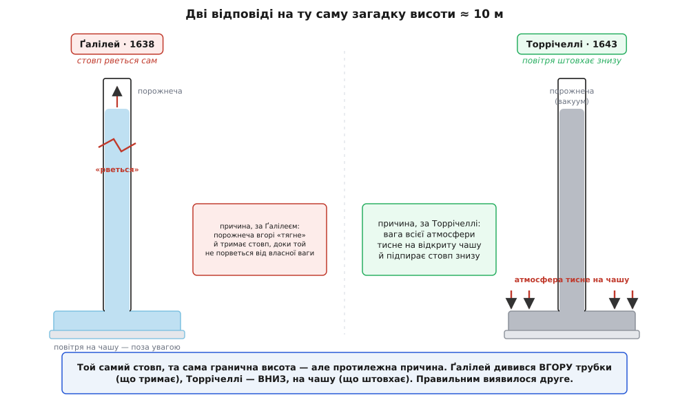
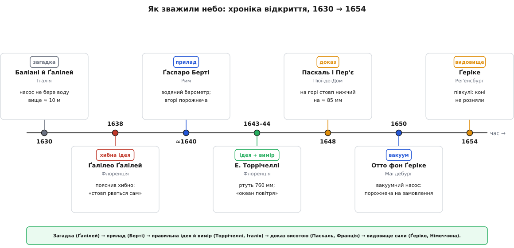

# 📜 Океан повітря: як його навчилися зважувати

Кілька століть один упертий, зовсім негероїчний факт не давався жодному поясненню: всмоктувальний насос, хоч який справний, не піднімав воду з колодязя, глибшого за якісь десять метрів. Ні на волосину більше. Це не була забавка для філософів — на цю невидиму стіну натикалися ті, хто ставив фонтани, осушував копальні, качав воду для садів, і вона коштувала їм грошей. А коли відповідь нарешті знайшлася, вона перекинула дві тисячі років фізики й показала дивовижну річ: усе життя ми проводимо на дні незримого океану. Дорога до цієї відповіді забрала чверть століття, завела в глухий кут найбільшого вченого доби, зажадала трубки заввишки з будинок, сходження на гору й тридцятьох коней.

## Насос, який не хотів піднімати воду вище десяти метрів

Всмоктувальний насос здається простим до очевидності: поршень іде вгору, «висмоктує» воду, і та слухняно піднімається слідом. Здоровий глузд каже, що коли пригнати поршень щільно, воду можна підняти на будь-яку висоту — була б труба досить довга. Але майстри знали інше. Хоч як старайся, вище приблизно десяти метрів вода не йде: доходить до цієї межі й наче впирається в невидиму заслінку.

Найраніший точно засвідчений слід цієї загадки — лист. 1630 року генуезець Джованні Баттіста Баліані (Giovanni Battista Baliani) написав Ґалілео Ґалілею (Galileo Galilei), що збудований ним сифон через пагорб не працює: вода нізащо не хоче перевалювати за висоту десь із десять метрів, хоч труба справна й герметична. Ґалілей поставився до цього серйозно й у своїй останній великій книзі — «Бесіди й математичні докази двох нових наук» (1638) — записав межу чорним по білому: всмоктуванням воду не підняти вище ніж на вісімнадцять флорентійських ліктів, тобто десь на десять метрів.

Записати межу — це ще не пояснити її. І тут наймогутніший розум епохи схибив. Ґалілея тримала в полоні стародавня догма — *horror vacui* (лат. — «страх порожнечі», «природа не терпить порожнього місця»). Він уявляв стовп води так, ніби той висить із порожнечі над ним, як мотузка звисає з гачка. Порожнеча нібито «тримає» воду, але має обмежену силу — свою *resistenza del vacuo*, «опірність порожнечі». Довший стовп важчий; коли вага води переважить цю силу, стовп обривається під власною вагою — так само, як завелика мотузка рветься, коли її звісити з одного кінця. Десять метрів — це просто та довжина, за якою «мотузка з води» рветься.

Придивімося, у чому саме промах, бо він повчальний. Ґалілей дивився **вгору трубки** — на те, що нібито тримає воду згори. І жодного разу не глянув **униз**, на відкриту поверхню води, з якої насос тягне. А справжній виконавець увесь час тиснув саме на цю поверхню. Спостереження Ґалілея було бездоганно точне; причину він назвав рівно навпаки. Це варто закарбувати окремо: **правильно поміряти й правильно пояснити — дві різні перемоги**, і перша не гарантує другої.

## Берті ставить стовп води дибки

У Римі близько 1640 року (джерела кладуть дослід десь між 1639 і 1643) Ґаспаро Берті (Gasparo Berti) — італійський математик і астроном — вирішив побачити цю межу напряму, не через насос із його поршнем і клапанами. Він прикріпив уздовж стіни свого будинку довгу свинцеву трубу, метрів одинадцять, зі скляною кулею вгорі й кранами з обох кінців. Налив трубу по вінця водою, запечатав, а тоді відкрив нижній кран у підставлену чашу.

Вода посунула вниз — але не вся. Вона опустилася приблизно до 10.3 метра й спинилася, лишивши у верхній кулі порожній простір. Оцей порожній простір і був справжнім скандалом. Що там угорі? Якщо нічого — це порожнеча, вакуум, а Аристотель дві тисячі років навчав, що вакууму бути не може. Свідками стояли Рафаелло Маджотті (Raffaello Magiotti), учений-єзуїт Атанасіус Кірхер (Athanasius Kircher), імовірно й фізик Нікколо Дзуккі (Niccolò Zucchi) — і сперечалися про ту порожнечу.

Берті побудував перший водяний барометр, хоч ніхто його так ще не називав і ніхто ще не прочитав як міру повітря. Але він зробив головне: обернув невидиму загадку насоса на чистий, видимий факт — стовп води заввишки з будинок, що тримає сам себе над порожнечею. Це був **вимір без пояснення**. Прилад виходив безглуздо високий — потрібна була ціла стіна кам'яниці. Зате чутка про нього й про ту порожнечу вгорі докотилася до Флоренції, де її підхопив чоловік, готовий пояснення дати.

## Торрічеллі перевертає пояснення

Спершу — хто він, точно. Еванджеліста Торрічеллі (Evangelista Torricelli) народився в Римі, у Папській державі, 1608 року. Строго кажучи, він не був багатолітнім Ґалілеєвим учнем: навчався він у Бенедетто Кастеллі (Benedetto Castelli), а той свого часу вчився в Ґалілея. Та книгу «Про дві нові науки» Торрічеллі проковтнув із захватом, а 1641 року приїхав до Арчетрі доглядати старого сліпого вчителя в його останні місяці; по смерті Ґалілея він заступив його на посаді математика при дворі великого герцога Тосканського. Отже, Торрічеллі сів у Ґалілеєве крісло — і саме йому випало виправити Ґалілеєву помилку.

Ідея почалася з простого міркування. Якщо стовп рідини тримається до якоїсь граничної ваги, то важча рідина мусить стояти нижчим стовпом — терези хитнуться раніше. Води вистачало на десять метрів; ртуть приблизно в 13.6 раза густіша за воду, тож її стовп мав би бути десь у 13.6 раза коротший — менш ніж метр. Барометр, що вміщається на столі.

1643 року у Флоренції Торрічеллі (з допомогою Вінченцо Вівіані (Vincenzo Viviani), ще одного молодого помічника Ґалілея) налив ртуттю метрову скляну трубку, запечатав її пальцем, перевернув відкритим кінцем у чашу з ртуттю й відпустив. Ртуть просіла й спинилася на висоті близько 760 мм, лишивши вгорі, під запаяним кінцем, порожнечу — «торрічеллієву порожнечу», перший навмисне зроблений рукою людини вакуум.

А тепер — сам переворот, задля якого все й затівалося. Ґалілей казав: порожнеча вгорі тягне. Торрічеллі сказав: ні. Дивіться не в трубку, а **на чашу**. На відкриту ртуть у чаші тисне вага всієї атмосфери, і цей тиск заганяє ртуть у трубку — рівно доти, доки вага піднятого стовпа не зрівноважить вагу повітря знадвору. Ніщо не тягне згори; усе штовхає знизу. Порожнеча вгорі — не причина, а лише те, що лишається, коли повітря вже не годне підняти ртуть вище. Одним поглядом донизу замість погляду вгору Торрічеллі поставив усю картину з голови на ноги.

А тоді написав речення, яке зробило думку незабутньою. У листі до Мікеланджело Річчі (Michelangelo Ricci) від 11 червня 1644 року він мовив: «Ми живемо, занурені на дно океану стихії-повітря, яке — за незаперечними дослідами — безсумнівно має вагу». Він переназвав небо морем, а нас — тими, хто живе на його дні. Це вже було не тільки правильне пояснення й компактний, повторюваний вимір — це був **образ**, у який укладалося все явище. А ще всередині цього образу ховалося передбачення, яке комусь випадало перевірити.



*Той самий стовп рідини — дві протилежні причини. Ґалілей шукав, що тримає воду згори; Торрічеллі побачив, що її штовхає знизу тиск повітря на чашу. Правильним виявилося друге.*

## Чи існує порожнеча? Суперечка, що розколола вчених

Ставки були куди більші за одну трубку. *Horror vacui* — то був Аристотель, дві тисячі років непорушний: порожнього місця не існує взагалі, природа кидається заповнити будь-яку пустку. Насос «працює» тому, що вода женеться за порожнечею, аби та не постала. Торрічеллієва порожнеча, якщо вона справжня, ламала цей закон навпіл.

Рене Декарт (René Descartes) заходив ще далі: для нього простір і матерія — те саме, тож по-справжньому порожній простір був самою суперечністю в словах; світ у Декарта — суцільний повень, напхом напханий речовиною без найменшої шпарини.

У прибічників давньої догми був хитрий викрут. Гаразд, простір над ртуттю є — але він не порожній. Може, зі ртуті випаровуються невидимі пари; може, крізь скло просочується якась «тонка матерія» й заповнює верх. Тоді ніякого вакууму нема, і Аристотель стоїть. Самою трубкою цих людей було не переспорити: не тицьнеш пальцем у ніщо й не доведеш, що воно таки ніщо.

Звістка про італійський дослід дійшла до Парижа. Там Жиль де Роберваль (Gilles de Roberval) та інші повторювали трубку й гарячково сперечалися; молодий Блез Паскаль (Blaise Pascal) 1647 року провів власну низку дослідів — трубки різної форми, деякі понад десять метрів, вино проти води, підвішені до корабельних щогл. Усі вони підтверджували Торрічеллі — і жоден не затикав рота заперечникові з «парами». Суперечці бракувало досліду, на який два пояснення відповіли б **по-різному**. Паскаль такий дослід придумав.

## Паскаль вигадує вирішальний дослід

Міркування Паскаля чисте, як лезо. Якщо ртуть стоїть тому, що її підпирає вага повітря згори, то занесімо трубку на гору — де повітря над головою менше — і стовп мусить осісти. А якщо ртуть тримає «страх порожнечі» чи пари в трубці, то висота ні до чого: порожнечі однаково «бояться» і біля моря, і на вершині. Одне пояснення провіщає зміну, друге — жодної. Треба піднятися вгору й дати природі відповісти самій.

> 🔧 **Навіщо це.** Оце і є серце наукового методу — не «поставити дослід», а поставити саме той дослід, на який суперники-пояснення дають **різні** передбачення. Поки барометр стоїть на місці, вагу повітря й «страх порожнечі» годі розрізнити: обидва пояснюють ту саму трубку. Варто рушити вгору — і вони розходяться. Такий дослід називають вирішальним, і історія барометра — його хрестоматійний приклад.

Паскаль був кволий і часто хворів, тож доручив справу своєму швагрові Флорену Пер'є (Florin Périer), який жив коло гарної гори — Пюї-де-Дом в Оверні, заввишки близько 1465 м над морем, що піднімається десь на тисячу метрів над містечком Клермон-Феран (де, до речі, Паскаль і народився).

19 вересня 1648 року. Ретельність Пер'є робить цей дослід взірцевим. Він налаштував **дві** однакові торрічеллієві трубки в монастирі мінімів у Клермоні, переконався, що вони показують однаково, а тоді одну лишив унизу під наглядом ченця на цілий день — як контрольну, — а другу поніс на гору. На вершині ртуть стояла помітно нижче — приблизно на три французькі дюйми, десь на 85 мм. Спускаючись, він міряв на проміжних висотах і бачив, як стовп поволі підростає; повернувшись до контрольної трубки в монастирі, знайшов, що обидві знову збіглися точно. Ніякі «пари в трубці» такого не пояснять: змінювалося єдине — скільки повітря лишалося над головою.

Потім Паскаль повторив дослід у малому, в Парижі, піднявши барометр на дзвіницю Сен-Жак (близько 50 м): стовп упав на кілька міліметрів — менший пагорб, менше падіння, і саме в потрібній пропорції.

**Чи стикується падіння на ≈ 85 мм із сучасним законом.** Тиск слабшає з висотою за експонентою, з характерною «масштабною висотою» H ≈ 8.4 км.

```
масштабна висота атмосфери:   H ≈ 8.4 км
підйом від міста на вершину:  Δh ≈ 1000 м = 1.0 км
частка тиску, що лишилась:    P/P₀ = e^(−Δh/H) = e^(−1.0 / 8.4)
                                    = e^(−0.119) ≈ 0.888
частка, що зникла:            1 − 0.888 = 0.112   (≈ 11 %)
падіння ртутного стовпа:      760 мм · 0.112 ≈ 85 мм
```

**Висновок.** Вийшло рівно те, що заміряв Пер'є на схилі Пюї-де-Дом. Дослід середини XVII століття лягає на сучасну криву з точністю до міліметрів. І це вже не просто вимір: Торрічеллі поміряв тиск, а Паскаль **довів**, що то саме таке — вага повітря, яка рідшає з висотою, і більш нічого.

## Ґеріке стискає небо кіньми

Тим часом у Німеччині той самий океан дістав зовсім інший, куди гучніший доказ. Отто фон Ґеріке (Otto von Guericke), народжений у Магдебурзі 1602 року, не був кабінетним ученим: він десятиліттями був бурмистром (мером) міста, дипломатом і інженером, що відбудовував Магдебург після того, як Тридцятилітня війна зрівняла його з землею. До порожнечі він підійшов з другого боку: не знаходив вакуум угорі трубки, а робив його навмисне — і великим.

Близько 1650 року Ґеріке винайшов повітряний насос — поршень у циліндрі, що відсмоктував повітря із запаяної посудини, спорожняючи її куди краще за будь-яку трубку зі ртуттю. Тепер він міг спитати навпростець: а яка ж насправді сила в того «океану», що його назвав Торрічеллі?

Дослід був простий на вигляд і приголомшливий по суті. Ґеріке замовив дві мідні півкулі, десь по 50 см у поперечнику, з рівно пришліфованими краями, змащеними для щільності. Складені докупи й викачані насосом, вони не трималися нічим, крім повітря знадвору, — але й того було досить.

1654 року на імперському сеймі (рейхстазі) у Реґенсбурзі, перед імператором Фердинандом III і зібраними князями, Ґеріке впряг у дві половини кінські упряжки — за переказом, по п'ятнадцять коней з боку, тридцятеро загалом — і погнав їх тягнути врізнобіч. Коні напиналися й не могли нічого вдіяти: порожня куля не розходилася. Тоді Ґеріке відкрив маленький клапан, повітря з сичанням увірвалося всередину — і він розняв півкулі голими руками.

Чому ж так тяжко? Порахуймо силу, з якою повітря стискало кулю.

**Скільки сили треба, щоб розняти півкулі.**

```
діаметр кулі:      D ≈ 50 см  →  радіус r = 0.25 м
площа перерізу:    A = π·r² = 3.14 · 0.25² ≈ 0.196 м²
атмосферний тиск:  P₀ ≈ 101 000 Па
сила стиску:       F = P₀ · A = 101 000 · 0.196 ≈ 19 800 Н ≈ 20 кН
у «вагових» одиницях:  20 000 / 9.8 ≈ 2000 кгс ≈ 2 т
```

**Висновок.** Повітря притискало половини одна до одної з силою близько двох тонн — тому їх і не брали коні (а через недосконалий вакуум реальна сила була трохи менша, та все одно величезна). Тут ховається тонкість, яку варто відчути: дві упряжки замість однієї нічого не додавали до потрібної сили. Одна упряжка, що тягне кулю від нерухомого гака в стіні, мусила б подужати рівно ті самі дві тонни — друга упряжка коней лише **замінила гак**. Тридцятеро коней виконували роботу п'ятнадцятьох, зате видовище виходило вдвічі величніше. Пізніше Ґеріке повторював показ — у Магдебурзі із шістнадцятьма кіньми, у Берліні з двадцятьма чотирма, — і щоразу урок доходив глибше: у незримого моря є хватка, яку можна виміряти в конях.

## Ідея, вимір, доказ — і хор із трьох країн

Тепер видно всю доріжку, і на ній варто розрізнити те, що звикли злипати в одне «відкриття».

- **Ґалілей** — точне спостереження й хибна причина: побачив межу в десять метрів, але пояснив її «страхом порожнечі».
- **Берті** (Рим) — перший прилад, що зробив порожнечу видимою; вимір без пояснення.
- **Торрічеллі** (італієць, Флоренція) — правильна ідея й компактний, повторюваний вимір; і образ, у який усе вклалося, — «океан повітря».
- **Паскаль** (француз) — вирішальний доказ: заніс барометр на гору, і стовп упав саме так, як велить вага повітря, а не «страх порожнечі».
- **Ґеріке** (німець) — видовищний доказ самої сили того тиску, вирваний у природи насосом і кіньми.

Жодного одинокого генія, жодної однієї нації: італієць, француз, німець, за чверть століття, кожен виправляв або довершував попереднього. Імена так і лишилися на одиницях, якими досі міряють небо: «торр» і «міліметр ртутного стовпа» — від Торрічеллі, «паскаль» — від Паскаля.



*Чверть століття, п'ятеро дійових осіб і три країни: як практична прикрість «насос не бере вище десяти метрів» стала новою картиною світу.*

Отак-от те, що починалося як докука водопровідників — насос, який не діставав, — обернулося новим образом світу. Над кожною головою — океан завглибшки в десятки кілометрів, що тисне вагою невеликої вантажівки на кожен квадратний метр; а ми, його безтурботні жителі дна, не відчуваємо геть нічого — аж доки хтось не перекине трубку зі ртуттю й не дасть морю показати руку.
