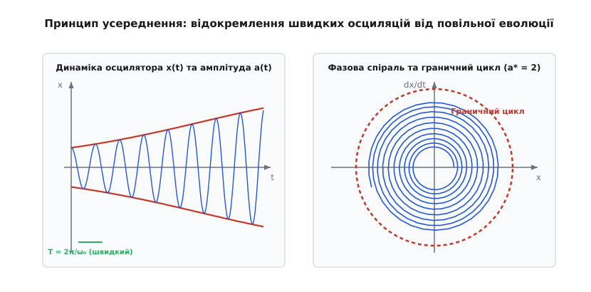
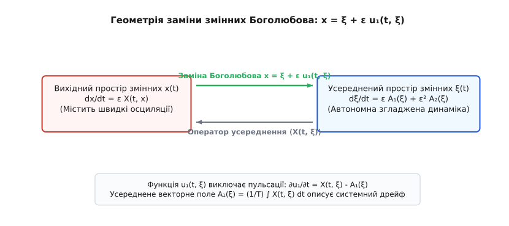
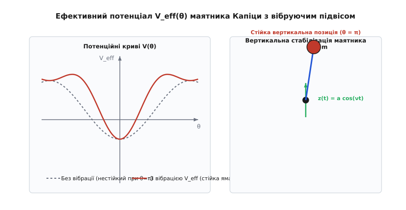
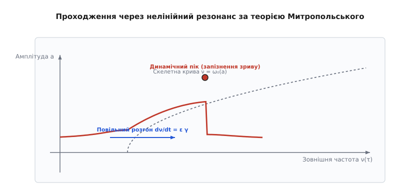

# Метод усереднення Боголюбова — Митропольського

<preknowlist>
- [Осцилятор Дуффінга](book:physics/mechanics/duffing-oscillator) — нелінійний осцилятор з кубічною відновлювальною силою.
- [Фазовий простір і граничний цикл](book:physics/mechanics/phase-space) — геометричне представлення динамічних систем у просторі координат і швидкостей.
- [Диференціальні рівняння](book:math/differential-equations) — математичний апарат опису неперервних процесів у часі.
</preknowlist>

Пряме застосування класичної теорії збурень до нелінійних коливальних систем призводить до катастрофічного математичного тупика: у виразах для координати та швидкості виникають так звані секулярні члени — вирази вигляду `t · sin(t)`, які необмежено зростають зі збільшенням часу `t`. Якщо аналізувати механічну систему на короткому інтервалі, ця похибка здається незначною, проте на тривалих інтервалах спостереження вона повністю спотворює фізичну картину руху. Малий параметр `ε`, який мав би забезпечувати малість нелінійних поправок, у добутку з часом `t` перестає бути малим, як тільки час досягає масштабу `t ~ 1/ε`.

Реальна механічна система — від лампового автогенератора та маятника з вібруючою точкою підвісу до космічного апарата на некруговій орбіті чи системи стабілізації ротора турбіни — демонструє чітко розмежовану за масштабами динаміку. На швидкі періодичні пульсації із власною частотою системи накладається повільна зміна амплітуди, фази чи середнього положення рівноваги. 

Метод усереднення Боголюбова — Митропольського розв'язує фундаментальну проблему секулярності шляхом точного математичного відокремлення швидкого часу від повільного через спеціально побудовану координатно-операторну заміну змінних. Це дає змогу замінити вихідну неавтономну систему зі швидкими осциляціями на автономну усереднену систему щодо гладких змінних, розв'язок якої є аналітично прозорим і обчислювально ефективним.

Термін *асимптотика* походить від грецького *ἀσύμπτωτος* (той, що не збігається напряму, але нескінченно наближається), а *осциляція* — від латинського *oscillatio* (розгойдування). Слово *усереднення* (від латинського *averagium*) відображає інтегральну операцію згладжування швидких пульсацій за період.


*Відокремлення швидкої фазової осциляції від повільного дрейфу амплітуди в осциляторі Ван дер Поля.*

## 1. Парадокс малого параметра та вимушена незастосовність класичної теорії збурень

Розглянемо класичний нелінійний осцилятор із малою силою збудження, кутовою частотою `ω₀` та малим безрозмірним параметром `ε ≪ 1`. Рівняння руху такої системи в фізичних змінних має вигляд:

```
d²x/dt² + ω₀²·x = ε·f(x, dx/dt)
```

Спроба знайти розв'язок методом регулярних збурень у вигляді прямого степеневого ряду Тейлора за малим параметром `ε`:

```
x(t) = x₀(t) + ε·x₁(t) + ε²·x₂(t) + ...
```

розпадається вже під час обчислення першого наближення. Для нульового наближення при `ε = 0` отримуємо рівняння ззвичайного гармонічного осцилятора:

```
d²x₀/dt² + ω₀²·x₀ = 0
```

Його розв'язок визначається двома довільними константами — амплітудою `a` та початковою фазою `ψ`:

```
x₀(t) = a·cos(ω₀·t + ψ)
```

Підставимо отриманий розв'язок нульового наближення `x₀(t)` у нелінійну функцію правого боку `f(x₀, dx₀/dt)`. Завдяки тригонометричним тотожностям функція `f` розкладається в ряд Фур'є за гармоніками кута `θ = ω₀·t + ψ`. Якщо нелінійність містить складові, що резонують із власною частотою `ω₀` (наприклад, кубічний член `x³` чи дисипативне тертя `x²·dx/dt`), рівняння для першої поправки `x₁(t)` набуває вигляду:

```
d²x₁/dt² + ω₀²·x₁ = C·cos(ω₀·t + ψ) + інші нерезонансні гармоніки
```

Права частина містить вимушуючу силу з частотою `ω₀`, яка тотожно збігається з власною частотою лівої частини рівняння. Інтегрування такого лінійного диференціального рівняння з резонансною правою частиною дає частковий розв'язок:

```
x₁(t) = (C / (2·ω₀)) · t · sin(ω₀·t + ψ)
```

Поява сомножника `t` перед тригонометричною функцією є математичною катастрофою. При `t → ∞` член `x₁(t)` зростає до нескінченності, що суперечить закону збереження енергії та фізичній природі обмежених осциляцій у замкнених або дисипативних системах. Більше того, поправка `ε·x₁(t)` за величиною перевищує головний член `x₀(t)`, як тільки час досягає значення `t ~ 1/ε`, що повністю руйнує сам принцип теорії збурень.

Історично перші спроби подолання цієї проблеми були здійснені Анрі Пуанкаре та Андусом Ліндштедтом у небесній механіці. Вони запропонували розкладати у ряд не лише розв'язок `x(t)`, але й саму частоту коливань `ω = ω₀ + ε·ω₁ + ε²·ω₂ + ...`. Метод Ліндштедта — Пуанкаре дозволяє успішно знищити секулярні члени в консервативних системах, де амплітуда є сталою. Проте для гамільтонових систем із дисипацією або автоколиваннями, де амплітуда `a(t)` сама повільно змінюється в часі під дією збурень, метод Ліндштедта виявляється абсолютно безсилим, оскільки він не здатний описати дрейф амплітуди.

Паралельно в прикладній фізиці розвивався альтернативний підхід — метод багаторазових масштабів часу (Multiple Scales Method). У цьому підході вводяться незалежні часові змінні:

```
T₀ = t,  T₁ = ε·t,  T₂ = ε²·t,  ...
```

Шуканий розв'язок записується у вигляді функції цих змінних: `x(t) = x₀(T₀, T₁, ...) + ε·x₁(T₀, T₁, ...)`. Повна похідна за часом `d/dt` перетворюється на оператор `∂/∂T₀ + ε·∂/∂T₁ + ...`. Умова усунення секулярних членів (так звана умова розв'язності Фредгольма) вимагає, щоб амплітуда розв'язку нульового наближення задовольняла ті самі автономні диференціальні рівняння, які метод Боголюбова — Митропольського дає через алгоритмічне усереднення по періоду.

Геометричний зміст цієї процедури описується теоремою Фенічеля про центральні інваріантні многовиди. У фазовому просторі `ℝⁿ × 𝕊¹` розшарування швидкого руху згортається у повільний інваріантний многовид `M_ε`. Якщо незбурена точка є нормальним гіперболічним станом рівноваги, то при додаванні малого `ε > 0` цей інваріантний многовид зберігається, лише гладко деформуючись на величину `O(ε)`. Метод Боголюбова створює проекційний оператор, який відображає всю тривимірну динаміку фазового простору безпосередньо на цей повільний гладкий многовид.

У статистичній фізиці та термодинаміці таке відокремлення відповідає принципу адіабатичного ізолювання: швидкі ступені вільності (молекулярні хаотичні коливання) швидко досягають локальної рівноваги, а повільні макроскопічні змінні (температура, об'єм, тиск) еволюціонують під дією усередненого за ансамблем обобщеного потенціалу.

Фізична причина виникнення секулярних членів полягає в тому, що будь-яка нелінійна сила змушує власну частоту коливань зміщуватися від значення `ω₀` до нового значення `ω(a) = ω₀ + ε·Δω`, а також спричиняє повільне згасання або розгортання амплітуди `a(t)`. Ряд Тейлора розкладає функцію `cos((ω₀ + ε·Δω)·t)` в окіл точки `ε = 0`:

```
cos((ω₀ + ε·Δω)·t) = cos(ω₀·t) - ε·Δω·t·sin(ω₀·t) - (ε²·Δω²·t²/2)·cos(ω₀·t) + ...
```

Видно, що секулярний член `t·sin(ω₀·t)` є лише штучним наслідком розкладання зміненої частоти по нерухомому гармонічному базису. Щоб усунути секулярність, необхідно не розкладати тригонометричні функції в ряд, а дозволити амплітуді `a(t)` та фазовому зсуву `ψ(t)` повільно еволюціонувати в часі.

Оскільки нелінійні сили мають порядок малості `ε`, швидкості зміни амплітуди `da/dt` та похідної фази `dψ/dt` також мають порядок `ε`. Це означає існування двох принципово різних масштабів часу:
1. **Швидкий час:** `t_fast = t` з періодом осциляцій `T = 2π/ω₀`. За цей час амплітуда та фаза залишаються практично сталими.
2. **Повільний час:** `τ = ε·t`. На цьому часовому масштабі малі щоперіодні зміни накопичуються, формуючи глобальну еволюційну траєкторію системи.

Геометрично це відповідає руху фазової точки по інваріантному многовиду у фазовому просторі, де швидка осциляція намотується навколо повільного інваріантного тора або дисипативного атрактора.

## 2. Метод варіації довільних сталих та нормальна форма Боголюбова

Для точного математичного опису повільної та швидкої динаміки перейдемо від вихідних фізичних змінних (координати `x` та швидкості `dx/dt`) до нових змінних — амплітуди `a(t)` та повної фази `θ(t) = ω₀·t + ψ(t)`.

Використовуємо метод варіації довільних сталих (заміну змінних Лагранжа):

```
x(t) = a(t) · cos(ω₀·t + ψ(t))
dx/dt = -a(t) · ω₀ · sin(ω₀·t + ψ(t))
```

Для того щоб друга рівність виконувалася тотожно при продиференційовуванні першої рівності за часом `t`, необхідно накласти додаткову умову зв'язку на похідні `da/dt` та `dψ/dt`:

```
(da/dt)·cos(θ) - a·(dψ/dt)·sin(θ) = 0
```

Продиференціюємо вираз для швидкості `dx/dt` за часом `t`:

```
d²x/dt² = - (da/dt)·ω₀·sin(θ) - a·ω₀·(ω₀ + dψ/dt)·cos(θ)
```

Підставимо `x`, `dx/dt` та `d²x/dt²` у вихідне диференціальне рівняння `d²x/dt² + ω₀²·x = ε·f(x, dx/dt)`:

```
- (da/dt)·ω₀·sin(θ) - a·ω₀²·cos(θ) - a·ω₀·(dψ/dt)·cos(θ) + ω₀²·a·cos(θ) = ε·f(a·cos θ, -a·ω₀·sin θ)
```

Доданки `-a·ω₀²·cos(θ)` та `+ω₀²·a·cos(θ)` взаємно знищуються, і ми отримуємо перше співвідношення для похідних:

```
- (da/dt)·ω₀·sin(θ) - a·ω₀·(dψ/dt)·cos(θ) = ε·f(a·cos θ, -a·ω₀·sin θ)
```

Об'єднуючи це рівняння з раніше отриманою умовою зв'язку `(da/dt)·cos(θ) - a·(dψ/dt)·sin(θ) = 0`, розв'язуємо утворену лінійну систему відносно похідних `da/dt` та `dψ/dt`:

```
da/dt = - (ε / ω₀) · f(a·cos θ, -a·ω₀·sin θ) · sin(θ)
dψ/dt = - (ε / (a·ω₀)) · f(a·cos θ, -a·ω₀·sin θ) · cos(θ)
```

Ввівши двовимірний вектор повільних змінних `x_vec = (a, ψ)^T`, отриманну систему диференціальних рівнянь першого порядку можна записати в канонічній *стандартній формі Боголюбова*:

```
dx_vec/dt = ε · X(t, x_vec)
```

Де векторне поле `X(t, x_vec)` є явно періодичною функцією часу `t` з періодом `T = 2π/ω₀`. Оскільки малий параметр `ε` винесений за дужки, похідна `dx_vec/dt` має порядок `O(ε)`. Це означає, що вектор `x_vec` змінюється надзвичайно повільно, здійснюючі мікроскопічні осциляції навколо деякої згладженої траєкторії.

Геометрична суть стандартної форми полягає в тому, що фазовий потік розкладається у розшаруванні над колом швидкої фази `S¹`. Векторне поле `X(t, x_vec)` задає дотичний вектор до повільної траєкторії на кожному кроці швидкої фази.

Визначимо оператор усереднення `⟨...⟩` як інтегрування векторного поля по швидкому періоду `T` при заморожених (фіксованих) значеннях повільних змінних `x_vec`:

```
⟨X(x_vec)⟩ = (1 / T) · ∫₀ᵀ X(t, x_vec) dt
```

Головна ідея першого наближення методу усереднення полягає в тому, що точна неавтономна система `dx_vec/dt = ε · X(t, x_vec)` замінюється на набагато простішу автономну усереднену систему для згладжених змінних `ξ_vec = (ā, ψ̄)^T`:

```
dξ_vec/dt = ε · ⟨X(ξ_vec)⟩
```

Отримана усереднена система більше не містить часу `t` у правій частині. Це дає змогу застосувати весь потужний апарат якісної теорії диференціальних рівнянь: знаходити стаціонарні точки, аналізувати їх стійкість за лінійним наближенням, будувати фазові портрети та шукати граничні цикли.


*Перехід від вихідного фазового простору з осциляціями до гладкого фазового простору усереднених змінних.*

## 3. Асимптотичний ряд Боголюбова — Митропольського та координатні перетворення

Перше наближення дає правильну огинаючу динаміку, але повністю втрачає швидкі пульсації та має похибку порядку `O(ε)`. Для побудови вищих наближень Микола Боголюбов та Юрій Митропольський розробили алгебраїчний апарат неаргументованих координатно-операторних рядів.

Зв'язок між вихідною змінною `x_vec` (яка містить швидкі пульсації) та згладженою усередненою змінною `ξ_vec` шукається у вигляді заміна змінних:

```
x_vec = ξ_vec + ε · u₁(t, ξ_vec) + ε² · u₂(t, ξ_vec) + ε³ · u₃(t, ξ_vec) + ...
```

При цьому припускається, що сама усереднена змінна `ξ_vec` задовольняє строго автономне диференціальне рівняння вигляду:

```
dξ_vec/dt = ε · A₁(ξ_vec) + ε² · A₂(ξ_vec) + ε³ · A₃(ξ_vec) + ...
```

На векторні функції поправок `uₖ(t, ξ_vec)` накладаються дві фундаментальні умови:
1. Вони є періодичними по `t` з періодом `T = 2π/ω₀`.
2. Їхнє середнє значення за періодом тотожно дорівнює нулю: `⟨uₖ(t, ξ_vec)⟩ = 0`.

Ця друга умова гарантує єдиність розкладу і забезпечує, що `ξ_vec` є точним математичним математичним середнім вихідної змінної `x_vec`.

Для знаходження невідомих векторних полів `Aₖ(ξ_vec)` та функцій `uₖ(t, ξ_vec)` продиференціюємо заміну змінних за часом `t` у силу усередненого рівняння:

```
dx_vec/dt = dξ_vec/dt + ε · (∂u₁/∂t + ∇u₁ · dξ_vec/dt) + ε² · (∂u₂/∂t + ∇u₂ · dξ_vec/dt) + ...
```

Підставимо вираз для `dξ_vec/dt = ε·A₁ + ε²·A₂ + ...`:

```
dx_vec/dt = ε·A₁ + ε²·A₂ + ε·(∂u₁/∂t) + ε²·(∇u₁·A₁) + ε²·(∂u₂/∂t) + O(ε³)
```

З іншого боку, розкладемо праве векторне поле `X(t, x_vec)` у ряд Тейлора в околі точки `ξ_vec`:

```
X(t, x_vec) = X(t, ξ_vec + ε·u₁ + ...)
            = X(t, ξ_vec) + ε · (∇X(t, ξ_vec) · u₁) + O(ε²)
```

Підставляючи ці розклади в умову `dx_vec/dt = ε · X(t, x_vec)` та збираючи члени при одинакових степенях малого параметра `ε`, отримуємо послідовну ланцюгову систему рівнянь.

При першому степені `ε¹`:

```
A₁(ξ_vec) + ∂u₁/∂t = X(t, ξ_vec)
```

Застосуємо оператор усереднення `⟨...⟩` до обох частин рівняння. Оскільки `A₁(ξ_vec)` не залежить від `t`, а `⟨∂u₁/∂t⟩ = 0` внаслідок періодичності `u₁`, отримуємо:

```
A₁(ξ_vec) = ⟨X(t, ξ_vec)⟩ = (1 / T) · ∫₀ᵀ X(t, ξ_vec) dt
```

Віднімаючи усереднене рівняння від вихідного, отримуємо диференціальне рівняння для осциляційної поправки `u₁(t, ξ_vec)`:

```
∂u₁/∂t = X(t, ξ_vec) - A₁(ξ_vec) = X̃(t, ξ_vec)
```

Де `X̃(t, ξ_vec)` є чисто осцилюючою частиною векторного поля з нульовим середнім значенням. Інтегрування цієї частини по `t` дає вираз для першої поправки:

```
u₁(t, ξ_vec) = ∫ X̃(t, ξ_vec) dt
```

При другому степені `ε²`:

```
A₂(ξ_vec) + ∂u₂/∂t + ∇u₁ · A₁(ξ_vec) = (∇X(t, ξ_vec)) · u₁(t, ξ_vec)
```

Застосування оператора усереднення `⟨...⟩` визначає векторне поле другого наближення `A₂(ξ_vec)`:

```
A₂(ξ_vec) = ⟨ (∇X(t, ξ_vec)) · u₁(t, ξ_vec) ⟩ - ∇u₁ · A₁(ξ_vec)
```

Вираз `(∇X)·u₁ - (∇u₁)·A₁` являє собою класичну дужку Лі (комбінацію генераторів зсуву) двох векторних полів. Таким чином, метод Боголюбова — Митропольського дає змогу послідовно обчислити асимптотичне наближення будь-якого порядку.

Для гамільтонових систем із функцією Гамільтона `H(I, θ, t)` у змінних «дія — кут» усереднення Боголюбова є аналітично еквівалентним канонічним перетворенням Лі (алгоритмам Депрі — Драгта). Усереднена дія `Ī` перетворюється на неперервний інваріант руху (адіабатичний інваріант), що зберігає свою величину з точністю `O(ε)` на інтервалах часу `t ~ 1/ε`.

Строга математична оцінка похибки описується **теоремою Боголюбова**: якщо усереднена система має стійку нерухому точку або стійкий граничний цикл, то розв'язок усередненого рівняння `ξ(t)` відхиляється від точного розв'язку `x(t)` на величину, що не перевищує `C·ε` на нескінченному інтервалі часу `t ∈ [0, ∞)`. Для довільних траєкторій оцінка `|x(t) - ξ(t)| < C·ε` виконується на інтервалі часу `t ∈ [0, L/ε]`.

Доведення цього результату спирається на інтегральну нерівність Гронвоолла-Беллмана. Нехай `e(t) = ||x(t) - ξ(t)||` — норма похибки між точним розв'язком та усередненою траєкторією. Диференціюючи похибку та оцінюючи її зверху через ліпшицеву константу векторного поля `K`:

```
de/dt <= ε · K · e(t) + M · ε²
```

Інтегрування цієї диференціальної нерівності дає точну верхню межу для наростання похибки:

```
e(t) <= (M · ε / K) · (exp(ε · K · t) - 1)
```

На часовому інтервалі `t <= L / ε` показник експоненти дорівнює `ε · K · (L/ε) = K · L = const`. Отже, вираз `exp(K · L) - 1` є обмеженою сталою числовою величиною, що й доводить підсумкову оцінку `e(t) <= C · ε`.

Повне строге математичне доведення цієї теореми із застосуванням операторних норм та просторів Банаха наведено в [математичному виведенні методом Боголюбова — Митропольського](book:physics/mechanics/bogoliubov-mitropolsky/math-bogoliubov-mitropolsky.md).

## 4. Аналіз автоколивальних систем та нелінійних осциляторів

### 4.1. Осцилятор Ван дер Поля

Класичною інженерною модельою нелінійного осцилятора з автоколиваннями є рівняння Ван дер Поля:

```
d²x/dt² - ε · (1 - x²) · dx/dt + x = 0
```

Тут `ω₀ = 1`. Застосуємо заміну змінних Лагранжа до амплітуди `a(t)` та фази `ψ(t)`:

```
x(t) = a(t) · cos(t + ψ(t))
dx/dt = -a(t) · sin(t + ψ(t))
```

Позначивши повну фазу `θ = t + ψ`, запишемо рівняння для `da/dt` та `dψ/dt`:

```
da/dt = ε · a · sin²θ · (1 - a²·cos²θ)
dψ/dt = ε · sin θ · cos θ · (1 - a²·cos²θ)
```

Перетворимо тригонометричні добутки:

```
sin²θ = (1/2) - (1/2)·cos(2θ)
sin²θ · cos²θ = (1/8) - (1/8)·cos(4θ)
sin θ · cos θ = (1/2)·sin(2θ)
```

Застосуємо оператор усереднення `⟨...⟩` за періодом `T = 2π`. Інтегрування всіх гармонік `cos(2θ)`, `cos(4θ)` та `sin(2θ)` по періоду від `0` до `2π` дає точний нуль. У результаті отримуємо усереднену систему першого наближення:

```
dā/dt = (ε · ā / 2) · (1 - ā² / 4)
dψ̄/dt = 0
```

Знайдемо нерухомі точки усередненого рівняння для амплітуди, поклавши `dā/dt = 0`:
1. `ā = 0` — тривіальний стан рівноваги. Лінеаризація поблизу цієї точки дає `dā/dt ≈ (ε/2)·ā`, тобто точка є нестійкою. Будь-яке мале збурення розганяє амплітуду.
2. `ā = 2` — стаціонарна амплітуда. Якщо `ā < 2`, то `dā/dt > 0` (амплітуда зростає). Якщо `ā > 2`, то `dā/dt < 0` (амплітуда зменшується).

Отже, точка `a* = 2` являє собою стійкий граничний цикл. Незалежно від початкових умов система виходить на стаціонарний автоколивальний режим із амплітудою `a = 2`. Фізично це описує точний баланс між введенням енергії на малих амплітудах через від'ємне тертя та дисипацією енергії на великих амплітудах через нелінійне додатне тертя.

Зазначимо, що метод усереднення Боголюбова працює при малих `ε ≪ 1`, коли осциляції є квазігармонічними. При переході до великих `ε ≫ 1` характер рухів Ван дер Поля кардинально змінюється: осциляції перетворюються на релаксаційні, де повільне накопичення заряду чергується з миттєвими стрибками, що вимагає опису за допомогою методів Тихонова про симетричні сипкі диференціальні рівняння.

Врахування другого наближення Боголюбова дозволяє обчислити нелінійний зсув частоти коливань:

```
ω = 1 - (ε² / 16) + O(ε³)
```

Це пояснює важливий ефект: зі зростанням нелінійності `ε` період автоколивань лампового генератора зростає.

### 4.2. Осцилятор Дуффінга з кубічною нелінійністю

Розглянемо осцилятор Дуффінга із кубічною відновлювальною силою:

```
d²x/dt² + ω₀²·x = - ε · x³
```

Використовуючи заміну `x = a·cos(ω₀·t + ψ)`, обчислимо систему для `da/dt` та `dψ/dt`:

```
da/dt = (ε / ω₀) · a³ · cos³θ · sin θ
dψ/dt = (ε / (a·ω₀)) · a³ · cos⁴θ
```

Застосуємо оператор усереднення `⟨...⟩`:

```
⟨cos³θ · sin θ⟩ = (1 / 2π) · ∫₀²ᵖⁱ cos³θ · sin θ dθ = 0
⟨cos⁴θ⟩ = (1 / 2π) · ∫₀²ᵖⁱ ( (3/8) + (1/2)·cos(2θ) + (1/8)·cos(4θ) ) dθ = 3/8
```

У результаті отримуємо усереднену систему:

```
dā/dt = 0
dψ̄/dt = (3 · ε / (8 · ω₀)) · ā²
```

З першого рівняння випливає, що амплітуда коливань `ā = a₀` залишається строго сталою (енергія зберігається). Друге рівняння показує, що фаза зростає лінійно з часом, що відповідає зміні частоти коливань:

```
ω(ā) = ω₀ + dψ̄/dt = ω₀ + (3 · ε / (8 · ω₀)) · ā²
```

Цей результат описує ізохронізм консервативного нелінійного осцилятора: жорстка нелінійність (`ε > 0`) призводить до зростання частоти коливань зі збільшенням амплітуди. Якщо ж нелінійність є м'якою (`ε < 0`), частота зі зростанням амплітуди монотонно зменшується.

### 4.3. Осцилятор Релея та внутрішні резонанси

Іншим важливим прикладом є осцилятор Релея, який описує автоколивання акустичних струн та пневматичних систем під дією нелінійного тертя, що залежить від швидкості:

```
d²x/dt² + x = ε · ( dx/dt - (1/3) · (dx/dt)³ )
```

Застосовуючи заміну `x = a·cos(t + ψ)` та `dx/dt = -a·sin(t + ψ)`, отримуємо рівняння для амплітуди:

```
da/dt = ε · ( -a·sin²θ + (1/3)·a³·sin⁴θ )
```

Усереднення по періоду `T = 2π` з урахуванням `⟨sin²θ⟩ = 1/2` та `⟨sin⁴θ⟩ = 3/8` дає:

```
dā/dt = (ε · ā / 2) · (1 - ā² / 4)
```

Дивовижний результат полягає в тому, що усереднене рівняння для амплітуди осцилятора Релея тотожно збігається з усередненим рівнянням осцилятора Ван дер Поля. Це ілюструє глибоку універсальність методу усереднення Боголюбова — Митропольського: принципово різні за фізичною структурою нелінійні системи у першому наближенні мають однакову огинаючу динаміку та однаковий граничний цикл `a* = 2`.

У системах із двома ступенями вільностей при співвідношенні власних частот `ω₂ ≈ 2·ω₁` або `ω₂ ≈ 3·ω₁` виникає явище внутрішнього резонансу. Метод усереднення Боголюбова дозволяє побудувати зв'язані автономні диференціальні рівняння для двох амплітуд `a₁`, `a₂` та відносної фази `Φ = ψ₂ - 2ψ₁`. Це розкриває міжмодовий обмін енергією — ефект, при якому механічна енергія біфуркує та періодично перекачується з однієї моди в іншу.

### 4.4. Параметричний резонанс та рівняння Матьє — Хілла

Розглянемо систему з періодичною зміною параметра (наприклад, маятник зі змінною довжиною або кулонний осцилятор у змінному полі):

```
d²x/dt² + ω₀² · (1 + ε · cos(νt)) · x = 0
```

Найсильніший параметричний резонанс (головний резонанс) виникає, коли частота зміни параметра близька до подвоєної власної частоти: `ν = 2·ω₀ + ε·Δ`, де `Δ` — розбудовувальна частота.

Перейдемо до амплітуди `a` та фази `ψ` відносно половинної частоти `ν/2`:

```
x(t) = a(t) · cos( (ν/2)·t + ψ(t) )
dx/dt = -a(t) · (ν/2) · sin( (ν/2)·t + ψ(t) )
```

Позначивши повну фазу `θ = (ν/2)·t + ψ`, застосуємо метод усереднення по періоду `T = 4π/ν`. Усереднені рівняння першого наближення набувають вигляду:

```
dā/dt = (ε · ω₀ / 4) · ā · sin(2ψ̄)
dψ̄/dt = (Δ / 2) + (ε · ω₀ / 4) · cos(2ψ̄)
```

Стаціонарний розв'язок для фази `dψ̄/dt = 0` існує лише у випадку, коли `|Δ| <= (ε · ω₀ / 2)`. Усередині цього частотного інтервалу синус фази `sin(2ψ̄)` стає відмінним від нуля і додатним, що призводить до експоненційного розгону амплітуди:

```
ā(t) = a₀ · exp( γ · t )
```

Де показник параметричного зростання дорівнює `γ = √((ε·ω₀/4)² - (Δ/2)²)`. Цей результат задає точні математичні межі області нестійкості (параметричної язикової зони / рогів Арнольда) у просторі параметрів `(ε, ν)`.

## 5. Високочастотні збудження: маятник Капіци та пондеромоторні сили

Особливою перевагою методу усереднення є його здатність описувати системи із зовнішнім високочастотним збудженням. Класичним прикладом є маятник Капіци — математичний маятник, точка підвісу якого здійснює швидкі вертикальні вібрації з частотою `ν ≫ √(g/l)` та малою амплітудою `a_vib ≪ l`.


*Формування локального мінімуму ефективного потенціалу у верхній точці маятника за рахунок високої частоти вібрацій.*

Рівняння руху маятника з рухомим підвісом має вигляд:

```
l · d²θ/dt² + (g - a_vib·ν²·cos(νt)) · sin θ = 0
```

Тут маємо два частотні масштаби: повільні власні коливання маятника з частотою `Ω = √(g/l)` та швидкі вібрації з частотою `ν`. Застосуємо заміну змінних, розділивши кут `θ` на повільну складову `X` та швидку вібраційну поправку `ξ`:

```
θ(t) = X(t) + ξ(t, X)
```

Де `ξ` має порядок `(a_vib / l) ≪ 1`. Розкладаючи `sin(X + ξ) ≈ sin X + ξ · cos X` та прирівнюючи швидкі осцилюючі члени, отримуємо диференціальне рівняння для `ξ`:

```
d²ξ/dt² = (a_vib / l) · ν² · cos(νt) · sin X
```

Дворазове інтегрування по швидкому часу `t` дає:

```
ξ(t) = - (a_vib / l) · cos(νt) · sin X
```

Підставляючи вираз для `ξ(t)` у рівняння повільного руху та застосовуючи оператор усереднення за періодом вібрацій `T_vib = 2π/ν`, отримуємо усереднене рівняння для повільної координати `X`:

```
l · d²X/dt² + g · sin X + (a_vib² · ν² / (2·l)) · sin X · cos X = 0
```

Це рівняння можна переписати через ефективну потенціальну енергію `V_eff(X)`:

```
d²X/dt² = - (1 / m·l²) · (dV_eff / dX)
```

Де ефективний потенціал дорівнює:

```
V_eff(X) = m · g · l · (1 - cos X) + (m · a_vib² · ν² / 4) · sin² X
```

Аналіз екстремумів `V_eff(X)` розкриває дивовижне фізичне явище:
1. Нижнє положення `X = 0` залишається стійким мінімумом.
2. Верхнє положення `X = π` (перевернутий маятник) при виконанні умови `a_vib² · ν² > 2 · g · l` перетворюється з нестійкого максимуму на стійкий мінімум потенціальної енергії.

При переході порогу `a_vib² · ν² = 2·g·l` відбувається біфуркація подвоєння стійких рівноваг (вилкоподібна біфуркація). Перевернутий вертикальний стан стає локально стійким ямою у фазовому просторі. Швидкі вібрації створюють додаткову "вібраційну силу" (або пондеромоторну силу), яка утримує маятник у вертикальному стані проти сили тяжіння.

Аналогічний ефект виникає у квадрупольних іонних пастках Пауля. Розглянемо рух заряду `e` в квадрупольному високочастотному електричному полі `E(x, y, t) = E₀·cos(Ωt)·(x·î - y·ĵ)`. Застосування методу усереднення Боголюбова розкладає рух іона на швидкі мікроколебання з частотою `Ω` та повільний системний дрейф у двовимірному ефективному псевдопотенціалі:

```
V_pseudo(x, y) = (e² · E₀² / (4 · m · Ω²)) · (x² + y²)
```

Цей усереднений потенціал діє як двовимірна пастка з локальним мінімумом в центрі `x = 0, y = 0`, що дозволяє прецизійно утримувати поодинокі іони для квантових обчислень та атомних годинників.

У квантовій оптиці лазерне випромінювання високої частоти створює дипольну пондеромоторну силу на нейтральні атоми. Наведена поляризованість атома викликає усереднений потенційний градієнт `F_pond = - ∇ V_opt`, де `V_opt = (α / 4) · |E|^2`. Це лежить в основі роботи оптичних пінцетів, які дозволяють захоплювати й маніпулювати біологічними молекулами ДНК та окремими клітинами.

## 6. Нестаціонарні та резонансні режими Митропольського

У реальних технічних системах параметри часто не залишаються сталими: ротор турбіни при розгоні проходить через резонансні частоти, маса ракети-носія зменшується в міру вигоряння палива, а довжина підвісу вантажного крана змінюється під час підйому. Класичний метод Боголюбова розрахований на стаціонарні системи. Юрій Олексійовича Митропольський розширив метод усереднення на нестаціонарні нелінійні системи з параметрами, що повільно змінюються у часі.


*Динаміка амплітуди при повільцій зміні зовнішньої частоти через резонансну зону за теорією Митропольського.*

Розглянемо нестаціонарну систему зі змінною зовнішньою частотою `ν(τ)`, де `τ = ε·t` — повільний часовий масштаб:

```
d²x/dt² + ω₀²(τ)·x = ε · f(τ, x, dx/dt, θ)
dθ/dt = ν(τ)
```

При проходженні через резонансну зону, коли `ω₀(τ) ≈ (p/q) · ν(τ)` (де `p` та `q` — взаємно прості цілі числа), утворюється повільна розрізнена фаза резонансу:

```
Φ(t) = q · ψ(t) - p · θ(t)
```

Похідна резонансної фази `dΦ/dt = q·ω₀(τ) - p·ν(τ)` поблизу точного резонансу стає величиною порядку `ε`. Це означає, що фаза `Φ` перетворюється на повільну змінну, і ззвичайне усереднення по цьому куту проводити заборонено.

Метод Боголюбова — Митропольського в резонансному випадку проводити усереднення за всіма швидкими фазами, але зберігає резонансну фазу `Φ` як явну повільну змінну. Усереднена система першого наближення набуває вигляду:

```
dā/dt = ε · A₁(τ, ā, Φ̄)
dΦ̄/dt = q·ω₀(τ) - p·ν(τ) + ε · B₁(τ, ā, Φ̄)
```

Де функції `A₁` та `B₁` обчислюються шляхом інтегрування нелінійних сил по швидкій фазі при фіксованому значенні розрізненої фази `Φ̄`.

Аналіз цих рівнянь дав змогу відкрити два ключові ефекти нелінійного резонансу:
- **Захоплення частоти (автофазування):** нелінійна система може "прилипати" до зовнішньої частоти, автоматично підлаштовуючи свій розсув фази `Φ̄` так, щоб компенсувати зміну зовнішньої частоти `ν(τ)`.
- **Динамічний зрив амплітуди:** при проходженні через резонанс максимальна досяжна амплітуда залежить від швидкості проходження `dν/dτ`. Чим швидше ротор проходить резонансну зону, тим меншим є максимальний динамічний пік амплітуди.

У багаточастотних системах із декількома незалежними частотами `ω₁, ω₂, ..., ωₙ` виникає фундаментальна проблема малих знаменників: комбінаційні частоти `k₁·ω₁ + k₂·ω₂ + ...` можуть ставати як завгодно малими при інтегруванні рядів. Ця проблема пов'язує метод усереднення з КАМ-теорією (Колмогорова — Арнольда — Мозера) про збереження умовно-періодичних рухів у слабозбурених гамільтонових системах.

Детальний огляд становлення цієї наукової школи наведено в [історичному розвитку київської школи нелінійній механіки](book:physics/mechanics/bogoliubov-mitropolsky/hist-bogoliubov-mitropolsky.md).

## 7. Чисельний аналіз, алгоритми та інженерні застосування

Пряме чисельне інтегрування нелінійних осциляторів із високою частотою (наприклад, методом Рунге-Кутти 4-го порядку RK4) зіштовхується з жорстким обмеженням на крок інтегрування:

```
dt ≪ (2π / ω_fast)
```

Для систем із великою частотою `ω_fast ≫ 1` (як у маятнику Капіци або радіогенераторах) прямий обчислювальний розрахунок на інтервалу повільної еволюції `T_slow ~ 1/ε` вимагає виконання `10⁷–10⁹` обчислювальних кроків. Це призводить до величезних витрат процесорного часу та швидкого накопичення машинної похибки заокруглення (loss of significance).

Метод усереднення Боголюбова — Митропольського виступає як потужний аналітичний препроцесор. Перехід від вихідного рівняння до усередненої системи змінних `ξ` змінює крок інтегрування:

```
dt_averaged ~ (1 / ε) · dt_exact
```

Замість обчислення мільйонів швидких періодів чисельний інтегратор вирішує гладку автономну систему для амплітуди `ā` та фази `ψ̄` з кроком `Δt ~ 1`. Це дає прискорення обчислень у `1000–100000` разів без втрати точності повільного дрейфу.

У сучасних вимірювальних комплексах вібромоніторингу індустріального обладнання цифровий сигнал від акселерометрів чи оптичних енкодерів обробляється за допомогою алгоритмів усереднення Боголюбова та аналітичного перетворення Гільберта. Це дозволяє в реальному часі виділяти повільну огинаючу `a(t)` та виявляти зародження мікротріщин у роторах задовго до настання критичної аварії. Сучасні високопродуктивні обчислювальні архітектури на базі графічних прискорювачів (GPU / CUDA) використовують усереднені системи для масового паралельного моделювання фазових ансамблів турбоагрегатів.

Порівняльна характеристика методів наведена у таблиці:

| Параметр порівняння | Пряме чисельне інтегрування (RK4 / DP45) | Перше наближення усереднення | Друге наближення Боголюбова |
| :--- | :--- | :--- | :--- |
| **Крок за часом `dt`** | `dt ≪ 2π / ω_fast` | `dt ~ 1 / ε` | `dt ~ 1 / ε` |
| **Похибка на часі `t ~ 1/ε`** | Накопичення похибки `O(dt⁴ · t)` | Похибка огинаючої `O(ε)` | Похибка огинаючої `O(ε²)` |
| **Збереження фазових інваріантів** | Втрата стійкості при великому `dt` | Точна аналітична нерухома точка | Точний частотний зсув `ω(ε²)` |
| **Обчислювальна складність** | Висока (`O(ω_fast / ε)`) | Дуже низька (`O(1)`) | Низька (`O(1)`) |

Практичні застосування методу охоплюють найважливіші галузі сучасної інженерії та фізики:
- **Небесна механіка та космічна навігація:** обчислення довготривалої еволюції орбіт штучних супутників Землі під дією світлового тиску Сонця, сплюснутості Землі (гравітаційного потенціалу `J₂`) та аеродинамічного гальмування у верхніх шарах атмосфери.
- **Гіроскопічні системи та приладобудування:** аналіз повільного дрейфу осьових векторів гіроскопів із урахуванням високочастотних вібрацій ротора та прецесійного руху.
- **Енергетика та турбобудування:** розрахунок проходження важких роторів електростанцій через резонансні критичні частоти при пуску та виведенні з експлуатації.
- **Вібротехніка та сепарація матеріалів:** розрахунок зсуву та транспортування сипучих матеріалів під дією асиметричних високочастотних вібраційних столів.

Повний код чисельного аналізатора, алгоритм розкладання за швидко-повільними компонентами та порівняльні тести швидкодії наведені в [практичному проекті чисельного моделювання та порівняльного аналізу](book:physics/mechanics/bogoliubov-mitropolsky/proj-bogoliubov-mitropolsky.md).

Специфікація програмних структур даних, сигнатури C/C++ бібліотек та інваріанти пам'яті викладені в [довіднику програмного API](book:physics/mechanics/bogoliubov-mitropolsky/api-bogoliubov-mitropolsky.md).

Метод усереднення Боголюбова — Митропольського є фундаментальним містком між аналітичною механікою та чисельним експериментом. Він перетворює важкі неавтономні системи зі швидкими пульсаціями на прості автономні геометричні моделі, розкриваючи глибинну физику нелінійного світу.
