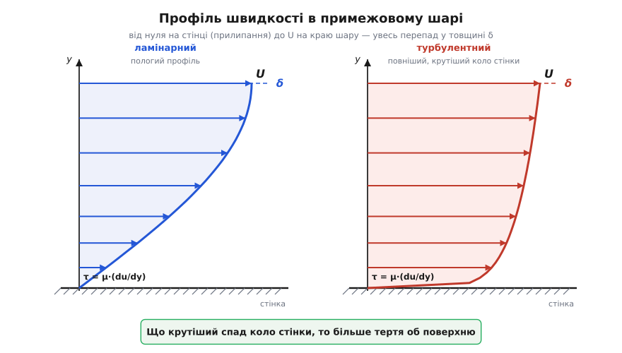
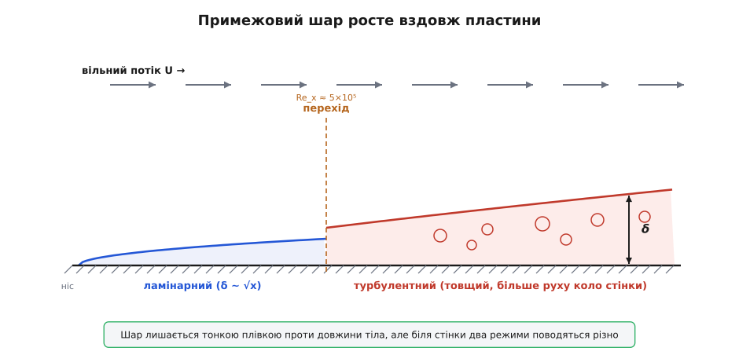

# Примежовий шар

<preknowlist>
- [В'язкість](book:physics/viscosity) — внутрішнє тертя рідини: дотичне напруження тим більше, чим швидше швидкість міняється впоперек потоку (τ = μ·du/dy).
- [Число Рейнольдса](book:physics/reynolds-number) — Re = ρ·v·L/μ, відношення інерції до в'язкості; воно каже, ламінарний потік чи турбулентний і наскільки тонким виходить примежовий шар.
- [Динамічний тиск і число Бернуллі](book:physics/dynamic-pressure) — поза шаром потік майже ідеальний, і там тиск зі швидкістю пов'язані за Бернуллі: де потік гальмується, тиск наростає.
</preknowlist>

Повітря майже не чинить тертя. Воно у півсотні разів менш в'язке за воду, а вода й сама легкоплинна. Тож напрошується спокуса: якщо в'язкість така мізерна, просто відкиньмо її й рахуймо потік як течію ідеальної, геть безтертьової рідини. Так у XVIII столітті й вчинив французький математик Жан ле Рон д'Аламбер — і вперся в чисту нісенітницю.

Пустимо ідеальну рідину обтікати кулю. Без тертя лінії течії розходяться перед кулею, тиснуться по боках і симетрично сходяться позаду — картина спереду й ззаду дзеркальна. А раз так, то й тиск попереду і позаду однаковий, сили врівноважуються, і на кулю не діє **жодного опору**. Нуль. Це й є парадокс д'Аламбера: бездоганна математика ідеальної рідини провіщає, що куля, крило, корабель — усе рухається крізь рідину без найменшого спротиву. А будь-яка дитина, вистромивши руку з вікна авто, знає, що це брехня. Щось глибоко негаразд із безневинним «відкиньмо крихітну в'язкість».

## Стінка, повз яку не можна прослизнути

Хиба ось у чому. Хоч яка мала в'язкість, є одне місце, де її не можна викинути ніколи, — сама поверхня тіла. Рідина **прилипає** до стінки: шар молекул, що торкається твердого, рухається разом із ним, а не ковзає по ньому. Для нерухомої стінки це означає, що просто на ній швидкість рідини дорівнює нулю. Це **умова прилипання** — не примха, а наслідок того, що молекули рідини й стінки зчіплюються так само, як зчіплюються сусідні шари самої рідини.

Тепер зведімо дві речі докупи. Далеко від тіла потік мчить із повною швидкістю набігання U. Впритул до стінки він стоїть. Отже, десь між стінкою й вільним потоком швидкість мусить піднятися від нуля до U. Питання лише — на якій товщині це станеться. І ось вирішальний здогад, який 1904 року на восьми сторінках виклав німецький інженер Людвіг Прандтль: за малої в'язкості весь цей перепад тиснеться у **надзвичайно тонкий шар** біля поверхні. Його Прандтль і назвав **примежовим шаром** (нім. *Grenzschicht*, від *Grenze* — межа й *Schicht* — шар). [Історія цього прориву](book:physics/boundary-layer/hist-prandtl.md) — як вісім сторінок владнали півторастолітній парадокс і заснували сучасну аеродинаміку — варта окремої розповіді.

Розділивши потік на дві області, Прандтль розрубав вузол. Поза тонким шаром швидкості майже вирівняні, зсуву майже нема — а раз нема зсуву, то в'язкість справді нічого не важить, і там працює стара добра ідеальна течія з Бернуллі. А **всередині** шару швидкість валиться від U до нуля на мізерній товщині δ, тож поперечний градієнт швидкості du/dy — велетенський. І хоч множник μ малий, добуток μ·(du/dy) — дотичне напруження — виходить чималим. Ось де ховалося тертя, яке д'Аламбер згубив: не розмазане по всьому потоку, а спресоване в плівку завтовшки з волосину коло самої обшивки.


*Усередині примежового шару швидкість піднімається від нуля на стінці (умова прилипання) до швидкості вільного потоку U на краю шару, на товщині δ. Крутість профілю біля самої стінки задає дотичне напруження τ = μ·(du/dy) — джерело поверхневого тертя. Ліворуч ламінарний профіль пологий; праворуч турбулентний — «повніший», притиснутий до стінки, з іще крутішим спадом коло неї.*

> 🔧 **Навіщо це.** Поділ потоку на дві області — не красивість, а робочий інструмент. Замість того щоб розв'язувати повні рівняння руху в'язкої рідини скрізь (задача жахлива), інженер розв'язує дві прості: ідеальний потік навколо тіла — щоб знайти розподіл тиску й підйомну силу, — і окремо тонкий примежовий шар уздовж поверхні — щоб знайти тертя й спрогнозувати відрив. Ці дві половини зшивають на краю шару. Уся практична аеро- й гідродинаміка, від профілю крила до лопатки турбіни, стоїть на цьому розчепленні.

## Чому шар тонкий — і наскільки

Наскільки ж тонкий той шар? Тут усе вирішує [число Рейнольдса](book:physics/reynolds-number) — те саме відношення інерції до в'язкості. Груба оцінка виходить дуже прозора: товщина шару відносно довжини тіла спадає як корінь із Re.

```
δ / L  ~  1 / √Re          (Re = U·L / ν)
```

Що більше Re — то тонший шар. А оскільки для всього, що літає й плаває в нашому світі, Re велетенське (мільйони й більше), шар виходить справді як плівка. Порахуймо на конкретному тілі.

**Плоска пластина в потоці повітря.** Повітря набігає зі швидкістю U = 30 м/с уздовж тонкої пластини; кінематична в'язкість ν = 1.5×10⁻⁵ м²/с. Якою буде товщина примежового шару на відстані x = 0.10 м від переднього краю?

```
Re_x = U·x / ν = 30 · 0.10 / (1.5×10⁻⁵) = 2×10⁵      (шар ще ламінарний)

δ ≈ 5·x / √Re_x = 5 · 0.10 / √(2×10⁵)
  = 0.50 / 447 = 1.1×10⁻³ м ≈ 1.1 мм
```

Ось що це означає: на десять сантиметрів позаду носа весь перехід від повного стояння до 30 метрів за секунду втиснуто в шар завтовшки з аркуш паперу. Коефіцієнт 5 і корінь тут — не з голови: це точний **розв'язок Блазіуса**, який 1908 року, ще студентом Прандтля, вивів Пауль Блазіус для ламінарного шару на пластині. Звідки береться і сам коефіцієнт, і рівняння шару — показано окремо: [математика примежового шару](book:physics/boundary-layer/math-blasius.md). А порахувати товщину шару й опір поверхневого тертя вздовж усієї пластини — числом, розв'язавши рівняння шару, як колись уручну зробив сам Блазіус, — допоможе невеличка програма: [розрахунок шару на пластині](book:physics/boundary-layer/proj-flat-plate-drag.md).

## Дві шкури шару: ламінарна й турбулентна

Сам примежовий шар живе тими самими двома режимами, що й будь-яка течія. Спершу, коло переднього краю, він **ламінарний** (лат. *lamina* — пластинка): рівні шари ковзають один по одному. Але шар росте вздовж тіла, місцеве Re_x = U·x/ν дедалі більшає, і на певній відстані ламінарний лад зривається в **турбулентний** (лат. *turbulentus* — бурхливий) — з дрібними вихорами, що люто перемішують рідину впоперек.

Для пластини поріг переходу лежить десь коло Re_x ≈ 5×10⁵. Порахуймо, де саме він настане в нашому прикладі.

```
x_перех = Re_перех · ν / U = 5×10⁵ · 1.5×10⁻⁵ / 30
        = 7.5 / 30 = 0.25 м
```

Отже, перші двадцять п'ять сантиметрів шар лишається ламінарним, а далі стає турбулентним. І два ці режими — не дрібна відмінність. Турбулентний шар товщий і, головне, має **повніший** профіль: перемішування безнастанно затягує швидку рідину згори вниз, до самої стінки, тож коло поверхні швидкість тримається високою майже до останнього. Наслідок двоякий. З одного боку, крутіший спад коло стінки означає більше поверхневе тертя — турбулентний шар чіпляється за обшивку дужче. З іншого — саме та повнота, той запас руху коло стінки, робить турбулентний шар набагато **живучішим**. А чому живучість шару важить над усе, стає видно, щойно ми спитаємо, що чекає на нього далі за течією.


*Уздовж пластини шар потовщується. Спершу він ламінарний і росте плавно (δ ~ √x). За критичним Re_x настає перехід, і турбулентний шар — товщий, з повнішим профілем — росте швидше. Обидва лишаються тонкою плівкою проти довжини тіла, але поводяться геть по-різному: біля стінки турбулентний несе більше руху.*

## Відрив — ось де ховалася решта опору

Досі ми пояснили лише один бік опору: **поверхневе тертя** — дотичний рух рідини об обшивку, зібраний з усього дотичного напруження τ по поверхні. Для тонких, добре обтічних тіл — пластини, крила під малим кутом — цим тертям опір і вичерпується, і він справді малий. Але куля з парадокса д'Аламбера гальмує зовсім не так слабко. Де ж друга половина?

Відповідь — у тому, що діється зі шаром на **задній** частині тіла. Обтікаючи опукле тіло, потік спершу розганяється (спереду до боків), а потім за боками мусить знову сповільнитися й зімкнутися позаду. Сповільнення означає, що тиск уздовж потоку **наростає** — потік іде «в гору», проти зростання тиску (несприятливий градієнт). Зовнішній, повношвидкісний потік цю гірку долає розгоном. А рідина в примежовому шарі вже загальмована тертям майже до нуля — запасу руху їй бракує. І в якийсь момент вона не годна далі пертися проти наростання тиску: спиняється, а тоді її **завертає назад**. Пристінна течія відривається від поверхні, і за тілом розкривається широкий вихровий слід.

Це і є **відрив** примежового шару. Наслідок його руйнівний. Позаду, у сліді, тиск падає й лишається низьким; спереду тіло тисне повний напір, а ззаду підпору вже нема — і ця різниця тисків штовхає тіло назад. Так народжується **опір тиску** (його ж звуть опором форми). Разом поверхневе тертя й опір тиску й дають повний [аеродинамічний опір](book:physics/aerodynamic-drag) тіла; докладніше про сам механізм зриву — [відрив потоку](book:physics/flow-separation).

І ось тут — найтонше місце всієї історії, розгадка парадокса д'Аламбера. Ідеальна рідина відриву не знає: без в'язкості нема примежового шару, нема загальмованої пристінної рідини, і потік слухняно змикається позаду — звідси й фальшивий нуль опору. Але додай хоч крихту в'язкості — і вона, орудуючи в тонкому шарі, зриває течію, розкриває слід і **перебудовує весь потік навколо тіла**. У цьому пастка: наскільки б малою не була в'язкість, її вплив через відрив **не зникає**. Не можна відкинути мале, коли саме воно вмикає велике.

> 🔧 **Навіщо це.** Звалювання літака — це відрив у чистому вигляді. Задереш крило на завеликий кут атаки — примежовий шар на верхній поверхні не долає крутого наростання тиску, відривається майже від носка, підйомна сила обвалюється, і [крило](book:physics/fixed-wing-lift) перестає нести. Тому кут атаки — святая святих пілотування, а на крилах ставлять генератори вихорів: маленькі пластинки, що навмисне підсипають у шар турбулентності й запасу руху, аби відсунути відрив. Той самий бій за пристінний рух — усюди, де рідина обтікає викривлену поверхню: лопатки компресора, дифузори, клапани, вітрила.

## Приборкати шар: ямки на м'ячі й краплеподібні форми

Якщо відрив — головний лиходій, то керувати ним означає керувати опором. І тут стає в пригоді те, що турбулентний шар живучіший за ламінарний. Найкрасивіший приклад — ямки на м'ячі для гольфу.

Гладенька куля за швидкого польоту тримає ламінарний шар, що відривається рано, лишаючи широченний слід і величезний опір тиску. Тепер укрий кулю ямками. Вони навмисне збурюють шар у турбулентний **раніше**; турбулентний, із запасом пристінного руху, чіпляється за поверхню далі, відривається пізніше й ближче до заду — слід звужується, опір тиску різко падає. Так, поверхневе тертя при цьому трохи зростає, але виграш на тиску незрівнянно більший. Підсумок: пориту ямками кулю можна закинути мало не вдвічі далі, ніж таку саму гладеньку. Той рідкісний випадок, коли **шорсткість зменшує опір** — бо вона краде в опору тиску куди більше, ніж додає до тертя.

Другий шлях — не збурювати шар, а не давати тиску наростати круто. Витягни тіло в плавну краплю з довгим тонким хвостом — і тиск позаду відновлюватиметься так полого, що загальмованій пристінній рідині вистачить сили дотягти до самого хвоста без відриву. Слід виходить вузенький, опір тиску — крихітний. Ось чому крапля, риба, фюзеляж і профіль крила всі мають цю впізнавану обтічну форму із загостреним хвостом: уся вона — про те, щоб примежовий шар не відірвався.

Розгадавши примежовий шар, Прандтль не просто владнав старий парадокс — він дав інженерії окуляри, крізь які видно, звідки насправді береться опір і як його вгамувати. Уся ця плівка завтовшки з волосину коло обшивки й досі вирішує, скільки палива спалить літак, як далеко полетить м'яч і чи втримається крило в повітрі. Крихітна в'язкість, яку так кортіло відкинути, ховається саме тут — і саме звідси править усім потоком.
