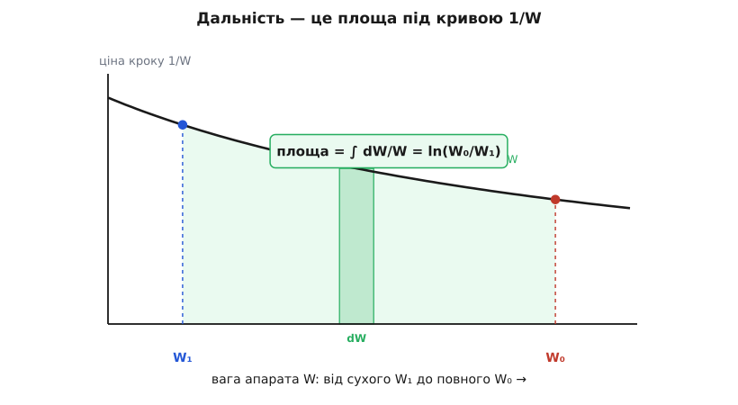

# 🧮 Повне виведення Бреге: інтеграл, логарифм і три оптимальні швидкості

Рівняння Бреге вміщається в півтора рядки, але за цим рядком ховається інтеграл — і саме інтеграл вирішує все. Поки вага апарата стала (акумулятор), дальність рахується простим множенням. Щойно пальне починає вигоряти й апарат легшає, множення ламається, і на його місце приходить натуральний логарифм. А коли поруч постає питання не «як далеко», а «як довго», з'ясовується, що для дальності й тривалості апарат має летіти на **різних** швидкостях — і цих швидкостей рівно три. Розберімо весь ланцюжок від однієї краплі пального до останньої формули, не пропускаючи жодного кроку.

### Що саме інтегруємо: змінна — це вага

У будь-яку мить крейсерського польоту чотири сили врівноважені: [підіймальна сила дорівнює вазі](book:physics/fixed-wing-lift) (L = W), а тяга — опору (T = D). Ніщо не пришвидшується. Єдине, що повільно повзе, — це **вага W**, бо пальне згоряє й покидає борт. Отже, природна змінна, за якою треба інтегрувати, — сама вага. Позначмо вигоряння малої порції пального як dW; ця величина **від'ємна**, бо вага меншає.

Погляньмо на одну краплю пального вагою |dW|. Її маса — вага, поділена на g, тобто (−dW/g). У ній запасено хімічну енергію: маса, помножена на [питому енергію](book:physics/ragone-chart) e* (джоулів на кілограм):

```
dE_хім = e* · (−dW/g)
```

Але не вся ця енергія доходить до повітря — мотор, регулятор, гвинт з'їдають частину. Корисна частка — це ККД усього тракту η. І саме ця корисна робота оплачує опір на маленькому шматочку шляху dR:

```
η · e* · (−dW/g)  =  D · dR
```

Ліворуч — що дала крапля, праворуч — за що вона заплатила. Уся фізика вже тут; далі — тільки чесна алгебра.

### Чому виходить інтеграл, а не множення

Опір зручно виразити через вагу й аеродинамічну якість K = L/D. Бо D = L/K, а в горизонтальному польоті L = W, тож D = W/(L/D). Підставмо це в рівняння краплі й виразимо елемент шляху:

```
dR  =  −(η · e* / g) · (L/D) · (dW / W)
```

Ось де корінь усього. Дивись, що стоїть у знаменнику: **вага W — і вона ж є змінною інтегрування**. Кожна наступна крапля згоряє за меншої ваги, ніж попередня, а отже, купує трохи довший шлях (менша вага — менший опір — дешевший метр). Крок за кроком «ціна» W повзе. Помножити на щось одне тут не можна — доводиться складати нескінченно багато щоразу дешевших крапель. А складання нескінченно малих часток — це [інтеграл](book:math/integral).

### Складання dW/W — це і є логарифм

Зберемо весь шлях: проінтегруємо dR від повного бака W₀ до сухого W₁. Сталі множники виносяться за знак інтеграла, лишається сама серцевина — сума часток dW/W:

```
R  =  −(η · e* / g) · (L/D) · ∫[W₀→W₁] dW/W
```

Функція, чия похідна дорівнює 1/W, — одна-єдина: це [натуральний логарифм](book:math/logarithms). Тому первісна від 1/W є ln W, а визначений інтеграл — різниця логарифмів на кінцях:

```
∫[W₀→W₁] dW/W  =  ln W₁ − ln W₀  =  ln(W₁/W₀)  =  −ln(W₀/W₁)
```

Мінус усередині гасить зовнішній мінус — і народжується рівняння Бреге в чистому вигляді:

```
R  =  (η · e* / g) · (L/D) · ln(W₀/W₁)
```

Логарифм тут не з'явився з примхи запису. Він неминучий тому, що вага сама себе тане, стоячи в знаменнику: величина, темп зміни якої обернено пропорційний їй самій, завжди приводить до ln. Геометрично R — це просто **площа під кривою 1/W** між сухою й повною вагою: широкі порції в зоні великих W (важкий, «дорогий» апарат) додають мало, а легкий наприкінці — багато, і сумарна площа росте як логарифм.


*Дальність — це площа під кривою 1/W. Кожна крапля пального додає смужку заввишки 1/W: за важкої машини (великі W) смужки низькі й дешеві, за легкої — високі. Сума всіх смужок і є ln(W₀/W₁).*

### Від запасу енергії до витрати пального: c_p і c_t — те саме з іншого кінця

Інженер рідко знає e* і η окремо — він міряє на стенді **витрату пального**. І тут двигуни діляться на два роди. Гвинтовий (поршень, турбогвинт, електро) видає на валу **потужність**, і його оцінюють питомою витратою на потужність c_p — скільки маси пального йде на джоуль роботи вала. Реактивний видає **тягу**, і його оцінюють витратою на тягу c_t — скільки маси йде на ньютон-секунду тяги.

Ці «інженерні» величини — не нова фізика, а той самий e*, лише перевернутий. Двигун перетворює хімічну енергію пального на роботу вала з тепловою ефективністю η_th, тож на кілограм пального вал віддає η_th·e* джоулів. Отже, пального на джоуль вала — це обернена величина:

```
c_p  =  1 / (η_th · e*)      →      1/(g·c_p)  =  η_th · e* / g
```

Підставмо це в дальність гвинтового апарата, де повний ККД тракту η = η_гв·η_th (гвинт × теплова частина):

```
R_гвинт  =  (η_гв / (g·c_p)) · (L/D) · ln(W₀/W₁)  =  (η_гв·η_th·e* / g) · (L/D) · ln(W₀/W₁)
```

Це буква в букву та сама (η·e*/g)·(L/D)·ln — просто записана через стендову величину. Для реактивного зв'язок трохи інший. Корисна тягова потужність — це тяга на швидкість T·V; повна енергія пального за секунду — маса-потік ṁ на e*; їхнє відношення й є повний ККД η_o = T·V/(ṁ·e*). Звідси ṁ = T·V/(η_o·e*), а витрата на тягу:

```
c_t  =  ṁ / T  =  V / (η_o · e*)      →      V/(g·c_t)  =  η_o · e* / g
```

```
R_реактив  =  (V / (g·c_t)) · (L/D) · ln(W₀/W₁)
```

Ось чому в реактивній формулі стоїть швидкість V, а в гвинтовій — ні. Це не «додаткова» фізика: швидкість **захована в самому c_t** (адже c_t = V/(η_o·e*)), і множник V у чисельнику лише розкриває її назад. Величина V/c_t = η_o·e* швидкості вже не містить.

**Приклад: чи згодне c_p із питомою енергією.** Гас має e* = 43·10⁶ Дж/кг; теплова ефективність доброго поршневого двигуна η_th ≈ 0.40. Порахуймо його питому витрату й порівняймо з тим, що пишуть у паспортах.

```
c_p = 1 / (η_th · e*) = 1 / (0.40 · 43·10⁶) = 5.81·10⁻⁸ кг/Дж
переведемо у звичні г/(кВт·год):  ×3.6·10⁶ Дж/(кВт·год)  ×1000 г/кг
c_p = 5.81·10⁻⁸ · 3.6·10⁶ · 1000 ≈ 209 г/(кВт·год)
```

Реальні поршневі авіадвигуни мають витрату близько 200–250 г/(кВт·год) — точно в яблучко. Отже, «енергетична» й «стендова» форми Бреге — це один вираз, лише зайдений з різних боків.

### Рівняння тривалості: усе вирішує питання «чи скорочується V?»

Дальність — це інтеграл dR = V·dt (шлях). Тривалість — інтеграл самого dt (час). Різниця в одному кроці, але саме він розводить чотири випадки. Підставмо у dt закон витрати пального й спитаймо просте: **скорочується швидкість V чи ні?** Відповідь і визначає, буде логарифм чи щось інше.

Розкладімо всі чотири клітинки. Реактивний палить пропорційно тязі: −dW = g·c_t·T·dt = g·c_t·D·dt (бо T = D). Гвинтовий палить пропорційно потужності на валу: −dW = g·c_p·(D·V/η)·dt.

```
                 ІНТЕГРУЄМО dt (час)            ІНТЕГРУЄМО V·dt (шлях)
                 = ТРИВАЛІСТЬ                    = ДАЛЬНІСТЬ
РЕАКТИВНИЙ    dt = −(L/D)/(g·c_t) · dW/W      dR = V·dt: V лишається
(∝ тязі)      → E = (1/(g·c_t))·(L/D)·ln       → R = (V/(g·c_t))·(L/D)·ln
              V так і не з'явилась → ЧИСТИЙ ln  V присутня → макс CL^0.5/CD
              оптимум: макс L/D

ГВИНТОВИЙ     dt = −η/(g·c_p) · dW/(D·V)      dR = V·dt: V СКОРОЧУЄТЬСЯ
(∝ потужності) V НЕ скорочується → не ln       → R = (η/(g·c_p))·(L/D)·ln
              оптимум: макс CL^1.5/CD          V зникла → ЧИСТИЙ ln
                                               оптимум: макс L/D
```

Ось уся симетрія на долоні. Логарифм виходить рівно в тих двох клітинках по діагоналі, де «валюта пального» і змінна інтегрування збігаються: реактивний палить за тягу — і час дає чистий ln; гвинтовий палить за потужність (силу × швидкість) — і в шляху dR = V·dt зайва швидкість скорочується, знову даючи ln. А у двох інших клітинках V не гаситься — і чистого логарифма немає.

Реактивна тривалість виходить прямо з таблиці: інтегруємо dt, швидкість так і не входить, тому

```
E_реактив  =  (1 / (g·c_t)) · (L/D) · ln(W₀/W₁)          [оптимум — макс L/D]
```

А от гвинтова тривалість — найцікавіша, бо V не скорочується й тягне за собою густину повітря та площу крила. Порахуймо її до кінця. Щоб протриматися найдовше, апарат тримає режим найменшої потужності — а це сталий кут атаки, тобто **сталий CL**. Тоді з рівності підйому й ваги:

```
L = W = ½·ρ·V²·S·CL   →   V = √( 2·W / (ρ·S·CL) )
опір:                       D = W · CD/CL
потрібна потужність:        P = D·V = W·(CD/CL)·√(2W/(ρ·S·CL))
                              = (CD / CL^1.5) · √(2/(ρ·S)) · W^1.5
```

Підставмо це в dt = −(η/(g·c_p))·dW/(D·V) і винесемо все стале:

```
dt = −(η/(g·c_p)) · (CL^1.5/CD) · √(ρ·S/2) · W^(−1.5) · dW
```

Лишилося скласти W^(−1.5) по всьому баку. Первісна від W^(−1.5) є −2·W^(−0.5), тож інтеграл від W₀ до W₁ дає 2·(W₀^(−0.5) − W₁^(−0.5)) — величину від'ємну, яку зовнішній мінус перевертає в додатну. Виходить рівняння тривалості гвинтового апарата:

```
E_гвинт  =  (η / (g·c_p)) · (CL^1.5/CD) · √(2·ρ·S) · ( 1/√W₁ − 1/√W₀ )
```

Прочитаймо, що воно каже. Тривалість любить велике CL^1.5/CD (мінімум потужності), любить **щільне повітря √ρ** (лети низько!), любить велике крило S і любить легку суху вагу W₁. Ось чому апарати-довгожителі — розвідники, ретранслятори, метеозонди-планери — літають повільно, низько й на широкому крилі. І ось де ховається головна відмінність від дальності: тут немає чистого логарифма, натомість — різниця обернених коренів із ваг, бо режим мінімальної потужності змушує апарат **сповільнюватися** мірою вигоряння (V ∝ √W).

**Приклад: чому для тривалості треба летіти низько.** Тривалість гвинтового апарата пропорційна √ρ. Порівняймо політ біля землі (ρ = 1.225 кг/м³) з висотою 3 км (ρ ≈ 0.909 кг/м³) за інших рівних:

```
E(3 км) / E(0)  =  √(0.909 / 1.225)  =  √0.742  =  0.861
```

Піднявшись на 3 кілометри, апарат втрачає близько 14 % часу висіння. Для дрона-патруля це прямий програш — тому оптимальний loiter туляться до нижчих ешелонів, поки цього не забороняє рельєф чи задача.

### Три оптимуми: одна поляра, три дотичні

Лишилося показати, **де саме** сидять ці максимуми, — а для цього потрібна модель опору. Візьмімо параболічну поляру: повний коефіцієнт опору складається зі сталого паразитного дна CD₀ (форма, тертя, виступи) та індуктивного члена k·CL², що росте з підйомом (плата за скіс потоку на кінцях крила):

```
CD = CD₀ + k·CL²
```

Тепер кожен оптимум — це задача на максимум відношення CL у якомусь степені до CD. Розв'яжемо її [похідною](book:math/derivative), прирівнявши до нуля. Почнімо з найголовнішого — максимуму якості L/D = CL/CD:

```
Максимізуємо  f(CL) = CL / (CD₀ + k·CL²).  У точці максимуму df/dCL = 0:
  df/dCL = [ (CD₀ + k·CL²) − CL·(2k·CL) ] / (CD₀ + k·CL²)²  =  0
  чисельник у нуль:  CD₀ + k·CL² − 2k·CL² = 0
                     CD₀ − k·CL² = 0
  ─────────────────────────────────
  k·CL² = CD₀          ← індуктивний опір ДОРІВНЮЄ паразитному
```

Дивовижно проста умова: аеродинамічна якість найбільша там, де плата за підйом (індуктивний опір) точно зрівнюється з платою за форму (паразитний). Той самий прийом працює для будь-якого степеня n у виразі CL^n/CD — і дає одну загальну формулу:

```
Максимізуємо  CL^n / (CD₀ + k·CL²):
  n·CL^(n−1)·(CD₀ + k·CL²) − CL^n·2k·CL = 0
  n·(CD₀ + k·CL²) = 2k·CL²
  ────────────────────────────
  k·CL²  =  [ n / (2 − n) ] · CD₀
```

Три потрібні режими — це три значення n, і кожне дає свій баланс опорів:

```
n = 1.0  (макс L/D, дальність гвинта й тривалість реактивного):
         k·CL² = CD₀            індуктивний = паразитний          (1 : 1)
n = 0.5  (макс CL^0.5/CD, дальність реактивного):
         k·CL² = CD₀/3          паразитний УТРИЧІ більший         (1 : 3)
n = 1.5  (макс CL^1.5/CD, тривалість гвинта, мін потужність):
         k·CL² = 3·CD₀          індуктивний УТРИЧІ більший        (3 : 1)
```

А величину найбільшої якості дістати вже легко: у точці k·CL² = CD₀ повний опір CD = CD₀ + k·CL² = 2·CD₀, тож

```
CL_md = √(CD₀/k)                        (індекс md — «мінімальний опір»)
(L/D)max = CL_md / (2·CD₀) = 1 / (2·√(CD₀·k))
```

Тепер переведемо три коефіцієнти CL у три **швидкості**. З рівності L = W = ½·ρ·V²·S·CL випливає V ∝ 1/√CL: більший потрібний CL означає повільніший політ. Візьмімо за опору швидкість максимальної якості V_md (там CL = CL_md):

```
мінімум потужності:   CL = √3·CL_md    →   V = V_md / 3^0.25 ≈ 0.760·V_md
максимум L/D:         CL = CL_md        →   V = V_md
дальність реактивного: CL = CL_md/√3   →   V = V_md · 3^0.25 ≈ 1.316·V_md
```

Три оптимуми лягають у пропорцію швидкостей 0.76 : 1 : 1.32. Найповільніше — щоб гвинтовий провисів найдовше; посередині — щоб пролетів найдалі (там же реактивний висить найдовше); найшвидше — щоб реактивний пролетів найдалі. Одна поляра, три дотичні — і кожна каже пілотові іншу цифру на покажчику швидкості.


*Три оптимальні режими на одній поляре. Пряма з початку координат має нахил CL/CD = L/D; дотична до поляри торкається її саме в точці найбільшої якості. Дві інші точки — швидша (дальність реактивного) і повільніша (тривалість гвинта) — сидять по різні боки, і кожна відповідає своєму балансу паразитного й індуктивного опору.*

**Приклад: три швидкості одного апарата.** Хай поляра має CD₀ = 0.025, k = 0.045, а навантаження на крило W/S = 1200 Н/м², повітря біля землі ρ = 1.225 кг/м³.

```
CL_md    = √(0.025/0.045) = √0.556 = 0.745
(L/D)max = 1/(2·√(0.025·0.045)) = 1/(2·√0.001125) = 1/(2·0.03354) = 14.9
V_md     = √( 2·1200 / (1.225·0.745) ) = √(2400/0.9126) = √2630 = 51.3 м/с
```

```
тривалість гвинта (мін потужність):  0.760·51.3 = 39.0 м/с
дальність гвинта / тривалість реактивного (макс L/D): 51.3 м/с
дальність реактивного:                1.316·51.3 = 67.5 м/с
```

Той самий планер, та сама вага — а «найкраща» швидкість гуляє від 39 до 68 м/с залежно від того, чого ти хочеш: провисіти, долетіти на гвинті чи долетіти на струмені. Питання «яка оптимальна швидкість?» без уточнення мети відповіді не має.

### Що врешті дає це виведення

За п'ятьма формулами стоїть один кістяк і кілька розвилок. Кістяк — енергетичний баланс однієї краплі: η·e*·(−dW/g) = D·dR, з якого виростає все. Перша розвилка — чи міняється вага: стала (батарея) дає множення, змінна (пальне) дає інтеграл dW/W, тобто логарифм. Друга розвилка — за що платить двигун: за тягу (реактивний) чи за потужність (гвинтовий); це вирішує, чи скоротиться швидкість і де стане чистий ln, а де — корінь із ваги. Третя розвилка — що максимізуємо: L/D для найчистішого польоту, CL^0.5/CD щоб реактивний летів далі й швидше, CL^1.5/CD щоб гвинтовий висів довше й повільніше. Кожна з цих цифр, що їх інженер підставляє в рівняння Бреге, — це насправді вказівка «лети на тому CL, який максимізує потрібне відношення». А сама формула, що традиційно носить ім'я Бреге (близький вигляд незалежно вивів і інженер Дж. Ґ. Коффін у 1920-х — але це вже окрема історія), лише акуратно записує цю бухгалтерію енергії, ваги й опору.
