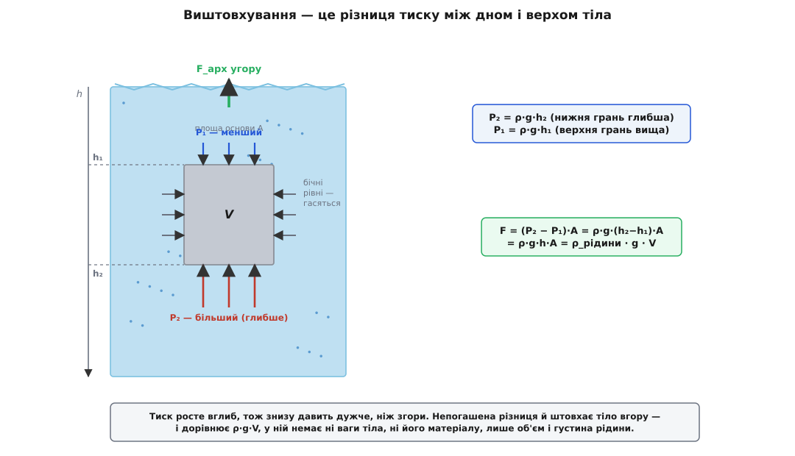
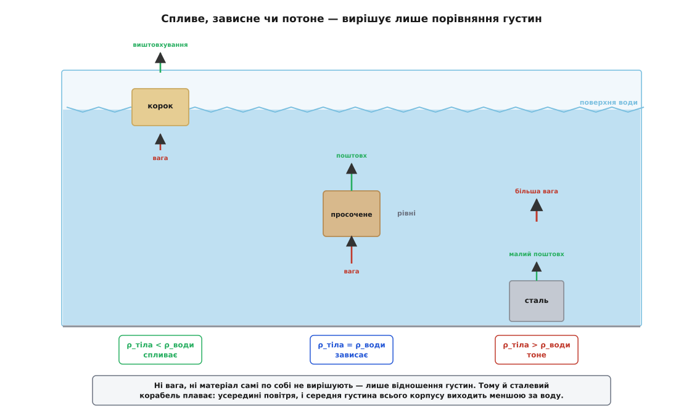
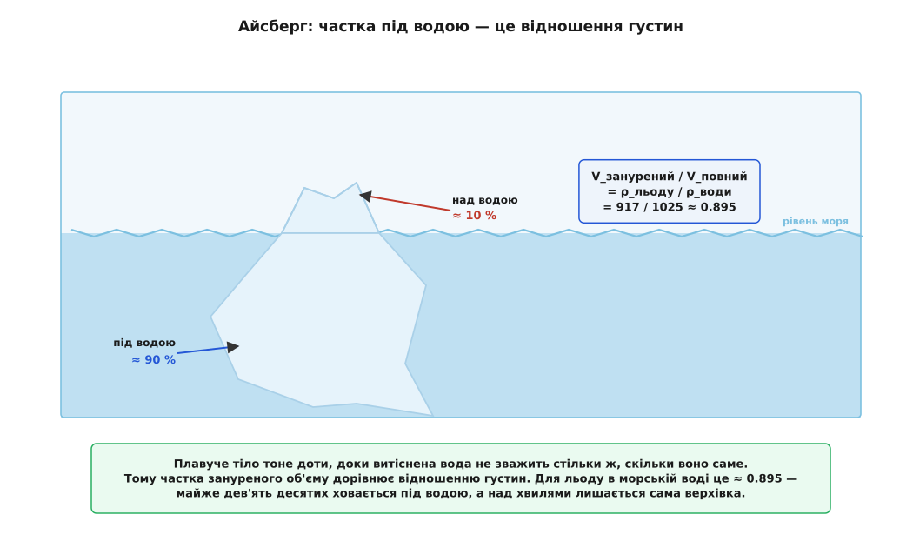

# Виштовхувальна сила (закон Архімеда)

<preknowlist>
- [Тиск](book:physics/pressure) — сила на одиницю площі; головне тут — у рідині тиск росте вглиб (P = ρ·g·h) і давить на кожну поверхню перпендикулярно.
- [Густина](book:physics/density) — маса одиниці об'єму (ρ = m/V); саме порівняння густин вирішує, тіло спливе чи потоне.
- [Сила](book:physics/force) — що штовхає чи тягне тіло; виштовхування — рівнодійна всіх сил тиску, і її зважують проти ваги.
- [Вільне падіння](book:physics/free-fall) — біля Землі кожне тіло має вагу m·g (g ≈ 9.8 м/с²); саме проти цієї ваги й працює виштовхування.
</preknowlist>

Підніміть під водою важкий камінь — і він раптом майже нічого не важить; винесіть із води — і той самий камінь знову тягне руку донизу. Велетенський сталевий корабель тримається на плаву, а маленький цвях із тієї самої сталі йде на дно. У басейні ви почуваєтесь легшим, ніж на суходолі, а гумовий м'яч під водою пручається й рветься нагору. За всіма цими історіями стоїть одна сила — та, що штовхає занурене тіло вгору. Її звуть виштовхувальною, або архімедовою. Розберімо, звідки вона береться (а береться вона не з чарів, а з простого тиску), чому дорівнює саме вазі витісненої рідини й чому доля всякого тіла у воді врешті зводиться до порівняння двох густин.

## Звідки береться поштовх угору

Занурене тіло [тиск](book:physics/pressure) стискає з усіх боків одразу. З боків усе врівноважується само собою: ліва й права грані лежать на однаковій глибині, тиск на них однаковий і напрямлений назустріч — сили гасять одна одну. А от згори й знизу — ні. Тиск у рідині **росте вглиб**, тож нижня грань тіла завжди глибша за верхню, і знизу рідина тисне вгору дужче, ніж згори тисне вниз. Ця нерівність між верхом і низом і лишає непогашений поштовх — угору. Ось і вся розгадка: виштовхування — не окрема сила природи, а просто наслідок того, що рідина знизу давить сильніше, бо там глибше.

Порахуймо це для найпростішого тіла — прямокутного бруска з площею основи A і висотою h, зануреного так, що верхня грань на глибині h₁, а нижня на h₂ = h₁ + h. Знизу рідина тисне вгору з тиском P₂ = ρ·g·h₂, згори тисне вниз із P₁ = ρ·g·h₁, де ρ — [густина рідини](book:physics/density). Різниця цих двох сил і є виштовхування:

```
F = P₂·A − P₁·A = ρ·g·h₂·A − ρ·g·h₁·A
  = ρ·g·(h₂ − h₁)·A
  = ρ·g·h·A
  = ρ_рідини · g · V
```

бо h·A — це і є об'єм бруска V. Погляньте на результат: у ньому немає ані сліду того, з чого брусок зроблений, — ні його густини, ні його ваги. Виштовхування задають лише дві речі: об'єм зануреної частини та густина самої рідини.



*Виштовхування — це різниця тиску між дном і верхом тіла. Бо тиск росте вглиб, знизу давить дужче; непогашений залишок і є архімедова сила, рівна ρ·g·V.*

А тепер погляньмо на цей самий вислів іншими очима. Добуток ρ_рідини·V — це маса рідини, що помістилася б у тому об'ємі V. Помножена на g, вона стає **вагою** цієї рідини. Отже, виштовхувальна сила дорівнює вазі рідини, яку тіло витіснило, посівши її місце. Це і є закон Архімеда.

## Закон Архімеда: вага витісненої рідини

**На будь-яке тіло, повністю чи частково занурене в рідину або газ, діє напрямлена вгору виштовхувальна сила, що дорівнює вазі витісненої тілом рідини (газу).**

```
F_арх = ρ_рідини · g · V_зануреної частини
```

Ми вивели це для рівненького бруска, де грані зручно лежать горизонтально й вертикально. Та справедливе воно для тіла **будь-якої** форми — хоч якоря, хоч статуї, хоч жмені гальки. Чому так, видно з гарного міркування, що взагалі не потребує обчислень.

Уявімо, що занурене тіло раптом зникло, а рідина зімкнулась і заповнила собою залишену порожнину. Ця рідина-«двійник» точнісінько тієї самої форми, ясна річ, нікуди не попливе — вона висить у спокої серед решти рідини, як і має бути. Отже, сили тиску з усіх боків урівноважують її власну вагу, тобто штовхають угору рівно з вагою цього об'єму рідини. Але навколишня рідина не знає й не бачить, що там усередині: вона тисне на межу порожнини однаково, хоч там рідина-двійник, хоч сталь, хоч корок. Тому й на всяке тіло тієї самої форми діє той самий поштовх — вага витісненої рідини. Форма тіла врахована сама собою, бо ми з самого початку взяли порожнину саме його обрису. Суворе виведення того ж результату — уже не міркуванням, а прямим підсумовуванням сил тиску по всій кривій поверхні тіла — разом із питанням, у якій точці ця сила прикладена і чому плавуче судно не перекидається, [винесено в окреме математичне доповнення](book:physics/buoyancy/math-buoyancy-derivation.md).

**Гранітний валун у воді.** Брила об'ємом 20 л = 0.02 м³, густина граніту ≈ 2700 кг/м³; вода ρ = 1000 кг/м³, g = 9.8 м/с².

```
вага в повітрі:  P = ρ_граніту·g·V = 2700 · 9.8 · 0.02 = 529 Н   (≈ 54 кг)
виштовхування:   F = ρ_води·g·V    = 1000 · 9.8 · 0.02 = 196 Н   (≈ 20 кг)
вага у воді:     P − F             = 529 − 196         = 333 Н   (≈ 34 кг)
```

**Висновок.** Під водою валун «важить» на 20 кг менше — рівно стільки, скільки важать витіснені ним 20 літрів води. Він не полегшав насправді: просто вода підпирає його знизу, і рука тримає вже не всю вагу, а лише різницю. На цій самій «утраті ваги» тримається спосіб, яким [Архімед викрив підмішане срібло в короні царя Гієрона](book:physics/density/hist-archimedes-crown.md): занурене тіло легшає рівно на вагу витісненої води, а звідси прямо читається його об'єм, а з об'ємом і густина — непідробний підпис матеріалу.

> 🔧 **Навіщо це.** Зважити тіло химерної форми на об'єм лінійкою не вийде, зате виштовхування дає його задарма: занур у воду, поглянь, на скільки полегшало, — і ось об'єм у грамах води. Так у лабораторії міряють густину зразків неправильної форми, так пробірники відрізняють щире золото від позолоти, так працює ареометр — поплавок, що тоне в рідину рівно доти, доки не витіснить свою вагу, і за глибиною занурення показує густину електроліту в акумуляторі чи міцність розчину.

## Спливе чи потоне: змагання двох густин

Знаючи поштовх угору, поставмо його проти ваги — і одразу побачимо долю тіла. Занурмо тіло об'ємом V і густиною ρ_тіла повністю в рідину густиною ρ_рідини. Униз тягне вага, угору штовхає Архімед:

```
вага:           P = ρ_тіла   · g · V
виштовхування:  F = ρ_рідини · g · V
```

Обидві сили несуть той самий множник g·V, тож усе вирішує голе порівняння двох густин:

- ρ_тіла **>** ρ_рідини — вага переважує, тіло **тоне** (сталевий цвях у воді);
- ρ_тіла **<** ρ_рідини — виштовхування переважує, тіло **спливає** (корок, олія, крига);
- ρ_тіла **=** ρ_рідини — сили рівні, тіло **зависає** у товщі, ні вгору ні вниз (нейтральна плавучість).



*Долю зануреного тіла вирішує одне порівняння: рідше за рідину — спливає, густіше — тоне, однакове — зависає. Речовина й вага самі по собі ні до чого, важить лише відношення густин.*

Ось і розгадка сталевого корабля, який на позір знущається із законів. Сама сталь мало не увосьмеро густіша за воду й тоне будь-яким суцільним шматком. Але корпус судна не суцільний — усередині повітря, і брати треба **середню** густину всього корабля разом із порожниною, а вона виходить меншою за воду. Порожнистий сталевий човен витісняє куди більше води, ніж важить його метал, — і тримається на плаву. Проколіть корпус, впустіть воду замість повітря — середня густина підскочить, і той самий корабель піде на дно. Тим самим фокусом керує підводний човен: набирає воду в баластні цистерни, щоб поважчати до густини моря й пірнути, і продуває їх стисненим повітрям, щоб полегшати й спливти. І риба робить те саме плавальним міхуром — підкачує чи стравлює газ, підганяючи свою густину під воду, щоб висіти на потрібній глибині без жодного змаху плавцем.

> 🔧 **Навіщо це.** Уся корабельна справа — це керування середньою густиною й тим, скільки води витісняє корпус. Позначку ватерлінії на борту виводять саме з рівноваги «вага судна = вага витісненої води» і вантажать доти, доки судно не осяде до дозволеної риски. Той самий розрахунок стоїть під понтонним мостом, буєм, рятувальним жилетом і поплавком вудки: усі вони працюють об'ємом витісненої води, а не власною міцністю.

## Як глибоко сидить те, що плаває

Тіло, що спливає, не вискакує з води цілком — воно тоне рівно настільки, щоб витіснена вода зважила стільки ж, скільки саме тіло, і на тому спиняється. У рівновазі вага витісненої води дорівнює вазі тіла:

```
ρ_тіла · g · V_повний = ρ_рідини · g · V_занурений
⟹  V_занурений / V_повний = ρ_тіла / ρ_рідини
```

Частка зануреного об'єму дорівнює просто відношенню густин. Що ближча густина тіла до густини рідини, то глибше воно сидить; рівно на межі рідше тіло тоне майже все, ледь виступаючи над поверхнею.

**Айсберг.** Лід айсберга — прісний, льодовиковий — має густину ≈ 917 кг/м³, а солона морська вода ≈ 1025 кг/м³.

```
V_занурений / V_повний = 917 / 1025 = 0.895
над водою:  1 − 0.895   = 0.105  ≈  10 %
```

**Висновок.** Під водою ховається майже дев'ять десятих айсберга — над хвилями видно лише десяту частину. Звідси й вислів про «верхівку айсберга»: те, що на очах, — мала дещиця схованого. І звідси ж смертельна підступність криги для суден: небачена підводна маса тягнеться далеко вбік від видимого шпиля, і корабель напорюється на неї там, де на поверхні чисто.



*Плавуче тіло тоне доти, доки витіснена вода не зважить стільки ж, скільки воно саме. Для льоду в морі це майже 90 % об'єму під водою — над поверхнею лишається сама «верхівка».*

Легенько притоплений і відпущений, поплавок не спиняється одразу: надлишок витісненої води штовхає його назад угору, він проскакує рівновагу, виринає задалеко, вага тягне вниз — і тіло починає рівномірно гойдатися вгору-вниз, як вантаж на пружині. Саме так колишеться на хвилях буй чи корок вудки. [Невеликий обчислювальний проєкт](book:physics/buoyancy/proj-floating-buoy.md) показує, як знайти осадку плавучого тіла числом і як із виштовхування виходить оте розмірене гойдання з передбачуваним періодом.

## Той самий закон у повітрі

Виштовхування працює й у повітрі — просто густина газу мала, тож і поштовх виходить малий. Кожне тіло навколо нас важить трохи менше, ніж «мало б», бо повітря його підпирає знизу; для щільних тіл ця поправка мізерна, і ми її не помічаємо. Але щойно тіло стає рідшим за саме повітря — воно спливає вгору, точно як корок у воді. Куля з гарячим (а тому розрідженим) повітрям чи з гелієм важить менше, ніж витіснене нею холодне довколишнє повітря, — і Архімед несе її в небо.

Тут ховається кумедний доказ, що виштовхування завжди напрямлене строго проти того боку, куди «тягне» вага. Різко розженіть автомобіль — і важче повітря за інерцією збереться ззаду салону, а туди, вперед, де його поменшало, спливе все легше. Тому гелієва кулька на ниточці в такому авто нахиляється не назад, як голови пасажирів, а **вперед** — проти всякої інтуїції, зате точно за Архімедом.

Сам закон, доказ через рівновагу й навіть тонке питання стійкості плавучих тіл уперше строго вивів Архімед із Сиракуз у трактаті «Про плавучі тіла» — праці, з якої народилася [ціла наука про рівновагу рідин](book:physics/buoyancy/hist-floating-bodies.md). Дві з половиною тисячі років по тому та сама вага витісненої води тримає над океаном авіаносець, піднімає в стратосферу зонд і колише на брижах поплавок вудки — уся ця розмаїта плавучість виходить із однієї нерівності тисків між дном і верхом зануреного тіла.
