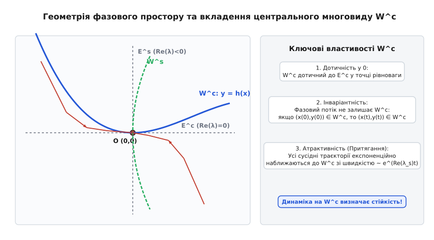
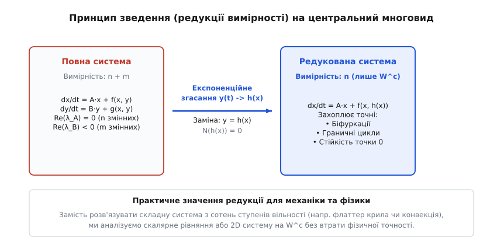
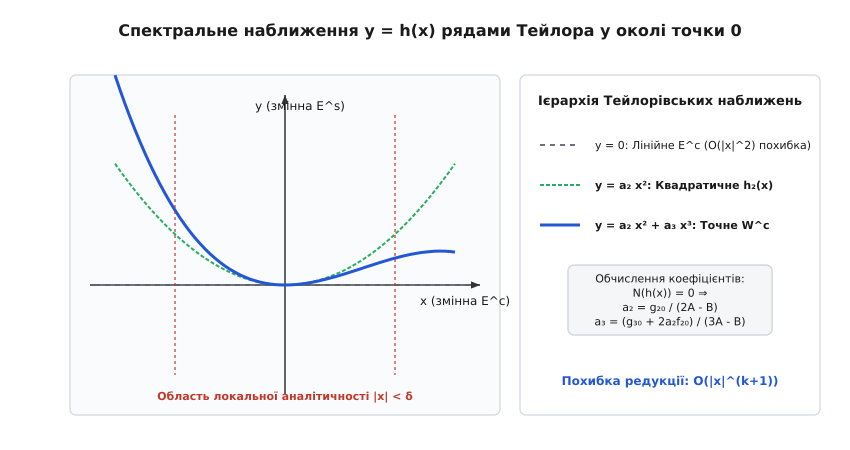

# Теорема про центральний многовид

<preknowlist>
- [Фазовий портрет](book:physics/mechanics/phase-portrait) — геометрична карта динамічних станів системи у просторі узагальнених координат та імпульсів.
- [Матриця Якобі](book:math/jacobian-matrix) — лінеаризація векторного поля у околі точки рівноваги.
- [Власні значення та власні вектори](book:math/eigenvalues) — спектральні характеристики лінійної частини, що визначають тип і стійкість руху.
- [Періодичний подвоєний каскад](book:physics/mechanics/period-doubling-cascade) — зміна якісної структури фазового портрета та втрата стійкості при зміні керуючого параметра.
- [Ряди Тейлора](book:math/taylor-series) — розклад нелінійних функцій у степеневі ряди для локального апроксимування нелінійностей.
</preknowlist>

Коли ми аналізуємо рух реальних складних механічних та фізичних систем — від коливань аерокосмічних конструкцій, бічного коливання мостів під вітровим навантаженням і флаттеру крила літака до турбулентної конвекції у рідинах, коливань плазми чи орбіт космічних апаратів у околі точок Лагранжа — ми майже завжди стикаємося з фундаментальною дилемою вимірності. З одного боку, повна фізична модель реального об'єкта може мати сотні, тисячі або навіть нескінченну кількість ступенів вільності. Розв'язувати таку гігантську систему нелінійних диференціальних рівнянь у повному фазовому просторі надзвичайно важко чисельно, а знайти аналітичний розв'язок — принципово неможливо. З іншого боку, фізична інтуїція підказує: у переважній більшості реальних процесів більшість мод та ступенів вільності є високоенергетичними та швидко згасаючими під дією в'язкості, конструкційного тертя чи дисипації енергії. Уся складна, тривала та найбільш цікава поведінка системи — втрата стійкості, біфуркації, виникнення автоколивань, поява граничних циклів чи перехід до детермінованого хаосу — зосереджується у вузькому підпросторі всього лише кількох «повільних» критичних змінних.

Як математично строго вилучити сотні «швидких» згасаючих мод і побудувати компактну точну модель лише для кількох «повільних» змінних без втрати фізичної точності? Відповідь на це вирішальне запитання дає **теорема про центральний многовид** (Center Manifold Theorem). Вона є наріжним каменем сучасної нелінійної динаміки, якісної теорії диференціальних рівнянь, обчислювальної механіки та теорії керування.

> 🔧 **Навіщо це.**
> Теорема про центральний многовид дозволяє зменшити вимірність складної нелінійної системи з `100` до `1` або `2` рівнянь у околі точки втрати стійкості. Це робить можливим аналітичний розрахунок критичних навантажень на механічні конструкції (наприклад, поріг згинально-крутильного флаттеру крила, розрахунок нелінійного прогину стиснутого стержня або проєктування halo-орбіт космічних апаратів), оцінку амплітуди автоколивань та попередження катастрофічних резонансів без проведення надмірно дорогих обчислювальних експериментів.

---

### Від лінійного спектра до геометричних інваріантних поверхонь

Щоб глибоко зрозуміти геометричну суть центрального многовиду, розглянемо автономну нелінійну систему, стан якої описується вектором узагальнених координат `z ∈ R^(n+m)`:

```
dz/dt = F(z)
```

Припустимо, що точка `z = 0` є точкою рівноваги (стаціонарним станом), тобто `F(0) = 0`. Класичний підхід до аналізу стійкості полягає у лінеаризації системи в околі нуля. Розкладаючи векторне поле `F(z)` у ряд Тейлора, отримаємо:

```
dz/dt = J·z + R(z)
```

де `J = DF(0)` — матриця Якобі розміром `(n+m) × (n+m)`, а `R(z)` містить суто нелінійні доданки другого та вищих порядків, для яких виконуються умови `R(0) = 0` та `DR(0) = 0`.

Поведінка розв'язків лінійного рівняння `dz/dt = J·z` повністю визначається спектром `σ(J)` — сукупністю власних значень `λ` матриці Якобі. У лінійній алгебрі фазовий простір `R^(n+m)` розпадається у пряму суму інваріантних лінійних підпросторів, сформованих власними векторами:

1. **Стійкий підпростір `E^s`**: утворений власними векторами, що відповідають власним значенням із строго від'ємною дійсною частиною (`Re(λ) < 0`). Траєкторії у цьому підпросторі експоненційно наближаються до нуля зі швидкістю `~ exp(Re(λ)·t)`.
2. **Нестійкий підпростір `E^u`**: утворений власними векторами із додатною дійсною частиною (`Re(λ) > 0`). Траєкторії тут експоненційно віддаляються від нуля.
3. **Центральний підпростір `E^c`**: утворений власними векторами з чисто уявними або нульовими власними значеннями (`Re(λ) = 0`). Лінійне рівняння у цьому підпросторі передбачає гармонічні коливання або стаціонарні стани, а амплітуда ні згасає, ні зростає у лінійному наближенні.

У лінійній системі ці підпростори є плоскими (або гіперплоскими) і перетинаються строго у точці рівноваги `z = 0`. Але що відбувається, коли ми повертаємо у систему нелінійні члени `R(z)`?

Нелінійність викривляє плоскі підпростори. Теорема Гробмана-Хартмана стверджує: якщо серед власних значень немає жодного з `Re(λ) = 0` (така точка називається **гіперболічною**), нелінійний фазовий портрет локально повністю еквівалентний лінійному. Однак у фізиці найцікавіші явища — втрата стійкості, біфуркації, виникнення автоколивань — відбуваються саме тоді, коли система проходить через **негіперболічний (критичний) стан**, де частина власних значень має `Re(λ) = 0`.

Чому лінеаризація принципово виявляється безсилою у критичних випадках? Розглянемо найпростіший двовимірний приклад із лінійним центром: `dx/dt = y`, `dy/dt = -x`. Лінійна система передбачає нескінченну родину концентричних еліптичних орбіт (консервативні коливання). Але при включенні найменшої нелінійності `dx/dt = y - a·x³`, `dy/dt = -x - a·y³` картина радикально змінюється: при `a > 0` точка `(0,0)` перетворюється на асимптотично стійкий фокус, а при `a < 0` — на нестійкий фокус. Лінійне наближення взагалі не бачить коефіцієнта `a`. Саме нелінійний розклад на центральному многовиді відкриває справжній знак згасання.

Теорема про центральний многовид стверджує: при включенні нелінійностей лінійні підпростори `E^s`, `E^u` та `E^c` деформуються у гладкі нелінійні інваріантні поверхні — **стійкий багатовид `W^s`**, **нестійкий багатовид `W^u`** та **центральний многовид `W^c`**.


*Геометрія фазового простору у околі негіперболічної точки рівноваги: нелінійний центральний многовид W^c дотикається у точці 0 до лінійного центрального підпростору E^c. Фазові траєкторії експоненційно притягуються до W^c вздовж напрямків стійкого многовиду W^s.*

Як видно з фігури, центральний многовид `W^c` володіє трьома фундаментальними геометричними та фізичними властивостями:

1. **Дотичність у точці рівноваги**: У точці `z = 0` поверхня `W^c` торкається лінійного підпростору `E^c`. Це означає, що перші похідні функції, яка задає многовид, у точці нуль дорівнюють нулю (`h(0) = 0`, `Dh(0) = 0`).
2. **Інваріантність відносно фазового потоку**: Якщо початковий стан системи `z(0)` знаходиться на поверхні `W^c`, то уся подальша фазова траєкторія `z(t)` залишається строго на `W^c` для всіх моментів часу `t`.
3. **Атрактивність (притягання)**: Якщо нестійкий підпростір відсутній (`E^u = {0}`), усі фазові траєкторії, що починаються у близькому околі точки рівноваги, експоненційно швидше западають на центральний многовид зі швидкістю, визначеною найповільнішим зі стійких власних значень `Re(λ_s) < 0`.

Історія формування цих геометричних уявлень охоплює майже століття — від перших критичних випадків Ляпунова та праць київської школи нелінійної механіки Боголюбова й Митропольського до строгих теорем Плісса, Олкеллі та Джека Карра. Докладно про цей драматичний шлях можна прочитати в [історичному екскурсі з виникнення теорії центрального многовиду](book:physics/mechanics/center-manifold-theorem/hist-center-manifold.md).

---

### Принцип зведення (редукції) вимірності та розділення часових масштабів

Завдяки властивості притягання, через короткий проміжок часу `t >> 1/|Re(λ_s)|` будь-які початкові збурення вздовж стійких напрямків повністю згасають. Фазова точка системи «залипає» на поверхню `W^c` і здійснює подальший рух виключно уздовж неї. Отже, довготривала асимптотична поведінка системи повністю визначається динамікою, обмеженою на центральний многовид.

З фізичної точки зору тут відбувається **розділення часових масштабів** (Time-scale separation) та **енергетичне підпорядкування мод**:
- **Швидкий транзитний процес**: експоненційне згасання стійких мод з характерним часом `τ_fast ~ 1/|Re(λ_s)|`. У цей період швидкості мод `y` розсіюють початкову кінетичну енергію збурення через в'язкість та дисипацію;
- **Повільна асимптотична еволюція**: рух вздовж многовиду `W^c` з характерним часом `τ_slow >> τ_fast`. Тут відбувається повільний обмін енергією між нейтральними модами `x` та зовнішнім джерелом енергії (наприклад, аеродинамічним потоком чи стискаючою силою).

Щоб сформулювати цей результат математично, виконаємо лінійне розділення координат. Перейдемо від вектора `z` до нової системи координат `(x, y)`, де:
- `x ∈ Rⁿ` — вектор змінних, що відповідають критичному підпростору `E^c` (`n` змінних);
- `y ∈ Rᵐ` — вектор змінних, що відповідають стійкому підпростору `E^s` (`m` змінних).

У цих координатах вихідна система диференціальних рівнянь приймає канонічний вигляд:

```
dx/dt = A·x + f(x, y)
dy/dt = B·y + g(x, y)
```

де:
- `A` — квадратна матриця `n × n`, увесь спектр якої задовольняє `Re(λ(A)) = 0`;
- `B` — квадратна матриця `m × m`, увесь спектр якої задовольняє `Re(λ(B)) ≤ -γ < 0` (для `γ > 0`);
- `f(x, y)` та `g(x, y)` — нелінійні функції гладкості `C^r`, що починаються з членів другого порядку: `f(0,0)=0`, `Df(0,0)=0`, `g(0,0)=0`, `Dg(0,0)=0`.

Оскільки центральний многовид `W^c` дотичний до підпростору `y = 0` у точці `(0,0)`, локально його можна подати як графік гладкої векторної функції `y = h(x)`:

```
W^c = { (x, y) ∈ Rⁿ × Rᵐ | y = h(x),  h(0) = 0,  Dh(0) = 0 }
```


*Схема принципу редукції: замість інтегрування повної (n+m)-вимірної системи з жорсткими згасаючими модами, вилучення змінної y = h(x) зводить задачу до n-вимірної редукованої системи на W^c.*

Сформулюємо головне твердження **Теореми про редукцію (Принцип редукції Плісса-Шошитаїшвілі)**:

1. **Тотожність стійкості**: Точка рівноваги `(0,0)` повної `(n+m)`-вимірної системи є асимптотично стійкою, нестійкою або нейтральною тоді й лише тоді, коли відповідною властивістю володіє точка `x = 0` для **редукованої `n`-вимірної системи**:

```
dx/dt = A·x + f(x, h(x))
```

2. **Асимптотичне розщеплення розв'язків**: Для довільного розв'язку `(x(t), y(t))` вихідної системи з початковими умовами у околі нуля існує такий розв'язок `x̄(t)` редукованої системи, що при `t → +∞`:

```
x(t) = x̄(t) + O(exp(-γ·t))
y(t) = h(x̄(t)) + O(exp(-γ·t))
```

Цей результат має величезне практичне значення: якщо вихідна система описує механічний пристрій з `100` ступенями вільності, але лише `1` режим знаходиться у критичному стані (`n = 1`), то аналіз стійкості всієї `100`-вимірної системи зводиться до вивчення одного **скалярного диференціального рівняння** `dx/dt = f_red(x)` на одно вимірній кривій `W^c`!

---

### Математичне виведення операторного рівняння N(h(x)) = 0

Виникає фундаментальне запитання: як практично знайти невідому функцію `y = h(x)`, якщо вихідні диференціальні рівняння є нелінійними та не розв'язуються в елементарних функціях?

Для цього скористаємося умовою інваріантності многовиду `W^c`. Оскільки під час руху фазової точки уздовж `W^c` співвідношення `y(t) = h(x(t))` виконується тотожно за часом `t`, продиференціюємо цю рівність за часом `t`, застосувавши багатовимірне ланцюгове правило (Chain Rule):

```
dy/dt = Dh(x) · dx/dt
```

де `Dh(x)` — матриця Якобі (градієнт) функції `h(x)` розміром `m × n`.

Підставимо у ліву та праву частини цієї рівності відповідні праві частини канонічної системи `dx/dt` та `dy/dt`:

```
B·h(x) + g(x, h(x)) = Dh(x) · [ A·x + f(x, h(x)) ]
```

Перенесемо всі доданки в один бік. Отримуємо квазілінійне диференціальне рівняння в частинних похідних відносно невідомого відображення `h(x)`:

```
N(h(x)) ≡ Dh(x) · [ A·x + f(x, h(x)) ] - B·h(x) - g(x, h(x)) = 0
```

Це рівняння називається **диференціальним операторним рівнянням центрального многовиду**. Зауважимо, що воно доповнюється граничними умовами дотичності у точці рівноваги:

```
h(0) = 0
Dh(0) = 0
```

Оскільки точний розв'язок `N(h) = 0` у закритому вигляді знайти зазвичай неможливо, функцію `h(x)` шукають у вигляді наближеного поліноміального розкладу ряду Тейлора у околі точки `x = 0`:

```
h(x) = h₂·x² + h₃·x³ + h₄·x⁴ + ...
```

де `h_k` — тензори коефіцієнтів відповідно другого, третього та вищих ступенів.


*Ієрархія Тейлорівських наближень центрального многовиду: від лінійного підпростору E^c (y = 0) до квадратичної h_2(x) та кубічної h_3(x) апроксимацій. У околі |x| < δ наближення Тейлора з високою точністю збігається з точним нелінійним многовидом W^c.*

Справді фундаментальну роль у практичних застосуваннях відіграє **Теорема про наближення (Джек Карр, 1981)**:

> **Теорема:** Якщо знайдена наближена функція `ϕ(x)` з умовою `ϕ(0)=0`, `Dϕ(0)=0` задовольняє операторне рівняння з залишком порядку `O(|x|^q)`:
> ```
> N(ϕ(x)) = O(|x|^q)    при  x → 0  (для q > 1)
> ```
> то справжній центральний многовид `h(x)` відхиляється від `ϕ(x)` на величину того самого порядку:
> ```
> |h(x) - ϕ(x)| = O(|x|^q)    при  x → 0
> ```
> Більше того, підставка `ϕ(x)` у редуковане векторне поле визначає правильну динаміку з точністю до членів порядку `O(|x|^(q+1))`:
> ```
> dx/dt = A·x + f(x, ϕ(x)) + O(|x|^(q+1))
> ```

Це означає, що для визначення стійкості або типу біфуркації достатньо обчислити лише перші 2–3 коефіцієнти Тейлора! Детальний покроковий алгебраїчний розрахунок з матричними перетвореннями для 3D нелінійної механічної системи наведено у [строгому математичному виведенні операторного рівняння та Тейлорівських наближень](book:physics/mechanics/center-manifold-theorem/math-center-manifold.md).

---

### Метод нормальних форм Пуанкаре та двоетапна спрощення моделей

Центральний многовид здійснює перший критичний крок — він знижує вимірність фазового простору з `n+m` до `n`. Однак редукована система `dx/dt = A·x + f(x, h(x))` усе ще містить громіздкі поліноміальні нелінійності.

Для подальшого спрощення редукованого рівняння використовують **метод нормальних форм Пуанкаре-Дюлака**. Ідея полягає у проведенні нелінійної замін змінних `x = u + P_k(u)` у околі нуля, де `P_k(u)` — поліноми ступеня `k ≥ 2`, підбирані так, щоб знищити якнайбільше «нерезонансних» нелінійних доданків у правій частині.

Член рівняння називається **резонансним**, якщо для його спектрального показника виконується умова резонансу між власними значеннями `λ_i`:

```
λ_i = ∑_{j=1}^{n} α_j · λ_j    при  ∑ α_j ≥ 2
```

Для пари чисто уявних власних значень `λ₁,₂ = ± i·ω₀` (біфуркація Гопфа) єдиними незнищенними резонансними членами у 3-му порядку є доданки вигляду `u₁·|u₁|²`. Саме тому довільна `n`-вимірна нелінійна система у околі біфуркації Гопфа після послідовної редукції на центральний многовид та зведення до нормальної форми Пуанкаре завжди приймає єдину канонічну амплітудну форму:

```
dr/dt = μ·r + d₁·r³
```

Цей двоетапний дует «Центральний многовид + Нормальні форми» є найпотужнішим універсальним алгоритмом дослідження будь-яких нелінійних коливань у фізиці.

---

### Фізичні приклади у механіці, аеропружності, небесній механіці та робототехніці

Розглянемо п'ять фундаментальних фізичних задач, у яких теорема про центральний многовид дає просте аналітичне пояснення складним нелінійним процесам.

#### 1. Нелінійний прогин стиснутого стержня (Біфуркація вилки / Buckling)

Уявімо гнучкий вертикальний стержень під дією поздовжньої стискаючої сили `P`. Стан стержня описується узагальненим бічним прогином `x` (нейтральний режим при критичній силі `P_c`) та швидко згасаючою вертикальною модою `y` (стійкий демпфований режим).

Спрощена модель описується системою диференціальних рівнянь:

```
dx/dt = μ·x - x³ + x·y
dy/dt = -γ·y - x²
```

де `μ` — керівний параметр (відхилення сили від критичного значення `P_c`), а `γ > 0` — високий коефіцієнт в'язкого демпфування (`γ >> 1`).

У цій системі `x` — повільна центральна змінна (при `μ = 0` лінійний член дорівнює нулю), а `y` — швидко згасаюча змінна із від'ємним власним значенням `λ = -γ`.

Знайдемо центральний многовид `y = h(x)`. Застосуємо рівняння `N(h) = 0`:

```
Dh(x)·[ μ·x - x³ + x·h(x) ] - [ -γ·h(x) - x² ] = 0
```

Шукаємо `h(x)` у вигляді квадратичного наближення `h(x) = a₂·x² + O(x³)`. Тоді `Dh(x) = 2·a₂·x`.

Підставимо `h(x)` у рівняння:

```
(2·a₂·x) · [ μ·x - x³ + x·(a₂·x²) ] + γ·(a₂·x²) + x² = 0
```

Згрупуємо члени нижчого порядку при `x²`:

```
2·a₂·μ·x² + γ·a₂·x² + x² + O(x⁴) = 0
```

При критичному значенні параметра `μ = 0` маємо:

```
γ·a₂ + 1 = 0    ⇒    a₂ = -1/γ
```

Отже, центральний многовид має вигляд:

```
h(x) = - (1/γ) · x² + O(x⁴)
```

Підставимо знайдений многовид у диференціальне рівняння для нейтральної змінної `x`:

```
dx/dt = μ·x - x³ + x·( - (1/γ)·x² )
      = μ·x - (1 + 1/γ) · x³ + O(x⁵)
```

**Фізичний висновок:**
Ми отримали класичне рівняння **суперкритичної біфуркації вилки** (Pitchfork bifurcation). Вплив швидко згасаючої моди `y` виявився підпорядкованим (Slaved), і він призвів до **перенормування нелінійної жорсткості**: ефективний коефіцієнт при кубічному члені збільшився з `-1` до `-(1 + 1/γ)`. В'язке демпфування швидкої моди підсилює нелінійну стабілізацію прогину балки після втрати стійкості!

#### 2. Аерокосмічний флаттер крила літака (Біфуркація Андронова-Гопфа)

При польоті літака із високою швидкістю `V` виникає небезпечне явище **аеропружного флаттеру** — вибухове зростання амплітуди зв'язаних згинально-крутильних коливань крила під дією аеродинамічних сил.

У звичайних умовах конструкційне демпфування гасить будь-які випадкові коливання крила. Однак при зростанні швидкості польоту аеродинамічний потік починає накачувати енергію в згинальні та крутильні моди. У математичній моделі це відповідає тому, що одна пара комплексне-спряжених власних значень перетинає уявну вісь при критичній швидкості `V_c`:

```
λ₁,₂ = α(V) ± i·ω(V),    де α(V_c) = 0,  ω(V_c) = ω₀ > 0
```

Усі інші сотні структурних мод мають строго від'ємні дійсні частини `Re(λ_s) ≤ -γ < 0`.

За теоремою про центральний многовид усе розмаїття гідродинамічних мод згортається у **двовимірний центральний многовид `W^c`**, що відповідає цій єдиній критичній парі. Рівняння руху на `W^c` у полярних координатах `(r, θ)` приймає канонічний вигляд нормальної форми біфуркації Гопфа:

```
dr/dt = α(V)·r + d₁·r³
dθ/dt = ω₀ + c₁·r²
```

де `d₁` — перший ляпуновський коефіцієнт, який обчислюється через Тейлорівські коефіцієнти многовиду `h(x)`.
- Якщо `d₁ < 0` (м'який флаттер): при `V > V_c` у системі народжується стійкий **граничний цикл** (амплітуда коливань обмежується величиною `r = √(-α/d₁)`). Літак здійснює безпечні автоколивання без руйнування.
- Якщо `d₁ > 0` (жорсткий флаттер): при наближенні до `V_c` відбувається катастрофічний вибух амплітуди, що призводить до миттєвого руйнування конструкції крила.

Без апарату центрального многовиду визначити знак коефіцієнта `d₁` для реального крила було б неможливо без розв'язання повних рівнянь Нав'є-Стокса.

#### 3. Небесна механіка: Halo-орбіти у околі точок колінеарної лібрації L1/L2

У обмеженій задачі трьох тіл (наприклад, система Сонце-Земля чи Земля-Місяць) існують 5 точок рівноваги — точок Лагранжа `L₁...L₅`. Колінеарні точки `L₁` та `L₂` є нестійкими: лінеаризована матриця Якобі у цих точках має пару власних значень `±λ` (сідловий напрямок) та дві пари чисто уявних власних значень `±i·ω₁` та `±i·ω₂` (центральний підпростір `E^c` вимірності 4).

Нелінійний центральний многовид у околі точки `L₂` є 4-вимірним. На цьому многовиді існують сімейства закритих періодичних та квазіперіодичних орбіт — знамениті **Halo-орбіти** (Halo orbits) та орбіти Ліссажу.

Завдяки побудові аналітичного центрального многовиду вищих порядків (до 19-го порядку ряду Тейлора) інженери NASA та ESA роблять можливим проєктування траєкторій польоту таких космічних обсерваторій, як **James Webb Space Telescope (JWST)** та **SOHO**. Апарат утримується на центральному многовиді у околі нестійкої точки `L₂` з мінімальними витратами палива на корекцію орбіти!

#### 4. Нелінійна робототехніка та нульова динаміка (Zero Dynamics)

У робототехніці та теорії керування нелінійними маніпуляторами виникає задача так званої **нульової динаміки**. Коли зворотним зв'язком вихідна координата робота `y(t)` тотожно утримується у нульовому стані (`y(t) ≡ 0`), внутрішні незамкнені ступені вільності `x` рухаються уздовж інваріантного багатовиду.

Теорема про центральний многовид визначає, чи буде робот зберігати стійкість при виконанні заданої траєкторії, чи внутрішні неокреслені коливання призведуть до перевертання маніпулятора.

#### 5. Гідродинамічна конвекція Ралея-Бенара та модель Лоренца

Коли шар рідини підігрівається знизу, при досягненні критичного числа Ралея `Ra_c` виникають теплові конвекційні осередки (валики Бенара).

У 1963 році Едвард Лоренц, аналізуючи нескінченновимірну систему рівнянь теплової конвекції, за допомогою гармонічного розкладу Фур'є та редукції на центральний многовид вилучив високі просторові гармоніки й звів задачу до знаменитої тривимірної системи Лоренца:

```
dx/dt = σ·(y - x)
dy/dt = r·x - y - x·z
dz/dt = -b·z + x·y
```

Тут зміна `z` (вертикальний профіль температури) володіє високим коефіцієнтом згасання `b > 0`. Застосування теореми про центральний многовид дозволяє подати `z = h(x, y) ≈ (1/b)·x·y` та додатково спростити систему у критичних точках.

---

### Систематичний аналіз біфуркацій на центральному многовиді

Теорема про центральний многовид є головним містком між диференціальними рівняннями та **теорією біфуркацій** (зміною якісної структури фазового портрета при зміні параметрів).

Коли керівний параметр `μ` змінюється, власні значення `λ(μ)` можуть перетинати уявну вісь. Щоб застосувати апарат центрального многовиду до параметричних систем, застосовують так званий **метод розширеного фазового простору**. Параметр `μ` розглядають як додаткову фазову змінну, яка задовольняє тривіальне диференціальне рівняння:

```
dμ/dt = 0
```

Оскільки власне значення для цієї нової змінної тотожно дорівнює нулю (`λ_μ = 0`), змінна `μ` автоматично зараховується до складу центральних змінних!

Розширена система приймає вигляд:

```
dx/dt = A·x + f(x, y, μ)
dμ/dt = 0
dy/dt = B·y + g(x, y, μ)
```

Центральний многовид тепер шукають у вигляді розширеного відображення `y = h(x, μ)`. Розкладаючи `h(x, μ)` у подвійний ряд Тейлора за змінними `x` та `μ`, отримуємо універсальні канонічні нормальні форми для всіх класичних біфуркацій:

| Тип біфуркації | Критичний спектр `E^c` | Рівняння на `W^c` | Фізична інтерпретація у механіці |
| :--- | :---: | :--- | :--- |
| **Сідло-вузол (Saddle-Node)** | `λ = 0` (1D) | `dx/dt = μ - x²` | Злиття та зникнення двох станів рівноваги (перескак) |
| **Транскритична (Transcritical)** | `λ = 0` (1D) | `dx/dt = μ·x - x²` | Обмін стійкістю між двома режимами руху |
| **Вилка (Pitchfork)** | `λ = 0` (1D) | `dx/dt = μ·x ± x³` | Втрата симетрії (поздовжній вигин стиснутої стойки) |
| **Андронова-Гопфа (Hopf)** | `λ = ± i·ω₀` (2D) | `dr/dt = μ·r + d₁·r³` | Народження граничного циклу (автоколивання, флаттер) |
| **Богданова-Такенса (Bogdanov-Takens)** | `λ₁ = λ₂ = 0` (2D) | `dx₁/dt = x₂`, `dx₂/dt = μ₁ + μ₂·x₁ + x₁² + x₁·x₂` | Взаємодія гопфівського та сідлового режимів |

---

### Редукція Гамільтонових та оборотних механічних систем

У консервативній аналітичній механіці диференціальні рівняння руху описуються гамільтоновими системами з функцією Гамільтона `H(q, p)`. Матриця Якобі консервативної системи володіє дзеркальною симетрією спектра: якщо `λ` є власним значенням, то `-λ`, `λ̄` та `-\bar{λ}` також належать спектру.

Особливістю редукції гамільтонових систем на центральний многовид є **збереження канонічної гамільтонової структури**:
- Якщо вихідна фазова система є гамільтоновою з `n+m` ступенями вільності, то її обмеження на парновимірний центральний многовид `W^c` вимірності `2k` є суворо канонічною гамільтоновою системою з редукованим Гамільтоніаном `H_red(q_c, p_c)`.
- Теорема Вайнштейна-Мозера про періодичні орбіти гарантує, що у околі елементарного центрального багатовиду існує принаймні `k` сімейств періодичних траєкторій консервативних коливань.

Аналогічні властивості зберігаються для оборотних систем (Reversible systems), симетричних відносно інволюції інверсії часу `S: (q, p, t) ↦ (q, -p, -t)`.

---

### Центральні многовиди у суцільних середовищах та нескінченновимірних PDE

У фізиці суцільних середовищ (гідродинаміка, теорія пружності, плазма) вихідні рівняння руху є рівняннями у частинних похідних (PDE) — наприклад, рівняння Нав'є-Стокса або рівняння Курамото-Сівашинського. Фазовий простір у цьому випадку є безкінечновимірним банаховим або гільбертовим простором `H`.

Теорема про центральний многовид поширюється на нескінченновимірні параболічні системи за умови виконання **умови спектрального розриву** (Spectral Gap Condition):
- Спектр диференціального оператора `L` складається з скінченного числа `n` критичних власних значень на уявній осі та безкінечної послідовності дискретних власних значений `λ_k → -∞`, розташованих у лівій півплощині;
- Проектор Рісса дозволяє спроектувати нескінченновимірне рівняння у частинних похідних на **скінченновимірний центральний многовид `W^c`** розміру `n`.

Саме це доведення дає математичне обґрунтування того, чому складні гідродинамічні течії рідини при переході до турбулентності можна моделювати маловимірними системами звичайних диференціальних рівнянь.

---

### Чисельна реалізація та обчислювальна ефективність

У сучасних обчислювальних пакетах (наприклад, AUTO, MATCONT чи спеціалізованих C/C++ бібліотеках) обчислення Тейлорівських коефіцієнтів многовиду `h(x)` виконується автоматично.

Чисельний алгоритм включає чотири основні етапи:
1. Автоматичну спектральну розкладку матриці Якобі за допомогою `QR`-алгоритму або SVD-розкладу.
2. Проектування векторного поля на лінійні підпростори `E^c` та `E^s`.
3. Автоматичне розв'язання системи алгебраїчних рівнянь для коефіцієнтів Тейлора `h_k`.
4. Інтегрування редукованої системи методом Рунге-Кутти (RK4) з контролем виходу фазової точки за радіус збіжності Тейлора.

Практичну програмну реалізацію цього алгоритму з паралельним порівнянням повної 2D системи та редукованої 1D моделі детально розібрано у [чисельному алгоритмі редукції та симуляції мовами C та C++](book:physics/mechanics/center-manifold-theorem/proj-center-manifold.md).

Для інтеграції алгоритму у промислові інженерні комплекси розроблено строго типізований програмний інтерфейс. Опис структур даних, функцій створення об'єктів та контрактів пам'яті наведено у [інтерфейсі бібліотеки чисельної редукції libcenter_manifold](book:physics/mechanics/center-manifold-theorem/api-center-manifold.md).

---

### Обмеження, пастки та крайові випадки теореми

Попри всю потужність апарату центрального многовиду, існують суворі математичні обмеження та пастки, про які необхідно пам'ятати при застосуванні теореми:

1. **Неєдиність центрального многовиду далеко від точки рівноваги**:
   На відміну від стійкого `W^s` та нестійкого `W^u` многовидів, які визначаються єдиним чином, центральний многовид `W^c` **взагалі кажучи, не є єдиним** поза точкою рівноваги! Рряд Тейлора задає `W^c` єдиним чином у сенсі формальних степенних рядів, але різні аналітичні поверхні можуть відрізнятися на неаналітичні доданки вигляду `~ exp(-c/x²)`, які мають нульові похідні усіх порядків у точці `x = 0`. На щастя, усі ці різні варіанти `W^c` дають абсолютно однакову асимптотичну динаміку у околі нуля.
2. **Обмежена гладкість (`C^r` проти `C^∞`)**:
   Якщо вихідне векторне поле `F(z)` є нескінченно диференційовним (`C^∞`) або навіть аналітичним (`C^ω`), центральний многовид `W^c` **не обов'язково є нескінченно диференційовним**! Гладкість `W^c` обмежена числом `r`, яке визначається співвідношенням між власними значеннями критичного та стійкого спектрів (так звана умова відсутності резонансів).
3. **Область локальної збіжності рядів**:
   Розклад `h(x)` у ряд Тейлора є строго **локальним**. Якщо фазова точка `x` під дією сильного зовнішнього збурення виходить за межі радіуса збіжності `|x| > δ`, наближений многовид `h_k(x)` перестає відображати реальну фізичну поверхню, що призводить до хибної розбіжності чисельного розрахунку.
4. **Випадок множинних нульових власних значень та резонансів**:
   Якщо матриця `A` має недіагональні жорданові блоки (наприклад, два нульових власних значення з жордановою коміркою розміру `2 × 2`), наближення `h(x)` вимагає застосування спеціального апарату **теорії нормальних форм Богданова-Такенса**.
5. **Наявність нестійкого підпростору (`E^u ≠ {0}`)**:
   Якщо у системі поруч із центральними присутні також нестійкі власні значення (`Re(λ) > 0`), точка рівноваги є завідомо нестійкою. У цій ситуації редукція проводиться на комбінований **центрально-нестійкий многовид `W^(cu)`**, який визначає розгалуження нестійких фазових траєкторій.

Розуміння цих межових випадків дозволяє інженерам та дослідникам грамотно обирати межі застосовності моделей редукції і будувати надійні чисельні симулятори складних фізичних систем.
