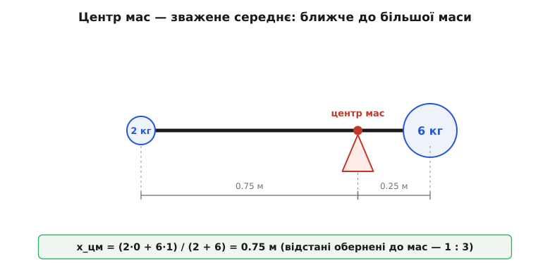
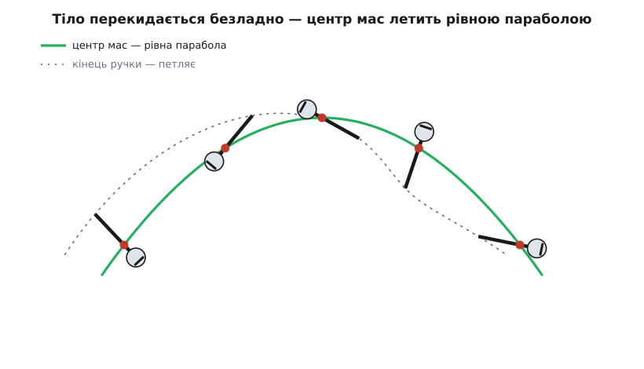
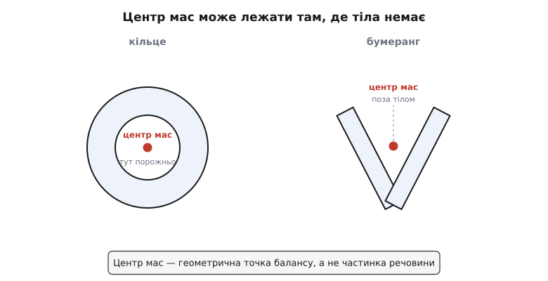

# Центр мас: одна точка за все тіло

<preknowlist>
- [Зважене середнє](book:math/weighted-average) — середнє, у якому кожне значення входить зі своєю «вагою»; центр мас — саме таке середнє положень, зважене масами.
- [Складові вектора](book:math/vector-components) — положення точки як вектор із координатами; центр мас усереднюють по кожній координаті окремо.
- [Маса](book:physics/mass) — міра кількості речовини й інертності тіла; саме нею зважують положення точок.
- [Другий закон Ньютона](book:physics/newtons-second-law) — F = m·a: сила задає прискорення; на ньому тримається головна властивість центра мас.
</preknowlist>

Підкиньте гайковий ключ так, щоб він перевертався в польоті. Кожна його точка виписує в повітрі щось заплутане: кінець ручки петляє великими дугами, губки хитаються туди-сюди, ніщо не летить по-простому. І все ж серед цього безладу ховається одна-єдина точка, яка йде рівнісінькою параболою — так, наче то не ключ перекидається, а хтось кинув звичайний камінець. Ця точка і є **центр мас** (центр — лат. *centrum*, від гр. *kentron*, «вістря, осереддя»).

Оце і є перша, найважливіша причина, чому про центр мас узагалі варто говорити. Тіло складне: мільярди частинок, кожна зі своїм рухом. Але вся ця складність, коли йдеться про рух тіла як цілого, збирається в поведінку однієї точки. Знайти її — означає замінити ціле тіло уявною порошинкою, у якій зосереджена вся його маса, і далі мати справу лише з нею.

### Балансна точка, яку можна зважити

Що це за точка й де вона? Почнімо з найпростішого, що кожен тримав у руках. Візьміть лінійку й спробуйте втримати її на одному пальці. Є рівно одне місце, де вона не перекидається ні в той, ні в той бік, — посередині. Це місце, де тіло **врівноважене**: маса зліва від пальця тягне вниз рівно так само, як маса справа. Оцю балансну точку й називають центром мас.

Тепер причепіть до одного кінця лінійки тягарець. Балансна точка одразу поповзе в його бік: щоб зрівноважити важкий край, палець доводиться підсунути ближче до нього. І тут видно головне правило. Центр мас — не просто геометрична середина; це середина, **зважена масою**. Далека, але легка частина важить у цьому балансі менше, ніж близька й важка. Точнісінько так само, як [зважене середнє](book:math/weighted-average) оцінок: контрольна з вагою 3 тягне підсумок дужче за самостійну з вагою 1.

Запишімо це для двох тягарців на невагомому стрижні. Нехай маси m₁ і m₂ сидять у точках x₁ і x₂. Центр мас лежить у точці

```
x_цм = (m₁·x₁ + m₂·x₂) / (m₁ + m₂)
```

Знизу — уся маса, згори — кожне положення, помножене на «свою» масу. Що більша маса, то дужче вона тягне середнє до себе.

**Задача.** Легка гиря 2 кг і важка 6 кг закріплені на кінцях невагомого стрижня завдовжки 1 м. Де центр мас?

```
Відлік ведемо від легкої гирі:  x₁ = 0,  важка при  x₂ = 1 м.
m₁ = 2 кг,   m₂ = 6 кг

x_цм = (m₁·x₁ + m₂·x₂) / (m₁ + m₂)
     = (2·0 + 6·1) / (2 + 6)
     = 6 / 8
     = 0.75 м
```

Центр мас лежить за 0.75 м від легкої гирі — тобто за 0.25 м від важкої, утричі ближче до неї. І це не випадковість: важка гиря втричі масивніша, тож центр мас утричі ближчий до неї. Плече відстані обернене до маси — саме так балансують шалькові терези.


*Центр мас двох тіл — зважене середнє їхніх положень. Важча гиря 6 кг притягує його до себе: він стоїть за 0.25 м від неї й за 0.75 м від легкої 2 кг, тобто відстані обернені до мас (1:3).*

Для будь-якої кількості точок формула та сама, лише доданків більше: згори підсумовуємо всі m·x, знизу — всю масу. А оскільки положення в просторі — це [вектор](book:math/vector-components) із трьома координатами, те саме роблять окремо по кожній осі: центр мас по x усереднює всі xᵢ, по y — всі yᵢ, по z — всі zᵢ. Тому центр мас — теж точка з трьома координатами, знайдена трьома однаковими зваженими середніми.

### Суцільне тіло: сума стає інтегралом

Реальні тіла — не дві гирі, а суцільна речовина: стрижень, диск, камінь химерної форми. Точок у ньому не перелічити, тож сумувати по одній не вийде. Вихід той самий, що завжди, коли доводиться додавати нескінченно багато нескінченно малих внесків: подумки кришимо тіло на крихітні шматочки масою dm кожен, і сума m·x перетворюється на [інтеграл](book:math/integral) по всій речовині.

```
r_цм = (1/M) · ∫ r dm         M — уся маса тіла
```

За громіздким записом ховається та сама думка про зважене середнє — просто «зважуємо» тепер нескінченно дрібні шматочки. На щастя, брати цей інтеграл щоразу не потрібно: рятує **симетрія**. Якщо тіло симетричне й однорідне, центр мас неминуче лежить на осі симетрії — інакше двом дзеркальним половинам вийшло б різне середнє, а вони однакові. Тому в однорідної кулі, куба, диска, стрижня центр мас — рівно в геометричному центрі, і шукати нічого.

А коли форма несиметрична, працює ще один прийом, простий і потужний: **розбити тіло на прості частини**. Кожну частину замінюємо однією точкою — її власним центром мас із її повною масою, — а тоді беремо зважене середнє вже цих кількох точок, за тією самою формулою, що й для гир. Г-подібну пластину ділимо на два прямокутники, центр кожного відомий (посередині), і центр мас усієї літери — зважене середнє двох центрів. Складне тіло так зводиться до кількох точок, а з ними ми вже впоралися.

### Чому саме ця точка летить просто

Повернімося до ключа, що перекидається в польоті. Чому з усіх його точок саме центр мас іде чистою параболою? Відповідь — найглибше, що є в цій темі, і заради неї варто було все затівати.

На кожну частинку тіла діють сили двох родів. **Зовнішні** — тяжіння Землі, опір повітря, поштовх руки. І **внутрішні** — ті, якими частинки тримаються купи, тягнуть і штовхають одна одну, не даючи тілу розсипатися. Внутрішніх сил безліч, вони складні. Але з ними стається диво: за третім законом Ньютона кожна така сила має рівну й протилежну пару (частинка A тягне B рівно так, як B тягне A). Коли ми підсумовуємо сили по всьому тілу, ці пари гасяться дощенту — усі внутрішні сили в сумі дають нуль. Лишаються тільки зовнішні.

Складімо тепер [другий закон Ньютона](book:physics/newtons-second-law) F = m·a для кожної частинки й додаймо все докупи. Внутрішні сили зникають, а ліворуч лишається сума зовнішніх сил; праворуч — сума всіх m·a, яка, коли розкрити означення центра мас, виявляється рівно M·a_цм. Виходить напрочуд чиста рівність:

```
F_зовн = M · a_цм
```

Прочитаймо її. **Центр мас рухається так, наче вся маса тіла зібрана в ньому, а вся зовнішня сила прикладена просто до нього.** Уся внутрішня метушня — обертання, згини, коливання — на його рух не впливає ніяк. Ось чому ключ у польоті: на нього діє лише тяжіння (опором повітря нехтуємо), тож його центр мас падає точнісінько як вільна порошинка — по параболі, — байдуже, як шалено перекидається сам ключ. Те, як тіло крутиться, — окрема історія; те, куди його несе, вирішує сама лише зовнішня сила, прикладена до центра мас. [Повне виведення цієї теореми](book:physics/center-of-mass/math-com-theorem.md) — від підсумовування F = m·a до того, як гасяться внутрішні сили, — варте окремого погляду.


*Кинутий ключ перевертається в польоті: будь-яка його точка (наприклад, кінець ручки) виписує заплутану хвилясту криву. А центр мас іде чистою параболою — так, наче вся маса зібрана в ньому й на неї діє лише тяжіння.*

> 🔧 **Навіщо це.** Уся звична фізика «матеріальної точки» тримається на цій теоремі. Коли ми рахуємо політ снаряда, орбіту планети чи гальмівний шлях авто, ми мовчки замінюємо ціле тіло його центром мас — і маємо право, бо він рухається саме як точка з усією масою. Гімнаст у сальто, стрибун у воду, кіт, що перевертається в падінні, — усі крутяться навколо власного центра мас, поки той летить незворушною параболою. А ще звідси випливає, що повний імпульс тіла дорівнює [імпульсу](book:physics/momentum) однієї точки — усієї маси, що рухається зі швидкістю центра мас: тому й кажуть, що центр мас «несе» рух системи.

### Точка, якої може не бути в тілі

Досі центр мас зручно було уявляти десь усередині тіла. Здебільшого так і є — але не завжди, і саме тут проста картинка тріщить.

Візьміть кільце — бублик, обручку, кермо. Речовина є лише по обводу, а центр мас, за симетрією, лежить рівно посередині — у порожній дірці, де матеріалу немає взагалі. Те саме з бумерангом: його центр мас висить у повітрі коло вигину, поза деревом. Центр мас — не частинка тіла й не мітка на ньому; це геометрична точка, вирахувана з розкладу маси, і вона цілком може опинитися там, де тіла нема.


*Центр мас не мусить лежати в речовині. У кільця він — у порожній дірці посередині; у бумеранга — у повітрі коло вигину. Це геометрична точка балансу, а не частинка тіла.*

Цей на позір абстрактний факт має цілком тілесний наслідок — і його щодня використовують стрибуни у висоту. Сучасна техніка стрибка, «фосбері-флоп» (за ім'ям Діка Фосбері, що приголомшив нею Олімпіаду 1968 року), полягає в тому, щоб перекидатися через планку спиною, вигнувшись дугою. У глибокому прогині тіло стає підковою — і його центр мас виходить назовні, під спину, у порожнечу. Тоді тіло переливається через планку **згори**, а центр мас проходить **під** нею. Спортсменові треба підняти свій центр мас нижче, ніж якби він перестрибував «цілим», — а отже, витратити менше сили на ту саму висоту. Вигнута підкова хитрує з тим, чого немає в її речовині.

> 🔧 **Навіщо це.** Де сидить центр мас — питання життя і смерті в техніці. Гоночне авто роблять присадкуватим, а важкі акумулятори кладуть у самий низ, щоб центр мас був низько: що він нижчий, то важче машину перекинути в повороті. Ракету, кран, навантажений корабель балансують за тим самим — тримати центр мас там, де він не завалить конструкцію. Порахувати його для складної машини — звичайна інженерна задача, і [роблять це в коді](book:physics/center-of-mass/proj-polygon-centroid.md): центр мас набору деталей чи центроїд плаского контуру.

### Центр мас і центр ваги — коли вони розходяться

Часто чують іще й «центр ваги» — і плутають його з центром мас. Різниця тонка, але справжня. Центр мас — це про **розклад речовини**: де зосереджена маса, байдуже, чи є взагалі тяжіння. Центр ваги — це про **розклад сили тяжіння**: точка, до якої можна прикласти сумарну вагу тіла.

Поки тяжіння однакове по всьому тілу — а на масштабах кімнати чи літака воно однакове, — обидві точки збігаються тютелька в тютельку, тож у побуті їх і не розрізняють. Розходяться вони лише там, де тяжіння помітно різне для різних частин тіла: у величезних об'єктів у полі, що спадає з відстанню. Далекий від Землі край довгого супутника тягне слабше, ніж ближній, тож його центр ваги ледь зміщений від центра мас до Землі — і ця крихітна різниця, наростаючи, поволі повертає супутник тим самим боком до планети.

Для системи ж окремих тіл — скажімо, планети з супутником — спільний центр мас має власне ім'я: **баріцентр** (гр. *barys*, «важкий», + *kentron*, «центр»). І він не завжди там, де очікуєш. Народження цього поняття — від Архімеда, що першим строго знайшов центри ваги фігур, до Ньютона, який ужив спільний центр для Землі й Місяця, — [окрема історія](book:physics/center-of-mass/hist-barycenter.md).

**Задача.** Маса Землі 5.97×10²⁴ кг, Місяця — 7.35×10²² кг, відстань між їхніми центрами 384 400 км. Де спільний центр мас — баріцентр?

```
Відлік — від центра Землі (x = 0), Місяць при  x = d.
Земля стоїть у нулі, тож у чисельнику лишається тільки внесок Місяця:

x_цм = m_міс·d / (m_Зем + m_міс)
     = (7.35×10²² · 384 400) / (5.97×10²⁴ + 7.35×10²²)
     = 2.825×10²⁸ / 6.04×10²⁴
     ≈ 4670 км
```

Радіус Землі — 6371 км. Отже, баріцентр системи Земля–Місяць лежить **усередині Землі**, десь за 1700 км під поверхнею. Місяць не крутиться навколо нерухомої Землі — обидва тіла обертаються навколо цієї спільної точки, тільки вона захована в земних надрах, тож Землі це відлунює лиш легким помісячним похитуванням.

### Одна ідея, що зшиває все

Пройдений шлях був короткий, а зайшли ми далеко. Почалося з балансу лінійки на пальці — і та сама зважена масою середина виявилася точкою, у якій можна зібрати ціле тіло: для двох гир, для незліченних частинок суцільної речовини, для планети з супутником. Знайшли ми її однією й тією самою дією — зваженим по масі середнім положень, — байдуже, стрижень то, диск чи бумеранг.

А тоді проста балансна точка обернулася чимось значно більшим. Виявилося, що вона рухається так, наче вся маса тіла зібрана в ній, а вся зовнішня сила прикладена просто до неї, — і жодна внутрішня метушня цьому не завадить. Саме тому ми маємо повне право звати планету точкою, снаряд — точкою, машину — точкою: кожне з цих тіл справді має точку, що несе за нього весь його рух. Центр мас — це те, як складне тіло погоджується вдавати з себе просту порошинку.
