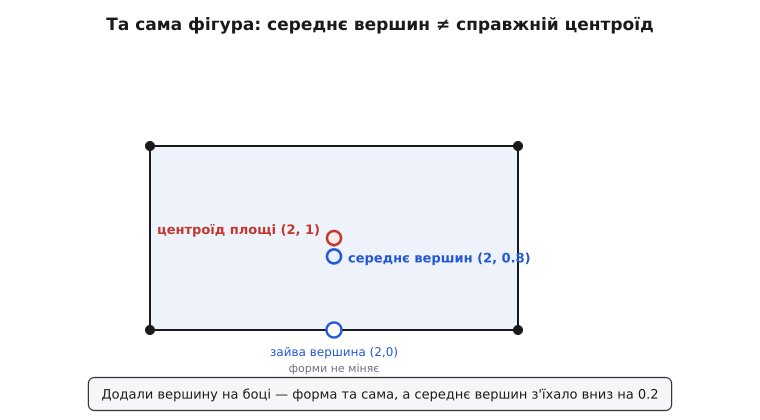
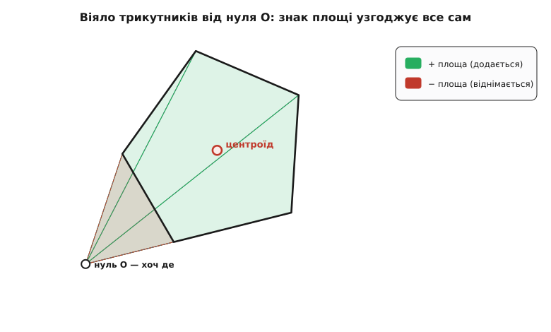

# ⚙️ Центр мас у коді: набір точок і контур многокутника

Дві задачі, що виглядають як одна. Перша: маєш складену конструкцію — мотор, батарея, плата на кронштейні, кожне зі своєю масою й місцем, — і треба точку, у якій вона врівноважиться, щоб знати, куди чіпляти підвіс і чи не перекине її на віражі. Друга: маєш плаский контур — обвід деталі з креслення, слід опори робота на підлозі, силует спрайта в грі — і треба його геометричний центр, щоб поставити туди мітку, вісь обертання чи перевірити стійкість.

Обидві — про те саме: згорнути ціле в одну точку. Обидві — кілька рядків коду. Але друга ховає пастку, у яку майже кожен падає рівно один раз у житті, і код, який здається очевидним, дає **неправильну** відповідь на найпростіших формах. Розберімо обидві до кінця — спершу легку, тоді підступну.

## Набір матеріальних точок: пряме зважене середнє

Тут нема чого хитрувати. Центр мас набору точок — це середнє їхніх положень, зважене масами: кожну координату множимо на «свою» масу, додаємо, ділимо на всю масу.

```
r_цм = (Σ mᵢ·rᵢ) / (Σ mᵢ)      окремо по кожній осі
```

Практично це один прохід: накопичуємо зважену суму положень і сумарну масу, а ділимо один раз наприкінці. Розмірність байдужа — той самий цикл працює для площини й для простору, бо кожна вісь усереднюється незалежно.

:::tabs
```py
def center_of_mass(masses, positions):
    """masses[i] — маса i-ї точки; positions[i] — її координати (кортеж
    будь-якої вимірності). Повертає центр мас як кортеж тієї самої вимірності."""
    total = 0.0
    acc = [0.0] * len(positions[0])
    for m, p in zip(masses, positions):
        total += m
        for k, coord in enumerate(p):
            acc[k] += m * coord               # накопичуємо mᵢ·rᵢ по осях
    if total == 0.0:
        raise ValueError("сумарна маса нульова")
    return tuple(a / total for a in acc)      # ділимо один раз наприкінці
```
```cpp
#include <vector>
#include <stdexcept>

struct Vec3 { double x{}, y{}, z{}; };

Vec3 center_of_mass(const std::vector<double>& mass,
                    const std::vector<Vec3>& pos) {
    double total = 0.0;
    Vec3 acc;                                   // {0, 0, 0}
    for (std::size_t i = 0; i < mass.size(); ++i) {
        total += mass[i];
        acc.x += mass[i] * pos[i].x;            // накопичуємо mᵢ·rᵢ
        acc.y += mass[i] * pos[i].y;
        acc.z += mass[i] * pos[i].z;
    }
    if (total == 0.0) throw std::invalid_argument("сумарна маса нульова");
    return { acc.x / total, acc.y / total, acc.z / total };
}
```
:::

**Приклад: кронштейн із трьох деталей.** Мотор 250 г, батарея 400 г і плата 80 г закріплені у площині (координати в міліметрах від кута рами).

```
маси (г):    m = [ 250,      400,       80 ]
точки (мм):  r = [ (120, 0), (−40, 10), (0, 60) ]
M = 250 + 400 + 80 = 730 г

x_цм = (250·120 + 400·(−40) + 80·0) / 730 = (30000 − 16000) / 730 = 14000/730 ≈ 19.2 мм
y_цм = (250·0 + 400·10  + 80·60) / 730 = (4000 + 4800)      / 730 =  8800/730 ≈ 12.1 мм
→  центр мас ≈ (19.2, 12.1) мм
```

Важка батарея, хоч і сидить у мінусі по x, перетягла середнє далеко ліворуч від легкого мотора; плата трохи підняла його вгору. Код — рівно ця арифметика, тільки в циклі. Складність — лінійна, O(n): один погляд на кожну точку. Єдина осторога, крім нульової маси: накопичувати суму треба **до** ділення, а не ділити щокрок, — інакше без потреби множаться похибки округлення. Тут пастки нема; вона починається, коли точок стає нескінченно багато, а тіло — суцільним.

## Контур многокутника: чому середнє вершин бреше

Плаский многокутник заданий вершинами — списком точок обводу. Спокуса очевидна: центр — це ж, певно, середнє вершин? Беремо ті самі точки з попередньої функції, кладемо всім масу 1, усереднюємо. Коротко, знайомо — і **неправильно**.

Ось найчистіший доказ, що це не дрібна неточність, а хибна ідея. Візьмімо прямокутник 4×2 з вершинами (0,0), (4,0), (4,2), (0,2). Його центр очевидний — (2, 1), і середнє чотирьох вершин теж дає (2, 1). Згода. Тепер додаймо **одну зайву вершину** посеред нижнього боку, у точці (2,0). Форма не змінилася ні на йоту — це той самий прямокутник, просто на нижньому ребрі тепер позначено три точки замість двох. А середнє вершин поїхало:

```
вершини:  (0,0) (2,0) (4,0) (4,2) (0,2)      ← зайва (2,0) на нижньому боці
x̄ = (0 + 2 + 4 + 4 + 0) / 5 = 10/5 = 2.0
ȳ = (0 + 0 + 0 + 2 + 2) / 5 =  4/5 = 0.8      ← з'їхало вниз, хоч фігура та сама!
```

Форма не змінилася, а «центр» стрибнув із y = 1.0 на y = 0.8. Це вже не наближення — це вимірювання не того. Середнє вершин рахує **середній кут**: воно зважує кути порівну й тягнеться туди, де їх більше. А многокутник — це не кути, це **залита площа**; вершини ж узагалі довільні, їх можна насипати скільки завгодно на будь-якому ребрі, не змінивши форми. Тому середнє вершин у принципі не може дати центр площі — воно відповідає на інше питання.


*Та сама фігура, одна зайва вершина на ребрі — і середнє вершин падає з y = 1.0 на 0.8, бо воно зважує кути, а не площу. Центроїд площі стоїть непорушно там, де й має, — у (2, 1).*

Підступність у тому, що на **трикутнику** середнє вершин випадково збігається зі справжнім центром — центроїд трикутника і є середнє трьох його вершин. Саме тому міф живучий: перевіриш на трикутнику, «працює», і понесеш далі. А на першому ж чотирикутнику з нерівномірними вершинами — розсипається.

## Звідки береться правильна формула

Щоб знайти центр залитої площі, треба її й усереднювати — по площі, а не по кутах. Прийом той самий, яким беруть центр мас будь-якого складного тіла: **розбити на прості шматки, у кожного центр відомий, і взяти зважене середнє цих центрів**. Найзручніший шматок — трикутник, бо його центроїд — просто середнє трьох вершин, а площу легко порахувати.

Розкраюємо многокутник на трикутники **віялом**: беремо якийсь опорний нуль O і для кожного ребра Pᵢ→Pᵢ₊₁ будуємо трикутник O-Pᵢ-Pᵢ₊₁. У кожного:

```
центроїд:      Gᵢ = (O + Pᵢ + Pᵢ₊₁) / 3
знакова площа: Aᵢ = ½·(Pᵢ − O) × (Pᵢ₊₁ − O)
```

Ключове слово — **знакова**. Величина (Pᵢ − O) × (Pᵢ₊₁ − O) — це [векторний добуток](book:math/cross-product) двох сторін трикутника, а він дорівнює орієнтованій площі паралелограма на них: додатний, якщо обхід O→Pᵢ→Pᵢ₊₁ іде проти годинникової, від'ємний — якщо за. У координатах він згортається в один вираз, який і є серцем усього:

```
cᵢ = (xᵢ − x_O)·(yᵢ₊₁ − y_O) − (xᵢ₊₁ − x_O)·(yᵢ − y_O)      Aᵢ = cᵢ/2
```

Тепер зважуємо центроїди трикутників їхніми знаковими площами й ділимо на суму площ. Поставмо нуль O у початок координат (тоді x_O = y_O = 0, і cᵢ = xᵢ·yᵢ₊₁ − xᵢ₊₁·yᵢ) — і формула згортається в те, що звуть **формулою шнурівки** (за навхрест перемноженими координатами, як шнурки):

```
A  = ½ · Σ cᵢ                          повна знакова площа
C_x = 1/(6A) · Σ (xᵢ + xᵢ₊₁)·cᵢ
C_y = 1/(6A) · Σ (yᵢ + yᵢ₊₁)·cᵢ
```

І ось де диво знакової площі, заради якого все затівалось: **нуль O можна ставити хоч де** — у центрі фігури, у кутку, ба навіть далеко поза нею, — а відповідь виходить та сама. Причина фізична, не алгебраїчна. Уяви, що радіус-вектор із O повзе вздовж обводу; кожен трикутник — це клаптик площі, яку цей вектор замітає. Для опуклої фігури з нулем усередині всі клапті додатні й вкривають її раз. Але щойно нуль виходить назовні або фігура ввігнута, вектор частину площі замітає **вперед**, а частину — **назад**; «задні» трикутники отримують від'ємний знак і рівно віднімають зайве, що вимело «переднє». У підсумку залишається точно внутрішність многокутника, вкрита один раз. Знак сам веде бухгалтерію перекриттів — і тому байдуже, звідки віяло.


*Нуль O узято зумисне поза фігурою. Три дальні трикутники замітають додатну площу, ближній — від'ємну; вона віднімає те, що O «намело» повз фігуру. Сума знакових площ дає рівно площу п'ятикутника, а зважений центроїд — його справжній центр, хоч віяло й почалося ззовні.*

Ця формула стара й носить кілька імен — **формула шнурівки**, **формула землеміра**, **Ґауссова формула площі**. Історично її описав німецький математик Альбрехт Людвіґ Фрідріх Майстер (Meister) ще 1769 року; поширеною ж вона стала під іменем Карла Фрідріха Ґаусса, якому її приписав перекладач у примітці 1810 року, — Ґаусс і сам згодом визнавав першість Майстрової ідеї. Тож «Ґауссова» тут — данина тому, хто популяризував, а не першовідкривачу; це усталений, документований випадок звичного зсуву в назвах.

## Робочий код центроїда

Уся формула — це один прохід по ребрах із трьома накопичувачами: подвоєна площа й дві незважені суми чисельника. Ділимо наприкінці. Знак площі лишаємо як є — він ще стане в пригоді.

:::tabs
```py
def polygon_centroid(pts):
    """pts — вершини простого контуру за порядком обходу (за чи проти
    годинникової — байдуже). Повертає (центроїд, знакова площа).
    Це НЕ середнє вершин: зважуємо площею, а не рахуємо кути."""
    n = len(pts)
    a2 = cx = cy = 0.0                       # a2 — подвоєна знакова площа (2A)
    for i in range(n):
        x0, y0 = pts[i]
        x1, y1 = pts[(i + 1) % n]            # наступна вершина, обвід замкнено
        cross = x0 * y1 - x1 * y0            # 2·площа трикутника O-Pᵢ-Pᵢ₊₁
        a2 += cross
        cx += (x0 + x1) * cross
        cy += (y0 + y1) * cross
    if a2 == 0.0:
        raise ValueError("вироджений контур: нульова площа")
    return (cx / (3.0 * a2), cy / (3.0 * a2)), a2 / 2.0
```
```cpp
#include <vector>
#include <stdexcept>

struct Vec2 { double x{}, y{}; };
struct Centroid { Vec2 c; double area; };    // area — знакова

Centroid polygon_centroid(const std::vector<Vec2>& p) {
    const std::size_t n = p.size();
    double a2 = 0.0, cx = 0.0, cy = 0.0;      // a2 = 2·(знакова площа)
    for (std::size_t i = 0; i < n; ++i) {
        const Vec2& a = p[i];
        const Vec2& b = p[(i + 1) % n];       // наступна вершина (обвід замкнено)
        const double cross = a.x * b.y - b.x * a.y;
        a2 += cross;
        cx += (a.x + b.x) * cross;
        cy += (a.y + b.y) * cross;
    }
    if (a2 == 0.0) throw std::invalid_argument("вироджений контур: нульова площа");
    return { { cx / (3.0 * a2), cy / (3.0 * a2) }, a2 / 2.0 };
}
```
:::

Зверни увагу на `(i + 1) % n`: остання вершина замикається на першу, тож ребро P_{n−1}→P₀ теж рахується — контур має бути циклом. Прогонимо той самий підступний прямокутник із зайвою вершиною, на якому спіткнулося середнє:

```
контур (проти годинникової):  (0,0) (2,0) (4,0) (4,2) (0,2)

cᵢ = xᵢ·yᵢ₊₁ − xᵢ₊₁·yᵢ:   0,  0,  8,  8,  0        Σcᵢ = 16  →  A = 8
cx = Σ(xᵢ+xᵢ₊₁)·cᵢ = (4+4)·8 + (4+0)·8 = 64 + 32 = 96
cy = Σ(yᵢ+yᵢ₊₁)·cᵢ = (0+2)·8 + (2+2)·8 = 16 + 32 = 48
центроїд = (96/(3·16), 48/(3·16)) = (2.0, 1.0)     площа = 8 ✓
```

Тепер — (2, 1), як і має бути, незворушно до зайвої вершини: cᵢ на пласких ребрах (0,0)→(2,0) і (2,0)→(4,0) вийшли нульові, тож зайва точка нічого не додала. Формула зважує площею, а порожнє ребро площі не несе — тому й не піддається на «накидані» вершини, від яких розсипалось наївне середнє.

## Складність і пастки

Обидва алгоритми — один прохід, O(n), без пам'яті понад кілька накопичувачів. Уся тонкість не в швидкості, а в тому, що легко переплутати чи проґавити.

**Напрям обходу — і орієнтація задарма.** Оберни порядок вершин — і знакова площа поміняє знак: за годинниковою вона від'ємна, проти — додатна. Центроїд від цього **не залежить**: у чисельнику й знаменнику знак скорочується, координати виходять ті самі. Тобто функція чесно працює на будь-якому напрямі — а на додачу **знак площі безкоштовно каже орієнтацію контуру**. Це не дрібниця: у графіці ним відрізняють зовнішній обвід від дірки, у геометрії — правильно зшивають межі.

**Вироджений контур.** Якщо всі вершини на одній прямій (або їх менше трьох), площа нульова, і поділ на 3·a2 вибухне. Тому перевірка `a2 == 0` — не косметика, а сторож: нульова площа означає, що центроїда площі просто не існує, і чесніше кинути помилку, ніж повернути нескінченність.

**Точність далеко від нуля.** Координати з карт чи САПР бувають величезні — сотні тисяч метрів, — а сама деталь крихітна. Тоді добутки xᵢ·yᵢ₊₁ — це різниця двох близьких великих чисел, і в ній тоне точність (катастрофічне скорочення). Ліки в один рядок: **перенести нуль до контуру** — відняти першу вершину від усіх, порахувати, а зсув додати назад. Центроїд зсувається рівно на той самий вектор, а знакова площа взагалі не залежить від зсуву, тож результат точний, зате арифметика ведеться біля нуля:

```py
ox, oy = pts[0]                              # локальний нуль коло контуру
# ...усередині циклу віднімаємо (ox, oy) від кожної вершини...
x0, y0 = pts[i][0] - ox,           pts[i][1] - oy
x1, y1 = pts[(i + 1) % n][0] - ox, pts[(i + 1) % n][1] - oy
# ...а наприкінці додаємо зсув назад:
return (cx / (3.0 * a2) + ox, cy / (3.0 * a2) + oy), a2 / 2.0
```

**Дірки.** Многокутник із отвором (кільце, шайба, літера «О») рахується без нового коду — завдяки знаку. Зовнішній обвід обходимо в один бік, кожну дірку — у **протилежний**, і зсипаємо їхні внески в ті самі накопичувачі a2, cx, cy. Дірка, обійдена навпаки, дає від'ємну площу й сама віднімається — рівно як від'ємні трикутники у віялі. Один поділ наприкінці — і центроїд фігури з дірками готовий.

**Складний (самоперетинний) контур.** Якщо ребра перетинаються, формула все одно поверне число, але це вже не наївний центр «залитого силуету»: ділянки, накриті двічі, порахуються двічі, зі своїм знаком. Для **простих** (без самоперетинів) контурів формула точна — а перед подачею варто впевнитися, що контур таки простий.

**Площа — ще не маса.** Центроїд площі дорівнює центру мас лише для **однорідної** пластини сталої товщини. Якщо густина чи товщина плавають по фігурі, площа бреше так само, як бреши середнє вершин: тоді вертаємось до зваженої суми — кришимо тіло на шматочки й зважуємо кожен його масою, як у першій частині.

Куди це все йде. У **графіці** центроїдом ставлять підпис усередину країни на мапі, беруть вісь обертання спрайта, рахують баланс UV-острівця. У **робототехніці** проєкція центра мас мусить лишатися всередині опорного многокутника (слід стоп чи коліс) — вийде за нього, і апарат перекинеться; той самий центроїд площі дає точку хапання пласкої деталі маніпулятором. У **фізичних рушіях** кожне тверде тіло зводять до центра мас і [моменту інерції](book:physics/moment-of-inertia) навколо нього — без коректного центроїда контуру обертання гри виглядало б неприродно. А в **інженерному розрахунку** центр ваги перерізу балки чи складеної конструкції — це та сама формула шнурівки, від якої залежить, чи витримає вузол і чи не завалиться на бік складена машина.

## Що винести

Дві задачі, спільна ідея — зважене середнє положень, — але різна ціна помилки. Для набору точок усе прозоро: множимо на маси, додаємо, ділимо, один прохід. Для контуру очевидне «середнє вершин» **неправильне** в корені: воно рахує середній кут, тоді як центр фігури — це середнє **площі**, а вершини на ребрах довільні. Формула шнурівки, народжена з розкрою на трикутники зі **знаковою** площею, робить це чесно — і дарма що виглядає громіздко, вона того самого роду, що й баланс двох гир на стрижні. На додачу знак площі безкоштовно віддає орієнтацію й дозволяє вирізати дірки тим самим циклом. Стережися лише трьох речей: нульової площі (вироджений контур), великих координат (перенеси нуль до фігури) і мовчазного припущення однорідності (центроїд площі — це центр мас **тільки** для рівномірної пластини).
