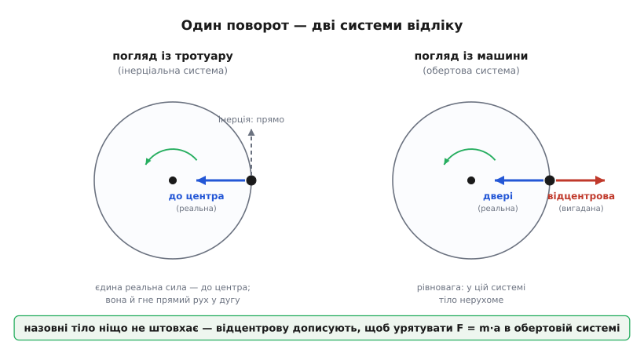
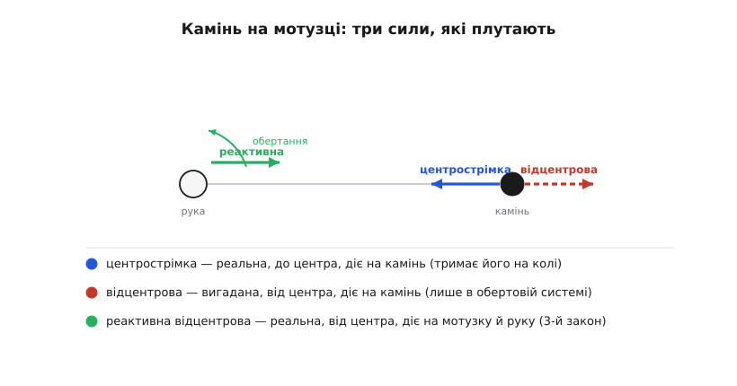
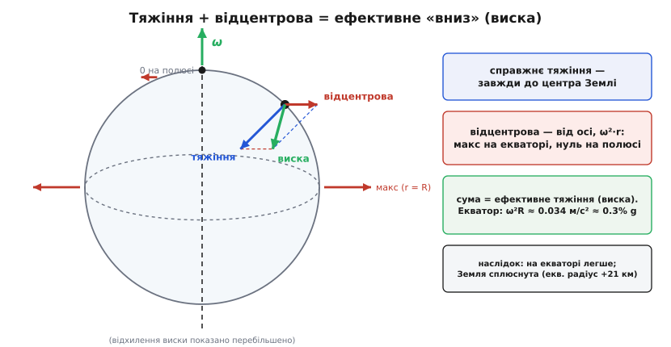

# Відцентрова сила: чому вас притискає до дверей, хоча ніхто не штовхає

<preknowlist>
- [Інерціальна система відліку](book:physics/inertial-frame) — «спокійна», неприскорена система, де F = m·a діє без домальованих сил; обертова система не така, і саме в ній оживають інерційні сили.
- [Центрострімке прискорення](book:physics/centripetal-acceleration) — щоб тіло йшло по колу, його треба весь час прискорювати до центра: a = v²/r = ω²·r. Без цієї внутрішньої тяги руху по колу не буває.
- [Кутова швидкість](book:physics/angular-velocity) — ω як темп обертання (рад/с) і вектор уздовж осі; величина відцентрової сили росте з ω у квадраті.
- [Другий закон Ньютона](book:physics/newtons-second-law) — F = m·a; саме його ми рятуємо, коли дописуємо відцентрову силу в обертовій системі.
</preknowlist>

Ви їдете в машині, і водій круто заходить у поворот ліворуч. Вас негайно притискає до правих дверей — так, наче хтось невидимий штовхає вас назовні, геть від центра повороту. Відчуття цілком тілесне: плече тисне на двері, на різкій дузі хочеться вхопитися за ручку, щоб не завалитися. Кожен назве винуватця — **відцентрова сила** (від лат. *centrum* — осереддя, та *fugere* — тікати: сила, що жене від центра). Назва наче й описує пережите: щось відкидає вас від осі повороту.

Отут і ховається найкрасивіша пастка в усій механіці. Придивімося, хто ж насправді на вас діє, — і виявиться, що назовні вас ніхто не штовхає. Сила, яку ви так виразно відчуваєте, у певному сенсі не існує. А відчуття — цілком реальне. Розплутати цей вузол і означає зрозуміти відцентрову силу.

### Хто насправді на вас діє

Погляньмо на вас очима перехожого на тротуарі — того, хто стоїть на землі й нікуди не повертає. Поки машина їхала прямо, ви рухалися прямо разом із нею. Коли машина звертає ліворуч, ваше тіло за [першим законом Ньютона](book:physics/newtons-first-law) хоче й далі летіти прямо — рівно туди, куди летіло. Але машина під вами вивертає ліворуч, і праві двері насуваються на вас збоку. За мить вони впираються вам у плече й починають штовхати вас усередину повороту — вліво, до центра дуги. Оце єдина справжня горизонтальна сила, що на вас діє: двері тиснуть вас **до центра**, а не від нього. Саме вона й загинає ваш шлях у дугу, змушуючи вас — попри інерцію — повертати разом із машиною.

Тобто картина рівно протилежна відчуттю. Вас нікуди не відкидає назовні — навпаки, вас силоміць затягують усередину. А «притиск» до дверей — це просто те, як ваше тіло, що поривається летіти прямо, налягає на перепону, яка стала на його прямій дорозі. Це та сама причина, чому [центрострімке прискорення](book:physics/centripetal-acceleration) завжди спрямоване до центра: рух по колу — це безперервне падіння всередину, і хтось мусить це падіння забезпечувати. У повороті — двері й сидіння; на орбіті — тяжіння; для каменя на мотузці — натяг мотузки.

> 🔧 **Навіщо це.** Інженер, що проєктує дорогу чи гоночний трек, мусить наперед забезпечити цю внутрішню силу — інакше авто просто поїде прямо, тобто зісковзне назовні з повороту. На рівній дорозі внутрішню тягу дає тертя шин; коли його бракне — лід, пісок, надто велика швидкість, — тримати нема чим, і машину «виносить» назовні по дотичній. Саме тому круті повороти й велотреки роблять із нахилом усередину: похилена дорога підставляє частину сили своєї реакції на потрібну внутрішню тягу, і поворот тримає навіть на слизькому.

### Звідки ж тоді береться сама відцентрова сила

Якщо назовні ніхто не штовхає, звідки взялася сама «відцентрова сила»? Вона народжується тієї миті, коли ви беретесь описувати рух **із самої машини** — із системи відліку, що повертає разом із вами.

Сидячи в машині, ви стосовно неї нерухомі — не з'їжджаєте по сидінню ні вперед, ні назад. Отже, у вашій власній системі ваше прискорення дорівнює нулю. Але справжня сила на вас діє — двері реально тиснуть вас усередину. Спробуйте докласти сюди [F = m·a](book:physics/newtons-second-law): прискорення нульове, тож і сума сил має бути нульова, — а вона не нульова, бо двері штовхають. Рахунок не сходиться.

Щоб урятувати улюблену формулу, доводиться дописати праворуч ще одну силу — рівно таку, щоб вона зрівноважила натиск дверей. Вона мусить дивитися **назовні** (проти дверей) і мати саме таку величину, щоб сума вийшла нуль. Оце і є відцентрова сила. Джерела вона не має — жодне тіло вас нею не штовхає; це чесна плата за право сидіти в обертовій системі й далі користуватися законами Ньютона так, ніби ви нерухомі в спокійному світі. Такі дописані доданки звуть [інерційними, або фіктивними, силами](book:physics/inertial-frame): вони виникають не від взаємодії двох тіл, а лише від того, що ваша система відліку сама крутиться.

Тепер видно, чому відчуття вас не обманює й водночас обманює. Притиск до дверей — реальний: це двері тиснуть вас усередину, а ви за третім законом тиснете на них у відповідь. А от «сила, що жене вас назовні» — вигадана: ви домалювали її самі, щоб пояснити, чому сидите нерухомо, хоч вас тягне всередину. Вийдіть із машини на тротуар, зійдіть із каруселі на землю — і відцентрова сила зникне без сліду, бо її ніколи й не було, крім як у вашому виборі системи відліку.


*Один і той самий поворот із двох систем відліку. Ліворуч, із нерухомого тротуару (інерціальна система): на тіло діє лише одна справжня сила — до центра (двері й сидіння), і саме вона загинає прямий за інерцією рух у дугу. Праворуч, із самої машини (обертова система): у ній тіло нерухоме, тож ту реальну внутрішню силу доводиться зрівноважити вигаданою відцентровою — назовні. Назовні тіло ніщо не штовхає; відцентрову силу дописують лише для того, щоб урятувати F = m·a в обертовій системі.*

### Що каже формула

Величину відцентрової сили знайти легко — вона мусить точно зрівноважувати ту внутрішню тягу, якої вимагає рух по колу. А та тяга — це маса на центрострімке прискорення:

```
F_вц = m · ω² · r = m · v² / r
```

де m — маса тіла, r — відстань до осі обертання, ω — кутова швидкість системи (скільки радіан за секунду вона провертає), а v = ω·r — швидкість тіла по колу. Обидва записи — те саме: перший зручний, коли знаєш темп обертання, другий — коли знаєш лінійну швидкість.

З цього короткого рядка видно два важливі факти. По-перше, сила залежить від **місця** — від r, відстані до осі: що далі від центра, то вона більша, а на самій осі (r = 0) її немає зовсім. Тому на краю каруселі вас зриває, а біля стовпа посередині — майже ні. По-друге, сила залежить від ω **у квадраті**: розкрутіть карусель удвічі швидше — і відцентрова сила виросте вчетверо. Саме ця квадратична залежність робить швидке обертання таким могутнім, і на ній стоять усі відцентрові машини.

Зверніть увагу, чого у формулі **немає**: швидкості руху тіла всередині системи. Відцентрова сила діє на все, що є в обертовій системі, — і на нерухоме теж, аби лиш воно стояло не на осі. Цим вона різниться від своєї напарниці — [сили Коріоліса](book:physics/coriolis-effect), яка з'являється в тій самій обертовій системі, але діє тільки на тіла, що в ній **рухаються**. Відцентрова питає «де ти стоїш», коріолісова — «куди й як швидко ти йдеш».

### Порахуймо: штучне тяжіння на орбіті

Абстракція оживає в числах. У невагомості кістки слабнуть, а м'язи всихають, тож для довгих польотів мріють про станцію, яка обертається й притискає екіпаж до підлоги «відцентрово», підробляючи земне тяжіння. Ідея проста: екіпаж стоїть на внутрішньому боці обода, ногами назовні; обід-підлога штовхає людей усередину (це реальна центрострімка сила, що загинає їх у коло). У їхній обертовій системі це переживається як відцентровий притиск до підлоги — і, за [принципом еквівалентності](book:physics/equivalence-principle), відрізнити його від справжньої ваги неможливо. Треба тільки підібрати обертання так, щоб відцентрове прискорення дорівнювало g.

**Задача.** Яка потрібна станція радіусом r = 100 м, щоб на її ободі відчувалося рівно земне g = 9.81 м/с²?

```python
import math

g = 9.81            # цільове «тяжіння», м/с²
r = 100.0           # радіус станції, м

# з умови  ω²·r = g  знаходимо потрібну кутову швидкість
omega = math.sqrt(g / r)        # = √(9.81 / 100) = 0.313 рад/с

# період одного оберту й скільки обертів за хвилину
T   = 2 * math.pi / omega       # = 20.1 с на оберт
rpm = 60 / T                    # = 2.99 об/хв

# лінійна швидкість самого обода
v = omega * r                   # = 31.3 м/с ≈ 113 км/год
```

Отже, стометрове «колесо» мусить робити один оберт за двадцять секунд — усього три оберти за хвилину, — і його обід мчить зі швидкістю електрички. Три оберти за хвилину звучить неквапно, і це навмисне. Якби радіус був малий, довелося б крутити швидко, а тоді щоразу, коли астронавт поверне голову, його діймала б сила Коріоліса — запаморочення й нудота. Тому проєктанти женуться за **великим** радіусом і **повільним** обертанням. Є й друга тонкість: коло голови людини r менший, ніж коло ніг, а сила йде як ω²·r — тож голова важить трохи менше за ноги. На стометровому радіусі ця різниця близько двох відсотків, і її ще стерпиш; на радіусі метрів у п'ять «тяжіння» коло голови й коло підлоги розходилося б так, що від однієї ходи наморочило б у голові. Порахувати цей компроміс «радіус — оберти — Коріоліс» для реальної станції можна [невеликою програмою-калькулятором](book:physics/centrifugal-force/proj-rotating-habitat.md).

### Три схожі назви, три різні звірі

Тут варто раз і назавжди розвести три речі, які через схожі назви вічно плутають. Візьмімо камінь, прив'язаний до мотузки, який ви розкручуєте над головою.

**Центрострімка сила** — це натяг мотузки, що тягне камінь **до центра**. Вона реальна, має джерело (ваша рука через мотузку) і діє **на камінь**. Саме вона тримає камінь на колі.

**Відцентрова сила** — вигаданий доданок, спрямований **від центра**, який ви домальовуєте, коли описуєте камінь із обертової системи (де він для вас «нерухомий»). Джерела немає, діє **на камінь**, існує лише у вашій обертовій системі відліку.

**Реактивна відцентрова сила** — а це знову реальна сила, теж спрямована **назовні**, але діє вона **не на камінь, а на мотузку** (і через неї — на вашу руку). Це протидія за [третім законом Ньютона](book:physics/newtons-third-law): мотузка тягне камінь усередину — камінь тягне мотузку назовні. Саме її ви відчуваєте долонею, і саме вона розірве мотузку, якщо розкрутити занадто.

Пастка в тому, що дві «відцентрові» — геть різні звірі. Одна (вигадана) діє на саме тіло й живе тільки в обертовій системі. Друга (реактивна, справжня) діє на те, що тіло утримує, і присутня в будь-якій системі відліку. Плутати їх — класична помилка: реактивна відцентрова цілком реальна, але вона **не пояснює** відчуття, ніби камінь «рветься назовні сам по собі», — бо прикладена вона до мотузки, а не до каменя.


*Три сили, які плутають через співзвучні назви. Синя (до центра) — центрострімка: реальний натяг мотузки, прикладений до каменя, тримає його на колі. Червона (від центра, на камені) — відцентрова: вигаданий доданок, який дописують лише в обертовій системі, щоб камінь у ній «стояв». Зелена (від центра, на мотузці) — реактивна відцентрова: справжня протидія за третім законом, тягне мотузку й руку назовні. Дві «відцентрові» різняться тим, до чого прикладені й у якій системі існують.*

### Де відцентрову силу впрягли в роботу

Одного разу зрозумівши, що обертання створює силу, яка росте з r і з ω², люди нав'язали цю силу собі на службу.

Найпряміше застосування — **центрифуга** (від того ж кореня). Пробірку швидко крутять, і в її обертовій системі на вміст діє потужна відцентрова сила, що жене щільніше до дна (назовні), а легше витісняє всередину. Це те саме, що робить тяжіння, коли осад повільно сідає на дно склянки, — тільки в тисячі разів дужче. Настільна лабораторна центрифуга на 15 000 обертів за хвилину з радіусом 8 см розвиває близько 20 000 g: осідання, яке під звичайним тяжінням тривало б добу, стається за хвилини. Тим самим принципом вершки відділяють від молока, кров розганяють на плазму й формені елементи, а вбивчо швидкі газові центрифуги розділяють ізотопи урану за крихітною різницею мас атомів.

Другий винахід тихо керував цілою промисловою добою — **відцентровий регулятор**. Дві важкі кулі на шарнірних важелях крутить вал машини; що швидше він крутиться, то дужча відцентрова сила розводить кулі вгору й назовні. Їхній підйом через тягу пригортає заслінку пари — і машина сповільнюється. Розгін сам себе гальмує, спад сам себе підживлює: перед нами перший широко вживаний [зворотний зв'язок](book:physics/positive-negative-feedback) у техніці. Механізм знали ще на вітряках, а Джеймс Ватт близько 1788 року пристосував його до парової машини — і відтоді летючі кулі регулятора стали образом самого поняття автоматики.

І нарешті — **сама Земля**. Вона обертається, тож у земній (обертовій) системі на все біля екватора діє відцентрова сила назовні від осі. Біля екватора вона найбільша (там відстань до осі найбільша — повний радіус планети), а на полюсах, на самій осі, її немає. Порахуймо її на екваторі:

```
F_вц / m = ω² · R = (7.29 × 10⁻⁵)² · 6.38 × 10⁶ ≈ 0.034 м/с²
```

Це близько трьох десятих відсотка від g — дрібниця, але з наслідками. По-перше, на екваторі ви важите приблизно на цю частку менше, ніж на полюсі. По-друге, за сотні мільйонів років ця сила роздула планету: екваторіальний радіус Землі на 21 кілометр більший за полярний — Земля не куля, а трохи сплюснутий дзиґ. Справжнє тяжіння тягне до центра, відцентрова сила відводить убік від осі, і їхня сума — те, що ми звемо «низом», — біля екватора виходить трохи відхиленою й ослабленою. Куди насправді показує виска й чому поверхня океану набирає саме такої форми — [окрема викладка про ефективне тяжіння](book:physics/centrifugal-force/math-effective-gravity.md).


*Чому вага залежить від широти й чому планета сплюснута. У кожній точці поверхні складаються дві сили: справжнє тяжіння (до центра Землі) і відцентрова (назовні від осі обертання, величина ω²·r). Їхня сума — ефективне «вниз», уздовж якого висне виска. Відцентрова складова найбільша на екваторі (повний радіус до осі) і зникає на полюсах (там точка лежить на осі). Тому на екваторі тіло трохи легше, «низ» ледь відхилений до екватора, а сама Земля за геологічний час роздулася в поясі.*

### Звідки взялася назва

Прикметно, що відцентрову силу відкрили й назвали **раніше** за її внутрішню напарницю. Голландець Християн Гюйгенс (Christiaan Huygens) вивів її величину — той самий v²/r — геометрично ще 1659 року й дав їй ім'я «vis centrifuga», сила, що тікає від центра. І лише за чверть століття, десь 1684-го, Ісаак Ньютон, будуючи теорію тяжіння, увів дзеркальне поняття — «vis centripeta», силу, що прагне до центра, — свідомо переінакшивши Гюйгенсову назву й замінивши «тікати» (*fugere*) на «прагнути» (*petere*). Історично першою назвали силу, «якої немає», і тільки потім — ту реальну, що справді тримає планети на орбітах. Як поняття мандрувало від Гюйгенса й Ньютона, чому Ньютонове відро з водою стало доказом, що обертання «абсолютне», і як відцентрову силу зрештою переосмислили з реальної на фіктивну — [окрема історія](book:physics/centrifugal-force/hist-huygens-newton.md).

Отож відцентрова сила — найкращий у фізиці приклад того, як відчуття й тверезий облік розходяться. Ніхто не штовхає вас до дверей авто; вас, навпаки, затягують усередину, а «поштовх назовні» ви домальовуєте самі, щойно дивитесь на світ із власного крісла, що повертає. Ця вигадана сила зникає, тільки-но ви станете на нерухому землю, — і водночас вона цілком реально жене осад на дно центрифуги, розводить кулі регулятора, роздуває планету й притисне колись астронавтів до підлоги обертової станції. Несправжня за походженням — бо існує лише в обертовій системі, — вона стає незамінним робочим інструментом рівно тому, що ми самі так часто обираємо дивитися на світ із чогось, що крутиться.
