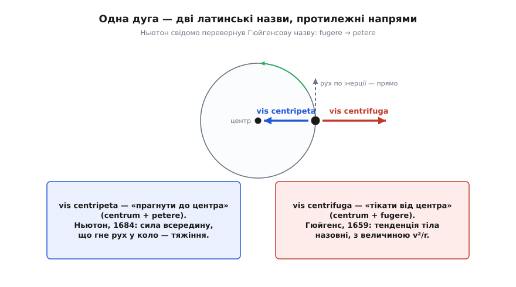
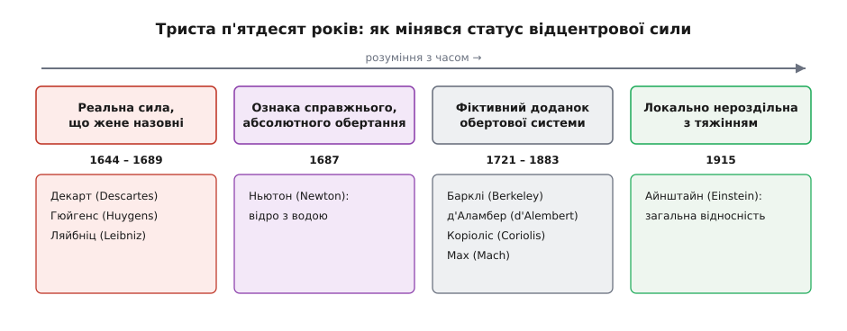

# 📜 Vis centrifuga: сила, яку назвали, перш ніж зрозуміли

У історії механіки причаїлася тиха дивина: силу, «якої не існує», назвали на ціле покоління раніше, ніж ту цілком реальну силу, що тримає планети на орбітах. Відцентровий поштовх, який відчуває кожен у крутому повороті, виміряли, охрестили й вписали у фізику ще до того, як хтось заговорив про тягу всередину. Чому люди першими схопилися саме за силу назовні? Бо саме її переживає рука: камінь напинає пращу, розкручене відро важчає в долоні, віз на дузі хилить набік. Уся історія відцентрової сили — це історія того, як фізика повільно вивернула це відчуте назовні напруження всередину, а тоді ще два століття сперечалася, чи воно взагалі реальне.

Прикметно, що ланцюжок цей — чи не найчистіший у всій механіці приклад того, як фізичне поняття народжується не в одну мить і не в одній голові. Ідею подав один, число дав другий, назву перевернув третій, а справжній сенс проступив аж у четвертого, через двісті п'ятдесят років. Простежмо цей шлях по-справжньому — по рукописах і датах, а не по легендах.

### Декарт і камінь у пращі

Першим виразну фізичну домівку відчуттю «геть від центра» дав француз Рене Декарт (René Descartes) у «Началах філософії» (*Principia Philosophiae*, 1644). Світ Декарта був заповнений матерією без порожнеч, і небесні тіла в ньому неслися велетенськими вихорами тонкої речовини — так, як тріски кружляють у вирі води. У такому вихорі кожне тіло, писав Декарт, «прагне відступити від центра» (*conatus recedendi a centro*): воно натужується піти геть від осі й утримується лише тиском сусідніх часток довкруж. Образ, яким він це пояснював, живий і донині — камінь у пращі (*lapis a funda*): камінь рветься полетіти прямо, а ремінь загинає його в коло.

У цьому образі схований і геніальний здогад, і його межа. Здогад: «прагнення назовні» — насправді не окрема сила, а просто пряма інерція тіла, що впирається у пута. Саме так ми читаємо відцентровий ефект і тепер. А межа Декартова в тому, що далі якісного опису він не пішов: у нього не було ні числа, ні міри — лише картина всесвітнього виру, до того ж хибна. Він указав, куди тіло тягне, але не сказав, наскільки дуже.

### Гюйгенс дає силі число

Число прийшло від голландця Християна Гюйгенса (Christiaan Huygens). Ще 1659 року в рукописі «Про відцентрову силу» (*De Vi Centrifuga*) він і викував саму назву — *vis centrifuga*, «сила, що тікає від центра», — і, головне, вивів її величину. Геометрично, без нашого поняття маси-сили, він показав, що напруження назовні росте як квадрат швидкості й спадає з радіусом — тобто рівнозначно тому, що ми звемо [центрострімким прискоренням](topic:physics/centripetal-acceleration) a = v²/r. Найглибший його хід був у тому, щоб зробити цю тенденцію **вимірною**: Гюйгенс ототожнив її з натягом мотузки чи тиском на стінку — тобто з такою самою тягою, яку чинить підвішений тягарець. Відцентрове перестало бути образом виру й стало величиною, яку можна порівняти з вагою.

Його ключову теорему найпростіше переказати так:

```
Гюйгенсова умова рівноваги з вагою:
тіло на колі радіуса r зі швидкістю v відчуває
відцентрову тенденцію, рівну власній вазі, коли

    v² / r = g

а це — коли воно рухається зі швидкістю, якої набрало б,
впавши з висоти h = r / 2:
    v² = 2·g·h = 2·g·(r/2) = g·r   →   v²/r = g
```

Тобто Гюйгенс умів сказати не лише «тягне назовні», а й «тягне рівно так, як вага, якщо крутити ось із такою швидкістю». Це вже фізика, а не картина.

Дивно інше — як довго він це ховав. Повний виклад із доведеннями (*De Vi Centrifuga*) вийшов лише 1703 року, посмертно. За життя Гюйгенс оприлюднив тільки голі результати: тринадцять теорем про рівномірний рух по колу — **без жодного доведення** — наприкінці свого «Годинника з маятником» (*Horologium Oscillatorium*, Париж, 1673), книги, присвяченої зовсім іншому — точному маятниковому годиннику. Причина проста й людська: Гюйгенс був перфекціоніст, весь у своєму годиннику й оптиці, а відцентрову викладку вважав чернеткою, ще не готовою до світу. Так сталося, що правильну величину сили світ побачив у вигляді тринадцятьох тверджень-загадок, доведення яких лежали в шухляді ще тридцять років. Статус усіх цих дат — усталений: рукопис 1659-го, теореми 1673-го, доведення 1703-го документовані й не викликають суперечок.

### Ньютон у записнику

Тут варто спинити поширений спрощений переказ, ніби величину «v²/r» дав винятково Гюйгенс. Майже водночас до неї дійшов — сам-один — молодий Ісаак Ньютон (Isaac Newton). У його студентському записнику (*Waste Book*) є запис, датований січнем 1665 року: двадцятидворічний Ньютон рахує «прагнення від центра» (*endeavour from the centre* — його англійський переклад Декартового *conatus a centro*). Хід у нього гарний до зухвалості: тіло біжить не по колу, а по вписаному многокутнику, на кожній вершині відбиваючись від описаного кола, — а тоді число сторін спрямовують до нескінченності, і многокутник стає колом. З цих відскоків Ньютон і видобув співвідношення, рівнозначне v²/r.

Отже, і Ньютон спершу мислив **назовні**, і теж мовою Декарта. Різниця не в тому, хто був розумніший, а в тому, хто оприлюднив: Гюйгенс дійшов першим і зрештою надрукував, а Ньютон свій висновок сховав у записнику майже на двадцять років. Чесний підсумок такий: якісну ідею дав Декарт, першу опубліковану величину — Гюйгенс, а незалежно й приблизно тоді ж її здобув і Ньютон, лишивши в чернетках. Жодного «одного винахідника» тут немає.

### Дзеркало: від fugere до petere

Найважливіше Ньютон зробив не тоді, коли повторив Гюйгенса, а тоді, коли його **перевернув**. Близько 1684 року, у рукописі «Про рух тіл по орбіті» (*De motu corporum in gyrum*), який він передав Едмондові Галлею (Edmond Halley), Ньютон будував теорію тяжіння — і йому знадобилося геть протилежне поняття. Щоб планета йшла по орбіті, її пряму [інерцію](topic:physics/newtons-first-law) хтось мусить безнастанно загинати **всередину**, до Сонця. Не тіло тисне назовні на пута — а щось тягне його до центра. І Ньютон свідомо викував дзеркальну назву: *vis centripeta*, «сила, що прагне до центра», навмисне переінакшивши Гюйгенсову *vis centrifuga*. Латинь тут промовиста до останньої літери: *centrum* — осереддя, спільне обом; а далі — *fugere*, «тікати», в одного і *petere*, «прагнути, простувати», в іншого. Один корінь відвертає від центра, другий — веде до нього.


*Наймовніша інверсія у механіці. Та сама дуга, те саме тіло — але Гюйгенс назвав силу за тим, чим тіло тисне назовні на пута (vis centrifuga, centrum + fugere), а Ньютон — за тим, що тягне тіло всередину і гне його рух у коло (vis centripeta, centrum + petere). Не нова сила, а нова назва й новий погляд на ту саму дугу.*

Ця, здавалося б, словесна дрібниця була завісом, на якому обернулася вся небесна механіка. З відцентрової тенденції всесвітнього тяжіння не збудуєш: «усе притягує все» вимагає причини, спрямованої **до** тіла, а не від нього. Поки в центрі уваги стояла сила, що жене назовні, планети доводилося втримувати вихорами й тиском матерії довкола. Щойно Ньютон перевів погляд на силу, що тягне всередину, стало можливим сказати просте й нечуване: тіла притягують одне одного самі, через порожнечу, за законом оберненого квадрата. Назва, обернена з *fugere* на *petere*, і відчинила двері до універсального тяжіння.

> 🔧 **Навіщо це.** Історія відцентрової сили — наочний доказ, що в науці назва не буває невинною. Гюйгенс і Ньютон описували ту саму дугу, той самий камінь на тій самій мотузці — і числа в обох сходилися. Але Гюйгенс дивився на те, чим тіло **тисне на пута** (назовні), а Ньютон — на те, що **тримає тіло** (усередину). Один і той самий рух, описаний з протилежних кінців. Вибір, який кінець назвати «силою», визначив, яку фізику можна на ньому збудувати: на відцентровій — вихори, на центрострімкій — тяжіння. І це не легенда на кшталт яблука, що впало Ньютонові на голову: інверсію назви видно чорним по білому в його рукописах.

### Відро з водою

Назвавши силу всередину, Ньютон не викинув відцентрову — навпаки, у «Началах» (*Philosophiæ Naturalis Principia Mathematica*, 1687) він зробив її свідком у найсміливішій своїй суперечці: про те, що обертання **абсолютне**. Доказом стало відро з водою.

Уявімо відро на скрученій мотузці, налите водою. Простежмо чотири стани:

```
1. Відро й вода нерухомі.           Поверхня води — плеска.
2. Відпускаємо: відро крутиться,    Вода ще стоїть.
   вода ще не підхопилася.          Поверхня — плеска.
3. Тертя розкрутило й воду; тепер   Поверхня — увігнута,
   вода й відро крутяться разом.    вода лізе на стінки.
4. Раптом спиняємо відро.           Вода ще крутиться —
                                     поверхня досі увігнута.
```

Ось у чому сіль Ньютонового доводу. У стані 2 вода й відро рухаються одне відносно одного якнайдужче — а поверхня плеска. У стані 3 вода й відро **нерухомі одне відносно одного** — а поверхня увігнута найдужче. Отже, увігнутість — відцентровий підйом води на стінки — не пов'язана з обертанням води **відносно відра**. Тоді відносно чого? Ньютон відповідав: відносно самого простору. Вода вигинається тим дужче, чим швидше вона крутиться в абсолютному просторі, а не стосовно якогось сусіднього тіла. Відцентровий ефект став для Ньютона віконцем у справжнє, абсолютне обертання — фізичним відбитком того, що рух буває не лише відносний.

Це вершина погляду «відцентрова сила — реальна». Для Ньютона вона була не просто справжня, а майже священна: те єдине, що виказує абсолютний простір, недосяжний іншим чуттям. Через сто вісімдесят років цей самий доказ стане мішенню найгострішої критики — але майже два століття перед тим його ніхто серйозно не похитнув.

### Незгодні: вихори проти тяжіння

Дарма було б думати, що Ньютонове тяжіння вмить перемогло. Двоє найбільших механіків материка зустріли його в багнети — і, що промовисто, обидва трималися саме за відцентрову силу як за щось реальне й причинне.

Німець Ґотфрід Вільгельм Ляйбніц (Gottfried Wilhelm Leibniz) 1689 року в «Спробі про причини небесних рухів» (*Tentamen de motuum coelestium causis*) залишив відцентрову силу дійовою особою планетарної теорії, тлумачачи її як реальну тягу назовні у власній вихровій схемі. А Гюйгенс, зустрівшись із Ньютоном в Англії влітку 1689-го й щиро захопившись його математикою, все ж не прийняв головного. Оберненого квадрата відстані він не заперечував — а от «притягання крізь порожнечу» відкинув як безглузде: для послідовника Декарта сила без дотику матерії до матерії була темною вигадкою. Уже 1690 року у «Роздумі про причину тяжіння» (*Discours de la cause de la pesanteur*) Гюйгенс запропонував свою відповідь — тяжіння як наслідок **відцентрової** сили тонкого виру довкола Землі. У листі до Ляйбніца того ж року він прямо назвав ньютонівське притягання безглуздям.

Гірка іронія: обидва велетні континентальної механіки чіплялися за відцентрову силу як за реальну причину — і саме тому не змогли ступити за поріг тяжіння. «Відцентрова — справжня, дійова сила» лишалося головним поглядом Європи ще не одне десятиліття. Реальність сили, «якої немає», трималася довше, ніж її вигаданість.

### Довге переосмислення: з реальної на фіктивну

Демонтаж почався поволі, з філософського краю. Ірландець Джордж Барклі (George Berkeley) ще 1721 року в трактаті «Про рух» (*De Motu*) заперечив Ньютонів абсолютний простір: вода у відрі, доводив він, вигинається не відносно порожнього простору, а відносно нерухомих зір. Це була перша тріщина в думці, що відцентровий ефект викриває щось абсолютне.

Далі поняття зсунулося вже не філософами, а самою механікою. Француз Жан ле Рон д'Аламбер (Jean le Rond d'Alembert) у «Трактаті про динаміку» (*Traité de dynamique*, 1743) показав, як «сили інерції» можна **дописувати** до рівнянь, щоб звести задачу руху до простішої задачі рівноваги. Це був вирішальний зсув у **категорії**: відцентрова з реальної тяги перетворювалася на зручний доданок, який кладеш у рівняння, коли того хочеш. А ще майже за століття інший француз, Ґаспар-Ґюстав де Коріоліс (Gaspard-Gustave de Coriolis), у праці 1835 року про віддачу машин з обертовими частинами — водяних коліс — вивів «складену відцентрову силу» (*force centrifuge composée*), яку ми звемо тепер силою Коріоліса. Відтоді відцентрова сила стала лише одним членом цілої родини доданків, що **народжуються з самого вибору обертової системи відліку** — тобто одною з [інерційних, фіктивних сил](topic:physics/inertial-frame).

Завершив демонтаж австрієць Ернст Мах (Ernst Mach). У «Механіці в її розвитку» (*Die Mechanik in ihrer Entwicklung*, 1883) він повернувся до Ньютонового відра й перевернув висновок. Дослід, писав Мах, доводить лише те, що обертання води **відносно стінок відра** відцентрового ефекту не дає; а сам ефект породжує обертання води **відносно далеких мас Всесвіту** — тих самих зір. Абсолютний простір непотрібний і непізнаванний, чиста метафізика. За двісті років відцентрова сила сповзла з «відбитка абсолютної реальності» до «артефакту твого вибору системи відліку».


*Одне поняття — чотири різні статуси за три з половиною століття. Спершу відцентрова сила — реальна тяга назовні (Декарт, Гюйгенс, Ляйбніц). У Ньютона вона підноситься до ознаки справжнього, абсолютного обертання (відро з водою). Далі, від Барклі до Маха, її розжалують у фіктивний доданок, породжений вибором обертової системи. А Айнштайн показує, що локально її взагалі не відрізнити від тяжіння. Дати всі документовані; спірне тут одне — чи «першим» дав величину Гюйгенс, а чи незалежний Ньютон.*

### Айнштайн замикає коло

Махова критика запала в думку молодого Альберта Айнштайна (Albert Einstein) — він і назвав її пізніше «принципом Маха» (*Mach'sches Prinzip*, 1918). А загальна теорія відносності (1915) зробила з усією суперечкою «реальна чи фіктивна» щось несподіване: розмила саму межу. Її наріжний камінь — [принцип еквівалентності](topic:physics/equivalence-principle): локально інерційну силу не відрізнити від тяжіння. У вільному падінні тяжіння **зникає** — падаючи в ліфті, ваги ти не чуєш; а в обертовій чи розігнаній системі з'являється інерційна сила, **невідмінна** від справжнього гравітаційного поля. Виходить, та сама межа «реальна сила / фіктивна сила», якою у XIX столітті розжалували відцентрову, сама виявилася відносною до вибору системи відліку.

Тут годиться чесна засторога: загальна відносність народилася **під впливом** Маха, але його принципу вповні так і не втілила — чи справді розподіл далеких мас однозначно задає інерцію, лишається предметом суперечок і донині. Проте головне для нашої історії безсумнівне: поняття, з якого починали як із простої тяги назовні, наприкінці шляху виявилося тоншим, ніж гадали обидва табори. Гюйгенсове «реальна» і махівське «чиста вигадка» — це два кінці розрізнення, яке Айнштайн змусив гнутися.

Такий шлях відцентрової сили: її назвали першою — бо саме її відчуває рука; Ньютон вивернув її всередину — і тим уможливив тяжіння; відро звело її на престол свідка абсолютного простору; два століття розжалували її у бухгалтерський доданок; а Айнштайн показав, що локально її не відірвати від самого тяжіння. Мало яке поняття у фізиці стільки разів міняло свій сенс, не міняючи при тому імені.
