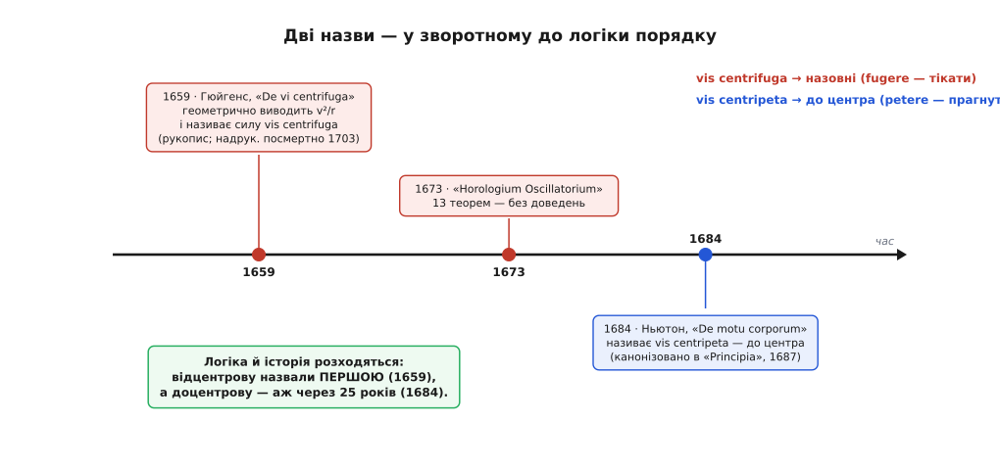

# 📜 Два слова, народжені задом наперед

Спитайте будь-кого, яке з двох слів — «доцентрове» чи «відцентрове» — з'явилося першим, і майже кожен відповість упевнено: звісно, доцентрове. Воно ж «правильне»: фізика вчить, що на тіло в повороті діє сила до центра, а «відцентрова» — то радше побутова примара, з якою науці довелося потім морочитися. Логічно? Так. Тільки історія все влаштувала навпаки. Слово «відцентрова» народилося на чверть століття раніше — і придумав його чоловік, який порахував рух по колу бездоганно точно. А «доцентрову» ввів інший, ще через покоління, зайшовши до тієї самої задачі з протилежного боку. І найдивніше: обидва описували, по суті, ту саму натягнуту нитку — просто вхопили її з різних кінців.


*Порядок, у якому слова ввійшли в науку, зворотний до того, як їх подає підручник: спершу назвали силу назовні, і аж через покоління — силу до центра, ту, яку фізика вважає справжньою. Дати позначено за станом джерел.*

## Спершу була думка про «прагнення навтіки»

Найперша здогадка про рух по колу в кожного однакова, і вона хибна лише наполовину: у повороті щось тягне назовні. Це відчуття старше за будь-яку формулу, і першим його вклав у слова Рене Декарт (René Descartes), французький філософ і математик. У його «Началах філософії» (*Principia Philosophiae*, 1644) світ повниться велетенськими вирами матерії, і тіло, підхоплене таким виром, має *conatus recedendi a centro* — «прагнення відступити від центра». Ось де вперше названо напрям: назовні, геть від осі обертання.

Але це поки що тільки думка, не наука. Декарт дав напрям і дав силі ім'я-прагнення, проте не дав жодного числа: наскільки сильне те прагнення, від чого залежить — про це ні слова. Гірше того, сама механіка вирів, у яку він це вклав, згодом виявилася глухим кутом і була відкинута. Лишилося зерно, і зерно важливе: **перший інстинкт про рух по колу дивиться назовні**. Саме з цього боку — з боку відчуття — люди й почали.

*Статус: усталено, що Декарт увів у обіг ідею відцентрового «прагнення» назовні; його ж вирова космологія — застаріла й полишена.*

## Гюйгенс рахує — і дає силі ім'я «відцентрова»

Перетворити відчуття на число зумів Христіан Гюйгенс (Christiaan Huygens) — нідерландський фізик, астроном і математик, той самий, що розгледів кільце Сатурна й супутник Титан і збудував маятниковий годинник. 1659 року в рукописі, який він так і назвав — *De vi centrifuga*, «Про відцентрову силу», — Гюйгенс зробив те, чого не зміг Декарт: виміряв те прагнення назовні точно. Знаряддям була чиста геометрія й одна позичена думка — [вільне падіння](book:physics/free-fall).

Хід міркування вартий того, щоб пройти його поволі, бо він напрочуд красивий. Уявіть тіло, що мить летить по колу. Якби нитка раптом зникла, воно за коротку мить помчало б **по прямій** — по дотичній до кола. Нитка натомість щомиті збиває його з тієї прямої назад на коло. А тепер придивіться до проміжку між тим, де тіло «полетіло б» (по дотичній), і тим, де воно насправді опинилося (на колі). Цей проміжок — точнісінько такий, як маленька відстань, що на неї падає камінь під горизонталлю за ту саму мить. Гюйгенс прирівняв одне до одного:

```
За мить Δt тіло відхиляється від дотичної всередину на

   s ≈ ½ · (v²/r) · Δt²

а вільно падуче тіло за ту саму мить опускається на

   s ≈ ½ · g · Δt²

Однакове s за однакове Δt → відцентрове прагнення діє так,
наче тяжіння завбільшки

   a = v² / r
```

Ось так, зі співставлення з падінням, і випало сучасне `v²/r` — за десять років до того, як за цю задачу взявся Ньютон. Силу Гюйгенс назвав *vis centrifuga*, від латинських *centrum* (центр) і *fugere* (тікати, утікати): «сила, що втікає від центра».

І тут украй важливо не помилитися в тому, **що саме** він назвав. Гюйгенсова відцентрова сила була цілком реальна — це справжній натяг, яким тіло, що крутиться, тягне свою нитку, той самий напин, що ви відчуваєте долонею, розкрутивши камінець. Це не та примарна, «фіктивна» [відцентрова сила](book:physics/centrifugal-force) з крутної каруселі, про яку застерігають нинішні підручники. Гюйгенс міряв натяг у мотузці — і навіть показав, що той натяг тим більший, чим важче тіло.

Далі сталася дуже людська річ. 1673 року Гюйгенс видав свою вершину — *Horologium Oscillatorium*, трактат про маятниковий годинник, найтоншу механіку до Ньютона. У самому кінці книжки він причепив **тринадцять теорем** про рух по колу — плід тієї праці 1659 року, — але надрукував лише **висновки, притримавши всі доведення**. Він беріг викладки для більшої книжки, якої так і не написав. Ті доведення разом із повним *De vi centrifuga* побачили світ аж 1703 року, за вісім років по його смерті. Тож ціле покоління мало Гюйгенсові відповіді про рух по колу без його міркувань — тринадцять голих теорем, яких, навіть роздягнених, вистачило, щоб указати шлях.

*Статус: усталено — рукопис 1659 року з виведенням v²/r, тринадцять теорем без доведень у «Horologium Oscillatorium» 1673 року, посмертна публікація доведень 1703 року; усе засвідчено джерелами.*

## Ньютон заходить з іншого боку — і називає силу «доцентровою»

До того самого кола Ісаак Ньютон (Isaac Newton) — англієць, народжений у Вулсторпі в Лінкольнширі 1642 року за старим стилем (1643 за новим) — прийшов із протилежного питання. Гюйгенс питав: з якою силою тіло, що крутиться, тягне назовні свою прив'язь? Ньютон питав інакше: яка невидима сила збиває планету з прямої, що нею вона «хотіла б» летіти, і загортає її в орбіту? Адже за законом інерції полишене само собі тіло летить прямо вічно; щоб утримати Місяць на його колі, щось мусить щомиті тягти його **всередину**, геть із дотичної, до Землі — [саме на цьому Ньютон і побудував тяжіння](book:physics/newton-gravitation).

Цій внутрішній силі був потрібен свій відмінок і своє слово. У трактаті *De motu corporum in gyrum* («Про рух тіл по орбіті») 1684 року — тому дев'ятисторінковому рукописі, що його Ньютон надіслав Едмондові Галлею й що з нього виросли «Начала» (*Principia*, 1687), — він і викарбував *vis centripeta*, від *centrum* і *petere* (прагнути, тягтися до): «сила, що прагне до центра».

Слово він зліпив свідомо за Гюйгенсовим взірцем, як його дзеркало: там, де в нідерландця було *centrum*-*fugere* (тікати від центра), англієць поставив *centrum*-*petere* (тягтися до центра). І борг свій визнав без заздрості: у «Началах», у поясненні до четвертого твердження першої книги, Ньютон прямо назвав Гюйгенсові теореми про відцентрову силу першим кроком до розгадки тяжіння. Він добре знав, на чиїй геометрії стоїть.

А тепер — тиха розв'язка всієї історії. У найпростішому випадку, з камінцем на нитці, Гюйгенсова сила назовні й Ньютонова сила всередину — це не дві різні сили, що змагаються між собою. Це **два кінці однієї натягнутої мотузки**. Тіло тягне нитку назовні (Гюйгенсова *vis centrifuga*) — нитка тягне тіло всередину (Ньютонова *vis centripeta*). Та сама мотузка, той самий натяг — обидві сили дорівнюють `m·v²/r`, — але протилежні кінці й протилежні імена. Гюйгенс назвав те, що тіло робить зі своєю прив'яззю; Ньютон — те, що прив'язь робить із тілом.

## Чому слово «до центра» стало головним

Розберімо обидва слова до кореня. Саме «центр» іде від грецького *kentron* (κέντρον) — вістря, жало, а точніше нерухома ніжка циркуля, той настромлений шпінь, довкруж якого ти обводиш коло. На цю латинську основу лягли два протилежні дієслова: *petere* — прагнути, тягтися, і *fugere* — тікати. Доцентрове — тягнутися до шпеня; відцентрове — тікати від нього. Слова протилежні аж до останньої літери.

Чому ж фізика врешті коронувала внутрішнє слово як «справжню» силу? Бо в [системі відліку, що сама не обертається](book:physics/inertial-frame), лише внутрішня сила є справжнім поштовхом чи тягою з джерелом, яке можна назвати на ім'я: нитка, тяжіння, тертя. Те відчуття «викидання» назовні в повороті — не щось, що діє на вас іззовні; це ваша власна інерція, тіло силкується летіти прямо, а сидіння загортає вас усередину. Ньютонове внутрішнє слово називає **дійсну причину**; Гюйгенсове зовнішнє — реальний натяг, але на прив'язі, не рушійну силу на тілі. Підручник, щоб навчати причини, ставить доцентрове першим.

І ось звідки та плутанина, що мучить кожного школяра: під двома словами тепер тісниться **три** різні речі. Декартове прагнення назовні (розпливчастий потяг), Гюйгенсова сила назовні (справжній натяг у прив'язі) і сучасна «фіктивна» відцентрова сила (бухгалтерська поправка, яку доводиться дописувати лише тоді, коли ти вперто робиш фізику зсередини крутної системи відліку) — три відмінні поняття під одним словом «відцентрове». Не диво, що воно вислизає з рук. Історія їх розплітає: відчутий потяг (Декарт), реальний натяг мотузки (Гюйгенс) і облікова поправка (сучасна) — не та сама «сила назовні», і жодне з трьох не є поштовхом, що жбурляє тіло геть від центра.

*Статус: усе — усталена історія; ідентичності чіткі (Гюйгенс — нідерландець, Ньютон — англієць, Декарт — француз), без місця для імперських перетасувань, що затуманюють інші спори про першість.*

## Що лишилося від цієї історії

Відступіть на крок — і в кола виявиться троє батьків, що говорять трьома мовами про той самий рух. Формула `v²/r` — Гюйгенсова. Слово, яке нам викладають першим, — Ньютонове. Інстинкт, що його ми відчуваємо в кожному повороті, — той, що назовні, — Декартів. Порядок, у якому слова ввійшли у світ, точно зворотний до того, як їх розкладає сучасний підручник. І щойно ви побачите цю інверсію, давня плутанина між «доцентровим» і «відцентровим» перестає бути пасткою й обертається маленьким пам'ятником тому, як насправді росте фізика: спершу відчуття, тоді міра, і аж потім правильне ім'я — часто ще довго після того, як знайдено правильну відповідь.
