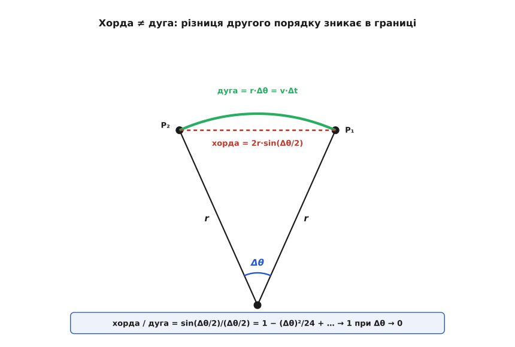
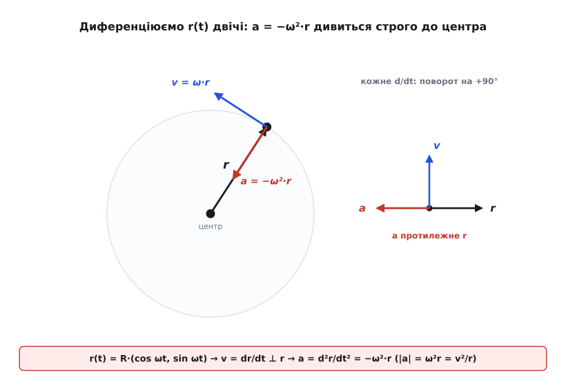
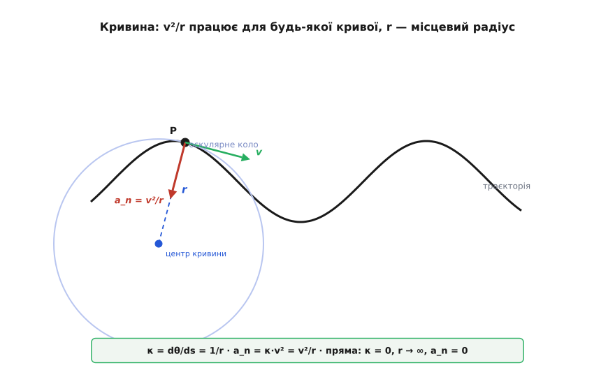

# 🧮 Три дороги до a = v²/r: границя, друга похідна вектора й кривина

Формулу центрострімкого прискорення можна дістати за півсторінки: два подібні трикутники, один необережний змах рукою «хорда ≈ дуга» — і ось воно, a = v²/r. Швидко, але з двома боргами. По-перше, той змах рукою треба повернути й віддати чесно: хорда таки не дорівнює дузі, і треба точно знати, **чому** право їх сплутати з'являється лише в границі. По-друге, геометрія дає тільки **величину** прискорення — а найцікавіше в цій темі не величина, а **напрям**: чому строго до центра, а не кудись убік. Одні трикутники цього не доводять, вони його припускають.

Тому пройдімо не одну дорогу, а три, і кожна закриє свій борг. **Геометрична границя** зробить чесним перехід хорда→дуга. **Подвійне диференціювання вектора положення** віддасть не число, а векторний закон a = −ω²·r, де сам знак «мінус» і означає «до центра» — напрям випаде з математики, а не з малюнка. А **кривина** покаже, що v²/r насправді розповідає не про коло, а про будь-яку криву — коло лише окремий випадок. Три незалежні виведення сходяться в одну відповідь; ця збіжність трьох різних машинерій і є найтвердіша порука, що формула правильна.

## Дорога перша: межа двох трикутників і чесний перехід хорда→дуга

Почнімо з геометрії — тим самим шляхом, яким величину v²/r уперше дістав Гюйгенс понад 350 років тому (він же й слово «відцентрова» вигадав у рукописі «De vi centrifuga» 1659 року, надрукованому аж 1703-го, по його смерті; статус — усталений факт історії механіки).

Тіло за короткий час Δt переходить із точки P₁ у точку P₂, і радіус, проведений до нього, повертається на малий кут Δθ. Рівно на той самий кут Δθ повертається й вектор швидкості — бо швидкість завжди дотична до кола, тобто перпендикулярна до радіуса, тож коли обертається радіус, услід за ним обертається і швидкість. Маємо два трикутники з тим самим кутом при вершині:

```
трикутник положень:   дві сторони r (радіуси)   +  хорда P₁P₂
трикутник швидкостей:  дві сторони v (швидкості) +  сторона Δv
```

Обидва рівнобедрені (по дві рівні сторони), обидва мають при вершині той самий кут Δθ. А рівнобедрені трикутники зі спільним кутом при вершині **подібні** — і ця подібність **точна**, для будь-якого, навіть великого Δθ. Звідси відношення відповідних сторін рівні строго:

```
Δv / v  =  хорда / r
```

Оце — рівність без жодних наближень. Наближення знадобиться в наступному кроці, і саме його треба зробити чесно.

**Де ховається наближення.** Хорда — це пряма відстань між P₁ і P₂, а пройдений тілом шлях — це **дуга** між ними, і вони не однакові: дуга завжди трохи довша за свою хорду. Запишімо обидві точно. Хорда рівнобедреного трикутника з бічною стороною r і кутом Δθ при вершині дорівнює 2r·sin(Δθ/2); дуга ж за означенням радіана дорівнює r·Δθ:

```
хорда = 2·r·sin(Δθ/2)
дуга  = r·Δθ
```

Їхнє відношення — це чисто `sin(Δθ/2)/(Δθ/2)`, знаменита величина, що [прямує до одиниці](topic:math/sine-derivative), коли кут стягується до нуля. Розкладім її, щоб побачити не лише *що* границя дорівнює 1, а й *як швидко* до неї підходять:

```
хорда / дуга = sin(Δθ/2) / (Δθ/2) = 1 − (Δθ)²/24 + …
```

Ось воно, чесне пояснення того «змаху рукою». Різниця між хордою і дугою — не першого порядку за малим кутом, а **другого**: вона тане як (Δθ)², тобто незрівнянно швидше, ніж тануть самі хорда й дуга (вони — першого порядку). Тому в границі, де Δθ → 0, ця різниця зникає раніше й безнадійніше за все інше, і замінити хорду дугою можна вже не як недбалість, а як строго виправданий крок. Подивімося на числа:

```
Δθ        хорда / дуга
30°       0.98857
10°       0.99873
 5°       0.99968
 2°       0.999949
 1°       0.999987
→ 0       1
```

Уже при 5° хорда й дуга різняться на три сотих відсотка, а далі розбіжність провалюється квадратично. Стягуючи проміжок, ми женемо Δθ у нуль — і право сплутати хорду з дугою стає безумовним.

**Складаємо докупи.** Дуга — це пройдений шлях, а за сталого темпу шлях дорівнює v·Δt. Підставмо дугу замість хорди в точну рівність подібності й поділімо на Δt:

```
Δv / v  =  дуга / r  =  v·Δt / r
Δv / Δt =  v² / r
```

Ліворуч Δv/Δt у границі малого проміжку — це і є величина прискорення. Отже a = v²/r. Геометрія віддала число; що воно спрямоване до центра, тут довелося взяти з картинки (Δv дивиться всередину кола) — по-справжньому це доведе наступна дорога.


*Хорда 2r·sin(Δθ/2) коротша за дугу r·Δθ, але їхнє відношення дорівнює sin(Δθ/2)/(Δθ/2) і прямує до 1 як 1 − (Δθ)²/24. Різниця — другого порядку за кутом, тому в границі Δθ→0 хорду можна замінити пройденим шляхом v·Δt, і подібність трикутників дає a = v²/r.*

## Дорога друга: двічі продиференціювати r(t) — і знак сам покаже центр

Геометрія лишила відкритим головне питання — напрям. Закриймо його начисто, не апелюючи до жодного малюнка: запишімо рух формулою й [продиференціюймо](topic:math/derivative) двічі. Хай тіло біжить по колу радіуса R зі сталою [кутовою швидкістю](topic:physics/angular-velocity) ω. Його положення в кожну мить задає вектор із двох координат:

```
r(t) = R·(cos ωt,  sin ωt)
```

Це чесний запис рівномірного руху по колу: довжина вектора √(R²cos² + R²sin²) = R стала (тіло на колі), а кут ωt рівномірно наростає (радіус крутиться зі сталим темпом ω).

**Перша похідна — швидкість.** Диференціюймо кожну координату за часом, пам'ятаючи, що [похідна косинуса — це мінус синус, а синуса — косинус](topic:math/sine-derivative), і всередині ще множник ω за ланцюговим правилом:

```
v = dr/dt = R·(−ω·sin ωt,  ω·cos ωt) = Rω·(−sin ωt,  cos ωt)
```

Дві речі випадають одразу. По-перше, модуль: |v| = Rω·√(sin² + cos²) = Rω — знайомий зв'язок лінійної та кутової швидкості, тут він не постулат, а наслідок. По-друге, перевірмо кут між швидкістю й радіусом через їхній скалярний добуток:

```
v·r = Rω·R·[(−sin ωt)(cos ωt) + (cos ωt)(sin ωt)] = R²ω·0 = 0
```

Нуль — отже v ⊥ r: швидкість строго перпендикулярна до радіуса, тобто дотична до кола. Це вже не «видно з малюнка», а випало з арифметики.

**Друга похідна — прискорення.** Диференціюймо швидкість ще раз, тим самим правилом:

```
a = dv/dt = Rω·(−ω·cos ωt,  −ω·sin ωt) = −Rω²·(cos ωt,  sin ωt)
```

І тут — уся суть теми в одному рядку. Погляньмо, що стоїть у дужках: (cos ωt, sin ωt) — це ж рівно r/R. Тому

```
a = −ω²·R·(cos ωt, sin ωt) = −ω²·r
```

Векторний закон центрострімкого прискорення: **a = −ω²·r**. Прочитаймо його повільно, бо кожен знак навантажений. Прискорення — це вектор положення r, помножений на число. Число −ω² від'ємне. Помножити вектор на від'ємне число означає **розвернути його точно на 180°**. Отже a напрямлене строго **протилежно** до r — від тіла назад до центра кола, антипаралельно радіусу. Не «приблизно всередину», не «кудись убік» — рівно назустріч r, у центр. Той самий знак «мінус» несе весь фізичний зміст слова «центрострімке»: математика видала напрям сама, без жодного покликання на картинку.

Величина теж на місці: |a| = ω²·|r| = ω²·R. А оскільки |v| = ωR, то ω = v/R, і

```
|a| = ω²·R = (v/R)²·R = v²/R = v²/r
```

Те саме v²/r, що дала геометрична границя, — але тепер разом із доказом напряму.

Є ще одна перевірка, гарна сама собою. Порахуймо a·v:

```
a·v = (−ω²·r)·v = −ω²·(r·v) = −ω²·0 = 0
```

Прискорення перпендикулярне до швидкості. А прискорення, перпендикулярне до руху, не може змінити **модуль** швидкості — лише її напрям (складова прискорення вздовж руху дорівнює нулю, тягти вперед чи назад нема чому). Ось чому рівномірний рух по колу справді рівномірний: центрострімке прискорення весь час перпендикулярне швидкості, тому темп не міняє ні на крихту, а лише завертає траєкторію.

І остання, найглибша нота цієї дороги. Погляньмо на закон a = −ω²·r покоординатно. Для першої координати x = R·cos ωt він каже:

```
d²x/dt² = −ω²·x
```

Це рівняння **гармонічного коливання**: прискорення пропорційне зміщенню й напрямлене проти нього. Те саме — для другої координати y. Виходить, рівномірний рух по колу — це два однакові гармонічні коливання вздовж двох осей, зсунуті по фазі на чверть періоду (там косинус, там синус). Кругове обертання й коливання маятника — не дві різні речі, а одна, побачена з двох боків; а v²/r — це коефіцієнт ω² тієї самої пружної на вигляд сили, що завжди тягне назад до рівноваги, тільки рівновага тут — центр кола.


*Диференціювання рівномірного обертального вектора повертає його на +90° і множить довжину на ω. Тому v випереджає r на чверть кола (дотична), а a випереджає v ще на чверть — тобто дивиться протилежно до r, у центр. Формула a = −ω²·r: знак «мінус» — це і є ті два повороти по 90°, що склалися в розворот на 180°.*

## Дорога третя: довжина дуги й кривина — те, що працює для будь-якої кривої

Перші дві дороги міцно спираються на те, що траєкторія — коло. Третя починає з довжини дуги й доходить до v²/r так, що коло виявляється лише окремим випадком, а формула — властивістю **будь-якої** кривої. Це найпотужніший погляд, бо він переносний.

Означення радіана прямо в'яже пройдений шлях, радіус і кут:

```
s = r·θ
```

Продиференціюймо за часом (радіус сталий): ds/dt = r·dθ/dt, тобто **v = r·ω** — знову той самий зв'язок, тепер із геометрії дуги. Але головне попереду. Введімо одиничний вектор τ уздовж руху (дотичний до траєкторії, |τ| = 1); тоді швидкість — це v = v·τ. Прискорення виходить похідною цього добутку, і оскільки міняється і темп v, і напрям τ, воно розпадається на дві частини — цей загальний **розклад на дотичну й нормальну складові** докладно розгорнуто в [математиці прискорення](topic:physics/acceleration/math-acceleration.md). Нас тут цікавить та частина, що відповідає за поворот, — і в ній ключова величина зветься кривиною.

**Кривина.** Коли тіло проходить дугу довжиною ds, дотична τ повертається на кут dθ. Наскільки круто **гнеться сама траєкторія** в даній точці, міряють кривиною — швидкістю повороту дотичної на одиницю пройденого шляху:

```
κ = dθ / ds
```

Для кола це число знаходиться миттєво з s = r·θ: θ = s/r, тож dθ/ds = 1/r. Кривина кола стала й дорівнює **оберненому радіусу**:

```
κ = 1/r        (обернену величину r = 1/κ звуть радіусом кривини)
```

**Нормальне прискорення через кривину.** Складова прискорення, що завертає траєкторію, дорівнює швидкості, помноженій на темп повороту дотичної в часі:

```
a_n = v · |dτ/dt|
```

А темп повороту дотичної в часі розкладається за ланцюговим правилом на кривину і швидкість:

```
|dτ/dt| = dθ/dt = (dθ/ds)·(ds/dt) = κ·v
```

Підставмо:

```
a_n = v · (κ·v) = κ·v² = v²/r
```

Ось і v²/r — але вже в набагато загальнішому вбранні. Погляньмо, що ми зробили: **ніде не знадобилося, щоб траєкторія була колом**. Кривина κ визначена для будь-якої кривої — це обернений радіус того кола, яке найщільніше прилягає до кривої в даній точці (його звуть оскулярним, від лат. *osculari* — цілувати; коло, що «цілує» криву). Тому a_n = v²/r справджується в кожній точці будь-якого шляху, тільки r там — **місцевий радіус кривини**, свій у кожній точці. Рівномірний рух по колу — це рідкісний випадок, коли цей радіус усюди однаковий (κ = const). Пряма — інший край: у неї дотична не повертається взагалі, κ = 0, радіус кривини нескінченний, і нормальне прискорення зникає. Одна формула v²/r накриває і круте коло, і пологий поворот дороги, і мить розвороту на довільній кривій — усюди з місцевим r.


*Кривина κ = 1/r визначена в кожній точці будь-якої кривої: r — радіус кола, що найщільніше прилягає до траєкторії тут. Нормальне прискорення дорівнює κ·v² = v²/r і показує до центра цього кола. Коло сталого радіуса — лише випадок κ = const; на довільній кривій r свій у кожній точці, а формула та сама.*

## Одна величина, три обличчя: v²/r = ω²r = ω·v

Усі три дороги привели до v²/r. Але цю саму величину зручно писати ще двома способами, і всі три — той самий вираз, лише через різні відомі. Місток між ними — зв'язок v = ω·r. Підставмо його по черзі:

```
v²/r = (ω·r)²/r = ω²·r
ω·v  = ω·(ω·r)  = ω²·r
```

Отже, тотожність:

```
a = v²/r = ω²·r = ω·v
```

Три записи — одне число; котрий брати, диктує лише те, що вам відоме. Знаєте лінійний темп v і радіус r — беріть v²/r. Знаєте оберти ω і радіус — зручніше ω²·r. Маєте обидва темпи, лінійний і кутовий, — то й просто ω·v.

**Одиниці.** Перевірмо, що всі три дають прискорення, тобто м/с². Радіан — величина безрозмірна (це відношення дуги до радіуса, метр на метр), тому в підрахунку одиниць він просто зникає:

```
v²/r :  (м/с)² / м   = м²/с² / м        = м/с²   ✓
ω²·r :  (рад/с)²·м   = (1/с²)·м          = м/с²   ✓
ω·v  :  (рад/с)·(м/с) = (1/с)·(м/с)      = м/с²   ✓
```

Саме безрозмірність радіана й робить так, що ω²·r виходить у чистих м/с², а не в якихось «рад²·м/с²».

**Граничні випадки** — швидка перевірка на здоровий глузд, і кожен щось каже:

- **r → ∞ (пряма).** a = v²/r → 0. Рух по прямій зі сталим темпом — без прискорення, як і має бути: дотична не повертається.
- **Сталий ω, більший r.** a = ω²·r росте лінійно з радіусом. На жорсткому диску, що крутиться як ціле, край прискорюється дужче за середину; у самому центрі (r = 0) прискорення нуль.
- **Сталий v, менший r.** a = v²/r злітає. Той самий темп на тіснішому колі вимагає куди різкішого прискорення — ось чому круті повороти такі жорсткі.
- **Подвоїти v при тому самому r.** a = v²/r учетверо більше: квадратичний закон, який на дорозі обертається тим, що небезпека повороту росте не з швидкістю, а з її квадратом.

**Диск, що обертається як ціле: край проти середини.** Пластина жорсткого диска крутиться на 7200 обертів за хвилину. Порівняймо прискорення на радіусі 2 см і 4 см.

```
ω = 7200·2π/60 = 7200·6.2832/60 ≈ 754 рад/с

r₁ = 0.02 м:  a₁ = ω²·r₁ = 754²·0.02 = 568516·0.02 ≈ 11370 м/с² ≈ 1160 g
r₂ = 0.04 м:  a₂ = ω²·r₂ = 754²·0.04 = 568516·0.04 ≈ 22740 м/с² ≈ 2320 g
```

Подвоївся радіус — рівно подвоїлося прискорення (ω для всіх точок диска однакова, а a = ω²·r лінійне за r). Дальша від осі доріжка тримається на колі вдвічі більшим прискоренням, ніж ближча, — тому саме зовнішній край найдужче навантажений відривом; там, а не в центрі, першою здає механічна міцність на надвисоких обертах.

## Коли обертання не рівномірне: додається дотична складова a_t = α·r

Досі темп обертання ω був сталий. Відпустімо це. Хай тепер тіло розкручується (чи гальмує) — кутова швидкість міняється, і темп її зміни зветься кутовим прискоренням α = dω/dt. Тоді лінійний темп v = ω·r теж міняється, і по колу (r сталий) швидко порахувати його зміну:

```
dv/dt = r·dω/dt = r·α
```

З'являється **дотична складова прискорення** a_t = dv/dt = α·r — уздовж руху, вона розганяє чи гальмує тіло по дузі. Нікуди не діваючись, лишається й **нормальна** складова a_n = v²/r = ω²·r — до центра, вона й далі завертає траєкторію. Вони перпендикулярні (дотична впоперек радіуса), тож повне прискорення складається за Піфагором:

```
a = √(a_t² + a_n²) = √((α·r)² + (ω²·r)²) = r·√(α² + ω⁴)
```

Найчистіше цю двоскладовість видно у векторному записі. Швидкість точки тіла — це [v = ω × r](topic:physics/angular-velocity/math-omega-cross-r.md); продиференціюймо її раз, за правилом похідної добутку:

```
a = dv/dt = (dω/dt) × r + ω × (dr/dt) = α × r + ω × (ω × r)
```

Два доданки — дві ролі. Перший, α × r, за величиною дорівнює α·r і лежить уздовж руху — це та сама дотична складова, що розганяє. Другий, ω × (ω × r), розкривається (для плоского обертання, де ω ⊥ r) у −ω²·r — рівно наш векторний закон центрострімкого прискорення, до центра, завбільшки ω²r. Одна векторна тотожність тримає обидві частини: коли обертання рівномірне (α = 0), лишається сама центрострімка −ω²·r; щойно темп починає мінятися — поряд виростає дотична α × r. Загальний розклад будь-якого прискорення на ці дві перпендикулярні ролі — «міняти темп» і «міняти напрям» — і є зміст [дотичної та нормальної складових](topic:physics/acceleration/math-acceleration.md).

## Куди все сходиться

Три незалежні дороги привели в одну точку. **Геометрична границя** дала величину v²/r і показала, що перехід хорда→дуга — не недбалість, а строгий крок: різниця між ними другого порядку за кутом і чесно зникає в границі. **Подвійне диференціювання вектора положення** r(t) = R·(cos ωt, sin ωt) віддало не число, а векторний закон a = −ω²·r, де знак «мінус» — це і є доказ напряму: прискорення антипаралельне радіусу, строго в центр, і математика видала це сама, без покликання на картинку. **Кривина** розкрила, що v²/r — властивість не кола, а будь-якої кривої, з місцевим радіусом кривини r = 1/κ у кожній точці. А тотожність a = v²/r = ω²·r = ω·v — це одне число в трьох записах, кожен під свої відомі, всі в чесних м/с². Щойно обертання перестає бути рівномірним, поряд виростає перпендикулярна дотична частина a_t = α·r, — але центрострімке ядро v²/r нікуди не зникає, воно є всюди, де траєкторія хоч трохи гнеться.
