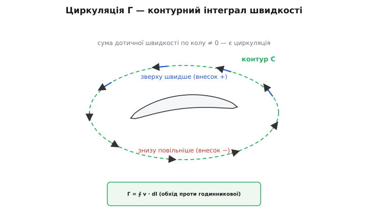
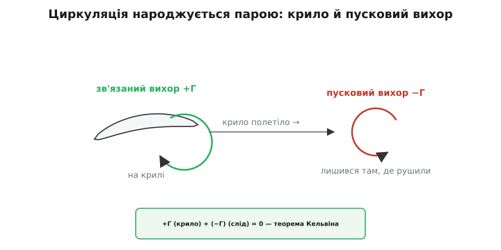

# Циркуляція та підіймальна сила

<preknowlist>
- [Літак](topic:physics/fixed-wing-lift) — крило несе, відхиляючи повітря вниз; той самий факт можна прочитати як різницю тисків над і під крилом.
- [Динамічний тиск](topic:physics/dynamic-pressure) — ½ρv², міра напору потоку; де потік швидший, там статичний тиск нижчий (Бернуллі).
</preknowlist>

Крило несе тому, що женеться крізь повітря — це фізична причина. Але «женеться» саме по собі ще не число: мчати можна й крізь симетричний обтічний стовп, який нікуди не штовхає. Ось точне питання: **чому саме той потік, що обтікає крило, стає несиметричним — швидшим зверху, повільнішим знизу — і як цю несиметрію виміряти одним числом.** Це число — циркуляція Γ. З нього виходить уся підіймальна сила рівно однією формулою, а самé значення Γ ставить не форма профілю, а тонкий фізичний добір на гострій задній кромці. Розберімо це від першопричини.

## Що таке циркуляція: означення

Циркуляція (лат. *circulatio* — коловий рух) — це **сумарна «підкрученість» потоку вздовж замкненого контуру**. Формально: береш будь-яку замкнену петлю C у полі швидкостей, обходиш її і на кожному крихітному відрізку дороги *dl* дивишся, наскільки швидкість *v* збігається з напрямком обходу. Скалярний добуток *v·dl* — це проєкція швидкості на дорогу, помножена на довжину кроку. Складаєш ці внески по всьому колу:

```
Γ = ∮ v · dl        (обхід замкненого контуру C)
```

Кружечок на інтегралі означає «по замкненому контуру». Знак домовляємося: обходимо **проти годинникової стрілки**, тоді додатна Γ відповідає закрутці проти годинникової.

Розберімо, що цей інтеграл насправді міряє. Якщо на всьому колі швидкість перпендикулярна до дороги (потік перетинає контур, а не біжить уздовж), кожен внесок *v·dl* нульовий — циркуляція нуль. Якщо потік усюди рівномірний і прямий, то на одному боці петлі він допомагає обходу, а на протилежному однаково заважає — внески гасяться, знову нуль. **Циркуляція відмінна від нуля лише тоді, коли потік уздовж контуру системно закручений в один бік** — коли, обійшовши петлю, ти отримав більше «попутної» швидкості, ніж «зустрічної».


*Циркуляція — це сума дотичної швидкості по замкненому колу. Швидший потік угорі дає більший внесок, ніж повільніший унизу, тож обхід не гаситься — Γ ≠ 0.*

Тепер прикладемо це до крила. Обведімо профіль широкою петлею й обійдімо її. Уздовж верхньої половини потік швидкий, уздовж нижньої — повільніший, тож дотичні внески згори й знизу різні за величиною і **не гасяться**. Ця різниця дотичних внесків по колу і є циркуляція навколо крила. Вона відмінна від нуля саме тоді, коли зверху швидше, ніж знизу, — рівно за тієї геометрії, що дає підіймальну силу вгору.

> 🔧 **Навіщо це.** Γ зводить усю несиметрію обтікання до **одного скаляра**, який потім прямо множиться на густину й швидкість, даючи силу. Замість того щоб інтегрувати тиск по всій хитрій поверхні профілю, інженер рахує одне число — циркуляцію — і одразу має підіймальну силу. У панельних методах і в теорії тонкого профілю весь розрахунок крила крутиться навколо обчислення саме Γ.

## Чому циркуляція взагалі виникає: в'язкість і гостра кромка

Ось найглибше місце всієї теми, і його зазвичай проскакують. В ідеальній рідині — без тертя — навколо крила можлива будь-яка циркуляція, зокрема нульова. Математика ідеального потоку не має однозначної відповіді: постав Γ = 0, і рівняння задоволені; постав Γ будь-якою — теж задоволені. Природа мусить якось **вибрати одне значення**. Хто вибирає?

Щоб побачити добір, уявімо, що циркуляції немає (Γ = 0), і простежмо, куди тоді піде потік. Крило має гостру задню кромку. За нульової циркуляції лінії струму, що йдуть по нижній поверхні, дійшовши до гострого хвоста, не сходять з нього — вони **загинають угору й огинають вістря знизу вгору**, прямуючи до точки на верхній поверхні (так звана задня критична точка сідає не на кромку, а вище). А тепер погляньмо, що це вимагає від швидкості: щоб обійти нескінченно гостре вістря, рідина мусила б розвернутися майже на місці — а це означає нескінченно велику швидкість у самій точці кромки.


*За нульової циркуляції потік мусив би розвернутися на гострому вістрі з нескінченною швидкістю. В'язкість цього не терпить і добирає єдину Γ, за якої потік гладко сходить із кромки.*

Реальне повітря має в'язкість (лат. *viscosus* — липкий) — внутрішнє тертя між сусідніми шарами. Нескінченна швидкість означала б нескінченний градієнт швидкості на вістрі, а отже нескінченні дотичні напруження тертя — фізично неможливо. Тонкий примежовий шар (шар загальмованого тертям повітря біля поверхні) не витримує такого розвороту й **відривається** з кромки, замість огинати її. Але щойно потік починає сходити з вістря, а не огинати його, картина обтікання зсувається — і разом з нею змінюється циркуляція навколо профілю. Процес самоналаштовується, аж поки не встановиться **єдиний режим, за якого потік сходить із задньої кромки гладко, обома поверхнями в один бік, без розвороту на вістрі**.

Оця вимога і є **умова Кутти** (нім. математик Мартін Вільгельм Кутта, який 1902 року в праці «Auftriebskräfte in strömenden Flüssigkeiten» уперше пов'язав циркуляцію з підіймальною силою; статус — усталено). Сформулюймо її чітко:

```
Умова Кутти:
потік сходить із гострої задньої кромки плавно
(швидкість на кромці скінченна, обидві поверхні
 сходяться в один напрям сходу)
```

Тонкість, яку варто вимовити прямо: в'язкість тут — **пусковий механізм і арбітр**, а не постійне джерело сили. Вона потрібна, щоб добрати правильну Γ (на самому старті руху й для стабілізації режиму), але щойно циркуляція встановилася, підіймальну силу можна рахувати за законами ідеальної рідини, ніби тертя й нема. Парадокс лише уявний: без в'язкості не було б однозначної циркуляції, а отже й підіймальної сили; але величину сили дає вже безв'язкісна формула. Тертя робить вибір — і відступає.

Умова Кутти працює саме тому, що кромка **гостра**. Заокругли задній край — і однозначного добору не буде, потік зможе сповзати по-різному. Ось чому всі крила мають лезоподібну задню кромку: це не примха аеродинаміки, а фізична вимога, щоб циркуляція, а з нею й підіймальна сила, мала визначене значення.

## Як циркуляція народжується: пусковий вихор і закон Кельвіна

Лишається чесно спитати: якщо навколо крила з'явилася циркуляція +Γ (закрутка в один бік), то звідки вона взялася? Адже нерухоме крило в нерухомому повітрі жодної циркуляції не має — усе спокійне, Γ = 0 по будь-якому контуру. Закон збереження тут суворий.

Це **теорема Кельвіна про циркуляцію** (Вільям Томсон, лорд Кельвін, 1869; статус — усталено): в ідеальній рідині циркуляція вздовж контуру, що рухається разом з рідиною, з часом не змінюється. Була нуль — лишиться нуль. То як же крило набуває +Γ, не порушивши закону?

Відповідь елегантна: циркуляція народжується **парою протилежних закруток, що в сумі дають нуль**. Коли крило рушає з місця й розганяється, на першу ж мить потік намагається обігнути гостру кромку знизу (той самий заборонений розворот). Примежовий шар зривається з кромки й скручується в окремий вихор, що лишається позаду, у точці старту — це **пусковий вихор** (англ. *starting vortex*) із циркуляцією −Γ. Рівно стільки ж циркуляції протилежного знаку, +Γ, залишається «намотаною» навколо крила — це **зв'язаний вихор** (англ. *bound vortex*), і саме він дає підіймальну силу.


*Крило не порушує збереження циркуляції: розганяючись, воно скидає позаду пусковий вихор −Γ і рівно стільки ж +Γ намотує на себе. Сума по великому контуру, що охоплює обидва, лишається нулем.*

Обведи великим контуром і крило, і покинутий пусковий вихор — сумарна циркуляція всередині нуль, як і мусить бути за Кельвіном. Але контур, що охоплює **лише крило**, ловить +Γ — і цієї циркуляції досить, щоб нести. Пусковий вихор ти можеш іноді побачити на власні очі: коли літак різко бере на себе біля землі в сиру погоду, за задньою кромкою на мить закручується видима спіраль. Це квитанція про народжену циркуляцію.

Тепер уся логіка зімкнулася в ланцюг: **крило рушає → потік намагається огинати гостру кромку → в'язкість цього не терпить → зривається пусковий вихор −Γ → навколо крила лишається +Γ → умова Кутти виконана, потік гладко сходить → циркуляція має визначене значення.** Жодної ланки не можна викинути.

## Теорема Кутти–Жуковського: від циркуляції до сили

Тепер перетворімо циркуляцію на силу. Стверджується, що для профілю (крила нескінченного розмаху, двовимірна задача) підіймальна сила на одиницю довжини розмаху дорівнює:

```
L' = ρ · v · Γ        (сила на метр розмаху)
```

де ρ — густина повітря, *v* — швидкість набігаючого потоку, Γ — циркуляція навколо профілю. Це **теорема Кутти–Жуковського**. Розберімо, звідки береться саме такий добуток, не приймаючи його на віру.

**Спершу — груба, але чесна оцінка через тиск і Бернуллі.** Нехай далеко від крила потік має швидкість *v*. Циркуляція Γ означає, що потік трохи прискорений зверху й трохи сповільнений знизу; позначмо цю малу добавку швидкості як *u*. Груба картина: зверху швидкість *v + u*, знизу *v − u*. За Бернуллі більша швидкість дає менший тиск, тож перепад тиску між низом і верхом:

```
Δp = ½ρ(v+u)² − ½ρ(v−u)²        [різниця динамічних членів]
   = ½ρ · [ (v+u)² − (v−u)² ]
   = ½ρ · [ 4vu ]
   = 2ρ v u
```

Цей перепад тисків, помножений на площу (на одиницю розмаху — на хорду *c*), дає силу вгору порядку Δp·c = 2ρvu·c. А тепер оцінимо циркуляцію тієї самої картини: обходячи контур завдовжки ~2c (зверху й знизу вздовж хорди), верхня частина додає ~(v+u)·c, нижня віднімає ~(v−u)·c за напрямком обходу, і різниця дотичних внесків дає Γ ~ 2u·c. Підставмо u·c = Γ/2 у силу:

```
L' ~ 2ρv · (uc) = 2ρv · (Γ/2) = ρ v Γ
```

Груба оцінка **точно вгадала форму** L' = ρvΓ — і показала фізику: сила береться з різниці динамічних тисків, а та різниця пропорційна циркуляції. Строгий вивід (через інтеграл тиску по контуру профілю в комплексній площині — метод, який і розвинув Жуковський) прибирає всі «~» і дає рівно L' = ρvΓ без жодного числового множника-поправки. Форма правильна не випадково: вона диктується розмірністю (ρ — кг/м³, v — м/с, Γ — м²/с; перемножмо: кг/м³ · м/с · м²/с = кг/с² = Н/м — сила на метр, точно) і напрямом (сила перпендикулярна до потоку й до осі вихору).

**Напрям сили.** L' спрямована перпендикулярно до набігаючого потоку — це наслідок того, що сила виникає як «магнус-подібна» взаємодія поступального руху й обертання. Знак Γ (закрутка проти чи за годинниковою) визначає, вгору чи вниз спрямована сила. Для крила, що несе, циркуляція така, що сила дивиться вгору.

> 🔧 **Навіщо це.** Формула L' = ρvΓ — це місток між «геометричною» інженерною формулою L = ½ρv²S·CL і фізичною першопричиною. Прирівнявши їх для смужки крила, дістаєш зв'язок коефіцієнта CL із циркуляцією: CL ∝ Γ/(v·c). Тому будь-яка теорія, що вміє передбачити Γ за формою профілю й кутом атаки (теорія тонкого профілю, панельні методи), одразу видає й CL — без жодної продувки в трубі.

Історія авторства варта точності. Ідею, що підіймальна сила пов'язана з вихровою циркуляцією навколо крила, першим висловив **англійський інженер Фредерік Ланчестер** (Frederick W. Lanchester) — думка визріла в нього близько 1894 року, а повний виклад він дав у книзі «Aerodynamics» (1907). Незалежно **німець Мартін Кутта** (1902) показав зв'язок циркуляції з підіймальною силою для дуг-профілів, але **не дав точного кількісного співвідношення**. Точну формулу L' = ρvΓ уперше опублікував **Микола Жуковський** (рос. Николай Жуковский; народився в селі Орехово Владимирської губернії Російської імперії, навчався в Московському університеті) 1906 року; він же розвинув метод конформного відображення профілів. Тож назва «Кутта–Жуковський» справедлива, але повна картина колективна: ідея — Ланчестер, якісний зв'язок — Кутта, точна теорема й математичний апарат — Жуковський (статус усього абзацу — усталено; жодних імперських «першостей» тут домальовувати не треба, авторство добре задокументоване).

## Циркуляція, кут атаки й камбер

Формула L' = ρvΓ показує, що вся підіймальна сила сидить у Γ. Отже, керувати підіймальною силою означає керувати циркуляцією. Від чого ж залежить сама Γ?

Два важелі: **кут атаки** (кут між хордою крила й набігаючим потоком) і **камбер** (вигин серединної лінії профілю). Обидва змінюють, наскільки крутою мусить бути циркуляція, щоб задовольнити умову Кутти — тобто щоб потік гладко зійшов із задньої кромки.

Інтуїція для кута атаки: задери ніс крила, і набігаючий потік б'є в нижню поверхню під більшим кутом. Щоб він усе одно гладко зійшов саме з гострої задньої кромки (а не намагався загинати навколо неї), потік мусить сильніше «підкрутитися» — потрібна більша циркуляція. Тому Γ, а з нею й підіймальна сила, росте з кутом атаки. Теорія тонкого профілю дає для цього напрочуд простий результат: для тонкого симетричного профілю циркуляція пропорційна куту атаки α, а коефіцієнт підіймальної сили —

```
CL ≈ 2π · α        (α у радіанах, тонкий профіль, ідеальний потік)
```

Нахил 2π на радіан (≈0.11 на градус) — знаменитий результат теорії тонкого профілю; реальні крила через товщину й в'язкість мають нахил трохи менший, але близький. Ось математичне коріння того, що на кривій CL(α) лінійна ділянка йде майже прямою: за малих кутів Γ і справді пропорційна α.

Інтуїція для камбера: вигни профіль опукло вгору (опущений хвіст), і навіть за **нульового** кута атаки потік уже мусить закрутитися, щоб зійти з опущеної кромки гладко. Тобто вигнутий профіль має **ненульову циркуляцію вже при α = 0** — він несе, коли пласка дошка ще не несе нічого. Тому крива CL(α) для камберованого профілю зсунута вліво: нульова підіймальна сила настає при трохи **від'ємному** куті атаки. У теорії тонкого профілю це виражають так:

```
CL ≈ 2π · (α − α₀)        (α₀ — кут нульової підіймальної сили, <0 для опуклого камбера)
```

Ось чому вигнуте крило несе більше за пласку пластину при тому самому куті: камбер додає циркуляції «безкоштовно», незалежно від кута атаки. Уся геометрія профілю зводиться до одного питання — скільки циркуляції потрібно, щоб потік чисто зійшов із задньої кромки; кут і вигин лише крутять цю потребу вгору або вниз.

**Приклад: яка циркуляція тримає крило легкого безпілотника?** Візьмімо смужку крила хордою *c* = 0.20 м, що летить зі швидкістю *v* = 14 м/с, і хочемо CL = 0.6 на цій смужці. Спершу знайдімо циркуляцію, прирівнявши дві формули підіймальної сили на одиницю розмаху: інженерну (на смужку площею c·1) і теорему Кутти–Жуковського.

:::tabs
```cpp
// Циркуляція Γ, потрібна для заданого CL на смужці крила хордою c
// при швидкості v. Прирівнюємо L' двома способами:
//   L' = 0.5*rho*v^2 * (c*1) * CL     (інженерна форма, на 1 м розмаху)
//   L' = rho * v * Gamma              (Кутта–Жуковський)
// rho скорочується:  Gamma = 0.5 * v * c * CL
double circulation_for_CL(double v, double c, double CL) {
    return 0.5 * v * c * CL;
}

// виклик: circulation_for_CL(14.0, 0.20, 0.6);
```
```py
def circulation_for_CL(v, c, CL):
    """Циркуляція Γ, потрібна для заданого CL на смужці крила хордою c
    при швидкості v. Прирівнюємо L' двома способами:
        L' = 0.5*rho*v**2 * (c*1) * CL   (інженерна форма, на 1 м розмаху)
        L' = rho * v * Gamma             (Кутта–Жуковський)
    rho скорочується:  Gamma = 0.5 * v * c * CL"""
    return 0.5 * v * c * CL


# виклик: circulation_for_CL(14.0, 0.20, 0.6)
```
:::

Зверни увагу: густина ρ скоротилася — циркуляція від неї не залежить, лежить вона хоч біля землі, хоч на висоті. Підставмо крок за кроком:

```
Γ = 0.5 · v · c · CL
Γ = 0.5 · 14.0 · 0.20 · 0.6
Γ = 0.5 · 1.68
Γ ≈ 0.84 м²/с
```

Отже, щоб ця смужка несла з коефіцієнтом 0.6, навколо неї має «намотатися» циркуляція близько 0.84 м²/с. Перевіримо, що це справді дає осмислену силу на метр розмаху через теорему Кутти–Жуковського (ρ = 1.225 кг/м³):

```
L' = ρ · v · Γ = 1.225 · 14.0 · 0.84 ≈ 14.4 Н/м
```

Та сама смужка за інженерною формулою: L' = ½·1.225·14²·0.20·0.6 ≈ 14.4 Н/м. Числа збіглися — дві мови описують одну силу. Циркуляція виявилася не абстракцією, а робочою величиною, з якої напряму рахується підіймальна сила.

## Від профілю до крила: чому скінченний розмах губить частину сили

Досі йшлося про **профіль** — крило нескінченного розмаху, де циркуляція однакова вздовж усього крила й потік суто двовимірний. Реальне крило скінченне, і тут циркуляція грає ще одну роль, яку не можна оминути.

Зв'язаний вихор +Γ не може просто обірватися на кінці крила — вихрова лінія за законами гідродинаміки не закінчується в рідині, вона або замикається, або тягнеться до межі. Тому на кінцях крила циркуляція **сходить у потік** позаду у вигляді пари **кінцевих вихорів** (англ. *tip vortices*), що тягнуться слідом за літаком довгими закрученими джгутами. Разом зв'язаний вихор на крилі й два кінцеві вихори позаду утворюють **підковоподібний вихор** (англ. *horseshoe vortex*) — цю модель увів **Людвіг Прандтль** у теорії несучої лінії (нім. фізик, роботи 1911–1918; статус — усталено).

Причина вихорів проста і вже знайома з погляду тиску: під крилом тиск вищий, над ним нижчий, і на **вільному кінці** повітря перетікає з-під крила на верх, огинаючи торець. Цей переток і закручується у вихор.

Наслідок для сили — **індукований опір**. Кінцеві вихори наводять (індукують) додаткову вертикальну складову швидкості — потік у зоні крила трохи підвертає донизу ще до того, як дійде до крила. Через це **ефективний кут атаки** кожного перерізу менший за геометричний, а вектор підіймальної сили нахиляється трохи назад. Проєкція цього нахиленого вектора на напрям польоту і є індукований опір — неминуча плата за створення підіймальної сили на скінченному крилі. Що довше й вужче крило (більше видовження), то слабші кінцеві вихори й менший цей опір — тому в планерів крила такі витягнуті. Скільки палива піде на подолання цього опору за всю дальність, рахує [рівняння Бреге, що пов'язує дальність і тривалість польоту з аеродинамічною якістю L/D та витратою пального](topic:physics/breguet-range-endurance).

Прандтль також показав важливий математичний факт: серед усіх розподілів циркуляції вздовж розмаху **еліптичний розподіл дає найменший індукований опір** за заданої повної підіймальної сили. Тому ідеальне з погляду опору крило має циркуляцію, розподілену по розмаху як половина еліпса — максимум усередині, плавний спад до нуля на кінцях. Знамените еліптичне крило винищувача Spitfire — пряме втілення цього результату (хоч на практиці еліпс наближають простішими формами: трапецією, зламом).

Отже, циркуляція керує двома речами одразу. Її величина в кожному перерізі дає місцеву підіймальну силу через L' = ρvΓ; а те, **як швидко вона спадає до нуля на кінцях**, визначає силу кінцевих вихорів і величину індукованого опору. Обидві сторони крила — і те, що воно несе, і те, чим за це платить, — це різні прочитання одного поля циркуляції.
