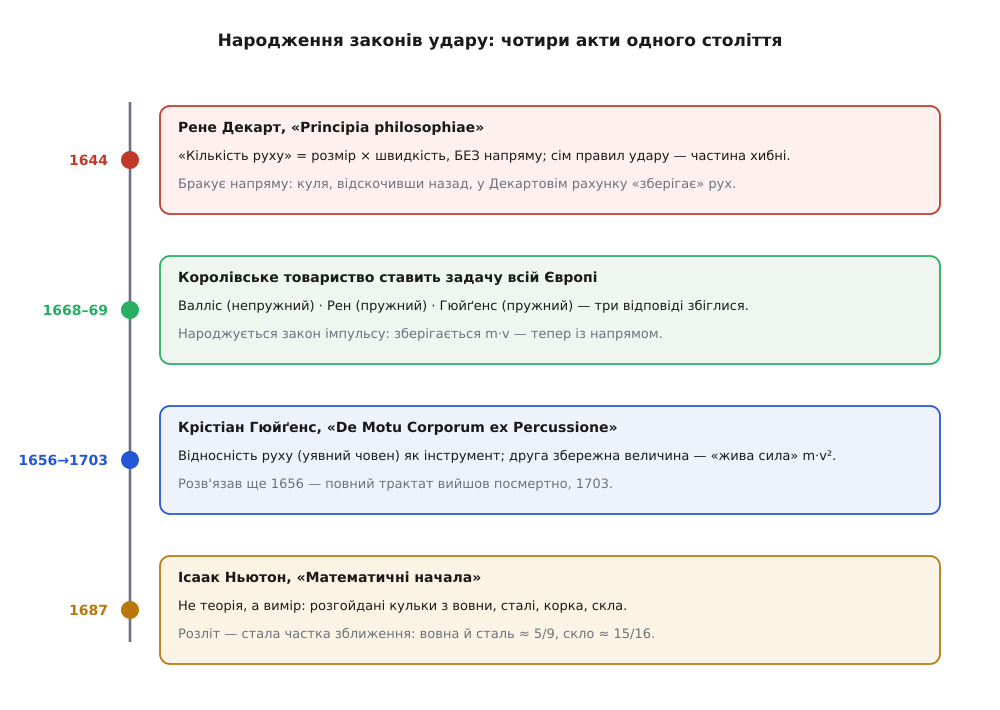
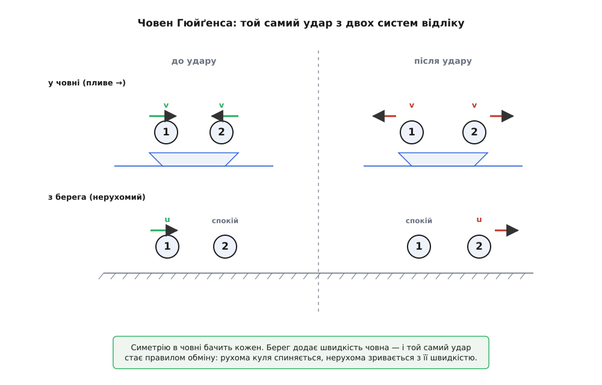

# 📜 Як XVII століття навчилося рахувати удар

Що станеться, коли дві кулі стукнуться? Питання здається дитячим — удари відбуваються щомиті, від краплі об камінь до кульки об кульку на столі. А проте цілих півтори тисячі років після Арістотеля ніхто не вмів дати на нього **правильної** відповіді. Не тому, що бракувало розуму, — бракувало правильної **валюти обліку**: величини, яку удар зберігає, і способу її рахувати так, щоб число сходилося не лише на папері, а й у житті. Століття від Декарта до Ньютона — це історія про те, як цю валюту знайшли, як спершу її невдало підробили, і як зрештою вивірили дослідом. Уся драма крутиться навколо однієї начебто дрібниці — **напряму** — і навколо зухвалої думки, що дивитися на удар можна **звідки завгодно**.


*Одне століття — чотири кроки: хибний скалярний закон Декарта, публічна задача й три відповіді Королівського товариства, відносність Гюйґенса з другою збережною величиною, і вимірюване число Ньютона.*

## Декарт: правильний інстинкт, хибний рахунок

Перший, хто наважився записати удар **законом**, а не переказом випадків, був француз **Рене Декарт** (René Descartes, 1596–1650). У «Началах філософії» (лат. *Principia philosophiae*, 1644) він проголосив велику й, як виявиться, майже правильну ідею: у Всесвіті зберігається стала **кількість руху**. Декарт виводив її не з досліду, а з богослов'я — Бог незмінний, отже й сума руху, яку Він уклав у світ на початку, лишається сталою повік. Інстинкт був геніальний: щось в ударі справді береже свою величину. Але яка саме то величина?

І ось тут ховалася фатальна вада. Декартова кількість руху — це **розмір тіла, помножений на швидкість**, узятий як гола додатна величина, без жодного знаку напряму:

```
Декарт:   Q = Σ (розмір · швидкість)      — лише модуль, напрям відкинуто
```

Тіло, що летить праворуч зі швидкістю 5, і тіло, що летить ліворуч зі швидкістю 5, у цьому рахунку однакові — обидва несуть «5 одиниць руху». А це означає, що куля, яка **відскочила назад** із тією ж прудкістю, у Декартовім гросбуху нічого не змінила: до удару «5», після удару «5», баланс зійшовся. Напрям, який у житті вирішує геть усе — зіткнулися тіла чи розбіглися, — випав із обліку.

Спираючись на цей кульгавий рахунок, Декарт вивів **сім правил** зіткнення. Кілька з них просто хибні, і найкрасномовніше — четверте. Воно проголошує: якщо менше тіло налітає на більше, що спочиває, то менше **завжди відскакує назад**, а більше лишається незрушним — і так хоч би з якою скаженою швидкістю налітало менше. Декарт стверджував буквально, що коли тіло C бодай трохи більше за тіло B, то B «ніколи не матиме сили зрушити C, хоч би з якою швидкістю до нього наближалося». Це суперечить найпростішому досвіду: розженіть легкий молоток — і він зрушить важчу цеглину; куля пробиває мішок, важчий за неї. Правило хибне саме тому, що скалярна бухгалтерія дозволяє легкому тілу «повернути» весь свій рух відскоком, ніби нічого й не сталося, — адже знак вона не бачить.

> 🔧 **Навіщо це.** Декартова помилка — найкращий у всій механіці урок, що **напрям не є дрібною подробицею**. Варто відкинути знак — і закон, ідеально правильний як гасло, породжує безглузді пророцтва. Уся подальша історія удару, по суті, — це виправлення однієї цієї недбалості: замість модуля швидкості брати швидкість **зі знаком** (вектор), і тоді та сама Декартова ідея збереження раптом починає працювати бездоганно. Правильний інстинкт чекав правильної арифметики.

## Задача, кинута всій Європі

Минуло чверть століття, і виправити Декарта взялася нова інституція — молоде **Лондонське королівське товариство** (засноване 1660). Науку тоді робили вже не самотою: товариство ставило задачі привселюдно й збирало відповіді від найкращих голів. І 1668 року воно оголосило саме цю задачу — вивести правильні **правила удару тіл**.

Відгукнулися троє, і кожен узявся за свій бік проблеми.

Першим, наприкінці 1668 року, надіслав відповідь англієць **Джон Валліс** (John Wallis, 1616–1703) — оксфордський математик, чиїми знаками нескінченності (∞) ми користуємося й досі. Валліс розглянув **непружний** удар — зіткнення м'яких, незовсім твердих тіл, що не відскакують. Його висновок: рух пари треба рахувати за спільним центром ваги, і зберігається саме та величина, яку ми звемо **[імпульсом](topic:physics/momentum)** — добуток маси на швидкість, узятий **із напрямом**.

Услід, у грудні 1668 року, свою відповідь дав ще один англієць — **Крістофер Рен** (Christopher Wren, 1632–1723). Так, той самий Рен, що згодом відбудує Лондон після Великої пожежі й підніме над ним купол собору Святого Павла; в історію техніки він увійшов ще й правилами удару. Рен узяв протилежний, ідеальний полюс — **цілком пружний** удар, коли тіла відскакують без утрат, — і вивів правило, за яким рівні тіла в такому ударі **обмінюються швидкостями**.

А на початку 1669 року, на прохання секретаря товариства **Генрі Ольденбурга** (Henry Oldenburg), надійшла третя відповідь — від голландця **Крістіана Гюйґенса** (Christiaan Huygens, 1629–1695) із Гааги, найгострішого механіка тієї доби. Гюйґенс розібрав пружний удар — і дістав **ті самі результати, що й Рен**.

Три незалежні уми, три листи — і **збіг**. Саме ця збіжність і перетворила правило удару з чиєїсь думки на **факт**: коли троє, працюючи нарізно, приходять до однакового закону, сумніватися вже важко. Народився закон збереження імпульсу в його правильній, векторній подобі — той, що стоїть за кожним розрахунком зіткнення донині.

Не обійшлося й без прикрої людської історії. Праці Валліса й Рена надрукували в «Філософських трансакціях» товариства 11 січня 1669 року — а Гюйґенсову оминули. Скривджений голландець опублікував стислий виклад свого розв'язку у французькому «Journal des Sçavans» 8 березня 1669-го; збагнувши незручність, Ольденбург квапливо дав латинський переклад Гюйґенса й пояснення, як усе сталося. Дрібна редакційна кривда — а закарбувалася в літописі науки поряд із самим законом.

## Гюйґенс: він мав відповідь уже дванадцять років

Найгостріша іронія цієї збіжності ось у чому: коли 1668 року товариство лише **ставило** задачу, Гюйґенс тримав її розв'язок у шухляді вже **дванадцять років**. Ще 1656-го він написав цілий трактат «Про рух тіл унаслідок удару» (лат. *De Motu Corporum ex Percussione*) — п'ять засновків, тринадцять тверджень, повна й правильна теорія пружного удару. Він просто не поспішав друкувати. Ба більше, ще 1661 року, гостюючи в Лондоні, Гюйґенс показував свої результати Ренові й Вільямові Браункеру особисто. Тож на публічну задачу він відповів давно готовим — а повний трактат світ побачив аж 1703 року, **посмертно**. Людина, що розв'язала загадку першою, оприлюднила її останньою.

Що ж було в тому трактаті такого, чого бракувало Декартові? Дві речі, і обидві глибокі.

Перша — **напрям**, той самий, що його Декарт відкинув. Гюйґенс показав чорним по білому: Декартів закон збереження стає правильним рівно тоді, коли швидкість беруть **зі знаком**, як [швидкість-вектор](topic:physics/velocity), а не як голий модуль. Виправ цю одну недбалість — і хибні правила самі обертаються на правильні.

Друга — і це вже прозріння — **відносність руху** як робочий інструмент. Гюйґенс поклав третім засновком свого трактату думку, від якої тоді паморочилося в голові: усякий рух вимірюють лише відносно чогось, що **умовно** вважають нерухомим, і висновки про удар не сміють залежати від того, чи справді те «щось» стоїть на місці. Іншими словами, [закони фізики однакові в усіх рівномірно рухомих системах відліку](topic:physics/galilean-relativity) — і Гюйґенс перший обернув цей принцип на **знаряддя обчислення**.

Він утілив його в уявному досліді, вартому кожного великого фізика, — **човні**.


*Той самий удар двома очима. У човні дві рівні кулі сходяться й розходяться з однаковою швидкістю — цю симетрію бачить кожен. Береговий спостерігач додає до всього швидкість човна — і симетричний удар обертається на правило обміну: рухома куля спиняється, нерухома зривається з її швидкістю.*

Уявіть човен, що рівно пливе каналом, і в ньому чоловіка з двома однаковими кульками на нитках. Він зводить руки так, що кульки сходяться назустріч із однаковою швидкістю *v* кожна. Що буде після удару? Тут не треба **жодної** механіки — сама **симетрія** каже: коли все дзеркально ліворуч-праворуч, то й розійтися кульки мусять дзеркально, кожна зі своєю *v* назад. Це очевидно й безсумнівно.

А тепер погляньмо на той самий удар **із берега**. Береговий спостерігач бачить рух кульок плюс рух човна. Підберімо швидкість човна так, щоб вона рівно погасила рух однієї кульки: тоді для берега ця кулька **спочиває**, а друга налітає на неї. Що каже берег про наслідок? Він бере відомий уже симетричний результат із човна й так само додає до нього хід човна — і дістає: кулька, що налітала, **спиняється намертво**, а та, що спочивала, **зривається з місця з її швидкістю**. Ось воно, Ренове правило обміну — тільки здобуте не з рівнянь, а з чистої вимоги, щоб два спостерігачі того самого удару не суперечили один одному.

> 🔧 **Навіщо це.** Це той самий хід думки, який через двісті п'ятдесят років Айнштайн покладе в основу відносності, — але вперше ним по-справжньому **порахував** саме Гюйґенс. Свобода дивитися на подію звідки завгодно — не філософська забаганка, а важіль: складний випадок (одне тіло налітає на нерухоме) вивільняється задарма з випадку простого (симетричний удар), варто лише перескочити в зручну систему відліку. Розв'яжи задачу там, де вона легша, а тоді додай назад швидкість системи — і повернешся з готовою відповіддю. Цим прийомом фізики живуть донині.

І ще одне, що Гюйґенс видобув із пружного удару, а Декарт проґавив: у ньому зберігається **не одна** величина, а **дві**. Крім суми mv (з напрямом) незмінною лишається ще й сума **mv²** — величина, яку невдовзі **Ґотфрід Ляйбніц** (Gottfried Leibniz) назве «живою силою» (лат. *vis viva*) і за яку розгориться довга суперечка. Це прямий предок нашої **[кінетичної енергії](topic:physics/kinetic-energy)** ½mv². Саме друга збережна величина й відрізняє пружний удар від непружного: імпульс тримається завжди, а «жива сила» — лише коли тіла відскакують без утрат. Гюйґенс намацав цей поділ на два табори за століття до того, як його узагальнили в закон збереження енергії.

## Ньютон: від правила до вимірюваного числа

Останній акт належить англійцеві **Ісааку Ньютону** (Isaac Newton, 1642–1727). У «Математичних началах натуральної філософії» (лат. *Philosophiæ Naturalis Principia Mathematica*, 1687) він зробив із теорією удару те, чого не зробив ніхто до нього, — **виміряв** її.

У пояснювальному розділі (схолії) до своїх законів руху Ньютон описує прямий дослід. Він розгойдував на нитках, наче маятники, пари однакових кульок із різних речовин і зводив їх у ловкому лобовому ударі, старанно враховуючи спротив повітря — бо маятник дає точну швидкість і до удару, і після, з висоти розмаху. І виявив тверду закономірність: **швидкість, з якою кульки розлітаються, завжди становить ту саму частку від швидкості, з якою вони зустрілися**, — а частка ця залежить лише від матеріалу. Ось його власні числа:

```
Ньютонів дослід (схолія «Начал», 1687):
    вовна (щільно змотана)   розліт : зближення ≈ 5 : 9
    сталь                    майже те саме, ≈ 5 : 9
    корок                    трохи менше
    скло                     ≈ 15 : 16
```

Це і є **коефіцієнт відновлення** — те, що сьогодні позначають буквою *e*, — хоча самого імені Ньютон йому не дав. Його відкриття було іншого штибу, ніж усе доти: Валліс, Рен і Гюйґенс дали два **ідеальні** полюси (цілком пружний і цілком непружний), а Ньютон показав, що все **справжнє** живе між ними й міряється одним числом. Дихотомія обернулася на плавну ручку.

Варто чесно застерегти: Ньютонові 5/9 для сталі — низькі як на наше око, адже добра гартована сталь відскакує майже ідеально (e ближче до одиниці). Річ у матеріалах і техніці XVII століття: його «сталь» була не нашою, а маятниковий вимір ловив і деформацію ниток, і решту втрат. Показово навіть, що найпружнішим у його руках вийшло **скло** (15/16), а не метал, — усупереч сучасній інтуїції. Та вічним лишилося не конкретне число, а сама істина, що **частка стала й вимірна** — прикмета речовини, як густина чи колір.

І ще одне Ньютон видобув із цих кульок, чого варто не проминути. Ті самі маятникові удари правили йому **дослідним доказом третього закону** — [що дія дорівнює протидії](topic:physics/newtons-third-law). Скільки імпульсу одна кулька в ударі втрачала, стільки ж друга здобувала, точно й протилежно; збіг сходився щоразу. Так зіткнення з простої задачі перетворилося на випробувальний стенд самих основ механіки.

## Що зосталося від цього століття

Озирнімося на весь ланцюг. Декарт угадав, що в ударі **щось** зберігається, але зіпсував рахунок, викинувши напрям, — і породив сім правил, частина з яких безглузді. Трійця Королівського товариства — Валліс на непружному боці, Рен і Гюйґенс на пружному — виправила недбалість, повернувши швидкості знак, і незалежним потроєнням ствердила закон збереження **імпульсу**. Гюйґенс пішов найглибше: обернув **відносність руху** на інструмент, вивів удар із чистої симетрії й помітив другу збережну величину — предка кінетичної енергії. А Ньютон приземлив усю споруду на дослід, показавши, що межу між пружним і непружним міряють одним сталим числом, і тими самими кульками перевіривши третій закон.

Головний урок цієї історії — не про кульки, а про **метод**. Правильний інстинкт (щось зберігається) без правильної арифметики (зі знаком) дає хибні пророцтва; свобода вибирати систему відліку — не забаганка, а важіль, що вивільняє важке з легкого; а найкрасивіша теорія важить рівно стільки, скільки її підтверджує акуратний вимір. Три речі, які XVII століття вклало в закони удару, механіка не розгубила й досі.
