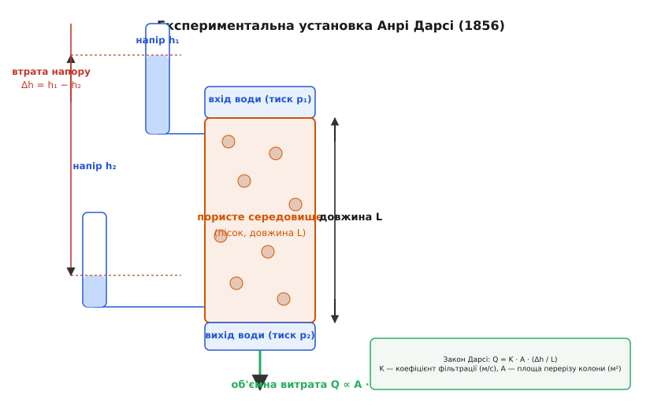
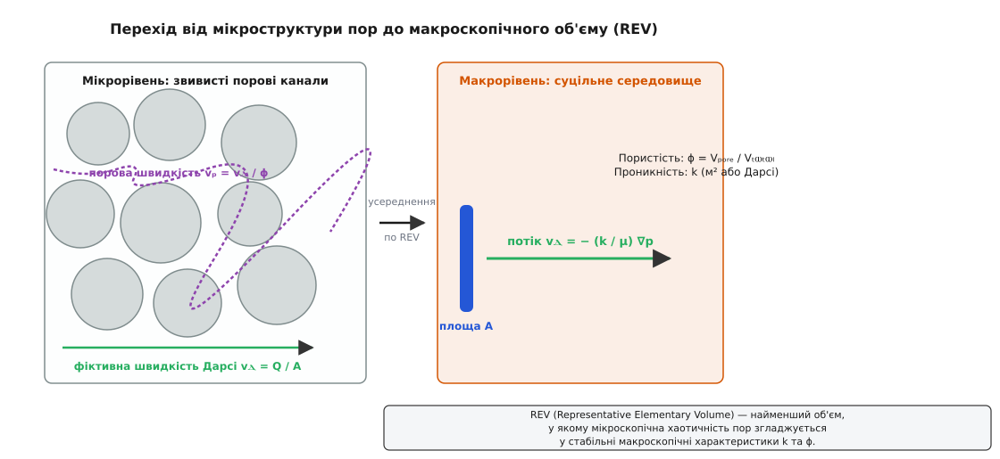
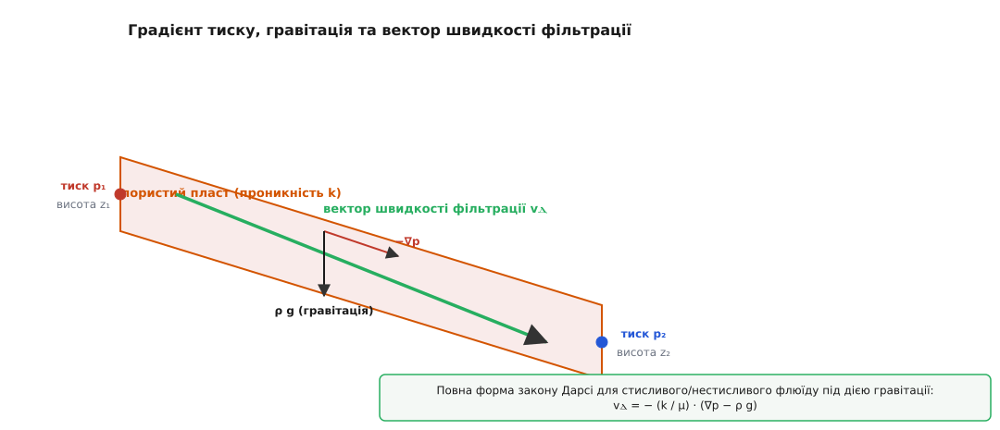
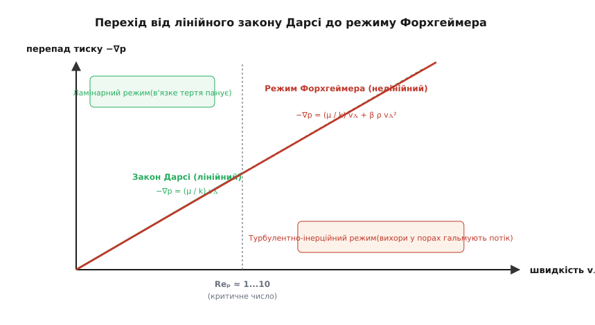
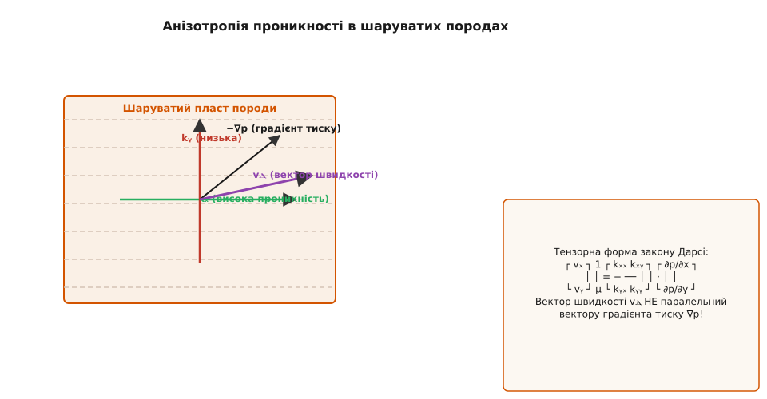

# Закон Дарсі

<preknowlist>
- [В'язкість](book:physics/viscosity) — внутрішнє тертя рідини: шари флюїду гальмують один одного під час зсуву; міра тертя — коефіцієнт динамічної в'язкості μ.
- [Тиск](book:physics/pressure) — сила на одиницю площі; різниця тисків штовхає рідину крізь пористе середовище.
- [Течія Пуазейля](book:physics/poiseuille-flow) — ламінарна течія в'язкої рідини у тонких циліндричних капілярах під дією перепаду тиску.
- [Рівняння Нав'є-Стокса](book:physics/navier-stokes) — фундаментальні диференціальні рівняння руху в'язкої суцільної рідини.
</preknowlist>

Спробуй продавити тонну води за хвилину крізь п'ятиметровий шар дрібного річкового піску під тиском в одну атмосферу. Кубометр піску виглядає абсолютно монолітним, важким та непорушним масивом, але між його окремими твердими зернами ховаються мільярди мікроскопічних порових каналів. Якщо у звичайній відкритій трубі вода тече суцільним потоком, а її гальмування визначається лише прилипанням до гладеньких стінок, то всередині пористого матеріалу флюїд мусить нескінченно розгалужуватися, огинати тисячі твердих перешкод і проштовхуватися крізь вузькі звивисті щілини. Загальна площа поверхні піщинок в одному кубометрі ґрунту сягає кількох тисяч квадратних метрів, створюючи велетенський в'язкий опір руху.

Розуміння того, за яким саме фізичним правилом рідини та гази проціджуються крізь ґрунт, гірські породи, штучні фільтри чи біологічні тканини живих організмів, тривалий час залишалося нерозв'язаною загадкою гідравліки. Відповідь знайшов у 1856 році французький інженер Анрі Дарсі, який досліджував роботу піщаних фільтрів для системи міського водопостачання міста Діжон. [Історичний експеримент Дарсі з вертикальною колоною піску](book:physics/mechanics/darcys-law/hist-darcy-dijon.md) заклав науковий фундамент нової фізичної дисципліни — підземної гідромеханіки та теорії фільтрації. Закон Дарсі став фундаментальним містком між мікроскопічним тертям флюїду в порах та макроскопічним рухом підземних вод, нафти у пластах і газів у пористих хімічних реакторах.

## Чому рідина в порах тече не так, як у вільній трубі

У відкритій трубі або каналі площа перерізу повністю відкрита для руху. Спроба описати рух води крізь пісок або ґрунт за допомогою стандартних гідравлічних формул провалюється одразу. Якщо зменшити радіус труби удвічі, [згідно із законом Пуазейля для капілярної течії](book:physics/poiseuille-flow), її пропускна здатність падає в 16 разів (у четвертому степені радіуса). Проте пористий матеріал — це не просто одна труба, а велетенська тривимірна сітка з мільйонів переплетених мікроскопічних капілярів довільної форми.

Коли флюїд рухається пористим середовищем, виникають три ключові фізичні чинники, принципово відсутні у вільній гідродинаміці відкритих потоків:

1. **Велетенська площа питомої поверхні** (від лат. *superficies* — поверхня). Тверда фаза (зерна піску, кристали породи, волокна фільтра) утворює гігантську контактну поверхню з рідиною. Оскільки біля кожної твердої стінки діє умова прилипання (швидкість рідини безпосередньо на поверхні твердого тіла дорівнює нулю), практично увесь об'єм рідини в порах перебуває у зоні інтенсивного в'язкого зсуву.
2. **Хаотична звивистість шляху** (*tortuosity*, від лат. *tortuosus* — покручений). Частинка рідини не може рухатися прямолінійно: вона змушена постійно змінювати напрямок, прискорюватися у вузьких порових шийках та сповільнюватися у розширених порових кавернах.
3. **Об'ємна пористість** (*porosity*, від грец. *порос* — отвір, шлях). Рідина рухається не крізь весь геометричний об'єм пласта `V`, а лише крізь його вільну порожнечу `V_pore`, яка становить лише частку загального об'єму.

У результаті взаємодії цих чинників швидкість руху рідини виявляється суворо лінійно пропорційною прикладеному перепаду тиску, але коефіцієнт пропорційності визначається не розміром самого пласта, а мікроскопічною геометрією його пор.


*Класичний експеримент Дарсі (1856): об'ємна витрата води Q через колону з піском виявилася суворо пропорційною площі перерізу A та втраті напору Δh і обернено пропорційною довжині шару L.*

## Формулювання закону: від об'ємної витрати до вектора фільтрації

Емпіричне відкриття Анрі Дарсі полягало у тому, що для ламінарного потоку рідини крізь шар піску об'ємна витрата `Q` (кількість кубічних метрів води, що проходить за секунду) описується простою лінійною співвідносністю:

```
Q = K · A · (Δh / L)
```

де:
- `Q` — об'ємна витрата рідини (м³/с);
- `A` — площа поперечного перерізу пористого зразка (м²);
- `Δh = h₁ − h₂` — різниця п'єзометричних напорів на вході та виході (м);
- `L` — довжина пористого зразка уздовж потоку (м);
- `K` — коефіцієнт фільтрації (м/с).

Проте у такій формі закон прив'язаний до конкретної рідини (води) та вертикального вимірювання напору. Для довільного флюїду (нафти, газу, розчинника) та довільного напрямку в просторі закон Дарсі переформульовують у диференціальній векторній формі, пов'язуючи **вектор швидкості фільтрації** `v_d` із градієнтом тиску `∇p`.

Виведемо векторне співвідношення крок за кроком. Згадаймо, що гідравлічний напір `h` пов'язаний із гідростатичним тиском `p`, густиною рідини `ρ` та висотою `z` співвідношенням `h = z + p / (ρ g)`:

```
Δh / L ≈ ∂h / ∂s = ∂/∂s (z + p / (ρ g))      [перехід до диференціальної форми]
```

Поділимо об'ємну витрату `Q` на площу перерізу `A`. Отриману величину `v_d = Q / A` називають **швидкістю фільтрації Дарсі** (або *вектором Дарсі*). Розділимо коефіцієнт фільтрації `K` на фізичні параметри рідини: `K = k · ρ · g / μ`, де `k` — внутрішня проникність середовища, а `μ` — динамічна в'язкість рідини:

```
v_d = Q / A
    = − K · (∂h / ∂s)                         [скалярна диференціальна форма]
    = − (k · ρ · g / μ) · ∂/∂s (z + p / (ρ g)) [підстановка K та напору h]
    = − (k / μ) · (∂p / ∂s + ρ g ∂z / ∂s)      [розкриття дужок]
```

Узагальнюючи цей вираз на тривимірний випадок для довільного поля тиску `p(x, y, z)` та вектора прискорення вільного падіння `g`, дістаємо **сучасну векторну форму закону Дарсі**:

```
v_d = − (k / μ) · (∇p − ρ g)
```

де:
- `v_d` — вектор швидкості фільтрації Дарсі (м/с);
- `k` — внутрішня проникність пористого середовища (м²);
- `μ` — динамічна в'язкість флюїду (Па·с);
- `∇p` — градієнт тиску у пористому середовищі (Па/м);
- `ρ g` — вектор масової сили тяжіння (Н/м³).

Знак «мінус» має глибокий фізичний сенс: рідина завжди тече у напрямку спадання гідравлічного потенціалу — від вищого тиску до нижчого.

> 🔧 **Навіщо це.** Векторна форма закону Дарсі дозволяє розраховувати рух підземних флюїдів у будь-яких напрямках — від вертикального спливання нафти під дією Архімедової сили до радіального притоку води до артезіанської свердловини. Знаючи проникність пласта `k` та в'язкість нафти `μ`, інженер може точно вирахувати, скільки барелів нафти видасть свердловина при заданій депресії тиску.

## Швидкість Дарсі проти дійсної швидкості в порах: концепція REV

Найпоширенішою помилкою при першому знайомстві із законом Дарсі є ототожнення швидкості фільтрації `v_d` із реальною швидкістю руху частинок рідини всередині пор.

Вектор `v_d = Q / A` — це **фіктивна (суцільна) швидкість**, розрахована на припущенні, ніби рідина тече крізь увесь суцільний переріз `A`, включаючи непроникні тверді зерна піску чи породи. Але ж тверді зерна зайняті матерією породи! Рідина фізично може бігти тільки крізь вільний поровий простір `A_pore`.

Порозділимо геометричний об'єм середовища на дві частини: об'єм пор `V_pore` та об'єм твердого каркаса `V_grain`. Відношення об'єму пор до загального об'єму називають **загальною пористістю** `ϕ`:

```
ϕ = V_pore / V
```

Оскільки суцільний переріз `A` у середньому має таку саму частку вільного простору `A_pore = ϕ · A`, дійсна середня швидкість рідини всередині пор — **порова (чистинна) швидкість** `v_p` — виявляється суттєво більшою за швидкість Дарсі:

```
v_p = Q / A_pore = Q / (ϕ · A) = v_d / ϕ
```

Оскільки пористість `ϕ` завжди менша за одиницю (для пісків та ґрунтів `ϕ ≈ 0.2...0.4`), реальні молекули води чи забрудника рухаються в порах у **3–5 разів швидше**, ніж показує швидкість Дарсі `v_d`!


*Концептуальний перехід від мікроскопічного хаосу покрокового огинання зерен до макроскопічного суцільного середовища через репрезентативний елементарний об'єм REV.*

Але як математично правомірно замінити мільярди окремих зерен суцільними характеристиками `k` та `ϕ`? Для цього у гідромеханіці пористих середовищ використовують концепцію **репрезентативного елементарного об'єму** (*Representative Elementary Volume*, REV).

REV — це найменший об'єм пористого середовища `V_REV`, який є достатньо великим, щоб усереднені характеристики (пористість `ϕ`, проникність `k`) перестали хаотично коливатися при зміні розміру тестового вікна, але водночас достатньо малим порівняно з макроскопічними розмірами всього пласта. [Детальне математичне виведення закону Дарсі з рівнянь Нав'є-Стокса шляхом об'ємного усереднення по REV](book:physics/mechanics/darcys-law/math-darcy-derivation.md) доводить, що закон Дарсі є суворим макроскопічним наслідком рівнянь Стокса для ламінарної течії.

Крім того, у порах виникає **гідродинамічна дисперсія**: через різну ширину каналів та умову прилипання на стінках частинки флюїду розмиваються вздовж потоку, створюючи розширюваний фронт змішування. Опис переносу домішок у пористому середовищі розраховується рівнянням конвекції-дисперсії:

```
∂C / ∂t = ∇ · (D_disp · ∇C) − v_d · ∇C
```

де `C` — концентрація домішки, а `D_disp` — тензор гідродинамічної дисперсії.

> 🔧 **Навіщо це.** Різниця між `v_d` та `v_p` критично важлива для екології та оцінки екологічних ризиків. Якщо на хімічному заводі стався витік токсичної речовини у ґрунт, розрахунок за швидкістю Дарсі `v_d` покаже, що отруйна пляма дійде до міського водозабору, наприклад, через 10 років. Але реальна порова швидкість `v_p = v_d / ϕ` при пористості `ϕ = 0.25` перенесе отруту вчотирьох швидше — всього за 2.5 роки!

## Проникність середовища та модель Кармана-Козені

Центральною величиною в законі Дарсі є **внутрішня проникність** `k`. На відміну від коефіцієнта фільтрації `K`, який залежить від в'язкості та густини конкретного флюїду, проникність `k` є чисто геометричною характеристикою самого пористого каркаса. Вона має розмірність площі (м²). [У довіднику одиниць проникності та обчислювальному інтерфейсі](book:physics/mechanics/darcys-law/api-permeability-units.md) наведено детальний аналіз геологічних одиниць (Дарсі, мілідарсі) та таблиці проникностей різних порід.

Звідки береться фізична величина `k` і чому для різних матеріалів вона змінюється у фантастичних межах — на 15 порядків (від `10⁻⁷` м² для грубого гравію до `10⁻²²` м² для монолітного граніту)?

Зв'язок між мікроскопічною геометрією зерен та макроскопічною проникністю пояснює **модель Кармана-Козені** (*Kozeny-Carman model*). У цій моделі пористий простір подається як пучок звивистих капілярних трубок із гідравлічним радіусом `r_h = ϕ / ((1 − ϕ) · S_v)`, де `S_v` — питома поверхня зерен.

Застосовуючи [закон Пуазейля для капілярного потоку](book:physics/poiseuille-flow) з урахуванням звивистості шляху `τ`, виводиться класична формула Кармана-Козені:

```
k = dₚ² · ϕ³ / (180 · (1 − ϕ)²)
```

де `dₚ` — середній діаметр зерен піску чи породи (м), а `ϕ` — пористість.

З цієї видатної формули випливають два фундаментальні фізичні закони геомеханіки:

1. **Квадратична залежність від розміру зерен (`k ∝ dₚ²`)**. Проникність визначається не загальним об'ємом порожнин, а розміром порових каналів! Дрібний пил або глина можуть мати таку саму або навіть більшу пористість `ϕ`, ніж грубий пісок (`35–45%`), але діаметр їхніх частинок `dₚ` у тисячу разів менший. Зменшення розміру зерен у 1000 разів зменшує проникність у `1000² = 1 000 000` (мільйон) разів! Саме тому глина є абсолютним водоупором, а пісок — чудовим водоносним горизонтом.
2. **Кубічна залежність від пористості (`k ∝ ϕ³`)**. Навіть невелике ущільнення ґрунту під вагою споруди або осідання пласта при видобутку нафти, що зменшує пористість з 30% до 15%, призводить до падіння проникності майоріти майже в 10 разів.

Крім того, на проникність суттєво впливає ступінь відсортованості зерен: якщо порода містить суміш великих і дрібних частинок, дрібний пил забиває простір між великими зернами, різко знижуючи підсумкову проникність. Ідеальне кубічне упакування кульок одинакового радіуса дає пористість `47.6%`, а щільне ромбоедричне упакування — `25.9%`.

## Багатофазна фільтрація та відносна проникність

У багатьох геологічних та інженерних процесах крізь один і той самий пористий пласт одночасно рухаються дві або більше несмішуваних рідин — наприклад, вода та нафта, або вода та газ. У таких умовах флюїди починають конкурентну боротьбу за порові канали.

Змочувальна рідина (звичайно вода) прагне зайняти найдрібніші капілярні пори біля стінок зерен, тоді як незмочувальна рідина (нафта чи газ) відтісняється у ширші центральні порові канали.

Для опису сумісного руху двох флюїдів закон Дарсі узагальнюють за допомогою концепції **фазових (відносних) проникностей**:

```
v_w = − (k · k_rw(S_w) / μ_w) · ∇p_w     [швидкість фільтрації води]
v_o = − (k · k_ro(S_w) / μ_o) · ∇p_o     [швидкість фільтрації нафти]
```

де `k_rw(S_w)` та `k_ro(S_w)` — безрозмірні **відносні фазові проникності** води та нафти, які залежать від поточного ступеня насичення пор водою `S_w` (від 0 до 1).

Сума відносних проникностей `k_rw + k_ro` завжди менша за одиницю. Це означає, що сумісний рух двох флюїдів крізь пори завжди відбувається з більшим опором, ніж рух одного чистого флюїду, через постійне утворення капілярних менисків та затискання крапель у звуженнях пор (капілярний заслон або ефект Джамена).

## Гравітація, градієнт напору та тривимірне фільтраційне поле

У реальних підземних водоносних пластах та нафтових родовищах флюїд рухається не лише під дією штучного перепаду тиску `∇p`, але й під впливом власної ваги в полі тяжіння Землі.

Для опису сумісної дії тиску та гравітації введено поняття **п'єзометричного (гідравлічного) напору** `h`:

```
h = z + p / (ρ g)
```

де `z` — геодезична висота точки над прийнятим рівнем відліку (м), `p` — тиск (Па), `ρ` — густина флюїду (кг/м³), `g` — прискорення вільного падіння (м/с²).

Тоді вектор швидкості Дарсі виражається через градієнт напору `∇h`:

```
v_d = − K · ∇h = − (k · ρ · g / μ) · ∇ (z + p / (ρ g))
```

Якщо флюїд є нестисливим (`ρ = const`), а пористе середовище — однорідним та ізотропним, то з рівняння нерозривності несжимальної рідини `∇ · v_d = 0` випливає знамените **рівняння Лапласа для гідравлічного напору**:

```
∇ · v_d = 0
⇒ ∇ · (− K ∇h) = 0
⇒ ∇²h = ∂²h/∂x² + ∂²h/∂y² + ∂²h/∂z² = 0
```

Це означає, що поле гідравлічного напору в однорідному пористому середовищі є **потенціальним полем**, аналогічним електростатичному полю чи полю стаціонарної теплопровідності. Лінії рівного напору (ізоп'єзи) утворюють ортогональну сітку з лініями току фільтрації.

Для аналізу притоку води до відкачувальної свердловини в безнапірному водоносній горизонті використовують **формулу Дюпюї-Тіма**:

```
Q = π · K · (h₂² − h₁²) / ln(r₂ / r₁)
```

вона показує форму депресійної лійки підземних вод довкола працюючої свердловини.


*Рівновага сил у похилому пласті: вектор швидкості фільтрації vⲇ визначається сумарною дією градієнта тиску −∇p та масової сили тяжіння ρg.*

Проте у геологічних пластах проникність рідко буває постійною. Якщо проникність змінюється у просторі `k(x, y, z)`, рівняння фільтрації стає гетерогенним:

```
∇ · ( (k(x,y,z) / μ) · ∇p ) = 0
```

Для чисельного розв'язання таких рівнянь у складнопористах пластах застосовують спеціальні сіткові методи. [У практичному проекті чисельного моделювання фільтрації ґрунтових вод](book:physics/mechanics/darcys-law/proj-groundwater-solver.md) наведено детальний розв'язувач методом скінченних різниць мовами C та C++, який моделює згинання потоку підземних вод довкола непроникного глиняного бар'єра.

> 🔧 **Навіщо це.** Потенціальний характер поля фільтрації дозволяє інженерам-будівельникам будувати гідродинамічні сітки фільтрації під греблями та дамбами. Якщо під бетонною дамбою виникає занадто крутий градієнт напору `∇h`, висока швидкість фільтрації може вимити дрібні частинки піску з-під фундаменту (явище *механічного суфозійного розмиву* або *піпінгу*), що призведе до раптової катастрофічної руйнації греблі.

## Межі застосовності: число Рейнольдса та ефект Клінкенберга

Закон Дарсі — це лінійний наближений закон, який чудово працює у переважній більшості природних умов. Проте, як і будь-яка фізична модель, він має чітко окреслені межі застосовності.

### 1. Інерційні ефекти та нелінійний режим Форхгеймера
Закон Дарсі виведений на припущенні, що потік у порах є чисто ламінарним, а інерційними членами Нав'є-Стокса можна знехтувати (`Reₚ ≪ 1`).

Введемо **число Рейнольдса для пористого середовища** `Reₚ`:

```
Reₚ = (ρ · v_d · dₚ) / μ
```

де `dₚ` — середній діаметр зерен або характерний розмір пор.

- При `Reₚ < 1...10`: Панує в'язке тертя, закон Дарсі суворо лінійний.
- При `Reₚ > 10`: Вузькі порові канали створюють мікроскопічні інерційні вихори і відриви потоку. Тік перестає бути суворо ламінарним.

Для опису високошвидкісних потоків (наприклад, у зонах поблизу вибоїв газових свердловин або у великоуламкових гравійних фільтрах) використовують нелінійне **рівняння Форхгеймера** (Philipp Forchheimer, 1901):

```
− ∇p = (μ / k) · v_d + β · ρ · v_d²
```

де `β` — коефіцієнт інерційного опору породи (м⁻¹). При малих швидкостях `v_d` квадратичний член `β ρ v_d²` є мізерним і рівняння Форхгеймера переходить у класичний закон Дарсі.


*Графік залежності перепаду тиску −∇p від швидкості фільтрації vⲇ: відхилення від лінійного закону Дарсі у бік параболічної кривої Форхгеймера при зростанні числа Рейнольдса Reₚ > 10.*

### 2. Газовий ефект ковзання Клінкенберга
Коли крізь дрібнопористо середовище (наприклад, щільний сланець із розміром пор у кілька нанометрів) фільтрується газ при низьких тисках, середня довжина вільного пробігу молекул газу `λ` стає порівнянною з діаметром пор `d_pore` (високе число Кнудсена `Kn = λ / d_pore`).

У цьому випадку молекули газу перестають прилипати до стінок пор, виникає ефект «газового ковзання». Американський інженер Ліндон Клінкенберг (Lindenthal Klinkenberg, 1941) виявив, що виміряна проникність породи по газу `k_gas` виявляється більшою за істинну проникність по рідині `k_liquid`:

```
k_gas = k_liquid · (1 + b_K / p_mean)
```

де `p_mean` — середній тиск газу в порах, а `b_K` — коефіцієнт ковзання Клінкенберга. При нескінченно високому тиску (`p_mean → ∞`) газ стискається, довжина вільного пробігу прямує до нуля, і екстраполювати `k_gas` дає істинну рідинну проникність `k_liquid`.

### 3. Початковий градієнт у глинах
У надзвичайно щільних глинах із високим вмістом зв'язаної адсорбованої води тонкі плівки води біля поверхонь глинистих мінералів набувають в'язко-пластичних властивостей. Для початку фільтрації потрібно прикласти деякий **початковий критичний градієнт тиску** `G₀`. Поки `|∇p| < G₀`, рідина взагалі не рухається (`v_d = 0`).

## Анізотропія та тензор проникності в геологічних пластах

У реальних геологічних умовах гірські породи формувалися шляхом пошарового осадження наносів протягом мільйонів років. Шаруваті пісковики, сланці та осадові товщі мають виражену **анізотропію** фільтраційних властивостей (*anisotropy*, від грец. *а-нізос-тропос* — не однакові напрямки).

Уждовж шарів осадження (горизонтальний напрямок `x`) порові канали є широкими та безперервними, тоді як у напрямку, перпендикулярному до шаруватості (вертикальний напрямок `y`), потік мусить пробиватися крізь тонкі прошарки глини та мулу.

У таких середовищах проникність описується не скаляром `k`, а **симетричним тензором другого рангу** `k_ij`:

```
┌ k_xx  k_xy  k_xz ┐
k_ij  =  │ k_yx  k_yy  k_yz │
└ k_zx  k_zy  k_zz ┘
```

Векторний закон Дарсі для анізотропного середовища набуває вигляду:

```
v_i = − (1 / μ) · ∑_j k_ij · (∂p / ∂x_j − ρ g_j)
```

Або у матрично-векторній формі у 2D-просторі:

```
┌ v_x ┐       1   ┌ k_xx  k_xy ┐   ┌ ∂p/∂x − ρ g_x ┐
│     │  =  − ──  │            │ · │               │
└ v_y ┘       μ   └ k_yx  k_yy ┘   └ ∂p/∂y − ρ g_y ┘
```

Головна фізична особливість анізотропного фільтраційного поля полягає у тому, що **вектор швидкості фільтрації `v_d` взагалі не паралельний вектору градієнта тиску `−∇p`**! Рідина відхиляється у бік найбільшої проникності. Якщо штовхати воду під кутом до шарів породи, вона повертатиме уздовж пластів, де опір рухові є найменшим.


*Анізотропія у шаруватому пласті: відхилення вектора швидкості фільтрації vⲇ від вектора градієнта тиску −∇p у бік напрямку максимальної проникності kₓ.*

Якщо орієнтувати осі координат уздовж головних осей анізотропії пласта, тензор стає діагональним з головними значеннями `k_x`, `k_y`, `k_z`. Для типових осадових родовищ відношення горизонтальної проникності до вертикальної становить `k_x / k_y ≈ 2...10`, а у шаруватих сланцях може досягати `100` і більше.

> 🔧 **Навіщо це.** Анізотропія визначає стратегію розробки родовищ та буріння свердловин. Оскільки вертикальна проникність `k_y` у сланцевих пластах дуже мала, вертикальна свердловина дасть мізерний приплив газу. Для ефективного видобутку нафтовики бурять горизонтальні свердловини завдовжки 2–3 кілометри уздовж шару з високою проникністю `k_x` та проводять гідравлічний розрив пласта (гідророзрив), створюючи штучні високопроникні тріщини.

## Сучасна інженерія фільтрації та природні масштаби

Закон Дарсі є фундаментальним інструментом у найрізноманітніших галузях сучасної науки та технологій, охоплюючи масштаби від мікрометрів до десятків кілометрів:

- **Гідрогеологія та водопостачання**: Моделювання депресійних лійок колодязів та свердловин, оцінка запасів підземних питних вод, захист водоносних горизонтів від промислового забруднення, проектування дренажних систем стадіонів та тунелів метрополітену.
- **Розробка нафтогазових родовищ**: Тривимірне гідродинамічне моделювання пластів, прогнозування виснаження покладів, вимушене заводнення для витіснення нафти до видобувних свердловин, CO₂-підвищення нафтовіддачі.
- **Екологічна інженерія та уловлювання вуглецю (CCS)**: Закачування мільйонів тонн вуглекислого газу `CO₂` у глибокі водоносні горизонти для запобігання глобальному потеплінню; розрахунок надійності підземних сховищ ядерних відходів у глинистих пластах на сотні тисяч років.
- **Геотехніка та дамбобудування**: Розрахунок швидкості консолідації та ущільнення вологих ґрунтів під фундаментом хмарочосів, оцінка стійкості земляних дамб, запобігання зсувам зсувонебезпечних схилів під час злив.
- **Хімічна технологія та матеріалознавство**: Фільтрація суспензій крізь мембрани, рух реагентів у каталітичних шарах з нерухомим шаром насадки, проектування паливних елементів (*PEM fuel cells*), де водень і кисень дифундують крізь пористі вуглецеві електроди.
- **Біомедична інженерія**: Моделювання фільтрації плазми крові крізь стінки капілярів та ниркові мембрани, рух міжклітинної рідини у пористих тканинах печінки та пухлин під час адресної доставки ліків.

Просте рівняння, отримане Анрі Дарсі при вимірюванні проціджування води крізь пісок у саду Діжона, виявилося універсальним фізичним законом, що описує гармонійний рух флюїдів у пористому світі нашої планети.
