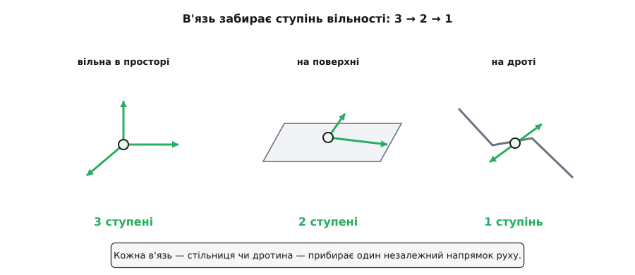
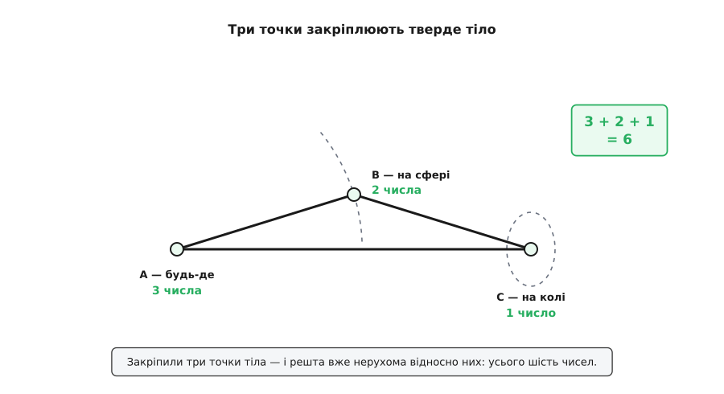
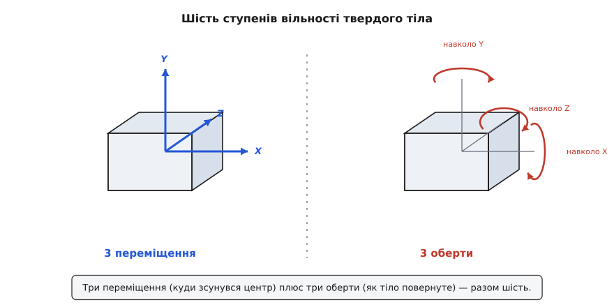

# Ступені вільності

<preknowlist>
- [Положення і радіус-вектор](topic:physics/position) — щоб точно вказати місце точки в просторі, потрібно три числа (координати x, y, z) відносно обраного початку.
</preknowlist>

Візьми будь-яку річ і спробуй сказати про неї все — не «десь отам», а точно, щоб не лишилося жодної недомовки: де вона й як повернута. Скільки чисел на це піде? Виявляється, кожній системі відповідає одне цілком певне число — не більше й не менше, — і воно каже про неї на диво багато: скільки рівнянь опишуть її рух, скільки двигунів треба, щоб нею керувати, навіть скільки тепла вона здатна в собі втримати. Це число і є **ступені вільності**.

## Одна точка: рівно три

Почнімо з найпростішого — з однієї точки, скажімо намистинки у порожньому просторі. Щоб сказати, де вона, [треба три числа](topic:physics/position): скільки праворуч, скільки вперед, скільки вгору від якогось нуля. Двох замало — двома числами ти означиш хіба вертикальну пряму, а на ній намистинка ще вільна ковзати вгору-вниз, місце не зафіксоване. Чотирьох забагато — третє число вже все визначило, четвертому нема чого додати. Рівно три, ні на одне менше чи більше.

Кажуть: вільна точка в просторі має **три ступені вільності**. Назва буквальна (калька з англ. degree of freedom — «ступінь свободи»): кожен ступінь — це окремий незалежний напрямок, у якому точка ще вільна зрушити. Три ступені — бо саме три таких незалежних напрямки, і жодного зайвого.

## В'язь забирає ступінь

Тепер поклади намистинку на стіл. Висота більше не вільна — стільниця тримає її на своєму рівні, число «вгору» задане наперед. Лишаються два: рухайся по стільниці куди хоч, але зі стільниці не зійдеш. Два ступені вільності. Настроми ту саму намистинку на пряму дротину — і волі стане ще менше: єдине, що можна, — совати її вздовж дроту, одне-єдине число. Один ступінь.

Проступає правило. Кожна така прив'язь — стільниця, дротина — це насправді рівняння, що зв'язує координати між собою («висота стала», «тримайся кривої дроту»). Таку прив'язь звуть **в'яззю**, і кожна незалежна в'язь забирає рівно один ступінь вільності:

```
ступені вільності = скільки всього координат − скільки незалежних в'язей
```


*Та сама намистинка: вільна в просторі — три ступені; на поверхні — два; на дроті — один. Кожна в'язь відбирає один незалежний напрямок руху.*

## Тверде тіло: завжди шість

Із однієї точки картина розростається сама. N вільних точок — це 3N чисел, бо кожна носить свою трійку координат, отже 3N ступенів вільності. З'єднай дві точки жорстким стрижнем — накладеш одну в'язь (відстань між ними стала), і з шести чисел лишиться п'ять.

А тепер головне питання: скільки ступенів вільності у справжнього тіла — цеглини, дрона, планети? У ньому точок незліченно, отже координат ніби 3 × безліч. Проте воля такого тіла скінченна й мала. Тіло, всі точки якого тримаються на незмінних взаємних відстанях і рухаються як одне ціле, звуть [твердим](topic:physics/rigid-body), і саме ця незмінність відстаней усе й вирішує.

Порахуймо його волю, чіпляючись лише за три точки самого тіла (не на одній прямій). Перша точка вільна стати будь-де — три числа. Друга зв'язана з першою сталою відстанню, тож блукати може лише поверхнею сфери навколо неї — а щоб указати місце на сфері, досить двох чисел. Третя тримається сталої відстані одразу до двох перших, тому їй лишається саме коло — одне число. Складаємо:

```
3 + 2 + 1 = 6
```

Щойно ці три точки закріплено, кожна інша точка тіла вже не має куди подітися — уся цеглина визначена. Виходить, будь-яке тверде тіло, хоч яке велике й складне, має рівно **шість ступенів вільності**: три кажуть, *де* тіло (куди зсунувся його центр по трьох осях), три — *як* воно повернуте (нахил у трьох незалежних площинах). Три на переміщення, три на оберт — і по всьому. (Наївний підрахунок в'язей для тіла з багатьох точок дає інше, надто велике число, бо в'язі перестають бути незалежними; чому строго виходить саме шістка й скільки ступенів мають шарнірні механізми — у [математиці підрахунку ступенів](topic:physics/degrees-of-freedom/math-counting-constraints.md).)


*Три точки твердого тіла закріплюють його повністю: перша вільна (3), друга прив'язана відстанню — на сфері (2), третя — на колі (1). Разом шість, і решта тіла вже нерухома відносно них.*


*Шість ступенів вільності твердого тіла: три переміщення (вздовж X, Y, Z) і три оберти (навколо X, Y, Z). Будь-який рух тіла — це їхня суміш.*

## Скільки чисел — стільки й опису

Ті шість чисел не конче мусять бути координатами трьох точок. Можна взяти будь-які шість зручних незалежних величин — три координати центра тіла плюс три кути повороту, — і вони опишуть його рівно так само повно. Ця свобода вибору й є суть **узагальнених координат**: беремо стільки добре дібраних чисел, скільки в системи ступенів вільності, і жодної в'язі виписувати вже не треба — заборонених станів ми просто ніколи й не записали. На цьому стоїть уся [лагранжева механіка](topic:physics/least-action-principle): задай систему узагальненими координатами — по одній на ступінь вільності — і рівняння руху випливуть із єдиної вимоги, щоб дія була найменшою.

> 🔧 **Навіщо це.** Число ступенів вільності — це кошторис керування. Роборука з шістьма приводами дотягнеться до будь-якої точки під будь-яким кутом, бо в неї рівно шість ступенів; із п'ятьма — вже ні, одного напрямку забракне. Дрон має всі шість ступенів вільності, а моторів у нього лише чотири — керованих величин менше, ніж напрямків руху, тож він не полетить убік, спершу не нахилившись. Цю нестачу звуть недокерованістю, і всі хитрощі його автопілота ростуть саме з неї.

Те саме число несподівано виринає й там, де про рух наче й не йдеться, — у теплі. Кожен незалежний ступінь вільності в середньому вбирає однакову пайку теплової енергії, тож одноатомний газ, який уміє лише летіти (три ступені), і двоатомна молекула, яка ще й перекидається, гріються по-різному — і різницю в їхній теплоємності диктує саме цей підрахунок ступенів. Колись він ледь не розвалив класичну фізику: виміряне тепло газів уперто не сходилося з очікуваним числом ступенів, і причину — що на холоді частина ступенів наче «замерзає» — знайшла аж [квантова теорія](topic:physics/degrees-of-freedom/hist-freezing-out.md). А чому пайка на кожен ступінь однакова, розбирає [теорема рівнорозподілу](topic:physics/equipartition-theorem).
