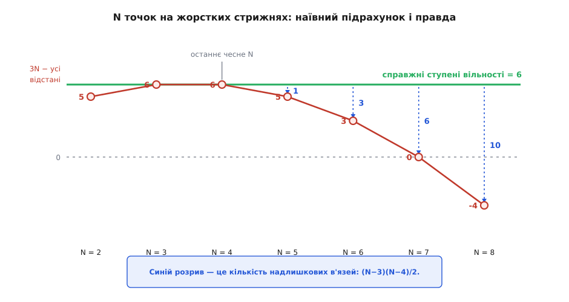
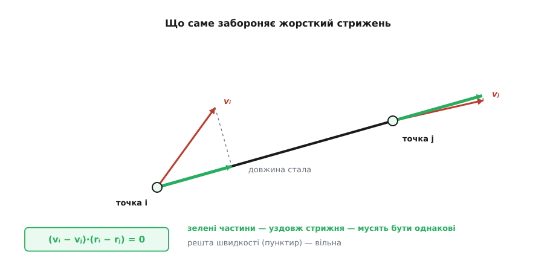
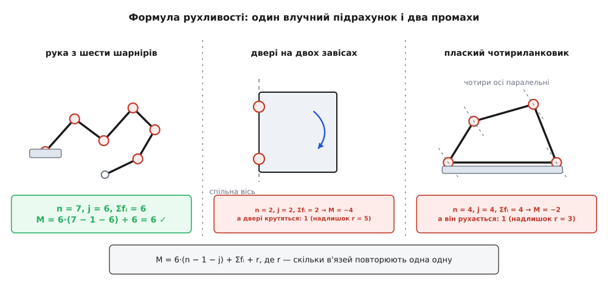

# 🧮 Не кількість в'язей, а їхній ранг: звідки береться шістка

Правило «координати мінус в'язі» ламається зовсім поруч: для п'яти точок, попарно скріплених жорсткими стрижнями, воно дає п'ять ступенів вільності замість шести, а для восьми — мінус чотири, число, яке взагалі нічого не означає. Віднімати таки треба, але не кількість в'язей, а їхній **ранг**. Нижче — точне правило замість наївного, доведення шістки з першого принципу й формула, якою рахують ступені шарнірних механізмів, разом із двома випадками, де бреше вже вона.

## Арифметика, що йде вниз

Візьмімо N точок і скріпімо кожну з кожною жорстким стрижнем — так, щоб усі попарні відстані стали закріпленими. Координат тут 3N, а в'язей стільки, скільки пар:

```
пар із N точок = N·(N−1)/2
```

Далі просте віднімання:

```
N    координат 3N    в'язей N(N−1)/2    3N − в'язі
2         6                 1                5
3         9                 3                6
4        12                 6                6
5        15                10                5
6        18                15                3
7        21                21                0
8        24                28               −4
```

Перші три рядки правдиві. Дві точки на стрижні — це гантель: три числа на її середину, два на напрямок стрижня, а крутити гантель навколо власної осі нема сенсу — разом п'ять. Три точки — жорсткий трикутник, повноцінне тверде тіло, шість. Чотири — тетраедр, теж шість, і наївний підрахунок ще влучає точно.

А з п'ятої точки починається нісенітниця. Причепити до готового тетраедра ще одну точку — це ніяк не може **зменшити** його волю: тетраедр уже твердий, у нього шість ступенів, і п'ята точка просто їде разом із ним, нічого не відбираючи. Проте таблиця каже «п'ять». Отже, з десяти в'язей п'яти точок працюють дев'ять, а десята — порожній звук: вона повторює те, що вже сказали інші. Далі повторів більшає, підрахунок сповзає в нуль і за нуль, а справжня воля тіла так і лишається шісткою.


*Наївне віднімання збігається з правдою лише до чотирьох точок. Далі розрив між зеленою прямою і червоною кривою — це і є кількість в'язей, які повторюють інші.*

## Що означає «незалежні»

Слово «незалежні» треба означити так, щоб його можна було порахувати. Запишімо стан системи одним стовпчиком чисел q = (x₁, y₁, z₁, …, x_N, y_N, z_N) — усього n = 3N координат, — а кожну в'язь як рівняння g(q) = 0. Для стрижня між точками i та j зручно брати квадрат довжини:

```
g_ij(q) = (rᵢ − rⱼ)·(rᵢ − rⱼ) − d²ᵢⱼ = 0
```

Квадрат, а не сам корінь, — щоб функція була многочленом і гладко диференціювалася скрізь; множина розв'язків від цього не змінюється.

Дозволені стани — це спільні нулі всіх g. Скільки в цієї множини вимірів? Відповідь дає похідна. Складімо матрицю часткових похідних усіх в'язей за всіма координатами (її звуть матрицею Якобі): рядків у ній стільки, скільки в'язей, стовпчиків — скільки координат.

```
рядок в'язі (i,j):   ∂g_ij/∂rᵢ = +2·(rᵢ − rⱼ)
                     ∂g_ij/∂rⱼ = −2·(rᵢ − rⱼ)
                     решта стовпчиків — нулі
```

Якщо в околі точки ранг цієї матриці сталий і дорівнює rk, то множина розв'язків поблизу — гладка поверхня розмірності n − rk. Це [теорема про неявну функцію](book:math/implicit-function-theorem) у формі про сталий ранг: рівняння, узяті разом, з'їдають рівно стільки вимірів, скільки незалежних напрямків є в їхніх похідних. Отже:

```
ступені вільності = кількість координат − ранг матриці в'язей
```

[Ранг](book:math/matrix-rank) — це кількість лінійно незалежних рядків матриці; рядок, який є сумою інших рядків із якимись коефіцієнтами, ранг не збільшує. Ось точний зміст слова, якого бракувало наївній формулі: важить не «скільки написано рівнянь», а «скільки серед них лінійно незалежних саме тут».

## Що саме забороняє один стрижень

Ранг зручніше рахувати з протилежного боку — через ядро, тобто через набір швидкостей, які всі в'язі разом дозволяють. Продиференціюймо в'язь по часу вздовж будь-якого руху:

```
d/dt [ (rᵢ − rⱼ)·(rᵢ − rⱼ) ] = 2·(vᵢ − vⱼ)·(rᵢ − rⱼ) = 0
```

Прочитаймо це геометрично. Скалярний добуток на (rᵢ − rⱼ) — це проєкція на напрямок стрижня. Умова каже: **проєкції швидкостей двох кінців на сам стрижень мусять бути однакові**. Інакше кінці розходилися б або збігалися — а довжина закріплена. Про поперечні складові швидкостей в'язь не каже нічого: вони вільні.


*Уся заборона від жорсткого стрижня — рівність двох зелених проєкцій. Поперечні частини швидкостей стрижень не обмежує.*

Отже ядро матриці — це всі поля швидкостей (v₁ … v_N), для яких така рівність виконана на кожній парі. Розмірність ядра і є число ступенів вільності, а ранг — доповнення до 3N.

## Ядро — це рівно рухи твердого тіла

Одне сімейство розв'язків видно одразу:

```
vᵢ = a + ω × rᵢ
```

— рівномірне перенесення зі швидкістю a плюс обертання з кутовою швидкістю ω (докладно про це поле — у [v = ω × r](book:physics/angular-velocity/math-omega-cross-r.md): швидкість точки обертового тіла дорівнює векторному добутку кутової швидкості на радіус-вектор). Перевірка миттєва: різниця vᵢ − vⱼ = ω × (rᵢ − rⱼ), а [векторний добуток](book:math/cross-product) перпендикулярний до обох своїх множників, тож його скалярний добуток на (rᵢ − rⱼ) дорівнює нулю.

Параметрів тут шість: три в a, три в ω. І жоден не зайвий — різні пари (a, ω) дають різні поля, якщо точки не лежать на одній прямій: якби a + ω × rᵢ = 0 для всіх i, то ω × (rᵢ − rⱼ) = 0, тобто ω був би паралельний до кожного взаємного напрямку; але таких напрямків, що напинають простір, три, отже ω = 0, а тоді й a = 0.

Тож ядро має щонайменше шість вимірів. Тепер головне — що більше в ньому нічого нема.

**Твердження.** Якщо точки не лежать усі в одній площині, кожне поле швидкостей із ядра має вигляд vᵢ = a + ω × rᵢ.

*Доведення.* Оберімо точку 1 за опорну й перейдімо до різниць: uᵢ = rᵢ − r₁, wᵢ = vᵢ − v₁ (тоді u₁ = 0 і w₁ = 0). Умова на пару від такого зсуву не змінюється, бо в неї входять самі різниці:

```
(wᵢ − wⱼ)·(uᵢ − uⱼ) = 0
```

*Крок 1.* Пара (i, 1) дає одразу:

```
wᵢ·uᵢ = 0
```

Швидкість кожної точки, узята відносно опорної, перпендикулярна до її ж радіуса, проведеного з опорної точки.

*Крок 2.* Розкриймо загальну пару й викиньмо два нулі з кроку 1:

```
wᵢ·uᵢ − wᵢ·uⱼ − wⱼ·uᵢ + wⱼ·uⱼ = 0
wᵢ·uⱼ + wⱼ·uᵢ = 0                    (★)
```

Число wᵢ·uⱼ міняє знак, коли переставити індекси. Це вже дуже жорстка умова: саме так поводиться кососиметрична форма.

*Крок 3.* Точки не лежать в одній площині, тож серед u₂ … u_N знайдуться три лінійно незалежні — назвімо їх u_a, u_b, u_c; це базис простору. Задаймо [лінійне відображення](book:math/linear-map) A рівностями A u_a = w_a, A u_b = w_b, A u_c = w_c (на базисі значення задано, далі відображення визначене однозначно). Для будь-якого x = c_a·u_a + c_b·u_b + c_c·u_c розкриймо:

```
x·(A x) = Σᵢⱼ cᵢ·cⱼ·(wᵢ·uⱼ)
```

Доданки з однаковими індексами нульові за кроком 1, а доданки з різними скорочуються попарно за (★). Отже x·(A x) = 0 для всіх x, а це і є означення кососиметричності. Кожну кососиметричну матрицю 3×3 можна записати як векторний добуток: A x = ω × x з єдиним ω.

*Крок 4.* Лишилося показати, що й решта точок слухаються того самого ω. Поле ω × uₖ саме задовольняє (★), бо

```
(ω × uᵢ)·uⱼ + (ω × uⱼ)·uᵢ = ω·(uᵢ × uⱼ) + ω·(uⱼ × uᵢ) = 0
```

а (★) лінійна за w. Тому й різниця zₖ = wₖ − ω × uₖ їй підкоряється:

```
zₖ·uᵢ + zᵢ·uₖ = 0
```

Для базисних i маємо zᵢ = 0 просто за побудовою A, тож zₖ·uᵢ = 0 для всіх трьох базисних напрямків. Вектор, ортогональний до трьох напрямків, що напинають простір, — нульовий. Отже zₖ = 0, тобто

```
vₖ = v₁ + ω × (rₖ − r₁)
```

а це і є рух твердого тіла: перенесення зі швидкістю v₁ плюс оберт навколо опорної точки. ∎

Варто спинитися на тому, що сталося. У вихідних рівняннях не було ані слова про обертання — самі лише скалярні добутки й вимога, щоб довжини не мінялися. Обертання вискочило звідти саме, як єдина форма, сумісна зі сталістю всіх відстаней.

## Ранг, надлишок і закономірність

Ядро шестивимірне — отже ранг матриці в'язей дорівнює 3N − 6, і саме стільки в'язей із написаних працюють. Різниця між написаним і робочим:

```
надлишок = N(N−1)/2 − (3N − 6)
         = (N² − N − 6N + 12)/2
         = (N² − 7N + 12)/2
         = (N−3)·(N−4)/2
```

Формула сама пояснює таблицю з початку. Для N = 3 і N = 4 надлишок нульовий — саме тому наївний підрахунок правильно бере і трикутник, і тетраедр, а далі вже ні. Для п'яти точок надлишок 1, для шести 3, для восьми 10. Для двадцяти точок написано 190 в'язей, працюють 54, зайвих 136.

Та сама викладка в площині: плоске тіло має три ступені (два переміщення й один оберт), ранг матриці дорівнює 2N − 3, а надлишок — (N−2)(N−3)/2, тобто перший зайвий стрижень з'являється вже на чотирьох точках. У d вимірах тверде тіло має d(d+1)/2 ступенів — d переміщень плюс d(d−1)/2 незалежних площин обертання, — а надлишок дорівнює (N−d)(N−d−1)/2. Тривимірний випадок — просто d = 3.

## Алгебра надлишку: п'ята точка і два корені

Ранг сказав, що з десяти відстаней п'яти точок одна зайва. Алгебра каже те саме конкретніше: між цими десятьма числами існує рівно одне рівняння, і його можна виписати.

Об'єм тетраедра виражається самими лише довжинами ребер — через [визначник](book:math/matrix-determinant), який 1841 року знайшов Артур Кейлі, розбираючи саме питання про відстані між п'ятьма точками, а 1928-го Карл Менґер поклав в основу метричної геометрії (обидві дати документовані, атрибуція усталена):

```
        | 0     1      1      1      1   |
        | 1     0    d₁₂²   d₁₃²   d₁₄²  |
288·V² =| 1   d₁₂²    0     d₂₃²   d₂₄²  |
        | 1   d₁₃²   d₂₃²    0     d₃₄²  |
        | 1   d₁₄²   d₂₄²   d₃₄²    0    |
```

**Перевірка на зручному тетраедрі.** Точки (0,0,0), (4,0,0), (0,3,0), (0,0,5):

```
d₁₂² = 16    d₁₃² = 9     d₁₄² = 25
d₂₃² = 25    d₂₄² = 41    d₃₄² = 34

об'єм:      V = (1/6)·4·3·5 = 10
визначник:  28800 = 288·10²   ✓
```

Тепер додаймо п'яту точку. Той самий визначник, тільки 6×6 і для п'яти точок, дає «об'єм» чотиривимірного симплекса. У тривимірному просторі п'ять точок такого тіла не напнуть — об'єм нульовий. Звідси й береться те єдине рівняння, якому підкоряються десять відстаней.

**Скільки в нього коренів.** Візьмімо п'яту точку (2,1,1) і вважаймо відомими дев'ять відстаней — шість тетраедрових і три від нової точки до перших трьох:

```
d₁₅² = 6     d₂₅² = 6     d₃₅² = 9
```

Невідома одна: x = d₄₅². Підставмо її в шестирядковий визначник і прирівняймо до нуля — виходить квадратний многочлен:

```
576·(x² − 62x + 861) = 0
x = (62 ± √(62² − 4·861))/2 = (62 ± √400)/2 = (62 ± 20)/2

x₁ = 21      x₂ = 41
```

Обидва корені справжні й обидва впізнавані. 21 — це квадрат відстані від (0,0,5) до нашої точки (2,1,1). А 41 — до точки (2,1,−1), дзеркального відбиття нашої в площині трьох перших точок. Три задані відстані до точок 1, 2 і 3 не розрізняють точку та її дзеркало, і десята відстань лише вибирає одну з двох.

Ось чому десята в'язь не забирає ступеня вільності: вона не звужує неперервний набір положень, а робить вибір із двох. Вибір із двох — це нуль вимірів.


*Дев'ять відстаней лишають для десятої рівно два значення — точка та її дзеркало. Дискретний вибір нового виміру не створює, тож десята в'язь ранг не збільшує.*

## Виродження в інший бік

Ранг рахує заборони лише в першому порядку — на рівні швидкостей. Буває й навпаки: швидкість дозволена, а справжнього руху нема, бо він гальмується вже на другому порядку. Тоді n − ранг дає завелике число, і винна вже не залежність в'язей, а сама конфігурація.

Найпростіший приклад — точки на одній прямій. Усі стрижні напрямлені однаково, тож умова каже лише, що поздовжні складові всіх швидкостей рівні; поперечні вільні геть усі. Ядро тоді має 1 + 2N вимірів (для чотирьох точок аж дев'ять), тоді як справжня воля гантелі — п'ять. Причина видна на двох точках: зсунемо одну впоперек на δ, і довжина стане √(L² + δ²) ≈ L + δ²/2L. Заборона є, але вона квадратична за δ, а матриця похідних бачить тільки лінійне.

Друга виродженість менш очевидна — плоска пластина. Візьмімо N точок в одній площині, попарно скріплених стрижнями. Усі стрижні лежать у площині, тому в умову входять лише ті складові швидкостей, що в площині, а поперечні не входять узагалі. Ядро виходить розміру 3 + N: три — це рухи в самій площині, ще N — довільні підйоми кожної точки над нею. Для трьох точок 3 + 3 = 6 — саме шість рухів твердого тіла, усе гаразд. А вже для чотирьох виходить сім при справжніх шести: плаский чотирикутник із закріпленими сторонами й діагоналями можна миттєво «зігнути» з площини, і зупиняє його аж другий порядок.

Тож ранг дає верхню оцінку: справжніх ступенів не більше, ніж n − ранг, а рівність — лише в невироджених місцях. Практичний висновок простий: рахувати треба на точках, які не лежать ні на прямій, ні в площині. Чотирьох вершин тетраедра для цього досить, а кожна наступна точка вже нічого не додає — саме тому в тіла з незліченною кількістю точок ступенів усе одно шість.

## Шарнірні механізми: та сама бухгалтерія

Тепер від суцільного тіла до механізму — ланок, скріплених шарнірами. Вважаймо кожну ланку твердим тілом із шістьма ступенями й закріпімо одну як станину, нерухому основу. Якщо ланок n (разом зі станиною), вільних координат буде 6·(n − 1).

Кожен шарнір лишає своїм двом ланкам якісь взаємні рухи, а решту забирає. Обертальний шарнір лишає один рух — поворот навколо осі, — отже забирає 6 − 1 = 5:

```
шарнір                            лишає fᵢ    забирає 6 − fᵢ
обертальний (вісь у втулці)           1             5
поступальний (повзун у напрямній)     1             5
гвинтовий (гайка на гвинті)           1             5
циліндричний (втулка на валу)         2             4
карданний (хрестовина)                2             4
сферичний (кулька в гнізді)           3             3
```

Складаємо все докупи й дістаємо рухливість механізму M:

```
M = 6·(n − 1) − Σᵢ (6 − fᵢ) = 6·(n − 1 − j) + Σᵢ fᵢ
```

де j — кількість шарнірів. Для механізму, усі ланки якого рухаються в паралельних площинах, шістку скрізь заміняють трійкою — стільки ступенів має плоске тіло:

```
M = 3·(n − 1 − j) + Σᵢ fᵢ
```

Це критерій рухливості; його звуть критерієм Чебишова–Грюблера–Кутцбаха — за Пафнутієм Чебишовим (плоскі ланцюги, праці 1850–60-х), Мартіном Грюблером (1883–84) і Карлом Кутцбахом, який 1929 року дав просторовий вигляд. Назва усталена, а от пріоритет обговорюють і досі: надлишкові в'язі як окреме явище явно виділив А. Малишев (Томський технологічний інститут, 1923), і в сучасних оглядах пропонують додати його ім'я до назви — це чинна фахова суперечка, а не усталений факт.

**Три підрахунки, що влучають.**

Рука-маніпулятор із шести обертальних шарнірів. Ланок сім — станина плюс шість рухомих; шарнірів шість, кожен лишає один рух:

```
M = 6·(7 − 1 − 6) + 6 = 6
```

Шість приводів дають шість ступенів: така рука дістає будь-яку точку робочої зони під будь-яким кутом.

Плоский чотириланковик — кривошип, шатун, коромисло і станина, — рахований плоскою формулою:

```
M = 3·(4 − 1 − 4) + 4 = 1
```

Одна свобода: тому й досить одного двигуна на кривошипі, щоб рух усього механізму став визначеним.

Платформа Ґоуфа–Стюарта — рухома плита на шести розсувних ногах; кожна нога кріпиться карданом до основи (2 рухи), має всередині повзун (1) і закінчується кулькою в гнізді плити (3). Ланок 14: основа, плита і по дві на ногу; шарнірів 18:

```
Σᵢ fᵢ = 6·(2 + 1 + 3) = 36
M = 6·(14 − 1 − 18) + 36 = 6
```

Шість ніг дають плиті рівно шість ступенів — стільки, скільки взагалі має тверде тіло.

**Два підрахунки, що промахуються.**

Двері на двох завісах. Ланок дві — коробка як станина й полотно; шарнірів два, кожен лишає один рух:

```
M = 6·(2 − 1 − 2) + 2 = −4
```

А двері спокійно відчиняються, тобто насправді M = 1. Причина та сама, що й у п'ятої точки: осі обох завіс лежать на одній прямій, тому п'ять в'язей другої завіси дослівно повторюють в'язі першої й не забороняють нічого нового.

Плоский чотириланковик, порахований просторовою формулою:

```
M = 6·(4 − 1 − 4) + 4 = −2
```

— тоді як він рухається з однією свободою. Знову те саме: чотири осі паралельні, і три з накладених в'язей виявляються повторами.

Це не рідкісні патології. Шестишарнірний ланцюг Сарруса (1853), що змушує плиту ходити строго по прямій, дає за формулою рівно нуль, а рухається. Просторовий чотириланковик Беннета (1903) з особливо дібраними довжинами й кутами між осями дає −2, а теж рухається. Такі механізми звуть **надлишково в'язаними**.


*Формула рухливості влучає, поки осі розставлені без особливих збігів, і промахується, щойно вони стають співвісними чи паралельними — бо тоді частина в'язей повторює інші.*

Ремонт формули очевидний і чесний:

```
M = 6·(n − 1 − j) + Σᵢ fᵢ + r
```

де r — скільки накладених в'язей повторюють інші. Для дверей r = 5, для плоского чотириланковика в просторі r = 3, для ланцюга Сарруса r = 1.

> 🔧 **Навіщо це.** Надлишкові в'язі — не бухгалтерська дрібниця, а пряма вимога до точності виготовлення. Двері з трьома завісами рухаються лише тому, що три осі збігаються; щойно одна завіса стане на міліметр убік, збігу нема, повтори перестають бути повторами — і механізм або заклинює, або мусить вигинатися, і полотно шкребе по коробці. Тому кожна одиниця r у конструкції — це або жорсткий допуск на розміри, або навмисна піддатливість: гумова втулка, довгастий отвір, тонка пружна пластина. Механізм із r = 0 працює за будь-яких розумних відхилень, і саме тому в точних приладах опору роблять кінематичною — на шести точках дотику замість суцільної площини, — щоб деталь ставала на місце однозначно й без напруг.

Формула має й другу сліпу пляму: вона рахує і ті свободи, що нікуди не ведуть. Замініть у платформі Ґоуфа–Стюарта кардани на кульки, тобто зробіть ногу з'єднанням «кулька — повзун — кулька». Тоді Σᵢ fᵢ = 6·(3 + 1 + 3) = 42, і формула дає M = 6·(14 − 1 − 18) + 42 = 12. Шість зайвих — це прокручування кожної ноги навколо власної осі: рух є, а плита від нього не ворухнеться. Такі ступені звуть **холостими**, і корисної рухливості лишається знову шість.

Тут коло й замикається. Щоб дізнатися r, треба з'ясувати, скільки рядків матриці в'язей залежні, — тобто порахувати той самий ранг, з якого все починалося. Виразу для r через саму лише кількість ланок і шарнірів не існує: він залежить від того, як розставлені осі. Формула рухливості чесно рахує довільно розставлену геометрію, а всі цікаві механізми — зі співвісними, паралельними чи збіжними осями — живуть якраз у винятках.
