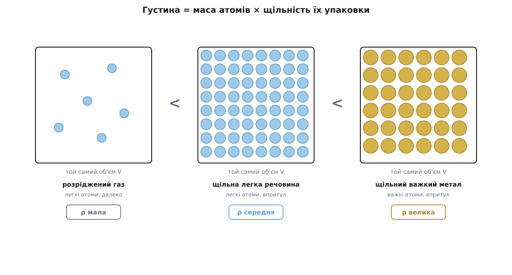
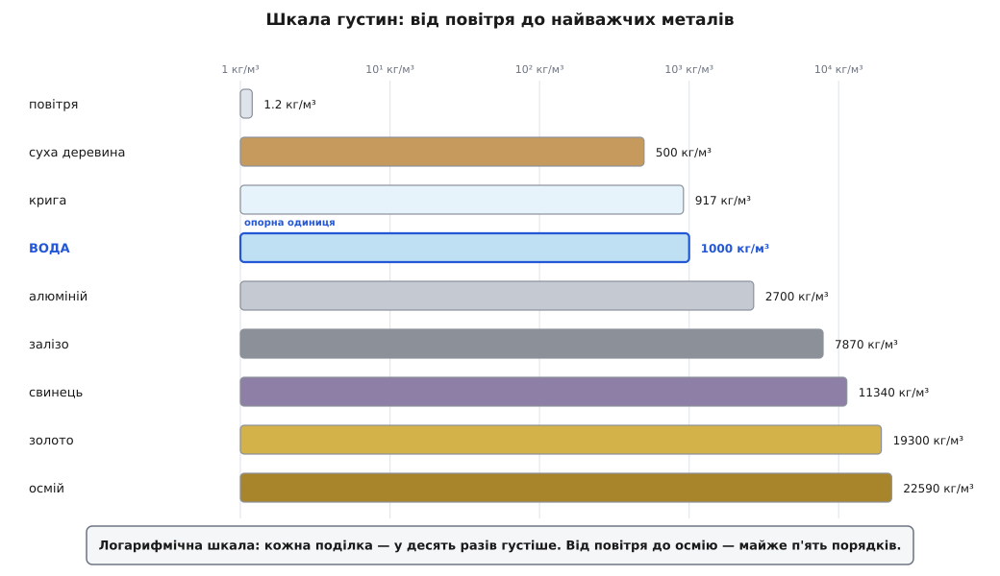
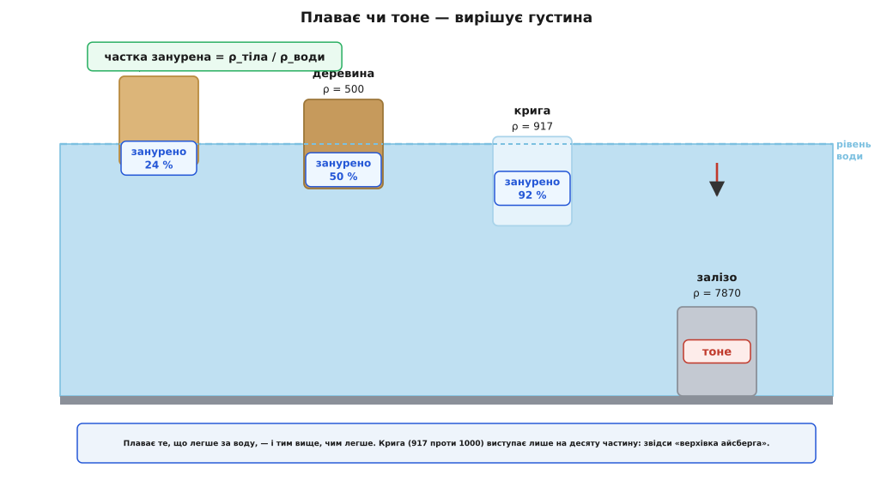

# Густина

<preknowlist>
- [Маса](topic:physics/mass) — скільки речовини в тілі, міра його інертності; густина каже, скільки цієї маси втиснуто в одиницю об'єму.
</preknowlist>

Що важче — кілограм заліза чи кілограм пуху? Питання-пастка: кілограм є кілограм, маси в них порівну. Але хитрість не випадкова — вона ловить те, що ми насправді маємо на увазі, кажучи «залізо важче за пух». Ми порівнюємо не кілограм із кілограмом, а *шматок* заліза з *таким самим за розміром* шматком пуху. І ось тут залізо справді переважує в сотні разів — бо в той самий об'єм його втиснуто набагато більше речовини. Оця «кількість речовини на одиницю об'єму» і є густина. Вона не про те, скільки важить тіло, а про те, наскільки щільно в ньому напхано матерії.

Одне це поняття пояснює купу на позір різних загадок. Чому сталевий корабель плаває, а сталевий цвях тоне. Чому олія збирається плівкою поверх води, а не тоне під нею. Чому повітряна куля з гарячим повітрям підіймається. Чому крига не тоне — і чому, якби тонула, у наших озерах узимку вимерло б усе живе. За всіма цими історіями стоїть одна величина, тож розберімо її до кореня.

## Маса, поділена на об'єм

Означення просте:

```
ρ = m / V          [кг/м³]
```

Густину позначають грецькою літерою ρ («ро»). Це маса m речовини, поділена на об'єм V, який вона займає. Саме слово — від латинського *densus* (густий, щільний): густина міряє, наскільки речовина «густа» на матерію.

Одиниця в системі СІ — кілограм на кубічний метр (кг/м³). У побуті зручніша менша: грам на кубічний сантиметр (г/см³), і між ними рівно тисячократна різниця, бо в кубічному метрі мільйон кубічних сантиметрів, а в кілограмі — тисяча грамів:

```
1 г/см³ = 1000 кг/м³
```

Опорна точка, яку варто затримати в голові, — вода: близько 1000 кг/м³, себто 1 г/см³. Це не випадковість і не збіг. Коли наприкінці XVIII століття у Франції будували метричну систему, грам навмисне визначили як масу одного кубічного сантиметра води (за найбільшої її густини, коло 4 °C). Тому вода й вийшла рівно «одиницею» — усі інші густини зручно читати як «у стільки разів густіше за воду». Точне сучасне значення — 999.97 кг/м³ за 4 °C, і для щоденного життя це те саме, що тисяча.

**Скільки важить повітря в кімнаті.** Густина повітря коло поверхні Землі — приблизно 1.2 кг/м³. Візьмімо звичайну кімнату 5 × 4 × 3 м.

```
V = 5 · 4 · 3            = 60 м³
m = ρ · V = 1.2 · 60     = 72 кг
```

**Висновок.** Повітря в одній кімнаті важить під сімдесят кілограмів — як доросла людина. Ми цього не помічаємо тільки тому, що воно тисне на нас звідусіль нарівні й нас підтримує таке саме повітря; але маса нікуди не дівається. Порожнеча важча, ніж здається.

> 🔧 **Навіщо це.** Густина — місток між тим, що легко зважити, і тим, що легко зміряти лінійкою. Масу великого чи незручного тіла прямо на ваги часто не покладеш, зате об'єм порахуєш із розмірів, а густину матеріалу візьмеш із таблиці — і маса виходить множенням. Так рахують вагу сталевої балки за кресленням, запас пального в баку за його об'ємом, підіймальну силу дирижабля. Обернено: зваживши тіло й зануривши його в воду, щоб дізнатися об'єм, дістають густину — а по ній упізнають, з чого воно.

## Властивість речовини, а не тіла

Тут ховається головне непорозуміння, тож проговорімо його прямо. Маса й об'єм залежать від того, скільки речовини ми взяли: більший шматок — більша маса, більший об'єм. А густина від кількості **не залежить**. Відріжте від залізного бруска половину — маса впаде вдвічі, об'єм упаде вдвічі, а їхнє відношення лишиться те саме. Крапля води й повний океан мають однакову густину. Тому густина описує не конкретне тіло, а **саму речовину**: залізо є залізо, хоч цвях воно, хоч рейка.

Величини такого штибу — ті, що не залежать від кількості, — звуть інтенсивними, на відміну від екстенсивних (маса, об'єм), які з кількістю ростуть. Саме через це густина — своєрідний підпис матеріалу. Виміряли густину зливка й дістали 19300 кг/м³ — це золото; дістали 11340 — свинець, хоч як його позолоти згори.

Рівно на цьому побудована найвідоміша задача в історії фізики — Архімедова корона. Цар підозрював, що майстер підмінив частину золота дешевшим сріблом; підігнати сплав так, щоб він важив стільки ж, скільки чисте золото, можна, але густина в них різна, бо срібло легше. Лишалося зміряти густину корони, не плавлячи її, — тобто знайти її об'єм за витісненою водою. [Як усе було насправді — і чому історики сумніваються в легенді про «Еврику»](topic:physics/density/hist-archimedes-crown.md) — окрема сторінка; сама ж ідея впізнавати речовину за густиною жива й досі.

## Звідки беруться такі різні числа

Чому одна речовина в десятки разів густіша за іншу? Відповідь — у самих атомах, і в ній лише два множники. Густина тим більша, чим **важчі атоми** речовини і чим **тісніше** вони напхані. Обидва множники працюють разом.

Порівняймо три стани матерії. У газі молекули розкидані далеко одна від одної, між ними майже сама порожнеча, тож у чималий об'єм їх уміщається обмаль — звідси мізерна густина повітря, у тисячу разів менша за воду. У рідині й твердому тілі частинки притиснуті майже впритул, тому вода, олія, метали густіші за гази на три порядки. А вже серед твердих тіл різницю робить головно маса атома: атом золота важчий за атом алюмінію разів у сім, і золото відповідно густіше.

Найгустіші з простих речовин — осмій та іридій, обидва коло 22600 кг/м³, у двадцять з гаком разів густіші за воду й помітно за свинець. У них поєдналося те й те: важкі атоми і дуже щільна упаковка кристала. Осмій усталено вважають найгустішим із природних елементів, хоча відрив від іридію крихітний — настільки, що впевнено розсудити їх змогли лише в 1990-х, точним рентґеноструктурним вимірюванням. [Як із маси атома й способу їх укладки вивести саме таке число густини](topic:physics/density/math-atomic-density.md) — окрема й вельми показова викладка.



*Густина складається з двох множників — маси атомів і щільності їх упаковки. Розсуньте атоми (газ) або візьміть легші — густина падає; важкі атоми впритул дають найгустіші метали.*

Щоб відчути розмах, корисно поставити речовини в один ряд. Від найлегших газів до найважчих металів густина міняється на кілька порядків — і на цьому тлі вода сидить рівно посередині як зручна позначка «одиниця».



*Густини звичних речовин на логарифмічній шкалі. Гази — унизу (розріджені), метали — вгорі (важкі атоми впритул), вода посередині як опорна одиниця.*

## Чому крига плаває — і чому це рятує життя

Майже всі речовини, застигаючи, стають густішими: тверде тоне у власному розплаві. Вода — рідкісний і дорогоцінний виняток. Крига має густину близько 917 кг/м³ — вона **легша** за рідку воду (1000), тому й плаває. Причина в тому, як вода замерзає: молекули шикуються в ажурний кристал із порожнинами всередині, і в цьому впорядкованому ладі сидять просторіше, ніж у безладній тісняві рідини. Порожнини — це менше маси на той самий об'єм, себто менша густина.

Дрібничка? Аж ніяк — від неї залежить, чи буде в озері життя. Крига легша за воду, тому замерзання йде **згори вниз**: лід утворюється на поверхні й лишається там, укриваючи воду ковдрою, під якою вона не промерзає до дна. Риба й усе живе перебуває зиму в тій воді. Якби ж крига була густіша за воду, вона тонула б, оголюючи поверхню для нового льоду, і водойма промерзала б до дна наскрізь, убиваючи все в ній. Уся прісноводна екосистема помірних широт тримається на тих кількох відсотках, на які вода при замерзанні дивовижно розширюється.

## Плаває чи тоне — вирішує густина

Тепер зрозуміле й головне правило плавання: тіло плаває, якщо його **середня** густина менша за густину рідини, і тоне, якщо більша. Порівнюють саме з рідиною — з водою для моря, з повітрям для кулі.

Слово «середня» тут вирішальне і знімає давню загадку сталевого корабля. Суцільний шматок сталі (7800 кг/м³) у воді безнадійно тоне. Але корпус судна не суцільний: усередині нього величезний об'єм повітря. Порахуйте масу всього корабля й поділіть на весь об'єм, який він займає разом із порожниною, — і середня густина вийде меншою за воду. Тому він плаває. А пробийте борт, впустіть воду замість повітря — середня густина підскочить вище за воду, і корабель піде на дно. Сила, що виштовхує плавуче тіло вгору, — [окрема тема (закон Архімеда)](topic:physics/buoyancy); тут головне, що вмикає її саме співвідношення густин.

Наскільки тіло занурене, теж диктує густина: частка зануреного об'єму дорівнює відношенню густини тіла до густини рідини. Крига в морській воді має відношення 917/1025 ≈ 0.9 — тому з айсберга видно лише десяту частину, а дев'ять десятих ховаються під водою. Звідси й приказка про «верхівку айсберга».

**Яка частина айсберга під водою.** Густина криги 917 кг/м³, морської води — близько 1025 кг/м³.

```
частка занурена = ρ_криги / ρ_води
                = 917 / 1025            ≈ 0.895
```

**Висновок.** Під воду ховається майже 90 % об'єму — над поверхнею лишається якихось десять відсотків. Те, що видно, — обманлива дещиця; головна маса завжди внизу.



*Що ближча густина тіла до густини води, то глибше воно занурене. Легше за воду — плаває (тим вище, чим легше); важче — тоне. Крига (917 проти 1000) виступає лише на десяту частину.*

> 🔧 **Навіщо це.** Ареометр — простий прилад, що плаває в рідині й показує її густину глибиною занурення: густіша рідина — вище стирчить. Ним перевіряють заряд свинцевого акумулятора (густина кислоти падає, коли він розряджається), міцність антифризу, вміст цукру в суслі й спирту в напої. Той самий принцип — за глибиною занурення судити про густину — годує ціле сімейство вимірників.

## Густина не сталість — залежить від температури й тиску

Досі ми брали густину як число з таблиці, але воно трохи «пливе» з умовами. Нагрійте речовину — її частинки починають дужче тремтіти й розсовуються, об'єм росте, а маса лишається та сама, тож густина падає. Це [теплове розширення](topic:physics/thermal-expansion), і воно рухає цілі океани й атмосферу. Тепла вода легша за холодну, тому вона підіймається, а холодна опускається — так народжуються конвекційні течії в чайнику, у морі та в мантії Землі. На тому ж стоїть повітряна куля: пальник гріє повітря всередині оболонки, воно рідшає, стає легшим за навколишнє — і куля спливає вгору, як спливає корок.

Для газів густина куди чутливіша, і не лише до тепла, а й до тиску. Гази стисливі: притисніть газ удвічі — той самий набір молекул займе вдвічі менший об'єм, і густина подвоїться. Зв'язок між густиною газу, його тиском і температурою описує [рівняння стану ідеального газу](topic:physics/ideal-gas-law). Саме тому «густина повітря 1.2 кг/м³» — значення для поверхні: високо в горах, де тиск менший, повітря відчутно рідше, тож літаку там важче триматися, а людині — дихати. Рідини й тверді тіла, навпаки, стискаються мізерно, тому їхню густину зазвичай можна вважати сталою.

## Відносна густина — порівняння з водою

На практиці часто зручніше не саме число в кг/м³, а в скільки разів речовина густіша за воду. Це відношення й звуть відносною густиною (або питомою вагою) — воно безрозмірне, бо ділимо густину на густину:

```
відносна густина = ρ_речовини / ρ_води
```

Для золота вона 19.3, для алюмінію 2.7, для сухої деревини близько 0.5 (тому дерево й плаває — воно вдвічі легше за воду). Зручність у тому, що відповідь на питання «потоне чи спливе у воді» читається з одного погляду: більше за одиницю — тоне, менше — плаває. Це та сама величина, яку показує ареометр, і та сама, за якою Архімед мав би відрізнити золото від сплаву.

Розмах густин у природі приголомшує. Найрозрідженіші гази й найважчі метали різняться в десятки тисяч разів, а якщо вийти за межі буденного — ще неймовірніше. Речовина нейтронної зорі, де матерія стиснута гравітацією до ядерної щільності, має густину порядку 10¹⁷ кг/м³: наперсток такої речовини важив би сотні мільйонів тонн. Уся ця прірва значень — від майже порожнього газу до вкрай стиснутої зорі — вимірюється однією простою величиною: скільки маси припадає на одиницю об'єму.
