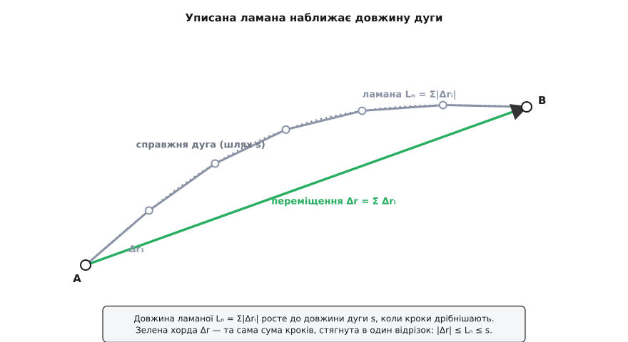
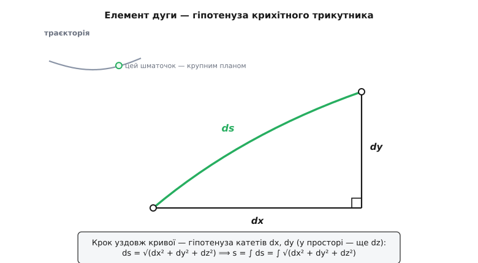
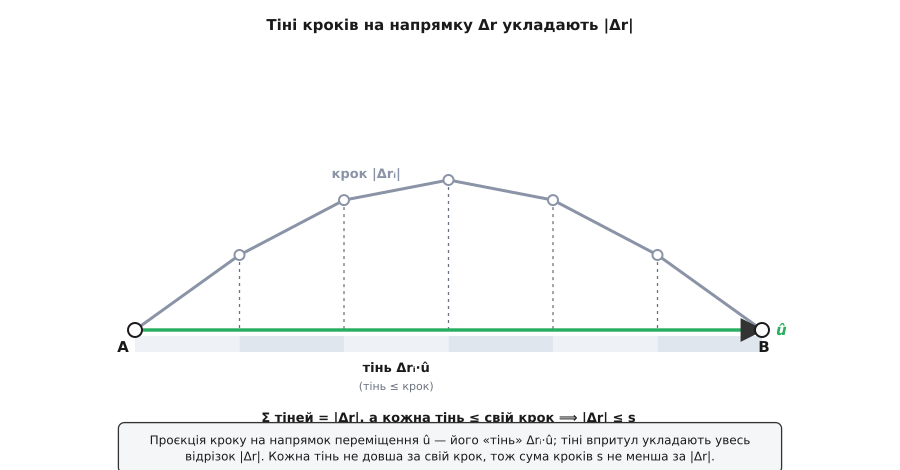

# 🧮 Довжина шляху як інтеграл, і чому |Δr| ≤ s

Дві короткі формули тримають на собі весь зв'язок шляху зі швидкістю:

```
s  = ∫ |v| dt          довжина шляху
Δr = ∫ v dt            переміщення
```

На вигляд вони майже близнюки — різняться лише парою рисок модуля. Але саме ця пара рисок і є вся суть: одна формула інтегрує **вектор**, друга — його **довжину**, і з цього самого місця виростає нерівність |Δr| ≤ s, яку так хочеться назвати очевидною. Тут ми обидві формули складемо з нуля — від скінченних кроків до інтеграла, — а нерівність не проголосимо, а доведемо, разом із точною умовою, коли вона стає рівністю. Наприкінці з тієї самої машини природно випаде одиничний дотичний вектор і найчесніший спосіб описати криву — параметризація за самою її довжиною.

## Дві суми, які треба довести до інтеграла

Почнемо з грубого, зернистого світу, де рух — це низка маленьких стрибків. Розбиваємо траєкторію на короткі кроки Δr₁, Δr₂, …, Δrₙ (кожен — стрілка з одного відліку положення в наступний). Тоді дві цікаві нам величини — це дві різні суми тих самих кроків:

```
Δr = Δr₁ + Δr₂ + … + Δrₙ        кроки складаються як вектори
s  = |Δr₁| + |Δr₂| + … + |Δrₙ|   складаються їхні довжини
```

Перша сума **згортається**: кінець кожного кроку є початком наступного, тож усе всередині скорочується й лишається тільки стрілка від найпершої точки до найостаннішої. Друга сума нічого не згортає — довжина невід'ємна, гаситися нема чому, вона тільки росте. Уся подальша робота — це відповісти на одне питання: що станеться з кожною сумою, коли кроки зробити нескінченно дрібними? Обидві стануть інтегралами, але, як побачимо, інтегралами різних речей — і в цій різниці й захована нерівність.

> [Інтеграл](topic:math/integral) — це і є границя таких сум: беремо суму дрібних доданків «висота × ширина» й дивимось, до чого вона прямує, коли ширина крокує до нуля. Саме цей перехід «сума → інтеграл» ми зараз проведемо двічі.

## Від ламаної до ∫|v|dt

Візьмімо кроки буквально. З'єднавши по черзі всі точки, у яких ми «фотографували» тіло, дістанемо **вписану ламану** — багатокутник, натягнутий на траєкторію хордами. Його повна довжина — це наша друга сума:

```
Lₙ = |Δr₁| + |Δr₂| + … + |Δrₙ|
```

Кожна хорда трохи «зрізає кут» справжньої дуги, тож ламана завжди коротша за криву. Але додаймо точок — і хорди дрібнішають, ламана дедалі щільніше облягає траєкторію, а її довжина Lₙ підповзає вгору, до якогось граничного числа. Оце граничне число (точніше — найменша межа, якої довжини ламаних не переступають) і **називають** довжиною дуги s. Так означення довжини кривої зводиться до єдиного, що ми взагалі вміємо міряти прямо, — до довжини відрізків.


*Сума довжин хорд Lₙ = Σ|Δrᵢ| наближає довжину дуги s знизу; що дрібніші кроки, то щільніше ламана лягає на криву. Зелена хорда — переміщення Δr, тобто векторна сума тих самих кроків, стягнута в один відрізок.*

Тепер вплетемо сюди швидкість — бо саме через неї ми зазвичай і знаємо рух. За означенням, [швидкість](topic:physics/velocity) є темп зміни положення, v = dr/dt, а це та сама [похідна](topic:math/derivative): миттєва швидкість зміни величини, границя відношення приросту до часу. Розгорнути означення похідної для короткого проміжку Δtᵢ означає сказати, що приріст положення на ньому — це майже «швидкість × час»:

```
Δrᵢ = r(tᵢ + Δtᵢ) − r(tᵢ) ≈ v(tᵢ)·Δtᵢ
```

Похибка тут вищого порядку малості — на гладкій траєкторії вона тане швидше за сам Δtᵢ. Візьмемо від обох боків [довжину вектора](topic:math/vector-norm) (модуль — вона ж норма: скільки одиниць у стрілці, незалежно від напрямку):

```
|Δrᵢ| ≈ |v(tᵢ)|·Δtᵢ
```

Підставмо це в довжину ламаної:

```
Lₙ = Σ |Δrᵢ| ≈ Σ |v(tᵢ)|·Δtᵢ
```

А права частина — це вже впізнавана **сума Рімана**: значення функції |v(t)| у точках tᵢ, помножені на ширини Δtᵢ. Коли розбиття подрібнюється, така сума за означенням прямує до інтеграла тієї функції. Звідси, для будь-якої траєкторії з неперервною швидкістю:

```
s = ∫ |v| dt
```

Довжина шляху — це інтеграл **модуля** швидкості, тобто те, що весь час показує спідометр, підсумоване за час. Спідометр не знає напрямку й ніколи не показує від'ємного — тому шлях лише накопичується.

> 🔧 **Навіщо це.** Умова «швидкість неперервна» — не формальна причепка. Є криві, у яких довжини вписаних ламаних ростуть без межі, хоч сама крива вміщається в долоні: нескінченно зубчаста, як берегова лінія на щораз дрібнішому масштабі. У такої **скінченної швидкості немає**, інтеграл ∫|v|dt не існує, і «довжина шляху» просто не визначена. Поняття шляху живе рівно там, де рух досить гладкий, щоб спідометр показував скінченне число, — і ця межа корисності є частиною самого поняття.

## Елемент ds: чому s = ∫√(dx² + dy² + dz²)

Той самий інтеграл можна записати так, що час із нього зникне зовсім, — і форма стане чисто геометричною. Розпишімо швидкість по осях, v = (dx/dt, dy/dt, dz/dt); тоді її модуль — це [теорема Піфагора](topic:math/pythagorean-theorem) в трьох вимірах (діагональ прямокутного паралелепіпеда через його ребра):

```
|v| = √( (dx/dt)² + (dy/dt)² + (dz/dt)² )
```

Помножмо на dt і заведімо цей множник під корінь — як dt² на кожен доданок:

```
|v| dt = √( dx² + dy² + dz² )  ≡  ds
```

Праворуч стоїть **елемент довжини дуги** ds — довжина нескінченно короткого шматочка кривої. Це знову Піфагор, тільки для крихітного кроку: маленьке переміщення має проєкції dx, dy, dz на осі, а сам крок — це їхня гіпотенуза. Підсумувавши всі такі гіпотенузи вздовж траєкторії, дістаємо шлях у формі, де немає жодного натяку на годинник:

```
s = ∫ ds = ∫ √( dx² + dy² + dz² )
```


*Нескінченно малий крок уздовж кривої — гіпотенуза прямокутного трикутника з катетами dx, dy (у просторі — ще dz). Довжина шляху складається саме з таких елементарних гіпотенуз: s = ∫√(dx²+dy²+dz²).*

І тут ховається важлива різниця між двома написаннями шляху. Запис ∫|v|dt згадує час — він каже, **як швидко** ми біжимо. Запис ∫√(dx²+dy²+dz²) часу не згадує зовсім — він каже лише, **якою фігурою** лягла траєкторія. Проте число вони дають те саме: розтягни чи стисни рух у часі (пробіжи ту саму доріжку вдвічі повільніше), і ∫|v|dt перерахується інакшими множниками, але результат не зміниться ні на йоту. Довжина належить кривій, а не секундоміру, — вона **інваріантна щодо перепараметризації**. Ця думка стане ключем в останньому розділі.

**Приклад (рух по колу).** Тіло біжить колом радіуса R зі сталою кутовою швидкістю ω: r(t) = (R·cos ωt, R·sin ωt).

```
v      = dr/dt = (−R·ω·sin ωt,  R·ω·cos ωt)
|v|    = √( R²ω²·sin²ωt + R²ω²·cos²ωt ) = √(R²ω²) = R·ω
s(0→t) = ∫₀ᵗ R·ω dt' = R·ω·t = R·θ           (де θ = ωt — заметений кут)
```

Довжина дуги вийшла s = R·θ — «радіус, помножений на кут у радіанах». Це не збіг, а те саме означення радіана, тільки здобуте інтегралом: наша машина ∫|v|dt відтворює шкільну формулу дуги з першопринципів, а не постулює її.

## Переміщення як інтеграл вектора

Другу суму, ΣΔrᵢ, доведемо до інтеграла тим самим порухом — тільки без модуля. Кожен доданок Δrᵢ ≈ v(tᵢ)·Δtᵢ, тож

```
Δr = Σ Δrᵢ ≈ Σ v(tᵢ)·Δtᵢ   ⟶   ∫ v dt
```

І це та сама границя суми — але тепер сумуються **вектори**, тож у ній прямо працює основна теорема аналізу покомпонентно. Оскільки vₓ = dx/dt, інтеграл vₓ повертає приріст координати, і так по кожній осі:

```
∫ vₓ dt = x(t₁) − x(t₀)
∫ v_y dt = y(t₁) − y(t₀)
∫ v_z dt = z(t₁) − z(t₀)
```

Склавши три рівності назад у вектор, дістаємо

```
Δr = ∫ v dt = r(t₁) − r(t₀)
```

Тепер обидві величини стоять поряд, і вся їхня відмінність уміщається в одну рису:

```
Δr = ∫ v  dt       інтегруємо вектор  — напрямки можуть гаситися
s  = ∫ |v| dt       інтегруємо довжину — гаситися нема чому (|v| ≥ 0)
```

Один і той самий рух, той самий v(t), два інтеграли — і весь зазор між ними якраз і є та нерівність, до якої ми йшли.

## Чому |Δr| ≤ s: нерівність трикутника

Спершу два вектори. Візьмімо a і b та порівняймо довжину їхньої суми з сумою довжин:

```
|a + b| ≤ |a| + |b|
```

Чому? Складіть a і b «хвіст до голови»: сума a + b — це третя сторона трикутника, дві інші сторони якого мають довжини |a| і |b|. А сторона трикутника ніколи не довша за суму двох інших — інакше вона просто не зімкнулася б із ними в трикутник. Рівність настає лише коли трикутник «сплющується» в пряму: a і b дивляться в один бік, і третя сторона лягає точно на суму двох.

Ця, здавалося б, векторна дрібничка насправді дуже стара. Це Евклід, «Начала», книга I, твердження 20 (≈ 300 р. до н. е.): у будь-якому трикутнику дві сторони, узяті разом, більші за третю. Античний геометр записав рівно те, що ми звемо сьогодні нерівністю трикутника, і вивів із неї, що **пряма — найкоротша дорога між двома точками**. Наша фізична нерівність |Δr| ≤ s — це той самий двохтисячолітній факт, лише вдягнений у вектори. *(Усталений історичний факт.)*

Від двох векторів до багатьох — крок індукції: якщо |a + b| ≤ |a| + |b|, то, приклеюючи по одному доданку, дістаємо загальне

```
|Δr₁ + Δr₂ + … + Δrₙ| ≤ |Δr₁| + |Δr₂| + … + |Δrₙ|
```

Ліворуч — довжина векторної суми кроків, тобто |Δr|. Праворуч — довжина ламаної Lₙ, яка, ми вже знаємо, не більша за шлях s. Складаємо ланцюжок:

```
|Δr| = |Σ Δrᵢ| ≤ Σ |Δrᵢ| = Lₙ ≤ s
```

Для скінченних кроків готово. У границі дрібних кроків знак «≤» нікуди не дінеться — нерівності зберігаються при переході до границі, — тож і для неперервного руху |Δr| ≤ s.

Але є пряме доведення просто для інтегралів, без ламаних, і воно чіткіше показує **чому** — через проєкцію. Візьмімо будь-який одиничний вектор û (|û| = 1) і спроєктуймо на нього переміщення. Проєкція — це [скалярний добуток](topic:math/dot-product) (він міряє, наскільки один вектор витягнутий уздовж іншого), а він лінійний, тож заходить прямо під інтеграл:

```
Δr · û = (∫ v dt) · û = ∫ (v · û) dt
```

Тепер оцінімо піднтегральний вираз. Проєкція вектора на одиничний напрямок ніколи не перевищує його власної довжини — тінь коротша за палицю, і найдовша вона, коли палиця лежить уздовж напрямку:

```
v · û ≤ |v · û| ≤ |v|·|û| = |v|
```

(Середня нерівність — це нерівність Коші–Буняковського для скалярного добутку: |v·û| ≤ |v||û|.) Проінтегрувавши цей ланцюжок, маємо для **будь-якого** û:

```
Δr · û = ∫ (v · û) dt ≤ ∫ |v| dt = s
```

Лишається один хитрий вибір. Візьмімо û не абиякий, а вздовж самого переміщення: û = Δr / |Δr|. Тоді ліва частина стає просто довжиною переміщення, Δr · û = Δr · Δr/|Δr| = |Δr|²/|Δr| = |Δr|, і нерівність каже:

```
|Δr| ≤ s
```


*Проєкція кожного кроку на напрямок переміщення û — його «тінь». Тіні впритул укладають увесь відрізок |Δr| (їхня сума точно дорівнює переміщенню), а кожна тінь не довша за свій крок. Тому сума кроків s не менша за |Δr|.*

## Коли ж рівність?

Красу проєкційного доведення видно якраз тут: воно не лише дає нерівність, а й точно показує, де вона стає рівністю. Ми пройшли ланцюжок із двох оцінок; щоб |Δr| зрівнялося з s, **обидві** мусять бути рівностями на всьому русі, у кожну мить t:

- **v · û = |v · û|** — це можливо, лише коли v · û ≥ 0, тобто швидкість ніде не має складової проти û. Тіло не завертає назад відносно напрямку переміщення.
- **|v · û| = |v|** — рівність Коші–Буняковського, а вона настає тільки коли v колінеарний û, тобто v = (число)·û.

Разом ці дві умови кажуть: v(t) = |v(t)|·û з **одним і тим самим фіксованим** û і невід'ємним |v|. Це і є рух уздовж однієї прямої, без розвороту — той самий випадок, що в темі названо умовою рівності. Тільки тепер він не оголошений, а виведений: щойно траєкторія гнеться (v міняє напрямок) або має розворот (v·û стає від'ємним), одна з оцінок робиться строгою, і шлях переганяє переміщення.

**Приклад (пів кола).** Повернімося до кола радіуса R і пройдімо рівно половину — від r(0) = (R, 0) до точки з кутом θ = π, тобто (−R, 0).

```
переміщення |Δr| = |(−R,0) − (R,0)| = |(−2R, 0)| = 2·R
шлях         s   = R·θ = R·π ≈ 3.14·R
відношення   |Δr|/s = 2R / (πR) = 2/π ≈ 0.64
```

Пряма хорда через півколо — це лише 64 % довжини самої дуги. Крива весь час загинає v убік від напрямку хорди, тож жодна з оцінок не туга, і розрив між |Δr| і s відкривається на повну. Що прямішою робити дорогу, то ближче відношення до одиниці; на прямій без розвороту воно точно 1.

## Одиничний дотичний вектор і натуральна параметризація

З цієї машини майже задарма випадає найкорисніший інструмент опису кривих. Поділімо швидкість на її ж модуль:

```
T = v / |v|          |T| = 1
```

Ми поділили вектор на його довжину, тож у результаті лишився чистий **напрямок** одиничної довжини — **одиничний дотичний вектор** T (лат. tangens — «дотичний»). У кожній точці він дивиться точно туди, куди зараз рухається тіло, тобто вздовж дотичної до траєкторії. Уся інформація про темп руху з нього вичавлена — лишилась сама геометрія напрямку.

А тепер згадаймо, що ds = |v|dt, і зробімо сміливу заміну: візьмімо за параметр кривої не час, а саму пройдену довжину s. Тоді положення стає функцією довжини, r(s), і похідна по s рахується через ланцюжок:

```
dr/ds = (dr/dt) / (ds/dt) = v / |v| = T
```

Отже, dr/ds = T, і — головне — |dr/ds| = |T| = 1 **тотожно**, у кожній точці. Це й зветься **натуральна параметризація** (або параметризація за довжиною дуги): криву пробігають зі сталою одиничною «швидкістю», один метр довжини на одиницю параметра.

Чому «натуральна»? Бо вона викидає з опису годинник і лишає саму криву. Дві машини на тій самій дорозі — гонщик і слимак — мають геть різні r(t): один пролітає поворот за секунду, другий повзе хвилину. Але їхні r(s) **збігаються точно**: обидві дороги — це та сама лінія, і опис за довжиною належить лінії, а не водієві. Параметр s — це власна, вбудована лінійка кривої.

**Приклад (коло в натуральній параметризації).** Для кола s = R·θ, звідки θ = s/R. Підставмо:

```
r(s)   = ( R·cos(s/R),  R·sin(s/R) )
dr/ds  = ( −sin(s/R),   cos(s/R) )
|dr/ds| = √( sin²(s/R) + cos²(s/R) ) = 1     ✓
```

Одиничний дотичний T = (−sin(s/R), cos(s/R)) випав сам, а швидкість руху по колу зникла з опису зовсім — лишилась гола форма.

І тут коло замикається з нерівністю, з якої ми почали. У натуральній параметризації шлях від s = a до s = b — це тривіально b − a (один метр довжини на одиницю s). Переміщення ж — це r(b) − r(a). Нерівність набуває найчистішого вигляду:

```
| r(b) − r(a) | ≤ b − a
```

Пряма відстань між двома точками кривої не більша за довжину дуги між ними — те саме |Δr| ≤ s, але висловлене мовою самої кривої. А одиничний дотичний T = dr/ds — це вже зерно, з якого виростає **кривина** (як швидко T повертає на одиницю довжини) і вся локальна геометрія траєкторії; але то вже інша тема.

## Де це працює

Уся ця математика тримає прості речі, які видно неозброєним оком. Нерівність |Δr| ≤ s — причина, чому будь-який одометр показує не менше за пряму відстань до цілі, а зазвичай більше: дорога гнеться, і кожен вигин туго додає до шляху, майже не чіпаючи чесного переміщення. На замкненому маршруті переміщення падає до нуля (Δr = 0), а шлях лишається повним — це два інтеграли, що розійшлися максимально, бо вектор під першим весь скоротився, а модуль під другим не мав чого скорочувати. Одиничний дотичний вектор — атом, з якого будують напрямок швидкості, кривину, дотичні й нормалі до траєкторії; параметризація за довжиною дуги — спосіб говорити про форму дороги, не згадуючи, хто і як швидко нею їде. А ті дві формули, з яких ми стартували, тепер не гасла: s = ∫|v|dt — це сума Рімана з довжин крихітних кроків, а |Δr| ≤ s — нерівність трикутника Евкліда, обидві просто перевдягнені в мову аналізу.
