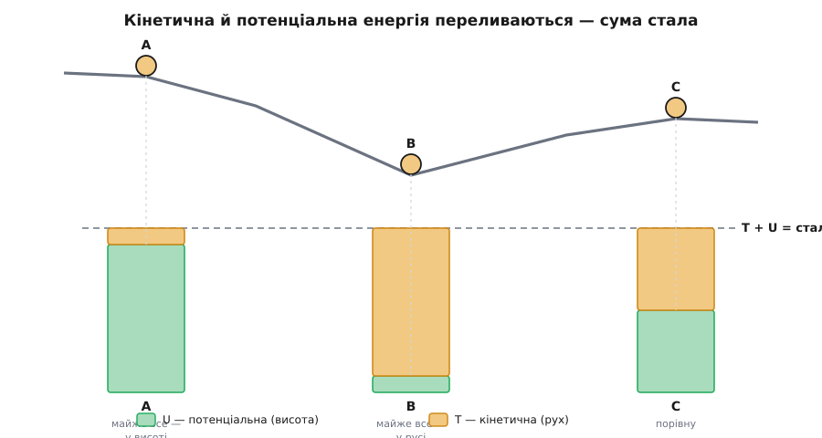
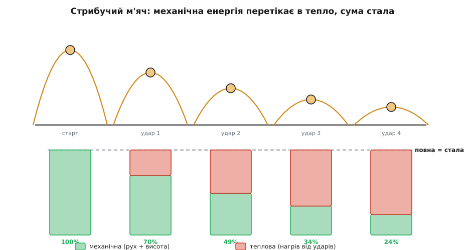

# Закон збереження енергії

<preknowlist>
- [Кінетична енергія](topic:physics/kinetic-energy) — енергія руху, T = ½·m·v²; росте з квадратом швидкості.
- [Потенціальна енергія](topic:physics/potential-energy) — запас, схований у положенні тіла в полі сил (висота над землею, стиснута пружина), U.
- [Механічна робота](topic:physics/work) — передача енергії силою вздовж переміщення, W = F·s; саме через роботу енергія перетікає з форми у форму.
</preknowlist>

Є в природі число, яке не змінюється — хоч би що коїлося. Каміння падає, пружини стріляють, машини гальмують, зорі горять, а це число лишається тим самим до останньої цифри. Його називають **енергією** (гр. enérgeia — чинність, дія, від érgon — робота), і найдивніше в ньому те, що його ніде не видно. Немає такої речовини «енергія», яку можна набрати в жменю чи зважити на терезах. Є лише правило: візьми стан світу, порахуй за певними формулами одне число — і хоч що потім станеться, порахуй знову, і вийде рівно те саме.

Звучить як фокус. Що це взагалі за число, якщо його не можна побачити? І чому природа так вперто його береже? Ця стаття — про те, звідки береться така впертість і чому вона виявилася однією з наймогутніших ідей у всій фізиці.

## Кубики, яких ніхто не бачить

Річард Фейнман малював таку картинку. Уяви малого бешкетника, у якого є 28 однакових незнищенних кубиків. Щовечора мати перераховує їх — завжди 28. Аж якось знаходить лише 27. Пошукала — один закотився під килим. Наступного дня 26, зате вікно відчинене, а двоє лежать у дворі. Потім кубиків стає 30 — приходив сусідський хлопчик і залишив свої. Мати не здається: вона хоче переконатися, що *її* двадцять вісім нікуди не діваються.

І тут починається хитрість. Одного дня малий замикає кілька кубиків у скриньці, яку не дозволяє відкривати. Мати не бачить кубиків усередині — але вона знає, що один кубик важить стільки-то, тож зважує скриньку й рахує: (вага скриньки − вага порожньої) поділити на вагу кубика — стільки їх усередині. Ще за день частина кубиків опиняється в каламутній воді у ванні, де їх теж не видно. Дарма: рівень води піднявся, а кожен кубик підіймає його на відому крихту, тож (приріст рівня) поділити на «крихту від одного кубика» — і знову маємо число. І щоразу сума — те, що на видноті, плюс те, що дає формула для скриньки, плюс те, що дає формула для води, — виходить 28.

Ось точний образ збереження енергії. Тільки з однією засторогою, і Фейнман сам на ній наполягав: **енергія — це не кубики**. Немає жодних маленьких «шматочків енергії», які кудись закочуються й ховаються. Є абстрактне число та кілька формул — одна на кожну форму, у якій енергія може ховатися: формула для руху, формула для висоти, формула для тепла, для хімії, для світла. Порахуй усі й додай. Ця сума не змінюється ніколи. У цьому — весь закон, і саме тому він химерний: показати нема чого, є лише незмінний підсумок бухгалтерії, у якій усі стовпчики завжди сходяться.

## Дві кишені, що переливаються

Найпростіший світ, де все це видно як на долоні, має лише дві форми енергії. Перша — [кінетична](topic:physics/kinetic-energy), T = ½·m·v², енергія самого руху: що швидше тіло, то вона більша, і росте вона з квадратом швидкості. Друга — [потенціальна](topic:physics/potential-energy), U = m·g·h, запас, схований у висоті: підняв тіло — уклав у нього енергію, як гроші в кишеню. Повна механічна енергія — це їхня сума, і поки на тіло не діє нічого, крім тяжіння, ця сума стала:

```
E = T + U = ½·m·v² + m·g·h = const
```

Дивись, що це означає для каменя, який зривається з висоти. Падаючи, він втрачає висоту — потенціальна кишеня порожніє. Але жодна крихта не пропадає: рівно стільки, скільки витекло з U, доливається в T — камінь розганяється. Одна кишеня спорожняється точно в міру того, як наповнюється друга. Біля землі вся висота вже перелилася у швидкість. Гойдалка чи маятник роблять те саме туди-сюди: угорі — весь запас у висоті, тіло на мить завмирає; унизу — весь у русі, найшвидша точка; і назад. Американська гірка тому й не може викотитися на горб, вищий за стартовий: на це просто не вистачило б початкового запасу.



*Одне тіло у трьох точках схилу. Зелений стовпчик (запас висоти) і бурштиновий (рух) міняються місцями, але їхня сума — пунктирна лінія вгорі — не зрушується.*

Ця незмінність дає майже безкоштовний спосіб рахувати. Хочеш знати швидкість каменя біля землі — не треба стежити за кожною миттю падіння, розписувати прискорення й час. Досить прирівняти кишені: скільки було висоти, стільки стане швидкості.

**Умова: камінь зривається з полиці на висоті h = 1.8 м; яка швидкість біля підлоги?**
```
Уся потенціальна енергія переходить у кінетичну:
   m·g·h = ½·m·v²

Маса скорочується з обох боків (тому легкий і важкий падають однаково):
   v = √(2·g·h)
   v = √(2 · 9.8 · 1.8)
   v = √35.28 ≈ 5.94 м/с
```

Зверни увагу: маса зникла з рівняння сама собою. Пір'їна й ковадло, якби не повітря, гупнули б об підлогу з тією самою швидкістю — саме це й побачив колись Ґалілей. А ще зверни увагу, чого ми *не* робили: ми жодного разу не спитали, скільки тривало падіння й з яким прискоренням воно йшло. Бухгалтерія енергії дала відповідь навпростець, оминувши всю дорогу.

> 🔧 **Навіщо це.** Уся інженерія руху тримається на цьому обході. Скільки розжене електрон трубка з напругою — прирівняй електричний запас до кінетичного. На яку висоту застрибне жердинник — його біг (кінетична) вигинає жердину (пружна), а та підкидає його вгору (потенціальна). Скільки води здатна повернути гребля — потенціальна енергія стовпа падає й крутить турбіну. Щоразу ти не розв'язуєш складний рух, а просто зводиш баланс кишень на початку й у кінці.

## Чому сума мусить триматися

Гаразд, а *чому*, власне, кишені зобов'язані завжди давати ту саму суму? Тут ховається тонкий, але вирішальний момент. Тяжіння — це **консервативна сила** (лат. conservare — зберігати): робота, яку вона виконує, залежить лише від того, звідки й куди тіло дісталося, а не від дороги між ними. Обійди будь-який замкнений шлях — злети вгору й повернися вниз тим самим чи іншим маршрутом — і повна робота тяжіння за цей круг дорівнює точно нулю. Що на спуску сила додала до руху, те на підйомі рівно стільки ж відібрала.

Саме звідси й випливає стала сума. Спускаючись, тіло дозволяє тяжінню виконати додатну роботу — і ця робота дослівно дорівнює приросту кінетичної енергії (це [теорема про роботу й енергію](topic:physics/energy-conservation/math-work-energy-theorem.md), несучий місток усього закону). Водночас та сама робота — це точно та енергія, що витекла з висоти. Тож приріст T дорівнює спаду U, а їхня сума стоїть на місці. Маятник повертається рівно на ту саму висоту, з якої почав, не на волосину вище, — бо інакше десь узялася б робота з нічого.

## Куди дівається енергія при терті

Але ж маятник насправді *не* повертається точно на ту саму висоту. Він хитається дедалі нижче й зрештою застигає. Гірка не докочується до розрахункової точки. Потри долоні — вони теплішають; гальмівні диски після різкого гальмування розжарюються до синього. Скрізь, де замішане тертя, механічна енергія наче тане на очах. Невже закон бреше?

Ні — просто ми не догледіли ще однієї кишені. [Тертя](topic:physics/friction) не знищує енергію, воно **переганяє її в тепло**. А тепло — це той самий рух, тільки захований углиб: безладне тремтіння мільярдів молекул, з яких складене тіло. Впорядкований рух маятника як цілого перетворюється на невпорядковану метушню його атомів; ми перестаємо бачити рух, бо він розсипався на молекулярний рівень, — але це та сама енергія руху, лише роздрібнена.

Що це точно та сама енергія, а не якась інша, довів прискіпливими дослідами Джеймс Джоуль у 1840-х: він змушував падучі гирі крутити лопаті у воді й міряв, на скільки нагрілася вода. Виявилося, що на кожну одиницю механічної роботи завжди припадає та сама порція тепла — курс обміну сталий (приблизно 4.2 джоуля на калорію). Додай цю теплову кишеню до підсумку — і баланс знову сходиться до копійки.



*Аудит енергії стрибучого м'яча. Механічна частина спадає, теплова накопичується, але повний стовпчик щоразу дотягується до тієї самої висоти — нічого не зникло, лише перетекло.*

Ось цей розширений підсумок — механічна енергія плюс теплова плюс усе інше — і є [перший закон термодинаміки](topic:physics/first-law-thermodynamics): повна енергія замкненої системи стала, тепло лише додає до бухгалтерії ще один стовпчик. Звичне «збереження механічної енергії» — це просто окремий, чистий випадок, коли в тепло нічого не витекло. Найпереконливіше побачити цей баланс — [власноруч змоделювати стрибучий м'яч і вести живий облік енергії](topic:physics/energy-conservation/proj-energy-audit.md): на кожному ударі механічна частина меншає, теплова накопичується, а програма щокроку доводить, що їхня сума не зрушується ні на йоту.

## Одна валюта на всі форми

Тепер видно загальну картину. Форм енергії багато — кінетична, потенціальна (у полі тяжіння, у стиснутій пружині, у зарядах), теплова, хімічна (у зв'язках між атомами), електрична, промениста (у світлі), ядерна. Але всі вони — одна валюта, і кожна подія в природі є просто обмін цієї валюти за твердим курсом. Їжа віддає хімічну енергію м'язам, ті — механічну руху, а той тертям — теплу. Батарейка переганяє хімічну в електричну, лампа — електричну у світло й тепло. Сонце світить, бо ядерна енергія в його надрах стає промінням; те проміння живить рослини хімічною енергією, а вона врешті гріє Землю. Ланцюг тягнеться без кінця, і на жодній ланці підсумок не змінюється — лише перевдягається.

Найглибша, остаточна форма цієї валюти захована в самій масі. Ейнштейн показав, що маса — це теж запас енергії, і то велетенський: [E = m·c²](topic:physics/mass-energy-equivalence). У ядерних перетвореннях крихітна частка маси зникає й обертається на колосальну енергію — саме звідси беруть свою потугу зорі й реактори. Це найповніше формулювання закону: у загальний підсумок треба зараховувати навіть масу спокою.

Саме поняття складалося поволі й нелегко. Ще у XVIII столітті точилася суперечка, що ж зберігається в ударі — а першою ясно показала, що це величина, пропорційна mv² (тобто кінетична енергія), а не mv, француженка Емілі дю Шатле: спираючись на дослід голландця Віллема с'Гравесанде з кульками, що падали в глину й лишали ямки завглибшки за квадратом швидкості, вона в «Основах фізики» (1740) обстоювала збереження цієї величини окремо від імпульсу — за століття до формальних доведень. Пізніше Юліус Роберт фон Маєр і Джоуль незалежно пришпилили курс обміну між роботою й теплом, а Герман фон Гельмгольц у праці «Про збереження сили» (1847) звів усе в один загальний закон. Саме слово «енергія» в цьому сенсі пустив у вжиток Томас Юнг ще 1807 року. [Уся ця історія народження](topic:physics/energy-conservation/hist-energy-conservation.md) — від суперечки Ляйбніца з картезіанцями до забутого й повернутого імені дю Шатле — окрема й дуже людська пригода.

## Найглибша причина: час не має «сьогодні»

Лишається найголовніше питання. Гаразд, енергія зберігається — але *чому* природа взагалі так одержимо зводить цей баланс? Це просто везіння, окремий факт, який довелося виявити на досліді? Ні. Еммі Нетер 1918 року довела приголомшливу річ: за кожним законом збереження стоїть якась **симетрія** природи. А та симетрія, тінню якої є збереження енергії, — це **однорідність часу**: закони фізики однакові сьогодні, були однакові вчора й будуть однакові завтра.

Щоб відчути, наскільки тісно ці дві речі зчеплені, уяви, ніби це не так. Хай тяжіння вранці слабше, а ввечері дужче. Тоді на світанку ти піднімаєш відро води вгору дешево — сила мала. А ввечері даєш йому впасти, і воно віддає більше, ніж ти вклав, — сила ж тепер більша. Різницю збираєш і повторюєш щодня: енергія з нічого, **вічний двигун** (лат. perpetuum mobile — вічно рухоме). Єдине, що стоїть на заваді цьому дармовому бенкету, — те, що сила тяжіння *не залежить від того, коли ти дивишся*. Сталість законів у часі й сталість енергії — це буквально дві сторони одного: [теорема Нетер](topic:physics/noether-theorem) перекладає одне в одне точно.


*Чому енергія зберігається. Незмінність законів у часі (ліворуч) рівносильна збереженню енергії. Варто законам задрейфувати (праворуч) — і збереження ламається разом із забороною на вічний двигун.*

Ось чому цьому законові фізики довіряють, як мало якому окремому рівнянню сил: щоб його порушити, довелося б змусити самі закони природи повзти з часом. Довіра ця не раз себе виправдала. Коли у 1930-х здалося, ніби при одному радіоактивному розпаді частина енергії безслідно зникає, фізики не викинули закон — вони поставили на нього і припустили, що енергію крадькома забирає незрима частинка. Так на кінчику пера народилося передбачення нейтрино, і за чверть століття його впіймали. Закон збереження виявився надійнішим за саму певність, що ми бачимо всі частинки.

Отже, збереження енергії — це не формула, яку зубрять, а глибоке обмеження, яке накладає на світ сама однорідність часу. Хоч би що відбувалося — падіння, вибух, гальмування, хімічна реакція, спалах зорі, — перелічи всі форми, у які енергія могла перевдягтися, склади їх, і сума лишиться недоторканою. Саме ця незрушність і зробила абстрактне, невидиме, вигадане людиною число одним з найпотужніших знарядь фізики: вона дозволяє передбачити результат — кінцеву швидкість, найвищу точку, вихід реакції — самим лише зведенням балансу, не простежуючи жодного кроку дороги.
