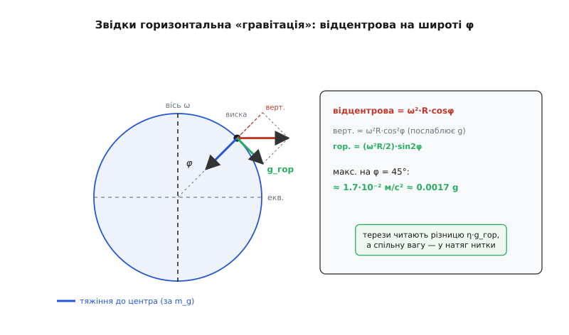
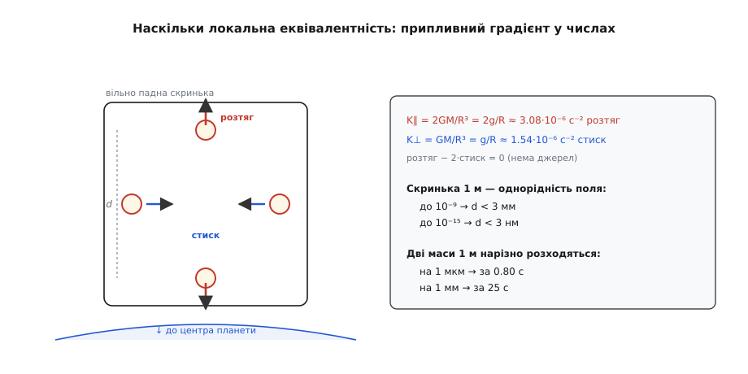

# 🧮 Параметр Етвеша: як зважити рівність двох мас

Уся будова принципу еквівалентності стоїть на короткому твердженні: гравітаційна маса дорівнює інертній, `m_g = m_i`. Але «дорівнює» — це ще не фізика. Фізика починається, коли з'являється число: наскільки дорівнює? З точністю до відсотка, до мільярдної частки, до 10⁻¹⁵? Щоб таке число мало сенс, потрібні дві речі — **безрозмірна міра розбіжності**, однакова для будь-якого поля тяжіння, і **прилад**, здатний її прочитати. Ця сторінка збудує обидві. Спершу — параметр Етвеша, число, у яке впаковано всю нерівність двох мас. Тоді — крутильні терези, хитрий спосіб виміряти горизонтальну силу, якої за рівності мас не існує зовсім. І наприкінці — обернене питання: де ж сама картинка «однорідне поле» перестає бути точною, і на якому масштабі це видно в числах.

## Означення: число замість слова «однаково»

Пустімо у полі тяжіння `g` два тіла з різних речовин. Прискорення кожного диктує не маса окремо, а відношення двох мас:

```
a = (m_g / m_i) · g
```

Якщо принцип еквівалентності точний, це відношення в обох тіл — рівно одиниця, тож `a₁ = a₂ = g`. Порушення означало б, що прискорення трохи різні. Природно міряти цю різницю не в абсолютних `м/с²` (тоді число залежало б від того, у чиє поле ми кинули тіла — Землі, Сонця, Місяця), а **відносно** — часткою від самого прискорення. Так народжується **параметр Етвеша** (на честь угорського фізика Лоранда Етвеша) — безрозмірна відносна різниця прискорень:

```
η = 2 · (a₁ − a₂) / (a₁ + a₂)
```

Розберімо, чому саме така форма, а не простіше `a₁ − a₂`. По-перше, чисельник і знаменник — обидва прискорення, тож η **безрозмірна**: ділення `м/с²` на `м/с²` стирає одиниці, і лишається чисте відношення. По-друге, у знаменнику стоїть подвоєне середнє `(a₁ + a₂)`, а не одне з прискорень — так вираз **симетричний**: поміняй тіла місцями, і η лише змінить знак, не величину. По-третє, нормування на середнє робить η **часткою**: η = 10⁻⁹ читається однаково — «розбіжність у дев'ятому знаку» — байдуже, кидаємо ми тіла на Землі чи на Місяці. Число стає властивістю **пари речовин**, а не поля.

А тепер найголовніше — що це число каже про самі маси. Підставмо `a_i = (m_g/m_i)_i · g` у формулу. Спільний множник `g` скорочується (він же однаковий для обох тіл — те саме поле):

```
η = 2 · [ (m_g/m_i)₁ − (m_g/m_i)₂ ] / [ (m_g/m_i)₁ + (m_g/m_i)₂ ]
```

Обидва відношення `m_g/m_i` гранично близькі до одиниці, тож їхня сума — це майже рівно 2, і знаменник гаситься з двійкою вгорі:

```
η ≈ (m_g/m_i)₁ − (m_g/m_i)₂
```

Ось де вся суть. **Параметр Етвеша — це просто різниця відношень «гравітаційна маса до інертної» між двома речовинами.** Сказати «η = 10⁻⁹ для алюмінію й платини» означає буквально: у цих двох матеріалів `m_g/m_i` збігаються до дев'ятого знаку. Нуль означає точну еквівалентність; будь-яке відхилення від нуля — тріщину в ній. Уся низка дослідів від Ньютона до супутника вимірює саме η і щоразу знаходить нуль — лише з дедалі меншою стелею згори.

**Приклад (що ховається за «η = 10⁻⁹»).** Візьмімо два тіла, чиї прискорення на Землі розійшлися в дев'ятому знаку.

```
a₁ = 9.810000000 м/с²
a₂ = 9.809999990 м/с²
a₁ − a₂ = 1.0·10⁻⁸ м/с²
a₁ + a₂ ≈ 19.62 м/с²
η = 2 · 1.0·10⁻⁸ / 19.62 ≈ 1.0·10⁻⁹
```

Абсолютна різниця прискорень — заледве 10⁻⁸ `м/с²`, тобто η·g. Прочитати таку крихту в лоб, порівнюючи два падіння секундоміром, безнадійно. Уся майстерність експерименту — знайти спосіб, у якому ця мікроскопічна різниця постає не крихтою на тлі величезного `g`, а **єдиним сигналом, що взагалі є**, коли все інше зведено до нуля. Саме це роблять крутильні терези.

## Чому не просто зважити: горизонтальний фокус

Найпряміша думка — покласти на терези шматок алюмінію, тоді платину, і порівняти ваги. Але зважити означає прочитати `m_g · g` — повну вагу, величезне число. Перевірити еквівалентність — це порівняти `m_g` з `m_i` того самого тіла з точністю до мільярдної, тобто витягти дев'ятий знак з-під повної ваги. Будь-який дрейф пружини, температура, тертя в опорі затирають цей знак начисто. Прямий шлях глухий.

Хитрість Етвеша — не читати велику вертикальну силу взагалі. Читати **горизонтальну**, якої за рівності мас не існує. Але звідки в тяжінні взятися горизонтальній силі? З того, що Земля **обертається**.

Станьмо на широті φ. На тіло діють дві речі. Перша — тяжіння до центра Землі, воно чіпляється за гравітаційну масу: `m_g · g_A`, де `g_A = GM/R²` — чисте гравітаційне притягання (закон тяжіння скаже, що воно спадає як квадрат відстані). Друга — **відцентрова сила** обертової системи, вона тягне тіло геть від осі обертання й чіпляється за інертну масу: `m_i · ω²·R·cosφ`, де `ω` — [кутова швидкість](book:physics/angular-velocity) добового обертання Землі, а `R·cosφ` — відстань від тіла до осі. Розкладімо відцентрову на дві складові — вздовж місцевої вертикалі й упоперек:

```
вертикальна (трохи послаблює g):   ω²·R·cos²φ
горизонтальна (до екватора):        ω²·R·cosφ·sinφ = (ω²·R / 2)·sin2φ
```

Горизонтальна складова спрямована до екватора й зникає лише на полюсі та екваторі, а найбільша — на широті 45°. Порахуймо її баланс.

**Приклад (горизонтальна «гравітація» від обертання).** Підставмо числа для Землі: `ω = 7.29·10⁻⁵ рад/с`, `R = 6.371·10⁶ м`.

```
ω²      = (7.29·10⁻⁵)²      ≈ 5.32·10⁻⁹ с⁻²
ω²·R    = 5.32·10⁻⁹ · 6.371·10⁶ ≈ 3.39·10⁻² м/с²   (відцентрова на екваторі)
макс. горизонтальна (φ = 45°):
        = (ω²·R) / 2         ≈ 1.69·10⁻² м/с² ≈ 0.0017 g
```

Отже, обертання Землі дає постійну горизонтальну «гравітацію» близько `1.7·10⁻² м/с²` — десь одну шістсоту частку `g`, спрямовану до екватора. Це і є **опорна лінійка**, на якій крутильні терези відкладають порушення еквівалентності.


*Звідки береться горизонтальна «гравітація». Відцентрова сила обертової Землі спрямована геть від осі; на широті φ вона розкладається на вертикальну частину (послаблює вагу) і горизонтальну (ω²R/2)·sin2φ до екватора. Саме цю горизонтальну лінійку — близько 1.7·10⁻² м/с² на широті 45° — крутильні терези множать на η, а спільну вертикальну вагу відкидають у натяг нитки.*

Тепер сам механізм, і це найтонше місце. Тяжіння тягне вниз-до-центра **пропорційно `m_g`**, а горизонтальна відцентрова — вбік **пропорційно `m_i`**. Місцева вертикаль (виска) — це напрямок, де ці дві сили складаються в рівновагу для якоїсь **опорної** речовини. Тіло, чиє `m_g/m_i` трохи інакше, вже не матиме ідеальної рівноваги: його горизонтальна відцентрова (за `m_i`) не гаситься начисто горизонтальною проєкцією тяжіння (за `m_g`), і лишається крихітна **бічна сила**. Випишімо її. Повна сила на тіло `i`:

```
F_i = m_g,i · g_A (до центра)  +  m_i · ω²R (від осі)
```

Відніміть від неї «`m_i`, помножене на опорне поле виски» — те, що діяло б на еталонну речовину з `m_g = m_i`. Спільна частина (та сама вертикальна рівновага) вилітає, і лишається чистий залишок:

```
F_i − m_i·(опорне поле) = (m_g,i − m_i) · g_A   (спрямований суто до центра)
```

Цей залишок радіальний, а виска нахилена від радіуса рівно на кут `β ≈ g_гор/g` (нахил, який і створила відцентрова). Проєкція радіального залишку на горизонталь дає бічну силу:

```
F_гор,i ≈ (m_g,i − m_i) · g_гор = m_i · (m_g,i/m_i − 1) · g_гор
```

Візьмімо тепер **дві** речовини на кінцях горизонтального коромисла й порахуймо різницю їхніх бічних сил — саме вона крутить нитку:

```
ΔF_гор = m · [ (m_g/m_i)₁ − (m_g/m_i)₂ ] · g_гор = m · η · g_гор
```

Різниця бічних сил дорівнює `η`, помноженому на горизонтальну лінійку `g_гор` і на масу. Ця сила створює на нитці [крутний момент](book:physics/torque) `τ = m·η·g_гор·ℓ`, де `ℓ` — плече коромисла.

І ось чому це б'є пряме зважування вщент. Величезна спільна сила `m·g` тягне обидва тягарці **вниз, уздовж нитки** — вона повністю йде в натяг нитки й **не створює жодного крутного моменту** навколо вертикальної осі підвісу. Крутить нитку тільки залишок `m·η·g_гор`, а він дорівнює нулю, якщо еквівалентність точна. Прилад **сліпий до великого числа** й читає прямо крихітну частину, що порушує принцип, — це **нуль-експеримент**: не треба віднімати два велетні й ловити різницю в дев'ятому знаку, геометрія віднімає спільну частину сама. Що більше, повернімо всі терези на 180°: напрямок «до екватора» лишається на місці, а коромисло перевернулося — і знак η-моменту **обертається**, тоді як дрейф приладу, тертя, температура стоять на місці. Віднімання двох орієнтацій зчищає всю інструментальну грязь і лишає чистий η. Саме так Лоранд Етвеш зі співавторами Пекаром і Фекете дійшли межі близько 5·10⁻⁹ (остаточний результат опубліковано 1922 року, за три роки після смерті Етвеша) — а це вимагало прочитати різницю бічних прискорень рівня `η·g_гор ≈ 10⁻⁹ · 1.7·10⁻² ≈ 1.7·10⁻¹¹ м/с²`, і саме тонка кварцова нитка з мізерним крутним опором та довге накопичення це дозволили.

> 🔧 **Навіщо це.** Той самий принцип «читай малу горизонтальну різницю, а не велику вертикальну суму» живе в сучасних **гравітаційних градієнтометрах** і в космічних тестах еквівалентності. Супутник MICROSCOPE порівнював два циліндри з титану й платини у вільному падінні на орбіті й довів межу η до ≈ 10⁻¹⁵ — але й там сигналом була не вага, а мізерна відносна сила, яку треба тримати нульовою, модулюючи її обертанням апарата, точнісінько як Етвеш обертав свої терези на 180°.

## Де закінчується «однорідне поле»: припливний градієнт

Уся хитрість зі скринькою, де тяжіння зникає, спирається на одне мовчазне припущення — що поле **однорідне**: скрізь однакової сили й одного напрямку. Справжнє поле планети не таке. Воно слабшає з висотою і всюди спрямоване до центра, тож у двох різних точках скриньки прискорення трохи різні. Ця залишкова неоднорідність — те, чого переходом у вільне падіння **не прибрати**, — і є межа, за якою еквівалентність стає лише наближенням. Оцінімо її в числах.

За [законом всесвітнього тяжіння](book:physics/newton-gravitation) сила поля спадає як квадрат відстані: `g = GM/r²`. Візьмімо похідну за `r`, щоб узнати, як швидко воно міняється з висотою:

```
dg/dr = −2GM/r³
```

Отже, між двома точками, рознесеними на відстань `d` уздовж радіуса, прискорення різняться на

```
Δg ≈ (2GM/r³) · d
```

Це і є **припливний градієнт** — та частина тяжіння, що лишається після переходу у вільне падіння. Уздовж радіуса дві вільні пробні маси **розтягуються** з відносним прискоренням `(2GM/r³)·d`; упоперек, на однаковій висоті, вони **зближуються** — бо обидві падають до одного центра — з удвічі меншим `(GM/r³)·d`. Складімо разом: одне розтягання `+2GM/r³` і два стискання по `−GM/r³` дають у сумі нуль. Ця нульова сума — не випадковість, а слід того, що в порожнечі поле не має джерел; але для нас зараз важить самé число градієнта. Гарна тотожність спрощує його: оскільки `g = GM/R²`, радіальний градієнт — це просто `2g/R`.

**Приклад (припливний градієнт біля поверхні Землі).** Числа: `GM = 3.986·10¹⁴ м³/с²`, `R = 6.371·10⁶ м`, `g ≈ 9.82 м/с²`.

```
K∥ (радіальний, розтяг)   = 2GM/R³ = 2g/R = 2·9.82 / 6.371·10⁶ ≈ 3.08·10⁻⁶ с⁻²
K⊥ (поперечний, стиск)    = GM/R³  =  g/R  ≈ 1.54·10⁻⁶ с⁻²
```

Одиниця `с⁻²` — це `(м/с²) на метр`: на кожен метр рознесення прискорення міняється на `3.08·10⁻⁶ м/с²`. Тепер із цим одним числом можна відповісти на обидва питання брифу — якою мала має бути скринька і на який короткий час, щоб однорідне наближення трималося на заданому рівні.

**Критерій за розміром.** Відносна неоднорідність поля вздовж радіального розміру `d` — це градієнт, поділений на саме поле:

```
K∥ · d / g = (2g/R)·d / g = 2d / R
```

Гарно: частка неоднорідності — просто `2d/R`, від планетних сталих не залежить. Для скриньки в один метр це `2 / 6.371·10⁶ ≈ 3.1·10⁻⁷` — поле однорідне до трьох стотисячних відсотка. Щоб тримати однорідність на рівні `ε`, скринька має бути меншою за `d < ε·R/2`:

```
ε = 10⁻⁹  →  d < 3.2·10⁻³ м  ≈ 3 мм
ε = 10⁻¹⁵ →  d < 3.2·10⁻⁹ м  ≈ 3 нм
```

Ось чому наземні досліди на рівні 10⁻⁹ ще можуть спиратися на скриньку сантиметрових розмірів, а от загнати неоднорідність під 10⁻¹⁵ **зменшенням** скриньки нереально — довелося б стиснути її до кількох нанометрів. Тому найточніші тести не зменшують скриньку, а **модулюють** сигнал у часі (обертанням апарата, орбітальним рухом) і накопичують його, відділяючи припливний фон від сталого порушення.

**Критерій за часом.** Відпустімо у вільно падній скриньці дві маси в спокої, рознесені на `d` уздовж радіуса. Вони розходяться з відносним прискоренням `a_від = K∥·d`, а зміщення росте як `Δs = ½·K∥·d·t²`. Скільки часу до помітного розходу?

```
d = 1 м,  K∥ = 3.08·10⁻⁶ с⁻²,  a_від = 3.08·10⁻⁶ м/с²
Δs = 1 мкм = 10⁻⁶ м:  t = √(2·10⁻⁶ / 3.08·10⁻⁶) ≈ 0.80 с
Δs = 1 мм  = 10⁻³ м:  t = √(2·10⁻³ / 3.08·10⁻⁶) ≈ 25 с
```

Отже, метрова лабораторія у вільному падінні лишається «однорідною до мікрона» менше ніж секунду, а до міліметра розходиться за пів хвилини. Це й є точна ціна слів «досить мала скринька за досить короткий час»: за розмір платимо міліметрами на мільярдну частку, за час — секундами на мікрон розходу.


*Припливний градієнт у числах. Уздовж радіуса пробні маси розтягуються, упоперек — стискаються вдвічі слабше; сума розтягу й двох стисків — нуль. Для метрової скриньки біля Землі поле однорідне до 3·10⁻⁷, а дві маси розходяться на мікрон уже за 0.8 секунди — ось наскільки «локальна» місцева еквівалентність.*

Ці два числа й обрамлюють усе тяжіння з двох боків. Параметр Етвеша `η` (від нуля до стелі 10⁻¹⁵) каже, **наскільки точно** еквівалентність тримається: поле однорідне настільки, що жодна речовина не видає різниці між гравітаційною та інертною масою. Припливний градієнт `2GM/r³` каже, **де** вона перестає бути точною: це той залишок тяжіння, якого не змиває жодне вільне падіння, і саме він у геометричній теорії тяжіння стає мірою викривлення простору-часу — тим, наскільки розходяться сусідні вільні падіння. Одне число зверху, друге знизу — і разом вони перетворюють «важке й легке падають однаково» зі слогана на вимірювану, обчислювану фізику.
