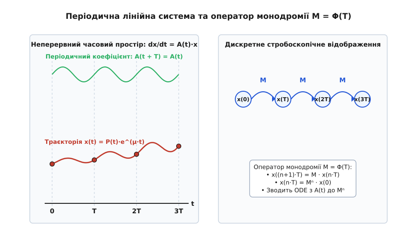
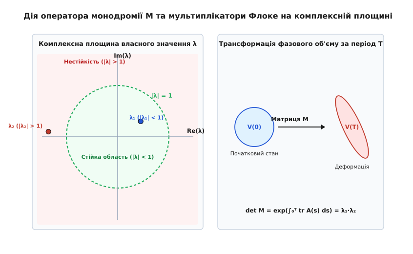
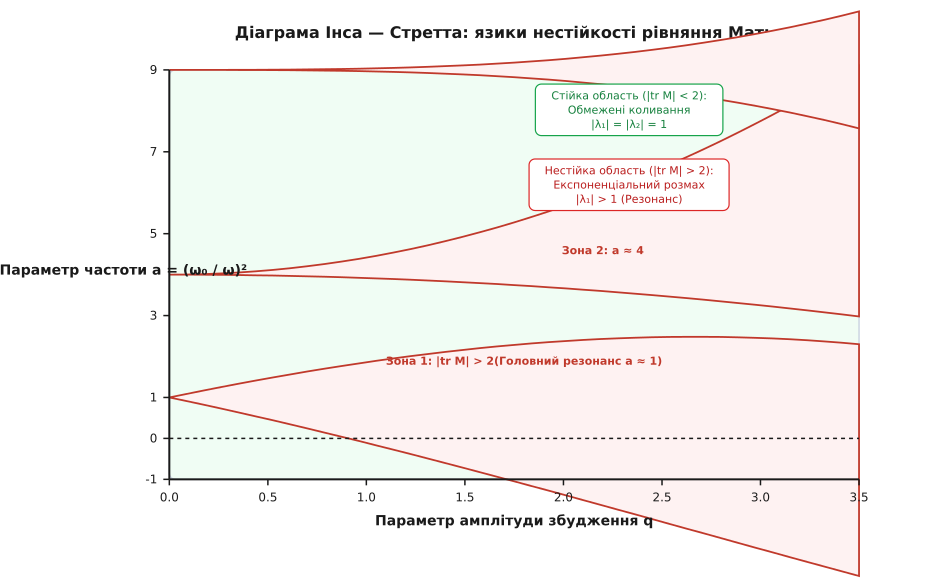

# Теорія Флоке

<preknowlist>
* [Механічний резонанс та вимушені коливання](topic:physics/mechanics/mechanical-resonance.md)
* [Фазовий портрет та лінеаризація систем](topic:physics/mechanics/phase-portrait.md)
* [Осцилятор Даффінга та нелінійні коливання](topic:physics/mechanics/duffing-oscillator.md)
* [Детермінований хаос та атрактори](topic:physics/mechanics/deterministic-chaos.md)
</preknowlist>

Коли на механічну систему діють сили з постійними коефіцієнтами тертя та жорсткості, її динаміка описується автономними диференціальними рівняннями, а стійкість повністю визначається знаками дійсних частин власних значень постійної матриці системи. Проте у величезному класі реальних фізичних задач — від перевернутого маятника з вібруючою точкою підвісу (маятника Капіци) та утримання заряджених іонів у квадропольних пастках Пола до руху супутників на еліптичних орбітах та електронів у періодичному колі кристала — параметр відновлювальної сили або жорсткості змінюється періодично з часом. У таких неавтономних системах спроба застосувати звичний аналіз через спектр миттєвої матриці `A(t)` призводить до помилкових висновків: система може залишатися абсолютно стійкою навіть тоді, коли миттєві власні значення мають додатні дійсні частини, або навпаки — розганятися до катастрофічного параметричного резонансу при миттєво стійкому спектрі.

Розв'язання цієї фундаментальної проблеми дає **теорія Флоке** (англ. *Floquet theory*, названа на честь французького математика Гастона Флоке) — математичний апарат, який доводить, що неперервну динаміку лінійної системи з періодичними коефіцієнтами можна строго звести до добутку чисто періодичного руху та автономної експоненціальної огинаючої. Історичний шлях від досліджень коливань еліптичних мембран та астрономічних обчислень руху Місяця до строгової математичної формулювання описано у [історії виникнення теорії Флоке](topic:physics/floquet-theory/hist-floquet.md).

## Фізична постановка задачі та фундаментальна матриця розв'язків

Розглянемо лінійну неавтономну динамічну систему (грец. *σύστημα* — утворене з частин, з'єднане) розмірності `n`, стан якої у фазовому просторі описується вектором `x(t) ∈ ℝⁿ`:

```
dx/dt = A(t) · x
```

Матричний коефіцієнт `A(t)` розміру `n × n` є неперервною функцією часу й задовольняє умову строгої часової періодичності з мінімальним періодом `T > 0`:

```
A(t + T) = A(t)  [для всіх t ∈ ℝ]
```

У класичних автономних системах, де матриця `A` є сталою, загальний розв'язок задачі Коші виражається безпосередньо через матричну експоненту: `x(t) = exp(A · t) · x(0)`. Поведінка системи повністю задається власними значеннями матриці `A`: від'ємні дійсні частини гарантують асимптотичне згасання, а додатні спричиняють експоненціальний розмах. 

Проте для періодичної матричної функції `A(t)` спроба написати розв'язок у вигляді інтегральної експоненти `x(t) = exp( ∫₀ᵗ A(s) ds ) · x(0)` виявляється математично помилковою. Формула з інтегралом у показнику експоненти справедлива **лише тоді**, коли матриця `A(t)` комутує зі своїм інтегралом у всі моменти часу, тобто `A(t₁) · A(t₂) = A(t₂) · A(t₁)`. У більшості реальних осциляційних систем (зокрема при параметричному збудженні) ця умова комутативності порушується, оскільки відновлювальна сила та швидкість змінюються в різних фазах збудження. Миттєві власні значення `A(t)` не відображають накопиченого за період ефекту, тому оцінка стійкості за "миттєвим спектром" дає хибні результати.


*Періодична система A(t + T) = A(t) та оператор монодромії M, що переносить стан системи через повний період T.*

Для побудови точної аналітичної теорії розглянемо **функціональний оператор еволюції** `U(t, t₀)` (матрицю переходу станів), який пов'язує вектор стану в момент часу `t₀` з вектором стану у момент `t`: `x(t) = U(t, t₀) · x(t₀)`. Оператор еволюції має фундаментальну властивість мультиплікативного композиційного групування: `U(t₂, t₀) = U(t₂, t₁) · U(t₁, t₀)`. Завдяки періодичності матриці коефіцієнтів `A(t + T) = A(t)`, оператор еволюції є інваріантним відносно одночасного часового зсуву обох аргументів на ціле число періодів:

```
U(t + T, t₀ + T) = U(t, t₀)
```

Розглянемо **фундаментальну матрицю розв'язків** (англ. *fundamental matrix solution*) `Φ(t)` розміру `n × n`. Стовпчики цієї матриці складаються з `n` лінійно незалежних векторів розв'язку `x₁(t), x₂(t), ..., xₙ(t)`. За означенням, матрична функція `Φ(t)` задовольняє матричне диференціальне рівняння:

```
dΦ/dt = A(t) · Φ(t)
```

Зафіксуємо нормовану початкову умову на початку періоду: `Φ(0) = I`, де `I` — одинична матриця розміру `n × n`. З теореми існування та єдиності розв'язку задач Коші випливає, що фундаментальна матриця `Φ(t)` є невиродженою в будь-який момент часу: її визначник (вроньскіан системи) ніколи не перетворюється на нуль (`det Φ(t) ≠ 0`).

Здійснимо часовий зсув фундаментальної матриці на один повний період збудження `T`, розглянувши матричну функцію `Ψ(t) = Φ(t + T)`. Продиференціюємо `Ψ(t)` по часу `t`:

```
dΨ/dt = dΦ(t + T)/dt
= A(t + T) · Φ(t + T)     [за правилом диференціювання dΦ/dt = A(t) · Φ(t)]
= A(t) · Ψ(t)             [унаслідок періодичності A(t + T) = A(t)]
```

Це означає, що зсунута на період матрична функція `Ψ(t)` задовольняє **те саме** вихідне матричне диференціальне рівняння. Оскільки стовпчики `Φ(t)` утворюють повний базис розв'язків у `n`-вимірному просторі, будь-яка інша фундаментальна матриця тієї самої системи пов'язана з `Φ(t)` множенням справа на деяку постійну невироджену матрицю `M`:

```
Φ(t + T) = Φ(t) · M
```

Підставивши у це співвідношення значення `t = 0` та врахувавши початкову умову `Φ(0) = I`, отримуємо значення постійної матриці переходу за період:

```
Φ(T) = Φ(0) · M = I · M = M
```

Матриця `M = Φ(T)` називається **матрицею монодромії** (від грецьких слів *μόνος* — один, та *δρόμος* — біг, шлях). Матриця монодромії являє собою оператор зсуву на період, який відображає фазовий стан системи на початку періоду `x(0)` у фазовий стан через один повний період `x(T)`.

## Матриця монодромії, мультиплікатори та показники Флоке

Існування постійної матриці монодромії `M` дозволяє висунути дискретну динаміку системи на кінцях періодичних інтервалів `t_n = n · T`. Справді, застосовуючи правило зсуву послідовно `n` разів, отримуємо значення фундаментальної матриці через `n` періодів:

```
Φ(n · T) = Mⁿ
```

Відповідно, вектор фазового стану системи у дискретні моменти часу `t_n = n · T` виражається через матричний степінь:

```
x(n · T) = Mⁿ · x(0)
```

Таким чином, неперервна диференціальна задача `dx/dt = A(t)·x` дискретизується на перетині Пуанкаре й перетворюється на дискретне лінійне відображення `x_{n+1} = M · x_n`.

Довготривала поведінка послідовності `Mⁿ` повністю задається спектральним розкладом матриці монодромії `M`. Знайдемо власні значення та власні вектори оператора монодромії:

```
M · v_i = λ_i · v_i
```

Власні значення `λ₁, λ₂, ..., λₙ` матриці монодромії `M` називаються **мультиплікаторами Флоке** (лат. *multiplico* — примножую). Вони є коренями характеристичного многочлена:

```
det(M - λ · I) = 0
```

Оскільки `det M = det Φ(T) ≠ 0`, жоден мультиплікатор не дорівнює нулю (`λ_i ≠ 0` для всіх `i = 1, ..., n`).

Оскільки матриця `M` є невиродженою, завжди існує така (взагалі кажучи, комплексна) постійна матриця `R`, що `M = exp(R · T)`. Власні значення `μ₁, μ₂, ..., μₙ` матриці `R` носять назву **показників Флоке** (лат. *expono* — виставляю наочно). Зв'язок між мультиплікаторами та показниками Флоке задається співвідношенням:

```
λ_i = e^(μ_i · T)
```

Звідси показники Флоке виражаються через мультиплікатори як комплексні логарифми:

```
μ_i = (1 / T) · ln(λ_i) = (1 / T) · ( ln|λ_i| + i · (arg(λ_i) + 2·π·k) )   [k ∈ ℤ]
```


*Деформація фазового об'єму під дією матриці M та відповідні власні значення λ_i на комплексній площині.*

Дійсна частина показника Флоке `Re(μ_i) = (1 / T) · ln|λ_i|` описує середню експоненціальну швидкість зростання або згасання амплітуди коливань, тоді як уявна частина `Im(μ_i) = arg(λ_i) / T` відповідає за власну фазову частоту обертання.

Звідси випливає **загальний критерій стійкості Флоке**:
1. **Асимптотична стійкість**: Усі мультиплікатори лежать строго всередині одиничного кола на комплексній площині: `|λ_i| < 1` для всіх `i = 1, ..., n` (що відповідає від'ємним дійсним частинам показників Флоке `Re(μ_i) < 0`). Будь-яке початкове збурення експоненціально згасає до нуля при `t → +∞`.
2. **Нейтральна (межова) стійкість**: Усі мультиплікатори задовольняють умову `|λ_i| ≤ 1`, причому для мультиплікаторів на одиничному колі `|λ_i| = 1` відсутні кратні йорданові блоки (немає нетривіальних приєднаних векторів). Фазові траєкторії залишаються обмеженими на всій осі часу.
3. **Параметрична нестійкість (розмах)**: Принаймні один мультиплікатор лежить поза одиничним колом: `|λ_k| > 1` (що відповідає додатній дійсній частині показника Флоке `Re(μ_k) > 0`). Амплітуда коливань зростає експоненціально `|x(t)| ~ exp(Re(μ_k) · t)`, викличучи параметричний резонанс.

Повне алгебраїчне виведення теореми Флоке, властивостей експоненти матриці та формули Ліувілля для визначника матриці монодромії наведено у [математичному апараті оператора монодромії](topic:physics/floquet-theory/math-monodromy.md).

## Структурна теорема Флоке: декомпозиція періодичного руху

Головний фізичний зміст теорії Флоке полягає в точній геометричній декомпозиції фазового руху на періодичний та автономний сомножителі.

### Теорема (структура розв'язків Флоке)
Будь-яку фундаментальну матрицю `Φ(t)` лінійної `T`-періодичної системи можна подати у формі добутку:

```
Φ(t) = P(t) · e^(R·t)
```

де `P(t)` — невироджена періодична матрична функція з періодом збудження `P(t + T) = P(t)`, яка задовольняє початкову умову `P(0) = I`, а `R = (1/T) · ln M` — постійна матриця.

Наслідок для окремого вектора розв'язку `x(t)` є надзвичайно наочним. Якщо початковий вектор `x(0) = v_i` вибрано як власний вектор матриці монодромії `M · v_i = λ_i · v_i`, відповідна фазова траєкторія набуває вигляду:

```
x_i(t) = e^(μ_i · t) · p_i(t)
```

де `p_i(t) = P(t) · v_i` є строго періодичним вектором з періодом `T` (`p_i(t + T) = p_i(t)`).

Ця формула показує, що рух будь-якої періодично збуреної лінійної системи розкладається на дві принципово різні складові:
1. **Періодична модуляція `p_i(t)`**: Форма коливань, яка точно повторює період зовнішнього збудження `T` (або власні гармоніки `ω = 2·π / T`). Вона описує «внутрішню геометричну хвилю» руху.
2. **Глобальна огинаюча `exp(μ_i · t)`**: Автономна експоненціальна функція, яка визначає довготривалу амплітудну динаміку (згасання, збереження амплітуди або експоненціальне розганяння).

Такий розклад аналогічний амплітудній модуляції в радіотехніці та просторовій теоремі Блоха у фізиці твердого тіла. У квантовій механіці кристал створює просторово-періодичний потенціал `V(r + R) = V(r)`, і хвильова функція електрона виражається як добуток плоскої хвилі `exp(i·k·r)` на періодичну функцію ґратки `u_k(r)`. Теорія Флоке часових систем є прямою часовою аналогією просторової теореми Блоха.

Фізична сутність параметричного накачування енергії полягає у фазовому узгодженні між зовнішньою модуляцією жорсткості та власною швидкістю осцилятора. На відміну від вимушеного резонансу, де зовнішня сила діє прямо на вектор стану, параметричне збудження змінює сам коефіцієнт відновлювальної сили `k(t)`. Якщо жорсткість збільшується в моменти максимального відхилення осцилятора (коли потенціальна енергія максимальна) і зменшується в моменти проходження нуля (коли потенціальна енергія дорівнює нулю), за кожен період збудження у систему накачується додатна порція механічної роботи. Це спричиняє експоненціальне розганяння коливань, яке в лінійній моделі описується мультиплікатором `|λ| > 1`.

## Перетворення Флоке — Ляпунова та автономізація систем

Теорема Флоке відкриває шлях до принципового спрощення неавтономних диференціальних рівнянь за допомогою невиродженої заміни фазових змінних. 

Розглянемо заміну координат `x(t) = P(t) · y(t)`, де `P(t)` — періодична матрична функція з теореми Флоке. Оскільки `P(t)` є невиродженою та обмеженою разом зі своєю похідною на всьому часовому інтервалі, це перетворення є **заміною Ляпунова** (англ. *Lyapunov transformation*). Заміна Ляпунова зберігає всі топологічні властивості фазового портрета та покажчики стійкості.

Продиференціюємо заміну `x(t) = P(t) · y(t)` по часу `t`:

```
dx/dt = (dP/dt) · y + P(t) · (dy/dt)
```

З іншого боку, з вихідного рівняння `dx/dt = A(t) · x = A(t) · P(t) · y`. Прирівнюючи обидва вирази:

```
(dP/dt) · y + P(t) · (dy/dt) = A(t) · P(t) · y
P(t) · (dy/dt) = ( A(t) · P(t) - dP/dt ) · y
dy/dt = P⁻¹(t) · ( A(t) · P(t) - dP/dt ) · y
```

Підставивши у цей вираз формулу `P(t) = Φ(t) · exp(-R·t)` та її похідну `dP/dt = A(t)·P(t) - P(t)·R`, отримуємо тотожність:

```
dy/dt = R · y
```

Цей результат є надзвичайно глибоким: **заміна змінних Флоке — Ляпунова `x = P(t) · y` повністю автономізує лінійну періодичну систему**, перетворюючи рівняння з періодичними коефіцієнтами `A(t)` на еквівалентну автономну систему з постійною матрицею `R`.

Звідси випливає, що складна динаміка неавтономної системи складається з двох послідовних лінійних перетворень:
1. Автономного експоненціального розтягу/стиску у фазових координатах `y(t) = exp(R · t) · y(0)`.
2. Періодичної геометричної деформації фазового простору за допомогою матричного оператора `P(t)`.

## Метод усереднення та зв'язок із високочастотним збудженням

У багатьох фізичних застосуваннях (зокрема при розрахунку маятника Капіци та іонних пасток) частота зовнішнього параметричного збудження `Ω = 2·π / T` суттєво перевищує власну частоту вільних коливань осцилятора `ω₀` (`Ω >> ω₀`). Для аналізу таких систем застосовується метод усереднення Боголюбова — Митропольського.

Розділимо фазову змінну `x(t)` на повільну усереднену складову `X(t)` та швидкі осциляції `ξ(t)` на частоті збудження `Ω`:

```
x(t) = X(t) + ξ(t)
```

Підставивши цей розклад у рівняння руху й усреднивши по періоду `T`, швидка змінна `ξ(t)` виражається через похідні від `X(t)`. У результаті швидкозмінне параметричне збудження створює додаткову сили в середньому рівнянні руху.

Середня сила виражається через градієнт так званого **ефективного потенціалу Капіци** `V_eff(X)`. Для осцилятора з високочастотною модуляцією жорсткості швидкозмінна сила діє не як збурення, а як новий стабільний відновлювальний потенціал. Теорема Флоке пояснює цей ефект строго: улеглива дійсна частина показника Флоке `Re(μ)` формується саме за рахунок від'ємного внеску усередненого ефективного потенціалу, що гарантує динамічну стабілізацію непостійного стану рівноваги.

## Вплив дисипації та в'язкого тертя у періодичних системах

У реальних механічних та фізичних осциляторах завжди присутнє в'язке тертя або дисипація енергії. Розглянемо дисипативне рівняння Матьє:

```
d²y/dt² + 2·γ · (dy/dt) + (a - 2·q·cos(2·t)) · y = 0
```

де `γ > 0` — коефіцієнт в'язкого згасання.

За допомогою підстановки `y(t) = e^(-γ · t) · u(t)` виключаємо член першої похідної. Для нової змінної `u(t)` отримуємо стандартне бездисипативне рівняння Матьє:

```
d²u/dt² + (a - γ² - 2·q·cos(2·t)) · u = 0
```

Звідси випливає, що мультиплікатори дисипативної системи `λ_dip` пов'язані з мультиплікаторами консервативної системи `λ_cons` простим масштабувальним співвідношенням:

```
λ_dip = e^(-γ · T) · λ_cons
```

Визначник матриці монодромії дисипативної системи дорівнює:

```
det M_dip = e^(-2·γ · T) < 1
```

Дисипація стискає фазовий об'єм зі швидкістю `2·γ`. У результаті всі області стійкості на площині параметрів розширюються, а зони параметричного резонансу стискаються й зсуваються вгору.

Для збудження параметричного резонансу в дисипативній системі амплітуда збудження `q` повинна перевищити поріг згасання. Для головної зони нестійкості (`a ≈ 1`) критичне значення амплітуди дорівнює `q_crit ≈ 2·γ`. Якщо амплітуда накачування менша за критичну (`q < 2·γ`), в'язке тертя повністю поглинає вхідну енергію, і параметричний резонанс не виникає.

## Зв'язок із характеристичними показниками Ляпунова у детермінованому хаосі

У сучасному аналізі нелінійних динамічних систем та хаосу теорія Флоке забезпечує математичний фундамент для розрахунку покажчиків Ляпунова та спектрального розкладу періодичних орбіт.

Будь-який хаотичний атрактор містить у собі нескінченну зліченну множину **нестійких періодичних орбіт** (англ. *unstable periodic orbits*, UPO). Хоча хаотична траєкторія блукає по фазовому простору аперіодично, вона нескінченно часто повертається в окіл нестійких орбіт, затримуючись біля них на скінченний час. 

За допомогою теорії Флоке для кожної нестійкої періодичної орбіти обчислюється її власна матриця монодромії `M_orb` та трансверсальні мультиплікатори `λ_k`. Оскільки орбіта є нестійкою, принаймні один мультиплікатор за модулем перевищує одиницю: `|λ_unstable| > 1`.

Дійсні частини покажчиків Флоке `γ_k = Re(μ_k) = (1/T) · ln|λ_k|` є локальними покажчиками Ляпунова даної періодичної орбіти. У теорії розкладу за циклами Цвітановича (англ. *cycle expansion theory*) термодинамічні середні значення, фрактальна розмірність атрактора та топологічна ентропія хаотичної системи виражаються строго через суми по нестійких мультиплікаторах Флоке усіх замкнених орбіт системи.

## Біфуркації періодичних орбіт та механізми втрати стійкості

У нелінійній динаміці та теорії хаосу аналіз стійкості періодичних орбіт (граничних циклів) здійснюється шляхом лінеаризації диференціальних рівнянь в околі періодичного розв'язку `x_period(t + T) = x_period(t)`. Збурення `δx(t) = x(t) - x_period(t)` задовольняє варіаційне рівняння `d(δx)/dt = A(t) · δx`, де `A(t) = D f(x_period(t))` є періодичною матрицею Якобі.

Оскільки сама періодична траєкторія є розв'язком автономної нелінійної системи, зсув за часом уздовж траєкторії дає незатухаюче збурення. Тому для нелінійних автономних систем **один із мультиплікаторів Флоке завжди строго дорівнює одиниці**: `λ₁ = 1` (тривіальний мультиплікатор, що відповідає зсуву фази уздовж циклу).

Решта `n - 1` мультиплікаторів Флоке (трансверсальні мультиплікатори) визначають стійкість граничного циклу відносно відхилень у поперечному перетині Пуанкаре. При зміні параметрів системи трансверсальні мультиплікатори рухаються по комплексній площині й можуть перетинати одиничне коло `|λ| = 1`. Залежно від точки перетину одиничного кола виникають три фундаментальні типи біфуркацій періодичних орбіт:

### 1. Перетин у точці λ = +1 (седло-вузлова або пітчфорк біфуркація)
Мультиплікатор виходить з одиничного кола через дійсну вісь у точці `λ = +1`. У цій точці періодична орбіта зливається з іншою орбітою або втрачає стійкість, поступаючись місцем новій парі періодичних розв'язків із тим самим періодом `T`.

### 2. Перетин у точці λ = -1 (біфуркація подвоєння періоду)
Мультиплікатор виходить через дійсну вісь у точці `λ = -1`. При наближенні до критичної точки збурення змінює знак на кожному періоді: `δx(n·T) = (-1)ⁿ · δx(0)`. Початковий граничний цикл періоду `T` втрачає стійкість, і від нього відгалужується новий стійкий граничний цикл із подвоєним періодом `2·T`. Послідовний ланцюг таких біфуркацій утворює каскад подвоєння періоду Фейгенбаума, який є канонічним шляхом виникнення детермінованого хаосу.

### 3. Комплексно-спряжений перетин |λ| = 1 (біфуркація Неймарка — Сакера)
Пара комплексно-спряжених мультиплікаторів `λ₁,₂ = e^(± i · θ)` виходить з одиничного кола поза дійсною віссю (`θ ≠ 0, π`). Періодичний граничний цикл втрачає стійкість, а у фазовому просторі народжується двовимірний інваріантний торус. На поверхні тору виникає квазіперіодичний рух із двома невимірними частотами (нелінійне биття).

## Гамільтонові та консервативні системи: симплектична симетрія

У консервативній класичній механіці динаміка системи з `N` ступенями вільності (`n = 2·N` фазових координат `q₁, ..., q_N, p₁, ..., p_N`) описується канонічними рівняннями Гамільтона. Лінеаризована матриця коефіцієнтів має спеціальну структуру:

```
A(t) = J · H''(t)
```

де `H''(t)` — симетрична гессіан-матриця других похідних гамільтоніана, а `J` — стандартна канонічна симплектична матриця:

```
J = [  0   I_N ]
    [ -I_N  0  ]
```

Матриця монодромії `M` гамільтонової системи володіє властивістю **симплектичності** (грец. *συμπλεκτικός* — сплетений разом):

```
Mᵀ · J · M = J
```

З симплектичності випливають фундаментальні властивості спектра мультиплікаторів Флоке у консервативних системах:

1. **Збереження фазового об'єму (теорема Ліувілля)**: Слід матриці `A(t)` дорівнює нулю (`tr A(t) = tr(J · H'') = 0`). Отже, за формулою Ліувілля — Остроградського:

```
det M = exp( ∫₀ᵀ tr(A(s)) ds ) = exp(0) = 1
```

Добуток усіх мультиплікаторів Флоке завжди дорівнює строго одиниці: `λ₁ · λ₂ · ... · λ_n = 1`.

2. **Парна симетрія мультиплікаторів**: Якщо `λ` є мультиплікатором Флоке симплектичної матриці, то обернене число `1 / λ` також обов'язково є її мультиплікатором з тією самою кратністю. Для дійсних матриць комплексні корені переходять у спряжені `λ*`, тому мультиплікатори об'єднуються у квадриги `(λ, λ*, 1/λ, 1/λ*)` або дійсні пари `(λ, 1/λ)`.

### Наслідок для стійкості консервативних систем
У консервативних механічних системах **асимптотична стійкість принципово неможлива**! Якщо один із мультиплікаторів стає меншим за одиницю за модулем (`|λ₁| < 1`), то парний мультиплікатор `λ₂ = 1 / λ₁` негайно виходить за межі одиничного кола (`|λ₂| > 1`), викличучи експоненціальну нестійкість.

Тому стійкий рух у гамільтоновій періодичній системі можливий **лише тоді**, коли всі мультиплікатори лежать строго **на одиничному колі**: `|λ_i| = 1` для всіх `i`. Мультиплікатори утворюють комплексно-спряжені пари `λ₁,₂ = e^(± i · θ)`.

Втрата стійкості у консервативних системах відбувається через так звану **катастрофу Крейна** (зіткнення Крейна): два комплексно-спряжені мультиплікатори рухаються вздовж одиничного кола, зіштовхуються у точці `λ = +1` або `λ = -1`, після чого сходять з одиничного кола на дійсну вісь у формі дуплета `(λ, 1/λ)`.

## Другого порядку періодичні рівняння: Гілла та Матьє

Найважливішим прикладом застосування теорії Флоке у механіці є осцилятор второго порядку з періодичною відновлювальною силою, який описується рівнянням Гілла:

```
d²y/dt² + f(t) · y = 0,   f(t + T) = f(t)
```

Перепишемо це рівняння у формі системи двох диференціальних рівнянь першого порядку для вектора стану `x = [y, dy/dt]ᵀ`:

```
dx₁/dt = x₂
dx₂/dt = -f(t) · x₁
```

Матриця системи має вигляд:

```
A(t) = [    0     1 ]
       [ -f(t)    0 ]
```

Слід цієї матриці дорівнює нулю `tr A(t) = 0 + 0 = 0`, тому `det M = 1`.

Характеристичне рівняння для `2 × 2` матриці монодромії `M` спрощується до квадратичного вигляду:

```
det(M - λ·I) = λ² - (tr M)·λ + 1 = 0
```

Позначимо слід матриці монодромії через `D = tr M = M₁₁ + M₂₂`. Корені характеристичного рівняння виражаються алгебраїчно:

```
λ₁,₂ = (D ± √(D² - 4)) / 2
```

Значення сліду `D = tr M` дає вичерпну класифікацію режимів:

```
|tr M| < 2  ==>  Стійкі обмежені коливання (|λ₁| = |λ₂| = 1)
|tr M| > 2  ==>  Параметричний резонанс та розмах (|λ₁| > 1, |λ₂| < 1)
|tr M| = 2  ==>  Межа стійкості (періодичні розв'язки періоду T або 2T)
```

Канонічним окремим випадком рівняння Гілла є **рівняння Матьє**, у якому періодична функція `f(t)` зміщується за гармонічним законом:

```
d²y/dt² + (a - 2·q·cos(2·t)) · y = 0
```

тут `a` — безрозмірний параметр власної частоти, а `q` — безрозмірна амплітуда зовнішнього параметричного збудження (період `T = π`).


*Діаграма Інса — Стретта для рівняння Матьє: заштриховані області стійкості (|tr M| < 2) та клиноподібні зони нестійкості (|tr M| > 2).*

На площині параметрів `(a, q)` області нестійкості `|tr M| > 2` утворюють клиноподібні структури, що виходять із точок `a = n²` (при `q = 0`), де `n = 1, 2, 3, ...`. Ці зони називаються **язиками параметричного резонансу** або **діаграмою Інса — Стретта**.

Головний параметричний резонанс виникає при `a ≈ 1` (коли частота зовнішнього збудження у два рази перевищує власну частоту осцилятора `ω_ext = 2·ω₀`). Навіть при нескінченно малій амплітуді збудження `q → 0` система потрапляє у зону нестійкості, де амплітуда коливань зростає експоненціально.

Вплив в'язкого тертя `c · (dy/dt)` легко враховується підстановкою `y(t) = exp(-c·t / 2) · u(t)`. Згасання піднімає критичну межу резонансу: для збудження коливань амплітуда `q` повинна перевищити поріг, пропорційний коефіцієнту тертя `c`. На діаграмі Інса — Стретта це відповідає зсуву язиків нестійкості вгору над віссю `a`. При наявності дисипації область асимптотичної стійкості розширюється, оскільки мультиплікатори стискаються всередину одиничного кола `|λ_i| = exp(-c·T / 2) < 1`.

Для малих амплітуд збудження `q << 1` межі першої зони нестійкості на діаграмі Інса — Стретта можна знайти аналітично за допомогою теорії збурень. Перше наближення для межових кривих задається розкладом `a_low(q) = 1 - q - q²/8` та `a_high(q) = 1 + q - q²/8`. Ширина першої зони резонансу зростає лінійно з амплітудою збудження: `Δa ≈ 2·q`. Для другої зони резонансу в околі `a ≈ 4` (де частота збудження дорівнює власній частоті `ω_ext = ω₀`) ширина нестійкого клина пропорційна квадрату амплітуди: `Δa ≈ (q² / 6)`.

## Практичні застосування у сучасній механіці та фізиці

Теорія Флоке слугує базовим інструментом розрахунку стійкості у багатьох галузях інженерії та фундаментальної фізики:

### 1. Маятник Капіци (динамічна стабілізація)
Якщо точку підвісу звичайного математичного маятника піддати швидким вертикальним коливанням `z_point(t) = a_p · cos(Ω · t)`, рівняння кутових коливань у лінійному наближенні зводиться до рівняння Матьє. Аналіз мультиплікаторів Флоке доводить, що при високій частоті збудження `Ω` перевернуте верхнє положення маятника (`θ = π`) втрачає нестійкість і стає **динамічно стійким станом рівноваги**. Вібрація точки підвісу створює ефективну потенціальну яму, що утримує маятник вертикально вгору.

Ефективний потенціал маятника Капіци описується формулою:

```
V_eff(θ) = m · g · l · (1 - cos(θ)) + (m · a_p² · Ω² / 4) · sin²(θ)
```

При виконанні умови `a_p² · Ω² > 2 · g · l` мінімум ефективного потенціалу виникає строго у верхній точці `θ = π`. Фізично це пояснюється тим, що швидке високочастотне миготіння точки підвісу генерує інерційний момент, який повертає маятник до вертикалі кожного разу, коли він відхиляється від рівноваги.

### 2. Квадропольні іонні пастки Пола
Для утримання поодиноких заряджених іонів у вакуумі без механічного контакту використовуються періодичні електричні поля з потенціалом `V(t) = V_DC + V_AC · cos(Ω · t)`. Рівняння руху іона вздовж кожної з просторових осей `x, y, z` строго зводяться до рівнянь Матьє. Стійке утримання іона у пастці можливе лише тоді, коли робоча точка параметрів електрорадіочастотного поля лежить у першій стійкій зоні Флоке (`|tr M| < 2`). Внутрішній рух іона розкладається на повільне секулярне коливання та швидку мікромиготію на частоті поля `Ω`.

### 3. Динаміка супутників та небесна механіка
При русі штучного супутника по некруговій еліптичній орбіті гравітаційний градієнтний момент змінюється періодично з орбітальним періодом. Рівняння малих кутових коливань супутника відносно власного центра мас (кути лібрації) описуються рівняннями Гілла. За допомогою аналізу покажчиків Флоке інженери розраховують зони пасивної орієнтації космічних апаратів, де орбітальний рух не викличує хаотичного перекидання корпусу. Зокрема, для супутників із суттєвою асиметрією моментів інерції `I_x ≠ I_y ≠ I_z` гравітаційно-припливні сили створюють параметричні резонансні зони, у яких малі орбітальні ексцентриситети призводять до вибухового зростання амплітуди коливань тангажу та порскання. Аналіз мультиплікаторів монодромії дозволяє обрати оптимальні співвідношення моментів інерції корпусу космічного апарата для гарантії його тривалої гравітаційної стабілізації без використання палива розривних двигунів ориєнтації.

### 4. Розрахунок прискорювачів частинок
У сучасних синкротронах та коллайдерах пучки заряджених частинок фокусуються періодичною системою магнітних лінз (квадропольні магніти структури FODO). Поперечні коливання частинок відносно еталонної орбіти (бетатронні коливання) описуються системою з періодичною жорсткістю `d²x/ds² + K(s)·x = 0`. Оцінка бетатронного астигматизму та запобігання втраті пучка спирається на обчислення матриці монодромії за один оберт прискорювального кільця.

### 5. Квантові стани Флоке та фотонні тороїди
У квантовій фізиці періодичне лазерне збудження створює стани Флоке (англ. *Floquet states*), які описуються стаціонарним рівнянням Шредінгера з ефективним гамільтоніаном Флоке `H_eff`. Це дозволяє динамічно проектувати електронні спектри напівпровідників, формувати фотонні топологічні ізолятори та керувати квантовими кубітами без зміни хімічної структури матеріалу.

Алгоритм чисельного інтегрування матриці монодромії та побудови карт стійкості мовою Python наведено у [практичному проєкті обчислення мультиплікаторів Флоке](topic:physics/floquet-theory/proj-floquet-simulation.md).

Детальний специфікатор системного інтерфейсу C/C++ для інтегрування періодичних систем та розрахунку покажчиків Флоке наведено у [довіднику API аналізатора Floquet Solver](topic:physics/floquet-theory/api-floquet-solver.md).

## Підсумок: Флоке як міст між неперервними та дискретними системами

Теорія Флоке демонструє глибокий математичний зв'язок між неперервними та дискретними динамічними системами. Вона перетворює складну неавтономну задачу з періодичними коефіцієнтами на автономну неперервну експоненту `exp(R · t)` та стробоскопічне відображення Пуанкаре `x_{n+1} = M · x_n`.

Головне досягнення теорії полягає у доведенні того, що довготривала стійкість будь-якої лінійної періодичної системи повністю визначається спектром єдиної матриці монодромії `M = Φ(T)`. Оцінка її мультиплікаторів `λ_i` дозволяє не лише проводити строгий аналітичний аналіз класичних рівнянь Матьє та Гілла, але й створювати чисельні алгоритми розрахунку стійкості у сучасних фізичних та інженерних застосуваннях.
