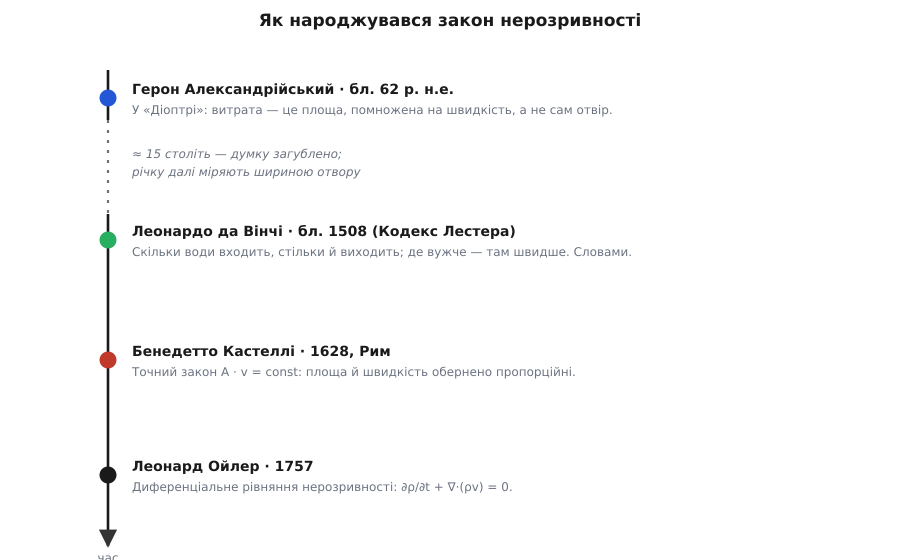

# 📜 Як навчилися лічити воду, що біжить

Постав джерелу найпростіше запитання: скільки води воно дає? Не «широке чи вузьке», а скільки насправді — відер за годину, кубометрів за добу. Здається, досить глянути на струмінь і зміряти його завтовшки. Саме так людство міряло воду майже всю свою історію — і саме так помилялося. Бо струмінь тієї самої товщини несе втричі більше води, коли біжить утричі швидше. Отвір мовчить про швидкість, а вся вода — у швидкості теж. Історія закону нерозривності — це історія того, як довго й уперто люди не бачили в цьому добутку множник «швидкість»: знаходили його, губили й знаходили знову, і між першим здогадом та готовим рівнянням лягло сімнадцять століть.


*Одну й ту саму істину відкривали, губили й відкривали знову. Найдовший відтинок цієї осі — не праця, а забуття.*

## Герон і струмінь, що дурить око

Уперше множник «швидкість» помітили навдивовижу рано. Герон Александрійський (гр. Ἥρων ὁ Ἀλεξανδρεύς), інженер і механік, що жив в Александрії в I столітті, у трактаті «Діоптра» (гр. dióptra — візирний прилад, «те, крізь що дивляться») розібрав саме нашу задачу: як зміряти видобуток джерела. І застеріг проти звичної помилки. Мало обвести переріз струмка, каже він; треба ще знайти, як швидко вода біжить, — «бо чим прудкіша течія, тим більше води дає джерело». Двома реченнями Герон схопив те, на чому тримається вся гідравліка: витрата — це переріз, помножений на швидкість, а не сам лише переріз.

Він і спосіб дав чесний, обхідний: перепиняєш увесь потік, відводиш його в яму певного об'єму й за сонячним годинником дивишся, скільки натекло за відміряний час. Це вже пряме вимірювання об'єму за секунду — те, що ми звемо об'ємною витратою; воно не потребує знати швидкість, бо ловить саму воду.

Коли жив Герон, ми знаємо не з його життєпису, а з неба: в іншому місці «Діоптри» він описує місячне затемнення, і Отто Нойгебауер (Otto Neugebauer) 1938 року показав, що з усіх можливих підходить лише затемнення 13 березня 62 року. Тому «близько 62-го» — не легенда, а вивід із астрономії; щоправда, частина новіших фахівців підозрює, що те затемнення Герон навів як умовний приклад до обчислень, а не як побачене на власні очі, — і тоді дата знову розпливається. Так чи так, статус її — обґрунтована оцінка, а не запис у документі.

Гіркота в тому, що здогад Герона не прижився. Наскільки чіпко трималася звичка міряти воду отвором, видно з найдоскональнішої водної служби давнього світу — римської. Через покоління по Героні, коли Секст Юлій Фронтін (Sextus Iulius Frontinus) став наглядачем римських водогонів (97 рік), він обліковував усю воду столиці в одиницях quinaria (лат., від quinque — п'ять) — за діаметром свинцевої труби, тобто за самою площею отвору. Фронтін навіть завважив, що стрімка вода з широкої ріки додає у видатку «самою своєю швидкістю», — та зміряти ту швидкість не мав чим: римляни не вміли міряти прудкість потоку. Тож наглядач найбільшої водопровідної мережі планети однаково лічив воду отвором — і справжнього видатку Рима так і не знав. Правильна думка вже була записана, лежала в рукописі — і не діяла.

## Леонардо дивиться, як звужується річка

Наступний, хто виразно це побачив, з'явився аж через півтори тисячі років. Леонардо да Вінчі (Leonardo da Vinci) у записнику, знаному тепер як Кодекс Лестера (лат. codex — стос списаних аркушів), десь між 1504 і 1510 роками, серед сотень нотаток про воду вивів ту саму нерозривність — і вивів її з правильної причини. Він міркував про збереження речовини: воді нема куди подітися й нема звідки взятися, тож крізь кожен переріз русла за той самий час мусить проходити однакова її кількість. На аркуші 6v він записує це майже як закон: у річці будь-якого розміру й глибини в кожній точці її шляху за однаковий час проходить та сама вода. А звідси — головне: де русло вужче, там вода біжить швидше.

Це вже серцевина закону, узята з правильного кореня — з балансу маси, а не з випадкової прикмети. Але Леонардо спинився на словах. Він не записав ані A·v = const, ані будь-якої іншої рівності; він точно сказав, що вужче означає швидше, проте не сказав — у скільки саме разів. До того ж його дзеркальні нотатки лишалися нерозшифрованими й неопублікованими ще століття по його смерті. Тож і цей здогад, як Геронів, не влився у велику науку свого часу: правильний, глибокий — і німий.

## Закон, що народився зі суперечки про болото

Точну рівність дав аж XVII вік — і, що прикметно, не з тихого споглядання, а з дуже земної суперечки за воду. У 1620-х роках папський престол загруз у застарілій біді: рівнини довкола Болоньї та Феррари підтоплювало, води По й Рено не мали куди стікати, ширилися болота. За цим стояла не тільки інженерія, а й політика — інтереси Папської держави, Венеційської республіки, Мантуї та Феррари стикалися лоба в лоб. Папа Урбан VIII послав розібратися свого математика — бенедиктинця Бенедетто Кастеллі (Benedetto Castelli, у миру Антоніо; 1578, Брешія — 1643, Рим), учня Ґалілея. Разом із монсеньйором Оттавіо Корсіні (Ottavio Corsini) Кастеллі оглянув край і запропонував відвести Рено в По каналом.

Щоб такі поради не були навмання, потрібна була теорія — і Кастеллі її дав. Того ж 1628 року в Римі вийшла його книжка «Della misura dell'acque correnti» («Про вимірювання текучих вод»). У ній уперше чітко, як математичну рівність, сформульовано закон нерозривності: переріз потоку, помножений на швидкість, — величина стала, тож площа й швидкість обернено пропорційні. Вужче русло — рівно у стільки ж разів прудкіша вода. Те, що Герон висловив як пересторогу, а Леонардо — як спостереження, Кастеллі поставив як закон і показав, чому інакше бути не може.

За це його й звуть батьком сучасної гідравліки — засновником науки про воду текучу, як Архімед був засновником науки про воду нерухому. Варто помітити тонкість, на якій тримається вся його рівність. A·v = const справджується лише тому, що вода не стискається: скільки її об'єму ввійшло, стільки й вийшло. Кастеллі це розумів і обстоював окремо — «acqua premuta», стиснута вода, не піддається стисканню. Саме ця мовчазна умова — незмінна густина — і робить закон таким простим; забери її, і рівність доведеться переписувати. Тут уже прозирає межа, за яку теорія Кастеллі переступити не могла.

Не все в нього було правильне: швидкість він хибно пов'язував із висотою напору навпрямець, а справжню залежність — швидкість росте як корінь із висоти — вивів невдовзі його ж учень Евангеліста Торрічеллі (Evangelista Torricelli). Школа Кастеллі (серед його учнів були ще Бонавентура Кавальєрі й Джованні Альфонсо Борреллі) підхопила й доробила почате — нагадування, що закон рідко буває справою однієї голови.

## Ойлер стягує закон у точку

Лишалося зробити останній крок — від правила про два перерізи труби до закону, чинного в кожній окремій точці простору, та ще й тоді, коли густина таки міняється. Це зробив Леонард Ойлер (Leonhard Euler; 1707, Базель — 1783, Санкт-Петербург), швейцарець із Базеля. У праці «Principes généraux du mouvement des fluides» («Загальні начала руху рідин»), яку він подав Берлінській академії 1752 року, а надрукував 1757-го (у томі «Мемуарів» за 1755 рік — звідси й таку дату часом наводять), він записав рух рідини мовою диференціальних рівнянь. Серед них — рівняння нерозривності в тій самій формі, яку пишуть і досі:

```
∂ρ/∂t + ∇·(ρv) = 0
```

Тепер густині ρ дозволено мінятися і в часі, і від точки до точки, тож закон охопив і стисливий газ, а не лише нестисливу воду Кастеллі. Простий добуток «площа на швидкість» виявився окремим, найлегшим випадком цієї загальної рівності — тим, що лишається, коли ρ стала.

Честь і тут не одноосібна. Незалежно й майже водночас до споріднених рівнянь руху рідини дійшов Жан Лерон д'Аламбер (Jean le Rond d'Alembert), а чимало ґрунту наготувала ціла родина Бернуллі. Але саме Ойлерів запис став тим канонічним рівнянням, від якого відштовхується вся пізніша гідродинаміка.

## Що показує ця дорога

Одна проста рівність долала сімнадцять століть — і не тому, що була заважка для розуму. Герон схопив її суть іще в I столітті; вона просто не мала кому передатися й раз у раз гасла в рукописах, поки практики міряли воду отвором. Дорога від здогаду до рівняння — це не сходинки одного відкривача, а нашарування: Герон дав інтуїцію (важить швидкість, не сам отвір), Леонардо — правильну причину (баланс маси), Кастеллі — точний закон і доказ, Ойлер — форму, чинну в кожній точці й для газу теж. Кожен додавав шар, якого бракувало попередньому.

І ще одне, варте згадки саме тут. За цим законом не тягнеться суперечки про те, хто чий здобуток привласнив: александрієць, тосканець, ломбардець, базелець — чотири постаті з чотирьох різних кутків світу, і внесок кожного окреслено ясно й без спору. Історія тут рідкісно чиста; статус усього ланцюга — усталений факт. А наскрізна її наука проста до незручності: щоб полічити те, що тече, мало зміряти, крізь який отвір воно тече, — треба ще спитати, як швидко. На те, щоб закарбувати це в законі, людству знадобилося сімнадцять сторіч.
