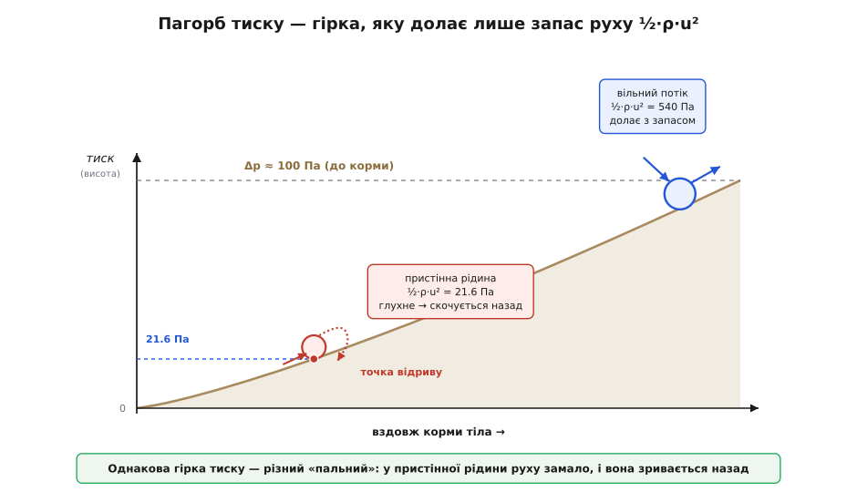
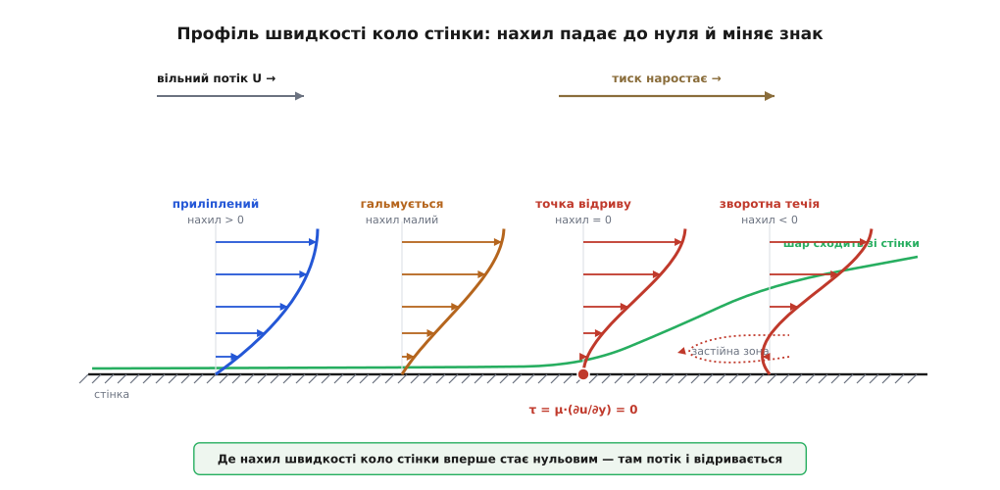
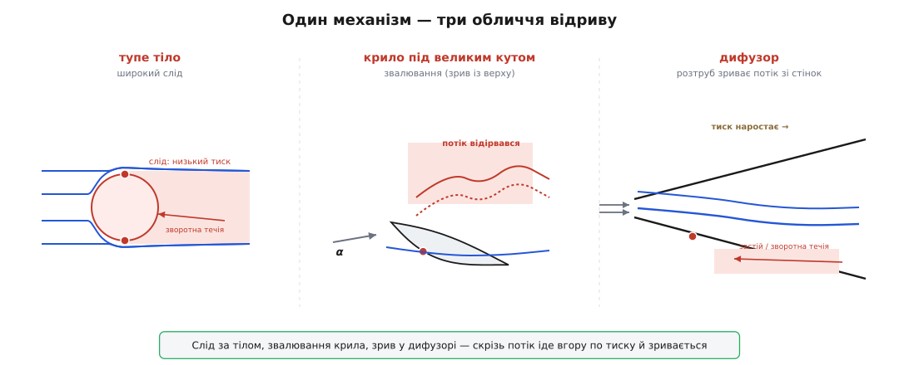

# Відрив потоку

<preknowlist>
- [Примежовий шар](topic:physics/boundary-layer) — тонка пристінна плівка, де в'язкість гальмує рідину від швидкості вільного потоку до нуля на самій стінці (умова прилипання).
- [В'язкість](topic:physics/viscosity) — внутрішнє тертя рідини; саме воно обкрадає пристінні шари, лишаючи їх майже без руху.
- [Динамічний тиск і число Бернуллі](topic:physics/dynamic-pressure) — де потік гальмується, тиск наростає; запас руху рідини міряють динамічним тиском ½·ρ·u².
</preknowlist>

Пусти воду вздовж плавно вигнутої стінки — вона тектиме, приліпившись до неї, слухняно повторюючи кожен вигин. Але хай стінка занадто круто відвернеться від потоку — і рідина раптом **відривається**: замість гладко обгинати поверхню, вона зривається з неї, а між нею й стінкою розкривається пляма застійної, закрученої назад рідини. Ця мить, коли потік «відпускає» поверхню, вирішує на диво багато: чому за кулею тягнеться широкий турбулентний слід, чому літак на завеликому куті атаки провалюється, чому надто розтрубнена труба гасить напір гірше за плавну. Усе це — один і той самий злам. Питання лише — чому рідина взагалі відривається і що вирішує, у якій саме точці це станеться.

## Найслабша ланка — пристінна рідина

Тектиме рідина вздовж стінки чи зірветься — вирішується у [примежовому шарі](topic:physics/boundary-layer), тонкій плівці коло поверхні, де в'язкість гальмує рідину від швидкості вільного потоку до нуля на самій стінці. Саме ця пристінна рідина — найслабша ланка потоку: вона вже майже зупинена тертям, руху в ній обмаль. Доки її ніщо не жене назустріч, вона поволі повзе вперед разом з рештою потоку, і все гаразд. Уся біда починається тоді, коли попереду виростає перешкода — **пагорб тиску**.

Звідки той пагорб? Обтікаючи опукле тіло, потік спершу розганяється — від носа до найширшого місця, — і там, де він найшвидший, тиск найнижчий (це прямий [зв'язок швидкості й тиску за Бернуллі](topic:physics/dynamic-pressure)). А далі, за «плечем» тіла, потік мусить знову сповільнитися й зімкнутися позаду. Сповільнення означає, що тиск уздовж течії **наростає**: рідина йде наче вгору — з долини низького тиску на пагорб високого. Такий напрямок, коли тиск попереду більший, ніж позаду, і штовхає рідину проти її руху, називають **несприятливим градієнтом тиску** (від лат. *gradior* — крокую; градієнт — це темп зміни величини вздовж шляху).

> 🔧 **Навіщо це.** Той самий пагорб тиску виникає не лише зовні тіл. Усередині будь-якого каналу, що **розширюється**, — дифузора — потік теж гальмується, і тиск наростає точно так само. Тому надто крутий розтруб не «збирає» напір плавно, а зриває потік зі стінок і збурює його. Інженер, що проєктує впуск компресора, вихлопний конус чи вентиляційний перехід, воює з тим самим відривом, що й аеродинамік — з крилом.

## Хто здолає пагорб, а хто скотиться назад

І ось вирішальне зіставлення. Щоб піднятися на пагорб тиску, рідині потрібен запас руху — та сама енергія, яку й міряють **динамічним тиском** ½·ρ·u². Зовнішній потік мчить на повній швидкості, запасу в нього вдосталь: він вибирається на пагорб і майже не помічає його. А пристінна рідина, обібрана тертям майже до нуля, підходить до підніжжя вже без сил. Порахуймо на пальцях.

**Хто вибереться на пагорб тиску.** Повітря (ρ = 1.2 кг/м³) обтікає тіло; вільний потік іде на 30 м/с, а рідину в нижній частині примежового шару тертя загальмувало, скажімо, до 6 м/с. За плечем тіла тиск наростає, і до корми встигає підскочити на Δp ≈ 100 Па. Кому вистачить розгону?

```
запас руху = динамічний тиск ½·ρ·u²

вільний потік:     ½·1.2·30² = 540 Па
пристінна рідина:  ½·1.2·6²  =  21.6 Па
пагорб тиску до корми:  Δp ≈ 100 Па

540 Па  > 100 Па  →  зовнішній потік вибирається нагору, ще й із запасом
21.6 Па < 100 Па  →  пристінній рідині сили бракує вже на п'ятій частині підйому
```

Пристінна рідина встигає піднятися лише на 21.6 Па «заввишки», а тоді розгін вичерпано. Далі той самий градієнт тиску, що її гальмував, починає штовхати її **назад**. Коло стінки народжується зворотна течія — і потік відривається.


*Пагорб тиску працює як гірка потенціальної енергії. Зовнішній потік має доволі динамічного тиску ½·ρ·u², щоб її подолати; пристінна рідина, обібрана тертям, глухне на півдорозі й скочується назад — це й є точка відриву.*

## Точний злам: коли нахил коло стінки падає до нуля

Що ж діється зі швидкістю впритул до стінки? Поки потік іде вперед, коло стінки він розганяється від нуля вгору — профіль швидкості має біля поверхні додатний нахил. Коли пристінну рідину загальмовано вщент, цей нахил спадає до нуля. А там, де вже народилася зворотна течія, нахил стає від'ємним: рідина коло стінки повзе назад. Точка, де нахил швидкості коло стінки вперше **дорівнює нулю**, і є **точкою відриву**:

```
на стінці:   τ = μ·(∂u/∂y) = 0        ← умова відриву
```

Тут дотичне напруження на стінці зникає: рідина більше не тягне поверхню вперед, бо коло неї вже нема руху вперед. За цією точкою примежовий шар сходить зі стінки в глиб потоку, а під ним оселяється зона зворотної, застійної рідини. Чому саме несприятливий градієнт неминуче викривляє профіль так, щоб з'явився цей нульовий нахил, випливає з рівняння руху коло стінки: [математика відриву](topic:physics/flow-separation/math-adverse-gradient.md) показує, що знак градієнта тиску прямо задає викривлення профілю біля поверхні, а отже, і саму можливість зриву.


*Уздовж несприятливого градієнта профіль швидкості коло стінки поступово випрямляється: нахил біля поверхні спадає, у точці відриву стає нульовим (τ = 0), а далі — від'ємним. Коло стінки зароджується зворотна течія, і шар сходить із поверхні, лишаючи під собою застійну зону.*

## Що вирішує, де саме зірветься

Відрив — це завжди двобій: несприятливий градієнт тиску проти запасу руху в пристінному шарі. Звідси й два способи його відсунути. Перший — не давати градієнту рости круто: витягнути тіло в плавну обтічну краплю з довгим хвостом, щоб тиск відновлювався так полого, аж навіть кволій пристінній рідині вистачить сил дотягти до самої корми. Другий — підсипати шару руху: **турбулентний** примежовий шар безнастанно перемішує швидку зовнішню рідину вниз, до стінки, тож пристінного запасу в нього більше, і відрив він тримає довше за ламінарний. На цьому й стоїть, [приміром, хитрість із ямками на м'ячі для гольфу](topic:physics/boundary-layer): вони навмисне збурюють шар у турбулентний, і той зривається пізніше, звужуючи слід.

А саму точку відриву можна порахувати наперед — маршируючи рівняння примежового шару вздовж поверхні із заданим розподілом тиску, доки напруження на стінці не впаде до нуля. [Компактний метод](topic:physics/flow-separation/proj-thwaites-separation.md) робить саме це: з кривої тиску на тілі знаходить, де зірветься потік.

## Ціна відриву — опір і звалювання

Розплата за відрив велика. Поки потік тримається, він змикається позаду тіла й тисне на корму майже так само, як напирав на ніс, — сили тиску спереду й ззаду майже врівноважуються. Але щойно потік відірвався, за тілом лишається широкий слід низького тиску: спереду повний напір, а ззаду підпори вже нема. Ця різниця й штовхає тіло назад — так народжується **опір тиску** (його ж звуть опором форми), найбільша частка [аеродинамічного опору](topic:physics/aerodynamic-drag) тупих тіл. Та сама подія в найгострішій формі — це **звалювання** [крила](topic:physics/fixed-wing-lift): задери його на завеликий кут атаки, градієнт тиску на верхній поверхні стане надто крутим, потік відірветься майже від передньої кромки — і підйомна сила, що трималася на плавному обтіканні верху, разом обвалюється.


*Одна причина, три обличчя: широкий слід за тупим тілом, зрив потоку з верху крила під великим кутом (звалювання) і відрив у надто крутому дифузорі. Скрізь рідина мусить іти вгору по тиску — і знеможений тертям пристінний шар цього підйому не витримує.*

Тож відрив — не примха окремої форми, а спільний корінь дуже різних на вигляд бід: широкого сліду за кулею, зваленого крила, захлинутого дифузора. Скрізь, де рідині випадає сповільнюватися вздовж стінки — іти вгору по тиску, — знеможена тертям пристінна плівка може не втримати підйому й зірватися. Хто вловив цей єдиний механізм, той бачить нараз, чому обтічні форми такі плавні, чому крило має свою межу і чому крихітна в'язкість, орудуючи в тонкій пристінній плівці, кінець кінцем править усім потоком навколо тіла.
