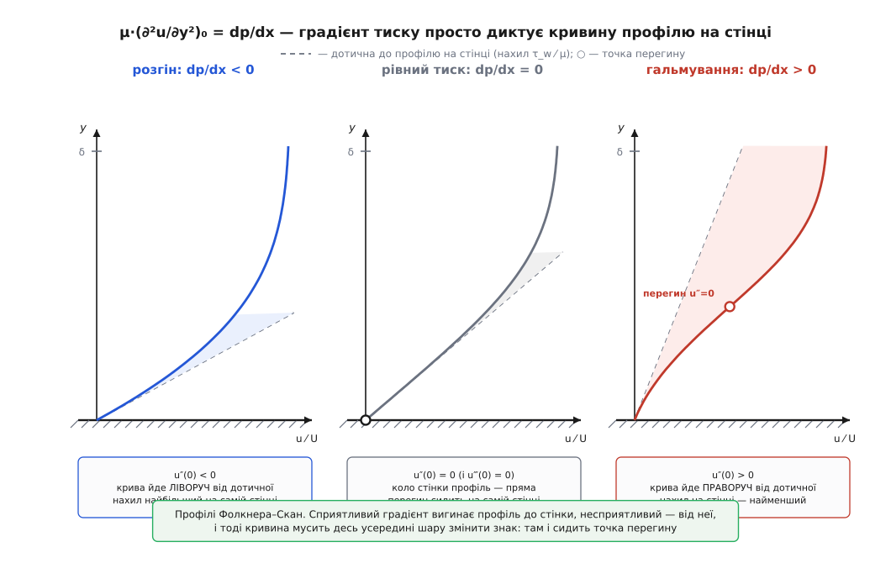
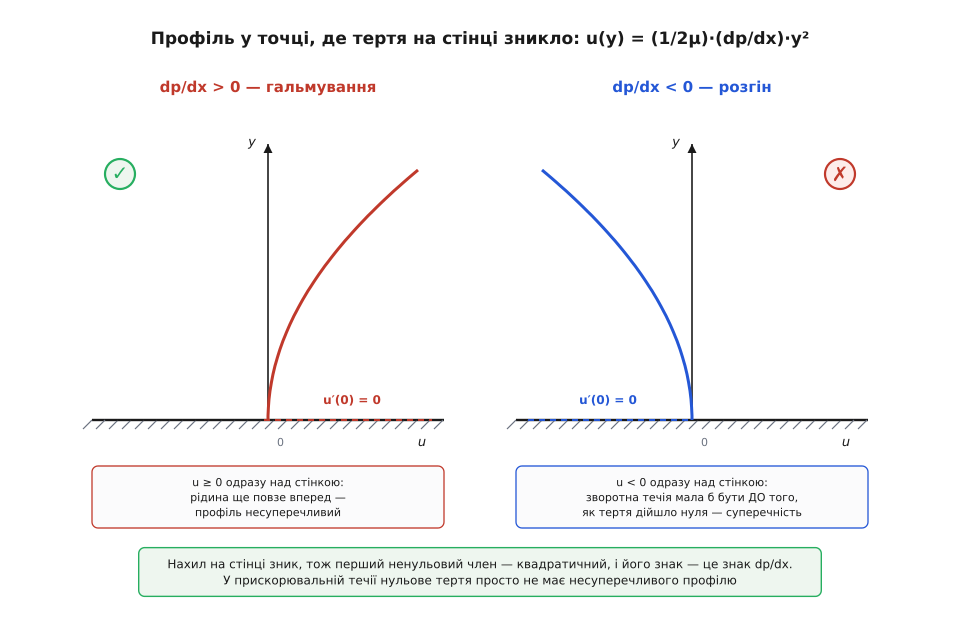
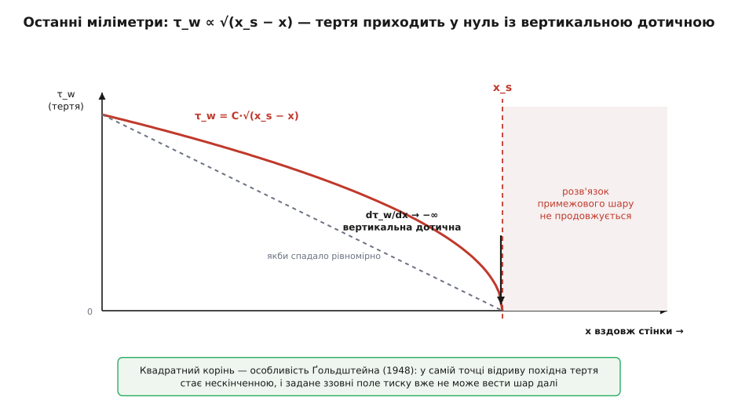

# 🧮 Математика відриву: знак ∂p/∂x і кривина профілю коло стінки

Підставте в рівняння руху в'язкої рідини саму стінку — і від нього лишиться одна коротка рівність: кривина профілю швидкості коло поверхні дорівнює градієнту тиску, поділеному на в'язкість. З неї випливає все інше — і те, що в прискорювальній течії нульове тертя на стінці **математично неможливе**, і те, що в гальмівній воно неминуче готується, і навіть те, скільки треба відсмоктати рідини крізь обшивку, щоб скасувати вигин.

## Стінка — єдине місце, де рівняння руху стає тривіальним

Усталений плаский рух в'язкої нестисливої рідини описують [рівняння Нав'є–Стокса](topic:physics/navier-stokes). У тонкому [примежовому шарі](topic:physics/boundary-layer) їх стискає проста оцінка порядків величин: упоперек шару все міняється незрівнянно швидше, ніж уздовж, тож поздовжня дифузія випадає — і [лишається пара рівнянь](topic:physics/boundary-layer/math-blasius.md), з якої починають будь-який розрахунок:

```
рух уздовж стінки:  ρ·(u·∂u/∂x + v·∂u/∂y) = −dp/dx + μ·∂²u/∂y²
нерозривність:      ∂u/∂x + ∂v/∂y = 0
```

Тут x — уздовж поверхні, y — по нормалі до неї, u і v — відповідні складові швидкості, μ — [динамічна в'язкість](topic:physics/viscosity). Зліва стоїть інерція рідини, справа — сила тиску й в'язке тертя. Розв'язати це в загальному вигляді не вміє ніхто: інерційні доданки нелінійні, і саме вони роблять задачу непідйомною.

Але є одне місце, де вся ця споруда завалюється в тривіальність, — сама поверхня. На стінці рідина прилипає, отже u = 0. Крізь стінку вона не тече, отже v = 0. А обидва інерційні доданки мають множником або u, або v — тож при y = 0 обидва зникають дочиста. Лишається

```
μ·(∂²u/∂y²)|₀ = dp/dx          ← пристінна рівність
```

Це не наближення й не оцінка порядків: це тотожність. Ба більше, вона не потребує навіть переходу до рівнянь примежового шару. У повних рівняннях Нав'є–Стокса є ще поздовжній в'язкий доданок μ·∂²u/∂x², але вздовж усієї нерухомої непроникної стінки u тотожно дорівнює нулю, тому й похідні цього нуля вздовж стінки — нулі: ∂u/∂x = 0 і ∂²u/∂x² = 0 у кожній її точці. З тієї самої причини на стінці ∂u/∂t = 0, тож рівність переживає і неусталеність.

Наближення тонкого шару потрібне для іншого — щоб знати, **чий** це градієнт. Упоперек тонкого шару тиск майже не міняється (∂p/∂y ≈ 0, з малою відцентровою поправкою ρ·u²/R на стінці з радіусом кривини R), тож dp/dx коло стінки — це той самий градієнт, який нав'язує зовнішня течія своїм розгоном і гальмуванням.

> 🔧 **Навіщо це.** Форма тіла керує тільки зовнішнім потоком: вона вирішує, де той розганяється, а де сповільнюється, — тобто вирішує dp/dx. Пристінна рівність каже, що ця величина доходить до найглибшої, найповільнішої рідини **нерозведеною**: не «якось впливає», а точно дорівнює кривині профілю, помноженій на в'язкість. Між олівцем конструктора й останнім мікроном рідини на обшивці нема жодної пом'якшувальної ланки.

Продиференціюймо рівняння руху по y ще раз. Градієнт тиску впоперек шару сталий, тож справа лишається сама третя похідна:

```
ρ·[ (∂u/∂y)·(∂u/∂x) + u·∂²u/∂x∂y + (∂v/∂y)·(∂u/∂y) + v·∂²u/∂y² ] = μ·∂³u/∂y³
```

На стінці другий і четвертий доданки гинуть від множників u = 0 і v = 0. Перший гине від ∂u/∂x = 0. Третій — теж, бо [нерозривність](topic:physics/flow-continuity) дає ∂v/∂y = −∂u/∂x = 0. Уся ліва частина порожня:

```
(∂³u/∂y³)|₀ = 0
```

Отже [ряд Тейлора](topic:math/taylor-series) профілю коло стінки має діру на місці куба:

```
u(y) = (τ_w/μ)·y  +  (1/(2μ))·(dp/dx)·y²  +  0·y³  +  (1/24)·(∂⁴u/∂y⁴)₀·y⁴  + …
```

Два числа правлять усією пристінною рідиною. Перше — дотичне напруження τ_w, якого наперед ніхто не знає (по суті, це і є шукана відповідь). Друге — градієнт тиску, який зовнішня течія віддає задарма. А що кубічного члена нема, ці два коефіцієнти тримають профіль помітно далі від поверхні, ніж можна було б чекати від двох перших членів розкладу.

## Знак градієнта — це знак кривини

Прочитаймо тепер пристінну рівність як твердження про геометрію. Кривина показує, куди крива відхиляється від своєї дотичної. Дотична до профілю на стінці має нахил τ_w/μ, а знак другої похідної каже, ліворуч чи праворуч від цієї дотичної піде сама крива. І цей знак у нас уже є — це знак dp/dx.

**Розгін, dp/dx < 0.** Кривина на стінці від'ємна: профіль одразу відхиляється **ліворуч** від дотичної, тобто нахил ∂u/∂y з висотою тільки спадає. Найбільший нахил — на самій поверхні, далі профіль лише вирівнюється до зовнішньої швидкості. Такий профіль звуть повним: рідина коло стінки має відносно багато руху.

**Рівний тиск, dp/dx = 0.** Кривина на стінці нульова — а з нею й третя похідна. Профіль стартує від стінки прямою лінією з точністю до четвертого порядку. Скільки це триває, легко порахувати: числове інтегрування рівняння Блазіуса дає, що профіль пласкої пластини відхиляється від своєї пристінної дотичної менш ніж на 1 % аж до y ≈ 0.23·δ, тобто майже до чверті товщини шару.

**Гальмування, dp/dx > 0.** Кривина на стінці додатна: крива йде **праворуч** від дотичної, нахил ∂u/∂y з висотою наростає. Найменший нахил тепер — на самій поверхні. Профіль виходить вигнутий літерою S: спершу мляво повзе вгору, потім різко доганяє зовнішній потік. Це і є та «підмита» пристінна рідина, з якої починається відрив.


*Точні автомодельні профілі для трьох знаків градієнта: розгін, рівний тиск, гальмування. Знак кривини на стінці збігається зі знаком dp/dx, тож у гальмівній течії профіль відхиляється від своєї пристінної дотичної в інший бік, ніж у розгінній, — і мусить десь усередині шару змінити кривину на протилежну.*

## Гальмування мусить породити точку перегину

У несприятливому градієнті кривина мусить десь усередині шару змінити знак — не «зазвичай міняє», а саме **мусить**.

На стінці кривина додатна: (∂²u/∂y²)|₀ = (1/μ)·(dp/dx) > 0. На верхньому краї шару швидкість підходить до зовнішньої знизу й плавно, тож нахил ∂u/∂y там додатний і згасає до нуля. Але спадання додатної величини до нуля означає від'ємну другу похідну. Отже ∂²u/∂y² додатна коло стінки й від'ємна коло краю шару — а неперервна функція, що змінює знак, десь між ними проходить через нуль. Ця висота y_i і є **точкою перегину** профілю.

У сприятливому градієнті такого примусу нема: кривина від'ємна і коло стінки, і коло краю, і в точних розв'язках вона від'ємна скрізь між ними. Тож перегин усередині шару — не прикраса, а підпис несприятливого градієнта: побачили S-подібний профіль — знайте, що рідину в цьому місці гальмують.

У цього підпису є другий, зовсім інший наслідок. Джон Вільям Стретт, лорд Релей (John William Strutt, Lord Rayleigh), 1880 року довів, що точка перегину в профілі швидкості — **необхідна** умова нев'язкої нестійкості плоскопаралельної течії; 1950 року Раґнар Фьортофт (Ragnar Fjørtoft) звузив умову ще дужче, вимагаючи, щоб добуток u″·(u − u(y_i)) був десь у потоці від'ємний. Обидва результати — усталена класика теорії стійкості. Виходить, той самий несприятливий градієнт, що готує відрив, водночас надає профілю саме тієї форми, без якої [зсувна нестійкість](topic:physics/hydrodynamic-instability) не вмикається. Гальмівна ділянка тіла — це заразом і місце, де шар найохочіше перетворюється на турбулентний.

## Чому в розгінній течії відрив неможливий

Відрив означає, що дотичне напруження на стінці дійшло нуля: τ_w = μ·(∂u/∂y)|₀ = 0. За яких же градієнтів тиску такий профіль узагалі може існувати?

Візьмімо **першу** станцію вздовж стінки, де τ_w падає до нуля. Слово «перша» тут робить усю роботу: вище за течією шар був причеплений, рідина коло стінки йшла вперед, тож там u > 0 усюди над поверхнею. За неперервністю в цій точці профіль ще невід'ємний: u(y) ≥ 0 для малих y. Підставмо в наш ряд Тейлора τ_w = 0 — і лінійний член зникне:

```
u(y) = (1/(2μ))·(dp/dx)·y²  +  O(y⁴)
```

Перший ненульовий член — квадратичний, і його знак — це знак dp/dx. Якби градієнт був сприятливий (dp/dx < 0), то одразу над стінкою вийшло б u(y) < 0: зворотна течія мала б уже існувати — але ж ми взяли **першу** точку нульового тертя, до якої її ще не було. Суперечність. Значить, у точці, де тертя вперше зникає,

```
dp/dx ≥ 0
```

Отже несприятливий градієнт — **необхідна** умова відриву. Хоч як вигинай стінку, доки потік уздовж неї розганяється, нульового дотичного напруження на ній просто не існує: розгінна течія не має несуперечливого профілю з нульовим нахилом на стінці. Проміжний випадок dp/dx = 0 теж відпадає в звичайних умовах: тоді нулю дорівнюють і другий, і третій коефіцієнти ряду, і профіль мусив би починатися одразу з y⁴ — виродження, яке в реальній течії не трапляється. Справжня точка відриву сидить там, де dp/dx > 0 строго.


*Коли нахил на стінці зник, перший ненульовий член розкладу — квадратичний, а його знак задає dp/dx. За гальмування парабола відкривається в бік додатних u — рідина ще повзе вперед, профіль несуперечливий. За розгону вона пірнала б у від'ємні u просто над поверхнею, а це вимагало б зворотної течії ще до того, як тертя дійшло нуля.*

Заразом видно, який вигляд має профіль **у самій** точці відриву: чиста парабола від стінки, u ∝ y². Це той результат, який Сідні Ґольдштейн (Sydney Goldstein) поклав в основу свого аналізу 1948 року.

Необхідна умова — ще не достатня. Пристінна рівність каже, куди гне профіль, але нічого не каже про те, чи вистачить у градієнта відстані й сили, щоб доїсти τ_w до нуля: це вже питання накопиченої історії гальмування вздовж поверхні, яку рахують [маршем рівнянь шару](topic:physics/flow-separation/proj-thwaites-separation.md).

## Скільки це в числах

**Наскільки сильно реальне гальмування гне профіль.** Повітря (ρ = 1.2 кг/м³, μ = 1.8·10⁻⁵ Па·с) обтікає корму тіла: зовнішня швидкість спадає з 30 до 24 м/с на ділянці завдовжки 0.15 м. На станції посеред цієї ділянки тертя на стінці вже сильно з'їдене й дорівнює τ_w = 0.20 Па. Градієнт тиску дістаємо зі [зв'язку швидкості й тиску в зовнішній течії](topic:physics/dynamic-pressure): де швидкість спадає, там тиск наростає.

```
градієнт тиску:
dp/dx = −ρ·U·dU/dx = −1.2 · 27 · (−40) = +1296 Па/м

перевірка через різницю напорів:
Δp = ½·1.2·(30² − 24²) = 194.4 Па  на 0.15 м  →  1296 Па/м  ✓

кривина профілю на стінці:
(∂²u/∂y²)₀ = (dp/dx)/μ = 1296 / 1.8·10⁻⁵ = 7.2·10⁷ (м·с)⁻¹

нахил профілю на стінці:
(∂u/∂y)₀ = τ_w/μ = 0.20 / 1.8·10⁻⁵ = 1.11·10⁴ с⁻¹

на якій висоті кривина подвоює нахил:
y = (∂u/∂y)₀ / (∂²u/∂y²)₀ = 1.11·10⁴ / 7.2·10⁷ = 1.5·10⁻⁴ м = 0.15 мм
```

Сто п'ятдесят мікрометрів — і нахил удвічі крутіший, ніж на самій поверхні. Вигин, який дає градієнт, — не якась поправка до профілю: на цій станції він переважує все інше вже в найтоншій пристінній плівці. Поверніть знак градієнта — і та сама за величиною кривина не підмиватиме профіль, а вирівнюватиме його: нахил спадатиме з висотою, і найбільший лишиться на самій стінці.

**Яка завтовшки зворотна плівка одразу за відривом.** Трохи нижче за течією тертя вже змінило знак: скажімо, τ_w = −0.05 Па за того самого dp/dx = 1296 Па/м. Обидва члени розкладу тепер воюють між собою, і висота, де вони гасять одне одного, — це верхня межа зворотної течії:

```
u(y) = (τ_w/μ)·y + (1/(2μ))·(dp/dx)·y² = 0
y_r = −2·τ_w/(dp/dx) = 2·0.05 / 1296 = 7.7·10⁻⁵ м = 0.077 мм
```

Зворотна течія починається не як велика вихрова пляма, а як плівка завтовшки заледве сімдесят сім мікрометрів. Розкручує її до видимої зони той самий квадратичний член, що її й обмежує зверху.

**Скільки треба відсмоктування, щоб вигин скасувати.** Хай стінка не суцільна, а пориста, і крізь неї рідину повільно втягують усередину зі швидкістю v_w < 0. Тоді v на стінці вже не нуль, і в інерційній частині виживає один доданок, ρ·v_w·(∂u/∂y)₀. Пристінна рівність дістає другий член:

```
μ·(∂²u/∂y²)₀ = dp/dx + ρ·v_w·(∂u/∂y)₀
```

Відсмоктування (v_w < 0) віднімає від градієнта тиску — тобто прямо змагається з ним за кривину. Скільки його треба, щоб для наших чисел звести кривину на стінці до нуля?

```
v_w = −(dp/dx) / (ρ·(∂u/∂y)₀) = −1296 / (1.2 · 1.11·10⁴) = −0.097 м/с

у частках зовнішньої швидкості:  0.097 / 27 = 0.0036  →  0.36 %
```

Менш ніж чотири тисячні від швидкості набігання — і несприятливий градієнт більше не вигинає профіль. Тому відсмоктування крізь обшивку так дешево відсуває відрив: воно б'є рівно в той доданок, що весь відрив і породжує. Людвіг Прандтль (Ludwig Prandtl) показав це ще у своїй восьмисторінковій доповіді 12 серпня 1904 року на математичному конгресі в Гайдельберзі — у тій самій, де вперше з'явилося поняття примежового шару. Керування відривом народилося одночасно з теорією відриву.

## Наскільки кволого гальмування вже досить

Пристінна рівність дає знак; величину, за якої шар таки здається, дає єдина сім'я задач, розв'язана точно. Якщо зовнішня швидкість спадає степенево, U_e ∝ x^m, задача стає автомодельною і зводиться до одного звичайного рівняння — його 1931 року дістали Віктор Фолкнер (Victor Montague Falkner) і Сильвія Скан (Sylvia W. Skan):

```
f‴ + f·f″ + β·(1 − f′²) = 0,     β = 2m/(m+1),     u/U_e = f′(η)
```

Знак β повторює знак m: розгін дає β > 0, гальмування — β < 0. Пристінна рівність тут прочитується просто як f‴(0) = −β. Числове інтегрування показує, що f″(0) — а отже й тертя на стінці — падає до нуля при

```
β = −0.1988   →   m = β/(2 − β) = −0.0904
```

Тепер прочитаймо цей показник як інженер. U_e ∝ x^(−0.0904) означає, що на подвоєнні пройденої відстані зовнішня швидкість множиться на 2^(−0.0904) = 0.939, тобто спадає **на 6 %**:

```
шлях  x → 2x   при найкволішому гальмуванні, що ще доводить до відриву:
U_e падає лише на 6.1 %
```

Шість відсотків за подвоєння шляху — це майже непомітне сповільнення. Саме тому ламінарний шар такий крихкий: щоб його зірвати, зовсім не треба різкого розтруба чи крутого злому обводу, досить ледь помітного, зате тривалого гальмування. (Автомодельність тут — ідеалізація: у справжнього тіла m міняється вздовж поверхні, і остаточну відповідь дає лише марш уздовж кривої тиску. Але порядок кволості, якої вже досить, вона показує чесно.)

## Як тертя доходить до нуля

Лишилося питання, на яке пристінна рівність сама не відповідає: як саме τ_w підходить до свого нуля? Наївно чекати, що воно спадає рівномірно й перетинає вісь під якимось кутом. Насправді ні. Ґольдштейн 1948 року показав, що коли вести рівняння примежового шару вздовж стінки із **заданим ззовні** тиском, то поблизу точки відриву x_s розв'язок має алгебраїчну особливість, і напруження підходить до нуля за коренем:

```
τ_w ∝ √(x_s − x)     →     dτ_w/dx → −∞  при  x → x_s
```

Дотична до кривої тертя в точці відриву — вертикальна. Це вже не фізична, а математична катастрофа: далі за x_s розв'язок просто не продовжується, а поперечна швидкість і товщина витіснення розбігаються.


*Особливість Ґольдштейна: замість рівномірного спадання (сірий пунктир) напруження підходить до нуля як √(x_s − x). Похідна в точці відриву нескінченна, і задане ззовні поле тиску вже не може вести шар далі.*

Розбігається, звісно, не рідина, а припущення. Уся класична схема стоїть на тому, що шар пасивний: зовнішня течія диктує тиск, шар слухняно підлаштовується. Коло відриву це перестає бути правдою — потовщений шар сам відсуває зовнішні лінії струму й починає диктувати тиск у відповідь. Лікують це тим, що перестають задавати тиск наперед і шукають його разом із течією в шарі: так 1969–1970 років народилася схема потрійної палуби (Stewartson & Williams і Neiland, 1969; Messiter, 1970), у якій пристінна ділянка, основна частина шару й зовнішній потік розв'язуються взаємно.

## Що ця рівність каже — і чого не каже

Пристінна рівність напрочуд живуча. Вона переживає неусталеність: на стінці ∂u/∂t = 0, тож жоден новий доданок не з'являється. Вона переживає навіть турбулентність. В осереднених рівняннях справа додається похідна рейнольдсових напружень, але коло стінки пульсації згасають дуже швидко: поздовжня як u′ ~ y, поперечна як v′ ~ y², тож ⟨u′v′⟩ ~ y³ — і похідна цього добутку на самій стінці теж нульова. Для осередненого профілю турбулентного шару рівність μ·(∂²ū/∂y²)₀ = dp̄/dx чинна буквально. Тому несприятливий градієнт підмиває й турбулентний шар — просто в того куди більший запас пристінного руху, і виїдати його треба довше.

Чого рівність не каже — теж варто назвати чітко. По-перше, вона не каже, чи тертя **дійде** до нуля: вона дає лише знак вигину, а результат вирішує накопичена історія градієнта. По-друге, у неусталеній течії сама умова τ_w = 0 перестає бути ознакою відриву. Ніколас Ротт (Nicholas Rott, 1956), Вільям Сірс (William R. Sears, 1956) і Френклін Мур (Franklin K. Moore, 1958) незалежно показали, що там відрив треба шукати за іншою прикметою: зсув має зникати в точці **всередині** шару, і то в системі відліку, що рухається разом із самою точкою відриву. Нульове тертя на стінці й зворотна течія під шаром у неусталеному потоці цілком можуть жити без жодного відриву.

Але сам вигин лишається там, де був. Скільки б не ускладнювався опис, перший коефіцієнт, з якого починається кривина пристінного профілю, — це градієнт тиску, поділений на в'язкість. Уся інша математика відриву тільки з'ясовує, чи вистачить цьому вигинові часу й простору доробити справу до кінця.
