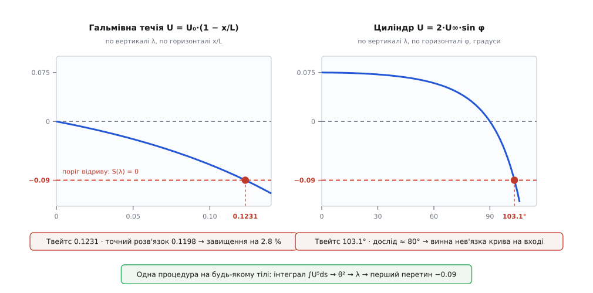

# ⚙️ Метод Твейтса: точка відриву прямо з кривої швидкості

<preknowlist>
- [Примежовий шар](topic:physics/boundary-layer) — тонка пристінна плівка, у якій швидкість спадає від зовнішньої до нуля на стінці; її запас руху міряють товщиною втрати імпульсу θ.
- [В'язкість](topic:physics/viscosity) — внутрішнє тертя рідини; кінематична в'язкість ν = μ/ρ входить сюди як єдина властивість середовища, більше нічого про рідину знати не треба.
- [Чисельне інтегрування](topic:math/numerical-integration) — трапеції й те, як росте їхня похибка: увесь метод тримається на одному накопичувальному інтегралі вздовж поверхні.
</preknowlist>

Форма тіла задає швидкість уздовж його поверхні — а з цієї єдиної кривої можна за один прохід дістати точку, де ламінарний шар зірветься зі стінки, не розв'язуючи жодного рівняння в частинних похідних. Саме це робить метод, який 1949 року опублікував англійський прикладний математик Брайан Твейтс, тоді співробітник кафедри аеронавтики Імперського коледжу (*Approximate calculation of the laminar boundary layer*, «The Aeronautical Quarterly», т. 1, с. 245–280). Він коштує кількох арифметичних дій на вузол сітки — і саме тому й досі сидить усередині швидких аеродинамічних розрахунків.

## Що на вході, що на виході

Вхід один: **розподіл швидкості на зовнішній межі шару** U(s), де s — довжина дуги вздовж обводу тіла від передньої точки. Звідки його беруть — байдуже методові: з нев'язкого (потенціального) розв'язку обтікання, з панельного методу, з великого CFD-розрахунку або просто з виміряного розподілу тиску, перерахованого [через Бернуллі](topic:physics/dynamic-pressure) як U = U∞·√(1 − C_p). Плюс кінематична в'язкість ν. Вихід теж один — координата s, де дотичне напруження на стінці падає до нуля.

Чому не піти навпростець? Бо «навпростець» означає розв'язувати рівняння примежового шару Прандтля — рівняння в частинних похідних, де на кожній позначці s треба нести цілий профіль швидкості поперек шару: сітка N×M, неявні кроки заради стійкості, окрема морока з початковим профілем. Один раз для одного тіла — прийнятно. Але той, хто перебирає сотню обводів крила на десятку кутів атаки, платить цю ціну сотні разів. Хочеться, щоб оцінка коштувала **один прохід по вузлах обводу**, і щоб її можна було ставити просто всередину циклу оптимізації.

## Стиснути весь шар в одне число

Ключ у тому, що нам не потрібен увесь профіль. Питання ставиться одне-єдине: чи впало вже тертя на стінці до нуля. Тож замість функції u(y) в кожній точці носитимемо одне число — **товщину втрати імпульсу** θ, тобто наскільки, у перерахунку на товщину, шар обкрадений на потоці імпульсу проти вільної течії.

Рівняння для θ виводиться точно, без жодних припущень: досить проінтегрувати рівняння руху поперек шару. Це [інтегральне рівняння імпульсу](topic:physics/momentum-integral), яке 1921 року вивів угорець Теодор фон Карман, тоді директор Аеродинамічного інституту в Аахені (ZAMM, т. 1, с. 233–252):

```
dθ/ds + (2 + H)·(θ/U)·dU/ds = τ_w/(ρ·U²)

θ   — товщина втрати імпульсу
H   = δ*/θ — повнота профілю (δ* — товщина витіснення)
τ_w — дотичне напруження на стінці
U(s)— швидкість на зовнішній межі шару
```

Рівняння одне — а невідомих у ньому три: θ, H і τ_w. Саме тут потрібна **гіпотеза замикання**, і вона в цьому методі напрочуд ощадна. Якщо шар прожив під місцевим градієнтом досить довго, він забуває свою історію, і форма профілю визначається місцевими умовами. З чого тоді скласти безрозмірну міру цих умов? Матеріалу мало: сама товщина θ, в'язкість ν і нахил зовнішньої швидкості dU/ds. Єдина безрозмірна комбінація з них — параметр Гольштайна — Болена (їхня праця про наближений розрахунок ламінарних шарів, «Lilienthal-Bericht» S. 10, 1940, с. 5–16):

```
λ = (θ²/ν)·dU/ds          [м²]/[м²/с]·[1/с] = 1  — справді безрозмірний
```

Знак λ — це знак градієнта тиску навиворіт: розгін (тиск спадає) дає λ > 0, гальмування (тиск наростає) — λ < 0. І тоді припущення читається просто: **обидві невідомі є функціями самого λ**:

```
S(λ) = τ_w·θ/(μ·U)     — безрозмірне тертя на стінці
H(λ) = δ*/θ            — повнота профілю
```

Ці дві функції ніхто не вгадував: їх зчитано з точних автомодельних розв'язків Фолкнера — Скен (сімейство течій U ∝ sᵐ, для яких профіль справді однаковий у кожному перерізі; порахували їх 1930 року англійці Віктор Фолкнер і Сільвія Скен в Аеродинамічному відділі Національної фізичної лабораторії) і доповнено дослідом. Дві опорні точки видно неозброєним оком: λ = 0 — це плоска пластина, розв'язок Блазіуса; а λ = −0.09 — це той профіль, у якого нахил коло стінки вже нульовий, тобто **сам відрив**.

## Трюк, від якого рівняння згортається в інтеграл

Тепер найцікавіше. Перепишімо рівняння Кармана не для θ, а для θ² — помножмо його на 2·U·θ/ν:

```
(U/ν)·d(θ²)/ds = 2·[ S(λ) − (2 + H(λ))·λ ]  ≡  F(λ)
```

Уся права частина злилася в одну функцію одного аргументу. І ось що побачив Твейтс, коли поставив на графік F(λ), пораховану з усіх відомих на той час точних розв'язків і дослідів: точки лягають майже на **пряму**, від сильного розгону аж до самого відриву:

```
F(λ) ≈ 0.45 − 6·λ
```

Число 6 у цій прямій — не просто нахил підгонки: саме воно робить можливим наступний фокус. Підставмо пряму назад, згадавши, що λ = (θ²/ν)·dU/ds:

```
(U/ν)·d(θ²)/ds = 0.45 − 6·(θ²/ν)·dU/ds        | помножимо все на ν

U·d(θ²)/ds + 6·θ²·dU/ds = 0.45·ν              | і ще на U⁵

U⁶·d(θ²)/ds + 6·U⁵·θ²·dU/ds = 0.45·ν·U⁵
            d(θ²·U⁶)/ds      = 0.45·ν·U⁵      ← ліва частина згорнулася в похідну добутку
```

Множник U⁵ спрацював як інтегрувальний саме тому, що коефіцієнт дорівнює шести: похідна добутку θ²·U⁶ дає рівно U⁶·(θ²)′ + 6U⁵θ²·U′. Диференціальне рівняння зникло — лишилася квадратура:

```
θ²(s) = ( 0.45·ν·∫₀ˢ U⁵ ds′ + θ₀²·U₀⁶ ) / U⁶
```

Ніякого покрокового маршу з накопиченням помилки: θ у будь-якій точці залежить лише від накопиченого інтеграла до неї. А далі — λ і поріг:

```
λ(s) = (θ²/ν)·dU/ds
λ = −0.09  →  S(λ) = 0  →  τ_w = 0  →  ВІДРИВ
```

Ось і весь метод: один накопичувальний інтеграл, одна похідна, один перетин рівня. Три речі, які школяр порахує на папері, а машина — за мікросекунди.

> 🔧 **Навіщо це.** Оптимізатор, що шукає обвід [крила](topic:physics/fixed-wing-lift), робить тисячі проб. Панельний метод дає для кожної проби криву U(s) за мілісекунди, а Твейтс на цій кривій одразу відповідає: чи ламінарний шар доживає до задньої кромки, чи зривається на середині верхньої поверхні. Це дозволяє відсіяти безнадійні обводи ще до того, як запускати бодай один справжній розрахунок в'язкої течії. Той самий розрахунок усередині циклу проєктування дифузора чи впуску скаже, чи можна ще додати кута розтрубу.

## Код

У самого Твейтса кореляції — це таблиця; наведені нижче формули лише зручні підгонки під неї (для H — за Джебеджі й Бредшоу). Вони не точніші за таблицю, просто краще лягають у код; головне — що обидві відтворюють опорні точки:

```
S(λ) = (λ + 0.09)^0.62                        −0.09 ≤ λ ≤ 0.25
H(λ) = 2.088 + 0.0731/(λ + 0.14)              −0.09 ≤ λ < 0
H(λ) = 2.61 − 3.75·λ + 5.24·λ²                    0 ≤ λ ≤ 0.25

звірка з відомими розв'язками:
  λ = 0      S = 0.2247, H = 2.610   →  c_f·√Re_x = 0.670   (Блазіус: 0.664 і 2.591)
  λ = −0.09  S = 0,      H = 3.55    →  профіль із нульовим нахилом коло стінки
```

Сам марш. Перша вкладка — так це прототипують; друга — так воно виглядає, коли розрахунок треба вставити у внутрішній цикл оптимізатора, де його викликають мільйони разів: на весь обвід — три вектори й жодного зайвого виділення пам'яті всередині циклів.

:::tabs
```py
import math
from typing import NamedTuple

LAM_SEP = -0.09          # критерій Твейтса: тут S(λ) = 0
LAM_MAX = 0.25           # верхня межа, у якій підганяли кореляції


def clip(lam: float) -> float:
    return min(max(lam, LAM_SEP), LAM_MAX)


def shear(lam: float) -> float:
    """S(λ) = τ_w·θ/(μ·U) — безрозмірне тертя на стінці."""
    return (clip(lam) - LAM_SEP) ** 0.62


def shape(lam: float) -> float:
    """H(λ) = δ*/θ — повнота профілю."""
    lam = clip(lam)
    if lam < 0.0:
        return 2.088 + 0.0731 / (lam + 0.14)
    return 2.61 - 3.75 * lam + 5.24 * lam * lam


def slope(s: list[float], u: list[float]) -> list[float]:
    """dU/ds у вузлах; три точки, сітка може бути нерівномірна."""
    n = len(s)
    d = [0.0] * n
    for i in range(1, n - 1):
        h1, h2 = s[i] - s[i - 1], s[i + 1] - s[i]
        d[i] = (h1 * h1 * u[i + 1] + (h2 * h2 - h1 * h1) * u[i] - h2 * h2 * u[i - 1]) \
               / (h1 * h2 * (h1 + h2))
    d[0] = (u[1] - u[0]) / (s[1] - s[0])
    d[-1] = (u[-1] - u[-2]) / (s[-1] - s[-2])
    return d


class March(NamedTuple):
    theta: list[float]      # товщина втрати імпульсу, м
    delta: list[float]      # товщина витіснення δ* = H·θ, м
    cf: list[float]         # місцевий коефіцієнт тертя
    lam: list[float]        # параметр Твейтса λ
    s_sep: float | None     # дуга до точки відриву; None — шар не відірвався


def thwaites(s: list[float], u: list[float], nu: float, theta0: float = 0.0) -> March:
    """Марш Твейтса вздовж обводу.
    s — довжина дуги від передньої точки (зростає), u — швидкість на зовнішній
    межі шару в тих самих вузлах, nu — кінематична в'язкість, theta0 — товщина
    втрати імпульсу на вході (0 для гострої кромки й для точки гальмування)."""
    n = len(s)
    du = slope(s, u)

    integral = [0.0] * n                                   # ∫U⁵ds, трапеціями
    for i in range(1, n):
        integral[i] = integral[i - 1] \
                    + 0.5 * (u[i] ** 5 + u[i - 1] ** 5) * (s[i] - s[i - 1])

    th2 = [0.0] * n                                        # θ²
    seed = theta0 ** 2 * u[0] ** 6
    for i in range(n):
        if u[i] > 0.0:
            th2[i] = (0.45 * nu * integral[i] + seed) / u[i] ** 6
        elif du[i] > 0.0:
            th2[i] = 0.075 * nu / du[i]        # точка гальмування: аналітична межа λ = 0.075

    theta = [math.sqrt(t) for t in th2]
    lam = [th2[i] / nu * du[i] for i in range(n)]
    delta = [shape(lam[i]) * theta[i] for i in range(n)]
    cf = [2.0 * nu * shear(lam[i]) / (u[i] * theta[i]) if u[i] * theta[i] > 0.0 else 0.0
          for i in range(n)]

    s_sep = None                                           # перший перетин λ = −0.09
    for i in range(1, n):
        if lam[i] <= LAM_SEP < lam[i - 1]:
            f = (LAM_SEP - lam[i - 1]) / (lam[i] - lam[i - 1])
            s_sep = s[i - 1] + f * (s[i] - s[i - 1])
            break
    return March(theta, delta, cf, lam, s_sep)


if __name__ == "__main__":
    nu, U0, L, n = 1.5e-5, 20.0, 1.0, 201
    s = [0.15 * L * i / (n - 1) for i in range(n)]
    u = [U0 * (1.0 - x / L) for x in s]
    r = thwaites(s, u, nu)
    print(f"відрив на x/L = {r.s_sep / L:.4f}" if r.s_sep is not None else "шар не відірвався")
```
```cpp
// C++17
#include <algorithm>
#include <cmath>
#include <cstddef>
#include <cstdio>
#include <optional>
#include <vector>

namespace thwaites {

constexpr double kLamSep = -0.09;   // критерій Твейтса: тут S(λ) = 0
constexpr double kLamMax =  0.25;   // верхня межа, у якій підганяли кореляції

constexpr double pow5(double x) { const double x2 = x * x; return x2 * x2 * x; }
constexpr double pow6(double x) { const double x3 = x * x * x; return x3 * x3; }

inline double clipLam(double lam) { return std::clamp(lam, kLamSep, kLamMax); }

// S(λ) = τ_w·θ/(μ·U) — безрозмірне тертя на стінці
inline double shear(double lam) { return std::pow(clipLam(lam) - kLamSep, 0.62); }

// H(λ) = δ*/θ — повнота профілю
inline double shape(double lam) {
    lam = clipLam(lam);
    return lam < 0.0 ? 2.088 + 0.0731 / (lam + 0.14)
                     : 2.61 - 3.75 * lam + 5.24 * lam * lam;
}

struct March {
    std::vector<double> theta, delta, cf, lam;
    std::optional<double> sSep;     // порожньо, якщо шар не відірвався
};

std::vector<double> slope(const std::vector<double>& s, const std::vector<double>& u) {
    const std::size_t n = s.size();
    std::vector<double> d(n, 0.0);
    for (std::size_t i = 1; i + 1 < n; ++i) {
        const double h1 = s[i] - s[i - 1];
        const double h2 = s[i + 1] - s[i];
        d[i] = (h1 * h1 * u[i + 1] + (h2 * h2 - h1 * h1) * u[i] - h2 * h2 * u[i - 1])
             / (h1 * h2 * (h1 + h2));
    }
    d.front() = (u[1] - u[0]) / (s[1] - s[0]);
    d.back()  = (u[n - 1] - u[n - 2]) / (s[n - 1] - s[n - 2]);
    return d;
}

March march(const std::vector<double>& s, const std::vector<double>& u,
            double nu, double theta0 = 0.0) {
    const std::size_t n = s.size();
    const std::vector<double> du = slope(s, u);

    std::vector<double> integral(n, 0.0);                  // ∫U⁵ds, трапеціями
    for (std::size_t i = 1; i < n; ++i)
        integral[i] = integral[i - 1]
                    + 0.5 * (pow5(u[i]) + pow5(u[i - 1])) * (s[i] - s[i - 1]);

    March r{std::vector<double>(n), std::vector<double>(n),
            std::vector<double>(n), std::vector<double>(n), std::nullopt};
    const double seed = theta0 * theta0 * pow6(u.front());

    for (std::size_t i = 0; i < n; ++i) {
        double th2 = 0.0;
        if (u[i] > 0.0)       th2 = (0.45 * nu * integral[i] + seed) / pow6(u[i]);
        else if (du[i] > 0.0) th2 = 0.075 * nu / du[i];     // точка гальмування: межа λ = 0.075
        r.theta[i] = std::sqrt(th2);
        r.lam[i]   = th2 / nu * du[i];
        r.delta[i] = shape(r.lam[i]) * r.theta[i];
        r.cf[i]    = u[i] * r.theta[i] > 0.0
                   ? 2.0 * nu * shear(r.lam[i]) / (u[i] * r.theta[i]) : 0.0;
    }

    for (std::size_t i = 1; i < n; ++i)                     // перший перетин λ = −0.09
        if (r.lam[i] <= kLamSep && r.lam[i - 1] > kLamSep) {
            const double f = (kLamSep - r.lam[i - 1]) / (r.lam[i] - r.lam[i - 1]);
            r.sSep = s[i - 1] + f * (s[i] - s[i - 1]);
            break;
        }
    return r;
}

}  // namespace thwaites

int main() {
    const double nu = 1.5e-5, U0 = 20.0, L = 1.0;
    const std::size_t n = 201;
    std::vector<double> s(n), u(n);
    for (std::size_t i = 0; i < n; ++i) {
        s[i] = 0.15 * L * static_cast<double>(i) / static_cast<double>(n - 1);
        u[i] = U0 * (1.0 - s[i] / L);
    }
    const thwaites::March r = thwaites::march(s, u, nu);
    if (r.sSep) std::printf("відрив на x/L = %.4f\n", *r.sSep / L);
    else        std::printf("шар не відірвався\n");
}
```
:::

```
відрив на x/L = 0.1231
```

## Прогін перший: течія, що рівномірно гальмується

**Умова.** Повітря (ν = 1.5·10⁻⁵ м²/с) тече вздовж стінки, за якою зовнішня швидкість спадає лінійно: U(x) = 20·(1 − x/L) м/с при L = 1 м. Це класична перевірна течія Леслі Говарта (1938), для якої рівняння примежового шару розв'язано числом із високою точністю, тож є з чим звірятися. Де зірветься шар?

```
крок 1. інтеграл тут береться аналітично:
   ∫₀ˣ U⁵ dx′ = U₀⁵·L·[1 − (1 − x/L)⁶] / 6

крок 2. на позначці x = 0.10 м:
   U = 20·0.9 = 18 м/с
   ∫₀^0.1 U⁵ dx′ = 3.2·10⁶ · (1 − 0.5314)/6 = 2.499·10⁵
   θ² = 0.45·1.5·10⁻⁵·2.499·10⁵ / 18⁶ = 1.687 / 3.401·10⁷ = 4.959·10⁻⁸ м²
   θ  = 2.23·10⁻⁴ м = 0.223 мм

крок 3. нахил швидкості сталий: dU/dx = −20 c⁻¹
   λ = (θ²/ν)·dU/dx = (4.959·10⁻⁸ / 1.5·10⁻⁵)·(−20) = −0.0661
   −0.0661 > −0.09  →  шар ще тримається, крокуємо далі

крок 4. умову λ = −0.09 в цій течії видно точно:
   λ(ξ) = −0.075·[1 − (1 − ξ)⁶]/(1 − ξ)⁶ = −0.09,   ξ = x/L
   (1 − ξ)⁶ = 1/2.2   →   ξ = 1 − 2.2^(−1/6) = 0.1231
```

Ось як виглядає весь марш у числах — те, що виводить код, коли попросити його друкувати не лише точку відриву:

```
 x/L      U, м/с    θ, мм    δ*, мм     H        λ        c_f      Re_θ
0.000     20.000   0.0000   0.0000    2.610    0.0000     —          0
0.020     19.600   0.0851   0.2255    2.649   −0.0097   0.00377    111
0.050     19.000   0.1424   0.3894    2.735   −0.0270   0.00200    180
0.080     18.400   0.1911   0.5520    2.889   −0.0487   0.00118    234
0.100     18.000   0.2227   0.6854    3.078   −0.0661   0.00074    267
0.120     17.600   0.2547   0.8798    3.454   −0.0865   0.00020    299
0.1231    17.538   0.2597   0.9217    3.549   −0.0900   0.00000    304
```

Прочитаймо таблицю. Товщина θ росте розмірено — від нуля до чверті міліметра, ніякої драми. А тертя обвалюється: c_f спадає майже у двадцять разів іще до передостанньої позначки, а тоді на останніх трьох міліметрах приходить у нуль. Ще виразніше говорить H: повнота профілю роздувається з 2.61 до 3.55 — товщина витіснення δ* за той самий шлях виростає вчетверо, тоді як θ лише втричі. Це і є портрет виїдання профілю коло стінки: рідина всередині шару відступає, шар пухне назовні, а тягти поверхню стає нічим.

Точний числовий розв'язок рівнянь примежового шару для цієї течії дає відрив на x/L = 0.1198. Твейтс каже 0.1231 — завищення на 2.8 %. Для методу, що коштує один прохід по вузлах, це майже нахабно добре.


*Ліворуч — гальмівна течія, де λ стартує з нуля на гострій кромці; праворуч — циліндр, де λ стартує з 0.075 у точці гальмування, тримається додатним, доки потік розганяється, і переходить через нуль рівно на міделі. Поріг −0.09 однаковий для обох: перший його перетин і є точка відриву.*

## Прогін другий: циліндр — і чому «правильна» відповідь неправильна

Тепер тіло з реальним обводом. Швидкість на його межі візьмімо з [потенціального розв'язку](topic:physics/potential-flow) — ідеалізації, у якій рідину вважають зовсім нев'язкою, тож обтікання випливає з самої лише геометрії тіла; для циліндра він дає U = 2·U∞·sin φ, де φ — кут від передньої точки гальмування, а дуга s = R·φ. Марш на цій кривій дає відрив при **φ = 103.1°** — приблизно за тринадцять градусів за міделем.

Порівняймо з дослідом: на гладенькому циліндрі при докритичних числах Рейнольдса (Re ≈ 10⁴…10⁵) ламінарний шар відривається десь на **80°**. Двадцять три градуси різниці — це не дрібниця, це зовсім інша картина обтікання.

Але арифметика методу тут ні до чого, і повторний прогін із дрібнішою сіткою нічого не змінить. Хибний **вхід**. Нев'язка крива U = 2U∞·sin φ описує течію, яка чемно змикається позаду циліндра; справжня течія так не робить. Товстий шар і слід відтісняють зовнішній потік від поверхні, і насправді максимум швидкості на циліндрі стоїть не на 90°, а десь коло 70°, тобто гальмування починається раніше й іде крутіше, ніж обіцяв нев'язкий розв'язок. Нагодуйте той самий код **виміряним** розподілом тиску — і точка відриву падає в район 80°, тобто просто в дослід.

Звідси головне правило користування: метод примежового шару успадковує якість зовнішнього розв'язку, який ви йому дали. На тілах, де шар тонкий і слухняний, — крило під малим кутом, лопатка, обтічна крапля, — нев'язкої кривої вистачає. На тупих тілах, де відрив сам перекроює зовнішню течію, треба або міряти, або рахувати зовнішнє й пристінне разом, ітераціями.

## Ціна й пастки

**Ціна.** Один прохід по вузлах обводу, десяток арифметичних дій на вузол — O(N) без матриць, без ітерацій, без обмежень на крок за стійкістю. Пряме розв'язування рівнянь Прандтля коштувало б N×M з неявним прогоном упоперек шару на кожній позначці. Різниця в часі — не відсотки, а порядки, і саме вона робить осмисленим циклічний перебір форм.

**Точка гальмування — це нуль на нуль.** На носі тупого тіла U = 0, і формула θ² = 0.45ν·∫U⁵ds/U⁶ дає невизначеність. Границя береться руками: коло гальмівної точки U ≈ k·s, тож ∫U⁵ds = k⁵s⁶/6, а U⁶ = k⁶s⁶ — і всі s⁶ скорочуються, лишаючи рівно λ = 0.45/6 = **0.075**. Це не збіг: 0.075 — це той λ, де пряма F(λ) = 0.45 − 6λ перетинає нуль, а нуль F означає θ = const, тобто саме той автомодельний режим, що панує коло точки гальмування. Точний автомодельний розв'язок дає для нього λ = 0.0854, тож на самому носі метод занижує θ приблизно на 6 %. Це найслабше його місце — сильний розгін.

**Перші вузли після носа брешуть найдужче.** Коло гальмівної точки підінтегральна функція U⁵ ∝ s⁵ — а трапеції на такій функції дуже погані у відносному сенсі: на першій же комірці вони дають утричі більше за правду (h⁶/2 замість h⁶/6). Похибка λ у вузлі номер i спадає як ≈ 2.5/i²:

```
вузол i:        1      2      3      5     10     16     25     50
λ/λ_точне:    3.00   1.59   1.27   1.10   1.025  1.010  1.004  1.001
```

Тобто перші три-чотири вузли після носа треба або проходити дрібним кроком, або просто засівати аналітичним λ = 0.075. На саму точку відриву це майже не впливає (сітка з 46 вузлів дає 103.05° проти 103.11° на дрібній), бо до неї інтеграл встигає набрати основну масу на ділянці великої швидкості. А от θ на носі — а разом із ним і теплообмін у найгарячішій точці — так зіпсувати легко.

**Похідну беруть із гладкої кривої.** λ прямо пропорційний dU/ds, а [чисельне диференціювання](topic:math/numerical-differentiation) підсилює шум: похибка в U величиною ε перетворюється на похибку ~ε/h у похідній. Дані з експерименту чи з CFD-сітки треба спершу згладити (наприклад, провести сплайн), інакше λ стрибатиме, і перший випадковий провал нижче −0.09 оголосить фальшивий відрив.

**Метод бачить тільки ламінарний шар.** Кореляції S(λ) і H(λ) зняті з ламінарних профілів; щойно шар перейде в турбулентний, вони не значать нічого. Перевірка обов'язкова, і робиться вона за [числом Рейнольдса](topic:physics/reynolds-number), побудованим на товщині втрати імпульсу, Re_θ = U·θ/ν. У прикладі вище в точці відриву Re_θ = 304, а критерій переходу Мішеля (ONERA, 1951) для тамтешнього Re_x ≈ 1.4·10⁵ дає поріг 320 — запас усього 5 %. Тобто трохи брудніший потік, трохи шорсткіша стінка — і шар перейде в турбулентний раніше, ніж встигне відірватися, а тоді ця відповідь просто не про цю течію.

**У кореляцій є свій діапазон.** Підгонки чинні приблизно для −0.09 ≤ λ ≤ 0.25; за межами це вже екстраполяція, тому λ у формулах S і H варто затискати (у коді це `clip`). Затиск потрібен і практично: як щойно було видно, груба сітка коло носа легко викидає λ за 0.2.

**За точку відриву не крокують.** Розв'язок рівнянь примежового шару має в ній кореневу особливість (Сідні Ґольдштейн, 1948): тертя приходить у нуль з нескінченною похідною, і рівняння перестають бути чинними і в самій точці, і поруч. Тому λ, пораховане нижче за перший перетин, — не «сильніший відрив», а просто числа без змісту. Знайшов перетин — зупинися.

**І межа самого питання.** Метод дає одну точку — і жодним словом не каже, що діється далі: ні розмірів відривної бульбашки, ні того, чи приліпиться шар назад, ні опору тиску, ні сліду. Він відповідає рівно на те, що спитали, і рівно настільки, наскільки чесна крива, яку йому дали на вхід.
