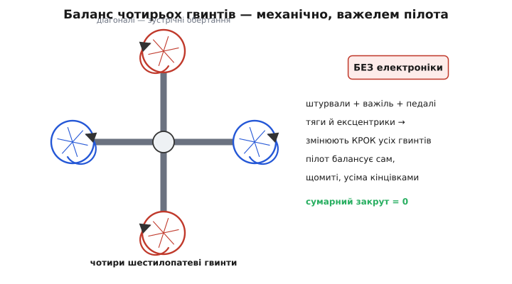
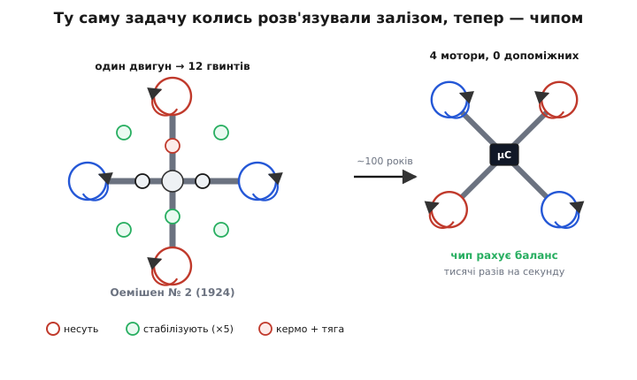

# 📜 Чотири гвинти на світанку гелікоптерів: як задачу балансу колись розв'язали залізом

Коли дивишся, як крихітний дрон висить у повітрі рівно, наче прибитий цвяхом, легко вирішити, що ця машина — дитя електроніки: без чипа, що тисячі разів на секунду підправляє газ на кожному моторі, вона нібито впала б. Це правда лише наполовину. Сама **ідея** — чотири несучі гвинти на жорсткій хрестовині, чиї реактивні моменти врівноважують один одного, — старша за будь-який транзистор. У перші роки 1920-х, коли ще ніхто у світі не вмів упевнено підняти людину прямовисно вгору й утримати на місці, дві машини вже літали саме за цією схемою. І задачу, яку сьогодні мовчки перемелює мікроконтролер, тодішні інженери розв'язували руками пілота — важелями, тягами, ексцентриками. Історія цих машин показує дивовижну річ: фізика чотиригвинтового апарата від того часу не змінилась ані на йоту. Змінилось лише те, **хто** щомиті рахує баланс.

Варто затриматися на цьому, бо тут криється урок про природу самої конфігурації. Багатогвинтова рама — це не винахід цифрової доби. Це давнє інженерне рішення однієї конкретної механічної проблеми, яке століття чекало на достатньо швидкий «мозок», щоб стати практичним. Спершу подивімося, яка саме проблема гнала перших конструкторів до чотирьох гвинтів.

## Чому одного гвинта було так болісно мало

Щоб зрозуміти, навіщо взагалі городили чотири несучі гвинти, треба відчути, яким пеклом був **один**. Розкрутіть великий гвинт над головою апарата — і одразу вилазить проблема, яку неможливо обійти простою механікою: **реактивний момент**. Двигун крутить гвинт в один бік, а гвинт (через повітря) крутить увесь апарат у протилежний. Нічим не зрівноважений, цей закрут просто починає безупинно вертіти машину навколо вертикальної осі, і пілот нічого не може вдіяти — газом тут не зарадиш, бо більше газу означає більший закрут.

```
одинокий гвинт крутиться →  корпус крутиться ←  (нічим не спинити)
```

Класичний вертоліт із одним несучим гвинтом розв'язує це хвостовим гвинтом: маленький гвинт збоку впирається в повітря й весь час гасить закрут головного. Але це рішення непросте: хвостовий гвинт з'їдає частину потужності намарно (він не піднімає нічого, лише бореться із закрутом), потребує довгої хвостової балки, складної трансмісії на всю її довжину, і сам собою нічого не піднімає. У 1920-х, коли двигуни були важкі й слабкі, а керування циклічним кроком лопатей (тим, що нахиляє площину обертання гвинта й жене машину вбік) ще ніхто не довів до пуття, одногвинтова схема здавалася майже безнадійною.

І тут напрошувалась спокуслива альтернатива. А що, як поставити **кілька** несучих гвинтів і крутити половину з них в один бік, половину — в інший? Тоді їхні реактивні моменти спрямуються назустріч і **погасять один одного самі собою**, без жодного хвостового гвинта. Уся потужність двигуна йде на підйом, нічого не витрачається на боротьбу із закрутом. Ба більше — навмисно трохи розбалансувавши ці зустрічні закрути, можна дістати **кермо повороту** задарма. Ця думка й привела до чотиригвинтових машин ще тоді, коли слова «мікропроцесор» не існувало.

> 🔧 **Навіщо це.** Ідея, що народилася в 1920-х, дослівно жива в кожному сучасному дроні: **сусідні гвинти крутяться назустріч, тож сумарний закрут — нуль, а поворот роблять навмисним розбалансом цих закрутів**. Century of hardware progress не змінив цієї основи ані на йоту — змінилося лише те, наскільки швидко й точно можна керувати кожним гвинтом. Тому, розбираючись, чому діагональні мотори дрона однакового напряму, а сусідні — протилежного, ви фактично повторюєте міркування конструкторів столітньої давнини.

Отже, задача була ясна, а рішення — на поверхні. Лишалося маленьке «але»: збудувати таку машину так, щоб вона не тільки злетіла, а й слухалася пілота. За це взялися майже одночасно по обидва боки Атлантики. Почнімо з машини, що злетіла раніше.

## «Летючий восьминіг»: чотиригвинтовий апарат де Ботеза

18 грудня 1922 року на полі МакКук поблизу Дейтона, штат Огайо, у повітря піднялася величезна хрестата споруда з чотирма гвинтами на кінцях. За кермом сидів майор Тергуд Бейн (Thurman H. Bane), начальник інженерної школи Повітряної служби Армії США. Це був **перший політ гелікоптера, збудованого на замовлення армії США** — факт, зафіксований документами Повітряної служби й до сьогодні неспростований (статус: усталено). Апарат мав офіційну назву без жодної поезії — «гелікоптер де Ботеза», — але за характерний вигляд його швидко прозвали **«летючим восьминогом»** (англ. *flying octopus*): чотири довгі ферми-балки, наче щупальця, розходились від центра, і на кінці кожної сидів гвинт.

Машина була справді велетенська. Хрестовина розкидалася на 65 футів (майже 20 м) від кінця до кінця; кожен гвинт мав діаметр близько 8 метрів (26 футів 7 дюймів) і — ось характерна деталь — **шість лопатей**. Загальна злітна вага сягала близько 1630 кг (3600 фунтів). Спершу все це крутив ротаційний двигун Le Rhône на 180 кінських сил, згодом його замінили потужнішим Bentley на 220 сил. Балки були не тонкими трубками, а масивними, наче мостові ферми, — звідси й «важкий» вигляд машини.


*Схема балансу в машині де Ботеза. Чотири шестилопатеві гвинти на хрестовині: діагоналі крутяться назустріч (червоні — в один бік, сині — в інший), тож сумарний реактивний момент — нуль, і хвостовий гвинт не потрібен. Але «рахує» цей баланс не електроніка, якої ще немає, а сам пілот — двома штурвалами, важелем і педалями, що через механічні тяги змінюють крок усіх гвинтів.*

Тепер найважливіше — **як** цим керували, бо саме тут криється і геніальність, і приреченість машини. Жодної електроніки, ясна річ, не було. Кожен гвинт мав **змінний крок** лопатей — тобто кут, під яким лопаті вгризаються в повітря, можна було механічно збільшувати чи зменшувати. Побільшив крок гвинта — той дає більше тяги; поменшив — менше. Кабіна де Ботеза мала два штурвали, ручку керування й педалі, і вся ця збруя через систему тяг заводилася на механізми зміни кроку чотирьох гвинтів. Хочеш нахилити машину вперед — додай крок задній парі, прибери передній. Хочеш повернути — розбалансуй крок діагоналей, порушивши баланс закрутів. Тобто пілот **власними руками й ногами** робив рівно те, що в сучасному дроні за мікросекунди робить мікшер: розкладав чотири бажання (вгору, крен, тангаж, поворот) на чотири керма кроку.

І машина літала. За наступний рік з невеликим зробили понад сотню польотів. Вона піднімала до чотирьох пасажирів на додачу до пілота — неабищо для 1922 року. Рекорди тих польотів звучать сьогодні майже зворушливо: тривалість близько **2 хвилин 45 секунд**, висота близько **9 метрів** (30 футів). Це не помилка масштабу — саме такими були перші кроки вертикального польоту людини (статус: усталено, за документами випробувань).

Але за цими скромними числами ховається те, що й погубило машину. По-перше, вона була **страшенно складна механічно**: чотири редуктори, довгі трансмісійні вали, десятки тяг керування кроком — усе це важило, ламалося й вимагало нескінченного налаштування. По-друге, і головне, — **навантаження на пілота було нелюдським**. Утримувати таку махину рівно, вручну підправляючи крок чотирьох гвинтів одночасно, щоб вона не завалилася на бік і не поповзла кудись, — це вимагало постійної, виснажливої, зосередженої роботи всіма кінцівками щомиті. Машина ледве слухалася. Горизонтальний рух вона брала радше від вітру, ніж від волі пілота: щоб полетіти вперед по-справжньому, часто потрібен був попутний вітерець. Спокійно висіти вона могла, а от активно маневрувати — уже на межі людських можливостей.

1924 року Повітряна служба Армії згорнула проєкт. Причини у звітах названо прямо: надмірна складність, труднощі керування й непомірне навантаження на пілота при кволих льотних характеристиках. Машину розібрали. Ідея була правильна, виконання — героїчне, але без «швидкого мозку» вона впиралася в межу самої людини.

## Хто ж такий де Ботеза: обережно з ярликом «російський»

Тут треба зупинитися й розібратися з особою конструктора, бо його ім'я в популярних джерелах майже завжди супроводжує лаконічне «російський інженер» — і це той самий випадок, коли простий ярлик стирає складнішу й точнішу правду. Розгляньмо виміри його ідентичності окремо, як і належить.

**Ім'я.** Джордж де Ботеза (англ. *George de Bothezat*) — так він підписувався в Америці. Але це американізована форма. У румунському написанні його ім'я — **Ґеорґе Ботезату (Gheorghe Botezatu)**; у російському — Георгій Александрович Ботезат. Уже саме прізвище — Botezatu — з характерним румунським закінченням, а не російське.

**Місце народження.** Народився 7 червня 1882 року в Санкт-Петербурзі, у Російській імперії. Місто народження — російська столиця, це факт; але місце народження — лише один вимір, і саме по собі воно робить людину «російською» не більше, ніж народження в Лондоні автоматично робить когось англійцем за кров'ю.

**Походження й етнічність.** Ось де ярлик «російський» починає тріщати. Батько, Александр Ілліч Ботезат, походив із роду **бессарабських землевласників** — тобто з Бессарабії, історичного краю між Дністром і Прутом (нині здебільшого Молдова, частина — південь Одещини в Україні). За етнічністю рід був **молдавським**. Мати, Надія (Надін) Львівна Рабутовська, походила з російського дворянства. Тобто по батькові де Ботеза — бессарабський молдаванин, по матері — росіянин; сам він, отже, **змішаного походження, з молдавським корінням по батьківській лінії** (статус: усталено за біографічними джерелами; мішаність походження засвідчена, тож зводити його до «росіянина» — неточність).

**Освіта — і вона аж ніяк не суто російська.** Тут біографія особливо промовиста. Шкільні роки — у **Кишиневі** (Chișinău), столиці Бессарабії: школу точних наук він закінчив там близько 1902 року. Далі — **Харківський політехнічний інститут** (нині Харків, Україна), який він закінчив 1908 року. Між тим, у 1905–1907 роках, він устиг повчитися в **Електротехнічному інституті Монтефіоре в Льєжі** (Бельгія). Потому — постдипломні студії в **Ґеттінгенському університеті** та **Берлінському університеті** (Німеччина, 1908–1909), де саме тоді закладали основи сучасної аеродинаміки. І нарешті 1911 року він здобув **докторат у Сорбонні** (Париж) — за дисертацією про стійкість літального апарата («Étude de la Stabilité de l'aéroplane»). Тобто наукову зброю, з якою він потім будував гелікоптер, він викував у **Кишиневі, Харкові, Льєжі, Ґеттінгені, Берліні й Парижі** — у російській столиці він працював уже після цього, приєднавшись до кораблебудівного факультету Петербурзького політехніку.

**Громадянство й подальша доля.** До 1918 року він був підданим Російської імперії — це вимір громадянства, і він реальний. Але у травні 1918-го, коли імперія розпадалася в революції, де Ботеза **втік від більшовиків** до США, де прожив решту життя, працював у Національному дорадчому комітеті з аеронавтики (NACA — попередник NASA), викладав у MIT і Колумбійському університеті, і саме там збудував свій «летючий восьминіг». Помер він американським громадянином.

Отже, як його чесно назвати? Найточніше — **інженер бессарабсько-молдавського походження, народжений у Санкт-Петербурзі, з освітою, здобутою по всій Європі, який зробив головну роботу свого життя в Америці**. Він не «російський винахідник» у сенсі етнічної чи культурної приналежності — це якраз той тип спрощення, проти якого варто застерігати. Російськими були його місце народження й підданство до 1918-го; молдавським — рід і корінь; європейськими — школа думки; американським — головне звершення. Різати цей клубок одним словом «російський» означає стерти справжню, багатонаціональну біографію (статус доказовості: усталено щодо фактів народження, освіти й еміграції; етнічне походження — бессарабсько-молдавське по батькові — засвідчене джерелами).

## Квадрокоптер Оемішена: рекорд, здобутий тринадцятьма гвинтами

Поки де Ботеза мучився зі своїм восьминогом в Огайо, у Франції над тією самою задачею бився **Етьєн Оемішен (Étienne Oehmichen)** — французький інженер (народився 15 жовтня 1884 року в Шалон-сюр-Марн, помер 1955-го в Парижі), що працював у концерні «Пежо». І він пішов до мети іншим, дуже показовим шляхом: якщо машина погано слухається, треба **додати гвинтів під кожну окрему задачу**.

Його апарат №2 (Oehmichen №2), що літав 1924 року, був справжнім лісом гвинтів, і всі вони крутилися від **одного** двигуна. Чотири великі несучі гвинти (кожен — дволопатевий) тримали машину в повітрі. Але цим справа не обмежувалась. Ще **п'ять** менших гвинтів, розміщених у горизонтальній площині, служили для **бічної стабілізації** — вони підправляли нахили машини. Один гвинт на носі відповідав за **поворот** (кермо рискання). А ще два гвинти працювали на **горизонтальну тягу** — штовхали машину вперед. Разом — чотири несучі плюс вісім допоміжних, тобто дванадцять гвинтів, кожен зі своєю чіткою роллю у керуванні (статус: усталено; іноді загальне число подають інакше залежно від того, як рахувати допоміжні гвинти).


*Два способи розв'язати ту саму задачу керування. Ліворуч — Оемішен №2 (1924): один двигун крутить чотири несучі гвинти (червоні й сині — зустрічні) плюс вісім допоміжних — п'ять для бічної стабілізації (зелені), один на носі для повороту й пара для тяги вперед. Праворуч — сучасний квадрокоптер: рівно чотири мотори й жодного допоміжного гвинта, бо весь баланс тисячі разів на секунду рахує мікроконтролер. Фізика та сама; різниця — хто керує.*

Зверніть увагу на глибоку відмінність підходів. У сучасному дроні **всі** керма — підйом, крен, тангаж, поворот — беруться з тих самих чотирьох несучих моторів, просто через розумний розподіл газу: додав переду, прибрав ззаду — маєш тангаж; розбалансував діагоналі — маєш поворот. Оемішен не міг так учинити, бо **не мав чим достатньо швидко й тонко керувати** тягою кожного гвинта. Тому він зробив по-інженерному прямолінійно: **окремий гвинт під кожну функцію**. Треба стабілізувати нахил — ось тобі гвинти стабілізації. Треба повернути — ось носовий гвинт. Треба летіти вперед — ось тягові гвинти. Замість одного розумного розподілу по чотирьох моторах — дюжина спеціалізованих гвинтів, кожен зі своєю простою роботою. Кут лопатей несучих гвинтів він при цьому міг підправляти вигинанням (warping) — ще одна суто механічна хитрість.

І — знову — це літало, ще й краще за американця. 14 квітня 1924 року Оемішен пролетів **360 метрів** по прямій і встановив **перший в історії рекорд дальності для гелікоптерів, офіційно визнаний Міжнародною авіаційною федерацією (FAI)** (статус: усталено, за документами FAI). Три дні по тому, 17 квітня, він подовжив політ до 525 метрів. А 4 травня 1924 року здійснив те, що доти не вдавалося нікому: **перший замкнений політ гелікоптера по колу** — облетів трикутний маршрут довжиною близько кілометра, повернувшись у точку зльоту, за 7 хвилин 40 секунд. За цей подвиг він отримав приз у 90 000 французьких франків. Замкнене коло означало, що машина не просто висіла й повзла за вітром, а **керовано пройшла маршрут і повернулась** — тобто пілот справді нею правив.

## Чому обидві машини програли — і що з цього лишилось

Отже, обидві машини літали. Обидві доводили, що чотиригвинтова схема з балансом зустрічних закрутів **фізично працездатна**. Чому ж від них не пішла ціла родина вертольотів, чому наступні десятиліття авіації — це доба **одногвинтових** машин Сікорського з хвостовим гвинтом, а не багатогвинтових нащадків восьминога?

Причина в обох випадках одна, і вона не фізична, а **інформаційна**. Багатогвинтова машина принципово **нестійка**: варто одному гвинту дати трохи забагато чи замало тяги — і вона починає завалюватися, а щоб її вирівняти, треба **безперервно й швидко** підправляти тягу всіх гвинтів у складному узгодженні. Це не разова дія, а невпинний потік дрібних корекцій — багато разів на секунду, точно розрахованих. Людина на таке здатна лише на межі сил і дуже недовго. І де Ботеза, і Оемішен уперлися в одну стіну: **керувати можна, але це вичавлює пілота досуха**, і про справжній вільний маневр не йдеться.

Порівняймо навантаження чесно:

```
машина 1920-х:   баланс рахує ПІЛОТ,   вручну,   кілька корекцій/с,  на межі сил
сучасний дрон:   баланс рахує ЧИП,     сам,      тисячі корекцій/с,  без утоми
```

Ось у цьому рядку — уся розгадка. Не бракувало **ідеї** (вона була правильна ще 1922-го), не бракувало **фізики** (баланс закрутів працює однаково тоді й тепер), не бракувало навіть **інженерної майстерності** (машини були збудовані блискуче для свого часу). Бракувало одного — **достатньо швидкого й невтомного контролера**, який щомиті переганяв би бажаний рух у газ на кожному моторі. Одногвинтова схема з хвостовим гвинтом виграла саме тому, що вона **пасивно стійкіша**: нею може правити людина, не збожеволівши. Багатогвинтова мусила зачекати на того, хто балансуватиме за неї.

Цей контролер прийшов через півстоліття — спершу як гіроскопи й аналогові стабілізатори, а потім, наприкінці XX століття, як дешевий мікроконтролер із давачами кутової швидкості на одному кристалі. Щойно з'явився чип, здатний тисячі разів на секунду читати нахил і підправляти газ чотирьох моторів, стара ідея 1922 року **ожила миттєво** — і породила мільйони дронів. Ба більше: сучасний дрон обходиться **лише чотирма** моторами там, де Оемішену треба було дванадцять гвинтів, — саме тому, що чип уміє витиснути всі чотири керма з тих самих несучих гвинтів через розумний розподіл, а не будувати окремий гвинт під кожну задачу. Дюжина гвинтів Оемішена — це, по суті, **апаратна заміна відсутньому програмному мікшеру**: кожна функція, яку сьогодні виконує рядок коду, тоді потребувала окремого залізного гвинта.

І в цьому — головний урок цих машин для розуміння будь-якої багатогвинтової рами. **Конфігурація гвинтів вирішує задачу балансу реактивних моментів однаково — що механічними тягами 1922 року, що матрицею мікшера в чипі сьогодні.** Геометрія — скільки гвинтів, де вони, куди крутяться — це вічна частина, фізика твердого тіла, яка не застаріває. Електроніка — лише **швидкий і невтомний виконавець** тієї самої розкладки, яку столітті тому виконував змучений пілот усіма руками й ногами одразу. Дивлячись на завислий дрон, ви бачите здійснену мрію конструкторів 1920-х: та сама хрестовина, ті самі зустрічні закрути, той самий баланс — тільки тепер його тримає не людина на межі сил, а незворушний кремнієвий кристал, що ніколи не втомлюється.
