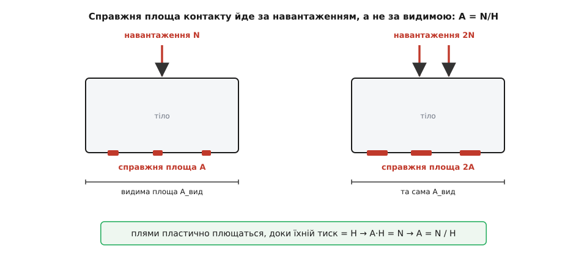
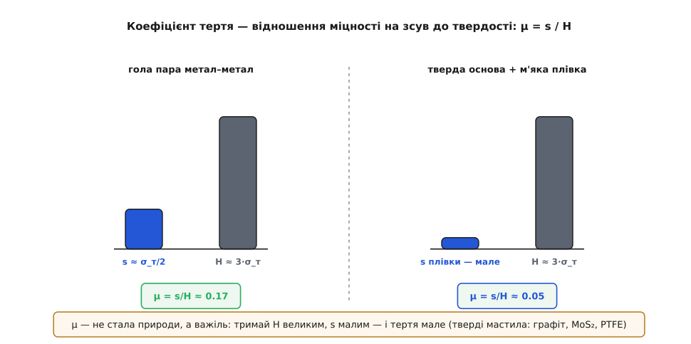

# 🧮 Звідки береться F = μ·N: справжня площа, твердість і зсув

F = μ·N зазвичай подають як голий дослідний факт, а μ — як число, що його беруть із таблиці. Це лишає незадоволення. Чому тертя рівно пропорційне навантаженню — не корінь із нього, не квадрат, а саме перша степінь? Чому видима площа, всупереч усій інтуїції, не важить анітрохи? І чому μ для металів раз у раз опиняється у вузькій щілині від 0.1 до 1 — ніколи не 1000, ніколи не 0.0001? Добра теорія не має просто підігнати ці факти під дослід — вона має зробити їх неминучими. Зберемо μ з двох властивостей самих матеріалів — наскільки вони тверді й наскільки легко зрізаються, — і побачимо, як із цього самі собою випадуть обидва закони Амонтона (їх пов'язують із його ім'ям, 1699) і навіть конкретне число.

## Дотик, якого майже немає

Прикладіть дві металеві плитки одна до одної. На око вони лежать усією гранню, стикаючись, скажімо, кількома квадратними сантиметрами. Насправді жодна поверхня не буває рівною: під достатнім збільшенням це пасмо горбів і западин. Дві такі поверхні торкаються не гранню, а лише вершечками найвищих горбів — жменькою крихітних плям, розкиданих по видимій площі. Сумарна площа цих плям — справжня площа контакту — у тисячі разів менша за видиму.

Ось тут і криється весь фокус. Уся сила N, з якою тіла притиснуті, лягає не на видимі сантиметри, а на ці кілька мікроскопічних плям. [Тиск](topic:physics/pressure) — сила, поділена на площу, — на них тому колосальний. І цей тиск не може рости безмежно: у кожного матеріалу є стеля, вище за яку він перестає пружно опиратися й починає **пластично текти** — плющитися незворотно, як пластилін. Цю стелю звуть **твердістю** H (точніше — твердістю на вдавлювання): це той тиск, під яким матеріал піддається й розповзається. Тісно споріднена з нею [границя плинності](topic:physics/plastic-deformation) σ_т (лат. *fluere* — текти) — напруження, за якого метал перестає бути пружним і починає текти.

Тепер простежмо, що діється, коли плитки тільки-но зімкнулися. Спершу плям обмаль, тиск на них величезний — куди більший за H. Матеріал цього не витримує: вершечки пластично плющаться, розповзаються, і площа плям росте. Що більша сумарна площа, то меншим стає тиск на ній. Плющення триває рівно доти, доки тиск не спаде до H — до тієї стелі, за якою течія спиняється. У цій точці система завмирає: плями рівно такі завбільшки, щоб витримати навантаження при тиску H, ні більші, ні менші.

Запишімо цю рівновагу. Хай сумарна справжня площа плям — A. Кожен квадратний метр плями тисне зі стелею H, тож усі плями разом підпирають силу A·H. Вона мусить дорівнювати притиску N:

```
A · H = N          (плями течуть, доки не зрівноважать навантаження)
A = N / H          (звідси — справжня площа контакту)
```

Придивімося до цієї коротенької формули, бо в ній — половина всієї теорії тертя. Справжня площа контакту **прямо пропорційна навантаженню** N і **не містить видимої площі взагалі**. Скільки видимих сантиметрів у вас під тілом — байдуже: площа плям задається тільки тим, скільки ви давите й наскільки твердий матеріал.


*Чому справжня площа йде за навантаженням, а не за видимою. Ліворуч — навантаження N, праворуч — удвічі більше 2N на тому самому тілі з тією самою видимою гранню. Плями пластично плющаться, доки тиск на них не впаде до стелі-твердості H; тому вдвічі більше навантаження тримається на вдвічі більшій справжній площі. Видима площа в цей рахунок не входить зовсім.*

Перевірмо на числі, наскільки крихітний цей справжній дотик.

**Сталевий кубик на столі.** Кубик м'якої сталі з ребром 5 см і масою близько 1 кг лежить на сталевій плиті.

```
навантаження (вага кубика):    N = m·g = 1 · 9.8 ≈ 9.8 Н
твердість м'якої сталі:        H ≈ 1·10⁹ Па  (1 ГПа)
справжня площа контакту:       A = N / H = 9.8 / 1·10⁹ ≈ 1·10⁻⁸ м² = 0.01 мм²
видима площа грані:             A_вид = 5 × 5 = 25 см² = 2.5·10⁻³ м²
частка справжнього дотику:      A / A_вид ≈ 1·10⁻⁸ / 2.5·10⁻³ ≈ 4·10⁻⁶
```

Увесь кілограм сталі тримається на плямах, що вклалися б у квадратик зі стороною 0.1 мм — чотири мільйонні частки видимої грані. Решта поверхні висить у субмікронному просвіті й нікого не торкається. Що важче тіло, то більша ця частка (площа плям росте разом із N) — але навіть під тонною справжній дотик лишається тонюсінькою скибкою видимого, бо, щоб плями розрослися на всю грань, тиск на всій грані мусив би сягнути H, а це вже руйнівне навантаження.

## Щоб зрушити — треба зрізати

Ми знаємо, скільки насправді торкається. Лишилося зрозуміти, що втримує тіло на місці. На плямах, де атоми двох металів підійшли впритул, вони зчіплюються — виникають дрібні містки холодного зварювання, буквально суцільний метал у місці стику. Щоб тіло поїхало, ці містки треба **зрізати** — зсунути верхній метал відносно нижнього по площині плями.

У кожного матеріалу є своя міра опору такому зрізанню — **міцність на зсув** s: це дотичне напруження (сила вздовж поверхні на одиницю площі), за якого місток піддається й зрізається. Щоб зрізати одну пляму площею a, треба прикласти вздовж поверхні силу s·a. Щоб зрушити тіло, треба зрізати всі плями заразом, а їхня сумарна площа — та сама A, яку ми щойно знайшли. Отже, сила, потрібна на зрив:

```
F = s · A
```

І тепер — момент, заради якого все й затівалося. Підставмо сюди A = N/H:

```
F = s · A = s · (N / H) = (s / H) · N
```

Порівняймо з тим, що дає дослід, F = μ·N. Дві формули збігаються тотожно, якщо

```
μ = s / H
```

Ось і все виведення. Коефіцієнт тертя — це не окрема таємнича стала, а **відношення двох міцностей** того самого стику: наскільки легко його зрізати (s) проти того, наскільки він твердий на вдавлювання (H). Уся хитрість тертя звелася до ділення одного напруження на інше.

## Обидва закони Амонтона — це один факт, побачений двічі

Тепер відступімо на крок і подивімося, що ми насправді пояснили. Дослід дає два закони тертя, що століттями здавалися незалежними, ба навіть суперечливими. Обидва тепер випадають з однієї рівності A = N/H.

**Перший закон: тертя пропорційне навантаженню.** F = (s/H)·N — пряма пропорційність, бо справжня площа A росте рівно як N. Подвоїли притиск — подвоїли площу плям — подвоїли силу зчеплень, яку треба зрізати. Ніякого кореня чи квадрата: плями плющаться пропорційно, і тертя йде за ними крок у крок.

**Другий закон: тертя не залежить від видимої площі.** У формулу F = (s/H)·N видима площа не входить узагалі — там лише N, s і H. Покладіть цеглину плазом чи поставте на вузький торець: видима площа зміниться втричі, але тиск на плямах у вужчій постановці одразу підскочить, плями вмнуться глибше, і справжня площа A вийде та сама N/H. Видиме змінилося, справжнє — ні, тому й тертя однакове.

Найкрасивіше тут те, що це не два закони, а **один**, побачений із двох боків. Обидва — просто наслідки того, що справжня площа дорівнює N/H: у ній є навантаження (звідси перший закон) і немає видимої площі (звідси другий). Століттями їх вимірювали як окремі загадки; адгезійна модель, яку в середині XX століття довели до ясності Боуден і Тейбор у Кембриджі, показала, що це одне й те саме твердження.

## Чому μ виходить саме 0.1–1

Формула μ = s/H не лише пояснює закони — вона передбачає й **величину** тертя. Підставмо в неї те, що знаємо про метали.

Твердість на вдавлювання пов'язана з границею плинності простим множником. Коли твердий наконечник вминається в метал, матеріал під ним затиснутий з усіх боків і тому опирається сильніше, ніж якби його просто розтягували: докладний розрахунок пластичної течії дає H ≈ 3·σ_т. А міцність на зсув для більшості металів — приблизно половина границі плинності, s ≈ σ_т/2: зрізати метал десь удвічі легше, ніж змусити його текти під розтягом. Підставмо обидва:

```
H ≈ 3 · σ_т           (твердість утричі більша за границю плинності)
s ≈ σ_т / 2           (зсув тече десь на половині границі плинності)

μ = s / H ≈ (σ_т / 2) / (3 · σ_т) = 1/6 ≈ 0.17
```

Дивовижна річ сталася: границя плинності σ_т скоротилася дощенту. Вона стояла і в чисельнику (через s), і в знаменнику (через H), тож у відношення не ввійшла зовсім. Тому μ **не залежить від того, м'який метал чи твердий**: і в свинцю, і в загартованої сталі s і H міняються разом, а їхнє відношення тримається коло тієї самої п'ятої-шостої. Ось чому таблиці μ для різних металів такі схожі й такі нудні — усі коло 0.1–0.5, тоді як самі границі плинності різняться в сотні разів.

І ось чому μ не буває ні гігантським, ні мізерним. Щоб вийшло μ = 1000, метал мав би бути каменем на вдавлювання й водночас маслом на зсув — а це неможливо, бо і твердість, і опір зсуву тримаються на **тих самих міжатомних зв'язках**. Зруйнувати зв'язок зсувом чи стиском — робота одного порядку, тож їхнє відношення приречене бути числом коло одиниці, а точніше — коло 0.2.


*μ як відношення двох міцностей — і важіль, яким ним керують. Ліворуч гола пара метал–метал: зсув тече десь на σ_т/2, твердість утричі більша за σ_т, тож μ = s/H ≈ 0.17. Праворуч — той самий твердий низ, але стик прикритий тонкою м'якою плівкою, що зрізається легко: чисельник s падає, знаменник H лишається великим, і μ провалюється до ≈ 0.05. Саме так працюють тверді мастила — графіт, дисульфід молібдену, тефлон.*

І тут теорія з пояснювальної стає **передбачувальною**, тобто по-справжньому корисною. Формула μ = s/H — не просто підсумок, а рецепт: хочеш мале тертя — зроби так, щоб стик зрізався легко (мале s), а площа лишалася малою (велике H). Обидва важелі можна крутити нарізно. Поклади на тверду сталеву основу тонку плівку м'якого металу (індію, свинцю) чи шаруватого мастила (графіту, дисульфіду молібдену): площу плям і далі задає тверда сталь під плівкою (велике H, площа мала), а зрізається вже не сталь, а слабенька плівка (мале s). Відношення s/H падає в рази — і тертя разом із ним. Уся інженерія твердих мастил і підшипників ковзання виведена рівно з цього дробу.

> 🔧 **Навіщо це.** Формула μ = s/H перетворює вибір матеріалу на розрахунок. Підшипник ковзання не змащують «бо так треба» — тонка плівка ставить у знаменник тверду бронзу чи сталь, а в чисельник — слабкий на зсув мастильний шар, і проєктувальник наперед знає, у скільки разів упаде тертя. Той самий дріб пояснює, чому надтверде, але крихке покриття може дати гірше ковзання, ніж м'якша пара: підняли H, та коли підняли й s, виграшу немає. Знаючи, що μ — це відношення, тертям керують свідомо, а не намацки.

## Де проста картина згинається

Виведення тримається на двох спрощеннях, і варто знати, де кожне з них тріщить.

**Плями ростуть під зсувом.** Ми порахували площу A = N/H так, наче її задає сам притиск N, і на цьому спинилися. Але щойно ми починаємо ще й зсувати, стик опиняється під **двома** напруженнями заразом — стисним і дотичним, — а текти матеріал починає раніше, під їхньою спільною дією. Щоб лишитися на порозі течії, пляма мусить підрости; що дужче тиснемо вбік, то більшою вона стає. Це **ріст плям**: справжня площа виходить більша за просту N/H, і тертя — більше, ніж наївне s/H. Тому виміряне μ сталі по сталі ближче до 0.6, ніж до наших 0.17. Наша оцінка — це радше підлога, а не точне значення.

Доведений до краю, ріст плям пояснює й пряме холодне зварювання. У бездоганно чистих металів у вакуумі s стику дорівнює повній міцності металу, і плями ростуть без упину — стик хапає намертво, деталі зварюються, μ шугає за одиницю. Рятує нас бруд: у повітрі всяка поверхня вкрита оксидом і плівкою адсорбованих газів, стик зрізається по цій слабшій плівці раніше, ніж устигне розрости, — і тертя лишається помірним. Тому те саме золото по золоту у вакуумі заклинює, а в повітрі спокійно ковзає.

**Не всі плями течуть — деякі пружинять.** Друге спрощення тонше. Ми припустили, що кожен вершечок пластично тече й підпирає рівно H. Але під легким навантаженням чи на дуже гладких твердих поверхнях багато плям не доходять до плинності — вони деформуються [пружно](topic:physics/elastic-deformation), як стиснута пружинка, і відпружинюють назад, коли навантаження зняти. А для одного пружного горбика площа контакту росте не як N, а як N²ᐟ³ — і, здавалося б, перший закон Амонтона мав би зламатися: пружний дотик не пропорційний навантаженню.

Рятує статистика багатьох горбиків. Ґрінвуд і Вільямсон 1966 року показали дивовижне: коли на шорсткій поверхні розкидані горбики різної висоти, збільшення навантаження здебільшого не роздуває наявні плями, а **вводить у гру нові** — досі коротші горбики дістають нарешті до другої поверхні. Кожна окрема пляма лишається дрібною й пружною, зате їх стає рівно пропорційно більше — і сумарна площа A знову виходить ≈ пропорційною N. Перший закон Амонтона тримається навіть без жодної пластичної течії, просто іншим шляхом. Що саме верховодить — пластичне плющення чи пружне множення плям — вирішує шорсткість і твердість поверхонь.

І в цьому справжня сила простого F = μ·N: до пропорційності площі навантаженню ведуть **два незалежні механізми** — пластичне плющення в Боудена й Тейбора та пружна статистика в Ґрінвуда й Вільямсона. Природа підстрахувала себе двічі, тож лінійний зв'язок тертя з навантаженням тримається в разюче широкому діапазоні умов — а разом із ним і те коротке μ, що його інженер бере з таблиці, навіть не згадуючи, скільки фізики під ним сховано.
