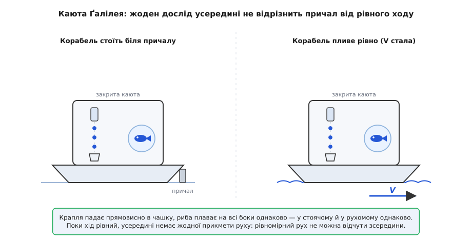
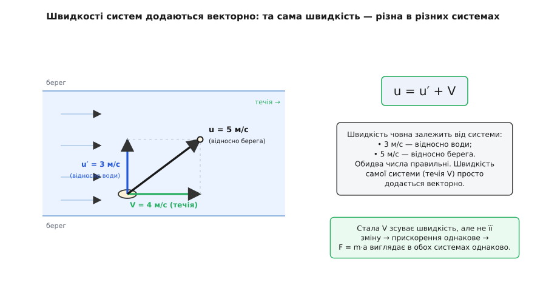
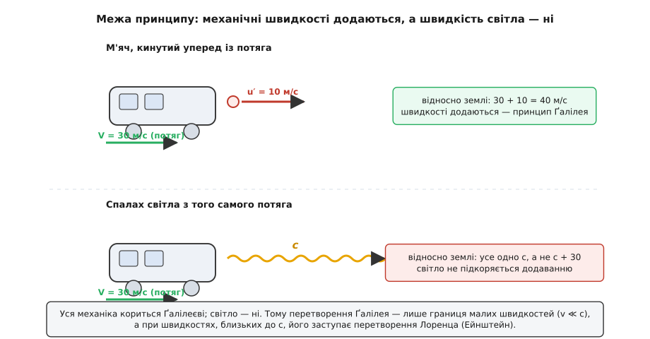

# Принцип відносності Ґалілея: чому рівний хід не можна відчути зсередини

<preknowlist>
- [Інерціальна система відліку](topic:physics/inertial-frame) — система, де вільне тіло йде прямо, а закони Ньютона стоять у чистій формі, без вигаданих сил.
- [Швидкість](topic:physics/velocity) — швидкість завжди відносно якоїсь системи; «рівномірний рух» — це стала за величиною й напрямком швидкість.
- [Перший закон Ньютона](topic:physics/newtons-first-law) — закон інерції: вільне тіло, на яке не діє сумарна сила, зберігає свою швидкість.
- [Прискорення](topic:physics/acceleration) — швидкість зміни швидкості; саме воно, а не сама швидкість, однакове в усіх рівномірно рухомих системах.
</preknowlist>

Налийте каву в літаку, що мчить на 900 кілометрів за годину. Вона ллється у чашку так само рівно, як удома на кухні. Ви йдете проходом — і не доводиться нахилятися проти «вітру швидкості»; підкидаєте горішок і ловите його там само, де підкинули, а не на три метри позаду. Ніщо всередині салону не зраджує, що ви несетеся швидше за кулю. Позатуляйте вікна — і жодним домашнім дослідом ви не встановите, стоїть літак на смузі чи вже давно в небі.

Оцей буденний факт, піднятий до рангу закону природи, і є **принцип відносності Ґалілея**: у замкненій системі, що рухається рівномірно й прямолінійно, жодним механічним дослідом не виявити самого цього руху. Усі інерціальні системи цілком рівноправні — серед них немає тієї єдиної, «справді нерухомої», відносно якої слід було б рахувати все інше. Латиною *relativus* — «віднесений до чогось»; рух і справді існує лише як віднесений до вибраної системи, а сам собою, «абсолютно», не існує ніде.

### Каюта під палубою

Найяскравіше цю думку висловив Ґалілео Ґалілей 1632 року, і висловив не заради самої фізики, а щоб виграти суперечку про будову світу. Тодішній козир проти Коперника був простий і на позір нищівний: якби Земля справді летіла й крутилася, ми б це відчували. Кинутий угору камінь відставав би від рухомої землі й падав далеко на захід; птах, знявшись, не наздогнав би своє дерево; вітер із «швидкості планети» валив би з ніг. Нічого цього немає — отже, Земля стоїть.

Ґалілей розбив цей аргумент одним уявним дослідом. Замкніть себе, каже він, у каюті під палубою великого корабля, разом із мисками, у яких плавають рибки, метеликами й мухами в повітрі, пляшкою, що по краплі капає у посудину внизу. Поки корабель стоїть, спостерігайте: краплі падають прямовисно, риби плавають на всі боки однаково, метелики літають байдуже до сторін світу. А тепер хай корабель піде — рівно, без ривків. І **нічого не зміниться**. Краплі так само влучають у посудину, а не відстають до корми; риба не притискається до задньої стінки миски; метелик не мусить наздоганяти ніс корабля. Хоч як напружуйтесь, ви не вгадаєте з поведінки цих речей, стоїте ви чи пливете.


*Корабель біля причалу і корабель, що йде рівним ходом зі сталою швидкістю V. Усі домашні досліди в закритій каюті дають однаковий результат: крапля падає прямовисно в чашку, риба плаває на всі боки однаково. Поки хід рівний, усередині немає жодної прикмети руху — рівномірний рух не можна відчути зсередини. Тому й камінь на рухомій Землі не відстає, коли його підкинути.*

Ось чому камінь не падає на захід: поки він у руці, він летить разом із Землею вбік; відпущений, він за інерцією зберігає цю бічну швидкість і рухається вбік точно в лад із землею під ним — тож для нас падає прямовисно. Заперечення проти Коперника трималося на мовчазному припущенні, що відпущене тіло «губить» рух основи; принцип відносності показує, що ніякого руху воно не губить. Довгий шлях цієї ідеї — від давнішого образу човна в індійського астронома Аріабгати аж до строгого формулювання Ньютона — зібрано в окремій розповіді про [народження принципу](topic:physics/galilean-relativity/hist-galileo-ship.md).

### Чому так: швидкість відносна, прискорення — ні

За цим чаром ховається дуже проста механіка. Візьмімо дві [інерціальні системи](topic:physics/inertial-frame): нерухомий перон S і вагон S′, що котиться повз нього зі сталою швидкістю V. Одне й те саме тіло має в них різні швидкості — спостерігач у вагоні бачить `v′ = v − V`, бо мусить відняти власний рух. Швидкості, отже, у різних системах різні: це і є відносність швидкості.

А тепер найважливіший крок. Закони руху говорять не про саму швидкість, а про її **зміну** — про [прискорення](topic:physics/acceleration). Погляньмо, що стається зі зміною, коли ми весь час віднімаємо **одне й те саме стале** V:

```
v′ = v − V           (V — стала, не залежить від часу)
a′ = Δv′/Δt = Δ(v − V)/Δt = Δv/Δt = a
```

Стала при відніманні зникає з темпу змін. Прискорення в обох системах **однакове**. А оскільки маса тіла та сама й реальні сили (натяг, тяжіння, поштовх) ті самі, то [другий закон Ньютона](topic:physics/newtons-second-law) `F = m·a` у вагоні читається буквально так само, як на пероні. Обидва спостерігачі пишуть тотожні рівняння, ставлять однакові досліди й дістають однакові числа. Саме тому їх і не розрізнити: не якесь диво ховає рух каюти, а те, що закони природи скроєні з прискорень, а прискорення до рівномірного руху системи байдуже.

Звідси випливає і правило, як переходити між системами. Якщо тіло має швидкість u′ у вагоні, а вагон іде на V, то відносно перону швидкість тіла — векторна сума `u = u′ + V`. Швидкості систем просто **додаються**, і це додавання цілком реальне з обох боків.

**Приклад (човен упоперек течії).** Веслуємо строго поперек річки; течія зносить уздовж. Яка швидкість човна?

```
Швидкість човна відносно води:   u′ = 3 м/с (упоперек)
Швидкість течії (води):          V  = 4 м/с (уздовж)
Ці два вектори перпендикулярні, тож відносно берега:
   u = √(u′² + V²) = √(3² + 4²) = √(9 + 16) = √25 = 5 м/с
   напрямок: відхилений від поперечного курсу на arctan(4 / 3) ≈ 53° за течією
```

Швидкість того самого човна — 3 м/с відносно води й 5 м/с відносно берега. Обидва числа правильні; жодне не «істинніше» за інше, бо жодна із систем не головна. Це вже не 1632 рік із однією віссю: швидкості складаються як вектори, за тим самим правилом, що й сили.


*Човен веслує впоперек зі швидкістю u′ = 3 м/с відносно води, течія несе його вздовж на V = 4 м/с. Відносно берега швидкості додаються векторно: u = 5 м/с під кутом до берега. «Швидкість човна» без указівки системи — незавершена думка: 3 м/с у воді й 5 м/с відносно берега однаково справжні. А оскільки V стала, вона зсуває швидкість, але не її зміну — прискорення в обох системах те саме, тож і F = m·a виглядає однаково.*

Повний набір формул переходу — як перераховуються координати, час і швидкості між системами, що саме при цьому лишається незмінним і як усі такі переходи складаються в одну струнку [групу перетворень Ґалілея](topic:physics/galilean-relativity/math-galilean-transformation.md), — винесено в окрему математичну вставку.

### Що відносне, а що однакове для всіх

Принцип відносності зовсім не означає, ніби «все відносне» — навпаки, він гострим ножем ділить величини на два сорти. Одні залежать від вибору системи, інші — ні, і саме друга, незмінна група й тримає фізику вкупі.

Від системи залежать: **положення** тіла, його **швидкість**, форма його **траєкторії** (підкинутий у вагоні м'яч летить для пасажира прямо вгору й вниз, а для перону — дугою-параболою) і навіть **кінетична енергія**. Останнє особливо збиває з пантелику, тож перевірмо на числах.

**Приклад (енергія залежить від системи).** М'яч масою 1 кг лежить на полиці вагона, що йде на 30 м/с.

```
У системі вагона м'яч стоїть:   v′ = 0  →  E′ = ½·m·v′² = 0 Дж
Із перону м'яч летить на 30 м/с: v = 30 →  E  = ½·1·30² = 450 Дж
```

Нуль джоулів для пасажира, 450 джоулів для перону — і жодне значення не хибне. [Кінетична енергія](topic:physics/kinetic-energy) не має однієї «правдивої» величини, вона завжди відносно системи. І все ж закон збереження енергії справджується в кожній системі окремо: просто числа в ньому в кожної свої.

А тепер незмінна група — те, з чим погодяться **всі** інерціальні спостерігачі: проміжок часу Δt між двома подіями, довжина твердого предмета, маса тіла, його прискорення, прикладена до нього сила й **різниця** швидкостей двох тіл. Ця остання інваріантність — тиха героїня всієї механіки. Зіткнення, віддача, розліт уламків залежать лише від того, як швидко тіла зближуються **одне відносно одного**, а ця відносна швидкість у всіх системах та сама. Тому й [імпульс](topic:physics/momentum) зберігається однаково для всіх: хоч його повна величина в кожній системі своя, сам факт збереження від вибору системи не залежить.

> 🔧 **Навіщо це.** Принцип відносності — не філософська окраса, а робочий інструмент: він дозволяє **перейти в ту систему, де задача найпростіша**, розв'язати її там і повернутися. Задачу про зіткнення двох тіл фізик майже завжди переносить у [систему центра мас](topic:physics/center-of-mass), що летить разом із ними: у ній повний імпульс дорівнює нулю, тіла симетрично зближуються й розлітаються, і громіздка алгебра з двома швидкостями стискається до кількох рядків. Розв'язок, знайдений у зручній системі, потім переносять назад простим додаванням швидкості цієї системи. Так само штурман рахує зустріч двох суден у системі одного з них, а балістик — політ снаряда відносно рухомої платформи. Свобода вибирати систему — це свобода вибирати найлегший шлях до відповіді.

### Де принцип ламається: світло

Уся ця картина здавалася непорушною двісті п'ятдесят років — доки не дійшло до світла. Механічні швидкості слухняно додаються: викотіть м'яч уперед із рухомого потяга, і відносно землі його швидкість буде сумою швидкості потяга й швидкості кидка. Але коли наприкінці XIX століття [рівняння Максвелла](topic:physics/maxwell-equations) точно описали світло, у них виявилася вбудована стала — швидкість світла c, та сама для всіх. Спалахніть ліхтариком уперед із того самого потяга — і промінь піде відносно землі не зі швидкістю `c + V`, як велить додавання Ґалілея, а рівно з c. Досліди це підтвердили з приголомшливою точністю: швидкість світла та сама, хоч би як швидко ви йому назустріч чи від нього рухалися.


*М'яч, кинутий уперед із потяга (V = 30 м/с) зі швидкістю 10 м/с відносно вагона, летить відносно землі на 40 м/с — швидкості додаються, як велить Ґалілей. Спалах світла з того самого потяга йде відносно землі не з c + 30, а рівно з c. Механіка кориться принципу, світло — ні. Тому перетворення Ґалілея — лише границя малих швидкостей; при швидкостях, близьких до c, його заступає перетворення Лоренца.*

Це не спростувало сам принцип відносності — його врятувало, навіть посиливши. Айнштайн 1905 року залишив головну вимогу недоторканою: закони фізики однакові в усіх інерціальних системах, і рівномірного руху не виявити нізвідки. Він лише додав до неї сталість c як другий постулат — і побачив, що заради цього доводиться відмовитися від мовчазного припущення Ґалілея, ніби час і довжина однакові для всіх. Так проста заміна `v′ = v − V` поступилася складнішому перетворенню Лоренца, у якому й час, і відстані вже залежать від руху системи. Принцип відносності поширився з механіки на все — зокрема на електромагнетизм, — але його класичний, ґалілеїв вигляд лишився чинним там, де швидкості малі проти світлових. Як саме одне переходить у друге й чому в повсякденні різниця непомітна, розгортає [спеціальна теорія відносності](topic:physics/special-relativity).

І в цьому вся міра ґалілеєвого принципу. Для потягів, літаків, планет і куль, для всього, що рухається повільніше за світло навіть у мільйони разів, він точний до неможливості виміряти відхилення. Кава в літаку ллється рівно не приблизно, а строго; підкинутий горішок падає в руку не «майже» там само, а там само. Айнштайн не викинув Ґалілея — він показав межі його володінь і те, що всередині цих меж, які охоплюють майже весь наш досвід, старий принцип бездоганний.

### Що з цього лишається

Принцип відносності Ґалілея — це не туманне «все відносне», а гострий і точний закон: **рівномірний прямолінійний рух не має абсолютного змісту, і закони природи однакові в кожній інерціальній системі**. Він народився не в тиші кабінету, а як бойовий аргумент за рухому Землю, і виявився куди глибшим за суперечку, задля якої постав. З нього випливає, що швидкість існує лише відносно вибраної системи, а прискорення й сила — для всіх однакові; що зручну систему можна вибирати вільно, полегшуючи собі будь-яку задачу; і що серед незліченних інерціальних систем немає привілейованої.

Ця незмінність законів при переході між рівномірно рухомими системами — одна з глибоких **симетрій** природи, а за [теоремою Нетер](topic:physics/noether-theorem) кожна симетрія стоїть на сторожі свого закону збереження. Тож принцип відносності — не лише про те, чого не можна відчути в закритій каюті. Це один із тих кількох фундаментальних принципів симетрії, на яких тримається вся будівля фізики, — і Ґалілей, змальовуючи риб та метеликів під палубою, заклав перший його камінь.
