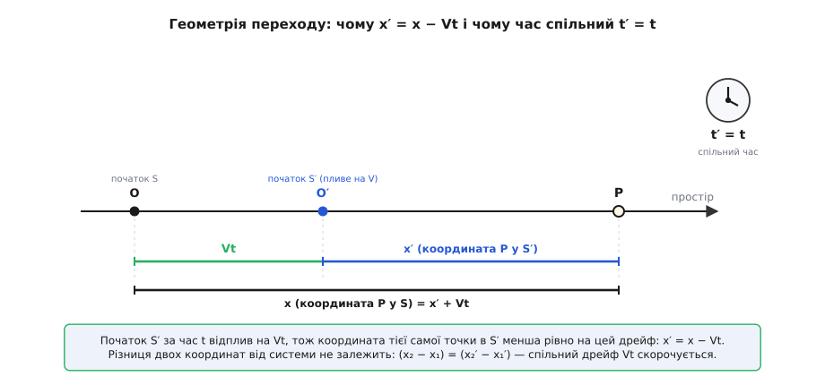
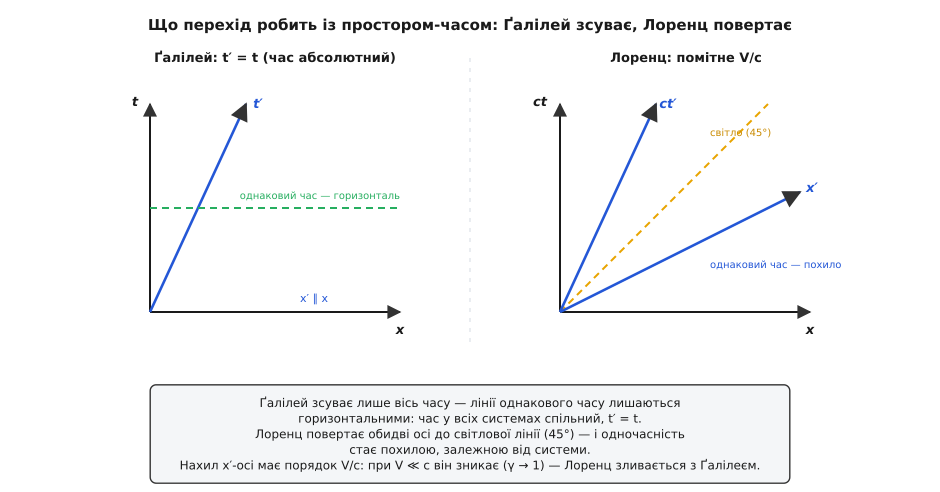

# 🧮 Перетворення Ґалілея: повний апарат переходу

Принцип відносності каже, що всі рівномірно рухомі спостерігачі рівноправні. Але щоб цим користуватися — рахувати, а не лише розмірковувати, — потрібне точне правило: узяти числа, якими подію описує один спостерігач, і видати числа, якими ту саму подію опише інший. Це правило й зветься **перетворенням Ґалілея**. На вигляд воно до сміховинного просте, та в ньому сховано припущення такої ваги, що коли за двісті п'ятдесят років у ньому нарешті засумнівалися, з цього народилася вся теорія відносності. Розберімо апарат до дна: звідки беруться формули, що в них лишається незмінним, як усі такі переходи складаються в одну групу й де саме цей апарат тріщить.

### Означення: чотири рівняння переходу

Візьмімо дві [інерціальні системи](book:physics/inertial-frame) — системи, у яких вільне тіло рухається прямо й рівномірно, а закони Ньютона стоять у чистій формі. Нехай S — «нерухомий» перон, а S′ — вагон, що котиться повз нього вздовж осі x зі сталою швидкістю V. Домовмося, що в мить t = 0 початки обох систем збігалися. Тоді координати однієї й тієї самої події в цих двох системах пов'язані так:

```
x′ = x − V·t
y′ = y
z′ = z
t′ = t
```

Ось і весь апарат — чотири рівняння. Три просторові координати й час системи S′ виражені через координати й час системи S. Уздовж напрямку руху координата зсувається на V·t; поперек руху (y, z) не міняється нічого; а час — час просто переноситься без змін, t′ = t.

Якщо не прив'язуватися до осі x, а пустити вагон у довільному напрямку зі швидкістю-[вектором](book:math/vector-components) **V**, ті самі чотири рівняння згортаються у два — одне векторне для простору й одне скалярне для часу:

```
r′ = r − V·t
t′ = t
```

Тут **r** = (x, y, z) — радіус-вектор точки. Векторна форма каже те саме, що й покоординатна, але видно суть без зайвого: **простір зсувається на вектор V·t, час — недоторканий**.

> 🔧 **Навіщо це.** Це не абстрактна вправа з буквами. Щоразу, коли штурман перераховує координати цілі із системи корабля в систему берега, коли інженер переводить швидкість деталі з рухомого конвеєра в систему цеху, коли фізик переносить задачу про зіткнення в зручнішу систему й повертає відповідь назад — він застосовує саме ці чотири рівняння. Увесь принцип відносності Ґалілея — це наслідки, що випливають із цього єдиного правила переходу; володіти ним означає володіти принципом у робочій, обчислювальній формі.

### Інтуїція: чому саме «мінус V·t» і чому час однаковий

Перше рівняння часто читають надто побіжно. Чому x′ = x − V·t, а не просто x − V чи щось складніше? Уся справа в тому, що **початок системи S′ не стоїть — він їде**. У мить t початок вагона O′ уже відплив від початку перону O на відстань V·t. А координата точки в будь-якій системі — це її відстань від початку цієї системи. Тож координата тієї самої точки P у вагоні менша за її координату на пероні рівно на те, наскільки встиг утекти вперед сам початок вагона:

```
x = x′ + V·t     (де P на пероні = де O′ уже є) + (де P відносно O′)
x′ = x − V·t
```

Це видно з простого рисунка: та сама точка, дві мірні стрічки з різних початків, і між початками — розрив V·t, що росте з часом.


*Початок S′ за час t відплив на V·t. Тому координата тієї самої точки в S′ менша рівно на цей дрейф: x′ = x − V·t. Годинник при цьому спільний: t′ = t — обидві системи ведуть єдиний, універсальний час. Зверніть увагу й на другий факт із того самого рисунка: різниця координат двох точок (x₂ − x₁) виходить однаковою в обох системах, бо спільний дрейф V·t в ній скорочується.*

А тепер найтонше — рівняння, яке легше за всі проґавити: **t′ = t**. На перший погляд це не рівняння, а трюїзм: ну звісно, час є час, він у всіх однаковий. Насправді ж це **найсильніше припущення всього апарату** — тихе, недоведене твердження, що годинник вагона й годинник перону йдуть в один такт, показують ту саму мить і той самий проміжок між подіями, хоч би як швидко вагон летів. Ґалілей і Ньютон прийняли це як самоочевидне — і мали на те повне право, бо жоден дослід їхньої доби не міг би виявити зворотного. Але «самоочевидне» — не те саме, що «конче істинне». Саме тут через два з половиною століття Айнштайн устромить лезо: він залишить принцип відносності, але відкине оце мовчазне t′ = t — і побачить, що годинники в різних системах насправді розходяться. Поки що затямимо: **абсолютний, спільний для всіх час — це не висновок апарату Ґалілея, а його прихована аксіома**.

### Формальний апарат: одна похідна дає швидкості, друга — прискорення

З чотирьох рівнянь переходу випливає все інше — треба лише дивитися, як міняються з часом обидві сторони. [Похідна](book:math/derivative) за часом від r′ = r − V·t дає закон переходу для швидкостей. Швидкість — це темп зміни положення; продиференціюймо, пам'ятаючи, що V стала й у похідній обертається на нуль її власна зміна, зате член V·t дає просто V:

```
r′ = r − V·t
u′ = dr′/dt = dr/dt − V = u − V
```

Ось **закон додавання швидкостей** у повній векторній формі: `u′ = u − V`. Швидкість тіла у вагоні дорівнює його швидкості на пероні мінус швидкість самого вагона. Обернено, `u = u′ + V`: щоб дістати швидкість відносно перону, до швидкості у вагоні додаємо швидкість вагона. Це те саме векторне додавання, за яким човен, що веслує впоперек течії, набуває відносно берега діагональної швидкості — швидкості систем складаються, як усі вектори.

Тепер продиференціюймо ще раз. Швидкість переходу — це стала мінус стала, тож її похідна прибирає V зовсім:

```
u′ = u − V
a′ = du′/dt = du/dt − dV/dt = a − 0 = a
```

І ось воно — **серце всієї відносності Ґалілея**: [прискорення](book:physics/acceleration) в обох системах **однакове**, `a′ = a`. Стала швидкість переходу зникає під двома похідними без сліду. Перша похідна ще пам'ятає V (швидкості різні), друга вже про неї забула (прискорення тотожні). Саме тому рівномірний рух системи неможливо відчути зсередини: усе, що вимірюють прилади — сили, а отже й прискорення, — до нього байдуже.

Лишається останній крок — [другий закон Ньютона](book:physics/newtons-second-law). Маса тіла в механіці Ньютона однакова в усіх системах (це ще одне тихе припущення, і воно теж чинне, поки швидкості малі). Реальні сили — натяг пружини, тяжіння, поштовх, тертя — залежать від **відстаней** між тілами й від їхніх **відносних** швидкостей, а не від того, хто на них дивиться. Тому й вони в обох системах ті самі. Склавши три однаковості докупи:

```
маса:        m′ = m
прискорення: a′ = a
сила:        F′ = F   (бо залежить від відстаней і відносних швидкостей)
─────────────────────────────
F′ = m′·a′ = m·a = F     ⟹  другий закон незмінний
```

Обидва спостерігачі пишуть буквально те саме рівняння `F = m·a`, ставлять ті самі досліди, дістають ті самі числа. Закони механіки **інваріантні** (лат. *invariabilis* — незмінний) щодо перетворення Ґалілея. Оце і є принцип відносності в його точному, обчислювальному вбранні.

### Що незмінне, а що залежить від системи — і чому

Принцип відносності зовсім не проголошує, ніби «все відносне». Навпаки — перетворення Ґалілея гострим лезом ділить величини надвоє. Одні залежать від вибору системи, інші — ні, і найцікавіше тут не сам список, а **чому** кожна величина потрапляє у свій розділ. А причина завжди та сама: чи скорочується в ній зайвий член V (або V·t), чи ні.

Почнімо з інваріантів — того, з чим погодяться **всі** інерціальні спостерігачі. Візьмімо будь-яку величину, побудовану на **різниці**, і подивімося, що з нею робить перехід.

```
Проміжок часу:   Δt′ = t₂′ − t₁′ = t₂ − t₁ = Δt          (бо t′ = t)
Відстань (в один момент):
   Δr′ = r₂′ − r₁′ = (r₂ − V·t) − (r₁ − V·t) = r₂ − r₁ = Δr
Відносна швидкість:
   u₂′ − u₁′ = (u₂ − V) − (u₁ − V) = u₂ − u₁
```

Бачите механізм? У кожній різниці зсув (V·t чи V) додається до **обох** доданків однаково — і при відніманні гаситься дощенту. Тому проміжок часу, просторова відстань між двома точками, узятими в один і той самий момент, і відносна швидкість двох тіл — усі вони інваріантні. Додайте сюди масу й прискорення (з попереднього розділу) — і маємо повний реєстр того, що не залежить від системи.

Тепер — величини, у які зсув входить **не** як спільна різниця, а поодинці, і тому лишається:

```
Положення:  r′ = r − V·t                      (залежить)
Швидкість:  u′ = u − V                         (залежить)
Імпульс:    p′ = m·u′ = m·u − m·V = p − m·V    (залежить)
Кін. енергія: E′ = ½m·u′² = ½m(u − V)²         (залежить)
```

Положення, швидкість, [імпульс](book:physics/momentum), [кінетична енергія](book:physics/kinetic-energy) — усі змінюються при переході, бо в кожній V стоїть самотою, без пари, з якою міг би скоротитися. М'яч на полиці вагона має для пасажира нульову швидкість і нульову кінетичну енергію, а для перону — тридцять метрів за секунду й сотні джоулів. Жодне з чисел не «правдивіше» за інше; енергія просто не має однієї абсолютної величини.

**І ось тут постає гостре запитання.** Якщо імпульс та енергія в кожній системі свої, то як же закони їхнього збереження можуть бути правдиві для всіх одразу? Невже збереження — теж «відносне»? Виявляється, ні, і причина витончена. Порахуймо повний імпульс усього тіла (суми по всіх частинках) очима системи S′:

```
P′ = Σ mᵢ·uᵢ′ = Σ mᵢ·(uᵢ − V) = Σ mᵢ·uᵢ − (Σ mᵢ)·V = P − M·V
```

Повний імпульс у S′ відрізняється від імпульсу в S на сталу добавку M·V (уся маса на швидкість системи). Тепер уся хитрість: **у зіткненні ця добавка однакова до й після**. Маса M не міняється, швидкість системи V теж стала, тож коли в S імпульс зберігся (P до = P після), у S′ зберігся й поготів:

```
P до = P після      (збереження в S)
⟹  P до − M·V = P після − M·V
⟹  P′ до = P′ після    (збереження в S′)
```

Стала добавка M·V відніматься від обох чаш терезів однаково — і рівновага не порушується. Ось чому закон збереження імпульсу справджується в **кожній** системі окремо, хоч сама величина імпульсу в кожної своя. Те саме — з енергією, тільки цікавіше. Розкриймо E′ = ½m(u − V)² для всього тіла:

```
E′ = Σ ½mᵢ·uᵢ′² = Σ ½mᵢ(uᵢ − V)² = E − V·P + ½M·V²
```

Тут спливають два зайві члени: −V·P і ½M·V². Другий — стала (M, V сталі), він скорочується сам, як у імпульсі. А перший, −V·P, скорочується **лише тому, що зберігається імпульс** P. Ось де відкривається глибокий зв'язок: у механіці Ґалілея інваріантність збереження енергії при зміні системи **спирається на збереження імпульсу**. Одне тримає інше.

**Приклад (два візки злипаються).** На пероні S: візок m₁ = 2 кг котиться на u₁ = 3 м/с, візок m₂ = 1 кг стоїть (u₂ = 0). Вони стикаються й далі їдуть разом. Погляньмо на подію з перону S і з системи S′, що рухається на V = 2 м/с.

```
▸ На пероні S:
   імпульс до:  P = 2·3 + 1·0 = 6 кг·м/с
   разом їдуть: (2+1)·u = 6  →  u = 2 м/с       [P зберігся: 6 = 6 ✓]
   енергія:  до = ½·2·3² = 9 Дж;  після = ½·3·2² = 6 Дж;  утрачено ΔE = 3 Дж

▸ У системі S′ (V = 2 м/с): віднімаємо V від кожної швидкості
   u₁′ = 3 − 2 = 1;  u₂′ = 0 − 2 = −2;  разом: u′ = 2 − 2 = 0
   імпульс до:  P′ = 2·1 + 1·(−2) = 0;  після: 3·0 = 0   [P′ зберігся: 0 = 0 ✓]
   енергія:  до = ½·2·1² + ½·1·2² = 1 + 2 = 3 Дж;  після = ½·3·0² = 0 Дж
             утрачено ΔE′ = 3 Дж
```

Придивімося до чисел. Імпульс у двох системах геть різний — 6 і 0; кінетична енергія теж різна — 9→6 і 3→0. **Але збереження імпульсу справдилося в обох**, і — найкрасивіше — **утрачена на тепло енергія однакова: 3 джоулі там і там**. Це не збіг: перехід дає ΔE′ = ΔE − V·ΔP, а що імпульс зберігся (ΔP = 0), то ΔE′ = ΔE. Тепло, що виділилося при ударі, від вибору системи не залежить — і слава богу, бо інакше термометр на місці зіткнення показував би різне залежно від того, хто повз нього проїжджає. Різні спостерігачі не згодні, скільки в тілі енергії, але цілком згодні, скільки її перейшло в тепло.

### Група перетворень Ґалілея: десять способів не порушити фізику

Перехід зі швидкістю V (його називають **бустом**, від англ. *boost* — поштовх, надання швидкості) — не єдиний спосіб перейти до іншої, так само доброї інерціальної системи. Є ще кілька, і всі вони лишають закони Ньютона недоторканими. Порахуймо їх усі.

По-перше, буст можна дати в будь-якому з трьох напрямків простору — це **три** незалежні параметри (три складові вектора V). По-друге, можна просто пересунути початок координат — **просторовий зсув** на сталий вектор **a**, ще **три** параметри. По-третє, можна пересунути початок відліку часу — **зсув часу** на сталу s, **один** параметр. І по-четверте, можна повернути осі — **оберт** простору, який задається трьома кутами, ще **три** параметри. Разом:

```
бусти (V):              3
просторові зсуви (a):   3
зсув часу (s):          1
оберти (R):             3
────────────────────────
усього:                10 параметрів
```

Найзагальніше перетворення Ґалілея зшиває всі чотири рухи в одну формулу:

```
r′ = R·r − V·t − a
t′ = t − s
```

де R — матриця обороту, V — швидкість бусту, a — просторовий зсув, s — зсув часу. Усі такі перетворення разом утворюють **групу** (у математичному сенсі): складіть два будь-яких — дістанете третє з тієї самої родини; для кожного є обернене; є й тотожне (нічого не робимо). Це **десятипараметрична група Ґалілея** — повний список симетрій простору-часу нерелятивістської механіки. *(Усталено: група Ґалілея десятивимірна — 3+3+1+3.)*

Особливо повчальна композиція самих бустів. Дайте буст V₁, потім буст V₂ — швидкість тіла зміниться двічі:

```
u  →  u − V₁  →  (u − V₁) − V₂  =  u − (V₁ + V₂)
```

Два послідовні бусти зливаються в один буст на суму швидкостей V₁ + V₂. А оскільки V₁ + V₂ = V₂ + V₁, **порядок бустів байдужий**: бусти між собою комутують, утворюючи просту комутативну підгрупу (звичайний тривимірний простір швидкостей із додаванням). Запам'ятаймо цю невинну рису — за мить вона стане пробним каменем, що відрізняє Ґалілея від Айнштайна.

> 🔧 **Навіщо це.** Десять параметрів групи — не бухгалтерська дрібниця. За [теоремою Нетер](book:physics/noether-theorem) кожна неперервна симетрія законів природи стереже свій закон збереження, і ці десять стоять у точній відповідності з десятьма збереженнями механіки: зсув часу ↔ збереження енергії (1); три просторові зсуви ↔ збереження імпульсу (3); три оберти ↔ збереження моменту імпульсу (3); а три бусти ↔ рівномірність руху [центра мас](book:physics/center-of-mass) (3). Останнє — теж закон збереження: центр мас замкненої системи їде рівно й прямо, і ця сталість — Нетерова «плата» за симетрію щодо бустів. Уся скарбниця збережень механіки — це просто десять облич десятипараметричної групи Ґалілея.

### Порівняння з Лоренцом: границя малих швидкостей

Тепер поставмо апарат Ґалілея поруч із тим, що прийшов йому на зміну для великих швидкостей, — **перетворенням Лоренца**, кістяком спеціальної теорії відносності. Уздовж осі x воно виглядає так:

```
x′ = γ·(x − V·t)
y′ = y,   z′ = z
t′ = γ·(t − V·x/c²)
        1
γ = ─────────────      (c — швидкість світла)
    √(1 − V²/c²)
```

Порівняймо рядок у рядок із Ґалілеєм. Різниць дві. По-перше, скрізь виринає множник γ (гамма), який при малих швидкостях близький до одиниці, а коли V підбирається до c — розбухає до нескінченності. По-друге — і це головне — час перестав бути недоторканим: у формулі для t′ з'явився член −V·x/c², що **підмішує положення x до часу**. Саме він убиває абсолютний час: два годинники, рознесені в просторі, за Лоренцом уже не показують однакову мить. Одночасність стала відносною.

А тепер — найважливіше для нас. Подивімося, що станеться з перетворенням Лоренца, коли швидкості малі проти світлової, тобто V/c → 0 (те саме, що подумки спрямувати c → ∞, зробити світло нескінченно швидким):

```
V²/c² → 0    ⟹   γ = 1/√(1 − V²/c²) → 1
V·x/c² → 0   ⟹   член, що мішає простір у час, зникає

Тоді:
   x′ = γ·(x − V·t)   →   x − V·t
   t′ = γ·(t − V·x/c²) →   t
```

Перетворення Лоренца **гладко перетікає в перетворення Ґалілея**. Множник γ осідає в одиницю, зрадливий член −V·x/c² тане — і лишаються рівно наші чотири рядки, разом із відродженим абсолютним часом t′ = t. Мовою груп це зветься **стягуванням** (контракцією): група Лоренца (точніше, група Пуанкаре) при c → ∞ стягується в групу Ґалілея. *(Усталено; İnönü та Wigner, 1953 — класичний приклад стягування груп.)* Абсолютний час Ґалілея — це не помилка, а гранична форма, у яку впадає час Айнштайна, щойно швидкості робляться крихітними проти c.

І та сама границя пояснює долю бустів. Ми бачили, що ґалілеєві бусти чемно комутують. Лоренцові — ні: складіть два бусти в **різних** напрямках, і замість чистого бусту дістанете буст **плюс поворот простору** (його звуть обертом Вігнера, а в неперервному русі — Томасовою прецесією). Порядок раптом починає важити. Але цей зайвий поворот має порядок V²/c² — тож при V ≪ c він робиться зникомо малим, і комутативність Ґалілея відновлюється як границя. *(Усталено; оберт Вігнера — стандартний результат кінематики Лоренца.)*


*Ліворуч (Ґалілей): при переході рухається лише вісь часу t′, а лінії однакового часу лишаються горизонтальними — час у всіх систем спільний, t′ = t. Праворуч (Лоренц): обидві осі симетрично повертаються до світлової лінії (45°), тож і одночасність стає похилою — залежить від системи. Нахил осі x′ має порядок V/c: при V ≪ c він зникає, γ → 1, і Лоренц зливається з Ґалілеєм. Ось геометричний сенс того, що перетворення Ґалілея — лише границя малих швидкостей.*

Числа роблять цю границю відчутною. Візьмімо літак, V ≈ 250 м/с (900 км/год):

```
V/c   = 250 / (3.0·10⁸)   ≈ 8.3·10⁻⁷
V²/c² ≈ 6.9·10⁻¹³
γ − 1 ≈ ½·V²/c² ≈ 3.5·10⁻¹³      (відхилення γ від одиниці)

Підмішування простору в час на довжині салону x = 30 м:
   V·x/c² = 250·30 / (9·10¹⁶) ≈ 8·10⁻¹⁴ с
```

Годинник відстає на три десятих трильйонної частки, а одночасність «пливе» вздовж салону на вісім сотих пікосекунди. Жоден прилад у літаку цього не вловить — тому апарат Ґалілея там не «приблизно», а практично точний. Різниця між ним і Лоренцом ховається аж у тринадцятому знаку.

Є в цій різниці й глибокий математичний слід, вартий згадки. У квантовій механіці групу Ґалілея доводиться трохи розширити: **маса** входить у неї як особлива стала — центральний заряд, що його не можна усунути жодним вибором фаз. Простіше кажучи, сама маса має тут теоретико-груповий дім, і його вимагає непомітна некомутативність бусту та просторового зсуву. *(Усталено; Баргман, 1954.)* Класичний вигляд апарату цього не показує, але слід є навіть тут.

### Апарат у роботі: перевіримо інваріанти числом

Зберімо весь апарат в одному короткому обчисленні. Змінімо систему набору тіл бустом, а тоді перевірмо власними очима: відносні швидкості й прискорення при цьому не зрушать, а перехід Ґалілея й справді є границею релятивістського додавання при малих швидкостях.

```python
import numpy as np

c = 299_792_458.0                       # швидкість світла, м/с

def galilei_boost(u, V):
    """Перехід у систему, що рухається зі сталою швидкістю V (вектор)."""
    return u - V                        # u′ = u − V

# три тіла у системі S (вектори швидкості, м/с)
u = np.array([[ 30.0, 0.0, 0.0],
              [ 30.0, 5.0, 0.0],        # відносно першого має швидкість (0,5,0)
              [-10.0, 0.0, 0.0]])
V = np.array([12.0, 0.0, 0.0])          # швидкість системи S′ відносно S
up = galilei_boost(u, V)                # ті самі тіла очима S′

# 1) відносна швидкість двох тіл — інваріант (V скорочується)
print("Δu у S :", u[1]  - u[0])         # [0. 5. 0.]
print("Δu у S′:", up[1] - up[0])        # [0. 5. 0.]  — та сама

# 2) прискорення — інваріант (V стала, друга похідна її гасить)
a = np.array([2.0, 0.0, 0.0])           # прискорення тіла у S
u_S  = lambda t: np.array([1.0, 0.0, 0.0]) + a * t
u_Sp = lambda t: galilei_boost(u_S(t), V)
print("a у S′:", (u_Sp(1.0) - u_Sp(0.0)) / 1.0)   # [2. 0. 0.] — однакове

# 3) Ґалілей як границя Лоренца: складання швидкостей уздовж осі
u0 = 20.0
for Vb in (10.0, 1_000.0, 3.0e7):       # 10 м/с, 1 км/с, 0.1c
    g = u0 + Vb                          # ґалілеєве додавання
    r = (u0 + Vb) / (1 + u0 * Vb / c**2)  # релятивістське додавання
    print(f"V={Vb:>10.0f} м/с:  Ґалілей={g:.4f}  Лоренц={r:.4f}  Δ={g - r:.3e}")
```

Вивід підтверджує весь розбір. Відносна швидкість (0, 5, 0) і прискорення (2, 0, 0) виходять тотожними в обох системах — саме те, що ми довели двома похідними. А остання табличка показує границю в дії: при V = 10 м/с ґалілеєве й релятивістське додавання розходяться на Δ ≈ 7·10⁻¹⁴ м/с — десь аж у чотирнадцятому знаку після коми; при кілометрі за секунду розбіжність ще мізерна, Δ ≈ 2·10⁻¹⁰ м/с; і лише коли V сягає десятої частки швидкості світла (3·10⁷ м/с), різниця виростає до відчутних ≈ 0.2 м/с. Поки швидкості земні, `u = u′ + V` — не наближення, а фактично точний закон.

### Де цей апарат живе в принципі відносності

Усе, що каже принцип відносності Ґалілея, витікає з тих чотирьох рівнянь. Неможливість відчути рівний хід зсередини — це `a′ = a`: прилади міряють прискорення, а воно до бусту глухе. Рівноправність систем — це те, що `F = m·a` виходить тотожним по обидва боки переходу. Свобода перенести задачу в зручнішу систему й повернути відповідь — це просто пряме й обернене перетворення, r′ = r − V·t і r = r′ + V·t. А єдине приховане припущення всього апарату, спокійне t′ = t, окреслює і його межу: воно бездоганне, поки швидкості малі проти світлових, і поступається перетворенню Лоренца там, де вони до нього наближаються. Перетворення Ґалілея — це принцип відносності, записаний так, що з ним можна рахувати; а десятипараметрична група, у яку воно складається, — це повний перелік того, як можна змінити систему відліку, не зачепивши жодного закону природи.
