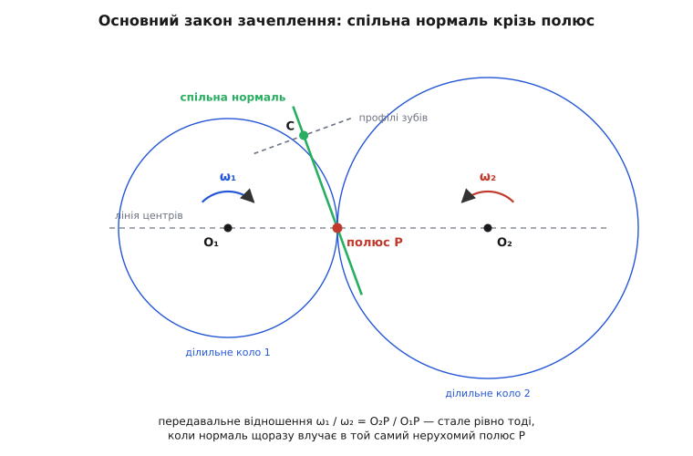
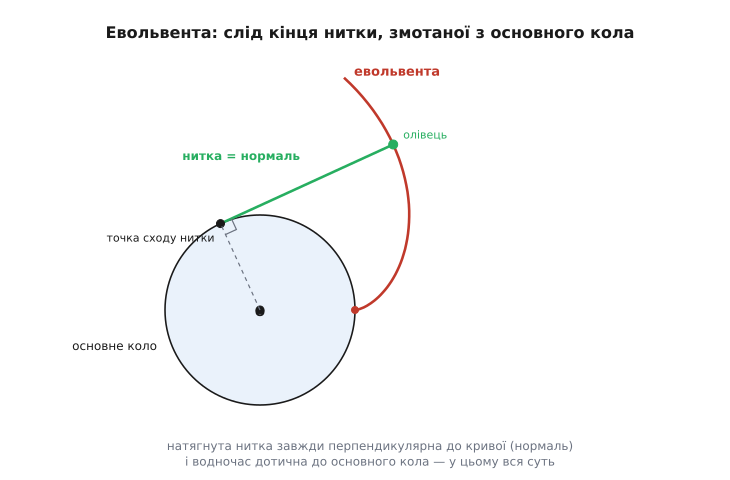
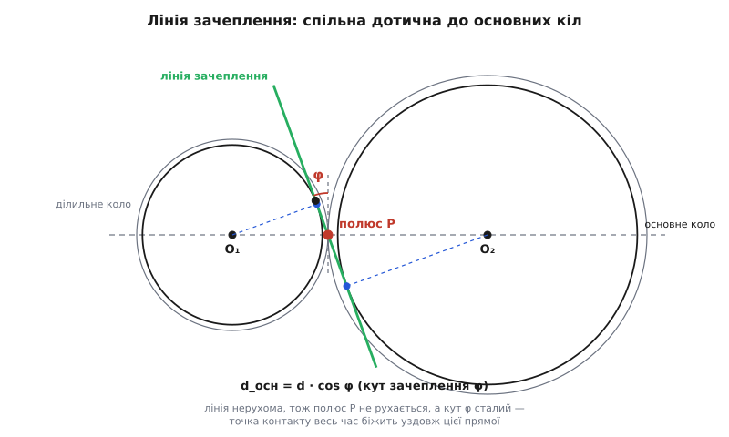
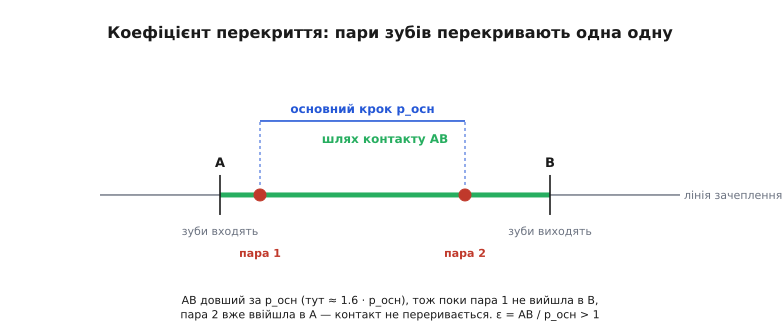

# Геометрія зуба та зачеплення: чому зуб має форму евольвенти

<preknowlist>
- [Кутова швидкість](book:physics/angular-velocity) — що таке ω і чому колова швидкість точки колеса дорівнює ω·r; звідси передавальне відношення двох з'єднаних коліс.
- [Момент сили](book:physics/torque) — як зусилля, прикладене на плечі, дає обертальний момент на валу; знадобиться, щоб зрозуміти, куди тисне зуб.
</preknowlist>

Треба передати обертання з одного вала на інший — і то так, щоб другий вал крутився рівно, без ривків. Найпростіша думка: притиснути два гладкі колеса одне до одного, і хай тертя тягне. Доки навантаження мале, це працює: колеса котяться без ковзання, і швидкості їхніх ободів у точці дотику однакові. Але дай момент більший — і колеса прослизають, передавальне відношення «пливе», енергія йде в нагрів. Щоб колеса не ковзали, на них нарізають зубці: тепер один штовхає другий не тертям, а впором, і прослизнути вони не можуть.

І тут з'являється підступна проблема, заради якої й існує вся ця наука. Коли зуб натискає на зуб, точка їхнього дотику не стоїть на місці — вона повзе по профілю, поки зуби прокочуються повз одне одного. А разом із точкою дотику змінюються плечі, під якими передається зусилля. Якщо профіль зуба вирізати абияк, то в межах **одного** зуба ведене колесо то забіжить уперед, то пригальмує — і так десятки разів на секунду. Це гул, вібрація, викришування. Отже, справжнє питання не «поставити зубці», а: **якої форми має бути зуб, щоб ведений вал крутився ідеально рівно — так, наче ті два гладкі колеса й досі котяться без ковзання?** Відповідь — цілком конкретна крива, і варто побачити, звідки вона береться.

### Головна вимога: незмінність передавального відношення

Спершу домовмося, чого саме ми хочемо, бо в цьому вся суть. Уявімо ті два гладкі колеса, що котяться без ковзання, — вони називаються **ділильними** (бо ділять міжосьову відстань у потрібній пропорції). Радіуси їхні r₁ і r₂. У точці дотику обід кожного колеса має колову швидкість ω·r, і, якщо ковзання немає, ці швидкості рівні:

```
ω₁ · r₁ = ω₂ · r₂   →   ω₁ / ω₂ = r₂ / r₁
```

Ось воно — передавальне відношення. Воно **стале**, поки сталі радіуси. Гладкі колеса дають ідеально рівне обертання самі собою, але прослизають під навантаженням. Зубці не ковзають, зате самі по собі рівного обертання **не гарантують** — його треба закласти у форму зуба. Тобто зуби мусять **удавати** те кочення ділильних кіл: миттєвий стан за миттєвим станом передавати рух так, ніби зубців немає, а котяться самі кола. Профіль, який це вміє, і сусідній до нього, з яким він працює, називають **спряженими** (бо вони погоджені один з одним, лат. *conjugare* — з'єднувати).

> 🔧 **Навіщо це.** Незмінність відношення — не академічна причепливість. У сервоприводі робота чи в поворотному столі верстата кут вихідного вала рахують, множачи кут двигуна на передавальне число. Якщо всередині оберту воно «дихає», кожен зуб вносить періодичну похибку положення й крутного моменту — так званий *transmission error*. У точній оптиці чи 3D-друку це видно неозброєним оком: хвилі на поверхні з кроком, що точно збігається з кроком зубів. Тому геометрію зуба вилизують саме заради сталості.

### Основний закон зачеплення: спільна нормаль крізь полюс

Як же перевірити, чи два профілі спряжені, не малюючи весь рух покадрово? Тут криється напрочуд простий і красивий закон. У кожну мить зуби торкаються в якійсь точці. Проведімо через цю точку **спільну нормаль** — пряму, перпендикулярну обом профілям одразу (уздовж неї один зуб і тисне на другий; збоку вони ковзають, а тиснуть строго по нормалі). Виявляється, усе передавальне відношення визначається тим, **де ця нормаль перетинає лінію центрів** — пряму, що з'єднує осі коліс.

Чому так? Швидкість точки контакту, розкладена на два колеса, мусить збігатися вздовж нормалі (інакше зуби або розійшлися б, або вгризлися один в одного). А проєкція швидкості на нормаль для кожного колеса — це ω, помножене на відстань від осі до нормалі. Прирівнявши їх, дістаємо, що відношення ω₁/ω₂ дорівнює відношенню відстаней від осей до точки, де нормаль ріже лінію центрів. Позначмо цю точку P. Тоді:

```
ω₁ / ω₂ = O₂P / O₁P
```

Звідси — **основний закон зачеплення** (його сформулював 1733 року французький математик Камю): щоб передавальне відношення було стале, спільна нормаль у точці контакту мусить **завжди проходити через одну й ту саму точку** P на лінії центрів. Ця точка — **полюс зачеплення**; саме в ньому дотикаються ділильні кола, і саме він ділить міжосьову відстань у відношенні r₂:r₁. Хай точка контакту гуляє по профілю як завгодно — доки нормаль щоразу влучає в той самий полюс, колеса крутяться так рівно, наче котяться гладкі диски.


*Два зуби торкаються в точці C. Спільна нормаль до профілів (уздовж неї передається тиск) перетинає лінію центрів у полюсі P. Передавальне відношення ω₁/ω₂ дорівнює O₂P/O₁P — тож воно стале рівно тоді, коли P нерухомий. У цьому вся умова спряженості.*

Тепер задача звузилася до геометричної: знайти таку криву, щоб її нормаль **сама собою** щоразу проходила через нерухомий полюс. Ліній, що це вміють, є кілька (годинникарі, наприклад, здавна брали циклоїду). Але одна з них має стільки практичних переваг, що витіснила решту з усієї машинної техніки.

### Евольвента: нитка, змотана з кола

Ця крива — **евольвента** кола (лат. *evolvere* — розгортати, змотувати). Означення її можна помацати руками. Візьміть котушку, намотайте на неї туго нитку, а до кінця нитки прив'яжіть олівець. Тепер тримайте нитку натягнутою й змотуйте її з котушки. Олівець накреслить криву — це і є евольвента того кола, з якого змотується нитка. Саме коло називають **основним**.

Уся магія — в одній властивості, і вона випливає прямо з побудови. У кожну мить натягнута частина нитки — це відрізок від точки, де нитка ще торкається кола, до олівця. Олівець рухається перпендикулярно до цього відрізка (він же обертається навколо миттєвої точки сходу нитки). Отже, **нитка — це нормаль до евольвенти**. А нитка щомиті **дотична до основного кола**. Складаємо два факти: нормаль до евольвенти в будь-якій точці — завжди дотична до основного кола.


*Кінець натягнутої нитки, що змотується з основного кола, креслить евольвенту. У будь-якому положенні натягнута нитка — це нормаль до кривої, і вона дотична до основного кола. Ця єдина властивість і робить евольвенту ідеальним профілем зуба.*

Тепер поставмо два колеса поруч і зробимо їхні зуби евольвентними, кожен — від свого основного кола. Де вони торкаються, спільна нормаль мусить бути дотичною до **обох** основних кіл одразу. А в двох кіл є лише одна спільна дотична, що йде «між» ними, — і вона **нерухома в просторі**, бо основні кола нерухомі. Ця пряма перетинає лінію центрів завжди в тій самій точці. Отже, полюс зачеплення сам собою лишається на місці — основний закон виконано **автоматично**, без жодного припасовування. Ту саму нерухому пряму, вздовж якої мандрує точка контакту, називають **лінією зачеплення**.

Хто хоче побачити, як із означення евольвенти строго виводяться її рівняння, доведення прямизни лінії зачеплення й формула основного кола, — [математику евольвенти розписано покроково окремо](book:physics/gear-tooth-geometry/math-involute.md).

### Три дарунки евольвенти

З того, що лінія зачеплення — нерухома пряма, дотична до обох основних кіл, випливають три подарунки, і кожен вирішив долю саме цього профілю.

**Перший — сталий кут зачеплення.** Лінія зачеплення нахилена до спільної дотичної ділильних кіл (тобто до перпендикуляра до лінії центрів) на певний кут — **кут зачеплення** φ (англ. *pressure angle* — «кут тиску», бо саме вздовж лінії зачеплення зуб тисне на зуб). Оскільки лінія нерухома, цей кут **не міняється** ні протягом зачеплення, ні від зуба до зуба. А значить, і напрям сили між зубами сталий — вал навантажений рівно, без пульсацій напряму тиску. Кут зачеплення пов'язує основне коло з ділильним простою формулою:

```
d_осн = d · cos φ
```

Стандартний кут — 20° (старіші передачі мали 14.5°, а для більшої міцності зуба беруть 25°: більший φ робить зуб біля основи товщим).

**Другий — байдужість до міжосьової відстані.** Ось що вразило інженерів XIX століття. Розсуньте колеса трохи далі одне від одного — через знос підшипників, неточність корпусу, теплове розширення. Ділильні кола при цьому «розпухнуть», полюс поповзе, кут зачеплення зросте. Але передавальне відношення визначається основними колами, а їх ми не чіпали, — тож воно **лишиться тим самим** N₂/N₁. Британський інженер Роберт Вілліс у середині XIX століття показав цю властивість прямо, і саме вона зробила евольвенту стандартом: реальний редуктор не треба збирати з мікронною точністю міжосьової відстані, щоб він ішов рівно.

> 🔧 **Навіщо це.** Ця «дарована» терпимість — причина, чому евольвентні редуктори взагалі можливі в масовому виробництві. Корпус із литого алюмінію гріється й розширюється, вали трохи гуляють у підшипниках — а передача все одно тримає точне відношення й не починає вити. Циклоїдний профіль такого не пробачає: зсунув осі — і рівне обертання зникло. Тому годинники, де відстань між осями фіксована ювелірно, ще тримаються циклоїди, а вся силова техніка — від коробки авто до редуктора дрона — перейшла на евольвенту.

**Третій — взаємозамінність і простий інструмент.** Форма евольвентного зуба не залежить від того, з яким колесом він працюватиме: будь-які два колеса з **однаковим модулем і кутом зачеплення** зчепляться правильно, скільки б зубів у кожного не було. Ба більше — якщо основне коло розкрутити до нескінченного радіуса, евольвента випрямляється в **пряму лінію**. Тобто зуб рейки (нескінченного колеса) має прямі, скошені боки. А різати прямобокий інструмент незрівнянно легше й точніше, ніж криволінійний, — тому евольвентні колеса нарізають простою рейкою-гребінкою, що «обкочується» по заготовці. Дешево, точно, взаємозамінно.


*Основні кола двох коліс і спільна дотична до них — лінія зачеплення. Вона перетинає лінію центрів у нерухомому полюсі P під кутом зачеплення φ до перпендикуляра. Точка контакту зубів весь час біжить уздовж цієї прямої (відрізок AB — активна ділянка). Основне коло менше за ділильне рівно в cos φ разів.*

### Модуль і кут зачеплення: паспорт сумісності

Щоб два колеса зчепилися, замало однакового наміру — потрібні однакові **розмір зуба** й **кут зачеплення**. Розмір зуба задають одним числом — **модулем** (лат. *modulus* — мірка). Модуль m — це частка ділильного діаметра на число зубів:

```
m = d / N        (міліметри)
```

По суті модуль — це «скільки міліметрів діаметра припадає на один зуб». Колесо з модулем 2 і 20 зубами має ділильний діаметр 40 мм; те саме число зубів при модулі 3 дало б 60 мм — зуби більші, колесо більше. Модуль стандартизований рядом чисел (1; 1.25; 1.5; 2; 2.5; 3 …), щоб колеса й ріжучий інструмент були сумісні між виробниками. **Два колеса входять у зачеплення лише за однакового модуля й однакового кута зачеплення** — це їхній паспорт сумісності; усе інше (число зубів) вільне.

**Геометричний паспорт пари коліс.** Модуль m = 2 мм, кут зачеплення φ = 20°, шестірня N₁ = 20 зубів, колесо N₂ = 40. Порахуймо ділильні діаметри, основні кола, міжосьову відстань і передавальне відношення.

:::tabs
```python
import math

m = 2.0          # модуль, мм
phi = math.radians(20)
N1, N2 = 20, 40  # числа зубів шестірні й колеса

d1 = m * N1                     # ділильний діаметр 1 = 2·20 = 40 мм
d2 = m * N2                     # ділильний діаметр 2 = 2·40 = 80 мм
db1 = d1 * math.cos(phi)        # основне коло 1 = 40·cos20° = 37.59 мм
db2 = d2 * math.cos(phi)        # основне коло 2 = 80·cos20° = 75.18 мм
center = (d1 + d2) / 2          # міжосьова відстань = (40+80)/2 = 60 мм
ratio = N2 / N1                 # передавальне число = 40/20 = 2.0

print(d1, d2, center, ratio)    # 40.0 80.0 60.0 2.0
```
```cpp
#include <cmath>
#include <cstdio>

int main() {
    double m = 2.0;                 // модуль, мм
    double phi = 20.0 * M_PI / 180; // кут зачеплення
    int N1 = 20, N2 = 40;           // числа зубів

    double d1 = m * N1;                 // 2·20 = 40 мм
    double d2 = m * N2;                 // 2·40 = 80 мм
    double db1 = d1 * std::cos(phi);    // 40·cos20° = 37.59 мм
    double db2 = d2 * std::cos(phi);    // 80·cos20° = 75.18 мм
    double center = (d1 + d2) / 2;      // (40+80)/2 = 60 мм
    double ratio = (double)N2 / N1;     // 40/20 = 2.0

    std::printf("%.1f %.1f %.1f %.1f\n", d1, d2, center, ratio);
    return 0;
}
```
:::

Отже, пара сидить на осях за 60 мм одна від одної й дає точне сповільнення вдвічі. Зверніть увагу: міжосьова відстань — це просто півсума ділильних діаметрів, а передавальне число — це відношення **чисел зубів**, найчистіша й найточніша величина в усій передачі (цілі числа не мають похибки). Саме тому там, де потрібна точність кута, рахують по зубах, а не по діаметрах.

### Коефіцієнт перекриття: щоб зачеплення не переривалося

Одна пара зубів не може вести передачу вічно — вона входить у зачеплення на початку лінії зачеплення й виходить на її кінці. Щоб рух не переривався ні на мить, **наступна пара мусить увійти в контакт раніше, ніж попередня вийде**. Інакше буде проміжок, коли не тримає жодна пара, — миттєве розвантаження, удар, стукіт.

Наскільки надійно пари перекривають одна одну, каже **коефіцієнт перекриття** ε — це середня кількість пар зубів у зачепленні. Рахують його як довжину активної ділянки лінії зачеплення (відрізок AB, де зуби реально торкаються) поділену на **основний крок** p_осн — відстань між сусідніми зубами, зміряну вздовж лінії зачеплення:

```
ε = довжина активної ділянки / p_осн ,   де   p_осн = π · m · cos φ
```

Фізичний зміст простий і суворий: **ε мусить бути більшим за 1**. Якщо ε = 1.6, то 60 % часу тримають дві пари, а 40 % — одна; передача жодної миті не лишається без опори. Якби ε впало нижче 1, з'явилися б «мертві» проміжки — саме звідти беруться стукіт і швидке викришування дешевих передач. Гарні прямозубі колеса мають ε близько 1.4–2.0.


*Точки контакту біжать по лінії зачеплення від A до B. Відстань між послідовними зубами вздовж цієї лінії — основний крок p_осн. Активна ділянка AB довша за один крок (тут ≈ 1.6), тож завжди тримає хоча б одна пара, а часом — дві. Відношення AB до p_осн і є коефіцієнт перекриття.*

**Перевірка перекриття для нашої пари.** Ті самі колеса (m = 2, φ = 20°, N₁ = 20, N₂ = 40) зі стандартною висотою зуба (висота головки дорівнює модулю). Порахуймо основний крок і коефіцієнт перекриття.

:::tabs
```python
import math

m, phi = 2.0, math.radians(20)
N1, N2 = 20, 40

# ділильні, основні кола й кола вершин (головка зуба заввишки m)
r1, r2 = m*N1/2, m*N2/2
rb1, rb2 = r1*math.cos(phi), r2*math.cos(phi)
ra1, ra2 = r1 + m, r2 + m               # радіуси кіл вершин
a = r1 + r2                             # міжосьова відстань

# довжина активної ділянки лінії зачеплення (перетини кіл вершин з лінією)
line = (math.sqrt(ra1**2 - rb1**2) + math.sqrt(ra2**2 - rb2**2)
        - a*math.sin(phi))
pb = math.pi * m * math.cos(phi)        # основний крок
eps = line / pb

print(round(pb, 3), round(eps, 3))      # 5.904  1.635
```
```cpp
#include <cmath>
#include <cstdio>

int main() {
    double m = 2.0, phi = 20.0*M_PI/180;
    int N1 = 20, N2 = 40;

    double r1 = m*N1/2, r2 = m*N2/2;
    double rb1 = r1*std::cos(phi), rb2 = r2*std::cos(phi);
    double ra1 = r1 + m, ra2 = r2 + m;          // кола вершин
    double a  = r1 + r2;                        // міжосьова відстань

    double line = std::sqrt(ra1*ra1 - rb1*rb1)
                + std::sqrt(ra2*ra2 - rb2*rb2)
                - a*std::sin(phi);
    double pb  = M_PI * m * std::cos(phi);      // основний крок
    double eps = line / pb;

    std::printf("%.3f %.3f\n", pb, eps);        // 5.904  1.635
    return 0;
}
```
:::

Виходить ε ≈ 1.64 — здорове значення: понад 60 % часу зачеплення тримають дві пари зубів, тож хід рівний і тихий. Формула довжини активної ділянки виглядає громіздко, але за нею проста геометрія: це відстань між двома точками, де кола вершин коліс перетинають нерухому лінію зачеплення, — саме там зуби входять і виходять із контакту.

### Коли зуб «врізається»: підріз і мала кількість зубів

Є межа, за якою евольвента ламається, і про неї варто знати. Евольвента існує лише **зовні** основного кола — всередину нитка не змотується, там кривої просто немає. Якщо в колеса замало зубів, його основне коло виходить велике відносно западин, і кінчик зуба-партнера намагається торкнутися западини **нижче** основного кола — там, де евольвенти вже нема. Правильного контакту в цій зоні не буває: зуби починають **врізатися** один в одного (інтерференція).

При нарізанні це виявляється інакше, але з тієї самої причини: рейка-гребінка, обкочуючись, зрізає частину зуба біля основи — **підрізає** його. Підрізаний зуб тонший у корені й слабший, а сама евольвента вкорочена. Для стандартного кута 20° межа настає приблизно на **17 зубах**: менше — і зуб уже підрізається. Обійти це можна двома шляхами: зсунути профіль інструмента (нарізати «коригованим» зубом) або взяти більший кут зачеплення — при 25° мінімум зубів падає, бо зуб стає товщим біля основи. [Історію того, як евольвента перемогла циклоїду й стала стандартом](book:physics/gear-tooth-geometry/hist-involute.md) — окрема цікава лінія, у якій зійшлися Ла Ір, Ойлер і Вілліс.

### Боковий зазор: трохи «повітря» між зубами

Наостанок — маленька, але неминуча деталь. Якщо нарізати зуби так, щоб вони заповнювали западину партнера впритул, передача заклинить: немає куди подітися мастилу, немає запасу на теплове розширення й на неточності. Тому зуб роблять трохи **тоншим** за западину — лишають **боковий зазор** (люфт; нім. *Luft* — повітря). Плата за це — втрачений хід при зміні напряму: перш ніж повести колесо назад, треба вибрати зазор. Для силової передачі це дрібниця, а от у точному позиціонуванні (верстат, телескоп) люфт — головний ворог, і його або мінімізують, або хитро вибирають підпружиненими «розрізними» колесами.

---

Отже, зуб має форму евольвенти не з примхи, а тому, що ця крива сама, за самою своєю побудовою, тримає спільну нормаль на нерухомому полюсі — а це і є умова ідеально рівного обертання. Розмотайте нитку з кола — і нормаль кривої завжди дотична до цього кола; поставте два таких колеса поруч — і їхня спільна нормаль стає нерухомою прямою, лінією зачеплення, що перетинає лінію центрів завжди в одній точці. Звідси все інше: сталий кут тиску, дивовижна терпимість до міжосьової відстані, взаємозамінність і простий прямобокий інструмент. Модуль і кут зачеплення — паспорт сумісності пари; коефіцієнт перекриття стежить, щоб зачеплення не переривалося; підріз ставить межу малим колесам; боковий зазор лишає передачі змогу дихати. Розуміючи ці кілька ідей, дивишся на будь-яке зубчасте колесо — від годинника до редуктора крана — і бачиш не просто зубці, а розгорнуту з кола криву, що змушує два вали крутитися як одне ціле.
