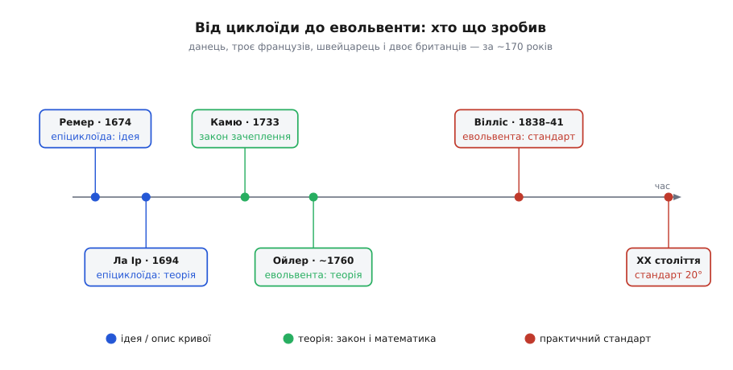

# 📜 Дві криві на одну задачу: як евольвента перемогла циклоїду

> Сьогодні майже кожне силове зубчасте колесо у світі — від коробки передач до редуктора крана — має зуб у формі евольвенти. Але перемогла ця крива не одразу й не сама: майже два століття їй наступала на п'яти інша, циклоїда, і в годинниках вона тримається дотепер. Історія цього суперництва повна плутанини — навіть у тому, хто, власне, придумав евольвенту. Розплутаймо.

До середини XVII століття форму зубів ніхто не рахував. Їх, як писали згодом перші дослідники, «полишали на примху майстрів»: тесля вирізав зуб на око, і як передача виходила — так і крутилася, з ривками, гулом і швидким зношенням. Саму думку, що зуб мусить мати **певну** форму, а не будь-яку, ще треба було поставити. А поставивши — відповісти: **яку саме**? Тут і почалася двовікова гонитва двох кривих.

Обидві родяться з простого руху. **Циклоїда** — слід точки обода колеса, що котиться (по прямій — проста циклоїда, по іншому колу ззовні — епіциклоїда, зсередини — гіпоциклоїда). **Евольвента** — слід кінця нитки, яку туго змотують з котушки. Різні жести, різні криві — і кожна, як з'ясувалося, вміє тримати передавальне відношення сталим. Питання було не «котра можлива», а «котра зручніша в житті». І відповідь мінялася залежно від того, у чиїх руках передача — годинникаря чи машинобудівника.


*Шлях від першої ідеї до стандарту розтягнувся на ~170 років і сім постатей. Кольори — три рівні внеску: синє — крива запропонована й описана; зелене — теорія (закон зачеплення, математика профілю); червоне — практичний стандарт. Зверніть увагу на розрив: евольвенту як теорію дав Ойлер близько 1760-го, а стандартом машинобудування вона стала аж за вісімдесят років — крива чекала на свою причину.*

## Спершу перемогла зовсім не евольвента

Перша крива, що виграла задачу, була з родини циклоїд. Данський астроном **Оле Ремер** (*Ole Rømer*, 1644–1710) — той самий, що виміряв швидкість світла, — близько 1674 року запропонував нарізати зуби по **епіциклоїді**, щоб коліщата годинникових механізмів ішли плавно. (Звістка про це дійшла переважно через листи Ляйбніца, тож дату варто тримати радше як переказ, ніж як документ із Ремерової руки.) Ще раніше подібне радив французький геометр **Жирар Дезарг** (*Girard Desargues*, 1591–1661).

Строгу математику під цю ідею підвів **Філіп де Ла Ір** (*Philippe de La Hire*, 1640–1718) — французький астроном і геометр, знавець рулет (кривих кочення). У трактаті **«Traité des épicycloïdes et leur usage en mécanique»** (1694) він показав, що саме епіциклоїда надає зубам «усієї можливої досконалості», і дав спосіб їх будувати. Це був злам: форму зуба вперше вивели з геометрії, а не з ока майстра.

І ось тут — головна пастка цієї історії. У безлічі технічних переказів написано: «Ла Ір 1694 року першим запропонував **евольвенту** як криву зуба». Це неточність, що кочується з джерела в джерело. Документований трактат Ла Іра — про **епіциклоїду**; евольвенти як профілю зуба там немає. Ла Ір, звісно, знав евольвенту (він-бо вивчав усі рулети) і, можливо, згадував її мимохідь, — але криву, яку він **рекомендував** для коліс, звали епіциклоїдою. Справжнього батька евольвентного зуба звали інакше, і жив він пізніше. Отже, статус цього твердження: **поширений хибний переказ**, якого первинне джерело не підтверджує.

Тим часом циклоїда зробила свою кар'єру миттєво — і пішла прямо туди, де їй було найзатишніше: у годинники.

## Камю: закон, що звузив пошук

Поки одні підбирали криву, інший поставив глибше питання: а **що взагалі** мусить робити добрий профіль? Відповів француз **Шарль-Етьєн-Луї Камю** (*Charles-Étienne-Louis Camus*, 1699–1768). У праці 1733 року — з промовистою назвою про те, як «зробити годинники досконалішими», — він сформулював умову, яку сьогодні звуть **основним законом зачеплення**: щоб передавальне відношення трималося сталим, спільна нормаль у точці дотику зубів мусить щоразу проходити через одну нерухому точку на лінії центрів — полюс. Іронія в тому, що правило, писане заради годинників, стало фундаментом усіх без винятку зубчастих передач.

Це був стрибок з іншого рівня. Досі криву **вгадували** й перевіряли; тепер з'явився **критерій**. Не «спробуймо епіциклоїду», а «будь-яка крива, чия нормаль тримає полюс на місці, — годиться». Пошук з мистецтва став наукою: замість перебирати форми, можна було питати, котрі з них задовольняють одну-єдину умову. (Строгий висновок Камю згодом уточнили — повну теорію кривини профілів дали пізніше Ойлер і Саварі, — але сама умова спільної нормалі крізь полюс лишилася за ним.)

І виявилося, що умові Камю відповідає не одна крива, а ціле сімейство. Зокрема — обидві суперниці: і циклоїда, і евольвента. Закон сказав, **що** треба; він не сказав, **котру** брати. Це вирішувала вже не геометрія, а зручність.

## Ойлер: крива, яку нарешті взяли всерйоз

Того, хто дав евольвенті її справжню математику, звали **Леонард Ойлер** (*Leonhard Euler*, 1707–1783) — швейцарець, народжений у Базелі, найплідніший математик свого віку. У двох працях — **«De aptissima figura rotarum dentibus tribuenda»** («Про найдоречнішу форму, яку слід надати зубам коліс», 1760) і доповненні **«Supplementum de figura dentium rotarum»** (написане 1765-го) — він показав, що евольвента задовольняє закон Камю з дивовижною економністю, і вивів співвідношення між радіусами кривини спряжених профілів. Це співвідношення сьогодні звуть **рівнянням Ойлера — Саварі**: французький астроном **Фелікс Саварі** (*Félix Savary*, 1797–1841) незалежно перевідкрив його майже через півстоліття й записав у сучасному вигляді.

Тут варто уточнити деталь, яку часто перекручують. Обидві Ойлерові праці про зуби вийшли в **записках Петербурзької академії наук** (він друкувався там усе життя), а самі роботи писав у берлінський період, служачи в Берлінській академії. Ойлер справді провів багато років під імперською опікою — і петербурзькою, і берлінською, — але за походженням, родом і мовою був **швейцарцем**, а не росіянином; писав латиною, німецькою й французькою. Приписувати евольвентний зуб «російській науці» — така сама аберація, як приписати Ла Ірові евольвенту.

Отже, розкладімо по рівнях. **Ідею** кривої для зуба (епіциклоїда) подали Ремер і Ла Ір. **Закон**, якому крива мусить коритися, дав Камю. **Теорію евольвентного зуба** — Ойлер. Здавалося б, справу зроблено: найкраща крива знайдена й обґрунтована. Але між теорією та цехом лягли ще майже вісімдесят років.

## Чому світ не квапився

Бо в реальних майстернях панувала циклоїда, і мала на те вагомі причини. Годинникар працює з **фіксованою** міжосьовою відстанню: вали сидять у камінних опорах, зроблених ювелірно й назавжди. За таких умов головна вада циклоїди — чутливість до розсування осей — просто не дошкуляє. Натомість циклоїдний зуб дозволяє те, чого евольвентний не любить: **дуже малі трибки** на шість-вісім зубів (аж до «ліхтарних» трибків із круглих штифтів), а це в годиннику на вагу золота. Плюс у майстрів були готові шаблони й таблиці для розмітки циклоїдних зубів — ціла традиція, відточена поколіннями.

Тому Ойлерова евольвента лишалася **кривою математиків**: бездоганна на папері, вона не давала цехові жодної причини ламати звичку. Щоб перемогти, їй бракувало не краси, а **практичного козиря** — переваги, яку відчуєш руками саме там, де циклоїда слабка: у великій, брудній, гарячій машині, а не в годиннику.

## Вілліс: доказ, який усе вирішив

Козир пред'явив англієць **Роберт Вілліс** (*Robert Willis*, 1800–1875), кембриджський професор механіки. 1837 року він прочитав доповідь **«On the Teeth of Wheels»** («Про зуби коліс»), наступного року видав її ширше, а 1841-го вклав у знамениту книгу **«Principles of Mechanism»**. Вілліс наголосив на властивості евольвенти, що для машинобудування виявилася вирішальною: **байдужості до міжосьової відстані**. Розсунь евольвентні колеса трохи далі — від зношених підшипників, теплового розширення, неточного корпусу — і передавальне відношення **не зміниться**, бо його визначають основні кола, яких зсув не торкається. Для литої, гарячої, недосконалої машини це був подарунок, якого циклоїда дати не могла.

Із цього Вілліс зробив практичні висновки, що й досі з нами. Він обстоював **взаємозамінні** набори коліс і зручний **кут зачеплення 14.5°**. Чому саме таке дивне число? Бо його синус майже точно дорівнює чверті:

```
sin 14.5° = 0.2504 ≈ 1/4
```

А коли синус кута — рівно ¼, уся розмітка зуба циркулем і лінійкою стає елементарною: у добу без калькуляторів це важило більше за будь-яку теорію. Вілліс навіть змайстрував прилад — **одонтограф** — щоб креслярі швидко розмічали правильні зуби для коліс будь-якого діаметра. Паралельно інший британець, **Джон Айзек Гокінс** (*John Isaac Hawkins*, 1772–1855), перекладаючи й коментуючи англійською Камюсів «Трактат про зуби коліс», у своїх примітках теж наполегливо радив евольвенту. На межі 1830–40-х ці два голоси злилися — і машинобудування нарешті почуло.

> 🔧 **Навіщо це.** Саме терпимість до відстані, а не теоретична витонченість, зробила евольвенту стандартом. Редуктор із литого корпусу гріється й «дихає», вали трохи гуляють — а передача все одно тримає точне відношення й не починає вити. Додайте, що евольвента нескінченного колеса випрямляється в **пряму лінію**, тож інструмент для її нарізання — прямобока рейка-гребінка, яку зробити легко й точно. Тверда практична вигода плюс дешевий інструмент — ось що перемагає в цеху, а не краса рівняння.

Далі стандарт лише дозрівав. Пізніше замість 14.5° основним став **20°**: більший кут робить зуб товщим біля основи, отже міцнішим і менш схильним до підрізання. Кут 14.5° тихо зійшов зі сцени вже у XX столітті (галузеві норми відмовилися від нього близько 1970-х), хоча колеса з ним досі трапляються. Але сама евольвента з часів Вілліса не зрушила: вона й лишилася кривою силової техніки.

## Де циклоїда лишилася господинею

Програвши машинобудування, циклоїда не загинула — вона просто втрималася на своїй споконвічній землі. У **годинникарстві**, де осі стоять непорушно, а трибки крихітні, циклоїдний зуб і донині доречніший за евольвентний; це класика механічного годинника. Епіциклоїдні профілі живуть і в деяких **насосах та роторних нагнітачах** (лопаті, що обкочуються), а окрема сучасна гілка — **циклоїдні редуктори** — узагалі будує передачу на коченні по циклоїді, здобуваючи компактність і малий люфт.

Тож «поразка» циклоїди насправді була **поділом територій**. Евольвента взяла все, де осі можуть зсунутися, а зуби мусять різатися дешево й взаємозамінно, — тобто майже всю силову техніку. Циклоїда лишила за собою точний, фіксований світ годинника. Дві криві на одну задачу знайшли кожна свій дім.

## Три рівні й жоден одинак

Озирнімося на цю смугу подій. Питання «якої форми зуб» ніхто не розв'язав сам-один — його розв'язали **рівнями**, і кожен рівень мав своїх людей. Хтось подав **ідею** кривої (Ремер, Дезарг, Ла Ір — і, зауважте, для циклоїди, а не евольвенти). Хтось дав **закон**, якому крива мусить коритися (Камю). Хтось збудував **теорію** евольвентного профілю (Ойлер, згодом Саварі). А хтось перетворив теорію на **стандарт цеху**, знайшовши практичний козир і зручні числа (Вілліс, Гокінс). Ідея, теорія і стандарт — це три різні здобутки, і плутати їх (як плутають, приписуючи Ла Ірові евольвенту) означає не розуміти, як узагалі народжується техніка.

І ще один урок, дорожчий за дати. Найкраща крива перемогла **не тоді, коли її вивели**, а тоді, коли знайшлася причина її взяти. Ойлерова евольвента вісімдесят років лежала бездоганно доведеною й нікому в цеху не потрібною — доки Вілліс не показав, що вона пробачає зсув осей. Техніка приймає ідею не за красу, а за вигоду в конкретній, недосконалій, гарячій машині. Данець, троє французів, швейцарець і двоє британців за сто сімдесят років — і аж тоді зуб набув тієї форми, яку ви сьогодні бачите в будь-якому редукторі.
