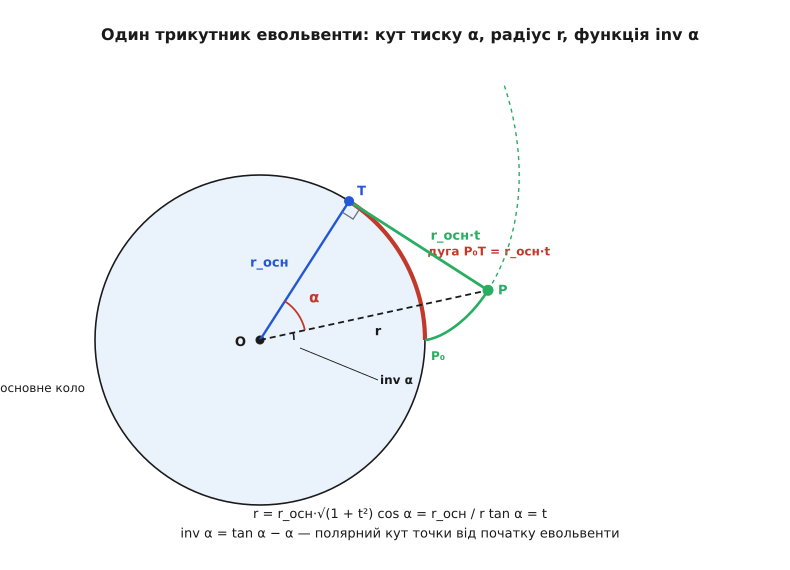
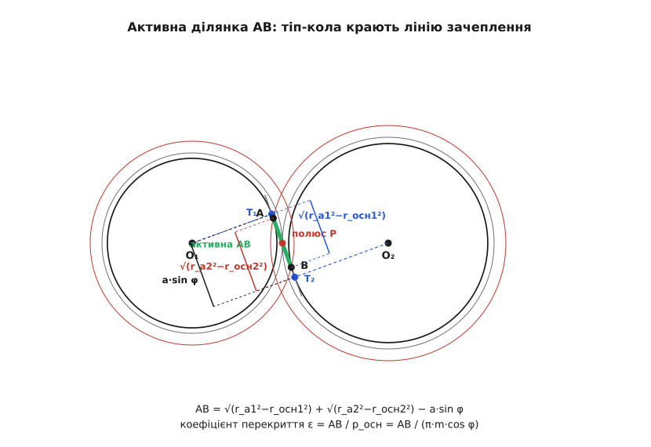
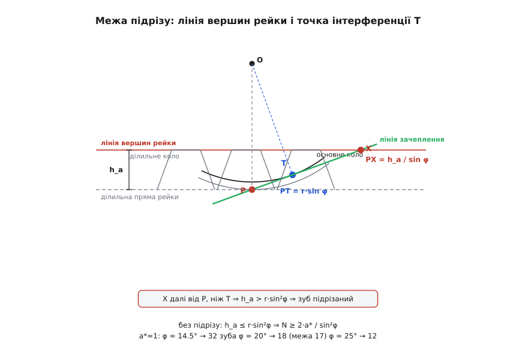

# 🧮 Математика евольвенти: рівняння нитки, доведення нормалі й межа підрізу

> 🧮 Математична вставка. Евольвенту зазвичай пояснюють на пальцях: змотай нитку з котушки, стеж за її кінцем — ось і крива. Образ правильний, але з нього самого не видно, звідки беруться формули, якими живе вся зубчаста техніка: рівняння профілю для верстата з ЧПК, зв'язок основного кола з ділильним d_осн = d·cos φ, довжина активної ділянки, межа в 17 зубів. Тут ми пройдемо весь шлях від означення до цих формул строго — з однією вимогою: кожен крок мусить бути видно, ЧОМУ він саме такий, а не «так у підручнику».

## Означення: рівняння змотаної нитки

Візьмімо коло радіуса r_осн (основне коло) з центром O. Намотаймо на нього нитку й почнімо змотувати, тримаючи натягнутою. Кінець нитки креслить евольвенту. Щоб дістати її рівняння, потрібен параметр — число, що каже, «наскільки далеко ми вже змотали». Найзручніший параметр — кут t, на який повернулася точка сходу нитки з кола, відрахований від початку.

Що ми знаємо в кожну мить t? Точка, де нитка ще торкається кола (точка сходу), сидить на колі під кутом t:

```
T = (r_осн·cos t,  r_осн·sin t)
```

А скільки нитки вже змоталося? Рівно стільки, скільки кола пройшла точка сходу, — тобто довжина дуги від старту до T. Дуга кола — це радіус на кут у радіанах, отже змотана нитка має довжину r_осн·t. Це перший наріжний факт, і він тримається на тому, що кут ми міряємо в радіанах: довжина розмотаного = r_осн·t **тотожно**, без жодних наближень.

Тепер лишилося додати цю нитку до точки сходу. Нитка натягнута, тож вона — прямий відрізок, який іде від T уздовж дотичної до кола (нитка щойно зійшла з кола, значить лежить на дотичній). Дотична до кола в точці T перпендикулярна до радіуса OT. Радіус указує в напрямі (cos t, sin t); перпендикуляр до нього — це (sin t, −cos t) (можна перевірити: (cos t, sin t)·(sin t, −cos t) = cos t·sin t − sin t·cos t = 0). Нитка тягнеться в бік, протилежний до розмотування, тож беремо саме (sin t, −cos t) і множимо на довжину r_осн·t:

```
P = T + (r_осн·t)·(sin t, −cos t)
```

Розписавши по координатах, дістаємо параметричні рівняння евольвенти:

```
x(t) = r_осн·(cos t + t·sin t)
y(t) = r_осн·(sin t − t·cos t)
```

Перевірмо їх на здоровий глузд. При t = 0 (нитка ще не змотана) виходить x = r_осн, y = 0 — точка (r_осн, 0) сидить прямо на колі, там, де кінець нитки й був. Правильно. А різниця P − T дорівнює (r_осн·t·sin t, −r_осн·t·cos t); її довжина — r_осн·t·√(sin²t + cos²t) = r_осн·t, точно довжина змотаної нитки. Рівняння узгоджені самі із собою. Це наша відправна точка — усе решта виводиться звідси.

## Чому нитка — це нормаль: не аналогія, а похідна

Головна властивість евольвенти — що натягнута нитка є нормаллю до кривої — звучить очевидно на рівні образу («олівець обертається навколо точки сходу»). Але образ може й обманути, тож перевірмо це рахунком: знайдімо справжній напрям дотичної до кривої й подивімося, чи він і справді перпендикулярний до нитки.

Напрям дотичної до кривої дає похідна: коли параметр змінюється, [похідна параметричних рівнянь по t](book:math/derivative) — це вектор швидкості, з яким точка біжить уздовж кривої, а він завжди спрямований по дотичній. Продиференціюймо:

```
x′(t) = r_осн·(−sin t + sin t + t·cos t) = r_осн·t·cos t
y′(t) = r_осн·( cos t − cos t + t·sin t) = r_осн·t·sin t
```

Дивовижно чистий результат: вектор дотичної до евольвенти — це (r_осн·t·cos t, r_осн·t·sin t), тобто r_осн·t·(cos t, sin t). Але ж (cos t, sin t) — це напрям **радіуса** OT! Отже, дотична до евольвенти в точці P паралельна радіусу основного кола, проведеному в точку сходу нитки. А нитка (напрям (sin t, −cos t)) цьому радіусу перпендикулярна. Значить, нитка перпендикулярна до дотичної евольвенти — тобто нитка і є нормаль.

Щоб не лишалося сумніву, перевірмо перпендикулярність прямо — [скалярним добутком](book:math/dot-product) вектора дотичної та вектора нитки (нульовий добуток означає прямий кут):

```
(cos t, sin t) · (sin t, −cos t) = cos t·sin t − sin t·cos t = 0   ✓
```

Отже доведено без жодних «очевидно»: нормаль до евольвенти в будь-якій точці лежить уздовж нитки, а нитка дотична до основного кола. Уся теорія евольвентного зачеплення виростає саме з цього одного рядка.

**Побічний, але цінний дарунок — радіус кривини.** Оскільки в кожну мить точка креслить дугу навколо миттєвого центру (точки сходу нитки T), то радіус кривини евольвенти в точці P дорівнює довжині натягнутої нитки:

```
ρ = r_осн·t
```

Це не гола аналогія — те саме дає й формула кривини через похідні. Підставивши x′, y′ і других похідних x″ = r_осн·(cos t − t·sin t), y″ = r_осн·(sin t + t·cos t), у чисельнику x′y″ − y′x″ усе скорочується до r_осн²·t², у знаменнику (x′² + y′²)^(3/2) виходить (r_осн²·t²)^(3/2) = r_осн³·t³, і кривина κ = 1/(r_осн·t), тобто ρ = r_осн·t. Практичний зміст прямий: біля самого основного кола (t → 0) радіус кривини прямує до нуля — профіль там гострий і крихкий; що далі від основного кола, то нитка довша, то профіль плавніший. Саме ця гострота біля кореня зуба ще нагадає про себе, коли дійдемо до підрізу.

## Кут тиску, радіус і функція евольвенти

Тепер побудуймо прямокутний трикутник, у якому сходиться вся геометрія профілю: вершини — центр O, точка сходу нитки T і точка евольвенти P. Прямий кут — при T (нитка ⟂ радіус). Катети — OT = r_осн (радіус основного кола) і TP = r_осн·t (нитка); гіпотенуза — OP = r (відстань точки профілю від осі, тобто радіус, на якому вона зараз сидить).


*Уся геометрія евольвенти в одному трикутнику. Катет OT — радіус основного кола r_осн, катет TP — розмотана нитка r_осн·t (вона ж дорівнює дузі P₀T), гіпотенуза OP — поточний радіус r. Кут при вершині O — це кут тиску α: tan α = TP/OT = t, cos α = OT/OP = r_осн/r. А полярний кут точки від початку евольвенти дорівнює t − α = inv α.*

З трикутника одразу читаються три співвідношення. По-перше, гіпотенуза за Піфагором:

```
r = r_осн·√(1 + t²)
```

По-друге, кут при вершині O — назвімо його α — це **кут тиску** в цій точці профілю (кут між радіусом до точки й нормаллю-ниткою). Його тангенс — відношення протилежного катета до прилеглого:

```
tan α = TP / OT = (r_осн·t) / r_осн = t
```

Параметр t, який ми ввели як кут розмотки, виявився просто тангенсом кута тиску. А косинус того самого кута — відношення прилеглого катета до гіпотенузи:

```
cos α = OT / OP = r_осн / r
```

Ось воно — точне правило, що зв'язує основне коло з будь-яким радіусом: на радіусі r кут тиску профілю α задається через cos α = r_осн/r. Кут тиску **не сталий уздовж профілю**: біля основного кола (r → r_осн) він нульовий, а що далі назовні, то більший. Це важлива тонкість — «кут зачеплення 20°», який пишуть у паспорті передачі, стосується не всього зуба, а лише того радіуса, де колеса реально котяться, — ділильного кола.

Лишилося знайти третю величину — на скільки точка профілю «відстала» по куту від початку евольвенти. Полярний кут точки сходу T дорівнює t (ми так і вводили параметр). Полярний кут самої точки P менший рівно на кут α (це кут при вершині O між напрямами OP і OT). Отже полярний кут P від старту:

```
inv α = t − α = tan α − α
```

Ця функція — **функція евольвенти** (позначають inv α або ev α). Вона каже: якщо стати на радіусі, де кут тиску дорівнює α, то профіль там повернутий від свого початку на кут tan α − α. Саме її 1760 року поклав в основу теорії зубчастого зачеплення Леонард Ойлер (1707–1783), і донині нею рахують товщини зубів. Значення її дрібні й нелінійні: inv 20° = tan 20° − 0.349 = 0.0149 рад ≈ 0.85°, а inv 25° уже 0.030 рад ≈ 1.72° — удвічі більше за якихось 5° прирісту кута.

> 🔧 **Навіщо це.** inv α — не абстракція, а робоче число металіста. Товщину зуба на будь-якому діаметрі d рахують через неї: s = d·(s₀/d₀ + inv α₀ − inv α), де індекс 0 — відомий (ділильний) діаметр. Через inv α перераховують товщину зуба з ділильного кола на будь-яке інше, підбирають розмір під контроль «по роликах» чи «по хорді», задають зсув профілю. Тому в будь-якому довіднику зубчастих коліс перша ж таблиця — це таблиця inv α: без неї не порахувати жодного реального колеса.

**Головна прикладна формула — основне коло.** Візьмімо той радіус, де колеса котяться, — ділильний, r = d/2, і назвімо тамтешній кут тиску номінальним кутом зачеплення φ. Підставивши α = φ у cos α = r_осн/r, дістаємо r_осн = r·cos φ, тобто в діаметрах:

```
d_осн = d · cos φ
```

Основне коло менше за ділильне рівно в cos φ разів. Це та сама формула, якою задають профіль на практиці, — і тепер вона не постулат, а один рядок із трикутника.

## Дві евольвенти: чому лінія зачеплення пряма

Тепер поставмо поряд два колеса з нерухомими осями, кожне з евольвентним профілем від свого основного кола (радіуси r_осн1 і r_осн2). У точці, де зуби торкаються, вони мають спільну нормаль — пряму, вздовж якої один зуб тисне на другий. Ми щойно довели: нормаль до евольвенти дотична до її основного кола. Отже спільна нормаль двох профілів мусить бути дотичною **одразу до обох** основних кіл.

А скільки є прямих, дотичних до двох заданих кіл і проведених «між» ними? Рівно одна (внутрішня спільна дотична). Основні кола нерухомі — тож ця пряма нерухома в просторі. Хай точка контакту повзе по профілях як завгодно; спільна нормаль щоразу мусить бути тією самою єдиною прямою. Звідси все: точка контакту весь час лежить на цій нерухомій прямій — **лінія зачеплення пряма**; її нахил не міняється — **кут зачеплення сталий**; вона перетинає лінію центрів завжди в одній точці — **полюс нерухомий**, а отже передавальне відношення стале. Основний закон зачеплення виконується сам собою, без жодного припасування, — і ми бачимо це не як твердження, а як наслідок однієї властивості нормалі.

Зафіксуймо ще одну довжину, вона знадобиться далі. Лінія зачеплення дотикається основних кіл у точках T₁ і T₂. Полюс P лежить на ній між ними. У прямокутному трикутнику O₁T₁P катет O₁T₁ = r_осн1 = r₁·cos φ, гіпотенуза O₁P = r₁, тож PT₁ = √(r₁² − r_осн1²) = r₁·sin φ. Так само PT₂ = r₂·sin φ. Точки T₁ і T₂ по різні боки від полюса, тому вся відстань між ними — сума:

```
T₁T₂ = (r₁ + r₂)·sin φ = a·sin φ
```

де a = r₁ + r₂ — міжосьова відстань. Запам'ятаймо: увесь відрізок між точками дотику лінії зачеплення з основними колами має довжину a·sin φ.

## Основний крок і чому перекриття міряють уздовж лінії зачеплення

Щоб порахувати, чи не переривається зачеплення, треба знати відстань між сусідніми зубами — але зміряну **вздовж лінії зачеплення**, а не по колу. Ця відстань зветься основним кроком p_осн. Знайти її легко: усі западини й виступи зуба однакові, тож сусідні зуби відрізняються поворотом колеса на 1/N оберту. На основному колі це дуга завдовжки (повне коло)/N:

```
p_осн = π·d_осн / N = π·(d·cos φ) / N = (π·d/N)·cos φ = π·m·cos φ
```

бо d/N = m (модуль). Виходить, основний крок — це круговий крок π·m, помножений на cos φ.

Але чому цю величину, зміряну по основному колу, можна прикладати вздовж лінії зачеплення? Бо всі евольвенти одного основного кола — «паралельні» криві: відстань між сусідніми профілями, зміряна по спільній нормалі, всюди однакова й дорівнює дузі основного кола між їхніми початками. Причина проста — кожен профіль відстоїть від основного кола рівно на довжину своєї нитки, а нитки в обох сусідніх профілів у спільній точці дотику лежать на одній прямій (спільній дотичній). Тому відстань «нормальний крок» = «основний крок»: те, що зміряли по основному колу, лягає незмінним уздовж лінії зачеплення. Саме тому лінія зачеплення — природна лінійка передачі: на ній основний крок відкладається однаковими мітками.

## Довжина активної ділянки й коефіцієнт перекриття

Зуби торкаються не вздовж усієї нескінченної лінії зачеплення, а лише на її відрізку — активній ділянці AB, де реально є профілі обох коліс. Межі ставлять кола вершин (тіп-кола): пара входить у контакт, коли кінчик зуба веденого колеса дістає лінію зачеплення, і виходить, коли з неї сходить кінчик ведучого.

Знайдімо, де саме коло вершин радіуса r_a крає лінію зачеплення. Лінія дотична до основного кола в T, тож точка лінії на відстані ℓ від T віддалена від осі на √(r_осн² + ℓ²) (той самий прямокутний трикутник). Прирівнявши це до r_a, дістаємо ℓ = √(r_a² − r_осн²). Отже коло вершин першого колеса перетинає лінію на відстані √(r_a1² − r_осн1²) від T₁, а другого — на відстані √(r_a2² − r_осн2²) від T₂. Активна ділянка — це те, що лишається, коли з двох таких «досягів» вилучити повний проміжок T₁T₂ = a·sin φ між точками дотику:

```
AB = √(r_a1² − r_осн1²) + √(r_a2² − r_осн2²) − a·sin φ
```


*Лінія зачеплення дотична до основних кіл у T₁ і T₂. Коло вершин колеса 1 крає її в точці B на відстані √(r_a1²−r_осн1²) від T₁; коло вершин колеса 2 — у точці A на відстані √(r_a2²−r_осн2²) від T₂. Активна ділянка AB — це перекриття двох досягів мінус повний відрізок T₁T₂ = a·sin φ. Поза A і B профілів уже нема, зуби не торкаються.*

Коефіцієнт перекриття ε — це скільки основних кроків вкладається в активну ділянку, тобто скільки пар зубів у середньому тримають передачу одночасно:

```
ε = AB / p_осн = AB / (π·m·cos φ)
```

Фізична вимога сувора: ε > 1. Якби активна ділянка була коротша за основний крок, знайшлася б мить, коли попередня пара вже зійшла, а наступна ще не ввійшла, — розрив контакту, удар, стукіт.

**Коефіцієнт перекриття пари коліс.** Модуль m = 2 мм, кут зачеплення φ = 20°, шестірня N₁ = 20 зубів, колесо N₂ = 40, головка зуба заввишки в модуль (r_a = r + m). Порахуймо все по кроках.

```
r₁ = m·N₁/2 = 20 мм        r₂ = m·N₂/2 = 40 мм
r_осн1 = r₁·cos20° = 18.794 мм    r_осн2 = 37.588 мм
r_a1  = r₁ + m = 22 мм       r_a2  = r₂ + m = 42 мм
a = r₁ + r₂ = 60 мм

√(r_a1² − r_осн1²) = √(484 − 353.2)  = 11.436 мм   (T₁B)
√(r_a2² − r_осн2²) = √(1764 − 1412.8) = 18.739 мм   (AT₂)
a·sin20° = 60·0.342 = 20.521 мм                    (T₁T₂)

AB = 11.436 + 18.739 − 20.521 = 9.655 мм
p_осн = π·2·cos20° = 5.904 мм
ε = 9.655 / 5.904 = 1.635
```

Виходить ε ≈ 1.64 — здорове значення: понад 60 % часу тримають дві пари зубів, решту — одна, і жодної миті передача не лишається без опори. Уся громіздкість формули AB — це насправді проста геометрія: різниця двох досягів по кінчиках зубів і проміжку між точками дотику.

## Межа малим колесам: підріз і формула N = 2/sin²φ

Тепер про межу, за якою евольвента ламається. Крива існує лише **зовні** основного кола: при t ≥ 0 радіус r = r_осн·√(1+t²) не буває меншим за r_осн. Усередину основного кола нитка не змотується — там профілю просто немає. І це не дрібниця, а причина, чому не можна нарізати колесо з якою завгодно малою кількістю зубів.

Подивімося, як колесо нарізають рейкою-гребінкою, що обкочується по заготовці (найпоширеніший спосіб, бо прямобокий інструмент простий і точний). Небезпечна точка — **точка інтерференції** T, там, де лінія зачеплення дотикається основного кола. Нижче за T евольвенти немає. Якщо лінія вершин рейки (найвища точка її зуба) перетинає лінію зачеплення **далі** за T (рахуючи від полюса), то інструмент лізе в зону, де мав би бути профіль, але його там нема, — і зрізає, підрізає корінь зуба. Підрізаний зуб тонший біля основи, слабший, а робочу евольвенту вкорочено.


*Точка інтерференції T — дотик лінії зачеплення до основного кола, на відстані PT = r·sin φ від полюса. Лінія вершин рейки (на висоті головки h_a над ділильною прямою) перетинає лінію зачеплення в точці X на відстані PX = h_a/sin φ від полюса. Поки X не заходить за T, профіль чистий; щойно h_a/sin φ > r·sin φ, інструмент підрізає корінь зуба.*

Зведімо це в нерівність. Точка інтерференції віддалена від полюса на PT = r·sin φ (щойно вивели). Лінія вершин рейки йде паралельно ділильній прямій на висоті головки h_a; вона перетинає лінію зачеплення на відстані PX = h_a/sin φ від полюса (бо лінія зачеплення нахилена до ділильної прямої під кутом φ, і підйом на h_a вимагає пройти h_a/sin φ уздовж похилої лінії). Умова «інструмент не заходить за точку інтерференції»:

```
h_a / sin φ  ≤  r · sin φ        ⇒        h_a  ≤  r · sin²φ
```

Підставмо стандартну головку h_a = a*·m (де a* — коефіцієнт висоти головки, для повного профілю a* = 1) і ділильний радіус r = m·N/2:

```
a*·m  ≤  (m·N/2)·sin²φ     ⇒     N  ≥  2·a* / sin²φ
```

Модуль скоротився — межа залежить лише від кута зачеплення й висоти головки, не від розміру колеса. Для стандартного повного профілю (a* = 1):

```
N_min = 2 / sin²φ
```

Порахуймо для типових кутів:

```
φ = 14.5° :  N_min = 2/sin²14.5° = 31.9  →  32 зуби
φ = 20°   :  N_min = 2/sin²20°   = 17.1  →  межа 17 (18 надійно)
φ = 25°   :  N_min = 2/sin²25°   = 11.2  →  12 зубів
```

Ось звідки славнозвісні «17 зубів» для кута 20°: це просто 2/sin²20°, округлене вниз. І одразу видно, чому більший кут зачеплення рятує від підрізу: sin²φ у знаменнику росте, N_min падає — при 25° уже й дванадцятизубе колесо чисте. Причина фізична: більший φ робить основне коло меншим (d_осн = d·cos φ), точка інтерференції відсувається від кореня, і рейці є де розвернутися. Коли ж 17 зубів усе-таки замало, підріз обходять зсувом профілю інструмента (нарізають «коригованим» зубом, відводячи рейку від центру на кілька десятих модуля) — тоді лінія вершин уже не дістає за точку інтерференції.

## Де ця математика працює

Кожна формула звідси — не окраса, а робочий інструмент. Параметричні рівняння x(t), y(t) заганяють у верстат із ЧПК і в дротяну електроерозію, щоб вирізати профіль, а потім у координатно-вимірювальну машину, щоб перевірити готовий зуб проти ідеальної кривої. Функція inv α = tan α − α перетворює абстрактний профіль на товщину зуба на будь-якому діаметрі й на розмір під контроль по роликах — без неї не спроєктувати жодного реального колеса. Формула d_осн = d·cos φ і основний крок p_осн = π·m·cos φ задають саму сітку зачеплення двох коліс. Відношення AB/p_осн = ε стереже, щоб контакт не переривався. А N ≥ 2/sin²φ ставить нижню межу на розмір шестірні — і пояснює, чому дрібні швидкісні шестірні або мають більший кут зачеплення, або йдуть із коригованим профілем.

Отже, уся техніка евольвентного зубця виводиться з одного означення — сліду кінця змотуваної нитки — двома-трьома рядками похідних і одним прямокутним трикутником. Продиференціювавши рівняння нитки, ми довели, що її нормаль дотична до основного кола; з трикутника O–T–P прочитали кут тиску, радіус і функцію евольвенти; з єдиності спільної дотичної двох кіл дістали пряму лінію зачеплення й сталий кут; а з того, що евольвенти немає всередині основного кола, — межу на кількість зубів. Це рідкісний випадок, коли складна на вигляд інженерна деталь тримається на математиці, яку видно наскрізь.
