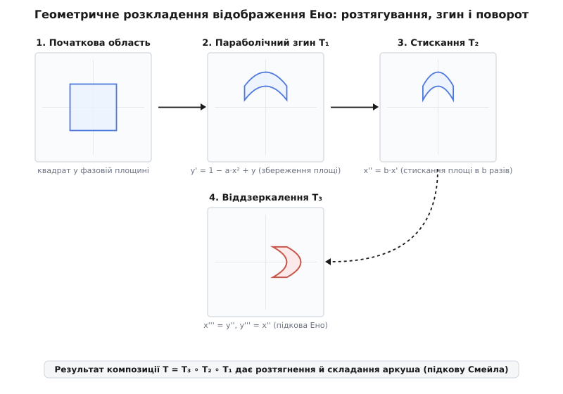
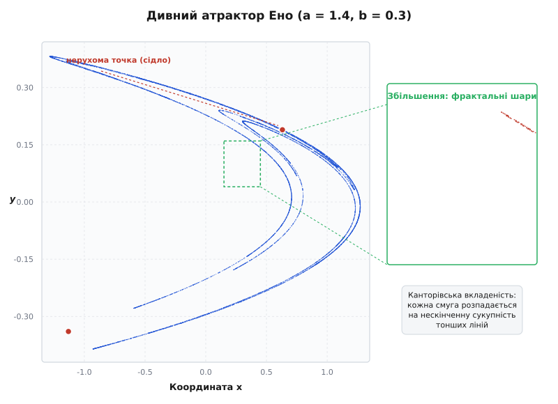
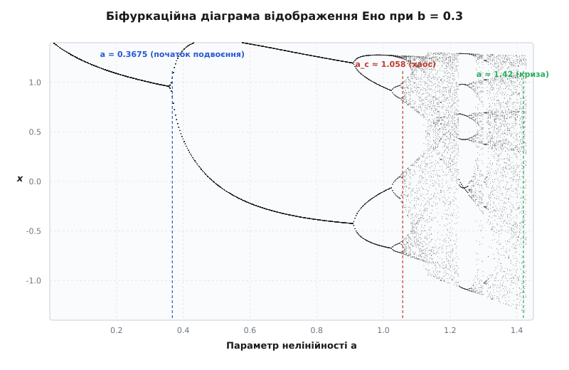

# Відображення Ено

<preknowlist>
- [Детермінований хаос](book:physics/deterministic-chaos) — чутливість динамічної системи до початкових умов та геометричний механізм розтягування й складання фазового аркуша.
- [Матриця Якобі](book:math/jacobian-matrix) — матриця частинних похідних першого порядку, яка визначає локальну деформацію та стискання фазового об'єму.
</preknowlist>

Чисельне моделювання конвективних потоків рідини за нелінійними рівняннями Лоренца вимагає мільйонів кроків інтегрування неперервної системи трьох диференціальних рівнянь, де чисельні похибки заокруглення алгоритмів типу Рунге–Кутти неминуче змащують тонкі фрактальні деталі фазового простору. Спроба розрахувати форму дивного атрактора неперервного руху на комп'ютерах 1970-х років спиралася на жорсткий бар'єр: обчислювальний час зростав катастрофічно, а чисельна дифузія накопичених похибок розмивала нескінченно тонку шарувату структуру траєкторій.

У 1976 році французький астроном і математик Мішель Ено довів, що для дослідження складної геометрії детермінованого хаосу зовсім не обов'язково інтегрувати важкі диференціальні рівняння. Достатньо розрізати тривимірний неперервний потік площиною перетину Пуанкаре та замінити диференціювання в часі дискретним двовимірним відображенням `(x[n], y[n]) ↦ (x[n+1], y[n+1])`. Сформульоване ним однорядкове квадратичне рівняння — **відображення Ено** (англ. *Hénon map*) — вимагає лише кількох арифметичних операцій на один крок, але у чистому вигляді демонструє весь геометричний механізм стискання, розтягування та складки фазового аркуша, з якого народжується нелінійний хаос.

## 1. Від тривимірних потоків до двовимірних дискретних відображень

У класичній механіці стан автономної динамічної системи задається точкою у фазовому просторі, а її еволюція описується системою звичайних диференціальних рівнянь `d x / d t = f(x)`. Для хаотичних дисипативних систем, таких як модель конвекції Лоренца чи вимушені коливання маятника, розв'язки осідають на дивний атрактор — складну фрактальну множину у фазовому просторі. Проте безпосередній чисельний аналіз диференціальних рівнянь зіштовхується з двома серйозними перешкодами.

По-перше, неперервні траєкторії вимагають вибору дрібного кроку інтегрування `Δt`. При наявності хаосу похибки чисельного методу ростуть експоненційно, через що обчислювальна машина швидко втрачає точність траєкторії. По-друге, неперервний потік у тривимірному просторі ховає за складним вигинанням ліній головний топологічний механізм хаосу.

Анрі Пуанкаре запропонував геніальне спрощення: замість стеження за суцільною лінією `x(t)` у тривимірному просторі слід поставити на шляху руху секучу площину `Σ` і фіксувати лише точки `x[0], x[1], x[2], ...`, у яких траєкторія пробиває цю площину в одному напрямку. Такий підхід перетворює неперервний тривимірний потік на дискретне двовимірне відображення:

```
x[n+1] = T(x[n])
```

де `x[n]` належить двовимірній площині `Σ`. Оскільки час стає дискретним (кроки `n = 0, 1, 2, ...`), зникає потреба інтегрувати диференціальні рівняння між уколами площини. Якщо відображення `T` підібране так, що воно зберігає якісні властивості початкового потоку (стискання об'єму та нелінійне згинання), дискретна система точно відтворює фрактальну структуру атрактора.

Саме цим шляхом пішов Мішель Ено. Працюючи в обсерваторії Ніцци над зоряною динамікою, він шукав найпростішу алгебраїчну формулу для двовимірного відображення, яка б обчислювалася за мікросекунди, але генерувала справжній дивний атрактор, аналогічний атрактору Лоренца.

## 2. Рівняння та три геометричні кроки Ено

Дискретне відображення Ено задається системою двох різницевих рівнянь відносно координат `x` та `y` у фазовій площині:

```
x[n+1] = 1 - a·x[n]² + y[n]
y[n+1] = b·x[n]
```

тут `a` та `b` — сталі дійсні параметри системи. Канонічні значення, запропоновані Ено у його класичній праці 1976 року, становлять `a = 1.4` та `b = 0.3`. Параметр `a` керує силою нелінійності (квадратичного згину), а параметр `b` визначає рівень дисипативності (стискання площі).


*Три послідовні геометричні трансформації фазового квадрата: 1) параболічний зсув T₁ згинає квадрат у параболу зі збереженням площі; 2) стискання T₂ звужує смугу по горизонталі у b разів; 3) поворот T₃ повертає фігуру вздовж діагоналі y = x, формуючи підкову Смейла.*

Геніальність рівнянь Ено полягає у тому, що їх можна подати як композицію трьох елементарних геометричних перетворень `T = T₃ ∘ T₂ ∘ T₁`, кожне з яких виконує чітку й зрозумілу роль у вимішуванні фазового простору:

1. **Параболічний згин `T₁`:** `(x, y) ↦ (x, 1 - a·x² + y)`. Фігура зсувається по вертикалі на квадратичну величину `1 - a·x²`. Це перетворює звичайний вихідний квадрат у вигнуту параболічну дугу. При цьому площа кожного елемента зберігається ізохорно, оскільки визначник Якобіана цього кроку дорівнює 1.
2. **Горизонтальне стискання `T₂`:** `(x, y) ↦ (b·x, y)`. Вигнута смуга рівномірно стискається по горизонталі у `b` разів. Саме цей крок забезпечує дисипативність системи: площа фігури зменшується у `b` разів (при класичному `b = 0.3` площа тане на 70 % за кожну ітерацію).
3. **Поворот та віддзеркалення `T₃`:** `(x, y) ↦ (y, x)`. Осі координат міняються місцями відносно головної діагоналі `y = x`. Це завертає витягнуту й стиснуту параболу назад у вихідну область фазової площини, готуючи її до наступного кроку.

Послідовна дія цих трьох операцій виконує розтягування вздовж одного напрямку, стискання уздовж іншого та складання навпіл. Докладніше про [історію створення відображення Ено](book:physics/mechanics/henon-map/hist-henon-attractor.md) можна прочитати у відповідній історичній вставці.

## 3. Підкова Смейла, топологічне вимішування та символічна динаміка

Дія трьох геометричних кроків Ено є фізичним втіленням так званої **підкови Смейла** — фундаментальної топологічної конструкції, сформульованої Стівеном Смейлом у 1960-х роках. Якщо взяти квадратний клаптик фазової площини, витягнути його у довгу тонку смужку, зігнути у формі U-подібної підкови та накласти назад на вихідну область, то перетин початкового квадрата та його образу складатиметься з двох горизонтальних і двох вертикальних смуг.

Повторюючи цей процес нескінченно, ми отримуємо геометричне вимішування. Будь-які дві точки, що на початку лежали поруч у фазовому квадраті, з кожним кроком розсуваються вздовж напрямку розтягування, а потім загинаються у різні шари підкови. 

Це створює точний зв'язок між геометрією відображення Ено та **символічною динамікою**. Якщо позначити ліву гілку зігнутої підкови символом `0`, а праву гілку символом `1`, то кожній траєкторії точки на атракторові можна однозначно зіставити нескінченну двосторонню двійкову послідовність `...s[-2] s[-1] s[0] . s[1] s[2] ...`.

Один крок відображення Ено у фазовому просторі строго відповідає операції зсуву Бернуллі (англ. *shift map*) на один біт у цій послідовності:

```
σ( ... s[-1] s[0] . s[1] s[2] ... ) = ... s[-0] s[1] . s[2] s[3] ...
```

Зсув двійкової стрічки миттєво пояснює хаотичну чутливість: висуваючись на один біт ліворуч, крок відображення піднімає наступний раніше прихований біт початкового стану у старший розряд. Оскільки ми знаємо початковий стан із скінченною точністю (наприклад, перші 30 бітів), через 30 кроків усі відомі біти вичерпуються, і подальша поведінка орбіти визначається невідомими молодшими бітами. Топологічна ентропія такого відображення дорівнює `h = ln 2`, що підтверджує наявність максимального хаотичного вимішування.

## 4. Дисипативність, Якобіан та доведення дифеоморфізму

Для аналізу еволюції об'ємів фазового простору обчислимо матрицю частинних похідних першого порядку (матрицю Якобі) відображення Ено:

```
J = [ [ ∂x[n+1]/∂x[n],  ∂x[n+1]/∂y[n] ],
      [ ∂y[n+1]/∂x[n],  ∂y[n+1]/∂y[n] ] ]
  = [ [ -2·a·x[n],      1 ],
      [  b,             0 ] ]
```

Визначник цієї матриці (Якобіан) обчислюється розкладом за другим рядком:

```
det J = (-2·a·x[n])·0 - 1·b
      = -b                                      [стале значення для будь-якої точки]
```

Це дивовижний і дуже зручний факт: визначник Якобіана сталий у всій фазовій площині і зовсім не залежить від поточних координат `x` та `y`. Оскільки `|det J| = |b| = 0.3 < 1`, будь-яка двовимірна площа `S` у фазовому просторі після одного кроку відображення стискається строго у `b` разів:

```
Area(n+1) = |b| · Area(n) = 0.3 · Area(n)
```

Через `N` кроків початковий об'єм зменшиться у `|b|^N` разів. При `N → ∞` площа будь-якої початкової фігури прямує до нуля, тож увесь фазовий потік притягується до геометричної множини нульової двовимірної міри — дивного атрактора. Від'ємний знак визначника `det J = -0.3` означає, що крім стискання площа міняє свою орієнтацію на протилежну (дзеркальний поворот) під час кожного кроку.

На відміну від незворотного одновимірного логістичного відображення `x[n+1] = r·x·(1-x)`, де квадратична функція має вершину і не дозволяє однозначно повернутися назад, відображення Ено при `b ≠ 0` є **обратним** (дифеоморфізмом). Якщо відомий майбутній стан `(x[n+1], y[n+1])`, попередній стан `(x[n], y[n])` відновлюється однозначно:

```
y[n+1] = b·x[n]
⇒ x[n] = y[n+1] / b

x[n+1] = 1 - a·x[n]² + y[n]
⇒ y[n] = x[n+1] - 1 + a·x[n]²
⇒ y[n] = x[n+1] - 1 + a·(y[n+1] / b)²
```

Отже, обернене відображення `T⁻¹` має вигляд:

```
x[n] = y[n+1] / b
y[n] = x[n+1] - 1 + (a / b²) · y[n+1]²
```

Оскільки пряме відображення `T` і обернене `T⁻¹` є нескінченно диференційовними гладкими функціями, відображення Ено є **дифеоморфізмом** площини `ℝ²`. Це гарантує, що дискретні фазові траєкторії не можуть самоперетинатися чи розриватися. Повний алгебраїчний розрахунок та доведення характеристик подано в [математичному аналізі властивостей відображення](book:physics/mechanics/henon-map/math-henon-properties.md).

## 5. Аналіз нерухомих точок, сідлові маніфолди та гомоклініка

Нерухомі точки `(x*, y*)` відображення не змінюються з часом: `x[n+1] = x*`, `y[n+1] = y*`. Система рівнянь має вигляд:

```
x* = 1 - a·x*² + y*
y* = b·x*
```

Підставивши `y* = b·x*` у перше рівняння, отримуємо квадратне рівняння відносно `x*`:

```
a·x*² + (1 - b)·x* - 1 = 0
```

Його дискримінант `D = (1 - b)² + 4·a` завжди додатний для `a > 0`, що дає дві дійсні нерухомі точки:

```
x*₁,₂ = ( -(1 - b) ± √((1 - b)² + 4·a) ) / (2·a)
```

Для канонічних параметрів `a = 1.4` та `b = 0.3` обчислення дають:
- Первинна нерухома точка: `x*₁ ≈ 0.631354`, `y*₁ ≈ 0.189406`.
- Вторинна нерухома точка: `x*₂ ≈ -1.131354`, `y*₂ ≈ -0.339406`.

Характеристичне рівняння для власних значень `λ` лінеаризованої матриці Якобі у нерухомій точці задається формулою:

```
det (J - λ·I) = λ² + 2·a·x*·λ - b = 0
```

Для первинної точки корені дорівнюють `λ₁ ≈ -1.5776` та `λ₂ ≈ -0.1901`. Оскільки `|λ₁| > 1`, а `|λ₂| < 1`, ця точка є **сідловою (сідлом)**. Одне власне значення витягує траєкторії геть від точки вздовж нестійкого напрямку, а друге стискає їх до точки вздовж стійкого напрямку.

Сукупність точок, які при ітераціях уперед прямують до сідла, утворює його **стійкий маніфолд** `W^s`, а сукупність точок, які прямують до сідла при ітераціях назад, утворює **нестійкий маніфолд** `W^u`. У нелінійній системі Ено ці два маніфолди перетинаються трансверсально. Точки їхнього перетину називаються **гомоклінічними точками**. Наявність хоча б однієї гомоклінічної точки за теоремою Пуанкаре–Біркгофа означає існування нескінченного гомоклінічного клубка — складного мережива перетинів, яке породжує нескінченну кількість періодичних та неперіодичних хаотичних орбіт. Саме нестійкий маніфолд головного сідла формує скелет, на який осідає весь дивний атрактор.

## 6. Доведення Бенедікса–Карлесона та математична строгість

Попри очевидні комп'ютерні візуалізації 1976 року, математична спільнота тривалий час піддавала сумніву існування справжнього дивного атрактора Ено. Справа у тому, що при обчисленнях на комп'ютері хаотична на вигляд траєкторія може виявитися лише надзвичайно довгою періодичною орбітою з великим періодом, або квазіперіодичним рухом. До того ж, у біфуркаційній діаграмі Ено хаотичні режими щільно перешаровуються так званими вікнами періодичності.

Лише у 1991 році шведські математики Михаель Бенедікс та Леннарт Карлесон опублікували фундаментальну статтю в *Annals of Mathematics*, навівши строге доведення існування дивного атрактора Ено. Вони довели, що для достатньо малих `b > 0` існує множина параметрів `a` додатної міри Лебега, для яких:

1. Система має стійку траєкторію з додатним старшим показником Ляпунова `λ₁ > 0`.
2. Вздовж цієї траєкторії виконується умова розширення похідної (умова Колі–Якобсона).
3. Атрактор не розпадається на стійкі періодичні цикли і володіє ергодичною мірою Сіная–Рюеля–Боуена (SRB-мірою).

Це доведення стало триумфом математичної фізики. За розробку нових методів аналізу динамічних систем та доведення атрактора Ено Леннарт Карлесон у 2006 році був удостоєний премії Абеля — найвищої світової нагороди у галузі математики.

## 7. Фрактальна структура та показники Ляпунова

Якщо випустити систему з довільного початкового стану неподалік від центру фазової площини та відкинути перші 500 кроків перехідного процесу (транзієнту), точка починає нескінченно мандрувати складним геометричним згортком.


*Фазовий portrait відображення Ено при a = 1.4, b = 0.3. Ліворуч — головний атрактор у формі зігнутого віяла дуг; червона точка показує сідлову нерухому точку. Праворуч — збільшений фрагмент прямокутника: окремі лінії розпадаються на нескінченну вкладену канторівську сукупність тонких шарів.*

Головний атрактор складається з кількох дугоподібних вигнутих смуг. Проте найдивніше відбувається при послідовному масштабуванні:
1. Якщо взяти невеликий прямокутник у фазовій площині й збільшити його вдесятеро, виявиться, що здавалося б суцільна лінія насправді складається з кількох паралельних тонких шарів.
2. Збільшивши будь-який із цих шарів ще у сто разів, ми знову побачимо, що він розпадається на сімейство ще тонших ліній.
3. Цей процес масштабування можна продовжувати нескінченно: у будь-якому поперечному розрізі атрактор має структуру **множини Кантора** — класичного фрактального об'єкта, утвореного нескінченним вилученням середніх частин відрізків.

Швидкість хаотичного розходження сусідніх траєкторій вимірюють **показниками Ляпунова**. Для відображення Ено при класичних параметрах чисельне моделювання дає:
- Старший показник Ляпунова: `λ₁ ≈ +0.419` (строго додатний, що є головним математичним критерієм детермінованого хаосу).
- Молодший показник Ляпунова: `λ₂ ≈ -1.624` (від'ємний, що відповідає за швидке стискання фазового об'єму).

Сума показників Ляпунова строго дорівнює логарифму модуля Якобіана: `λ₁ + λ₂ = ln|b| = ln(0.3) ≈ -1.204`. За гіпотезою Каплана–Йорка розраховують дробову **фрактальну розмірність** (розмірність за інформацією) атрактора:

```
D_KY = 1 + λ₁ / |λ₂|
     ≈ 1 + 0.4191 / 1.6240
     ≈ 1.258
```

Значення `D_KY ≈ 1.26` показує, що атрактор Ено є дробовим фрактальним об'єктом, розміщеним між звичайною одновимірною лінією (розмірність 1) та суцільною двовимірною площиною (розмірність 2). Практичний алгоритм кодування для [чисельного моделювання відображення Ено та обчислення показників Ляпунова](book:physics/mechanics/henon-map/proj-henon-sim.md) наведено у розрахунковому розділі.

## 8. Біфуркаційна діаграма та маршрут до хаосу

Поведінка відображення Ено кардинально змінюється при зміні параметра нелінійності `a` (при фіксованому `b = 0.3`). Сканування динаміки від `a = 0` до `a = 1.45` демонструє класичний маршрут виникнення хаосу через каскад подвоєння періоду Фейгенбаума.


*Залежність стаціонарних координат x від параметра a при b = 0.3. До a = 0.3675 існує одна стійка нерухома точка; при a = 0.3675 відбувається перша біфуркація подвоєння періоду; при a_c ≈ 1.058 настає детермінований хаос із вікнами періодичності; при a ≈ 1.42 відбувається криза межі, і орбіта втікає у нескінченність.*

Динаміка системи проходить такі стадії:
1. **Область стійкого фокуса (`0 < a < 0.3675`):** Траєкторія з будь-якого початкового стану у межах басейну притягання осідає у єдину стійку нерухому точку `x*₁`.
2. **Перша біфуркація подвоєння періоду (`a = 0.3675`):** Нерухома точка втрачає стійкість (одне з власних значень перетинає значення -1), і з неї народжується стійкий цикл періоду 2 (фазовий стан послідовно стрибає між двома значеннями).
3. **Каскад Фейгенбаума (`0.3675 < a < 1.058`):** Послідовно відбуваються біфуркації подвоєння періоду: `T = 2 ↦ 4 ↦ 8 ↦ 16 ↦ …`. Відношення інтервалів між сусідніми біфуркаціями прямує до універсальної сталої Фейгенбаума `δ ≈ 4.6692`.
4. **Хаотичний режим (`a_c ≈ 1.058`):** Система перетинає критичну точку накопичення біфуркацій, і періодичний рух змінюється детермінованим хаосом. У цій області присутні «вікна періодичності» (наприклад, стійкий цикл періоду 3 поблизу `a ≈ 1.226`).
5. **Криза атрактора (`a ≈ 1.42`):** При `a > 1.42` відбувається криза межі (англ. *boundary crisis*): дивний атрактор доторкається до нестійкого маніфолду вторинної нерухомої точки `x*₂`. Внаслідок цього атрактор миттєво руйнується, і орбіта після короткого блукання втікає у нескінченність (`x[n] → -∞`).

## 9. Порівняння відображення Ено з іншими хаотичними системами

Щоб чітко зрозуміти місце відображення Ено у нелінійній фізиці, порівняємо його з двома класичними еталонами: одновимірним логістичним відображенням та стандартним консервативним відображенням Чирикова.

Одновимірне логістичне відображення `x[n+1] = r·x[n]·(1 - x[n])` описується лише однією змінною. Воно моделює дисипативне розтягування та складання, але повністю позбавлене стискання фазового об'єму (оскільки фазовий простір одновимірний, а Якобіан є звичайною похідною, яка змінює знак). Через це логістичне відображення є **незворотним**: за значенням `x[n+1]` квадратне рівняння дає два однаково можливі попередники `x[n]`. Відображення Ено додає другу змінну `y[n] = b·x[n]`, зберігаючи нелінійний згин, але роблячи систему строго обратною та дифеоморфною.

З іншого боку, консервативне відображення Чирикова (англ. *Chirikov standard map*) описує рух гамільтонової системи без тертя:

```
p[n+1] = p[n] + K · sin(x[n])
x[n+1] = x[n] + p[n+1]
```

Тут Якобіан дорівнює строго `det J = +1`, що відповідно до теореми Ліувілля зберігає фазову площу без найменшого стискання. У відображенні Чирикова немає атрактора: траєкторії не осідають на фрактальні множини, а блукають хаотичними морями між островочками стійкості. Відображення Ено з параметром `|b| < 1` є містком між цими двома світами: воно зберігає обратність консервативної механіки, але володіє дисипативним стисканням площами, створюючи фрактальний дивний атрактор.

## 10. Відновлення фазового простору за часовими рядами та теорема Такенса

У реальних фізичних та інженерних експериментах дослідник найчастіше не має доступу до всіх внутрішніх змінних системи `(x, y)`. Наприклад, сенсор вимірює лише один скалярний часовий ряд — напругу в електронній схемі чи швидкість рідини в одній точці `x[0], x[1], x[2], ...`.

З'являється фундаментальне питання: чи можливо за єдиною виміряною змінною `x[n]` повністю відновити геометрію та фрактальну розмірність двовимірного атрактора Ено?

Відповідь дає **теорема Такенса про затримку координат** (англ. *Takens' embedding theorem*), сформульована Флорісом Такенсом у 1981 році. Вона стверджує, що для реконструкції фазового простору достатньо побудувати вектора із затримкою у часі:

```
v[n] = ( x[n],  x[n - τ] )
```

де `τ` — часовий крок затримки (для дискретного відображення Ено зручно обрати `τ = 1`).

Подивимося на рівняння відображення Ено під цим кутом. Оскільки вторинне рівняння має вигляд `y[n] = b·x[n-1]`, координата `y[n]` є прямо пропорційною попередньому значенню змінної `x` на кроці `n-1`! 

Отже, простір затримок `(x[n], x[n-1])` є лінійно масштабованим дзеркальним відображенням справжнього фазового простору `(x[n], y[n])`. Взявши лише один виміряний ряд чисел `x[n]`, фізики будують двовимірний графік `x[n]` проти `x[n-1]` і отримують абсолютно точну геометрію атрактора Ено з тією самою фрактальною розмірністю `D_KY ≈ 1.26` та тими самими показниками Ляпунова.

## 11. Керування хаосом: метод Отта–Ґребоджі–Йорке (OGY)

Детермінований хаос тривалий час вважався небажаним руйнівним ефектом, якого слід уникати при проектуванні механізмів та електронних схем. Проте у 1990 році Едвард Отт, Селсо Ґребоджі та Джеймс Йорке (Edward Ott, Celso Grebogi, James Yorke) запропонували метод **OGY**, який перетворив чутливість хаосу на перевагу.

Ідея керування хаосом спирається на той факт, що всередині дивного атрактора Ено щільно вкраплена нескінченна множина нестійких періодичних орбіт (англ. *unstable periodic orbits, UPO*). Оскільки сідлові точки витягують траєкторію уздовж нестійкого маніфолду `W^u` та притягують її уздовж стійкого `W^s`, хаотична орбіта час від часу природно наближається дуже близько до нерухомої точки `(x*₁, y*₁)`.

Метод OGY пропонує у момент наближення здійснювати мікроскопічні коригуючі імпульси параметром `a`:

```
a[n] = a₀ + Δa[n]
```

Величина збурення `Δa[n]` обчислюється так, щоб зсунути нестійкий маніфолд і проектувати поточний стан системи строго на стійкий маніфолд `W^s`. В результаті система сама повертається до нерухомої точки без витрат великої енергії. Це дозволяє гнучко переключати режим роботи хаотичного відображення між різними періодичними орбітами за допомогою мікроскопічних сигналів керування.

## 12. Нелінійна дифузія та спектральний аналіз хаотичного сигналу

При обчисленні спектральної щільності потужності часового ряду відображення Ено `x[n]` за допомогою перетворення Фур'є зринає фундаментальна відмінність між періодичним та хаотичним рухом. Якщо для періодичної траєкторії спектр складається з декількох дискретних піків на основних частотах та їхніх гармоніках, то для хаотичного режиму відображення Ено спектр є **суцільним і неперервним** (широкосмуговим) по всьому діапазону частот.

Автокореляційна функція `R(k) = <x[n] · x[n+k]>` хаотичного сигналу Ено демонструє надзвичайно швидке (експоненційне) затухання зі збільшенням часового зсуву `k`:

```
R(k) ≈ R(0) · e^(-γ · k)
```

Це означає, що значення системи через 20–30 кроків стають повністю статистично незалежними від початкового стану, що робить часові ряди Ено математично еквівалентними зафарбованому шуму з високою ентропією. Саме ця неперервність спектра та згасання автокореляції роблять відображення Ено привабливим для побудови хаотичних маскувальних систем у радіозв'язку та широкосмугових генераторах псевдовипадкових чисел.

> 🔧 **Навіщо це.** Відображення Ено слугує поверховим стандартом для випробування алгоритмів оцінки показників Ляпунова, криптографічного шифрування зображень та швидких генераторів псевдовипадкових чисел. Через наявність єдиного квадратичного члена воно обчислюється у десяток разів швидше за будь-які диференціальні рівняння, надаючи математично строгу модель замішування фазового аркуша. Для практичної розробки софту створено спеціальний [довідник інтерфейсу бібліотеки відображення Ено](book:physics/mechanics/henon-map/api-henon-lib.md).

## 13. Підсумок

Відображення Ено є найпростішою двовимірною дискретною системою, яка демонструє повну фрактальну складність та чутливість до початкових умов дисипативного хаосу. Поєднуючи зсув, стискання та поворот, воно розгортає геометричну підкову Смейла у чистому вигляді, показуючи, що для народження нескінченно вкладених канторівських структур потрібна лише одна квадратична нелінійність та стискання фазової площини.
