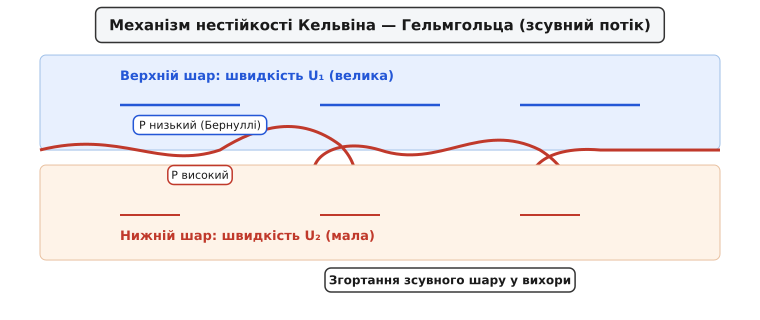
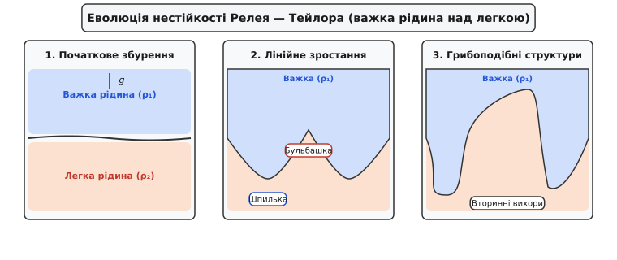
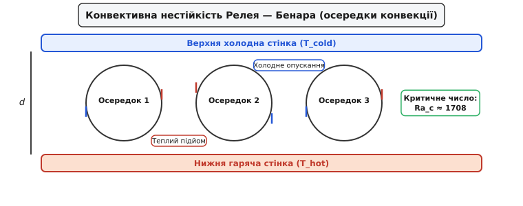
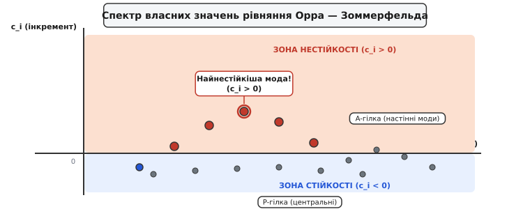

# Гідродинамічна нестійкість

<preknowlist>
- [`book:physics/mechanics/reynolds-number`](book:physics/mechanics/reynolds-number)
- [`book:physics/mechanics/navier-stokes`](book:physics/mechanics/navier-stokes)
- [`book:physics/mechanics/viscosity`](book:physics/mechanics/viscosity)
</preknowlist>

> 🔧 **Навіщо це.**
> Розуміння гідродинамічної нестійкості дає ключ до пояснення того, как гладка, впорядкована ламінарна течія рідини чи газу перетворюється на хаотичний турбулентний потік. Це явище є визначальним у конструюванні надзвукових літаків, проектуванні термоядерних реакторів інерційного синтезу, розрахунку турбін електростанцій та прогнозуванні глобальних атмосферних циклонів і океанських течій. Без знання механізмів нестійкості неможливо ні запобігти аварійному відриву потоку з крила, ні забезпечити ефективне перемішування палива в двигунах.

## 1. Фізична природа гідродинамічної нестійкості та баланс енергії збурень

Будь-який гідродинамічний потік у реальному світі піддається постійній дії зовнішніх збурень: акустичним шумам, вібраціям стінок, температурним флуктуаціям або шорсткості поверхні. Питання про те, чи залишиться течія ламінарною, чи розпадеться на вихори, визначається здатністю самої гідродинамічної системи підсилювати або гасити ці малі збурення.

Якщо початкове мале збурення з часом експоненційно затухає, початковий стан течії називається **стійким**. Якщо ж амплітуда збурення починає безперервно зростати, відбираючи кінетичну чи потенціальну енергію у основного потоку, початковий стан є **нестійким**. Зростання збурень руйнує вихідну симетрію течії й приводить систему до нового нелінійного стану — вихрових структур або повномасштабної турбулентності.

Гідродинамічна нестійкість є наслідком фундаментального суперництва двох протилежних фізичних механізмів:
1. **Дестабілізуючі інерційні сили:** Конвективний перенос імпульсу прагне підсилити локальні викривлення поля швидкості або густини. В ідеальній рідині без в'язкості ці сили призводять до необмеженого росту вихрових пертурбацій.
2. **Стабілізуючі дисипативні сили:** Молекулярна в'язкість `ν` та теплопровідність `χ` згладжують просторові градієнти швидкості й температури, перетворюючи кінетичну енергію збурень на теплоту.

### 1.1 Рівняння балансу кінетичної енергії збурень
Математично цей баланс описується рівнянням еволюції інтегральної кінетичної енергії збурень `E_k = 1/2 · ∬ (u'² + v'²) dx dy` у 2D потоці:

```
dE_k / dt = P_production - D_dissipation   [БАЛАНС КІНЕТИЧНОЇ ЕНЕРГІЇ]
```

де складові рівняння мають суворий фізичний зміст:

```
P_production = - ∬ u' · v' · (dU / dy) dx dy   [ГЕНЕРАЦІЯ ЕНЕРГІЇ РЕЙНОЛЬДСОВИМИ НАПРУЖЕННЯМИ]
D_dissipation = ν · ∬ ( (∂u'/∂y - ∂v'/∂x)² ) dx dy   [В'ЯЗКА ДИСИПАЦІЯ ЕНЕРГІЇ]
```

Генерація енергії `P_production` описує роботу рейтових напружень Рейнольдса `τ_R = -u'v'` проти зсуву швидкості основного потоку `dU/dy`. Для того щоб потік був нестійким (`dE_k/dt > 0`), вихідні пульсації подовжньої `u'` та поперечної `v'` швидкостей повинні бути зсунуті за фазою так, щоб добуток `u' · v'` мав у середньому протилежний знак до градієнта `dU/dy`. У такому разі збурення насочують кінетичну енергію з основи потоку швидше, ніж її розсіює в'язка дисипація `D_dissipation`.

Співвідношення між генерацією та дисипацією характеризується безрозмірними числами гідродинаміки, найважливішим з яких є **число Рейнольдса** `Re = U · L / ν`. При малих числах Рейнольдса сильні в'язкі сили `D_dissipation` домінують, гарантуючи ламінарну стійкість. Однак при перевищенні критичного значення `Re_crit` генерація енергії перевищує дисипацію, і потік втрачає стійкість.

Детальний перебіг наукових відкриттів у галузі теорії стійкості від робіт Гельмгольца та Кельвіна до сучасних немодальних теорій висвітлено в [історичному екскурсі](book:physics/mechanics/hydrodynamic-instability/hist-instability-discoveries.md).

## 2. Класифікація та фізичні механізми основних типів нестійкостей

У гідродинаміці виділяють кілька фундаментальних типів нестійкостей залежно від фізичного джерела енергії, що живить зростаючі збурення.

### 2.1 Зсувна нестійкість Кельвіна — Гельмгольца

Зсувна нестійкість Кельвіна — Гельмгольца виникає на межі розподілу двох шарів рідини, які рухаються з різними паралельними швидкостями `U₁` та `U₂`, або всередині одного потоку з неперервним просторовим зсувом швидкості `U(y)`.


*Зсувна шар двох течій різної швидкості: первинна синусоїдальна хвиля під дією перепаду тиску Бернуллі згортається у періодичні вихрові кокони.*

Фізичний механізм виникнення нестійкості Кельвіна — Гельмгольца полягає у дії **закону Бернуллі**. Уявімо невелике синусоїдальне викривлення межі розділу між двома течіями. Над гребенем хвилі прохідний переріз для верхнього потоку звужується, що за законом збереження маси змушує рідину рухатися швидше. За законом Бернуллі підвищення швидкості призводить до локального падіння статичного тиску. З нижнього боку гребеня швидкість нижнього потоку навпаки зменшується, а тиск зростає. 

Виникає результуюча сила тиску, спрямована вгору, яка ще більше виштовхує гребінь хвилі. На западині хвилі відбувається зворотний процес — тиск зверху зростає, вдавлюючи межу розділу вниз. В результаті амплітуда хвилі починає експоненційно зростати, а крила зсуву згортаються у характерні скручені вихрові кокони, відомі як "котячі очі Кельвіна".

Приклади нестійкості Кельвіна — Гельмгольца в природі вражають масштабами:
- **Хмари у формі хвиль:** Утворення ланцюжків завитих хмар у тропосфері, коли верхній шар повітря рухається швидше за нижній.
- **Вітрові хвилі на воді:** Зародження морських хвиль під дією вітру, що дме над спокійною поверхнею океану.
- **Астрофізичні струмені:** Згортання меж плазмових джетів, що вилітають із ядер активних галактик та молодих зірок у міжзоряне середовище.

### 2.2 Гравітаційна нестійкість Релея — Тейлора

Нестійкість Релея — Тейлора розвивається на межі розподілу двох рідин різної густини в полі зовнішнього прискорення (наприклад, сили тяжіння `g`), коли важка рідина з густиною `ρ₂` розміщена над легшою рідиною з густиною `ρ₁`.


*Послідовні фази нестійкості Релея — Тейлора: від малої синусоїди до глибоких шпильок важкої рідини та грибоподібних вихрових капелюшків.*

Фізична причина нестійкості полягає у прагненні системи зменшити свою **потенціальну енергію**. Стан, коли важка рідина знаходиться зверху, є механічно нестійкою рівновагою. Найменше збурення межі розділу змушує важку рідину занурюватися вниз у вигляді вузьких "шпильок" (spikes), а легку рідину — підніматися вгору у формі округлих "бульбашок" (bubbles). 

Під час занурення шпильок на їхніх бічних поверхнях виникає вторинна зсувна нестійкість Кельвіна — Гельмгольца через перепад швидкостей між занурюваною краплею та навколишнім середовищем. Це призводить до згортання країв шпильок у впізнавані "грибоподібні" капелюшки.

Проблема нестійкості Релея — Тейлора є критичною в сучасних високотехнологічних галузях:
- **Інерційний термоядерний синтез (ICF):** При сферичному стисканні мікромішені з дейтерієм та тритієм потужними лазерами важка оболонка мішені межує з гарячою плазмою низької густини. Нестійкість Релея — Тейлора розриває оболонку до досягнення запалювання, що є головним бар'єром на шляху до керованого синтезу.
- **Вибухи наднових зірок:** Під час колапсу ядра наднової (наприклад, SN 1987A) важкі елементи (залізо, нікель) прориваються крізь легкі зовнішні водневі оболонки у вигляді велетенських вихрових струменів Релея — Тейлора.

### 2.3 Ударно-хвильова нестійкість Рихтмаєра — Мешкова

Нестійкість Рихтмаєра — Мешкова можна розглядати як імпульсний аналог нестійкості Релея — Тейлора. Вона виникає тоді, коли крізь збурену межу розподілу двох середовищ із різними густинами проходить **ударна хвиля**.

Головним фізичним джерелом цієї нестійкості є **бароклінна генерація вихровості**. Під час проходження фронту ударної хвилі поверхня постійного тиску (ізобара `p = const`) перетинається під кутом із викривленою поверхнею постійної густини (ізопікною `ρ = const`). Векторний добуток їхніх градієнтів `∇ρ × ∇p` генерує локальний обертальний момент, створюючи точкові вихори безпосередньо на межі розділу. На відміну від Релея — Тейлора, нестійкість Рихтмаєра — Мешкова розвивається незалежно від того, з якого боку рухається ударна хвиля — з важкої рідини в легку чи навпаки.

### 2.4 Термоконвективна нестійкість Релея — Бенара

Конвективна нестійкість Релея — Бенара виникає у горизонтальному шарі рідини, який підігрівається знизу й охолоджується зверху.


*Формування стаціонарних конвективних осередків Бенара між гарячою нижньою та холодною верхньою пластинами.*

При підігріві нижній шар рідини розширюється, його густина зменшується, і за **законом Архімеда** виникає виштовхувальна сила, що тягне гарячу рідину вгору. Проте цьому підйому протидіють два чинники:
1. **Молекулярна в'язкість `ν`**, яка чинить опір руху рідинних елементів.
2. **Молекулярна теплопровідність `χ`**, яка прагне швидше охолодити підніману гарячу краплю до температури навколишнього середовища, позбавляючи її архімедової плавучості.

Інтенсивність термоконвективних процесів визначається безрозмірним **числом Релея**:

```
Ra = (g · α_T · ΔT · h³) / (ν · χ)   [ЧИСЛО РЕЛЕЯ]
```

де `g` — прискорення вільного падіння, `α_T` — коефіцієнт температурного об'ємного розширення, `ΔT` — перепад температур між пластинами, `h` — товщина шару рідини.

Якщо число Релея є меншим за критичне значення `Ra_crit ≈ 1707.76` (для твердих непроникних меж), теплота передається виключно за рахунок нерухомої теплопровідності. Коли ж `Ra > Ra_crit`, теплопровідність не встигає розсіювати тепловий надлишок, і у шарі рідини самоорганізуються регулярні вихрові вали або гексагональні конвективні комірки Бенара.

Яскраві приклади нестійкості Релея — Бенара:
- **Сонячна грануляція:** Велетенські конвективні осередки розміром понад 1000 км на поверхні Сонця (фотосфері), де гаряча плазма піднімається з надр, охолоджується й опускається назад.
- **Мантійна конвекція Землі:** Повільні конвекційні потоки у в'язкій мантії Землі, які рухають тектонічні плити й обумовлюють дрейф континентів.

### 2.5 Капілярна нестійкість Релея — Плато

Капілярна нестійкість Релея — Плато виникає при розпаді струменя рідини на окремі сферичні краплі під дією сил **поверхневого натягу** `σ_surf`.

Фізичний механізм полягає у прагненні вільної поверхні рідини мінімізувати свою площу. При появі осесиметричних збурень радіуса струменя `r(z) = r₀ + ε · cos(k·z)` площа поверхні циліндра зменшується для всіх довжин хвиль, що перевищують довжину кола струменя:

```
λ > 2 · π · r₀   або   k · r₀ < 1   [КРИТЕРІЙ РЕЛЕЯ — ПЛАТО]
```

При виконанні цієї умови надлишковий капілярний тиск Лапласа `Δp = σ_surf / r(z)` у звуженнях струменя стає більшим, ніж у потовщеннях. Тиск витискає рідину із вузьких шийок у розширення, що призводить до розриву струменя на окремі рівновіддалені краплі (наприклад, розпад струменя з водопровідного крана).

### 2.6 Центробіжна нестійкість Тейлора — Куетта

Центробіжна нестійкість Тейлора — Куетта виникає у рідині, заповненій між двома співвісними циліндрами, що обертаються з різними кутовими швидкостями `Ω₁` та `Ω₂`.

Коли внутрішній циліндр обертається швидше за зовнішній, центробіжна сила `F_c = ρ · v_θ² / r` прагне відкинути рідинні елементи від внутрішнього циліндра до зовнішнього. Стійкість течії визначається **критерієм Рейнольдса — Релея**:

```
d/dr ( r² · Ω(r) )² < 0   [КРИТЕРИЙ ЦЕНТРОБІЖНОЇ НЕСТІЙКОСТІ]
```

Якщо питомий момент імпульсу рідини зменшується у напрямку від центра до периферії, потік втрачає стійкість. У результаті між циліндрами виникає впорядкована система парних тороїдальних вихорів — **вихорів Тейлора**. Безрозмірний режим характеризується **числом Тейлора** `Ta = (4 · Ω₁² · d⁴) / ν²`.

### 2.7 Термоакустична нестійкість та критерій Релея

Термоакустична нестійкість виникає при взаємодії звукових хвиль із нестаціонарним тепловиділенням у камерах згоряння реактивних двигунів та газових турбін.

Математичною умовою підсилення акустичних коливань є **критерій Релея для термоакустики**:

```
∫₀^T p'(t) · q'(t) dt > 0   [КРИТЕРІЙ РЕЛЕЯ ДЛЯ ТЕРМОАКУСТИКИ]
```

де `p'(t)` — флуктуація акустичного тиску, a `q'(t)` — флуктуація швидкості виділення тепла полум'ям. Якщо максимум тепловиділення збігається у фазі з максимумом стискання газу, акустична хвиля отримує енергетичне підживлення, що призводить до гучних високочастотних осциляцій і може викликати механічне руйнування камери згоряння.

### 2.8 Магнітогідродинамічні нестійкості у струмопровідній плазмі (MHD Instabilities)

У електропровідних рідинах та високотемпературній плазмі (наприклад, у токамаках або сонячних спалахах) рух рідини тісно пов'язаний із магнітним полем `B`. Сили Лоренца `J × B` створюють додаткові специфічні типи нестійкостей:

1. **Нестійкість стиснення ("Сосисочна" нестійкість, m=0 mode):** При проходженні електричного струму вздовж плазмового шнура пинча виникає азимутальне магнітне поле. Локальне звуження перерізу збільшує магнітний тиск `B² / (2μ₀)`, що ще більше стискає шийку плазми до її повного розриву.
2. **Нестійкість вигину ("Гвинтова" нестійкість, m=1 mode):** Невеличкий вигин плазмового шнура призводить до згущення силових ліній магнітного поля з внутрішнього боку вигину, що створює магнітну силу, яка виштовхує шнур убік.
3. **Альфвенівські хвилі та магнітна нестійкість Релея — Тейлора:** Магнітне поле діє подібне до натягнутих пружних струн з альфвенівською швидкістю `v_A = B / sqrt(μ₀ · ρ)`. Магнітне поле, паралельне межі розподілу, чинить потужний стабілізуючий ефект, пригнічуючи дрібномасштабні хвилі Релея — Тейлора.

## 3. Математичний апарат лінійного аналізу стійкості

Для математичного опису зародження нестійкості застосовується **лінійний аналіз стійкості** (Linear Stability Analysis). 

### 3.1 Лінеаризація та метод нормальних мод

Вихідною точкою є повна система диференціальних рівнянь Нав'є — Стокса та рівняння неперервності для нестисливої рідини. Кожне фізичне поле (швидкість `u`, тиск `p`) розкладається на суму стаціонарного основного стану та малого збурення:

```
u(x, y, z, t) = U(y) · e_x + u'(x, y, z, t)   [РОЗКЛАД НА ОСНОВНИЙ СТАН ТА ЗБУРЕННЯ]
p(x, y, z, t) = P(x, y) + p'(x, y, z, t)
```

де `|u'| ≪ |U|`. Ці вирази підставляються у рівняння Нав'є — Стокса. Добутками малих збурень `u' · ∇u'` нехтують як величинами другого порядку малості. Це перетворює вихідну нелінійну систему на лінійну відносно збурень `u'`.

Оскільки коефіцієнти отриманих лінійних рівнянь не залежать від подовжньої координати `x` та часу `t`, розв'язок шукають у вигляді **нормальних мод Фур'є**:

```
u'(x, y, t) = ϕ(y) · exp( i · (α · x - ω · t) )   [АНЗАТЦ НОРМАЛЬНИХ МОД]
```

де `α` — дійсне подовжнє хвильове число (`λ = 2π / α` — довжина хвилі), `ω = ω_r + i · ω_i` — комплексна колова частота, `ϕ(y)` — невідома комплексна амплітудна власна функція. 

Частоту зручно подавати через комплексну фазову швидкість `c = ω / α = c_r + i · c_i`:
- `c_r`: Фізична фазова швидкість поширення хвилі вздовж потоку.
- `c_i`: **Інкремент зростання** (growth rate). Оскільки `exp(-i·ω·t) = exp(-i·α·c_r·t) · exp(α·c_i·t)`:
  - Якщо `c_i < 0` — мода затухає (стан стійкий).
  - Якщо `c_i = 0` — мода є нейтральною.
  - Якщо `c_i > 0` — мода **експоненційно зростає** у часі (стан нестійкий!).

### 3.2 Рівняння Орра — Зоммерфельда

Підстановка анзатцу нормальних мод у лінеаризовані рівняння Нав'є — Стокса й виключення тиску приводить до фундаментального **рівняння Орра — Зоммерфельда** (Orr-Sommerfeld Equation):

```
(U - c) · (ϕ'' - α² · ϕ) - U'' · ϕ = -i / (α · Re) · (ϕ'''' - 2·α²·ϕ'' + α⁴·ϕ)   [РІВНЯННЯ ОРРА — ЗОММЕРФЕЛЬДА]
```

це звичайне диференціальне рівняння 4-го порядку відносно комплексної функції `ϕ(y)`. На твердих непроникних стінках `y = ±1` задовольняються чотири граничні умови прилипання: `ϕ(±1) = 0` та `ϕ'(±1) = 0`.

Детальний крок за кроком математичний вивід рівняння Орра — Зоммерфельда, доказ теореми Релея та аналітичне виведення дисперсійних співвідношень наведено у [математичній вставці](book:physics/mechanics/hydrodynamic-instability/math-linear-stability.md).


*Характерний спектр власних значень фазової швидкості c = c_r + i·c_i у плоскому потоці Поазейля: гілки A, P, S та єдина нестійка мода з c_i > 0 при Re = 10000.*

Рівняння Орра — Зоммерфельда разом із граничними умовами утворює **спектральну задачу на власні значення**. За заданих фізичних параметрів потоку `U(y)`, `Re` та `α` чисельний розв'язувач знаходить дискретний спектр власних значень `c_k` та відповідних власних функцій `ϕ_k(y)`.

Повна специфікація C/C++ бібліотеки для чисельного розв'язання цієї спектральної задачі спектральним методом Чебишова міститься в [довіднику інтерфейсу розв'язувача](book:physics/mechanics/hydrodynamic-instability/api-stability-solver.md).

## 4. Фундаментальні теореми та критерії стійкості

У теорії гідродинамічної стійкості сформульовано кілька строго доведених математичних теорем, які дозволяють судити про стійкість потоку без повного розв'язування рівняння Орра — Зоммерфельда.

### 4.1 Теорема Релея про точку перегину

У граничному випадку дуже великих чисел Рейнольдса (`Re → ∞`) в'язким членом у правій частині рівняння Орра — Зоммерфельда можна знехтувати, що дає **нев'язке рівняння Релея**:

```
(U - c) · (ϕ'' - α² · ϕ) - U'' · ϕ = 0   [РІВНЯННЯ РЕЛЕЯ]
```

Лорд Релей у 1880 році довів необхідну умову нев'язкої нестійкості зсувного потоку:

> **Теорема Релея:** Для того щоб плоскопаралельний нев'язкий потік із профілем швидкості `U(y)` був нестійким відносно малих збурень, профіль швидкості `U(y)` мусить мати принаймні одну **точку перегину** `y_s` всередині течії, у якій друга похідна дорівнює нулю: `U''(y_s) = 0`.

*Фізична суть:* Точка перегину відповідає локальному максимуму вихровості основного потоку `Ω = -U'(y)`. Наявність такого максимуму є джерелом вихрової енергії, яка може передаватися зростаючим хвилям. Потоки без точки перегину (наприклад, плоска течія Поазейля `U(y) = 1 - y²`, де `U''(y) = -2 ≠ 0`) є строго стійкими в нев'язкому наближенні.

### 4.2 Критерій Фйортофта

У 1950 році норвезький метеоролог Рагнар Фйортофт посилив теорему Релея, додавши додаткову необхідну умову:

> **Критерій Фйортофта:** Для нев'язкої нестійкості зсувного потоку необхідно не лише існування точки перегину `U''(y_s) = 0`, але й виконання нерівності `U''(y) · (U(y) - U(y_s)) < 0` у більшій частині обчислювальної області.

Це означає, що абсолютна величина вихровості у точці перегину повинна бути більшою за значення вихровості у сусідніх точках домену.

### 4.3 Теорема Сквайрса

У 1933 році Герберт Сквайр довів фундаментальну теорему про розмірність нестійких збурень:

> **Теорема Сквайрса:** Для кожного нестійкого тривимірного збурення, що поширюється під кутом до основного потоку при числі Рейнольдса `Re`, існує еквівалентне двовимірне збурення, що поширюється вздовж потоку при **меншому числі Рейнольдса** `Re_2D < Re`.

*Практичний висновок:* Найнебезпечнішими збуреннями, які першими викликають втрату стійкості плоскопаралельного потоку при найнижчих числах Рейнольдса, є **двовимірні збурення** (`β = 0`). Тому для визначення критичного числа Рейнольдса `Re_crit` достатньо розглядати лише 2D варіант рівняння Орра — Зоммерфельда.

### 4.4 Критерій Майлза — Говарда для стратифікованих потоків

У потоках із нерівномірним розподілом густини за висотою `ρ(y)` (наприклад, в атмосфері чи океані) стійкість визначається конкуруванням зсуву швидкості та стійкої стратифікації густини. Головним безрозмірним параметром є **градієнтне число Річардсона**:

```
Ri = - (g / ρ₀) · (dρ/dy) / (dU/dy)²   [ЧИСЛО РІЧАРДССОНА]
```

> **Теорема Майлза — Говарда:** Якщо у кожній точці стратифікованого зсувного потоку число Річардсона перевищує критичне значення `Ri > 1/4`, потік є строго лінійно стійким відносно будь-яких малих збурень.

## 5. Немодальний аналіз та перехідний ріст енергії (Transient Growth)

Протягом десятиліть між класичною лінійною теорією стійкості та лабораторними експериментами існувала глибока суперечність, відома як **парадокс гідродинамічної стійкості**:
- Теорема Релея стверджує, що плоска течія Куетта `U(y) = y` є лінійно стійкою при будь-яких числах Рейнольдса (`Re_crit = ∞`).
- Для плоскої течії Поазейля `U(y) = 1 - y²` лінійний аналіз Орра — Зоммерфельда дає критичне число Рейнольдса `Re_crit = 5772.2`.
- Проте в реальних експериментах у трубах та каналах турбулентність виникає вже при `Re ≈ 1000 … 2000`, тобто за значень, де всі нормальні моди Фур'є мусять строго демпфуватися!

Розв'язання цього парадоксу було знайдено на початку 1990-х років у працях Редді, Шмідта та Трефетена за допомогою **немодального аналізу стійкості** (Non-modal Stability Analysis).

```
        A = (U - c)*B - U''*I + i/(a*Re)*L
        A · A^H ≠ A^H · A  [НЕНОРМАЛЬНІСТЬ ОПЕРАТОРА]
                    │
                    ▼
     Неортогональність власних векторів ϕ_k(y)
                    │
                    ▼
  Перехідний ріст кінетичної енергії збурення:
    G(t) = ||u'(t)||² / ||u'(0)||² ~ O(Re²)
                    │
                    ▼
  Байпасний перехід до турбулентності (Bypass Transition)
```

Математична причина перехідного росту полягає у **ненормальності** (non-normality) лінеаризованого оператора Нав'є — Стокса `A`. Матриця оператора не комутує зі своєю спряженою матрицею (`A · A^H ≠ A^H · A`), унаслідок чого її власні вектори `ϕ_k(y)` **не є ортогональними** між собою.

Коли початкове збурення формується як суперпозиція кількох неортогональних затухаючих мод, на початковому етапі за рахунок їхньої взаємної інтерференції кінетична енергія збурення `G(t) = ||u'(t)||² / ||u'(0)||²` може зростати у тисячі разів (`G_max ~ O(Re²)`), перш ніж почнеться остаточне експоненційне затухання.

Якщо під час цього перехідного сплеску амплітуда збурення досягає нелінійного рівня, вмикаються нелінійні тривимірні взаємодії, і потік миттєво зривається в турбулентність, минаючи лінійний етап росту мод Фур'є. Цей шлях називається **байпасним переходом** (Bypass Transition).

### 5.1 Псевдоспектр та псевдовласні значення
Для ненормальних операторів традиційний спектр власних значень дає неполегливу картину стійкості. У сучасній теорії використовується поняття **псевдоспектру** `Λ_ε(A)` (Pseudospectrum):

```
Λ_ε(A) = { z ∈ C : || (z · I - A)⁻¹ || > 1 / ε }   [ВИЗНАЧЕННЯ ПСЕВДОСПЕКТРУ]
```

Навіть якщо всі власні значення `z_k` лежать у лівій півплощині (`c_i < 0`), контури псевдоспектру `Λ_ε(A)` для малих `ε` можуть глибоко заходити у правому півплощину стійкості, обумовлюючи гігантську чутливість системи до зовнішнього шуму.

### 5.2 Самопідтримувальний цикл Валеффа (Self-Sustaining Process)
Устійнений байпасний перехід у пристінкових потоках пояснюється триетапним самопідтримувальним циклом Фабіана Валеффа (Waleffe's Self-Sustaining Process, SSP):
1. **Генерація стріків (Lift-up effect):** Подовжні парні вихори переносять повільну рідину від стінки вгору, а швидку вниз, утворюючи подовжні витягнуті смуги низької швидкості — **стріки** (streaks).
2. **Зсувна нестійкість стріків:** Профіль швидкості стріків має сильні поперечні градієнти `∂u/∂z`, що генерує вторинну зсувну нестійкість Кельвіна — Гельмгольца і викликає вигини стріків у формі меандрів.
3. **Нелінійна регенерація вихорів:** Нелінійна взаємодія викривлених стріків генерує нові подовжні вихори через роботу напружень Рейнольдса, що замкне самопідтримувальний цикл турбулентності.

## 6. Практичне значення, експериментальна діагностика та чисельне моделювання

Сучасний аналіз нестійкості спирається на тривимірне чисельне моделювання (DNS/LES), спектральні методи та оптичні діагностичні системи.

Повна практична реалізація чисельного розв'язувача для моделювання нестійкості Кельвіна — Гельмгольца методом «вихрість — функція струменю» мовами Python, C та C++ з прикладами паралелізації розглянута у [практичному проекті](book:physics/mechanics/hydrodynamic-instability/proj-instability-simulation.md).

### 6.1 Порівняння методологій чисельного розв'язання (DNS, LES, RANS)
Під час комп'ютерного моделювання гидродинамічних нестійкостей застосовуються три основні класи підходів:

1. **DNS (Direct Numerical Simulation):** Пряме розв'язання повних рівнянь Нав'є — Стокса без використання будь-яких моделей турбулентності. Роздільна здатність сітки повинна бути дрібнішою за колмогорівський масштаб `η = (ν³ / ε)^(1/4)`. Потребує `O(Re^(9/4))` просторових вузлів, що обмежує застосування DNS помірними числами Рейнольдса.
2. **LES (Large Eddy Simulation):** Великовихрове моделювання, у якому великомасштабні вихори обчислюються безпосередньо на сітці, а дрібномасштабні турбулентні пульсації параметризуються підсітковими моделями (Sub-Grid Scale models, e.g. Smagorinsky model).
3. **RANS (Reynolds-Averaged Navier-Stokes):** Моделювання осереднених за часом рівнянь Нав'є — Стокса з замкненням за допомогою двопараметричних моделей турбулентності (`k-ε`, `k-ω SST`). Не підходить для точного опису фази зародження нестійкостей, але є основним інструментом в інженерних розрахунках.

### 6.2 Сучасні методи експериментальної візуалізації
Для валідації чисельних розв'язувачів у лабораторних аеродинамічних трубах та гідроканалах використовуються три високоточні оптичні методи:

1. **PIV (Particle Image Velocimetry):** Потік засівається дрібними частинками-трасерами (трасерами титану чи олії). Двоімпульсний лазерний ніж освітлює переріз потоку, а високошвидкісна CCD-камера фіксує зміщення частинок за час `Δt`, дозволяючи будувати 2D/3D векторні поля швидкостей та вихровості.
2. **Шлірен-метод (Schlieren Photography):** Використовується для вимірювання градієнтів густини `∇ρ` у стисливих потоках із ударними хвилями (нестійкість Рихтмаєра — Мешкова). Метод базується на заломленні світлового променя при проходженні крізь оптично неоднорідне середовище.
3. **LIF (Laser-Induced Fluorescence):** Лазерно-індукована флуоресценція, де у потік вводиться флуоресцентний барвник (родамін), який збуджується лазерним випромінюванням. Інтенсивність флуоресценції прямо пропорційна локальній концентрації примесі, що розкриває тонкі структуру згортання вихорів.

### 6.3 Активне та пасивне керування нестійкостями у техніці
Сучасна інженерія володіє цілим арсеналом активних та пасивних засобів для керування нестійкостями:
- **Пасивні мікроріблети (Riblets):** Поздовжні мікропази на обшивці літака або корпусі підводного човна, які фіксують поздовжні вихори і зменшують в'язке тертя на 5–8%.
- **Плазмові актуатори (DBD Plasma Actuators):** Діелектричні бар'єрні розрядники, що іонізують повітря біля передньої кромки крила і генерують пристінковий струмінь, який запобігає відриву потоку при великих кутах атаки.
- **Вортекс-генератори (Vortex Generators):** Малі дефлектори на крилі, які генерують керовані поздовжні вихори, витискаючи застійну рідину з пограничного шару та затримуючи розвиток шкідливої нестійкості відриву.

### Ключові інженерні та природничі застосування

1. **Аеродинаміка та авіабудування:** Керування пограничним шаром на крилах літаків. Використання мікроперфорації та відсмоктування повітря дозволяє затримувати розвиток хвиль Толлміна — Шліхтінга, зберігаючи ламінарний потік і зменшуючи лобовий опір авіалайнера на 15–20%.
2. **Термоядерний синтез:** Пригнічення нестійкості Релея — Тейлора у мішенях інерційного лазерного синтезу (ICF) за допомогою профілювання лазерного імпульсу та створення градієнтних оболонок з оптимізованим числом Атвуда.
3. **Надзвукові прямоточні двигуни (Scramjet):** Використання зсувної нестійкості Кельвіна — Гельмгольца для швидкого інтенсивного перемішування гасу або водню з повітрям у надзвуковій камері згоряння за час менше 1 мілісекунди.
4. **Метеорологія та кліматологія:** Моделювання великомасштабних бароклінних нестійкостей в атмосфері, які формують фронти циклонів та антициклонів у помірних широтах Землі.
5. **Промислова гідродинаміка:** Забезпечення швидкого струминного змішування реагентів у хімічних реакторах за рахунок навмисного стимулювання нестійкості Кельвіна — Гельмгольца.

Гідродинамічна нестійкість демонструє глибоку фізичну гармонію: від простих лінійних хвиль Бернуллі до складного хаосу немодального підсилення, вона залишається фундаментальним містком між впорядкованим ламінарним світом та турбулентним космосом.
