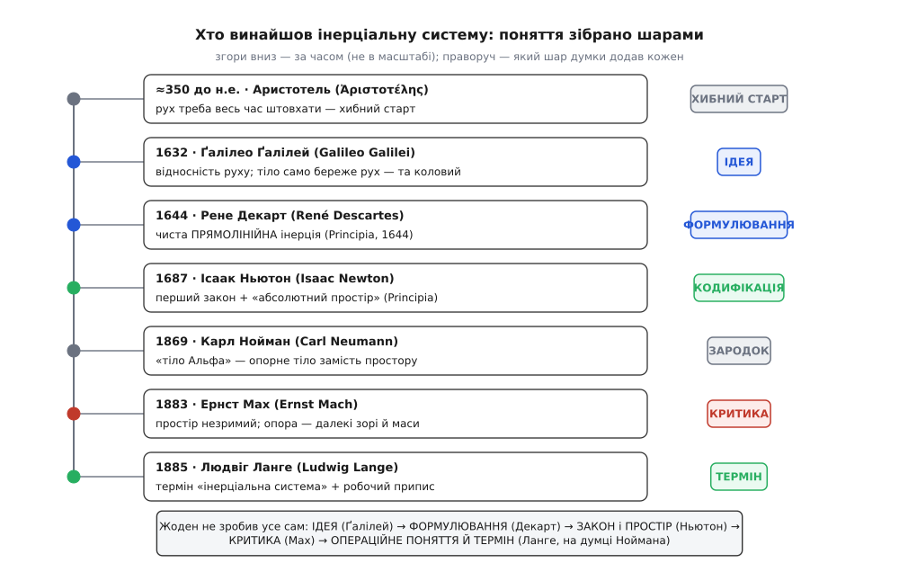

# 📜 Довга дорога до простої думки: як народилася інерціальна система

Сьогодні закон інерції вміщається в одне речення: облиш тіло — і воно збереже свій рух. Здається, тут нема чого відкривати: хіба це не видно кожному? Але саме ця думка дозрівала близько двадцяти двох століть, і не через тупість попередників. Річ у тім, що світ навколо нас **бреше** про рух. Усе, що ми пускаємо, зупиняється: візок стає, дзиґа лягає, кинутий камінь падає. Досвід кричить, що рух — це те, що треба весь час підтримувати, інакше воно згасне. Розгледіти за цим криком тихий закон — що насправді гальмує лише тертя, а сам собою рух не потребує нічого, — виявилося важче, ніж винайти важіль чи виміряти Землю.

А коли цю думку нарешті вхопили, з-під неї виглянуло питання ще глибше й підступніше: тіло зберігає рух — **відносно чого**? Прямо — у чиїх очах? Виявилося, що саме це, найтихіше з питань, і мучило фізику найдовше — від Ньютона до кінця XIX століття. Історія інерціальної системи — це насправді дві історії, вкладені одна в одну: як зрозуміли, що вільне тіло йде рівно, і як згодом усвідомили, що «рівно» саме по собі порожнє, доки не сказано, з якої системи дивишся. Розберімо, чиїми руками це складалося — бо жодна пара рук не зробила всього.

## Аристотель: світ, де рух треба весь час штовхати

Почнімо з того, проти чого довелося воювати. Грецький філософ Аристотель (Ἀριστοτέλης, 384–322 до н.е., родом зі Стагіри на півночі Греції) збудував найвпливовішу картину руху в історії — і майже в усьому хибну. Її стрижень: **усе, що рухається, рухається чимось** (лат. переказ схоластів — *omne quod movetur ab alio movetur*). Немає руху без діяча, що його безперервно підтримує. Природний стан тіла — спокій у своєму «місці»: камінь падає донизу, бо туди тягне його земна природа, дим лине вгору з тієї ж причини. Усе інше — рух «насильницький», і його треба гнати силою, доки та сила діє; забери її — тіло стане.

Тут Аристотель наткнувся на халепу, яку сам відчув: а чому летить кинутий камінь? Рука вже його полишила, штовхача поряд немає, — а він летить. За його ж власним законом камінь мав би впасти тієї ж миті, коли відірвався від долоні. Аристотель викрутився через повітря: рука штовхає не лише камінь, а й повітря перед ним; те повітря обтікає й змикається позаду, підпихаючи камінь далі (грец. *антиперистасис* — «взаємозаміщення»). Пояснення штучне, і сам він не був у ньому певен. Але картина в цілому — рух вимагає діяча — трималася майже два тисячоліття, бо чудово збігалася з буденним досвідом тертя. Це не дурість; це чесне узагальнення того, що бачиш щодня. Хиба в тім, що щоденне тертя видали за закон природи.

## Тріщина в стіні: імпетус

Першу серйозну тріщину пробив грекомовний александрієць Іоанн Філопон (Ἰωάννης ὁ Φιλόπονος, бл. 490–570, християнський учений, прозваний Граматиком). Він висміяв повітряний штовхач: якби рух підтримувало повітря, досить було б махнути позаду каменя дошкою — і він полетів би сам; насправді ж повітря радше **заважає**, ніж жене. Замість цього Філопон припустив, що кидач вкладає в саме тіло якусь **безтілесну рушійну силу**, яка й несе його далі, поволі вичерпуючись. Це вже інша логіка: причина руху сидить **у тілі**, а не в середовищі.

Через вісім століть цю думку розвинув і назвав французький богослов і природознавець Жан Бурідан (Jean Buridan, бл. 1301–1362, викладав у Паризькому університеті). Його **імпетус** (лат. *impetus* — «натиск, порив») — це вкладена в тіло величина, пропорційна його швидкості й кількості речовини в ньому. І головне нововведення Бурідана: сам собою імпетус **не вичерпується**. Тіло спиняє лише опір повітря й тягар, що тягне донизу; не було б опору — рух тривав би вічно. Звідси він зробив зухвалий висновок: небесні сфери, де опору немає, Бог розкрутив на початку, і відтоді вони крутяться самі, без ангелів-штовхачів.

Погляньте, як близько це до інерції: рух, що триває сам, без діяча, доки щось йому не завадить. І все ж це ще не вона. Імпетус мислили як **причину всередині тіла**, як паливо, вкладене й витрачуване; інерція ж — це не паливо, а сама відсутність потреби в паливі. Бурідан підійшов упритул, але лишився по інший бік межі: у нього рух і далі мав внутрішній двигун, просто невичерпний. Зробити останній крок — сказати, що рухові взагалі не потрібен двигун, — випало іншим.

## Ґалілей: корабель, похилі площини — і пастка колового руху

Цей крок зробив італієць (тосканець) Ґалілео Ґалілей (Galileo Galilei, 1564–1642, народжений у Пізі). Він перевернув саме питання. Не «що жене тіло?», а «що його **спиняє**?». Пускаючи кульку котитися вниз похилою площиною, а тоді вгору іншою, Ґалілей помітив: униз вона розганяється, угору гальмує, а якби площину зробити рівною, без нахилу, — кульці не було б причини ні розганятися, ні спинятися. На ідеально гладкій горизонталі вона котилася б **без кінця**. Уперше рух без діяча постав не як здогад, а як висновок із досліду, доведеного до межі: прибери тертя й нахил — і рух триватиме сам.

З цього самого кореня виросла й друга, ще глибша Ґалілеєва думка — про **відносність** руху. У «Діалозі про дві найголовніші системи світу» (*Dialogo sopra i due massimi sistemi del mondo*, 1632) вустами співрозмовника Сальвіаті він змалював славетний уявний дослід із кораблем. Замкніться в каюті під палубою разом із метеликами, рибами в мисці й краплями, що капають у посудину. Доки корабель пливе рівно, ви жодним домашнім дослідом не вгадаєте, стоїть він чи мчить: краплі падають так само прямовисно, риби плавають на всі боки однаково, метелики не збиваються до корми. Рівномірний рух **не має внутрішньої прикмети** — його не можна виявити зсередини. Цю рівноправність рівномірно рухомих систем згодом назвуть [принципом відносності](book:physics/galilean-relativity), і Ґалілей висловив його першим — за майже триста років до Айнштайна.

Але тут криється пастка, через яку Ґалілея не можна назвати повним автором інерції. Його «рух, що триває сам» був **горизонтальний**. А що таке горизонталь на кулястій Землі? Це не нескінченна пряма, а велике коло, що обгинає планету. Кулька на ідеально гладкій Землі, за Ґалілеєм, котилася б навколо неї — тобто по **колу**, а не по прямій у безмежжя. Його інерція лишилася прив'язана до земної поверхні, до колового руху, бо в його космосі «природним» без опору був саме рух навколо центру. Ґалілей звільнив рух від потреби в діячі — але не звільнив його від кривини Землі. Це не докір: він стояв на самій межі й дав головну ідею. Та ідея ще потребувала очищення.

## Декарт: чиста пряма

Очистив її француз Рене Декарт (René Descartes, 1596–1650, народжений у Ла-Е-ан-Турен). Він перший ясно сказав: полишене тіло йде **прямо** — по нескінченній прямій лінії, а не по колу й не навколо чогось. Кривина Землі тут ні до чого; пряма — це пряма.

Варто, однак, чесно назвати й того, з кого це почалося. Молодий Декарт 1618 року в нідерландському містечку Бреда заприятелював із голландцем Ісааком Бекманом (Isaac Beeckman, 1588–1637), який уже кількома роками раніше записав у щоденнику по суті сучасне формулювання інерції. Бекман запалив Декартову думку, а згодом лишився в її тіні — його ім'я знають куди менше, ніж він заслужив. Це типова доля історії науки: ідею часто першим вимовляє не той, чиє ім'я на ній осяде.

Своє вчення Декарт спершу виклав у трактаті «Світ» (*Le Monde*), дописаному близько 1633 року. Та щойно він почув про засудження Ґалілея Церквою того ж 1633-го, то злякався й **сховав рукопис у шухляду** — «Світ» вийшов друком аж 1664 року, по смерті автора. Тож світові свою пряму інерцію Декарт явив пізніше, у латинських «Началах філософії» (*Principia philosophiae*, 1644). Там серед «законів природи» стоять два, що разом і дають прямолінійну інерцію: перший — усяка річ зберігає свій стан, доки ніщо його не змінить; другий — **усякий рух сам собою прямолінійний**, а якщо тіло йде по колу, то воно повсякчас поривається геть від центру, і лише зовнішня причина загинає його на коло. Це вже точний, сучасний закон інерції — без домішки колового руху, без прив'язки до Землі. Декарт дав ідеї Ґалілея остаточну **форму**.

## Ньютон: закон і незриме тло

Далі на сцену виходить англієць Ісаак Ньютон (Isaac Newton, 1642/43–1727, народжений у Вулсторпі). У «Математичних началах натуральної філософії» (*Philosophiæ Naturalis Principia Mathematica*, 1687) прямолінійна інерція стає **першою аксіомою** всієї механіки — тим [першим законом](book:physics/newtons-first-law), із якого починається решта. Ньютон не вигадав інерцію — він відкрито будував на Ґалілеєві й Декарті, — але саме він поставив її як наріжний камінь строгої, математичної системи, з якої виводиться весь рух небес і землі. Це і є **кодифікація**: перетворення влучної думки на закон, на якому тримається будівля.

Кумедна деталь: обидві головні книги епохи звуться майже однаково. Декартові «Principia» (Начала філософії, 1644) і Ньютонові «Principia» (Математичні начала, 1687) — це два різні твори через сорок з лишком років, і молодший почасти виріс із критики старшого.

Але, ставлячи інерцію законом, Ньютон мусив відповісти на те найтихіше питання: тіло йде прямо **відносно чого**? І тут він зробив крок, за який його критикуватимуть наступні двісті років. Він постулював **абсолютний простір** — незриме, нерухоме тло, що, за його ж словами у Поясненні (Scholium) до означень, «за самою природою, без огляду на будь-що зовнішнє, лишається завжди однаковим і непорушним». Ось відносно нього рух і є «справді» прямий чи «справді» рівномірний. Щоб довести, що абсолютний рух існує не на словах, Ньютон навів дослід із **відром**: розкрутіть відро води на скрученому шнурі. Спершу відро крутиться, а вода ще стоїть — і поверхня її пласка. Згодом вода підхоплює обертання — і поверхня вигинається, лізе на стінки. Вода вигинається не тоді, коли рухається **відносно відра** (навпаки, найдужче вигнута вона тоді, коли крутиться разом із відром, нерухомо щодо нього), — отже, міркував Ньютон, вона відчуває своє обертання відносно чогось абсолютного, самого простору. Логіка залізна — якщо погодитися, що те «щось» справді є простір.

## Мах: проти порожнього простору

Ось цю поступку — незриме абсолютне тло — і атакував австрієць Ернст Мах (Ernst Mach, 1838–1916, народжений у моравському селі поблизу Брна, тоді Австрійська імперія). У книжці «Механіка в її розвитку, історично-критично викладена» (*Die Mechanik in ihrer Entwickelung*, 1883) він поставив Ньютонові просте й нищівне питання: а **як ти цей абсолютний простір побачиш**? Його не можна намацати, не можна виміряти швидкість відносно нього, не можна вказати на нього пальцем. Це метафізична вигадка, яку фізика ввела крадькома, а фізиці, за Махом, годиться говорити лише про рух тіл відносно **інших тіл**, а не відносно неспостережного ніщо.

Найгостріше Мах перечитав саме відро. Так, вода вигинається — але звідки їй знати, що вона крутиться? Не від порожнього простору, каже Мах, а від **усієї далекої речовини всесвіту** — від незліченних зір і галактик навколо. Вода вигинається, обертаючись відносно них. І тут Мах кинув думку, що виявилася провидницькою: якби навколо не було жодної далекої маси, у геть порожньому всесвіті, обертання не мало б сенсу й відцентрового вигину не було б. Сама **інерція**, за Махом, народжується від сукупної дії далеких мас (цю здогадку згодом назвуть **принципом Маха**). Абсолютний простір розчинявся — а на його місце ставала реальна, спостережна речовина неба.

Мах не дав готової нової механіки, і його принцип досі лишається радше глибокою гіпотезою, ніж доведеною теоремою. Але його критика зробила головне: вона показала, що «відносно чого» — не дрібниця, а серце питання, і що відповідь Ньютона незадовільна. Ця думка живила молодого Айнштайна, який відкрито називав Маха своїм філософським попередником, і через неї проросла [загальна теорія відносності](book:physics/general-relativity), де тяжіння взагалі перестає бути силою. А в практичній інженерії Махова правда лишилася й донині: коли треба найкраща опора для гіроскопів, її орієнтують по далеких зорях — по тому, що в масштабах усього неба практично не обертається.

## Нойман і Ланге: тіло Альфа й народження терміна

Лишалося зробити останнє — перетворити всю цю двохсотлітню суперечку на щось **робоче**: не «відносно абсолютного простору» (незриме) і не «відносно всіх зір усесвіту» (недосяжне для рахунку), а відносно чогось, що можна **насправді задати й перевірити**.

Перший підступ зробив німець Карл Нойман (Carl Neumann, 1832–1925, син відомого фізика Франца Ноймана). У вступній лекції в Лейпцизі 1869 року — «Про принципи Ґалілеє-Ньютонової теорії» (*Über die Principien der Galilei-Newton'schen Theorie*) — він запропонував замінити абсолютний простір на **опорне тіло**. Десь у всесвіті, казав Нойман, треба припустити якесь тіло — назвімо його **тілом Альфа** (нім. *Körper Alpha*), — відносно якого рух вільної частинки і є прямий; а ще десь мусить бути годинник, що задає рівномірний плин часу. Це був крок від метафізики до фізичного тіла-опори. Але критики одразу зауважили: а де ж це тіло Альфа, як його знайти? Воно вийшло майже таке саме загадкове, як і простір, що його заступало.

Останній, вирішальний крок зробив інший німець — Людвіг Ланге (Ludwig Lange, 1863–1936, народжений у Гісені). Року 1885 він зрозумів: **не треба нікуди йти шукати** особливе тіло. Систему відліку, у якій справджується інерція, можна **побудувати із самих вільних тіл**. Візьми одну вільну частинку, пущену з якоїсь точки, — вона задасть напрям. Візьми ще дві, пущені з тієї ж точки в інші боки. Підбери осі так, щоб усі три йшли прямими лініями. І тоді, доводив Ланге, будь-яка **четверта** вільна частинка теж піде в цій системі прямо й рівномірно — сама собою, як перевірний наслідок. Ось вона, інерціальна система: не постульоване тло й не таємниче тіло Альфа, а **припис**, рецепт, який можна виконати руками. Саме Ланге викував і сам термін — **інерціальна система** (нім. *Inertialsystem*), а разом із ним «інерціальний час», підхопивши Нойманову думку про годинник-опору й довівши її до операційної чіткості.

Двісті років — від Ньютона до Ланге — фізики користувалися законом інерції, до пуття не проговоривши, у якій же системі він виконується. Ланге дав цій системі і ясне ім'я, і спосіб її задати, не питаючи в природи дозволу.


*Ідея інерціальної системи складалася шарами, і кожен клав свій. Аристотель дав хибний старт (рух треба штовхати); Ґалілей — саму ідею (рух триває сам, системи рівноправні), але ще прив'язану до колового; Декарт — чисте прямолінійне формулювання; Ньютон — закон-аксіому й незриме абсолютне тло; Мах — критику цього тла; Нойман — зародок опорного тіла; Ланге — операційне поняття й сам термін. Порядок згори вниз — за часом, не в масштабі: між Аристотелем і Ґалілеєм лягли два тисячоліття, а між Нойманом і Ланге — шістнадцять років.*

## Хто ж винайшов інерціальну систему

Тепер видно, що на питання «хто винайшов інерціальну систему» чесної однослівної відповіді немає — і саме це найцікавіше. Поняття не блиснуло в одній голові; його **складали шарами**, і кожен шар клала інша рука, часто інша країна й інше століття.

```
Питання, що визрівало найдовше — «тіло йде прямо ВІДНОСНО ЧОГО?»
  Ньютон (1687):  відносно абсолютного простору        — незриме тло
  Мах    (1883):  відносно всіх далеких мас (зір)       — реальна речовина
  Ланге  (1885):  відносно системи з самих вільних тіл  — операційний припис
```

Розкладімо внесок начисто, бо саме в розрізненні — уся суть. **Ідею** — що рух триває сам, без діяча, і що рівномірні системи рівноправні, — дав Ґалілей (спираючись на давню тріщину Філопона й Бурідана), але лишив її ще коловою. **Чисте формулювання** — нескінченна пряма — дав Декарт (а до нього тихо намацав Бекман). **Кодифікацію** — інерцію як першу аксіому строгої механіки — дав Ньютон, доклавши до неї спірне абсолютне тло. **Критику** цього тла — що воно незриме, а справжня опора то далекі маси — дав Мах. А **операційне поняття й сам термін** — рецепт, як задати таку систему з самих вільних тіл, — дав Ланге, стоячи на плечах Ноймана.

Сім пар рук щонайменше — грек, грекомовний александрієць, француз, італієць, голландець, англієць, австрієць, двоє німців — і двадцять два століття від Аристотелевого хибного старту до терміна Ланге. І найдовше з усього дозрівала не сама відповідь, а **питання**: «прямо — відносно чого?». Його не бачили тисячоліттями, Ньютон відповів на нього незримим тлом, Мах показав, що тло непридатне, і аж Ланге дав відповідь, яку можна взяти й перевірити. Такою і є справжня наука: те, що ми нині пишемо в один рядок підручника, зазвичай зібране по цеглині багатьма, і кожну цеглину варто називати іменем того, хто її поклав.
