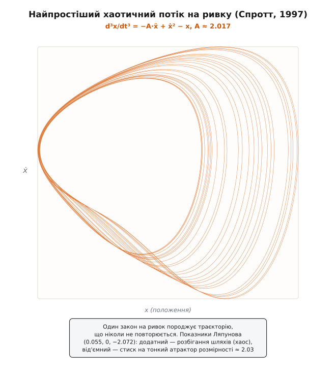

# Рівняння на ривок і поріг хаосу

<preknowlist>
- [Ривок](topic:physics/jerk) — третя похідна положення за часом (j = d³x/dt³), темп, з яким міняється прискорення.
- [Похідна](topic:math/derivative) — миттєва швидкість зміни величини; тут ідеться про те, як третя похідна пов'язана з нижчими.
</preknowlist>

Майже кожен закон руху, який вивчають першим, — другого порядку. Ньютонове рівняння пов'язує прискорення, тобто **другу** похідну положення, із силою: маятник, планета на орбіті, вантаж на пружині — усі вони підкоряються рівнянням, де найвища похідна друга. Такий рух буває заплутаний, але в глибині своїй **сумирний**: задай початкове положення й швидкість — і подальша траєкторія розписана наперед без несподіванок. Звідси природне питання: наскільки простим може бути гладкий детермінований закон, щоб рух за ним став **непередбачуваним назавжди** — тобто хаотичним? Відповідь несподівана: закон мусить дотягнутися рівно до третьої похідної — до ривка. Нижче хаос не заводиться.

Щоб побачити чому, запишімо спершу той закон, де головна дійова особа — ривок. Зазвичай ривок буває **наслідком**: його зчитують із готової траєкторії. Перевернімо залежність — нехай ривок цієї миті сам **задає** рух, дорівнюючи якійсь функції теперішнього положення, швидкості й прискорення. Це і є **рівняння на ривок** (англ. *jerk equation*):

```
d³x/dt³ = J(x, ẋ, ẍ)
```

На вигляд дрібниця — а на диво глибока річ. Уся її сила ховається в тому, що одне це рівняння третього порядку рівнозначне цілому маленькому світові — тривимірному руху.

## Одне рівняння третього порядку — це потік у трьох вимірах

Щоб розгледіти прихований у рівнянні простір, розберімо його на найпростіші цеглинки. Одне рівняння з третьою похідною завжди можна переписати трьома рівняннями, у кожному з яких лише **перша** похідна. Назвімо швидкість окремою змінною y, прискорення — змінною z; тоді «похідна y є z», «похідна z є ривок», а ривок задано законом:

```
ẋ = y
ẏ = z                    ⟺     d³x/dt³ = J(x, ẋ, ẍ)
ż = J(x, y, z)
```

Праворуч — те саме рівняння на ривок; ліворуч — **потік у тривимірному просторі станів** (x, y, z). Уяви точку з координатами «де я, як швидко рухаюсь, як швидко розганяюсь»: закон у кожному її положенні однозначно каже, куди їй повзти далі. Точка малює криву, повністю визначену теперішнім станом, — і ця крива є весь рух. Перетворення оборотне: будь-яку трійку таких автономних рівнянь так само згортають назад в одне рівняння на ривок. Отже, **тривимірний потік і рівняння на ривок — це один об'єкт у двох подобах**. Саме тому все, що можливе чи неможливе в русі точки по тривимірному просторі станів, дослівно переноситься на рівняння третього порядку.

## Драбина вимірів: чому хаос не вміщається нижче за три

Тепер видно, як поставити питання про хаос точно: у скількох вимірах має розгортатися потік, щоб траєкторія стала непередбачуваною? Пройдімо драбину знизу, вимір за виміром.

**Один вимір** (`ẋ = f(x)`) — точка повзе по прямій туди, куди показує знак f. Вона або доповзає до нерухомої точки, де f = 0, і спиняється, або тікає в нескінченність. Вона не вміє навіть коливатися: не може ж одна точка рухатись водночас праворуч і ліворуч. Нудно й до кінця передбачувано.

**Два виміри** (точка на площині) — тепер траєкторія вже вміє кружляти. Та її сковує топологія площини. Розв'язки автономної системи ніколи не перетинаються: крізь кожну точку проходить рівно одна траєкторія, бо закон у ній однозначний. А крива, що не сміє перетнути ні себе, ні сусідок і замкнена в обмеженому клапті площини, **просто не має де розгулятися**. Строго це стверджує теорема Пуанкаре — Бендіксона: обмежена траєкторія на площині, що нікуди не тікає, мусить або накрутитися на нерухому точку, або вийти на замкнену петлю — **граничний цикл**. Порядок тут накинутий не законом руху, а самою пласкістю: складатися нема куди.

**Три виміри** — і аж тепер траєкторія дістає простір скластися сама на себе, ні разу себе не перетнувши. Вона може розтягуватись в одному напрямі й підгортатися в іншому — те саме «розтягни й склади», що робить із тіста пекар, і що є підписом хаосу. Дві сусідні точки з часом розбігаються **експоненційно**: найдрібніша неточність у початковому стані роздувається, аж поки майбутнє стає невгадним — хоча закон лишається залізно визначеним. Ось чому мінімум для неперервного детермінованого хаосу — рівно **три змінні стану = одне рівняння третього порядку = одне рівняння на ривок**. Ривок не просто уживається з хаосом: він — найнижчий щабель, на якому хаос узагалі здатен устояти.


*Чому хаос починається саме з третього виміру. У одному вимірі (ліворуч) точка тільки сповзає до рівноваги. У двох (посередині) вона вміє кружляти, та теорема Пуанкаре — Бендіксона замикає її на нерухому точку чи граничний цикл — складатися нема куди. Лише у трьох вимірах (праворуч) траєкторія має простір нескінченно розтягуватись і підгортатися, не перетинаючи себе, — і зринає дивний атрактор. А три виміри — це рівно одне рівняння на ривок.*

## Найпростіший закон ривка, що дає хаос

Отже, третій порядок — необхідна умова хаосу. Та чи достатня вона, і яким мусить бути найскромніший закон, щоб хаос справді спалахнув? Питання в такій гострій формі 1996 року поставив Ганс Ґотліб у нотатці для American Journal of Physics, спитавши просто: «Яка найпростіша функція ривка дає хаос?» За рік Штефан Лінц дав перший ключ: він показав, що класичні хаотичні системи Лоренца й Рьосслера, коли виключити з них зайві змінні, зводяться саме до рівнянь на ривок. Тобто весь відомий звіринець дивних атракторів насправді був звіринцем законів ривка — тільки записаних інакше.

Пряму відповідь на питання Ґотліба дав того ж 1997 року Джуліен Клінтон Спротт із Вісконсинського університету. Він перебрав на комп'ютері безліч простих рівнянь на ривок і виловив серед них алгебраїчно найощадніше, що ще дає хаос:

```
d³x/dt³ = −A·ẍ + ẋ² − x,        A ≈ 2.017
```

або, тими самими трьома рівняннями першого порядку:

```
ẋ = y
ẏ = z
ż = −A·z + y² − x
```

Придивись, яке воно вбоге: п'ять доданків, одна-єдина нелінійність (той квадрат `y²`), один параметр A. Простіших рівнянь із квадратичною нелінійністю Спроттів перебір уже не знайшов — це найпростіший **відомий** хаотичний закон ривка, знайдений вичерпним пошуком, а не виведений із наперед заданої складної системи. Його траєкторія стягується на **дивний атрактор** — тонкий згорнутий аркуш, за формою близький до стрічки Мебіуса.


*Одна-єдина крива, накреслена рівнянням `d³x/dt³ = −A·ẍ + ẋ² − x`, простеженим на десятки тисяч кроків. Нитка ніколи не замикається й ніколи не перетинає себе — вона нескінченно розтягується й підгортається, вимальовуючи тонкий шаруватий атрактор. Це і є хаос: рух, наперед визначений до останньої коми, і все ж непередбачуваний назавжди.*

Наскільки саме він хаотичний, кажуть числа. Розбіжність сусідніх траєкторій міряють [показники Ляпунова](topic:math/lyapunov-stability) — темпи, з якими маленька відстань між двома близькими станами росте чи спадає вздовж кожного напряму. У цього руху вони приблизно (0.055, 0, −2.072):

```
λ₁ = +0.055    сусідні шляхи розбігаються як e^(0.055·t) — це й є хаос
λ₂ =  0        рух уздовж самої траєкторії — ні стиску, ні розбігу
λ₃ = −2.072    об'єм стягується на тонкий атрактор — це дисипація
```

**Додатний перший показник** — і є печаттю хаосу: розбіжність наростає нестримно. **Від'ємний третій**, набагато більший за модулем, стягує будь-який жмуток станів на тонкий атрактор — це прикмета дисипативної, «тертної» системи, що забуває, звідки стартувала. Сума всіх трьох від'ємна, тож фазовий об'єм тане; а от розмірність самого атрактора виходить **дробова**, приблизно 2.03 — трохи більша за поверхню, бо нескінченне підгортання додає атракторові крихту виміру понад звичайну площину. Дробова розмірність — підпис фрактала.

> 🔧 **Навіщо це.** Простота рівняння на ривок означає, що хаос можна не лише порахувати, а й спаяти. Три рівняння першого порядку прямо кладуться на аналогову схему: три інтегратори на операційних підсилювачах, один помножувач на квадрат — і на осцилографі оживає той самий атрактор. Такі «схеми на ривку» — найдешевше джерело справжнього, а не псевдовипадкового хаосу: їх ставлять як генератори шуму, як маскувальний сигнал для захищеного зв'язку й як стенд, де студент бачить чутливість до початкових умов на власні очі.

## Застереження: прихований третій вимір

Тут напрошується заперечення, і його варто зняти одразу. Хіба ж гойдалка, яку періодично підштовхують, не хаотична — а вона ж на позір «другого порядку», лиш кут та кутова швидкість? Хаотична, звісно. Але зовнішній штовхач тягне за собою **прихований третій вимір**: запиши фазу штовхання окремою змінною (вона рівномірно біжить по колу за годинником сили) — і система знову тривимірна та автономна. Правило «три виміри» чесно рахує й годинник зовнішньої сили. Обійти межу Пуанкаре — Бендіксона не вдається нікому: щойно перелічиш усі змінні до одної, гнана гойдалка теж живе рівно у трьох вимірах. Глибше про сам механізм розтягування-складання й про те, як він робить рух непередбачуваним, — у темі [детермінований хаос](topic:physics/deterministic-chaos).

Драбина похідних робить на третьому щаблі подвійний поворот. Знизу від нього рух приречений на сумирність: одновимірне сповзання до рівноваги чи двовимірна чиста петля — усе передбачуване назавжди. А на самому третьому щаблі відкриваються обидві крайнощі одразу. Віддай ривок під владу найскромнішого закону — дістанеш рух, що не повторюється ніколи, дивний атрактор. Постав протилежну вимогу, щоб сумарний ривок був якнайменшим, — і той самий щабель дасть [найплавнішу можливу траєкторію](topic:physics/jerk/math-higher-derivatives.md), гладкий рух руки чи верстата. Величина, що народжується зі смику ліфта під колінами, лежить рівно на межі між приборканою гладкістю і нескінченною дикістю: нижче за неї немає ні тієї, ні тієї, а починаючи з неї — обидві.
