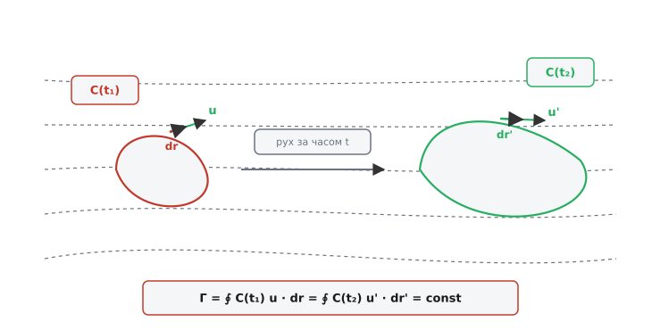
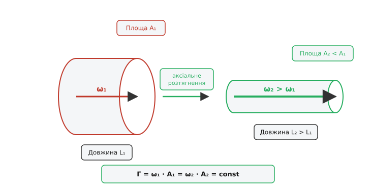
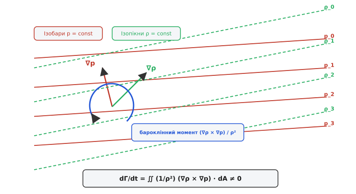
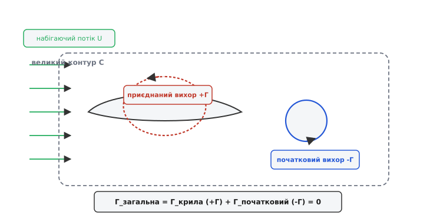

# Теорема Кельвіна про циркуляцію

<preknowlist>
- [Потенціальна течія](topic:physics/potential-flow) — безвихровий плин ідеальної рідини та потенціал швидкості.
- [Неперервність течії](topic:physics/flow-continuity) — закон збереження маси для суцільного середовища.
- [Рівняння Нав'є — Стокса](topic:physics/navier-stokes) — динамічні рівняння руху в'язкого середовища.
- [Теорема Жуковського про підйомну силу](topic:physics/circulation-lift-theorem) — зв'язок між циркуляцією швидкості та аеродинамічною силою.
- [В'язкість](topic:physics/viscosity) — внутрішнє тертя та дисипація кінетичної енергії.
</preknowlist>

Коли димове кільце виривається з отвору чи кратера вулкана, воно здатне долати десятки метрів у спокійному повітрі, зберігаючи чітку форму та обертальний рух усередині свого тонкого тороїдального ядра. Жорсткі тверді тіла зберігають свій момент імпульсу завдяки незмінності своєї атомарної решітки та фіксованій геометрії зв'язків. Проте у плинному середовищі рідкі частинки безперервно змінюють своїх сусідів, розтягуються, зсуваються та деформуються під дією градієнтів тиску. Постійність обертального руху всередині рідкої маси забезпечується фундаментальним інваріантом суцільного середовища — збереженням циркуляції швидкості вздовж рухомого контуру.

Теорема про циркуляцію швидкості, сформульована шотландським фізиком Вільямом Томсоном (лордом Кельвіном) у 1869 році, стверджує: у баротропному плині ідеальної рідини під дією потенціальних масових сил циркуляція швидкості вздовж будь-якого замкненого рідкого контуру зберігається в часі. Цей закон є гідродинамічним аналогом закону збереження моменту імпульсу в класичній механіці частинок. Він пояснює, чому вихори не можуть раптово виникати чи зникати всередині нев'язкого середовища, як утворюється підйомна сила на крилі літака, чому вихрові нитки вморожуються в плазму та яким чином у тривимірній турбулентності відбувається передача енергії від великих вихрових структур до дрібних scales.

Без теореми Кельвіна неможливо зрозуміти ані фізику аеродинамічного обтікання тіл, ані геофізичну динаміку атмосферних циклонів та океанських течій. Вона встановлює глибокий математичний зв'язок між топологією рухомих рідких ліній та динамікою локального обертання рідких елементів.

## Кинематика суцільного середовища та поняття рідкого контуру

Аналіз руху суцільного середовища вимагає чіткого розрізнення двох типів опису течії: Ейлерового та Лагранжевого. У підході Ейлера спостерігач фіксує векторне поле швидкостей `u(x, y, z, t)` у нерухомих просторових точках. У підході Лагранжа спостерігач стежить за індивідуальними рідкими частинками, поміченими початковими координатами `X`. Рідкий (або матеріальний) контур `C(t)` описується саме у Лагранжевій концепції: він складається з одних і тих самих матеріальних частинок рідини. У процесі плину середовища кожна частинка переміщується зі своєю локальною векторою швидкості `u(x, y, z, t)`, внаслідок чого сам контур безперервно змінює свою форму, орієнтацію та довжину в просторі, але завжди містить у собі ті самі фізичні частинки матерії.

У кінематиці гідродинамічних полів важливе значення мають три типи ліній:
- **Траєкторії (англ. *pathlines*)**: лінії, які описують шлях окремої рідкої частинки з часом.
- **Лінії течії (англ. *streamlines*)**: лінії, дотичні до яких у кожній точці в даний момент часу збігаються з вектором швидкості `u`.
- **Лінії току (англ. *streaklines*)**: лінії, утворені частинками, які послідовно пройшли через одну й ту саму фіксовану просторову точку.
У стаціонарній течії всі три типи ліній збігаються між собою, а рідкий контур `C(t)` деформується уздовж ліній течії.

Щоб зрозуміти внутрішній стан обертання рідкої маси, розглянемо кинематику малого елемента рідини. У довільному плині вектор швидкості рідкої частинки змінюється від точки до точки. Тензор градієнта швидкості `∂u_i / ∂x_j` розкладається на симетричну та антисиметричну частини:

```
∂u_i / ∂x_j = S_ij + Ω_ij
```

Симетрична частина `S_ij = (1/2) · (∂u_i / ∂x_j + ∂u_j / ∂x_i)` — це тензор швидкостей деформації, який описує лінійне розтягування та зсув елемента рідини без обертання. Антисиметрична частина `Ω_ij = (1/2) · (∂u_i / ∂x_j - ∂u_j / ∂x_i)` являє собою тензор обертання, який характеризує чисто кутову швидкість обертання частинки як жорсткого цілого навколо її власного центра мас.

Вектор завихреності або ротор поля швидкостей `ω` (грец. *vortex* — вихор) пов'язаний з тензором обертання і визначається як:

```
ω = ∇ × u
```

У декартовій системі координат три компоненти вектора вихровості виражаються через частинні похідні компонент швидкості:

```
ω_x = ∂u_z / ∂y - ∂u_y / ∂z
ω_y = ∂u_x / ∂z - ∂u_z / ∂x
ω_z = ∂u_y / ∂x - ∂u_z / ∂y
```

Якщо у розглянутій області вектор вихровості дорівнює нулю (`ω = 0`), плин називається безвихровим або потенціальним. Відсутність вихровості означає, що кожна окрема частинка рідини під час руху не має власного кутового обертання навколо своїх внутрішніх осей, хоча сама макроскопічна траєкторія її руху в просторі може бути вигнутою.

Циркуляція швидкості `Γ` (грец. *gamma*) виражається замкненим криволінійним інтегралом від скалярного добутку вектора швидкості течії `u` на елементарний векторний орієнтований відрізок контуру `dr` (лат. *circulatio* — обертання, коловий рух):

```
Γ = ∮[C(t)] u · dr
```

У декартовій системі координат інтеграл розгортається у скалярну суму трьох компонент швидкості та координатних диференціалів:

```
Γ = ∮[C(t)] (u_x · dx + u_y · dy + u_z · dz)
```

Фізично циркуляція характеристики сумарну обертальну інтенсивність потоку вздовж заданого контуру. Якщо потік рухається переважно вздовж лінії контуру, циркуляція набуває великого додатного чи від'ємного значення. Якщо ж швидкість перпендикулярна до елементів контуру або потік є однорідним трансляційним переносом, циркуляція вздовж замкненої петлі дорівнює нулю.


*Деформація рідкого контуру C(t) у часі під дією поля швидкостей. Незважаючи на зміну геометричної форми контуру від t₁ до t₂, контурний інтеграл швидкості Γ залишається незмінним.*

Математичний зв'язок між циркуляцією вздовж замкненої лінії `C(t)` та локальним обертальним рухом рідини всередині охопленої області встановлюється за допомогою теореми Стокса із векторного аналізу. Якщо на замкнений контур `C(t)` натягнути довільну орієнтовану поверхню `S(t)`, то контурний інтеграл швидкості дорівнює потоку ротора швидкості (вихровості `ω = ∇ × u`) через цю поверхню:

```
Γ = ∮[C(t)] u · dr = ∬[S(t)] (∇ × u) · dA = ∬[S(t)] ω · dA
```

Тут `dA = n · dA` — векторний елемент площі поверхні, орієнтований за правилом правого гвинта відносно напрямку обходу контуру `C(t)`. Таким чином, циркуляція є інтегральною мірою завихреності середовища: вона дорівнює сумарній інтенсивності всіх вихрових ниток, які пронизують поверхню `S(t)`.

## Повний математичний вивід теореми Кельвіна

Для доведення збереження циркуляції обчислимо повну похідну по часу від криволінійного інтеграла `Γ(t)` вздовж рідкого контуру `C(t)`. Оскільки сам контур переміщується і деформується разом із рідиною, диференціювання під знаком інтеграла вимагає врахування зміни як вектора швидкості `u`, так і самого елемента довжини `dr`:

```
dΓ/dt = d/dt ∮[C(t)] u · dr
      = ∮[C(t)] (du/dt) · dr + ∮[C(t)] u · d(dr)/dt
```

Розглянемо другий доданок підінтегрального виразу. Елемент контуру `dr` являє собою різницю радіус-векторів двох нескінченно близьких рідких частинок: `dr = r_2 - r_1`. Похідна по часу від цієї відстані дорівнює різниці швидкостей цих частинок: `d(dr)/dt = u_2 - u_1 = du`. Підставляючи цей результат, отримуємо:

```
∮[C(t)] u · d(dr)/dt = ∮[C(t)] u · du
```

Скалярний добуток `u · du` є повним диференціалом від половини квадрата модуля швидкості: `u · du = d(u² / 2) = d(u_x² + u_y² + u_z²) / 2`. Інтеграл від повного диференціала безнеперервної скалярної функції по замкненому контуру тотожно дорівнює нулю, оскільки початкова та кінцева точки обходу збігаються:

```
∮[C(t)] u · du 
= ∮[C(t)] d(u² / 2)                              [заміна u·du на повний диференціал]
= (u² / 2)|_початок - (u² / 2)|_кінець            [теорема про інтегрування диференціала]
= 0                                              [збіг значень у замкненій точці]
```

Отже, швидкість зміни циркуляції визначається виключно інтегралом від індивідуального прискорення рідких частинок `du/dt`:

```
dΓ/dt = ∮[C(t)] (du/dt) · dr
```

Для визначення прискорення частинок скористаємося рівнянням руху ідеальної (нев'язкої) рідини — рівнянням Ейлера. Нехай на середовище діють лише консервативні масові сили з питомим скалярним потенціалом `Φ` (наприклад, гравітаційне поле, де сила на одиницю маси `f = -∇Φ`). Рівняння Ейлера має вигляд:

```
du/dt = - (1 / ρ) · ∇p - ∇Φ
```

Підставимо вираз для прискорення з рівняння Ейлера у формулу зміни циркуляції:

```
dΓ/dt = ∮[C(t)] (- (1 / ρ) · ∇p - ∇Φ) · dr
      = - ∮[C(t)] (1 / ρ) · ∇p · dr - ∮[C(t)] ∇Φ · dr
```

Другий доданок `- ∮ ∇Φ · dr = - ∮ dΦ` являє собою контурний інтеграл від градієнта скалярної функції `Φ`. За фундаментальною теоремою векторного аналізу інтеграл від градієнта по замкненому контуру дорівнює нулю.

Розглянемо перший доданок `- ∮ (1 / ρ) · ∇p · dr = - ∮ (dp / ρ)`. У загальному випадку величина `1 / ρ` не є постійною. Проте за припущенням теореми Кельвіна рідина є баротропною (грец. *baros* — вага, *tropos* — поворот, напрям). У баротропній рідині густина середовища залежить виключно від тиску: `ρ = ρ(p)`. Це виконується для нестисливих рідин (`ρ = const`), ізотермічних або адіабатичних ідеальних газів (`p = C · ρ^γ`).

Для баротропного середовища підінтегральний вираз `dp / ρ(p)` можна записати як повний диференціал функції тиску (або питомої ентальпії) `P(p)`:

```
P(p) = ∫[p_0->p] (dp' / ρ(p'))
```

Звідси випливає, що `dP = dp / ρ`. Підставляючи це у контурний інтеграл, отримуємо:

```
dΓ/dt 
= - ∮[C(t)] dP - ∮[C(t)] dΦ                      [вираження через повні диференціали dP та dΦ]
= - ∮[C(t)] d(P + Φ)                             [об'єднання диференціалів]
= 0                                              [інтеграл повного диференціала по замкненому контуру]
```

Оскільки похідна циркуляції по часу тотожно дорівнює нулю (`dΓ/dt = 0`), циркуляція швидкості вздовж будь-якого рідкого контуру залишається постійною під час усього плину середовища:

```
Γ(t) = ∮[C(t)] u · dr = const
```

Це і є математичний зміст **теореми Кельвіна про циркуляцію**.

## Гідродінамічні наслідки: теореми Гельмгольца та «вмороженість» вихрових ліній

З теореми Кельвіна випливає низка фундаментальних законів поведінки завихреності у нев'язких середовищах, вперше сформульованих Германом фон Гельмгольцем у 1858 році.

```
Теорема Кельвіна (dΓ/dt = 0)
 ├── Збереження безвихровості (якщо ω = 0 спочатку → ω = 0 завжди)
 ├── «Вмороженість» вихрових ліній у рідке середовище
 ├── Збереження інтенсивності вихрової трубки (Γ = ω · A = const)
 └── Аксіальне розтягнення вихру (підсилення завихреності при звуженні)
```

### 1. Збереження безвихрового стану
Якщо в деякий початковий момент часу `t = 0` плин рідини в певній області був безвихровим (`ω = ∇ × u = 0`), то циркуляція `Γ` вздовж будь-якого замкненого контуру в цій області дорівнювала нулю. За теоремою Кельвіна `Γ(t) = 0` для всіх наступних моментів часу. Це означає, що потенціальна течія ідеальної рідини не може самочинно згенерувати вихори усередині об'єму середовища без участі в'язкого тертя або поверхневих розривів.

### 2. «Вмороженість» вихрових ліній
Вихровою лінією називається крива, дотична до якої в кожній точці напрямлена вздовж вектора вихровості `ω`. Сукупність вихрових ліній, що проходять через замкнений контур, утворює вихрову трубку. З теореми Кельвіна випливає, що вихрові лінії рухаються разом із частинками рідини — вони ніби «вморожені» (англ. *frozen-in*) у матерію середовища. Якщо якась частина рідких частинок утворює вихрову нитку в момент `t_1`, ті самі частинки утворюватимуть ту саму вихрову нитку в будь-який наступний момент `t_2`.

### 3. Неперервність та збереження інтенсивності вихрової трубки
Інтенсивністю вихрової трубки називається циркуляція `Γ` вздовж контуру, що охоплює цю трубку. Оскільки `Γ` є константою вздовж усієї довжини трубки і не змінюється у часі, вихрові трубки не можуть закінчуватися або починатися всередині об'єму рідини. Вони мусять бути або замкненими у кільця (як димові кільця чи тороїдальні вихори), або виходити на межі області течії (на поверхню твердого тіла чи на нескінченність).

### 4. Аксіальне розтягнення вихру та каскад турбулентності
Розглянемо вихрову трубку з поперечним перерізом `A` та середньою завихреністю `ω`, орієнтованою уздовж її осі. Інтенсивність трубки дорівнює `Γ = ω · A = const`. При деформації потоку вихрова трубка може розтягуватися уздовж своєї осі під дією зовнішніх градієнтів швидкості.


*Ефект розтягнення вихрової трубки у тривимірному плині. Збільшення довжини L₂ при деформації рідкого об'єму зменшує площу поперечного перерізу A₂, що призводить до пропорційного підсилення завихреності ω₂ для збереження постійної циркуляції Γ.*

Якщо довжина елемента вихрової трубки збільшується від `L_1` до `L_2` (`L_2 > L_1`), то через збереження об'єму нестисливої рідини (`V = A · L = const`) площа поперечного перерізу зменшується: `A_2 = A_1 · (L_1 / L_2)`. Оскільки циркуляція `Γ = ω · A` є постійною за теоремою Кельвіна, локальна завихреність повинна зрости у стільки ж разів:

```
ω_2 = ω_1 · (A_1 / A_2) = ω_1 · (L_2 / L_1)
```

Ефект розтягнення вихрових трубок є фундаментальним тривимірним механізмом перекачування кінетичної енергії в турбулентних потоках. Інваріант сумарної завихреності в об'ємі характеризується енстрофією `Ω_ens = (1/2) ∭ ω² dV`. У тривимірній турбулентності аксіальне розтягнення вихрів безперервно збільшує енстрофію, передаючи енергію від великих вихрових структур до дрібних scales аж до досягнення колмогоровського масштабу дисипації `η = (ν³ / ε)^(1/4)`, де молекулярне тертя остаточно перетворює кінетичну енергію вихору у теплоту. У двовимірних течіях розтягнення вихрових ліній математично неможливе (`L = const`), тому 2D-турбулентність має зворотний енергетичний каскад — від дрібних вихорів до великих структур.

Для глибшого занурення в історичні спроби використати незмінність топології вихрових ліній Кельвіна для пояснення будови матерії дивіться вставку [📜 Гіпотеза вихрових атомів Кельвіна та народження топологічної фізики](topic:physics/kelvin-circulation-theorem/hist-vortex-atom.md).

## Обмеження теореми та механізми генерації завихреності

У реальних фізичних системах умови теореми Кельвіна часто порушуються. Аналіз цих порушень дозволяє виявити фундаментальні фізичні механізми створення та дисипації вихрів.

### 1. В'язка дисипація та дифузія завихреності

У реальних рідинах із ненульовою в'язкістю (`ν > 0`) рівняння руху Нав'є — Стокса містить дотичні в'язкі напруження `ν · ∇²u`. Застосовуючи операцію ротора до рівняння Нав'є — Стокса, отримуємо рівняння переносу вихровості у в'язкому середовищі:

```
∂ω/∂t + (u · ∇)ω = (ω · ∇)u + ν · ∇²ω
```

Правий доданок `ν · ∇²ω` описує молекулярну дифузію завихреності. Похідна циркуляції по часу для в'язкої рідини більше не дорівнює нулю:

```
dΓ/dt = ν · ∮[C(t)] ∇²u · dr = ν · ∮[C(t)] (∇ × ω) · dr
```

В'язкість спричиняє дифузію вихровості через поверхню рідкого контуру. Головним джерелом генерації вихровості у в'язкому плині є тверді стінки з умовою прилипання (`u = 0`). Усередині тонких примежових шарів біля поверхні обтіканого тіла в'язкість створює сильний зсув швидкостей, генеруючи велику завихреність, яка згодом відривається від стінки у вигляді вихрових доріжок (вихори Кармана).

### 2. Бароклінний момент (теорема Б'єркнеса)

Якщо середовище не є баротропним, тобто його густина залежить як від тиску, так і від температури або концентрації домішок (`ρ = ρ(p, T)`), інтеграл `∮ (dp / ρ)` більше не дорівнює нулю. 

Застосовуючи теорему Стокса до виразу прискорення у бароклінній рідині, отримуємо **теорему Б'єркнеса**:

```
dΓ/dt = ∬[S(t)] (1 / ρ²) · (∇ρ × ∇p) · dA
```

Векторний добуток `(∇ρ × ∇p) / ρ²` називається бароклінним моментом завихреності. Якщо поверхні постійного тиску (ізобари) та поверхні постійної густини (ізопікни) перетинаються під кутом, виникає плавуча сила, яка прагне повернути рідкі шари і генерує обертальний рух.


*Бароклінний момент та перетин ізобар (p = const) з ізопікнами (ρ = const). Градієнти тиску та густини раптом утворюють неколінеарні вектори, векторний добуток яких генерує обертальну циркуляцію.*

Бароклінний механізм є головним рушієм великомасштабної циркуляції в атмосфері та океанах Землі. Наприклад, у денний час суходіл нагрівається сонячним випромінюванням швидше за море. Повітря над сушею розширюється і стає менш щільним, створюючи горизонтальний градієнт густини `∇ρ`, тоді як градієнт тиску `∇p` спрямований переважно вертикально. Виникаючий бароклінний момент генерує замкнену циркуляцію повітря — денний морський бриз.

Детальне математичне виведення теореми Б'єркнеса та практичний розрахунок бризової циркуляції наведено у вставці [🧮 Теорема Б'єркнеса та бароклінна генерація циркуляції](topic:physics/kelvin-circulation-theorem/math-bjerknes-derivation.md).

### 3. Непотенціальні сили та системи відліку, що обертаються

Якщо на рідину діють непотенціальні масові сили (наприклад, сила Лоренца у електропровідній плазмі `f = (j × B) / ρ`), вони безпосередньо створюють джерело циркуляції: `dΓ/dt = ∮ (j × B / ρ) · dr`.

У системі відліку, що обертається з кутовою швидкістю `Ω` (наприклад, на планеті Земля), рівняння руху містить переносне прискорення Коріоліса `- 2 (Ω × u)`. Теорема Кельвіна виконується для **абсолютної циркуляції** `Γ_abs`, яка є сумою відносної циркуляції `Γ_rel` та циркуляції переносного руху Землі:

```
Γ_abs = Γ_rel + 2 · Ω · A_perp = const
```

де `A_perp` — площа проекції рідкого контуру на площину екватора. Якщо рідкий контур зміщується від екватора до полюса (де площа `A_perp` змінюється), його відносна циркуляція `Γ_rel` мусить змінитися для збереження `Γ_abs`. Цей ефект пояснює виникнення гігантських атмосферних циклонів, антициклонів та геострофічних хвиль Росбі.

### 4. Потенціальна завихреність Ертеля та геофізичні хвилі

У геофізичній гідродінаміці узагальненням теореми Кельвіна для обертових стратифікованих середовищ є інваріант потенціальної завихреності Ертеля (Hans Ertel, 1942 рік). Для скалярного інваріанта `λ` (наприклад, потенціальної температури `θ` в адіабатичній атмосфері) величина:

```
PV = (1 / ρ) · (ω + 2Ω) · ∇λ = const
```

зберігається для кожного рідкого елемента. Цей закон визначає динаміку великомасштабного струминного течії (англ. *jet stream*) у тропосфері та збереження океанічних вихорів-ринги під час перетину підводних хребтів.

### 5. Ударні хвилі та дисконтинууми (теорема Крокко)

У надзвукових газових течіях при проходженні викривленої ударної хвилі виникають сильні стрибки ентропії. За теоремою Крокко градієнт ентропії `∇s` генерирує завихреність навіть у нев'язкому безнеперервному газі: `u × ω = T ∇s - ∇h_0`. Це призводить до виникнення вихрових структур у спутному потоці за вигнутими скачками ущільнення.

У лінійній акустиці стисливі акустичні хвилі малій амплітуди є потенціальними (`ω = 0`). Генерація звуку вихорами описується акустичною аналогією Пауелла — Лійтхілла, де вихровий член `ω × u` слугує квадрупольним джерелом звукових хвиль у квадрупольному випромінюванні шуму авіаційних турбін.

## Застосування в аеродинаміці, геофізиці та суміжних галузях

### 1. Виникнення підйомної сили та початковий вихор крила

Класична аеродинаміка базується на теоремі Жуковського, згідно з якою підйомна сила на одиницю розмаху крила дорівнює `L' = ρ · U · Γ`, де `Γ` — приєднана циркуляція навколо аеродинамічного профілю. Проте виникає фундаментальне питання: якщо нерухомий літак починає розганятися у спокійному безвихровому повітрі (де початкова циркуляція навколо будь-якого великого контуру тотожно дорівнювала нулю `Γ_total = 0`), звідки береться ненульова циркуляція навколо крила?

Відповідь дає теорема Кельвіна.


*Утворення початкового вихру при русі аеродинамічного профілю. Загальна циркуляція вздовж охоплюючого контуру C залишається рівною нулю завдяки взаємній компенсації приєднаної циркуляції крила (+Γ) та скинутого початкового вихру (-Γ).*

1. **Старт із стану спокою**: До початку руху середовище спокійне, `Γ_total = 0`.
2. **Формування зсувного шару**: На початку руху потенціальний плин обтікає гостру задню кромку крила з нескінченною швидкістю. В'язке тертя у тонкому примежовому шарі змушує потік відриватися від задньої кромки.
3. **Зрив початкового вихру**: Зсувний шар згортається біля задньої кромки у так званий початковий вихор (англ. *starting vortex*) із циркуляцією `-Γ`. Цей вихор відривається і залишається позаду у спутному струмені.
4. **Утворення приєднаної циркуляції**: Оскільки великий контур `C`, що охоплює і літак, і відірваний початковий вихор, складається з рідких частинок неушкодженого зовнішнього середовища, за теоремою Кельвіна сумарна циркуляція мусить залишитися рівною нулю:
   ```
   Γ_total = Γ_крила + Γ_початковий = Γ_крила + (-Γ) = 0  ⇒  Γ_крила = +Γ
   ```
Отже, навколо профілю виникає рівна за модулем і протилежна за знаком приєднана циркуляція `+Γ`, яка й забезпечує створення аеродинамічної підйомної сили.

> 🔧 **Навіщо це.**
> Розуміння теореми Кельвіна має критичне значення при проектуванні літальних апаратів та розрахунках аеродинамічного спутного traces. Початкові та кінцеві концеві вихори (англ. *wingtip vortices*), які сходять із крил важких пасажирських лайнерів, зберігають свою інтенсивну циркуляцію протягом десятків кілометрів позаду літака саме завдяки повільній в'язкій дисипації циркуляції. Це вимагає дотримання суворих часових інтервалів безпеки між зльотами та посадками літаків у сучасних аеропортах.

### 2. Магнітогідродинаміка та теорема Альфвена

У физиці плазми та астрофізиці еквівалентом теореми Кельвіна є **теорема Альфвена про вмороженість магнітного поля** (Ханнес Альфвен, 1942 рік). У високопровідному середовищі (ідеальній плазмі з нескінченною провідністю `σ -> ∞`) магнітний потік `Φ_B = ∬ B · dA` через будь-який замкнений рідкий контур зберігається в часі:

```
dΦ_B / dt = 0
```

Магнітні силові лінії поводяться так само, як вихрові лінії у теоремі Кельвіна — вони виявляються повністю «вмороженими» у рідку плазму. Це пояснює утворення сонячних плям, магнітних трубок у сонячній короні та збереження магнітних полів у процесі гравітаційного колапсу зірок при утворенні нейтронних зірок та магнітарів.

### 3. Чисельні методи та алгоритми відстеження

У чисельному моделюванні течій суцільного середовища (CFD) теорема Кельвіна слугує фундаментальним тестом для перевірки точності та відсутності схематичної дисипації обчислювальних алгоритмів.

Для ознайомлення з практичною чисельною реалізацією алгоритму відстеження рідкого контуру та перевірки циркуляції дивіться вставку [⚙️ Чисельне відстеження рідкого контуру та обчислення циркуляції](topic:physics/kelvin-circulation-theorem/proj-vortex-tracker.md).

Специфікацію розробленого програмістського інтерфейсу соловера вихровості та інструментів діагностики циркуляції наведено у вставці [📋 Інтерфейс соловера вихровості та збереження циркуляції](topic:physics/kelvin-circulation-theorem/api-vorticity-solver.md).
