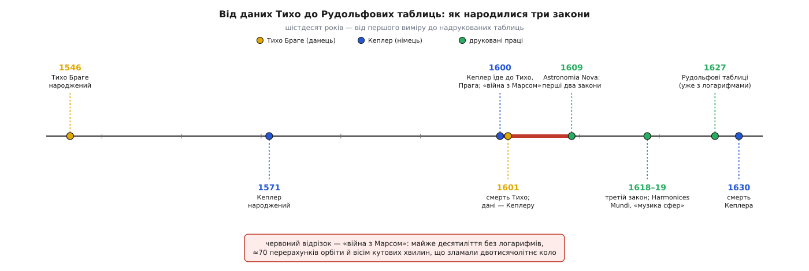

# 📜 Війна з Марсом: як вісім кутових хвилин зламали двотисячолітнє коло

Два тисячоліття небо мало бути досконалим, а досконалість означала коло. Так казав Платон, так навчав Арістотель, так рахував Птолемей: планета мусить рухатися колом, бо коло — єдина крива без початку й кінця, гідна вічних світил. Коли кола не сходилися зі спостереженнями, до них додавали ще кола — епіцикли, деференти, екванти, — і машина розросталася, але сама віра в коло не хиталася ніколи.

Зламала її одна планета, один упертий німець і розрив завширшки вісім кутових хвилин — менше за чверть видимого Місяця. Історія цього злому — не про осяяння, а про виснажливу лічбу, яку Кеплер сам назвав війною. І перше, що потрібно було для тієї війни, — набій точних чисел, якого доти не існувало.

## Данець, який виміряв небо голим оком

Числа дав Тихо Браге (Tycho Brahe, 1546–1601) — данський шляхтич, народжений у замку Кнудструп у Сконе, тоді данській, а нині шведській землі. Півжиття він щоночі наводив на планети великі мідні квадранти й секстанти власного виробу і записував їхні положення з точністю, якої до нього не досягав ніхто: його похибка трималася десь коло однієї-двох кутових хвилин, тоді як у попередників — на порядок гірша, хвилин по десять-п'ятнадцять *(усталено)*. Робив він це голим оком: Тихо помер 1601-го, за вісім років до того, як Галілей наведе на небо першу трубу. Уся ця гострозорість була чисто механічна — величезні прилади, ретельність і десятиліття терпіння.

Кеплер приїхав до нього під Прагу 1600 року — Тихо на той час був імператорським математиком при дворі Рудольфа II. Стосунки складалися важко: старий данець беріг свої записи, як скарб, і видавав молодому помічникові дані по краплі, побоюючись, що той розгадає влаштування неба сам і перехопить славу *(усталено)*. Усе змінила раптова смерть. 24 жовтня 1601 року Тихо помер після одинадцяти днів хвороби, і вже за два дні Кеплер став його наступником на посаді імператорського математика. Скарб опинився в руках єдиної людини, здатної ним скористатися.

Дісталися записи Кеплерові не зовсім чесно. За власним зізнанням у листі 1605 року, він, скориставшись відсутністю спадкоємців Тихо, «взяв спостереження під свою руку — а може, й привласнив їх» *(усталено, з листа самого Кеплера)*. Тяжба з родиною Браге за ці папери тяглася роками й затримала друк його головної книги. А пізніша легенда пішла ще далі — буцімто Кеплер отруїв учителя ртуттю заради даних. Це **міф**: ексгумація Тихо 2010 року показала, що ртуті в кістках замало, щоб убити, і смерть радше природна — від затримки сечі й уремії *(спростовано, дослідження 2012 року)*. Кеплер узяв дані — але не вбивав за них.

*Шлях завдовжки в шістдесят років — від першого виміру Тихо до надрукованих таблиць, у яких три закони нарешті стали інструментом.*



## Чому небо не корилося: намісна гіпотеза

З усього неба Тихо доручив Кеплерові саме Марс — і не випадково. Марс має найбільший ексцентриситет серед добре видимих планет, його орбіта найдужче відходить від кола, а тому саме він давав найбільші розбіжності й ганьбив усі моделі *(усталено)*. Це був найважчий супротивник, і Кеплер самовпевнено пообіцяв упоратися за вісім днів. Війна забрала майже п'ять років.

Спершу здалося, що перемога близька. Кеплер збудував модель, яку сам назвав **намісною гіпотезою** (лат. *hypothesis vicaria*): планета біжить колом, а рух її вимірюється рівномірним обертанням довкола особливої точки — екванта. Підібравши цю конструкцію під дванадцять протистоянь Марса, він домігся дивовижного: передбачені довготи планети збігалися зі спостереженнями Тихо з точністю до двох кутових хвилин — рівно на межі того, що Тихо взагалі міг виміряти *(усталено)*. Здавалося, орбіту знайдено.

Пастка була в тому, що модель, ідеально вгадуючи *напрямок* на Марс, брехала про його *відстань* від Сонця. Коли Кеплер перевірив, наскільки далеко планета має бути в різних точках, числа не збіглися. А варто було перелаштувати коло так, щоб воно давало правильні відстані, — як довготи знову розповзалися, і то найгірше в октантах, на півдорозі між найближчою й найдальшою точками, де розрив сягав **восьми кутових хвилин** *(усталено)*. Двоє вимог — правильний напрямок і правильна відстань — не вживалися в жодному колі одночасно.

Це була справжня облога. Кеплер рахував орбіту знову і знову; у самій «Новій астрономії» він зізнається читачеві, що пройшов усю виснажливу процедуру «щонайменше сімдесят разів», і додає, що не дивно, чому «минув уже п'ятий рік, відколи я взявся за Марс» *(усталено, з тексту Astronomia Nova)*. І весь цей вал множень та ділень він гнав стовпчиком, на папері.

> 🔧 **Навіщо це.** [Логарифми](topic:math/logarithms) — спосіб замінити множення додаванням: замість перемножувати два довгих числа, додаєш їхні логарифми й береш зворотне перетворення, і багатоденний обрахунок стискається в години. Кеплерові в його війні з Марсом їх бракувало: Джон Непер надрукує логарифми аж 1614 року, а до Кеплера вони дійдуть тільки 1617-го *(усталено)*. Уся «війна» велася голими руками; логарифми прийдуть надто пізно, щоб її полегшити, — але саме вчасно, щоб через двадцять років допомогти скласти підсумкові таблиці.

Тому й «Нова астрономія» вийшла такою незвичною книгою: Кеплер не викреслив своїх глухих кутів, а лишив їх усі, як щоденник битви. Він перепробував і яйцеподібні овали, і десяток інших кривих, перш ніж дійти до еліпса, — і еліпс з'являється лише під кінець, у передостанніх розділах *(усталено)*. Книга читається не як теорема, а як звіт розвідника, що навпомацки шукає прохід.

## Вісім хвилин

Тут і сталося головне рішення всієї історії. Вісім кутових хвилин — це мізер. Але подивімося, наскільки мізер:

```
1° = 60′  (кутових хвилин)
8′ = 8/60° ≈ 0.13°
повний Місяць на небі  ≈ 31′   →   8′ ≈ ¼ поперечника Місяця
похибка приладів Тихо  ≈ 1–2′  →   8′ учетверо-увосьмеро більше
```

Ось у чому вся сила. Восьми хвилин око з вулиці не помітить, це чверть Місяця. Але Тихо не помилявся на вісім хвилин — його межа була дві. Отже, ті зайві шість хвилин **не могли бути похибкою спостереження**: вони були реальні. А якщо розрив реальний і жодне коло його не закриває — виходить, хибне саме коло. Кеплер довірився числам Тихо більше, ніж двотисячолітній вірі, і виніс колу вирок. Він сам записав це так: ці вісім хвилин «самі проклали шлях до перебудови всієї астрономії» *(усталено, Astronomia Nova)*.

Замість кола постав еліпс — витягнута крива, у якої Сонце сидить не в центрі, а в одному з двох фокусів. Разом із нею Кеплер тримав у руках і друге правило, про рівні площі за рівний час; історично він намацав закон площ навіть раніше, ніж остаточну форму орбіти, а звичне впорядкування «перший закон, другий закон» приклали заднім числом уже нащадки *(усталено)*. Обидва правила вийшли друком 1609 року в книзі з викличною назвою — *Astronomia Nova*, «Нова астрономія». Двотисячолітнє коло впало через чверть Місяця.

## Музика сфер і третій закон

Кеплер ніколи не був холодним обчислювачем — під панциром лічби жив містик, переконаний, що Творець збудував світ за музичними й геометричними співзвуччями. Ще замолоду він намагався пояснити розміри планетних орбіт вкладеними одна в одну правильними многогранниками. Ця віра в приховану гармонію не відпускала його — і саме вона, а не холодний розрахунок, привела до третього закону.

Через десять років після «Нової астрономії», 1619-го, вийшла книга з промовистою назвою *Harmonices Mundi* — «Гармонія світу». У ній Кеплер шукав буквальну **музику сфер**: він порівняв, наскільки прудкіше планета мчить у найближчій до Сонця точці, ніж у найдальшій, і виявив, що відношення цих швидкостей лягають на музичні інтервали *(усталено)*.

```
Земля:    mi – fa – mi   (півтон, 16:15)   ← жарт Кеплера: MI-seria, FA-mes
                                              «біда й голод» — рівна нудна орбіта
Венера:   майже один тон (24:25)           ← орбіта майже кругла
Меркурій: найширший діапазон               ← найвитягнутіша орбіта, «сопрано»
```

Земля, за Кеплером, тягне тоскне «мі-фа-мі», і він не втримався від каламбуру: ці ноти — то *MIseria* й *FAmes*, «біда» й «голод», доля мешканців нудно-рівної орбіти *(усталено)*. Марс співає тенором, Юпітер із Сатурном гудуть басами, а прудкий Меркурій зі своєю найвитягнутішою орбітою бере найширший діапазон, як сопрано.

Серед цих співзвуч і сховався третій закон — сухий числовий зв'язок `T² ∝ a³` між часом обороту планети й розміром її орбіти. Кеплер вважав його дату священною і назвав її сам: 8 березня 1618 року. Щоправда, того дня він через помилку в обрахунку вирішив, що зв'язок хибний, і відкинув його; лише 15 травня 1618-го, перерахувавши, він побачив, що все сходиться, і повірив остаточно *(усталено, за його ж свідченням у Harmonices Mundi)*. Число, яке однаково править усіма планетами Сонця, він почув як ноту в загальній гармонії — і мав рацію, хоч підстава під нею виявиться зовсім не музичною, а гравітаційною, і чекатиме на Ньютона ще вісімдесят років.

## Рудольфові таблиці

Була ще й земна, буденна винагорода за всю ту війну. Головним обов'язком Кеплера-математика лишалося скласти точні планетні таблиці — і 1627 року вони нарешті вийшли під назвою **Рудольфові таблиці**, на честь покійного імператора Рудольфа II *(усталено)*. Ось тут йому вже допомогли логарифми Непера: те, що в роки війни з Марсом він рахував стовпчиком тижнями, тепер стискалося в години.

І таблиці склали найсуворіший з усіх іспитів — передбачили майбутнє. Кеплер вирахував, що 1631 року Меркурій пройде видимою цяткою просто по диску Сонця. Сам він до того не дожив — помер 1630-го, — але 7 листопада 1631 року П'єр Ґассенді навів трубу й побачив Меркурій там, де вказали таблиці: перший в історії спостережений прохід планети по Сонцю *(усталено)*. Точність, витягнута з упертих восьми хвилин, справдилася на небі через рік після смерті свого автора.

Тож відділімо в цій історії тверде від легенди. Що Кеплер узяв дані Тихо не зовсім чесно — усталено, з його власного листа. Що вісім хвилин зламали коло, а дати відкриттів такі, як названо, — усталено, бо це його ж свідчення в надрукованих книгах. А от що він отруїв учителя — **міф**, спростований ексгумацією. Лишається головне: три правила, витягнуті з гори чисел терпінням і довірою до восьми кутових хвилин, які інший списав би на похибку. Саме та відмова заплющити очі на дрібний розрив і перетворила астрономію з каталогу коліщат на точну науку.
